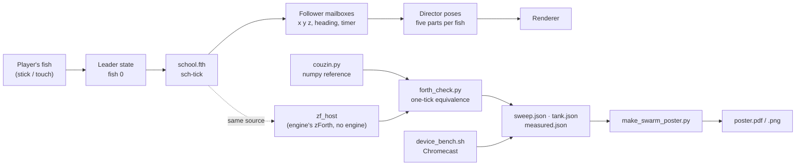
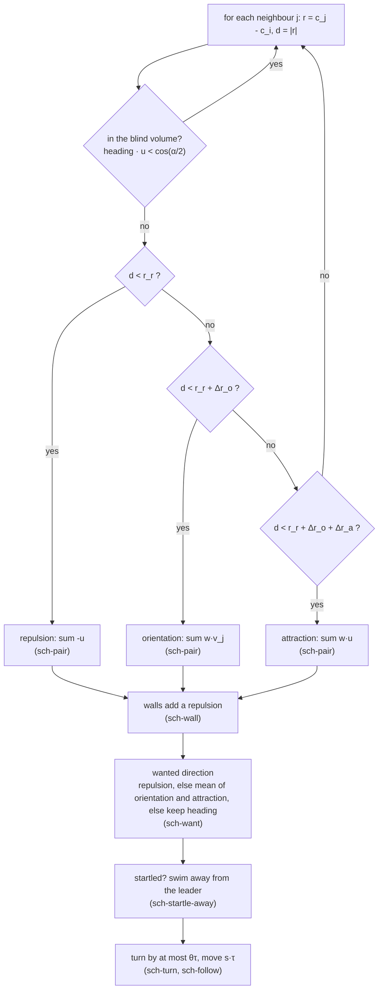
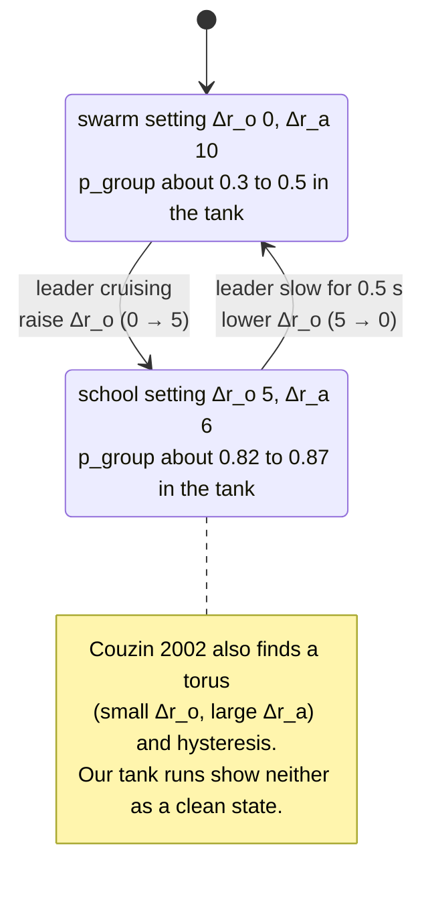

# An A3 poster for swarming, and the Forth core it prints

Status: **built and verified** (2026‑10‑01); the numbers on it are measured, and what is **not** measured is printed on the poster itself.

- [x] Phase A: research the model (Couzin et al. 2002, read from the PDF) and write it as a numpy reference
- [x] Phase B: the Forth core, `wflevels/aquarium/school.fth`, tested against the reference in the engine's own zForth
- [x] Phase C: the zone-width sweep, the tank runs, the size, error and timing measurements
- [x] Phase D: the poster (data sheet with chips, generator, A3 PDF/PNG), tests, Taskfile tasks
- [ ] Phase E: the Forth timed **inside the engine** (needs the schooling plan's Phase 0); the leader weight tuned

## Request

The user asked for **an A3 poster for swarming, similar to the fish poster**, and then: **"how big is the forth implementation? update plan: include all (or the core part of it) on the poster"**, and **"update plan: add diagrams!!!"**.

The Forth implementation did not exist when the second question was asked, so the honest answer was "nothing yet". It was written, run, and measured so the poster could print real numbers. The poster is [`docs/reference/swarming-poster/poster.pdf`](../reference/swarming-poster/poster.pdf) ([PNG](../reference/swarming-poster/poster.png), [HTML](../reference/swarming-poster/poster.html)), built from the same kind of data sheet as the [clownfish biomechanics poster](2026-09-30-clownfish-biomechanics-poster.md) and sharing its helpers.

[](2026-10-01-swarming-poster/poster.html)

## How big is the Forth?

Measured, not estimated ([`measured.json`](../reference/swarming-poster/measured.json)):

| What | Value |
|---|---|
| Source | 119 lines, 79 of them code (the rest is comments), 7.3 KB |
| In the zForth dictionary | **2,179 bytes** of the 65,536 available (3.3 %), 33 words |
| Biggest words | `sch-turn` 283 B, `sch-pair` 240 B, `sch-follow` 211 B, `sch-want` 201 B |
| One step, 11 fish (10 followers and the leader) | **6.2 ms on the Chromecast HD** (median of 3 runs of 200 ticks); 7.0 ms on this PC |
| Per follower | about 0.6 ms |
| Against the numpy reference, one tick | position error 3e‑04 body lengths, heading error 1e‑03 (the engine's sine is 0.2 % off) |

**What was not measured:** the same code *inside the engine*. The 6.2 ms is the engine's own zForth interpreter (the same vendored source, the same float cells) driven by a standalone host with the mailboxes as a plain array; inside the game each mailbox access goes through the object manager, so expect more. That is Phase 0 of [the schooling plan](2026-10-01-aquarium-schooling.md), and the poster says so.

## Diagrams

How the pieces connect (the green boxes are the proposed game code, the amber ones are tools and measurements that exist now):



The rule each follower runs, one tick (the words in `school.fth` are in the boxes):



The two settings the game switches between (a plain change of one zone width, no second rule set), and what the paper says about the states:



And the frame budget, drawn to the measured number ([mockup](2026-10-01-swarming-poster/frame-budget.html)):

[](2026-10-01-swarming-poster/frame-budget.html)

[](2026-10-01-swarming-poster/data-flow.html)

## What the research and the measurements found

Everything on the poster has a chip: **verified** (the source was opened and the number is on its page), **unverified** (a summary, or not opened), **ours** (our maths or measurement).

1. **The model and its parameters are from the paper (verified).** [Couzin et al. 2002](https://jmvidal.cse.sc.edu/library/couzin02a.pdf), read from the PDF: N = 100, r_r = 1, α = 270°, θ = 40°/s, s = 3, σ = 0.05, 30 replicates. The paper's Fig. 3 **does not print the zone widths of its four snapshots**, so the poster's four states use widths chosen from our own sweep and says so.
2. **Our sweep reproduces the paper's map in shape (ours).** Swarm at Δr_o ≈ 0, torus at Δr_o ≈ 1 with a large Δr_a, parallel groups above, fragmentation at small widths. It used 3 replicates and 700 steps per cell (the paper used 30), and the **same zones gave a torus in one seed and a parallel group in another** (Δr_o = 3, Δr_a = 10), which fits the paper's "sharp transitions" but means the poster's map has a `?` class.
3. **Hysteresis was not reproduced (ours).** The paper reports it. Our two ladder sweeps (350 steps per rung, one run) were too coarse to show a loop, and the poster says so rather than claim it.
4. **The paper's turning rate does not fit a tank (ours, measured).** At 3 body lengths a second and 40° a second, a 90° turn takes 6.75 body lengths and a 4.3 body-length radius; the real tank is **13.4 × 3.4 × 4.7 body lengths inside** (47 × 12 × 16.5 in at a 3.5 in fish), only 3.4 deep. In the tank runs the fish left the box. The settings used here are **2 body lengths a second and 120° a second** (radius 0.95), with a 0.6 body-length wall zone. These are ours, and the plan's earlier numbers (metres at ×10) are replaced by body lengths.
5. **The followers school; the leader steers weakly (ours, measured).** In the tank, the school setting reaches p_group 0.82 to 0.87 and keeps 3.2 to 3.8 body lengths from the leader, but their heading **aligns with the leader's only +0.12 to +0.18** whatever the leader weight (1, 3 or 6). In open space, with the leader flying straight, followers that start far away **never rejoin** (the zones have a finite reach). Both say the leader term needs real tuning in Phase 2; none of it is tuned yet.
6. **The "torus" and "swarm" settings do not give clean states with 11 fish (ours, measured).** The swarm setting gave p_group 0.27 to 0.51 (not about 0.1) and the torus setting 0.58 to 0.64 (not a low p_group): the paper's states are for 100 fish, and 11 is at the edge of its range. The poster labels the tank panels "settings", not states, for that reason. Several swarm and torus runs also strayed more than 0.5 body lengths outside the box (shown as "no" in the table).
7. **A dart (startle) works, briefly (ours, measured; one seed).** Followers within 4 body lengths swim away for 0.5 s; the median distance to the leader rises from about 2.3 to about 5.7 body lengths within 3 s for the swarm and torus settings, and recovers within about 8 s. For the school setting the trace is too noisy to see it. A better metric is a Phase 2 task.
8. **Real clownfish do not school (unverified, secondary sources).** Ten schooling clownfish is a game mechanic, as the schooling plan already says.

## Files

All under [`docs/reference/swarming-poster/`](../reference/swarming-poster/) unless noted.

| File | What it is |
|---|---|
| `wflevels/aquarium/school.fth` | the Forth core: Couzin zones, leader weight, walls, startle, regime blend |
| `couzin.py` | the numpy reference model (the paper's rules; ours are labelled) |
| `zf_host.c`, `zfhost.py` | the engine's zForth, built standalone, with mailboxes; `T` times a command |
| `forth_check.py`, `tank_trial.py`, `tank_results.py` | one-tick equivalence; the Forth in the tank's real box; the poster's tank figures |
| `sweep.py` | the zone-width map and the hysteresis ladders |
| `measure.py`, `bench_cmds.py`, `device_bench.sh` | size per word, error, x86 and Chromecast timing |
| `swarm_data.py`, `make_swarm_poster.py` | the data sheet with chips; the generator (reuses the clownfish poster's helpers) |
| `tests/test_swarming.py` | 26 tests (below); `task test-swarming`, `task poster-swarming`, `task swarming-measure` |

## Verification

The steps are the spec; each shows its raw output.

1. The Forth core equals the numpy reference, one tick at a time.

    ```
    $ python3 docs/reference/swarming-poster/forth_check.py
    school.fth compiled to 2179 bytes of dictionary
    60 one-tick comparisons: position error median 2.9e-04 max 3.0e-04; heading error median 9.8e-04 max 1.0e-03
    ticks with heading error > 0.05: []
    ```

    **PASS**. (Compared one tick at a time from the same state: over many ticks float32 rounding flips zone boundaries and the two diverge, as any chaotic model does.)

2. The tests.

    ```
    $ python3 -m pytest tests/test_swarming.py -q
    ..........................                                               [100%]
    26 passed in 14.09s
    ```

    **PASS**: the paper's parameters; a torus has high m_group, a highly parallel group p_group near 1; the Forth compiles in the engine's zForth; equals numpy (also with a strong, turning leader); headings stay unit length and finite in the tank; a startle sends the near followers away and its timer counts down; the poster has no text under 8 pt, WCAG AA contrast, no external reference, links equal to the data sheet, the page fits, and the committed HTML is current.

3. The Forth on the real device (Chromecast HD, armeabi‑v7a), cross-compiled with the NDK.

    ```
    $ docs/reference/swarming-poster/device_bench.sh 192.168.4.38:41447
    device: Chromecast HD armeabi-v7a
    6.1023 ms
    6.1285 ms
    6.0588 ms
    ```

    **PASS** for "the interpreter runs the core at about 6 ms for 11 fish". **Not verified: inside the engine** (Phase E).

4. The Forth in the tank's real box (mean of 3 seeds; `align` is the alignment of the followers' heading with the leader's).

    ```
    mode   w  dist(BL) align  p     in-box
    swarm  1  2.7      +0.02  0.27  True
    swarm  3  2.8      -0.12  0.40  False
    swarm  6  2.5      +0.07  0.51  False
    torus  1  3.4      -0.05  0.58  True
    torus  3  2.3      +0.24  0.64  False
    torus  6  2.3      +0.31  0.61  False
    school 1  3.8      +0.12  0.87  True
    school 3  3.5      +0.17  0.84  True
    school 6  3.2      +0.18  0.82  True
    ```

    **PARTIAL**: the school setting keeps fish in the box and polarised; the swarm and torus settings do not give clean states and sometimes leave the box (finding 6).

5. The poster is one A3 page with embedded fonts.

    ```
    $ pdfinfo docs/reference/swarming-poster/poster.pdf | grep -E "Pages|Page size"
    Pages:           1
    Page size:       841.92 x 1191.12 pts (A3)
    $ pdffonts docs/reference/swarming-poster/poster.pdf | head -4
    name                                 type              encoding         emb sub uni object ID
    AAAAAA+NotoSans-Bold                 CID TrueType      Identity-H       yes yes yes      4  0
    BAAAAA+NotoSans-Regular              CID TrueType      Identity-H       yes yes yes      5  0
    ```

    **PASS**.

6. The Forth inside the engine, and the leader weight tuned. **PENDING** (schooling plan, Phases 0 and 2).

## Out of scope

- Wiring `school.fth` into the aquarium level: that is [the schooling plan](2026-10-01-aquarium-schooling.md). This plan produced the evidence its Phase 0 asks for (size, cost, parameters, the tank's real depth).
- A C++ fallback: the measured 6.2 ms (about 0.6 ms a follower, spread over frames) does not force one. The in-engine measurement can.

## Cost

None: local computation, one NDK cross-compile, one short run on the Chromecast over adb.

## Delegation

| Work | Tier | Why |
|---|---|---|
| Reading the paper, choosing what to claim, the Forth core, the measurements, the poster | T5 | done inline: every claim depends on what was actually found |
| Re-running `task swarming-measure` after a change | T1 | a known recipe |
