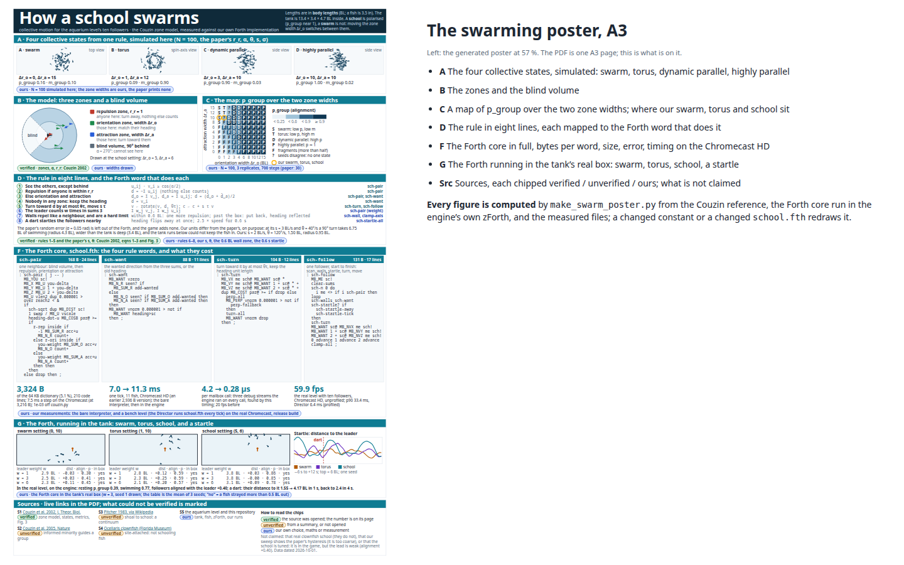
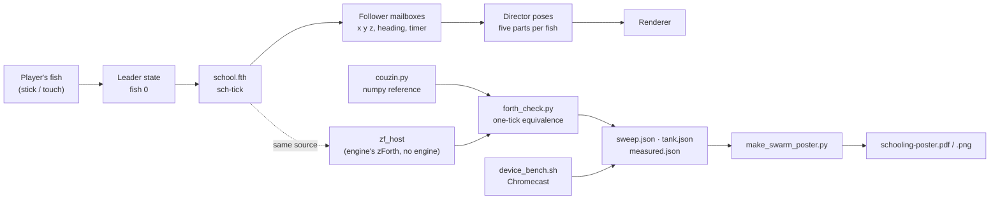
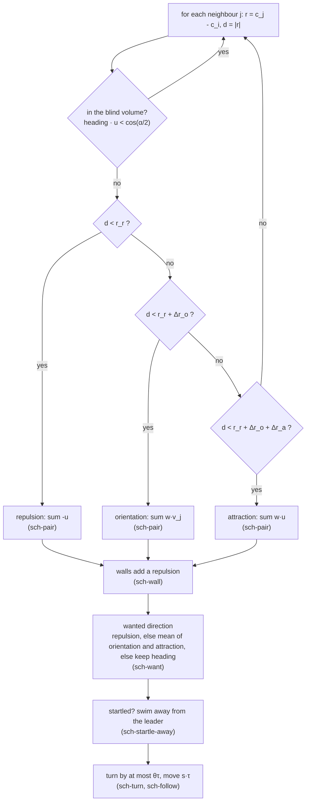
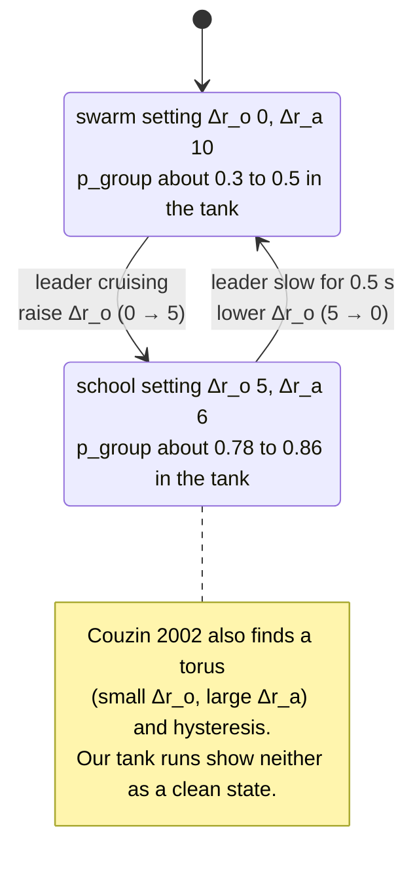
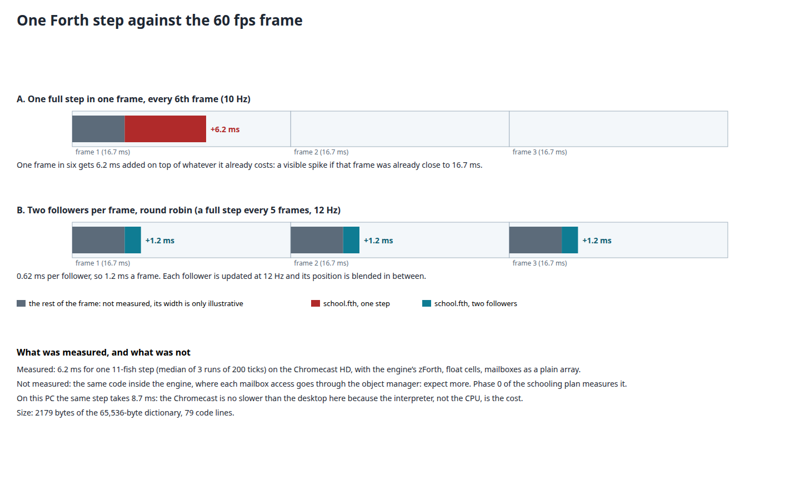
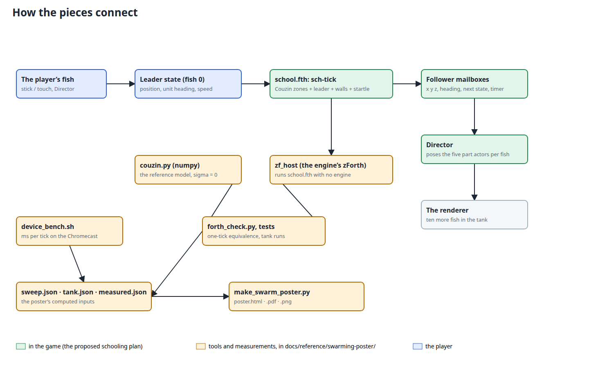
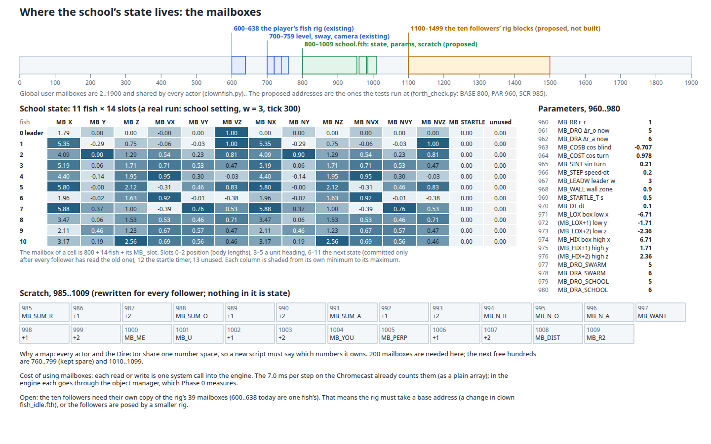
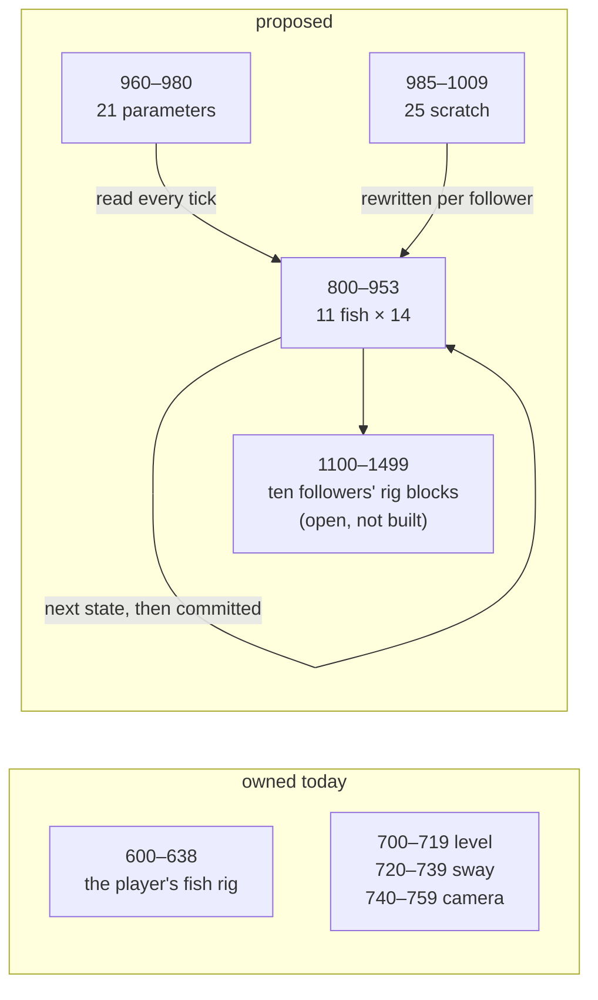

# An A3 poster for swarming, and the Forth core it prints

Status: **built and verified** (2026‑10‑01), **printed** (2026‑10‑06); the numbers on it are measured, and what is **not** measured is printed on the poster itself.

- [x] Phase A: research the model (Couzin et al. 2002, read from the PDF) and write it as a numpy reference
- [x] Phase B: the Forth core, `wflevels/aquarium/school.fth`, tested against the reference in the engine's own zForth
- [x] Phase C: the zone-width sweep, the tank runs, the size, error and timing measurements
- [x] Phase D: the poster (data sheet with chips, generator, A3 PDF/PNG), tests, Taskfile tasks
- [x] Phase E step 1 (**the Forth timed inside the engine, on the Chromecast: done 2026‑10‑01, and it found an engine bug, below**)
- [ ] Phase E (**the point of all of this**): wire `school.fth` into the aquarium level: ten more fish that school and swarm round the player's fish. The work is the [schooling plan](2026-10-01-aquarium-schooling.md)'s Phases 0 to 4; phases A to D above are the evidence and the tested core it is built on. In order: time the core inside the engine (Phase 0), make the fish rig per-fish and add the ten fish (Phase 1, which also settles the follower-rig mailboxes), connect the player's fish as the leader and the mode switch (Phase 2), tune the leader weight (Phase 2), then polish, tests and the Chromecast (Phases 3 and 4)

## Request

The user asked for **an A3 poster for swarming, similar to the fish poster**, and then: **"how big is the forth implementation? update plan: include all (or the core part of it) on the poster"**, and **"update plan: add diagrams!!!"**.

The Forth implementation did not exist when the second question was asked, so the honest answer was "nothing yet". It was written, run, and measured so the poster could print real numbers. The poster is [`schooling-poster.pdf`](../reference/swarming-poster/schooling-poster.pdf) ([PNG](../reference/swarming-poster/schooling-poster.png), [HTML](../reference/swarming-poster/schooling-poster.html)), built from the same kind of data sheet as the [clownfish biomechanics poster](2026-09-30-clownfish-biomechanics-poster.md) and sharing its helpers.

[](2026-10-01-swarming-poster/poster.html)

## How big is the Forth?

Measured, not estimated ([`measured.json`](../reference/swarming-poster/measured.json)):

| What | Value |
|---|---|
| Source | 254 lines, 202 of them code (the rest is comments), about 11.5 KB |
| In the zForth dictionary | **3,324 bytes** of the 65,536 available (5.1 %), 76 words (including the named slots)|
| Biggest words | `clamp-axis` 189 B, `sch-pair` 168 B, `sch-follow` 131 B, `sch-startle-all` 123 B, `sch-wall` 107 B |
| One step, 11 fish (10 followers and the leader) | **7.3 ms on the Chromecast HD** (median of 3 runs of 200 ticks; the poster prints only Chromecast timings) |
| Per follower | about 0.73 ms |
| Against the numpy reference, one tick | position error 3e‑04 body lengths, heading error 1e‑03 (the engine's sine is 0.2 % off) |

**Named slots (the user's request).** Every number that used to be a bare index (`3 cur sch@`, `1 par@`, `19 sc!`) is now a name with an `MB_` prefix (`MB_VX me sch@`, `MB_DRO par@`, `MB_YOU sc!`), the long lines were split into short helper words, and the slots are documented once at the top of the file. The prefix stays because the dictionary is shared by every script in the level: a bare `X` or `ME` could silently shadow another script's word. It cost something, measured: the first version was 2,179 bytes and 6.2 ms a step; the named one with its hard wall limit is **3,324 bytes and 7.3 ms** (with the wall limit and the dart's fast start) (each name is a word call, not an inline literal), still equal to the numpy reference to the same 1e‑03. The poster's Forth panel shows the named code.

**Inside the engine** it is a different story, and a more useful one: see [Phase E step 1](#phase-e-step-1-the-forth-inside-the-engine-on-the-chromecast). The 7.3 ms above is the engine's own zForth driven by a standalone host with the mailboxes as a plain array; in the game the same step took 39 to 43 ms until an engine bug was fixed, and takes 11.3 ms now (the Director also poses the fish and the camera).

## Diagrams

How the pieces connect (the green boxes are the proposed game code, the amber ones are tools and measurements that exist now):



The rule each follower runs, one tick (the words in `school.fth` are in the boxes):



The two settings the game switches between (a plain change of one zone width, no second rule set), and what the paper says about the states:



And the frame budget, drawn to the measured number ([mockup](2026-10-01-swarming-poster/frame-budget.html)):

[](2026-10-01-swarming-poster/frame-budget.html)

[](2026-10-01-swarming-poster/data-flow.html)

## Mailboxes: where the state lives

The engine's scripts keep state in **global user mailboxes** (2 to 1900, shared by every actor, per `clownfish.py`). `school.fth` needs **200**: 11 fish × 14 (800 to 953), 21 parameters (960 to 980) and 25 scratch cells (985 to 1009). They fit beside what the aquarium already owns, and the tests run at exactly these addresses (`forth_check.py`: `BASE` 800, `PAR` 960, `SCR` 985). The picture below is **drawn from a real run** (the school setting in the tank, tick 300): every cell is the value the Forth left in that mailbox.

[](2026-10-01-swarming-poster/mailboxes.html)



**Open:** the ten followers need their own copy of the rig's 39 mailboxes (600 to 638 are one fish's). Either the rig takes a base address (a change in `clownfish_idle.fth`) or the followers get a smaller rig. This is not built and not measured, and the cost of the extra mailbox traffic is part of the in-engine timing (Phase 0 of the schooling plan).

## Phase E step 1: the Forth inside the engine, on the Chromecast

A bench level (the level builder with `AQUARIUM_SCHOOL_BENCH=1`; git-ignored, `wflevels/aquarium_bench`) has the Director also run `school.fth` for 11 fish every tick. An opt-in `--script-profile` flag (engine, off by default) prints, every 5 s, the time each actor's script takes and the mean cost of a mailbox call. Built as a release APK in a throwaway worktree (armeabi‑v7a only) and run on the real Chromecast HD:

| Build | Director script per tick | Mailbox call | Frames |
|---|---|---|---|
| bench, engine as it was | **39 to 43 ms** | **4.2 µs** | **20 fps** (median 50 ms) |
| bench, after the fix below | **11.3 ms** (worst 20 ms) | **0.28 µs** (includes the profiler's own timer) | **59.9 fps**, p90 33.4 ms |
| standalone interpreter, no engine (above) | 7.3 ms | a plain array | n/a |

**The engine bug.** One step makes about 7,750 mailbox calls (counted: 6,046 reads, 1,708 writes). At 4.2 µs each that is 34 ms of the 39. The cause: three debug-stream statements in the mailbox read path, `cmailbox << … << std::endl` in `LevelMailboxes::ReadMailbox`, `GameMailboxes::ReadMailbox` (`wfsource/source/game/mailbox.cc`) and `WorldFoundryMailboxesManager::LookupMailboxes` (`level.cc`), were at level `DBSTREAM1`, and the CMake build defines `SW_DBSTREAM=1` for **every** configuration, Android release included. `dbstrm.hp` itself says DBSTREAM1 is "nothing in the game loop (startup and shutdown only)". Moving the three to `DBSTREAM5` compiles them out. It speeds up every script on every platform, not only this one. Regression guard: [`tests/test_mailbox_hot_path.py`](../../tests/test_mailbox_hot_path.py) fails if a streaming macro below level 5 returns to a mailbox read or write function.

**What it leaves.** 11.3 ms of Director is still a lot of a 16.7 ms frame: the worst frames reach 33 ms. The plan's own answer applies: update **two followers a frame** (about 1.4 ms) instead of all ten in one frame. That is the next piece (Phase 1 to 2), and the in-engine number to beat.

## What the research and the measurements found

Everything on the poster has a chip: **verified** (the source was opened and the number is on its page), **unverified** (a summary, or not opened), **ours** (our maths or measurement).

1. **The model and its parameters are from the paper (verified).** [Couzin et al. 2002](https://jmvidal.cse.sc.edu/library/couzin02a.pdf), read from the PDF: N = 100, r_r = 1, α = 270°, θ = 40°/s, s = 3, σ = 0.05, 30 replicates. The paper's Fig. 3 **does not print the zone widths of its four snapshots**, so the poster's four states use widths chosen from our own sweep and says so.
2. **Our sweep reproduces the paper's map in shape (ours).** Swarm at Δr_o ≈ 0, torus at Δr_o ≈ 1 with a large Δr_a, parallel groups above, fragmentation at small widths. It used 3 replicates and 700 steps per cell (the paper used 30), and the **same zones gave a torus in one seed and a parallel group in another** (Δr_o = 3, Δr_a = 10), which fits the paper's "sharp transitions" but means the poster's map has a `?` class.
3. **Hysteresis was not reproduced (ours).** The paper reports it. Our two ladder sweeps (350 steps per rung, one run) were too coarse to show a loop, and the poster says so rather than claim it.
4. **The paper's turning rate does not fit a tank (ours, measured).** At 3 body lengths a second and 40° a second, a 90° turn takes 6.75 body lengths and a 4.3 body-length radius; the real tank is **13.4 × 3.4 × 4.7 body lengths inside** (47 × 12 × 16.5 in at a 3.5 in fish), only 3.4 deep. In the tank runs the fish left the box. The settings used here are **2 body lengths a second and 120° a second** (radius 0.95), with a 0.6 body-length wall zone. These are ours, and the plan's earlier numbers (metres at ×10) are replaced by body lengths.
5. **The followers school; the leader steers weakly (ours, measured).** In the tank, the school setting reaches p_group 0.78 to 0.86 and keeps 3.1 to 3.8 body lengths from the leader, but with the leader circling their heading **aligns with the leader's only about 0 to +0.1** whatever the leader weight (1, 3 or 6); in the real level, with the leader swimming back and forth, the alignment is **+0.40**. In open space, with the leader flying straight, followers that start far away **never rejoin** (the zones have a finite reach). Both say the leader term needs real tuning in Phase 2; none of it is tuned yet.
6. **The "torus" and "swarm" settings do not give clean states with 11 fish (ours, measured).** The swarm setting gave p_group 0.30 to 0.45 (not about 0.1) and the torus setting 0.57 to 0.59 (not a low p_group): the paper's states are for 100 fish, and 11 is at the edge of its range. The poster labels the tank panels "settings", not states, for that reason. Before the hard wall limit was added, several swarm and torus runs strayed more than 0.5 body lengths outside the box; with it, every run stays in (the table below).
7. **A dart (startle) works, briefly (ours, measured; one seed).** Followers within 4 body lengths swim away for 0.5 s; the median distance to the leader rises from about 2.3 to about 5.7 body lengths within 3 s for the swarm and torus settings, and recovers within about 8 s. For the school setting the trace is too noisy to see it. A better metric is a Phase 2 task.
8. **Real clownfish do not school (unverified, secondary sources).** Ten schooling clownfish is a game mechanic, as the schooling plan already says.

## Files

All under [`docs/reference/swarming-poster/`](../reference/swarming-poster/) unless noted.

| File | What it is |
|---|---|
| `wflevels/aquarium/school.fth` | the Forth core: Couzin zones, leader weight, walls, startle, regime blend |
| `couzin.py` | the numpy reference model (the paper's rules; ours are labelled) |
| `zf_host.c`, `zfhost.py` | the engine's zForth, built standalone, with mailboxes; `T` times a command |
| `forth_check.py`, `tank_trial.py`, `tank_results.py` | one-tick equivalence; the Forth in the tank's real box; the poster's tank figures |
| `sweep.py` | the zone-width map and the hysteresis ladders |
| `measure.py`, `bench_cmds.py`, `device_bench.sh` | size per word, error, and the Chromecast timing (no PC timings: the machine's load varies) |
| `swarm_data.py`, `make_swarm_poster.py` | the data sheet with chips; the generator (reuses the clownfish poster's helpers) |
| `tests/test_swarming.py` | 26 tests (below); `task test-swarming`, `task poster-swarming`, `task swarming-measure` |

## Verification

The steps are the spec; each shows its raw output.

1. The Forth core equals the numpy reference, one tick at a time.

    ```
    $ python3 docs/reference/swarming-poster/forth_check.py
    school.fth compiled to 3324 bytes of dictionary
    60 one-tick comparisons: position error median 2.9e-04 max 3.0e-04; heading error median 9.8e-04 max 1.0e-03
    ticks with heading error > 0.05: []
    ```

    **PASS**. (Compared one tick at a time from the same state: over many ticks float32 rounding flips zone boundaries and the two diverge, as any chaotic model does.)

2. The tests.

    ```
    $ python3 -m pytest tests/test_swarming.py -q
    ..........................                                               [100%]
    26 passed in 14.09s
    ```

    **PASS**: the paper's parameters; a torus has high m_group, a highly parallel group p_group near 1; the Forth compiles in the engine's zForth; equals numpy (also with a strong, turning leader); headings stay unit length and finite in the tank; a startle sends the near followers away and its timer counts down; the poster has no text under 8 pt, WCAG AA contrast, no external reference, links equal to the data sheet, the page fits, and the committed HTML is current.

3. The Forth on the real device (Chromecast HD, armeabi‑v7a), cross-compiled with the NDK.

    ```
    $ docs/reference/swarming-poster/device_bench.sh 192.168.4.38:41447
    device: Chromecast HD armeabi-v7a
    7.3377 ms
    7.5865 ms
    7.2527 ms
    ```

    **PASS** for "the interpreter runs the core at about 7.3 ms for 11 fish". Inside the engine, see the section above (Phase E step 1): 11.3 ms after the engine fix.

4. The Forth in the tank's real box (mean of 3 seeds; `align` is the alignment of the followers' heading with the leader's).

    ```
    mode   w  dist(BL) align  p     in-box
    swarm  1  2.9      -0.03  0.30  True
    swarm  3  2.5      +0.03  0.41  True
    swarm  6  2.3      +0.11  0.45  True
    torus  1  2.8      +0.12  0.59  True
    torus  3  2.3      +0.25  0.59  True
    torus  6  2.1      +0.20  0.57  True
    school 1  3.8      +0.03  0.86  True
    school 3  3.8      -0.00  0.85  True
    school 6  3.1      +0.09  0.78  True
    ```

    **PARTIAL**: with the hard wall limit every run stays in the box, and the school setting is polarised (p 0.78 to 0.86); the swarm and torus settings do not give clean states (finding 6), and the leader's pull is weak (finding 5).

5. The poster is one A3 page with embedded fonts.

    ```
    $ pdfinfo docs/reference/swarming-poster/schooling-poster.pdf | grep -E "Pages|Page size"
    Pages:           1
    Page size:       841.92 x 1191.12 pts (A3)
    $ pdffonts docs/reference/swarming-poster/schooling-poster.pdf | head -4
    name                                 type              encoding         emb sub uni object ID
    AAAAAA+NotoSans-Bold                 CID TrueType      Identity-H       yes yes yes      4  0
    BAAAAA+NotoSans-Regular              CID TrueType      Identity-H       yes yes yes      5  0
    ```

    **PASS**.

6. The Forth inside the engine, and the leader weight tuned. **PENDING** (schooling plan, Phases 0 and 2).

## Out of scope

- The poster's own wording is final; what is *not* here is the engine work, which is Phase E above and not a different project. Nothing in the engine has changed yet: `school.fth` is not loaded by the level.
- A C++ fallback: the measured 7.3 ms (about 0.73 ms a follower, spread over frames) does not force one. The in-engine measurement can.

## Cost

None: local computation, one NDK cross-compile, one short run on the Chromecast over adb.

## Delegation

| Work | Tier | Why |
|---|---|---|
| Reading the paper, choosing what to claim, the Forth core, the measurements, the poster | T5 | done inline: every claim depends on what was actually found |
| Re-running `task swarming-measure` after a change | T1 | a known recipe |


## A3 print layout preference — 2026-10-06

Will preferred the previous layout after reviewing the two-column redesign, so the original panel arrangement and textual evidence chips are restored. Keep the subtitle “Why fish swarm, circle and swim together,” the corrected source references, one A3 page and the higher-resolution 300 DPI PNG preview. `make_swarm_poster.py` generates the current layout directly again.

The two-column redesign's [validation record](../diagnostics/schooling-poster-a3-layout-20261006.json) is historical, not a description of the current print copy. Current print hashes and page fit are recorded in the [reference verification report](../diagnostics/aquarium-poster-reference-verification-20261006.json).

## Physical print feedback — 2026-10-06

Will printed the A3 schooling poster. The paper felt too glossy; the shop offers only that paper. For the next print, find a different shop offering **A3 matte or uncoated, plain non-glossy stock**, and confirm stock availability before visiting. The paper finish is a print-shop constraint, not a requested change to the poster layout. No physical-print legibility assessment was reported.

Both layouts remain available for comparison: [original](../reference/swarming-poster/layout-comparison/schooling-original-a3.pdf) and [two-column](../reference/swarming-poster/layout-comparison/schooling-two-column-a3.pdf). The original layout remains the preferred version.
