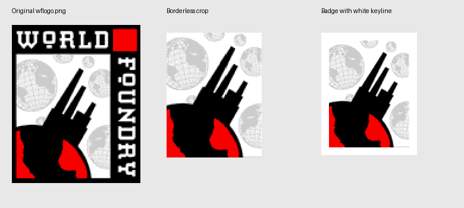
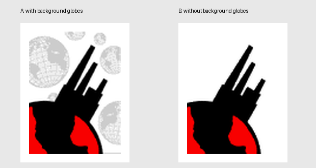
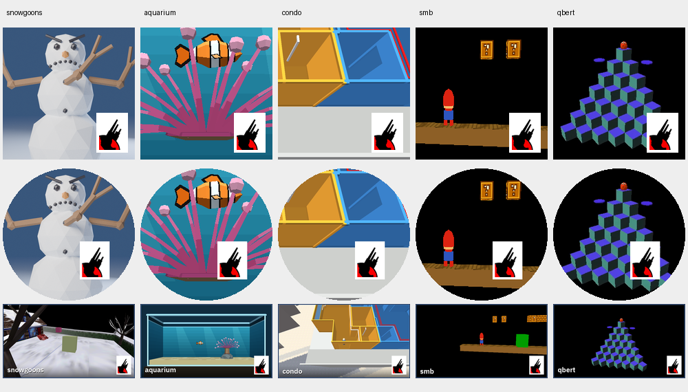
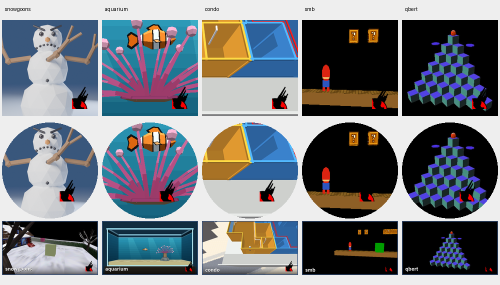
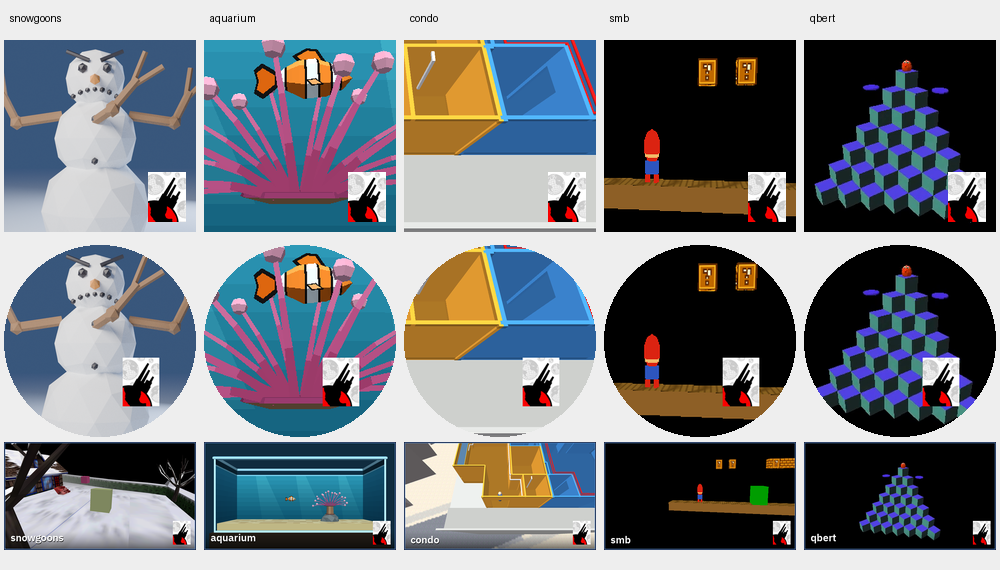
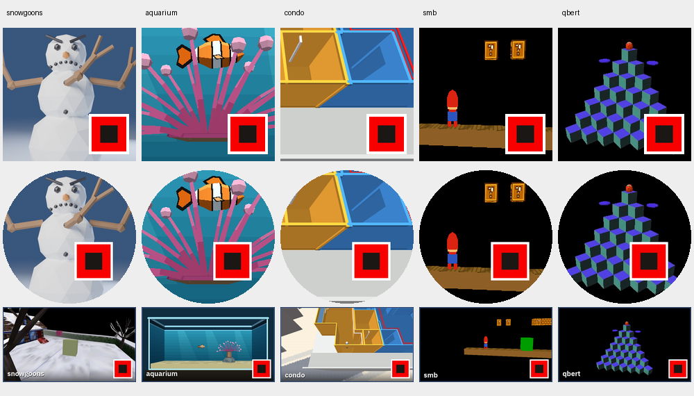
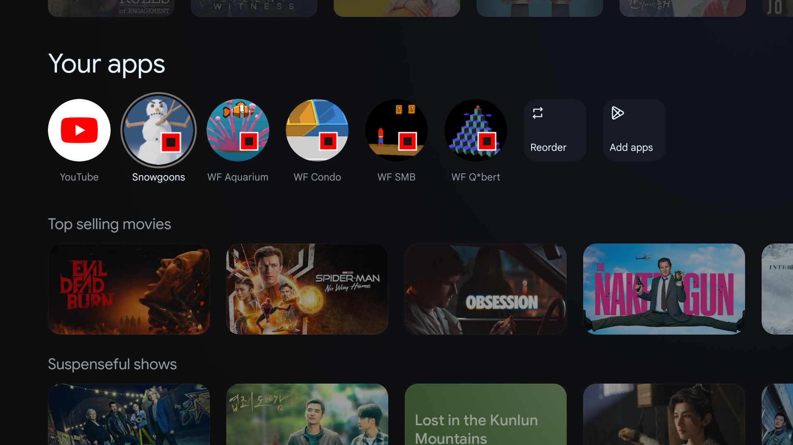
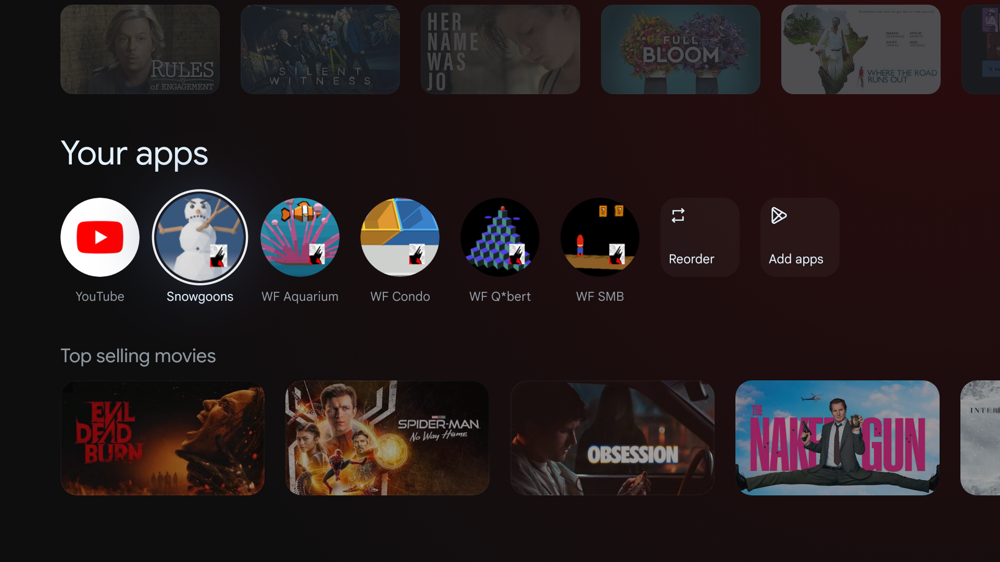
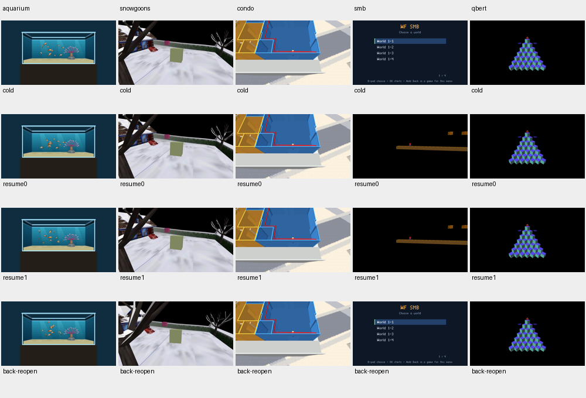

# Proposed wflogo.png badge for Android apps

Status: **complete: approved badges and school banner installed; black-screen lifecycle bug fixed and verified on all five apps** (2026-10-02). Approved standard: set D retains the grey globes and white graphic background, with no outer border or extra side padding. Earlier sets remain below for comparison.

## First proposal (comparison archive)

Use the graphic from the repository's `wflogo.png`, removing the top WORLD and right FOUNDRY text panels. Keep the globe/diagonal/red-square graphic. The source is untouched. Proposed crop: **(4, 25, 82, 129)** from the 108 × 133 source (right/bottom exclusive), giving a 78 × 104 graphic. Remove all black frame borders by cropping to the graphic interior; preserve the black shapes within the graphic itself. Preserve the graphic's rectangular aspect ratio, with no square tile or extra side padding. The thin white outer border hugs all four edges.

The enlarged crop shows the source pixels; the badge uses Lanczos resizing at its actual output size. Updated after review: no black frame borders. The only frame is the thin white outer border, hugging the rectangular graphic with no extra side padding.

Regenerate these proposal images with `python3 docs/plans/2026-10-02-android-wflogo-badge/make_mockups.py`; this writes only the mockups, never shipping resources.

## Proposed appearance on all five apps

Each column shows the square icon, adaptive foreground under a circular mask, and TV banner. These are **proposal previews only**; the shipping resources have been restored to the existing favicon versions.

## Second set: without background globes

Compare **A**, the existing proposal with the light grey globes, against **B**, with the light neutral background replaced by white. Both retain the black silhouette, red shape, rectangular proportions, and thin white outer border; neither has extra side padding. This is a comparison for approval, not a change to shipping resources.

The second complete set uses the same game artwork, sizes, and placements as the first:

## Third set: transparent background and border

**C** starts from B (no grey globes), with the white background and outer border made transparent. The black silhouette and red shape appear directly over the game artwork. Size and placement match B, including the now-transparent border space, so the comparison isolates transparency. Black edge pixels are converted from the white matte to alpha before resizing to avoid white fringes.

The transparent badge PNG is [proposed-badge-transparent.png](2026-10-02-android-wflogo-badge/proposed-badge-transparent.png). The complete third set of icons is under `2026-10-02-android-wflogo-badge/set-c/<game>/res/`: five densities each of square, round, and adaptive icons, plus the TV banner. Only the badge is transparent; square icons and banners retain their game artwork backgrounds.

## Fourth set: original globe background, no white border

**D** starts from A, retaining the light grey background globes and the graphic's white background, with **no white outer border**. The graphic keeps the same scale and uses the same placement rules, now calculated from its unframed dimensions.

Badge source: [proposed-badge-globes-no-border.png](2026-10-02-android-wflogo-badge/proposed-badge-globes-no-border.png).

## Previous favicon version (archived reference)

The original red-square website favicon badge, before this rollout, is preserved here for future reference. These resources were copied from the repository's pre-change `HEAD`, not recreated from the approved logo. The reference contains the largest square, round and adaptive icons plus each game's original TV banner, and the old stamping script as a text snapshot.

[Original favicon badge PNG](2026-10-02-android-wflogo-badge/favicon-reference/favicon-badge.png) · [Original stamping script snapshot](2026-10-02-android-wflogo-badge/favicon-reference/add-wf-logo-favicon.py.txt)

## Plan after approval

- [x] Inspect the source logo and the common icon generator.
- [x] Prepare badge and app previews for approval.
- [x] User approved set D (with globes, no white outer border).
- [x] Make `scripts/add-wf-logo.py` use the approved crop of `wflogo.png`.
- [x] Finalize the [reference standard](../reference/android-brand-badge.md) for every future stamp.
- [x] Regenerate all five games' square, round, adaptive icons and TV banners.
- [x] Run existing Android resource checks and build all five release APKs.
- [x] Uninstall and reinstall all five apps on the confirmed local Chromecast HD.
- [x] Inspect the launcher and verify installed resources; installed APKs are correct; all five launcher tiles show approved set D after the authorized launcher-data reset.

Uninstalling removes each game's local app data. The prior rollout found that Google TV could keep old icons even after reinstalling; clearing launcher data resets home layout and is a separate action if needed.

## Device discovery

ADB identifies the connected local device as Chromecast HD (`boreal`), serial `adb-2628105GN0GT7C-wwfiSB._adb-tls-connect._tcp`. Confirmed as the rollout target; all five apps were subsequently reinstalled.

## Build and reinstall evidence

- Five release APKs: `BUILD SUCCESSFUL in 31s`, including release lint checks.
- Existing source/resource checks: **52 passed**. Two checks that specifically inspect stale debug APKs failed in the initial run (old aquarium bundle and old snowgoons label); they were excluded from the source check rerun. The fresh release APKs were instead verified directly before installation.
- Every release APK has both `arm64-v8a` and `armeabi-v7a`, the current game's `cd.iff`, and all **16 approved resource PNGs**, checked by decoded RGBA pixels (RGB under fully transparent pixels normalized because Android's packager rewrites those invisible values).
- All five apps: uninstall **Success**, install **Success**, installed APK SHA-256 equals built release APK SHA-256, launch **Status: ok**.
- Per-app APK hashes, package IDs, launch output and install results: [rollout.json](2026-10-02-android-wflogo-badge/device/rollout.json).
- First launcher capture after reinstall still shows the previous favicon badges. Installed resources are verified correct; a launcher force-stop and return to Home also left the old favicon tiles visible.

Launcher restart result: old favicon badges remain visible in [launcher-after-restart.png](2026-10-02-android-wflogo-badge/device/launcher-after-restart.png). Refreshing the tiles requires a separate launcher-data reset (`adb shell pm clear com.google.android.apps.tv.launcherx`), which resets home layout and app row order. This was subsequently authorized by the user and performed successfully; see the final result below.

## Final launcher verification

User authorized clearing Google TV launcher data. `adb shell pm clear com.google.android.apps.tv.launcherx` returned **Success**. After returning Home, all five apps visibly show the approved **set D** badge: grey globe background, rectangular graphic, no outer white border. The screenshot confirms Snowgoons, WF Aquarium, WF Condo, WF Q*bert and WF SMB.

**PASS — rollout complete.** The original favicon version and all four proposal sets remain archived above, and the shared reference standard records the approved stamp for future apps.

## Aquarium TV banner: full fish school

Requested after the badge rollout: replace the aquarium's single-fish banner with the complete fish school. The new source is a committed copy of the clean real Chromecast capture from the schooling work: `android/app/art-src/aquarium-school-chromecast-1920x1080.png` (original: `docs/plans/2026-10-01-aquarium-schooling/chromecast-school.png`). The generator keeps the existing 16:9 crop `(280, 88, 1640, 853)`, aquarium name, and approved set D badge. Launcher icon artwork remains the fish and anemone.

Build and device update: **PASS**. Release build successful in 3 seconds, including lint; 12 aquarium source/resource checks passed (2 stale debug-APK checks deselected). The packed banner is pixel-identical to the new generated PNG. `adb install -r` returned **Success** and the installed APK is byte-identical to the new build. SHA-256: `240d9b259115cff7605b31990865d080c61c718e5d6c4588466f5a3811d2813c`.

## Follow-up: black screen on reopening apps

The user reported black screens after the rollout. Initial `am start -W` success was insufficient to establish rendering or safe reopening. Logs show repeated `android_main: enter` on different threads within the same process followed by `eglMakeCurrent failed: 0x3002` (EGL_BAD_ACCESS), and a Q*bert input ANR. `APP_CMD_DESTROY` set `gExitLoop`, but Android's `HALWindowCloseRequested()` always returned zero, so the previous engine never unwound. A subsequent NativeActivity could compete for process-global EGL/engine state.

Fix:

- NativeActivity uses `singleTask`, so repeated launches and Home/reopen reuse the current engine thread.
- Android's shared close predicate now reads the native exit flag; `HALRequestClose` also sets it. Back/destruction unwinds both level and menu loops.
- After the legacy engine shuts down, stop the phone controller and exit the game process. The next Back/reopen starts with fresh process-lifetime engine/EGL globals. Home continues to suspend/resume the existing process.

Final verification: all five release APKs rebuilt successfully in 51 seconds (both ABIs, release lint); **70 tests passed**, including a C++ harness exercising the real Android lifecycle HAL. Two existing stale-debug-APK checks remain excluded. Device checks cover cold launch, repeated launch, two Home/reopen cycles, and Back/clean shutdown/reopen, with screenshots, process IDs and logs. Results: **PASS on all five apps**. Each rendered on cold launch, reused one engine thread/process across repeated launch and both Home/reopen cycles, shut down cleanly on Back (`HALStart returned` logged; no crash), and rendered again in a fresh process on reopening. No `eglMakeCurrent failed` occurred in the checked runs. SMB also entered World 1-1 from its menu successfully.

Original failure logs: [black-screen-before-fix.log](2026-10-02-android-wflogo-badge/device/black-screen-before-fix.log).

### Device lifecycle evidence

[Results and process IDs](2026-10-02-android-wflogo-badge/device/lifecycle/results.json) · [Device check script snapshot](2026-10-02-android-wflogo-badge/device/lifecycle/check-script.py.txt)

Columns: Aquarium, Snowgoons, Condo, SMB, Q*bert. Rows: cold launch, first Home/reopen, second Home/reopen, Back/reopen. Screenshots were inspected visually as well as checked for nonuniform pixels and the correct foreground activity; SMB's seven-colour menu and Q*bert's small palette are valid rendered screens, so colour count alone is not a reliable startup assertion.

The fixed release APKs were updated with `adb install -r`, retaining approved set D and the new aquarium school banner. The Chromecast was returned to Home after verification. These device tests cover the Chromecast HD's 32-bit ABI; both ABIs built successfully, but no physical arm64 device was tested.

Final release APK hashes after the lifecycle fix: [final-release-apks.json](2026-10-02-android-wflogo-badge/device/lifecycle/final-release-apks.json). The earlier rollout and banner hashes above are historical evidence from before the lifecycle rebuild.

## Completion

All requested work is complete: set D approved and applied to every shared stamp; all five apps updated on the local Chromecast and verified through launch/reopen scenarios; aquarium banner shows the full school; favicon reference and comparison sets preserved; standard recorded for future apps. Build, test and device evidence are linked above.
