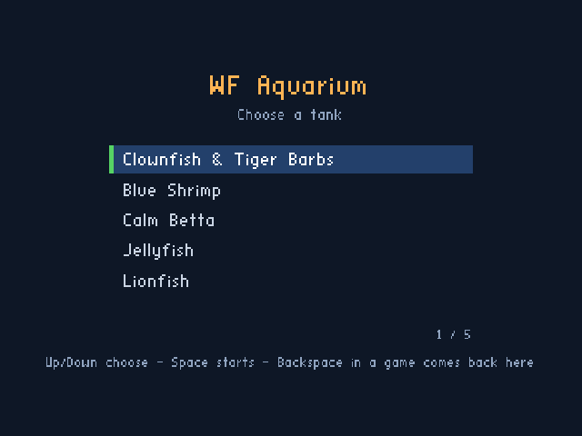
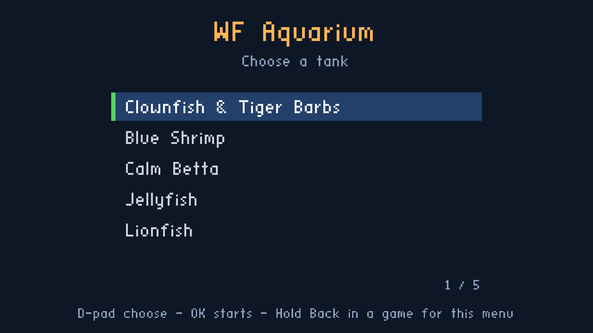
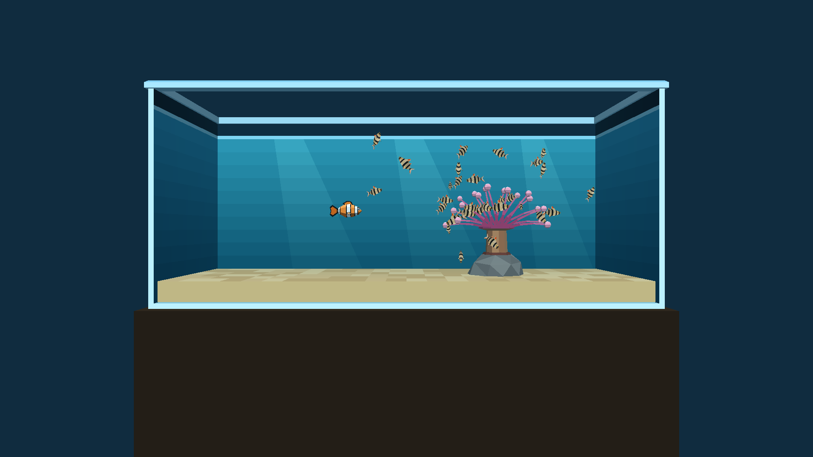

# Aquarium five-tank selector

Status: **SUPERSEDED by the six-tank menu** (2026-10-02). Will assigned sole menu ownership and requested reconciliation into `aquarium-menu.manifest` / `aquarium-menu-cd.iff`, including Planted Tank at index 5. Android and both APK tasks now use that path. The duplicate artifacts and task were removed; previous evidence below is historical. See [current plan](2026-10-02-aquarium-three-more-tanks.md).

Will requested the five completed tanks in one Aquarium app with the selector available now. The latest scope is five entries; The independently developed Plants Only level and six-entry preview are preserved separately; this release follows the explicit five-entry request.

| Index | Menu entry | Standalone level |
|---:|---|---|
| 0 | Clownfish & Tiger Barbs | `aquarium-standalone.iff` |
| 1 | Blue Shrimp | `aquarium_blue_shrimp-standalone.iff` |
| 2 | Calm Betta | `aquarium_betta-standalone.iff` |
| 3 | Jellyfish | `aquarium_jellyfish-standalone.iff` |
| 4 | Lionfish | `aquarium_lionfish-standalone.iff` |

- [x] Create `wflevels/aquarium-five-tank-menu.manifest` with five entries and the title WF Aquarium.
- [x] Package the exact current standalone payloads using `shell-menu.fth` into `wflevels/aquarium-five-tank-cd.iff`.
- [x] Point the Android Aquarium flavor's asset link at this selector bundle.
- [x] Preserve `aquarium-cd.iff` for standalone profiling and Apple builds whose selector drawer is not yet verified.
- [x] Add independent level build tasks and make release/debug app tasks wait for the selector bundle.
- [x] Keep the original aquarium generator independent of selector packaging, preventing a dependency cycle.
- [x] Make the benchmark APK script temporarily use the single-tank asset and restore the selector link even if Gradle fails.
- [x] Verify five labels and exact current source payloads in tests.
- [x] Exercise every tank and return to the selector in the desktop engine.
- [x] Build and inspect the release APK.
- [x] Install the release and verify the selector and first tank on the Chromecast HD.
- [ ] Complete uninterrupted all-five device navigation, physical held Back and selector resume/relaunch checks.

The menu uses the existing engine implementation: Up/Down chooses a tank, Space or gamepad A opens it, and Backspace returns on desktop. The TV remote uses D-pad and OK; holding Back for one second returns from a tank, while a short Back exits. If the phone-controller panel is open, Back first hides that panel. Returning remembers the previously selected tank and waits for buttons to be released before accepting a new selection.

`task build-cd-iff-aquarium-five-tanks` rebuilds the five independent standalone levels as needed and packages the selector. `task build-apk` and `task build-apk-debug` depend on that bundle. Direct Gradle builds package the existing bundle, so use the Task entry point after changing a level. For desktop inspection, run the engine with `cd.iff` set to the menu bundle; `python3 wflevels/aquarium_tanks/check_menu.py --installed-bundle` runs a repeatable selection/return sequence against that exact bundle. The older isolated preview may show a Plants Only entry and is separate from this five-tank Android release.

## Validation

The final bundle passed 14 Python integration/Android checks and three existing menu regressions. The desktop engine started tanks **2 → 3 → 4 → 0 → 1 → 4**, with five returns to the menu and no script/assertion failures. The bundle contains byte-identical copies of each current standalone level; its first tank has SHA-256 `04f5cc0723d1527280aa854c9c59d4a6c7a7536d9a739a0773c68342867f9081`.

The release APK built successfully, contains both ARM ABIs and the exact five-tank bundle, and has no profiling arguments. APK SHA-256: `6236ade65122ff712556be9a183ca83f1240bf9d85549830eb6f1bcc6de352b0`; bundle SHA-256: `14c22db4e687eb32a1d7eb93ed449ba436970debd17ac23ebdf3ab984172d131` (849,920 bytes). [Desktop receipt](2026-10-02-aquarium-three-more-tanks/engine/menu/integrated-five/checks.json), [APK receipt](2026-10-02-aquarium-three-more-tanks/engine/menu/integrated-five/apk-checks.json).

The installed Chromecast HD APK was read back by SHA-256 and matches the verified release above. Cold launch shows all five rows clearly at 1920 × 1080; OK opens the first tank, including the final smooth tiger-barb export. The saved screenshot below is from that installed release. A longer device sequence was stopped because concurrent inputs and launches made it unreliable. Therefore all-five selection/return is established by the desktop runtime, while uninterrupted device navigation, physical held Back and selector resume/relaunch remain pending. The existing held-Back implementation is unchanged; Android's `input keycombination` injector reports a zero event-held duration despite waiting in real time, so that command does not establish a physical remote hold.

[Installed-device receipt](2026-10-02-aquarium-three-more-tanks/engine/menu/integrated-five/device/checks.json).

This change reuses the existing selector; it does not introduce a new menu renderer or change tank controls. The first tank includes the current tighter school, movement smoothing and actual-motion startle correction.

Related: [three new tanks](2026-10-02-aquarium-three-more-tanks.md), [Blue Shrimp](2026-10-02-aquarium-levels-blue-shrimp.md), [tiger barbs](2026-10-02-aquarium-tiger-barbs.md), [existing selector](2026-10-01-level-menu-selector.md).
