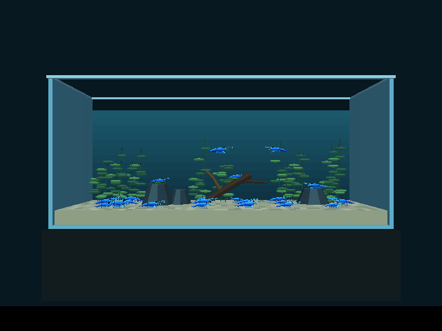
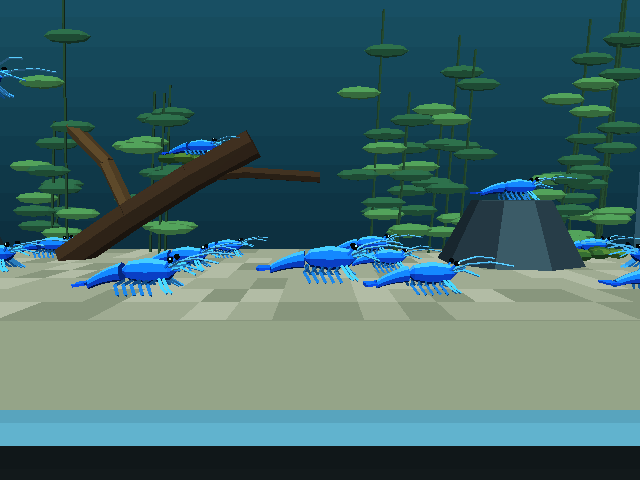
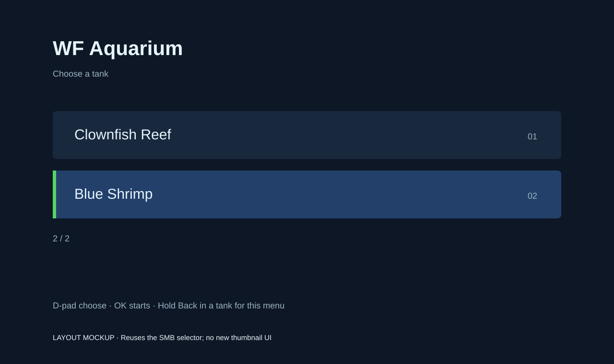
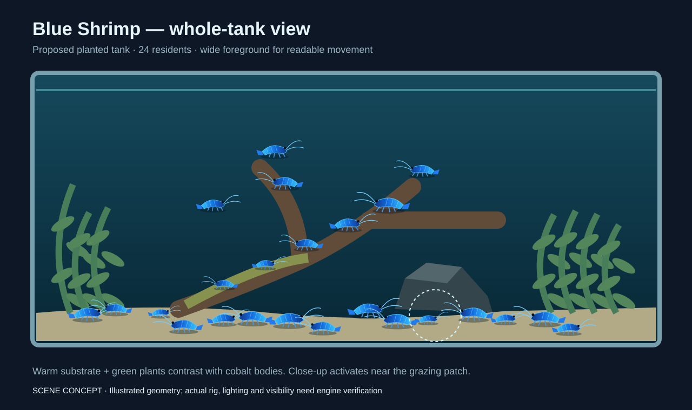
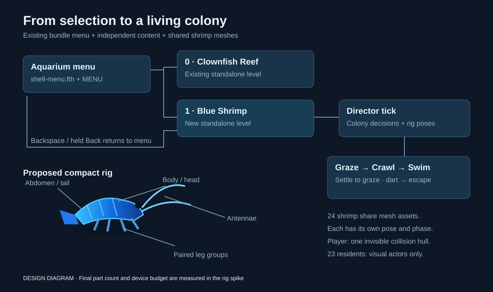

# Aquarium levels: menu selector and Blue Shrimp

Date: 2026-10-02. Status: **Blue Shrimp standalone built and checked on desktop. App/menu integration, device verification and performance tuning remain open.**

Will wants multiple levels inside the Aquarium app, selected through the same menu as SMB. The first additional level is a tank full of blue shrimp. Deliver two selectable tanks now and a manifest that makes later additions straightforward.

- [x] Inspect the existing aquarium build, Android bundle and SMB selector.
- [x] Write this implementation plan.
- [x] Build a shrimp model and animation spike.
- [x] Build the Blue Shrimp level and its controls.
- [x] Verify desktop controls, wall recovery, animation and camera views; capture actual engine images and video.
- [ ] Package both tanks with the existing menu.
- [ ] Verify desktop and Android/Chromecast operation and performance.

## Implementation and actual engine evidence

The new level lives in [wflevels/aquarium_blue_shrimp](../../wflevels/aquarium_blue_shrimp/README.md), with its own generator, geometry, zForth animation/control library, build/run scripts and tests. It does not import the existing aquarium's model or generator, and does not change its files, engine code, `Taskfile.yml`, app asset links or `aquarium-cd.iff`. Another agent is replacing the first tank's fish, so its final menu label must be settled at integration; “Clownfish Reef” below remains the original planning placeholder.

The implemented colony has one player and 23 residents, five mesh parts per shrimp, independent grazing/crawling phases, two residents making water-column excursions, and authored grazing perches on rock and wood. Residents are posed in three groups; the player's rig updates every frame. The player steers, swims, settles, and makes a backward tail flick with a cooldown. Decorative residents use separate authored lanes rather than the proposed all-pairs separation scan. They do not yet scatter away from the player.

[Open actual engine captures and motion clip](2026-10-02-aquarium-levels-blue-shrimp/engine/index.html). These are runtime images, unlike the design mockups below.





Build and play independently with `bash wflevels/aquarium_blue_shrimp/build.sh` and `bash wflevels/aquarium_blue_shrimp/run.sh`. Content checks: `python3 -m pytest tests/test_aquarium_blue_shrimp.py -q`. Engine checks and evidence: `python3 wflevels/aquarium_blue_shrimp/run_checks.py --video --cost`.

The final desktop controller run passed all six directional limits **and turning away from each limit**, camera switching, colony/leg animation, sustained input and the backward tail flick. The eight content checks pass, including the engine's minimum triangle size, full rig bounds through 72 headings, four minutes of route clearance/spacing, mailbox limits, symmetric collision-hull dimensions, shared mesh references and generated actor indices. The closest resident origins over the route sample are 0.75 level metres apart. The one-shrimp and touch-profile variants also loaded without script or assertion errors; physical touch input has not been tested.

The build uses 159 actors and a 12 MB room pool. The first 6 MB pool exhausted while loading the articulated colony. Mesh optimization reduced each shrimp from 1,388 to 596 triangles and the measured desktop debug frame estimate from 137.4 to **79.7 ms** (about 12.5 fps). This is a local debug/ASan build, measured with vsync disabled using 30 and 130 frames; it is not a release/device benchmark and does not meet the shipping frame target below. Release performance and further tuning must be checked before integrating the scene into the app. Android/Chromecast performance and physical phone input remain **PENDING**. No shared device has been claimed while the first level's work is underway.

Raw results: [checks.json](2026-10-02-aquarium-levels-blue-shrimp/engine/checks.json). The seven-second [motion clip](2026-10-02-aquarium-levels-blue-shrimp/engine/shrimp-motion.mp4) uses one image per fixed 20 Hz simulation tick, encoded at 20 fps; its playback speed describes simulated motion, not measured rendering speed.

## Result

Opening Aquarium shows **WF Aquarium**, the prompt **Choose a tank**, and these entries:

| Index | Menu entry | Scene |
|---|---|---|
| 0 | Clownfish Reef | The existing aquarium, including its current clownfish school and anemone |
| 1 | Blue Shrimp | A planted tank with a colony of blue shrimp on sand, rocks, wood and moss |

Keep the existing tank at index 0. Each selection loads an independent level. The shrimp scene should be visibly busy even when the player leaves the controls alone: some shrimp graze, some crawl across the foreground, and a few make short swims between resting places.

Use the existing SMB menu layout and input behavior. D-pad up/down selects a tank and OK/A starts it. Desktop uses the existing arrow keys and Space/A mapping. Backspace returns to the menu on desktop; holding Back for one second returns on the Chromecast remote. Short Back exits the Android app. The menu remembers the most recent selection during the session, and selection-button release prevents that press from triggering an action in the tank.

## Mockups and diagrams

[Open the visual gallery](2026-10-02-aquarium-levels-blue-shrimp/mockups.html). These are design concepts, not engine captures. The scene shows the proposed composition; the rig spike must establish actual readability and motion in the engine.

### Tank selector



Reuse the SMB selector: two named rows, a clear selection bar and the existing remote hint. Adding shrimp does not require redesigning the menu.

### Blue Shrimp tank



Pale substrate keeps the blue colony legible. Wood and dark rocks create grazing routes, plants frame the scene, and the clear foreground gives the close-up camera a readable patch. The dashed circle marks the proposed player framing area, not a shipped HUD element.

### Level flow and animation rig



The diagram connects bundle selection to the colony update and shows the proposed body, tail, leg and antenna groups. The rig spike decides the final part count. Regenerate all visuals with [make-mockups.py](2026-10-02-aquarium-levels-blue-shrimp/make-mockups.py).

## Existing pieces to reuse

The [SMB selector](2026-10-01-level-menu-selector.md) already implements a `MENU` chunk, manifest parsing in `cdpack-rs`, `shell-menu.fth`, portable selection logic, desktop/Android drawing, return-to-menu handling and `--menu-input=` automation. Reuse those mechanisms; this feature should principally add content and packaging.

Today `task build-cd-iff-aquarium` packages one standalone level with `shell.fth` into `wflevels/aquarium-cd.iff`. Android's Aquarium asset symlink points to that file. The existing generator defaults to ten follower clownfish; the new shrimp scene needs its own behavior rather than the clownfish flocking controller.

The aquarium uses opaque geometry and fog to suggest water. Follow that established rendering approach. New level scripts use zForth; models and level data come through the Blender/level compiler pipeline.

## 2026-10-03 — both blue varieties in the same tank (implemented)

Will requested Blue Jelly and Blue Dream together: a light translucent blue variant and a darker densely blue variant. The original opaque/cobalt treatment below describes the existing implementation. The implemented mixed-colony appearance, mockups, rig/material diagram, A3 poster and verification evidence live in the [shrimp content plan](2026-10-03-aquarium-blue-shrimp-varieties.md). It depends on the separate [engine translucency plan](2026-10-02-condo-translucency.md). The count remains 24 total (12 of each, player included), in the same tank. The second texture uses the existing model, shared engine translucency is implemented, and desktop checks and Chromecast installation are complete.

## Blue Shrimp scene

**Proposed defaults:** a stylized freshwater planted tank, 24 shrimp total including one controllable shrimp, with varied size, blue shade and animation phase. These are art and tuning choices, not a claim of biological simulation. Count is configurable at build time so device measurements can determine the shipping budget.

Reuse the aquarium's tank dimensions and world scale initially. Replace the reef dressing with pale substrate, dark rounded rocks, a branching piece of wood and patches of moss and plants. Leave a clear foreground strip so small blue bodies remain visible. Spread the colony across several patches instead of concentrating every shrimp at one point. Keep mesh names within the exporter's existing length limit.

The shrimp silhouette must read at TV viewing distance: curved segmented abdomen, head, dark eyes, long antennae, legs and a tail fan. Use saturated cobalt and cyan highlights against restrained green plants and warm pale sand. Lighting must retain the blue color without making every body flat or luminous.

Start with a compact articulated rig: body/head, abdomen/tail and paired leg/antenna groups. All shrimp share mesh assets, with independent poses and phases. Determine the final part count in the spike by comparing close-up readability with actor and script cost. Decorative shrimp use visual actors posed by the Director, with no individual Jolt bodies.

Behavior has three states: graze with small leg/antenna motion, crawl toward another authored grazing point, and briefly swim before settling. Use fixed seeds, bounded turn/speed changes and inexpensive local separation. Movement follows authored substrate, rock and wood routes with known surface heights; it must not crawl through scenery or float above a perch. Keep every rotated visible body inside the tank. A short tail-flick escape can follow the player's dart, with a cooldown to prevent continuous scattering.

One shrimp is the player, with an invisible collision hull and the same input layout as the current Aquarium. Adapt movement and gait to the shrimp: steer and swim through open water, settle and crawl on authored surfaces, and use A for a short tail-flick dart. Preserve the existing touch profile's mode/action mapping. Do not assume the clownfish's ground-avoidance controller can support crawling unchanged: the spike must check Jolt contact and stair behavior before implementing the surface movement.

Use a whole-tank camera plus a smooth close-up near a foreground grazing patch. A controllable shrimp must remain easy to locate through camera framing and a subtle color distinction. The wide view should show several active shrimp; the close-up should make legs and antennae readable. Test other shrimp passing through the close-up so they do not obscure the player for long periods.

## Implementation sequence

### 1. Shrimp spike

- [x] Add `wflevels/aquarium_blue_shrimp/geometry.py` and a configurable single-shrimp spike build. Capture engine stills and a short motion clip at wide and close-up scales.
- [x] Confirm body bounds, pivots, readable poses and shared mesh references on desktop; measure the animated colony in the local debug build.
- [ ] Measure static versus animated shrimp on Chromecast HD and establish the release budget.
- [x] Reserve mailbox blocks after auditing the actual level mailbox capacity. Generate actor indices and mailbox offsets rather than hardcoding export order.
- [ ] Exercise player ground contact, crawling, swimming and tail flick against a floor and one perch. Resolve unexpected stepping or velocity jumps before dressing the tank.

### 2. Complete the tank

- [x] Add `blender_create_aquarium_blue_shrimp.py`, `constants.py`, `geometry.py` and the zForth movement/colony/rig library `shrimp.fth` in the new level directory.
- [x] Keep the tank generator self-contained so concurrent first-level edits cannot affect its imports or outputs. Shared extraction is deferred until both levels settle.
- [x] Build the planted dressing, authored routes and grazing points; add colony behavior, player controls and camera transitions.
- [x] Add independent `build.sh` and `run.sh` scripts and a configurable touch profile. Produce `wflevels/aquarium_blue_shrimp-standalone.iff` through the normal compiler pipeline. Shared Taskfile tasks remain part of the later integration pass.

### 3. Package the menu

Create `wflevels/aquarium-menu.manifest`:

```text
title WF Aquarium
prompt Choose a tank
level aquarium-standalone.iff | Clownfish Reef
level aquarium_blue_shrimp-standalone.iff | Blue Shrimp
```

- [ ] Update `build-cd-iff-aquarium` to use `shell-menu.fth` and this manifest, retaining `wflevels/aquarium-cd.iff` as the app bundle path. Its Android symlink therefore needs no destination change.
- [ ] Arrange dependencies so both standalone levels are built before packaging. Remove the current generator-to-bundle dependency cycle risk: level tasks produce standalone files; the bundle task depends on both; app launch tasks depend on the bundle.
- [ ] Add `run-aquarium-menu` using the same invocation pattern as `run-smb-menu`. Keep direct standalone launch tasks available for content development.
- [ ] Update aquarium bundle tests that currently expect `shell.fth` and a single level. Pin both level payloads, menu names, indices and deterministic rebuilds.
- [ ] Update Android documentation and flavor comments to describe the two-tank menu. Future tanks append one manifest row and a matching build dependency.

### 4. Verify and record evidence

Standalone desktop results and actual captures are recorded above. Combined app/menu and device checks in this acceptance table remain **PENDING**; desktop passing results do not imply a device pass.

| Check | Acceptance |
|---|---|
| Bundle rebuild | Rebuilt bundle equals the tracked artifact; `SHEL`, both level entries and `MENU` contain the expected data |
| Real desktop menu | Choose Blue Shrimp, return, choose Clownfish Reef, return and choose Blue Shrimp again; logs show indices 1, 0, 1 |
| Input release | OK/Space does not dart the shrimp immediately after selection |
| Colony trace | Same seed/input produces the same trace; all visible shrimp remain in bounds, on valid surfaces when crawling, and separated without persistent overlaps |
| Player | All controls work; ground contact does not launch the shrimp or trap it on a perch; both camera transitions remain smooth |
| Existing aquarium | Existing level, idle-rig and schooling checks pass; direct standalone renderer references remain valid unless an intentional visual change requires refreshing them |
| Menu regressions | `tests/test_level_menu.py` passes; SMB still loads its existing menu bundle |
| Android packaging | APK includes the current two-level bundle; aquarium package identity and launcher artwork remain valid |
| Chromecast HD | D-pad/OK chooses both tanks; held Back returns to menu; short Back exits; cold launch, resume and reopen show a working menu or tank |
| Performance | Release build: target median 16.7 ms, p90 at most 33.4 ms over a 45-second colony run; record actor count, script cost, frame pacing and memory against the current aquarium |

Use `--menu-input=` for desktop transitions and the existing Android device runner for device captures. Extend `tests/test_aquarium_android.py` and add focused shrimp content/behavior checks. Store actual screenshots and a short colony motion recording beside this plan. Reduce animated parts or stagger colony decisions if device measurements miss the budget, then rerun the affected checks.

## Platform boundary and scope

Desktop OpenGL and Android/Chromecast are the first delivery targets because the SMB menu already runs there. macOS/iOS reuse the aquarium bundle, so audit their menu-drawing support before replacing any bundle consumed by their build or parity jobs. A platform falling back to level 0 does not satisfy two-level selection: add a working drawer before delivering the menu there, or keep its existing single-tank build path explicit until that follow-up is complete.

This plan covers one new tank and reusable selection for later tanks. Feeding, breeding, inventory, progression, new audio and aquarium transparency are separate features. No new paid services or external assets are needed for the proposed procedural model and local builds.

Related: [Aquarium level](2026-09-30-aquarium-level.md), [schooling](2026-10-01-aquarium-schooling.md), [Aquarium Chromecast](2026-09-30-aquarium-chromecast.md), [app bundles](2026-10-01-split-cd-iff-one-app-per-game.md).
