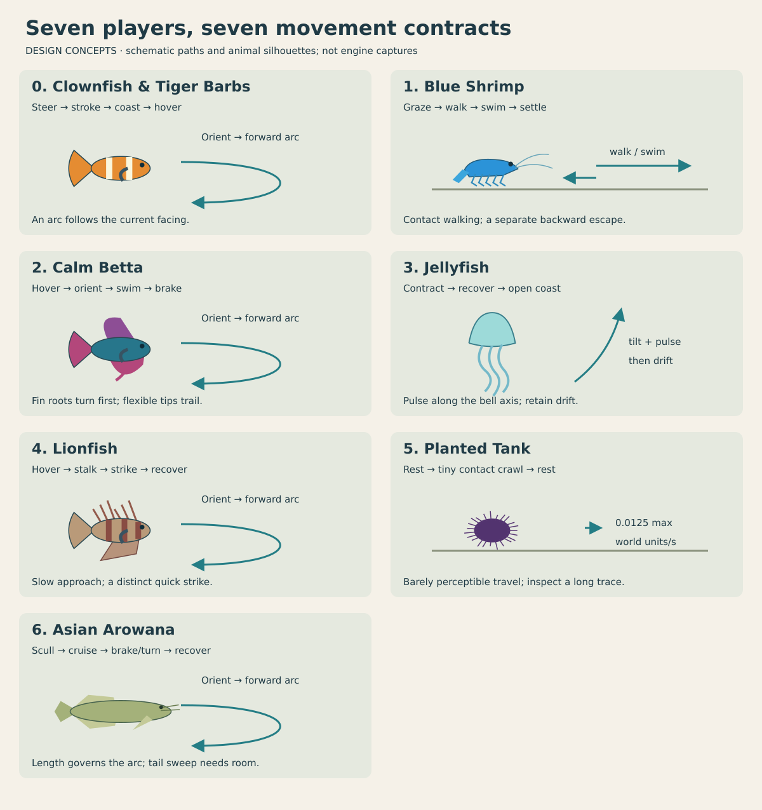
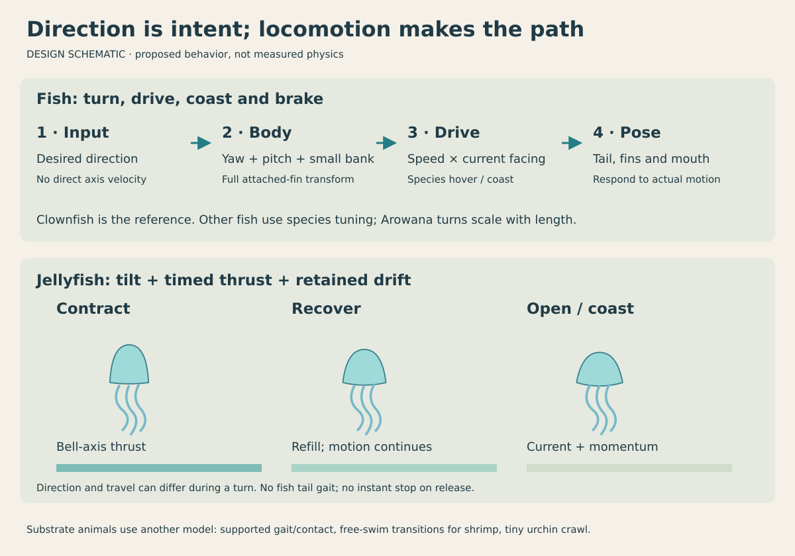
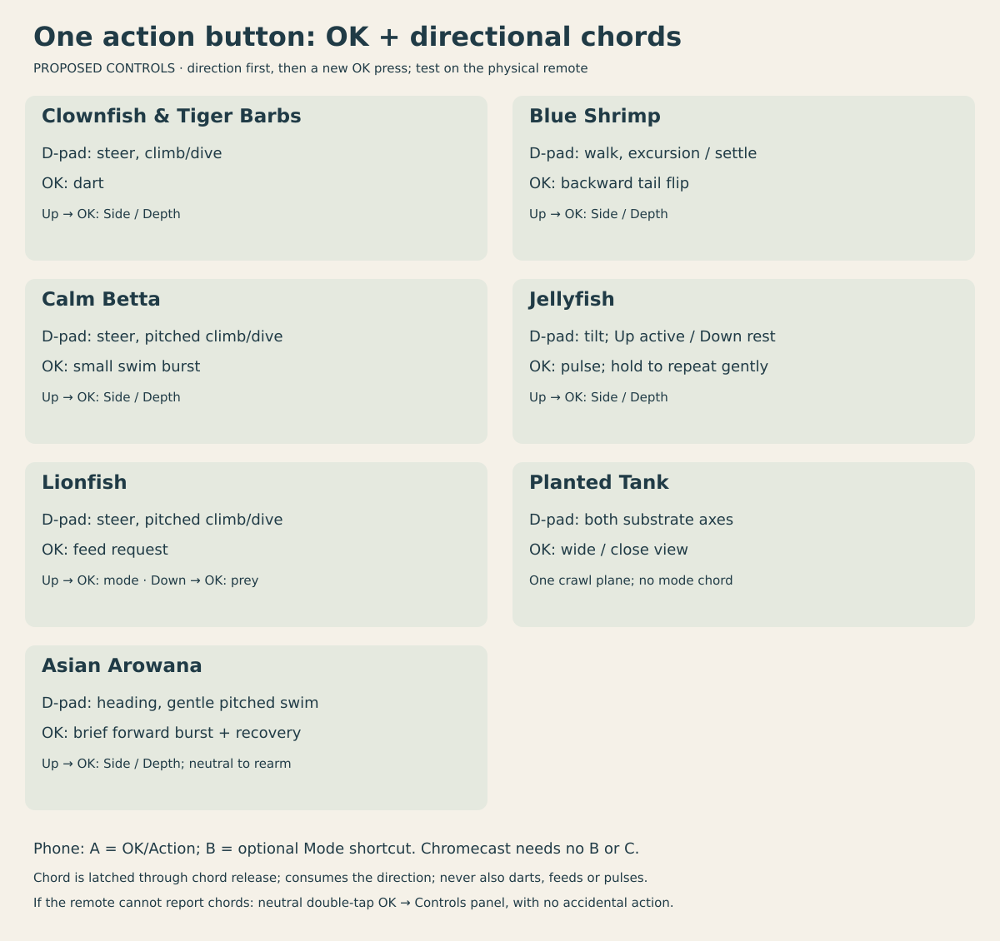

# Aquarium movement and controls: all seven players

Date: 2026-10-02. Status: **species controllers implemented, native motion review captured, 81 regression tests pass, and the release APK is rebuilt. Physical remote and phone acceptance remain tracked below.**

Will wants betta and lionfish to move at least as convincingly as the clownfish, and jellyfish to have completely different movement and controls. This plan covers **every player/tank**, including the long-bodied Asian Arowana, Blue Shrimp and the very slow sea urchin in **Planted Tank**. Each animal gets its own locomotion states, animation response and action semantics. The Chromecast baseline is **D-pad plus one action button, OK**; no tank may depend on an extra action button to expose its movement or feeding controls.

- [x] Inspect the current six players, generated rigs, input profiles and phone/TV bindings.
- [x] Identify the fish sliding problem and distinguish jellyfish propulsion from fish swimming.
- [x] Specify movement, controls, residents, cameras and verification for each tank.
- [x] Include motion diagrams, control mockups and an interactive jelly pulse schematic.
- [x] Implement and capture betta/lionfish steer-and-swim motion; preserve the unchanged clownfish baseline.
- [x] Build the separate jelly pulse, drift, tilt and trailing-appendage controller.
- [x] Complete shrimp gait transitions and urchin contact motion.
- [x] Complete Arowana length-dependent curvature, swept clearance and posterior fin attachments; capture its broad-tank motion.
- [ ] Verify phone, desktop/gamepad and physical TV controls for all seven tanks.
- [x] Integrate the verified standalones into the existing seven-tank menu and deploy the movement build; injected device checks pass.

## Review visuals

[Open the movement/control gallery](2026-10-02-aquarium-movement-and-controls/index.html). The drawings and interactive pulse are **design schematics**, not new engine captures or measured biological data. The gallery includes a selector for each player's movement rules and controls.

## Why the current fish look like submarines

The clownfish's [`aquarium_swim.fth`](../../wflevels/aquarium/aquarium_swim.fth) already makes input a **desired direction**. Damped yaw/pitch steer the fish; speed is written along its **current facing**. Reversing produces a turn arc, Up produces a forward climb, and release produces a glide followed by a fin-assisted stop. [`clownfish_idle.fth`](../../wflevels/aquarium/clownfish_idle.fth) links tail activity, pectoral flare, bank and body pose to that motion.

Betta and player lionfish use [`aquarium_tanks/controller.fth`](../../wflevels/aquarium_tanks/controller.fth). It smooths independent world-axis velocity targets while separately turning the visible animal toward horizontal input. Vertical velocity is independent of body pitch. Consequently, a fish can slide sideways, reverse its translation before turning, or rise while keeping its body level. The generator's [`tk-pose`](../../wflevels/aquarium_tanks/generate.py) also rotates part positions with yaw only; its fish poses lack the clownfish's complete pitched/banked attachment transform. Constant-rate fin oscillation does not explain acceleration, braking or hovering.

Jellyfish still pass through that shared controller: a fish-style action becomes an upward velocity target and the bell is posed by a continuous sinusoid. [`jellyfish/motion.py`](../../wflevels/aquarium_jellyfish/motion.py) and [`jelly_motion.fth`](../../wflevels/aquarium_tanks/jelly_motion.fth) contain draft contraction/recovery ideas, but the inspected generator does not wire them into a separate propulsion/control system. Treat them as starting material, not completed jelly mechanics.

Blue Shrimp already has grazing routes, support-height handling and a backward escape, but its player still uses independent axis velocities and a largely constant leg clock. Planted Tank correctly fixes the urchin to the substrate at **0.0125 world units/s**; it has no visible tube-foot/contact gait, and Up/Down in the current Side mode has no movement effect. Its controls should describe the available crawl axes directly.

## Turn presentation (user update, 2026-10-03)

When either turning arc is valid, show the head toward the front glass/camera during the turn. Prefer the camera-facing arc for near reversals rather than routinely showing the back of the animal. Explicit depth input still determines the requested heading. Keep a chosen reversal arc stable until alignment, retain wall clearance, and apply the presentation rule to residents as well as players. This is a visual/gameplay choice.

## The seven movement contracts

| Menu index / tank | Player locomotion | Reversal / release | Action |
|---|---|---|---|
| 0 · Clownfish & Tiger Barbs | Existing steer-and-swim, active tail strokes and coasting; pectoral hover/braking | Curved U-turn; glide, level and settle | Short dart |
| 1 · Blue Shrimp | Supported walking/grazing, forward free swimming, separate backward tail-flip escape | Small turn while walking; turn before forward swimming; settle onto support after release | One escape tail flip |
| 2 · Calm Betta | Slow forward swim and fin-assisted hover; flexible broad fins and trailing pelvic ribbons | Slow down into a tight turn, then swim; flare/brake and return to hover | Restrained swim burst |
| 3 · Jellyfish | Bell-axis pulses, recovery and passive travel through a gentle current | Tilt/curve over successive strokes; retain drift after release | Request a pulse; hold for gentle repeated pulses |
| 4 · Lionfish | Deliberate forward cruising/stalking, pectoral hover; caudal strokes during acceleration/strike | Slow into an arc or low-speed pivot; coast to a stable hover | Existing feeding action; Down + Action releases prey |
| 5 · Planted Tank | Very slow substrate crawl by the sea urchin; static plants | Change crawl direction gently without rolling the body; come to rest | Toggle wide/close view |
| 6 · Asian Arowana | Forward cruise with posterior body–tail wave; length/speed-dependent turn radius | Brake into a broad inward U-turn; glide and pectoral brake | Brief forward burst with recovery |

### Clownfish & Tiger Barbs

Use the current clownfish as the **minimum quality reference**. Retain its player controls, yaw/pitch coupling, speed-dependent fin response, boundary easing and idle transition. Capture turn, climb/dive, dart, release and wall approach from the current standalone before adapting other fish. This work must preserve the latest barb motion/startle fixes and the existing first-tank standalone.

The barbs remain autonomous followers. Preserve their current school/swarm blending, heading from actual motion, independent phases and bounded update schedule. Their motion-gated startle must continue to depend on the player's actual dart/displacement rather than a button press alone. Reusing the fish controller must not change the school mailbox layout or rebuild this tank incidentally.

### Calm Betta

States: **hover → orient → swim → coast/brake → hover**, with smooth blends and a separate short burst. A direction asks the fish to face and swim toward it. At reversal, first reduce forward drive, bend/turn, then build forward speed along the new facing. At low speed the pectorals can support an almost stationary pivot; any corrective sculling translation is small, capped and explicitly separate from cruising. Up/Down sets a nose-up/nose-down swimming target rather than a vertical lift.

The head remains comparatively steady. Pectorals scull independently in hover and become asymmetric in turns/braking. Caudal, dorsal and anal fins curve from attached roots; their free edges lag acceleration and recover after a stop. Pelvic ribbons trail. The fins must explain the motion instead of continuing one identical loop at every speed. Keep banking modest and avoid locking the fish into a full display flare. Display remains an occasional behavior, not the meaning of the normal burst button.

Implement this together with the [detailed betta mesh/flowing-fin plan](2026-10-02-betta-poster-and-flowing-fins.md): roughly 6,000–10,000 triangles and separate anatomical fin groups. All materials remain **opaque**; movement does not depend on translucency. Preserve the architectural Thai pavilion with its empty hall and no Buddha/statues. Check the full fin silhouette around the pavilion and plants, not just the invisible player hull.

### Lionfish

States: **hover → orient → cruise/stalk → brake → hover**, plus the existing feeding feature's **notice → pursue → strike → recover**. Use the same forward-facing relationship as the clownfish for ordinary movement, with slower acceleration, gentler bank and less conspicuous body oscillation. Pectoral fans scull for hover and steering; their spread changes with activity. Caudal/peduncle motion becomes stronger during acceleration and the short strike. Treat dorsal spines as comparatively stiff attachments, with restrained flex rather than a floppy betta sail.

The resident must use the same orientation, speed and animation contract as the player. A pursuit target changes desired heading; it does not directly drag the animal's position toward prey. Slow pursuit can remain continuous, with a separate rapid feeding strike. A studied red-lionfish pursuit uses a slow, uninterrupted approach directed toward the prey's position. This supports the design distinction between stalking and striking; it does not supply our game steering constants. [Peterson & McHenry, 2022, primary study](https://pmc.ncbi.nlm.nih.gov/articles/PMC9346346/).

Preserve [the feeding contract](2026-10-02-lionfish-goldfish-feeding.md): **Down held before a new Action press releases one goldfish**, capped at three live prey; **Action near an eligible prey requests a feeding strike**. The release chord suppresses ordinary dive/steering and cannot also eat or burst. The interim code's no-prey burst fallback should be retained during the first locomotion port, then reconciled with the feeding implementation before final tuning. Do not silently assign Action a new permanent behavior.

Mouth position, sight direction, strike eligibility, prey release clearance and feeding animation must use the fish's complete pitched/yawed/banked pose. The current yaw-only mouth offsets need adapting alongside movement. Perception, reservations and capture timing remain owned by the feeding logic. Goldfish retain their own forward swimming and escape response; they are never driven by the player's input vector.

### Asian Arowana: length governs the turn

Use the **0.65 m total-length fish in the 4 × 3 × 1.2 m bare tank**, with the same ×10 spatial scale as the other tanks. The broad footprint is meaningful swimming space: depth steering and an oblique wide camera must expose it. Record total length, body-only length and the maximum animated envelope separately; the paired barbels extend the clearance envelope beyond the mouth.

States: **rest/scull → build forward drive → cruise → brake/turn → rebuild drive**, plus **brief burst → recovery**. Input requests heading and drive; movement remains along current facing. A reversal brakes into a broad U-turn and accelerates as the body aligns. The head leads, the posterior body and tail follow. Do not rotate the complete straight fish around its centre at full cruise speed, reverse its velocity before turning, or use sideways translation to manufacture turning room. Large direction changes immediately enter a braking turn with gentle forward creep. The rate blends from the cruise rate toward a bounded fin-assisted rate as speed drops. At a wall, small inward direction changes retain steering authority even at zero speed. The full swept silhouette remains reserved; these are game approximations, not measured arowana pivot maneuvers.

**Turn radius scales with length and speed.** Start with a cruise radius of at least **0.75 total lengths** (0.4875 m / 4.875 world units), increasing toward **1.25 lengths** near walls or during a burst. These are review values, not biological limits. Limit yaw rate by `abs(yaw_rate_rad_s) <= forward_speed / turn_radius` while cruising. Keep the existing damping as well; a fixed yaw-rate cap alone allows an implausibly tight arc as speed drops. Give the separate braking/low-speed reorientation state its own bounded rate limit instead of dividing by a near-zero speed or freezing the controls. For example, at 2 world units/s and a 4.875-unit radius, the cruise cap is about **0.065 revolutions/s**, appreciably below the draft’s fixed 0.23 rev/s ceiling. The full U-turn corridor must accommodate the fish envelope as well as twice the centre-path radius.

**Pitch and bank stay restrained.** Begin with roughly 20° ordinary pitch, 30° only when clear of floor/surface, and ≤8° bank. Changes ramp; Up/Down asks for a forward climb/dive, and release gradually levels. Near a wall, Up alone should steer into available water before climbing, rather than lift a level body or remain pinned nose-first. Reduce allowable pitch using transformed nose and tail clearance; a 65 cm fish needs more vertical room than the invisible hull suggests.

**Rig response:** keep the head and anterior body relatively stable; grow the lateral wave toward the peduncle and caudal fin. Cruise uses modest, coherent body–tail strokes; burst temporarily increases drive and stroke amplitude; coasting reduces them. Tune cadence for this fish instead of copying the clownfish’s pectoral frequencies or mandatory short burst/coast cycle. Dorsal and anal fin roots must follow the locally bent posterior body, with their free edges lagging. Both pectorals respond asymmetrically to turning and flare for braking; both pelvics stabilize. Both barbels follow the jaw/root pose with only small delayed flex. Transform every attachment by full yaw/pitch/bank and keep local bend/fin deformation consistent with that transform. Inspect fin roots under maximum bend, not only when the body is straight.

**Anticipate wall clearance.** Use a conservative multi-segment body envelope or sampled deformed bounds, including tail swing, pectoral spread and barbels. Check the current pose and the proposed short turn sweep before applying steering. Start braking at the larger of stopping distance and swept-envelope clearance, with a margin. A 180° request chooses the inward side offering clearance for the whole fish, including corner and diagonal cases. If neither forward arc fits, brake, then use the bounded low-speed reorientation state. Position clamping is a final numerical safeguard; visible sideways pushes, instant heading flips or tail clipping fail review. Maintain inward recovery when the fish starts against any wall.

**Controls:** Side mode maps Left/Right to heading and Up/Down to pitched forward swimming; Depth mode maps Up/Down to toward/away heading. Plane switching changes input interpretation only: it preserves pose/momentum and waits for neutral/repress before accepting new directional drive. OK alone requests a restrained forward burst on a new press, with recovery before another burst; holding/repeating OK cannot stack speed. Hold Up, then press OK to switch plane; consume the chord through both releases so it never also climbs or bursts. Desktop keeps the existing A burst and B/C depth mapping. Preserve the current phone A=Mode/B=burst for baseline captures; adopt the shared proposed A=Action/B=Mode explicitly with help updates. No feeding, prey-release chord or jump action belongs to this tank. Preserve Back/menu, clear held input on suspend/reconnect, and retain the physical-remote Controls-panel fallback.

**Camera and review:** oblique wide view shows the 4:3 footprint and the complete turn path; close side view shows body curvature, fin attachment and barbels. Follow the fish centre smoothly with hysteresis; frame the entire fish during maximum yaw/pitch without whipping the camera toward the requested heading. Capture matched start, sustained cruise, reversal, corner U-turn, pitched climb/dive, burst, release/brake and wall-recovery traces. Log actual speed, heading/pitch, yaw rate, requested/achieved radius and minimum full-envelope clearance. Verify 20/30/60 Hz traces, prolonged low-speed input, diagonal steering and input release order. Desktop screenshots and pivot checks alone do not establish full silhouette clearance, convincing motion, or Chromecast performance.

The standalone now uses a species controller in `aquarium_tanks/arowana_motion.fth`, canonical input/math helpers, and ten anatomical groups in a common rest frame. Length-dependent curvature, predictive braking with a conservative full-turn reserve, posterior fin-root following, burst recovery and neutral plane switching are implemented. Actual compiled-Forth tests exercise 20/30/60 Hz motion, walls/corners, reversals, slow frames and input rearming; renderer tests verify attachment and rest-pose deformation. The response revision uses 2.8 world units/s cruise, 0.9 turn creep and a braking-turn yaw cap up to 0.18 rev/s. Tests require reverse motion within 3 s and near alignment within 4.5 s at 20/30/60 Hz. The previous 11.65 s reversal and zero-speed wall deadlock are covered by regressions. Up+OK accepts direction-first or simultaneous presses, while OK-first remains Action. Full-envelope clearance and appendage attachment checks remain in place. The response patch is deployed on Chromecast HD and timed Android D-pad movement/wall recovery passes; physical remote/lifecycle validation and profiling remain pending. See [Asian Arowana implementation plan](2026-10-02-asian-arowana.md).

### Jellyfish: a separate pulse-and-drift system

States: **open/coast → contract → recover → open/coast**, with independent orientation, translation and trailing-appendage state. The player's useful forward axis is the bell's apex direction, not a fish nose. A pulse adds thrust along that axis. The bell contracts, recovers/refills and spends time open; existing momentum and current keep carrying it during the quiet interval.

Contraction/recovery/continued travel are supported by moon-jelly research. Turning research describes bell rotation superimposed on translation, with delayed changes to the travel direction. Our simplified model uses those relationships; it is not a fluid solver or a reproduction of a measured turning waveform. [Gemmell et al., 2013, author-hosted primary paper](https://static1.squarespace.com/static/55885cf4e4b04e6344662d6a/t/5589cc6ce4b09ddbc396cc74/1435094124705/Ge_etal_PNAS13.pdf), [Costello et al., 2024, author-hosted primary paper](https://static1.squarespace.com/static/55885cf4e4b04e6344662d6a/t/65afe9d4bbe6d727cb6b8396/1706027477599/CoCoGeDaKa_BB2024.pdf).

**Control semantics:** Left/Right requests a gradual bell tilt toward that side. In Side mode, Up asks for a slightly more active upward pulse cadence; Down suppresses the next automatic stroke and allows slow settling. Down never pulls the jelly directly down at a prescribed velocity. In Depth mode, Up/Down requests bell tilt away from/toward the front glass; Action supplies pulses. Release returns tilt gradually toward upright and cadence toward the calm automatic rhythm; it does not zero velocity.

**Action/OK:** a tap requests one pulse when the bell can begin a new stroke. During contraction/recovery, keep at most one pending request. Holding requests repeated pulses with a complete recovery and minimum open interval between them. Release clears repeat/pending input but lets the current stroke finish. Never restart phase mid-stroke or accumulate a queue of taps. A current can carry the jelly across the tank while it is open.

Use a small current field shared by player and residents, sampled at their own positions. Add water-relative drag and an explicitly chosen slight downward settling term so resting lets the player descend slowly. This settling behavior is a **gameplay choice**, not a claim that every moon jelly sinks at the same rate. Proposed approximation: `dv/dt = pulse_acceleration × bell_axis − drag × (v − current) + settling`, followed by position integration. Preserve lateral momentum during turns; visual orientation and velocity need not match immediately.

Drive geometry from the **same stroke phase that drives propulsion**. Deform apex, bell body and flexible margin differently; uniform scaling is an interim prototype only. A small left/right margin timing difference can explain a turn. Oral arms and marginal fringe trail behind the water-relative motion with different roots, lengths and delayed curvature. They do not rotate as one rigid propeller, and thrust must not be generated by a tail/fin gait.

Residents use the same stroke model with staggered phases and periods, mild tilt decisions and current-driven travel. Replace unrelated sinusoidal position routes with integrated trajectories. Begin boundary avoidance early enough to turn over several strokes; damp only an outward collision component on contact. Check the complete bell/arms/fringe envelope, including their lag. Tank limits must not kick a resident onto a new path or teleport it to its home point. This extends the [jellyfish research/poster plan](2026-10-02-jellyfish-biomechanics-poster.md) without building its final poster.

### Blue Shrimp

States: **graze/rest → walk → swim → settle**, with a separate **tail-flip → recover** action. On the sand or an authored rock/wood support, use feet contacting that surface and a leg cycle tied to distance traveled. On release, legs stop locomotor stepping while small grazing/antenna activity continues. Turning can occur on the spot before walking, so fish-like bank and forward-climb constraints do not belong in the supported gait.

Up in Side mode initiates a short forward/up swimming excursion, using pleopod activity rather than walking legs. The shrimp pitches gently into its actual swimming direction. Down asks to settle toward a reachable support; it never pushes through a rock to snap to the sand. Blend contact and free-swimming motion without a position jump. The current support-height/capsule separation must remain intact.

Action curls the abdomen and gives one brief **backward** escape relative to current heading, with cooldown and recovery. Check clearance behind the shrimp before applying it. Preserve the 24-animal colony's pauses/grazing and staggered updates; residents follow supported routes or short excursions, with headings matching route motion rather than sliding backward during ordinary travel. Walking and swimming are distinct behaviors in a study of *Neocaridina davidi*. The backward escape reference is a related *N. denticulata* study, so its exact timing/speed is not transferred to our blue shrimp. [Species behavior study](https://www.scielo.br/j/nau/a/PwFWjsCR64qPNSfGgYPK3xv/?lang=en), [Takeuchi et al., 2008, primary abstract](https://pubmed.ncbi.nlm.nih.gov/18459817/).

### Planted Tank: sea urchin

Keep **0.0125 world units/s as a maximum crawl speed**, with no burst, swim mode or speed boost. Normalize diagonal input so it cannot exceed the cap. Left/Right is substrate X; Up/Down is substrate depth, away from/toward the front glass. Height stays attached to the substrate. Action toggles wide/close view; a held action does not repeat.

The urchin need not turn its body to crawl in a new direction. Ease the crawl direction, maintain underside contact and keep the test stable rather than rolling it like a ball. Add subtle contact-level tube-foot extension/attachment/release and restrained nearby spine motion for the close view. Use a small bounded set of visible appendages, not a scripted actor for every spine. Tube feet participate in sea-urchin attachment and locomotion; our contact animation is a simplified design, with no species-specific speed claim. [Moura et al., 2023, primary study abstract](https://pubmed.ncbi.nlm.nih.gov/37326213/).

At this speed, wide-view displacement should be barely noticeable over a few seconds. Verify movement over 60 seconds with position telemetry and a close view. Improve camera legibility instead of accelerating the animal for convenience. Plants remain static; there are no resident animals or fish in this tank.

## Controls on each device

**Proposed common vocabulary:** Action performs the animal-specific behavior; Mode changes which plane the directional input addresses. Both labels describe their current meaning. Menu navigation remains D-pad + OK; a short Back press returns to the existing seven-tank selector; Back on that selector exits. Tank entry/resume clears held directions, action edges and pending requests.

**One-button remote proposal:** OK alone performs Action; **hold Up, then press OK** switches Side ↔ Depth for the five players that need it. **Hold Down, then press OK** releases one prey only in Lionfish. The urchin already uses both floor axes directly and OK toggles its view, so it needs no mode chord. Fish/shrimp/jelly cameras remain automatic.

Classify the gesture on the **new OK press**, using raw directional bits before translating the active plane. Up + OK takes Mode precedence; Down + OK in Lionfish takes release precedence; otherwise it is the animal's normal Action. Require a single Up or Down rather than accepting contradictory Up/Down input as a chord. Latch that classification until OK is released. Consume the chord direction and Action together, so a mode chord cannot also climb/dart/pulse and a release chord cannot dive/feed/burst. Repeated key-down events never repeat mode changes or prey releases.

Direction-first and simultaneous direction/OK are accepted chords. **OK-first remains an ordinary Action** even if a direction is added later; this lets a held jelly pulse be steered without accidentally switching mode. After a mode chord, require neutral input before the new plane accepts movement. A direction-first chord may briefly request movement before OK arrives; inspect that interaction on the physical remote and keep the classifier consistent across frame rates.

The phone should show the same chord meanings, with B=Mode as a convenience shortcut. On TV, briefly show the active plane and a compact hint such as “Up + OK: depth · OK: pulse”; Lionfish also shows “Down + OK: release prey.” Keep these labels about the animal's controls, not engine button bits.

| Player | D-pad in Side mode | D-pad in Depth mode | Action | Mode/View |
|---|---|---|---|---|
| Clownfish | Left/Right steer; Up/Down forward climb/dive | Left/Right steer; Up/Down steer away/toward glass | Dart | Side ↔ Depth |
| Blue Shrimp | Left/Right walk/swim; Up excursion, Down settle | Left/Right and Up/Down steer on substrate/in water depth | Backward tail flip | Side ↔ Depth |
| Betta | Left/Right steer; Up/Down pitched swim | Left/Right steer; Up/Down steer away/toward glass | Small swim burst | Side ↔ Depth |
| Jellyfish | Left/Right tilt; Up active cadence, Down rest/settle | Left/Right tilt; Up/Down depth tilt | Pulse / hold to repeat | Side ↔ Depth |
| Lionfish | Left/Right steer; Up/Down pitched swim | Left/Right steer; Up/Down steer away/toward glass | Feed request; Down + new Action releases prey | Side ↔ Depth |
| Asian Arowana | Left/Right heading; Up/Down gentle forward climb/dive | Left/Right heading; Up/Down broad depth turns | Brief forward burst; no feeding/jumping | Side ↔ Depth; neutral/repress after switch |
| Sea urchin | Left/Right X crawl; Up/Down depth crawl | One substrate plane only | Wide ↔ Close view | No extra mode button needed |

**Desktop/full gamepad:** preserve arrows/D-pad, engine A = Action, engine B/C = toward/away depth for fish/shrimp; jelly B/C supplies depth tilt, not velocity. Urchin Up/Down supplies depth directly. Android currently maps gamepad A→engine A, B→engine B, X→engine C. Existing desktop/gamepad bindings stay valid. If a pad supplies analog magnitude, use it for bounded drive/tilt while retaining digital parity; do not make analog hardware mandatory.

**Phone/native two-button touch:** propose **A = Action, B = Mode**, with the above per-tank labels and the same Up + A / Lionfish Down + A chords. B is a shortcut, not a required capability. This is a deliberate future change from the current touch fish convention A=Mode/B=burst. Implement it as an explicit input integration step after baseline captures, not an unnoticed change during the fish port. Lionfish keeps Action on A and moves its currently unreachable C mode binding to B. Down + A must use the raw Down bit even in Depth mode; suppress that directional command while the release chord is held. The urchin phone needs only the D-pad and View action.

The phone's current [`layout.json`](../../android/app/src/aquarium/assets/layout.json) is app-wide, has only A/B and describes the clownfish. The page fetches it at connection time and builds once. Plan a level-aware layout/state revision that updates tank name, Action/Mode labels and help after **menu selection, plane change and reconnect**. The controller must advertise the active plane and clear any held input before changing bindings. Native touch needs the same semantics; a phone layout alone cannot fix the engine-side compile-time `keyboard`/`touch` profile mismatch. Define a small input-source/capability interface, or an equivalent explicit adapter, so button bits are interpreted using the source that supplied them.

**Chromecast remote:** D-pad + OK and the two chords must expose the complete experience, including depth and prey release. Physically test Up→OK and Down→OK, both release orders, held OK, repeats and reconnect; ADB injections alone do not establish what the remote hardware sends. If the actual remote cannot report these chords, use a **neutral double-tap OK to open a small Controls panel**, navigated with D-pad/OK, containing plane switching and Lionfish prey release. In that fallback, delay a single-tap action for a short measured double-tap window and cancel it when the second tap opens the panel, so opening Controls never eats, darts or releases prey. Jelly held-OK repetition starts only after gesture classification; a completed stroke remains uninterrupted. Prototype the chord path first and enable the panel fallback only if physical testing requires it. Both paths keep every function reachable using the single action button. No new Back gesture should conflict with the menu or pairing overlay.

Opposite directions cancel, diagonals are normalized, Action is edge-triggered except jelly's explicit repeat behavior, and mode changes require release/repress rather than reinterpreting a held direction. Suspend/disconnect clears input. Camera transitions use hysteresis and follow smoothly enough that fin motion and jelly drift remain readable.

## Starting tuning values

These are **GAME starting values for review**, not fitted physiology. Speeds are **world units/second**, with the authored tanks using space scale ×10 and real seconds. Do not confuse them with real animal metres/second. Measure body length from the asset and record it alongside any normalized comparison; include fin reach separately for clearance.

| Player | Initial target | Shape/response to tune |
|---|---|---|
| Clownfish | Existing constants unchanged | Capture the current 0.5 s / 40% burst-and-coast cycle as the reference, not a universal fish law |
| Betta | Ordinary swim 0.4–0.8; short burst at most about 1.2 initially | Reduce speed before reversal; gentle pitch/bank; short settle then visible pectoral hover |
| Lionfish | Ordinary cruise 0.45–0.75; stalking slower | Sustained slow drive rather than copying the clownfish's burst duty cycle; strike tuned separately with feeding |
| Shrimp | Walk 0.25–0.5; free swim 0.6–1.0 | Step phase follows traveled distance; preserve a distinct backward impulse and recovery |
| Jellyfish | Begin with the draft 4.0 s cycle, 20% contraction / 30% recovery / 50% open coast | Initial water-relative speed cap about 0.25; tilt cap about 35°; minimum open interval before another pulse; current/settling tuned separately |
| Asian Arowana | Cruise 2.8 world units/s; turn creep 0.9; brief burst ≤4 | Cruise radius ≥0.75 lengths; separate braking-turn cap up to 0.18 rev/s; gentle pitch and ≤8° bank |
| Sea urchin | Maximum 0.0125, including diagonals | Tiny contact movement, no action acceleration; observe 60-second traces |

The jelly fractions/cycle come from the existing draft motion constants and are explicitly artistic choices. The final adopted values must be shared by controls, propulsion, geometry and the future poster data rather than duplicated. Keep bell pulse, slow current and appendage-response clocks separate. Do not apply clownfish Strouhal/tail-frequency constants to betta or lionfish without species-specific justification. Arowana tuning is likewise a game approximation, with the length-based constraints above. Fin flexibility research in bluegill supports root-to-tip curvature as a mechanism, not measured betta/lionfish frequencies. [Flammang et al., 2013, primary abstract](https://pubmed.ncbi.nlm.nih.gov/23720195/).

## Implementation shape and ownership

1. **Capture the baseline.** Record standalone hashes and 20–30-second input traces for all seven players. Retain actual clownfish motion as the comparison. New clips go under this plan's `evidence/` directory and identify asset/engine revisions; the diagrams above remain labeled concepts.
2. **Port the fish relationship first.** Create a small namespaced steer-and-swim component for betta/lionfish/arowana with per-species drive/hover settings. Adapt the proven clownfish yaw/pitch/bank, release and full-pose bounds without importing its actor indices or school state. Separate player intent, locomotor state and visual rig. One controller owns physics velocity writes; the rig reads actual post-physics displacement and published drive/turn/brake state.
3. **Fix attachments and deformation.** Transform every part root by the complete body rotation `Rz(yaw) × Ry(pitch) × Rx(bank)` with the engine's nose-down pitch sign, committing actor Euler A/B/C together. Keep roots attached through U-turns, climbs and banks. Audit the existing body-wave deformation path: it does not already provide betta radial membranes or a jelly bell-margin solution. Use cached per-vertex weights and bounded oscillators; avoid per-vertex Forth trig or hundreds of appendage actors.
4. **Build jelly independently.** Add a jelly-specific controller/rig and generated state layout. Wire stroke phases to thrust and geometric deformation; integrate velocity/current rather than authored positions. Player and residents share the mechanism. Substep slow frames for stability within a fixed work budget, and discard suspended time on resume instead of applying a large catch-up impulse.
5. **Complete substrate animals.** Add shrimp contact/free-swim transitions and distance-driven gait, then the urchin's floor-axis controls, diagonal speed cap and restrained contact detail. Keep each level's state names and mailbox allocation explicit.
6. **Integrate input/cameras.** Implement the single-button chord classifier, source-aware optional phone/touch shortcuts and level-aware help. Physically validate the remote and implement the Controls-panel fallback if its key reports require it. Preserve existing menu/Back handling. Reserve per-player, resident, feeding and scratch mailbox ranges from the generator; do not expand the current four-part lookup through another subsystem's state.
7. **Measure, package and verify.** Rebuild only the changed standalones. The existing `aquarium-menu.manifest` / `aquarium-menu-cd.iff` remain the sole menu, in the same seven-entry order (indices 0–5 preserved; Asian Arowana at 6). Preserve the first Aquarium standalone with barb fixes and keep Planted Tank at index 5. Coordinate any shared engine/input edits with their current owner, then run sequential Chromecast sessions under sole menu-integration ownership. Do not create another menu path or overlap device inputs.

## Acceptance checks

| Scope | What must be demonstrated in the actual engine |
|---|---|
| Clownfish/barbs | Same baseline steer/swim, darts, release, camera changes, school response and movement-gated startle |
| Betta/lionfish cruise | Reversal produces orientation and a path arc rather than immediate sideways translation; sustained motion agrees with facing, with bounded hover correction; climb/dive pitches the body; release visibly brakes/settles |
| Arowana length/turning | 65 cm fish keeps a broad forward arc; length/speed-dependent radius; tail/barbel/fin sweep clears corners, floor/surface and all walls; no spinning straight-body pivot or clamp-driven sideways push; neutral plane switch and burst recovery |
| Fish rigs | Body, fins, mouth and sensors share the same full transform; no detached fin roots, rigid whole-fish lift or constant unrelated tail loop; all seven betta fins present in the planned detailed mesh |
| Lionfish feeding | Chord order/cap/held input, in-range and missed feed, pitch-aware mouth checks, resident pursuit/strike and idle recovery; locomotion does not bypass detection/reservation/capture rules |
| Jelly mechanics | Speed changes during a stroke and travel continues during open coast; tilt does not instantly redirect momentum; current moves an open jelly; Down settles gradually; pulse requests never skip recovery or accumulate |
| Jelly rig/residents | Bell margin visibly bends; arms/fringe trail; independent resident phases; no fish heading/tail gait, teleporting routes or boundary kicks |
| Shrimp | Feet stay supported when walking; stride matches distance; legs settle on release; free swim uses appropriate appendages; escape bends backward with cooldown; landing never snaps through a support |
| Sea urchin | Fixed substrate contact; every direction/diagonal ≤0.0125; Action changes only view; crawl is barely perceptible in a short wide shot and visible in a 60-second close trace |
| Boundaries | Full animated envelope inside all tank faces at turn/pitch/spread extremes; predictable slowdown/avoidance; immediate inward recovery; authored rock/pavilion clearance |
| Devices/lifecycle | Keyboard/full pad, native touch and paired phone agree with labels; phone follows each menu selection; real remote Action, mode/release chords, both release orders and OK-first steering checked; panel fallback prevents spurious actions if needed; short Back/menu, Home/resume and reconnect clear stale input |
| Time/performance | Comparable traces at 20/30/60 simulation steps/s and a bounded slow-frame case; long-session phases wrap; no background catch-up; measure release presented-frame time on Chromecast per tank |

Use meaningful regressions for trajectory/facing, pulse scheduling, support continuity, speed caps and feeding precedence. Check motion in actual-engine clips as well as telemetry: position-only checks can pass while a rig still looks like a submarine. Compare the same camera/input trace before/after; separate geometry/deformation cost from movement/Director cost. Measure the seven tanks individually instead of inferring their frame rate from the selector. Existing desktop debug numbers are not release/device performance evidence.

The final review set should show **hover/rest, movement, reversal, climb/settle, action, release, wall approach and recovery for each player**, plus resident behavior where present. Link the clips, source/standalone/APK hashes, input receipts and timing results here when implementation is complete.

Related: [Asian Arowana](2026-10-02-asian-arowana.md), [six-tank implementation and deployment](2026-10-02-aquarium-three-more-tanks.md), [Blue Shrimp](2026-10-02-aquarium-levels-blue-shrimp.md), [betta mesh and rendered poster](2026-10-02-betta-poster-and-flowing-fins.md), [jelly motion research](2026-10-02-jellyfish-biomechanics-poster.md), [lionfish feeding](2026-10-02-lionfish-goldfish-feeding.md).

## Species movement implementation (2026-10-03)

Betta and Lionfish now use `aquarium_tanks/fish_motion.fth`: input selects heading/elevation, forward drive brakes for a reversal, and yaw continues turning at a wall. Full root pitch/bank transforms move the anatomical attachment offsets together. Near reversals choose a stable camera-facing arc when it has clearance. Betta keeps its eight detailed opaque groups, weighted fin deformation and pavilion. Lionfish keeps feeding reservations, detection, suction and capture timing; player/resident mouth and sight use elevation, and the resident swims forward in its pitched frame. The camera-facing arc also applies to Arowana, retaining its swept envelope and responsive wall recovery.

Jellyfish use their own stroke, tilt and water-relative drag controller. Quick contraction, recovery and open-bell coast determine both thrust and geometry. The cached native `jelly-deform` primitive (174) gives apex, bell margin and trailing tissue different weights. Player and residents share integrated propulsion/current; resident home coordinates only initialize state. Slow frames use up to four integration steps; suspended time is discarded. Holding OK requests complete strokes with an open interval; Down suppresses the next automatic stroke and lets settling act.

Shrimp now orient before walking, swim with a gentle clearance-limited pitch, and settle onto reachable supports. Walking legs advance with measured displacement and stop at rest; free-water activity has its own cadence, and antenna motion remains independent. The backward escape curls only the player’s abdomen, with cooldown and boundary clipping. The 24-animal routes and staggered colony updates remain, with resident headings derived from route displacement. The urchin uses Left/Right and Up/Down directly on the substrate, normalizes diagonal speed to 0.0125, and has eight short contact feet whose cycle follows displacement. OK changes its view without accelerating it.

The changed standalone builds default to the single-button remote profile, retaining optional compile-time touch adapters and desktop depth shortcuts. Up+OK changes the swim plane with neutral rearming; Lionfish Down+OK releases prey. App-wide phone layouts, runtime input-source selection and physical remote repeat/chord validation remain the separate controls integration work.

[Native engine motion review](2026-10-02-aquarium-movement-and-controls/engine/index.html) includes six species clips, fixed-step input/position traces and the 60-second urchin crawl. The urchin’s native diagonal trace covers 0.747 world units in approximately 60 seconds, consistent with its 0.0125 speed. [Package verification](2026-10-02-aquarium-movement-and-controls/engine/package-checks.json) checks the APK’s embedded bundle against the canonical seven-entry bundle, verifies the jelly primitive in both native ABIs, and confirms the Clownfish/Tiger Barbs standalone is byte-identical to the original.

Validation: **81 passed** across actual exported-Forth movement tests, Betta fin/deformation checks, full pitched/banked rig reserves, feeding behavior (including the pitched mouth), shrimp/planted geometry, Arowana response and seven-tank packaging. The desktop engine and both Android release ABIs build successfully. APK SHA-256: `b67c628ce9a3ce888ba536bfdf1e3e3b1ee67258e6b63a6c87547c0f889ba56f`.

[Chromecast movement checks](2026-10-02-aquarium-movement-and-controls/device/checks.json): all six updated menu entries launch and move without native script errors. Timed Android input verifies ordinary movement and fish reversal requests; the Lionfish release chord also runs. The installed APK matches the verified package hash. Physical remote chord/repeat behavior is still pending; injected events do not establish it.
