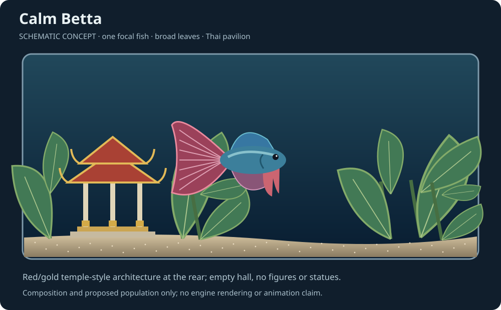
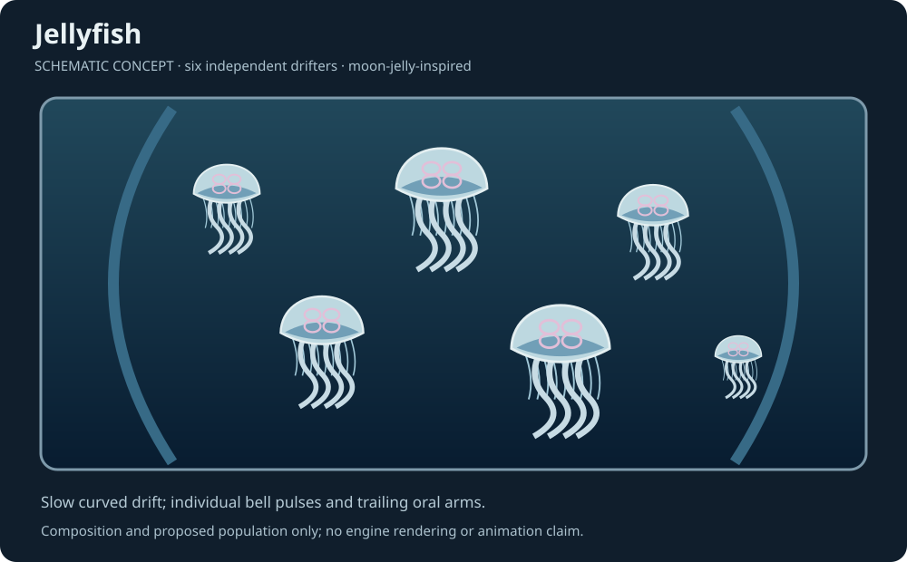
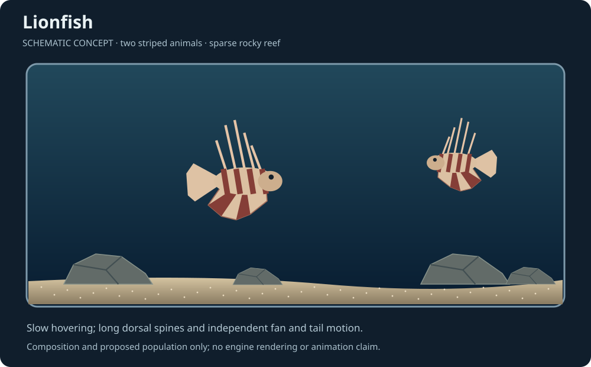
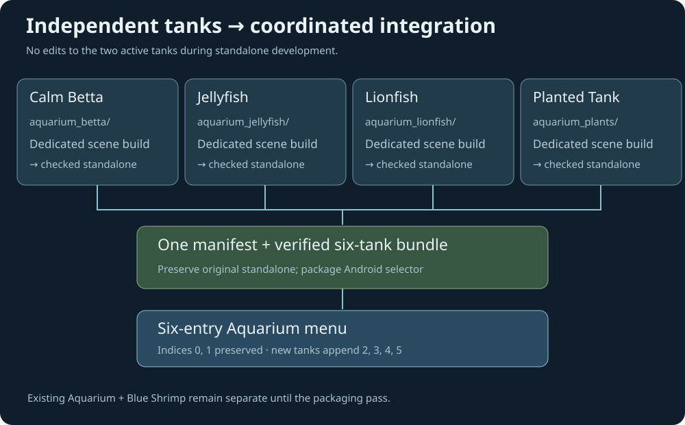
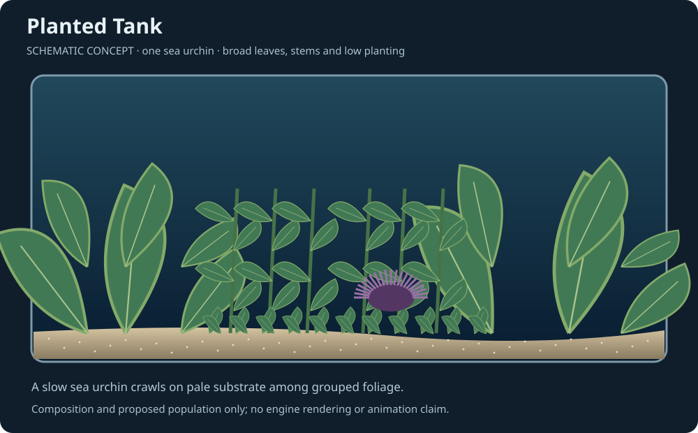
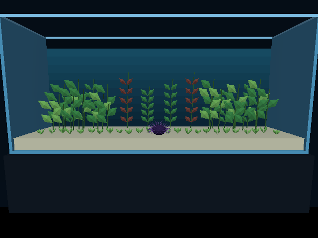
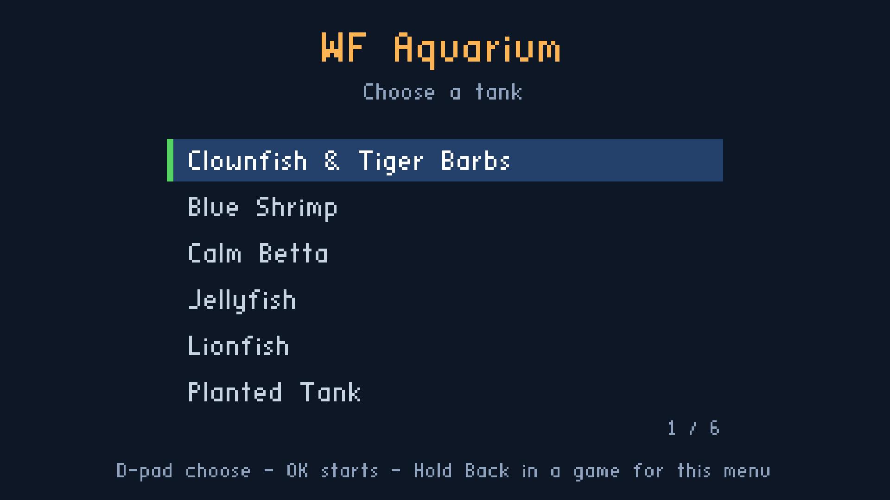
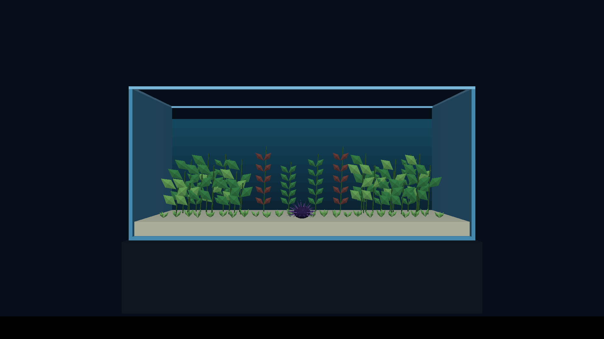

# Aquarium: Betta, Jellyfish, Lionfish and Planted Tank

Date: 2026-10-02. Status: **Betta, Jellyfish and Lionfish built and desktop-checked; Planted Tank built and checked; six-tank Android integration complete; six tank selections and Planted Tank resume verified on Chromecast HD.**

Will requested Betta, Jellyfish and Lionfish tanks, then added a plant-focused tank containing one slow sea urchin. Its final menu name is **Planted Tank**. The original aquarium, Blue Shrimp and these four tanks share one six-entry selector. Will assigned sole menu ownership after a duplicate five-tank path appeared; that path has been superseded and removed. The latest original aquarium standalone, including barb movement fixes, was preserved byte-for-byte while packaging.

- [x] Inspect the existing aquarium, Blue Shrimp and SMB menu plans.
- [x] Define three scenes, independent file ownership and staged verification.
- [x] Create tank mockups, a six-entry selector and a build/integration diagram.
- [x] Build each animal's compact articulated rig and verify real desktop animation.
- [x] Complete and verify each standalone tank on desktop, including the Thai pavilion.
- [x] Build an isolated six-tank desktop menu preview and verify selection/return and payload hashes.
- [x] Build and verify the Planted Tank standalone level, including the sea urchin at 1/20 of its initial speed.
- [x] Reconcile the six-tank bundle, Android asset link, release/debug build tasks and packaging tests.
- [ ] Verify release performance and physical desktop/Android/Chromecast controls.

## Implementation and actual engine evidence

The three standalone levels are built under [aquarium_betta](../../wflevels/aquarium_betta/README.md), [aquarium_jellyfish](../../wflevels/aquarium_jellyfish/README.md), and [aquarium_lionfish](../../wflevels/aquarium_lionfish/README.md). Their new [local toolkit](../../wflevels/aquarium_tanks/README.md) owns the geometry, zForth controller and Blender scaffolding. Tank sources do not modify the original aquarium, Blue Shrimp, engine or exporter. Menu integration deliberately updates the manifest, Taskfile and Android asset link, with the original standalone preserved.

[Open actual engine screenshots and motion clips](2026-10-02-aquarium-three-more-tanks/engine/index.html). These are separate from the schematic mockups below. Betta includes the red/gold Thai pavilion, open columns and empty hall, without any figures or statues. Jellyfish uses six independently pulsing opaque bells and separately moving oral arms/fringes. Lionfish uses two striped animals with long spines, moving fin fans and tail motion over sparse rocks.

The desktop runtime harness checks initialization, visual animation, resident movement, both camera views, input isolation, all six directional limits **and leaving each limit**, action motion and cooldown. Complete animated player bounds are checked through 72 headings and 12 gait poses. Eleven content checks cover fixed-point triangle safety, exported populations/anchored actors, mailbox/index limits, isolation and the pavilion's surface base. Planted Tank checks verify four crawl limits, inward recovery, substrate height, both views and action release. Physical touch and held remote Back remain pending.

The installed Android menu has six entries through `wflevels/aquarium-menu.manifest` and `aquarium-menu-cd.iff`. Both APK tasks use `build-cd-iff-aquarium-menu`, including the Planted Tank build dependency. `aquarium-cd.iff` remains the direct/Apple bundle. The accidental five-tank manifest, bundle and task were removed, with a reversible artifact backup in `/tmp/aquarium-menu-duplicate-backup/`. Tests check exact standalone payloads, menu indices, asset link and build dependencies.

The actual integrated desktop engine passed **5 → 2 → 3 → 4 → 0 → 1 → 5**, with six returns and exact payload hashes. All six rows fit at 640 × 480. [Integrated bundle results](2026-10-02-aquarium-three-more-tanks/engine/menu/integrated-six/checks.json). The isolated preview uses the same six entries; its first label remains “Original Aquarium”, while the installed entry is “Clownfish & Tiger Barbs”.

| Standalone | Animals | Actors | Desktop debug estimate ms/frame |
|---|---:|---:|---:|
| Calm Betta | 1 | 28 | 11.0 |
| Jellyfish | 6 | 41 | 26.1 |
| Lionfish (earlier capture) | 2 | 34 | 9.0 |
| Planted Tank | 1 sea urchin | 25 | 10.5 |

Raw results: [Betta](2026-10-02-aquarium-three-more-tanks/engine/betta/checks.json), [Jellyfish](2026-10-02-aquarium-three-more-tanks/engine/jellyfish/checks.json), [Lionfish](2026-10-02-aquarium-three-more-tanks/engine/lionfish/checks.json), and [six-tank menu](2026-10-02-aquarium-three-more-tanks/engine/menu/checks.json).

Runtime clips encode five seconds of fixed 20 Hz simulation at 20 fps; they do not measure real-time rendering FPS. Local debug wall-time timing estimates and raw results appear in the evidence gallery. Android menu packaging and APK builds are complete. Broad per-tank release frame distributions and physical touch remain pending. Jellyfish currently exceeds a 16.67 ms frame budget in the desktop debug estimate and needs release/device measurement and tuning before delivery.

## Mockups

[Open the visual gallery](2026-10-02-aquarium-three-more-tanks/index.html). Switch between all four tank concepts and review the six-entry menu and implementation diagram. These are **schematic design mockups**, not engine screenshots, exported meshes or measured animation. They show intended composition, silhouette and population. Real runtime evidence will be recorded separately after implementation.

## Four distinct scenes

The following populations, colors and controls are proposed game design defaults. They are adjustable after the single-animal spikes and performance checks, and are not real aquarium stocking advice. Keep the current presentation scale and tank envelope initially, with self-contained constants rather than imports from actively edited levels.

| Tank | Initial population | Composition | Idle motion | Player action proposal |
|---|---|---|---|---|
| Calm Betta | One controllable betta | Broad leaves, a Thai temple-style pavilion at the rear, pale substrate and clear foreground | Slow exploration, pauses near leaves, visible tail/fin movement | A modest swim burst with cooldown |
| Jellyfish | Six, including one controllable jelly | Dark blue display, rounded visual backdrop, open water without plants/rocks | Slow drifting, independent bell contractions and trailing appendages | A slightly stronger pulse with cooldown |
| Lionfish | Two, including one controllable fish | Sparse low rocks, pale sand and a broad open swimming corridor | Slow hovering, tail motion, fin fans and restrained breathing motion | A brief forward movement with cooldown |
| Planted Tank | One sea urchin | Broad-leaf clusters, upright stems and low planting over pale substrate | Slow substrate crawl; static plants | Whole-tank/close-up view toggle |

**Calm Betta:** use a recognizable flowing tail and ventral fins, with a restrained red/blue palette against green foliage. The mood comes from slow movement and pauses, not a motionless rig. Broad leaves form visual shelters without blocking the player or cameras. Keep a clear upper-water route and open front corridor. A single fish makes this a deliberate contrast to the barb school and shrimp colony. Add a small **Siam / Thai temple-style pavilion**, with red tiered gable roofs, gold trim, swept finials, pale columns and an empty open hall. **No Buddha figure, statue, or other human/religious figure.** This is architectural decoration. Place it at the rear left, with the base at the substrate and the open foreground retained for the fish and camera. The implemented procedural pavilion has no external texture or image dependency. Exact betta variety and final fin proportions are art choices to settle in the spike.

**Jellyfish:** start with a moon-jelly-inspired silhouette: shallow bell, visible internal fourfold motif, short fringe and a few trailing oral-arm forms. Moon jellies pulse and drift; see the [National Aquarium profile](https://aqua.org/explore/animals/moon-jelly). The proposed six animals have varied sizes, positions and pulse phases; they must not pulse together or follow identical paths. Use bounded deterministic curved routes with gentle steering/flow for the player. Bell contraction should change the bell's shape and coincide with a small propulsion pulse; uniform scaling of the entire animal is not finished animation. Trails bend and lag without requiring a separate physics body per strand. The player receives a subtle color distinction and close-up framing.

Jelly transparency is a specific visual risk. Begin with pale opaque/solid patterned geometry, dark water and real silhouette gaps. This establishes bell motion, readability and cost through the current rendering path. The mockup's pale fills do not promise translucent engine output. If that treatment looks too solid, review an actual engine spike and scope a separate renderer change before proceeding; do not quietly introduce blend shaders or depend on another agent's unfinished translucency work. The rounded display is a visual treatment, not a fluid simulator or assumption that the engine supports curved tank collision. Keep an invisible bounded enclosure and constrain paths away from the curved backdrop.

**Lionfish:** use red/brown and pale body bands, a compact volumetric head, long dorsal spines and radiating pectoral fans. The [Florida Museum's red lionfish profile](https://www.floridamuseum.ufl.edu/discover-fish/species-profiles/red-lionfish/) describes the elongated fins, bands and sheltering behavior. Use a sparse rocky reef with enough open water for the complete expanded silhouette to turn. Two animals, including the player, have separate positions and independent fin phases; the resident hovers along a slow authored route. Exact proportions remain a stylized art choice. Fin membranes use solid alternating colors with actual ray geometry; this build does not require transparency. Feeding, prey consumption, venom/damage mechanics and new audio are outside this implementation.

## Planted Tank — sea urchin among plants

Will changed the plant-only requirement to include **one sea urchin**, and chose the menu name **Planted Tank**. No fish, shrimp, jellyfish or additional residents. The scene contains grouped procedural foliage, pale substrate, necessary tank structure and the urchin. No rocks, wood, temple, statues, feeding or particles.

Dense broad leaves occupy both sides, taller stems line the rear, and low planting occupies the foreground. Restrained red/brown leaves provide accents. Leaves are closed folded meshes with visible front and back surfaces. Three static anchored plant groups avoid a separate actor per leaf. Plant species and urchin species are deliberately unspecified.

The urchin has a rounded purple test and staggered radial tapered spines. It is the actual visible player mesh, moving slowly along the substrate at 0.0125 world units/second (1/20 of the initial crawl speed, per Will’s feedback); it does not swim. Arrows left/right crawl horizontally, desktop B/C move toward/away. Vertical input cannot lift it off the substrate. A toggles whole-tank/close-up views with release required between presses; the touch profile retains A mode/B action mapping. Start wide; the close camera follows the urchin while staying outside the tank.

Own `wflevels/aquarium_plants/`, configuration, exports and `aquarium_plants-standalone.iff`. The plant scene uses an explicit path, no fish rig, no resident table and no creature-pose loop. Check leaf/spine triangle safety, shell clearance, visible urchin mesh, substrate height, horizontal/depth endpoints and inward recovery, view changes, held-action input, menu selection/return and Chromecast launch. Static planting is the first implementation; current sway remains optional future work.

Append **Planted Tank** at index **5** in the existing SMB-style selector. Package all six tanks through `wflevels/aquarium-menu.manifest` into the Android menu bundle, preserving the standalone/Apple bundle. Desktop and Chromecast checks will record actual screenshots separately from the design mockups.

## Files and concurrent work

| Tank | Owned source directory | Standalone payload |
|---|---|---|
| Calm Betta | `wflevels/aquarium_betta/` | `wflevels/aquarium_betta-standalone.iff` |
| Jellyfish | `wflevels/aquarium_jellyfish/` | `wflevels/aquarium_jellyfish-standalone.iff` |
| Lionfish | `wflevels/aquarium_lionfish/` | `wflevels/aquarium_lionfish-standalone.iff` |
| Planted Tank | `wflevels/aquarium_plants/` | `wflevels/aquarium_plants-standalone.iff` |

Each directory owns its generator, geometry, constants, zForth controller/animation, build/run scripts, exported assets and generated actor map. Root outputs use its matching prefix. Standalone builds must work without edits to the original aquarium, Blue Shrimp, `Taskfile.yml`, Android links, engine, existing bundles or menu files. Do not import the original aquarium's actively changing model/generator. Reuse stable exporter/OAD interfaces and documented conventions. Shared extraction waits until the levels settle; any future simultaneous implementers own different directories and use separate debug ports/evidence destinations.

Use the normal Blender → `.lev` → `.lvl` → IFF pipeline and packaged runtime assets. New scripts use zForth; new shell scripts start with `set -euo pipefail`. Generate actor indices and mailbox blocks from each level's export, checking actual capacities rather than copying shrimp indices. Shared devices and shared engine builds require coordination with the existing work. Desktop standalone development can proceed independently.

## Animation and controls

Build one animal for each tank before dressing the scene or multiplying its population. Compare static and animated versions using the same cameras/input. Betta and lionfish should use a volumetric mesh that remains recognizable head-on and during a full turn, with real tail/fin or breathing motion. Aim for one visible actor with mesh animation plus an invisible player hull; this is a target, not a proven exporter capability.

The tiger-barb work is investigating the existing vertex-animation path. Consume its verified result after it settles, without editing that prototype or assuming independent mutable per-instance vertex buffers already work. If no suitable path exists, profile a small articulated alternative and record its parts/actors/materials before choosing it. Jelly bell deformation has the same proof requirement; six copies must animate with distinct phases. Do not add a skeletal engine or a strand-by-strand actor rig as an unmeasured default.

Use documented X/Y/Z coordinates, explicit pivots and +X as the fish's head direction. Resting props have local bases at z=0. Lionfish clearance includes its long dorsal spines and both expanded fin fans, rather than the body hull alone. Triangle widths must survive the engine's fixed-point normal threshold, especially fin rays, spines and jelly trails. Keep phases bounded for long idle sessions.

Preserve the Aquarium's established steering/swimming and touch mode/action meanings, tuning speeds to each animal. Decorative animals do not each need a Jolt body. Use simple player hulls and authored clearances; calculate complete visible bounds through headings and animated poses rather than constraining only the body center. At a wall, suppress outward movement while preserving movement back into the tank. Test settling, steering around plants/rocks, action cooldowns and physical touch separately.

Give each scene a whole-tank camera and a smooth close-up with hysteresis. Betta fins, jelly bells/trails and the lionfish head must remain inside the close-up frame. Show the complete Thai pavilion in the whole-tank view; close-ups prioritize the animal. Keep the player findable at TV distance; prevent foliage, rocks and drifting residents from persistently covering it. Planning labels/guide lines are not shipped HUD elements.

## Stages and performance gates

1. **Betta spike, then standalone:** prove the flowing-fin silhouette and calm motion with one animal; add the broad-leaf scene after the animation/control profile.
2. **Jelly spike, then standalone:** establish bell deformation, appendage lag and the opaque rendering treatment with one jelly; compare one versus six, static versus animated, before finalizing routes and backdrop.
3. **Lionfish spike, then standalone:** prove bands, head/fin readability, full turns and slow swimming with one fish; add sparse low rocks and the second resident only after control/clearance checks.
4. **Planted Tank standalone:** build grouped planting, the sea urchin mesh and substrate navigation; compare static versus subtly animated plants and verify the one-urchin export.
5. **Coordinated integration:** once existing tank work and shared files permit it, package all six standalone levels with the existing SMB menu and verify the app.

This ordering is a proposed implementation sequence, not a dependency between level sources. The three scene directories can be developed independently. The implemented tanks share a new local toolkit under `wflevels/aquarium_tanks/`; it does not import or change either existing tank. Each level owns its configuration, exports and build/run scripts. The articulated rigs use four visual parts per betta/lionfish and three per jellyfish. Jelly bell-only nonuniform scaling changes bell shape; separately posed oral arms lag and sway. No engine deformation/transparency changes were required.

Blue Shrimp currently has 159 actors and a local debug/ASan estimate of 79.7 ms/frame. That motivates early actor/script budgeting; it is not a release/device result or a prediction for these tanks. One visible actor per animal is not by itself evidence of resource sharing or adequate frame time.

For each stage record actor count, triangles/materials/draws, script/pose/render costs where instrumentation permits, total-frame distributions and memory. Compare empty tank, one static animal, one animated animal, intended population and finished scenery. Keep target device/build, resolution, refresh, camera trace and inputs fixed; collect at least three 45-second release/device runs after warm-up. Target the active refresh budget (16.67 ms at 60 Hz), with p50/p95/p99 and missed-refresh counts. Tune any miss before marking ready. Record unavailable instrumentation explicitly, and never use fixed-timestep video playback as an FPS claim.

## Six-entry menu, when conflicts permit

Append stable indices; do not reorder the current two tanks. The first tank's final label remains to be settled because it retains a player clownfish while its followers become tiger barbs.

| Index | Proposed label | Payload |
|---|---|---|
| 0 | Existing aquarium — final label pending | `aquarium-standalone.iff` |
| 1 | Blue Shrimp | `aquarium_blue_shrimp-standalone.iff` |
| 2 | Calm Betta | `aquarium_betta-standalone.iff` |
| 3 | Jellyfish | `aquarium_jellyfish-standalone.iff` |
| 4 | Lionfish | `aquarium_lionfish-standalone.iff` |
| 5 | Planted Tank | `aquarium_plants-standalone.iff` |

Reuse `MENU`, the manifest packaging path and `shell-menu.fth`. Standalone level tasks produce independent artifacts; the bundle depends on all six; app launch/build tasks depend on the bundle. Avoid the existing generator-to-bundle dependency cycle. Keep direct standalone launch paths for development. Retain `aquarium-cd.iff` as the Android app bundle destination.

Preserve D-pad/up/down selection, OK/A activation, desktop input, release-before-entering, remembered selection and existing Back behavior. Confirm six rows fit at target resolution and remain readable in the real drawer; the mockup does not prove that. Desktop OpenGL and Android/Chromecast are the initial verified menu targets. Audit Apple menu drawing before replacing a bundle consumed there; falling back to index 0 does not satisfy selection.

## Acceptance and evidence

| Check | Required evidence |
|---|---|
| Each animal | Runtime wide/close-up, side/end/three-quarter views and motion clip showing its intended idle/movement behavior |
| Export | Valid normals/triangles/pivots, animated bounds, actor types, index/mailbox capacity and packaged references |
| Player | Six directional limits and movement away from each, full turns, action/cooldown, input isolation, no launch/trap while settling |
| Betta | Fin motion survives turns; leaves/pavilion do not trap or persistently hide the player; red/gold Thai architectural silhouette is visible; no figures/statues; calm idle remains visibly alive |
| Jellyfish | Independent pulses, bell deformation, lagging trails, smooth routes; no persistent overlap or boundary clipping |
| Lionfish | Both animals visible, striped bodies and long spines, independent fan/tail motion and full turns without clipping |
| Planted Tank | One sea urchin, no fish or resident animation tables; static plants/substrate/tank, bounded substrate crawl, readable leaves and clear camera routes |
| Cameras/reload | Smooth transitions, no persistent occlusion, deterministic fixed-seed/input trace and clean long-idle/reload behavior |
| Performance | Recorded static/animated/population/scenery comparisons and release/device frame/memory distributions |
| Menu | Integrated six-tank sequence passes: 5 → 2 → 3 → 4 → 0 → 1 → 5, correct payloads, memory and input release |
| Android/Chromecast | Cold launch, resume/reopen, D-pad/OK, held Back to menu, short Back exit, APK includes the six-level bundle |
| Regressions | Existing aquarium and shrimp checks plus SMB menu checks pass after coordinated integration |

Store real captures and machine-readable results under separate `engine/betta/`, `engine/jellyfish/` and `engine/lionfish/` evidence directories beside this plan. Keep concepts labelled when runtime images arrive. Tests should verify geometry/export/control invariants and actual traces, not merely mirror implementation formulas.

Related: [Blue Shrimp and menu](2026-10-02-aquarium-levels-blue-shrimp.md), [tiger-barb phases](2026-10-02-aquarium-tiger-barbs.md), [SMB selector](2026-10-01-level-menu-selector.md).

## Planted Tank implementation receipts

Three static anchored planting groups provide folded broad leaves, upright rear stems and a low foreground carpet. The visible sea urchin mesh is the player actor: a rounded purple test with tapered radial spines. Crawl speed is 0.0125 world units/second, substrate height is fixed at z=0.865, and the complete mesh fits within authored horizontal/depth limits. There are no fish rigs or resident pose tables. [Actual runtime checks](2026-10-02-aquarium-three-more-tanks/engine/plants/checks.json).

The current aquarium standalone SHA-256 remains `04f5cc0723d1527280aa854c9c59d4a6c7a7536d9a739a0773c68342867f9081`. Twenty focused content/menu/Android tests pass after refreshing the stale local APK fixtures. Release and debug Aquarium APKs contain the exact six-tank bundle. The new betta poster and flowing-fin upgrade have their own [research and implementation plan](2026-10-02-betta-poster-and-flowing-fins.md).

## Chromecast deployment

All six menu entries were opened with sequential ADB cold launches and OK selection; every process remained alive and current-launch logs had no script/assertion errors. The phone pairing panel was dismissed before capturing each scene. All six screenshots and the selector were visually inspected at 1920 × 1080, and Planted Tank resumed after Home. The device was left showing Planted Tank. [Exact tested APK checksum and device receipts](2026-10-02-aquarium-three-more-tanks/device/menu-six/checks.json). Physical remote held Back remains pending; desktop return-to-menu transitions pass. Lionfish was being rebuilt concurrently, so these receipts identify the deployed snapshot rather than claiming every later standalone rebuild has also been tested on the device.

