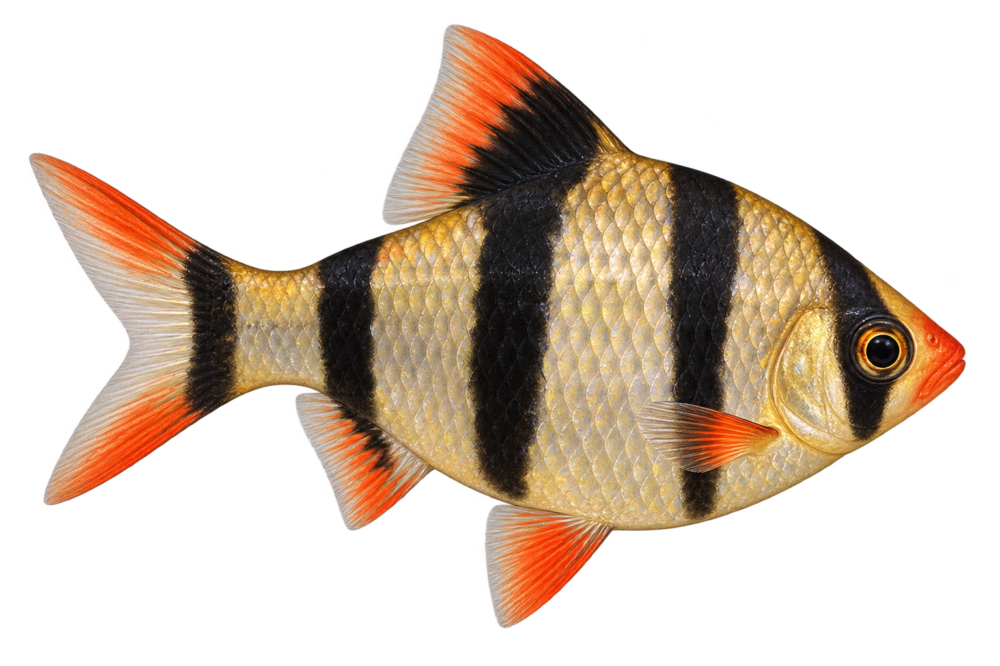
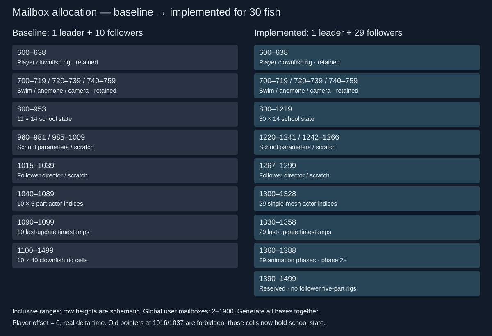
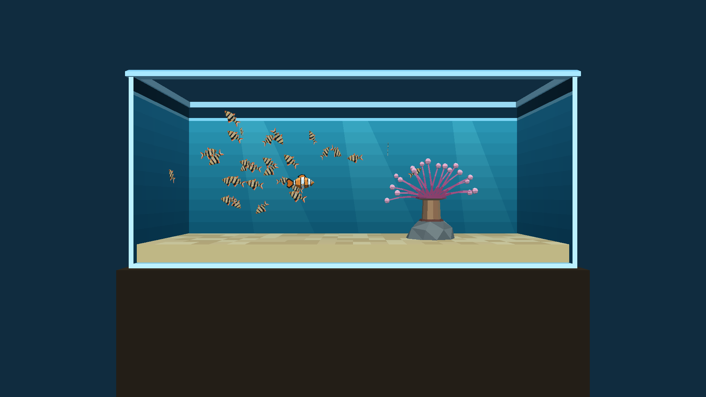
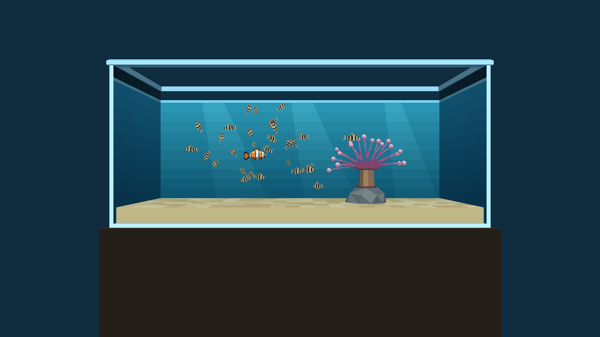
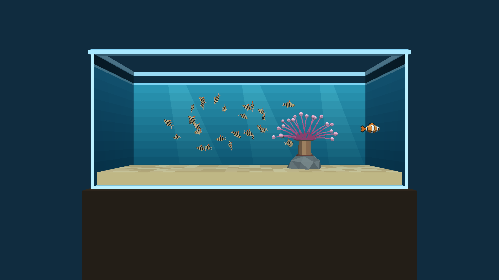
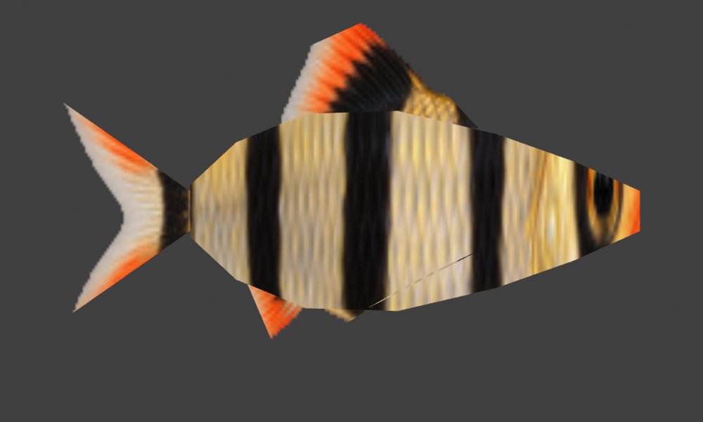
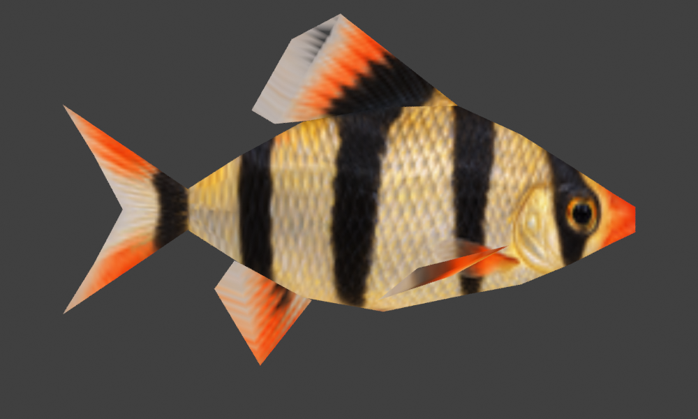
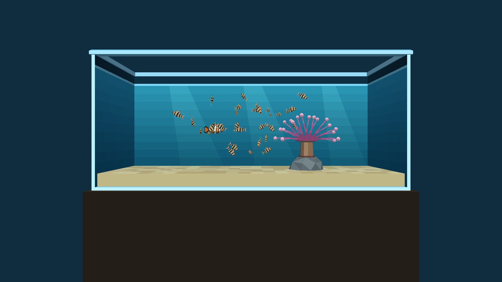
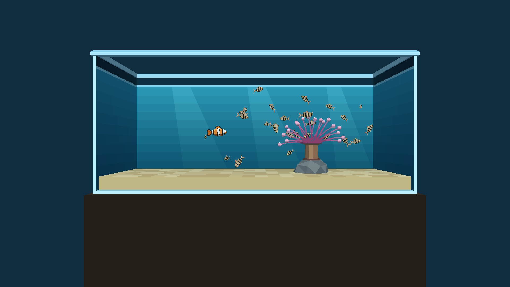
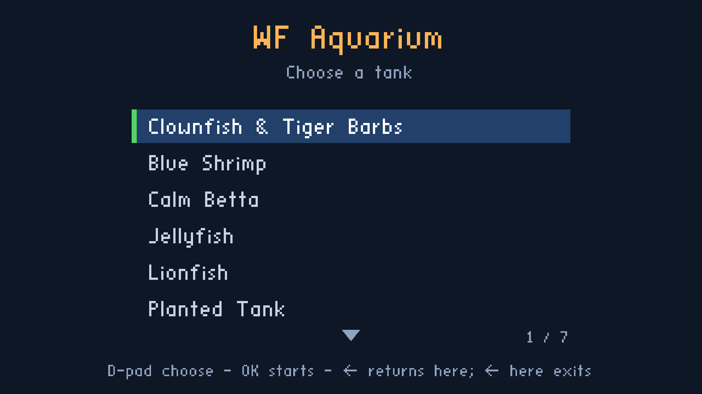

# Aquarium: 29 tiger barbs, one actor each

**Status:** all three phases implemented and profiled. Phase 3 is complete in the `aquarium/tiger-barbs-phase3` worktree and its normal seven-tank APK is installed on the Chromecast HD. Selector return, clean relaunch and Home/resume are verified. Main-checkout integration remains separate.

Replace the ten follower clownfish with **29 tiger barbs**, retaining the player's clownfish: **30 fish instead of 11**. First measure the population using one textured, two-sided quad per barb. Then replace each quad with one actual fish mesh, including swimming animation within that same mesh. Plan a third pass for improved meshes, with another profile before adopting them.

The working hypothesis is that reducing actor overhead matters more than reducing an already modest triangle count on the Chromecast HD. Profile it rather than assuming it. Geometry counts describe the assets; they are not a prediction of frame time.

## Visual review

[Open the interactive population comparison](2026-10-02-aquarium-tiger-barbs/mockups.html): switch between one clownfish, the current 11 clownfish, and the proposed 30 fish. These are schematic density mockups at the proposed side-view scale, not game captures or measurements. All tiger-barb phases use the same 29 positions and size distribution for comparison.

The wire overlays show topology direction, not an exported mesh or a UV bake. Phase 1 deliberately has no volume: a two-sided card still becomes edge-on when it turns. Phase 2 gives the body thickness and includes all fins and the tail in one mesh. Phase 3 improves those shapes and their deformation while retaining one actor per barb.

**Proposed sizes:** 4.5–6.0 cm **total length, nose to tail tip**, deterministically varied across the 29 followers; approximately 51–67% of the 8.89 cm player clownfish. With the aquarium's `WORLD_SCALE=10`, that is 0.45–0.60 level metres. Measure the fish silhouette, not the texture canvas or its transparent padding. The same sizes apply to all three phases. This is an asset-design range, not a claim about the species' complete biological size range; [FishBase's field guide](https://www.fishbase.se/FieldGuide/FieldGuideSummary.php?GenusName=Puntigrus&SpeciesName=tetrazona&print=&sps=) lists a maximum total length of 7 cm.

Use the normal tiger-barb colour form: pale gold/silver body, four broad dark bars, including the eye and tail-base bars, with orange/red fin accents. The [Canadian fisheries assessment](https://waves-vagues.dfo-mpo.gc.ca/library-bibliotheque/41217767.pdf) describes the wild-type four-bar pattern. The generated reference is illustrative artwork; its production export passed the alpha/UV checks described below. Keep the existing aquarium setting and player behaviour for this stylised mixed-species scene.

## What “one actor per fish” means in this engine

The player clownfish uses **one invisible player/collision actor plus five visible mesh actors**. A current follower has **five visible mesh actors**, without a separate invisible player actor. Barbs must each have **one visible actor and one mesh**, with no extra hull, tail, fin, helper or script actor. The existing Director owns their schooling and placement. Use the established Mass-0 anchored-platform approach without creating a Jolt body, and confirm this at runtime; `statplat` is not an interchangeable choice because it creates collision.

The current level test counts **32 actors for one clownfish and 82 for 11 clownfish**. Older proposed text in the schooling plan says 33/83; use the current builder/test and verify the exported runtime list. The verified new total is **61 level actors**, not 30: 26 scenery/system actors, six player-fish actors and 29 barb actors.

| Variant | Fish population | Follower actors per fish | Visible fish meshes | Fish-related actors, including player hull | Expected total level actors | Delta vs current fish actors |
|---|---:|---:|---:|---:|---:|---:|
| B1: baseline | 1 clownfish | — | 5 | 6 | 32 | −50 |
| B11: current | 11 clownfish | 5 | 55 | 56 | 82 | 0 |
| P1: quad | 1 clownfish + 29 barbs | **1** | 34 | **35** | **61** | **−21 (−37.5%)** |
| P2: actual mesh | Same 30 fish | **1** | 34 | **35** | **61** | **−21 (−37.5%)** |
| P3: improved mesh | Same 30 fish | **1** | 34 | **35** | **61** | **−21 (−37.5%)** |

These source counts match the final runtime object counters: B1 32, B11 82 and P1/P2 61, with 18/68/47 rendering actors respectively. Count actual exported actors, loaded collision bodies and renderer submissions in every receipt. One mesh does not guarantee one draw call; material splits and passes can change that.

The canonical clownfish generator currently yields 285 source vertices and **478 triangulated faces across the five visible parts** (310 body, 56 tail, 48 dorsal, 32 per pectoral). Source counts exclude the invisible collision hull, export duplication and clipping. Phase 1 adds exactly 58 source triangles across 29 quads, giving 536 visible fish triangles including the player versus 5,258 for 11 clownfish. The final phase 2 export has **76 vertices and 128 triangles per barb**, one mesh/material/actor, outward body faces and reverse fin faces. For phase 2 the initial target was around 96 triangles per barb; for phase 3 around 160, adjusting for the silhouette and measured cost. These are initial design targets, **not hard caps or promised speedups**. A better fish within one mesh is preferable to an arbitrary triangle target when profiles show the difference is immaterial.

## Expanded mailbox diagram

Thirty fish require **30 × 14 = 420 state cells**. Simply increasing `sch-n` would overwrite the old parameter, scratch and Director blocks. The current per-follower clownfish rig block also cannot grow to 29 × 40 inside the global mailbox space. Replace it with lightweight barb state, rather than copying it.

| Owner | Current addresses | Proposed addresses | Cells / indexing |
|---|---|---|---|
| Player clownfish rig | 600–638 | Retain 600–638 | Existing player rig only |
| Swim / anemone / camera | 700–719 / 720–739 / 740–759 | Retain these ranges | Existing level state |
| School state, including player as leader | 800–953 | **800–1219** | `800 + 14*f + slot`, `f=0..29`, `slot=0..13` |
| School parameters | 960–981 | **1220–1241** | 22 cells |
| School scratch | 985–1009 | **1242–1266** | 25 cells |
| Follower Director state/scratch | 1015–1039 | **1267–1299** | 33 reserved cells; define all named slots centrally |
| Barb actor-index table | 1040–1089, five entries per follower | **1300–1328** | `1300 + (k-1)`, `k=1..29` |
| Last schooling-update timestamp | 1090–1099 | **1330–1358** | `1330 + (k-1)` |
| Animation phase, phase 2 onward | Part of 1100–1499 rig blocks | **1360–1388** | One scalar per barb; reserve during phase 1 |
| Spare cells | — | 1329 / 1359 / 1389 | Unallocated |
| Reserved | Old follower rigs at 1100–1499 | **1390–1499** | No five-part follower rig storage |

This proposed layout ends below the global user-mailbox ceiling of **1900**. Before implementation, audit all aquarium consumers and benchmark/test fixtures for hard-coded bases; generate the allocation and Forth constants from one shared definition. Preserve the old baseline files with their original allocation. Assert inclusive range disjointness, highest address, actor-table length, valid runtime actor indices and first/last follower addresses. Initialise every assigned cell after level load/restart; do not rely on previous process contents. Use transient calculation scratch rather than adding another per-fish block unless profiling/animation proves it necessary.

The round-robin pointer currently wraps with a literal `10 mod`. Replace that with follower-count-derived indexing, including a safe zero-followers path. The builder currently rejects counts above ten. Both changes are part of phase 1, together with replacing the five-part posing path for barbs. Preserve the player's original five-part rig and its own tick.

## Baselines and profiling protocol

Capture **fresh B1 and B11 profiles on the local Chromecast HD before changing the level**, using the same engine revision, release build flags, ABI (`armeabi-v7a`), output resolution, camera and device setup as P1/P2. Preserve their generated levels/APKs with hashes; do not keep overwriting one baseline artifact while switching populations. Record the repository revision and any uncommitted diff, device model/serial, Android version, active display mode, package/build IDs and asset hashes.

The old school-core timings in [the swarming plan](2026-10-01-swarming-poster.md) are useful context only: its standalone interpreter and all-followers-per-frame bench are different workloads. Re-measure the current shipped aquarium. Keep its existing rate policy as B11 and explicitly log that policy: at about 60 Hz it updates two followers' schooling per frame, and the actual pose selection is `k mod 3`, despite older comments describing alternate frames. Do not silently change B11 to make a comparison look better.

Use a fixed seed/size list and repeatable controller trace in each variant: stationary player/swarm; steady swim/school; dart/startle; turn across the glass; anemone close-up and return. Record per-scenario results as well as a combined result so a close-up stall is not hidden by a wide-shot average. Keep scenery, anemone, camera logic, player rig and texture quality stable between corresponding runs.

Warm each variant for 30 seconds, then collect a fixed 60-second trace at least three times, with five approximately 12-second scenarios in the same order. Save each scenario separately as well as the combined result. This bounded trace keeps repeated captures practical while allowing a longer isolated scenario run when a bottleneck needs investigation. Rotate variant order and keep the device's thermal state comparable; record thermal status and CPU frequency where available. Keep cold-load time and peak loading memory in a separate measurement. Exclude warmup from steady-state numbers. Save raw data and individual runs before computing the median across runs.

| Measurement | Method and interpretation |
|---|---|
| Presented frame interval p50/p90/p95/p99, worst, FPS, missed-refresh % | Sample SurfaceFlinger continuously through each capture, clearing timestamps and deduplicating presents. The existing device script reads a short ring buffer at the end; extend collection for the full capture rather than reporting that tail as a 60-second profile. Record actual refresh period; use it for missed-refresh thresholds. |
| CPU frame work and thread utilisation | Use lightweight timed sections / Android tracing around actor traversal/update, Director schooling, follower placement, player rig, animation/deformation and render submission. Report ms/frame and frame percentiles. Present intervals alone are insufficient: vsync can hide a CPU saving. |
| Actor and transform work | Count live actors, collision bodies, actors updated, transform/mailbox writes per frame and update frequency per fish. Measure actor-management time; actor count alone is not evidence of a speedup. |
| Forth script work | Use the existing opt-in `--script-profile` for a separate diagnostic pass; record Director/player time, mailbox calls and schooling neighbour tests. Keep timing-heavy profiling disabled in the primary presented-frame comparison. |
| GPU/render work | Record submissions/draws, material switches, submitted triangles and texture uploads; measure GPU duration if supported on this device. If timer queries/counters are unavailable, mark GPU duration unavailable, and use controlled render-only comparisons without calling them GPU timings. Separate EGL/present wait from CPU rendering work. |
| Memory and asset cost | Capture `dumpsys meminfo` PSS/RSS consistently, peak loading memory where observable, CPU mesh/animation bytes and texture/atlas allocation/upload bytes. State whether each byte count is measured or derived; a shared texture still may incur atlas duplication. |
| Visual/behaviour quality | Capture the same wide view, turn/end-on view, close-up and dart sequence. Check wall clearance, collisions/overlap, lag after startle, size range, alpha halos, missing backsides and fish count. |

Use `scripts/android-device-run.sh` and the aquarium device input/capture tooling as the starting point, extending capture duration/counters where needed. Use `wflevels/aquarium/run_aquarium_checks.py --cost` for a **separate desktop diagnostic** (three 100/600-frame subtraction runs, vsync disabled, display awake); do not mix desktop milliseconds with Chromecast results. Keep each APK's matching level/texture/mesh receipts in this plan's artifact directory.

The additional 19 fish increase schooling work even when meshes get simpler. With the current all-neighbour scan, one complete follower-update sweep evaluates **100 neighbour pairs for B11 versus 841 for 30 fish**, a source-derived **8.41×** ratio. Holding two follower updates per 60 Hz frame gives 20 versus 58 neighbour checks per frame but changes the sweep interval from about 83 ms to 242 ms. Five updates per frame give the new school an approximately 97 ms sweep interval, at 145 checks per frame. These are calculations, not timing predictions; rejected neighbours and Forth call overhead still matter.

Profile both two- and five-update configurations as diagnostic variants. Select the primary P1/P2 policy using measured cost **and** comparable responsiveness; do not claim a performance win obtained only by making the school react three times less often. Avoid changing neighbour algorithms between P1 and P2; if optimisation is necessary, report its before/after separately. Single-mesh transforms should be cheap enough to pose all 29 barbs each frame, but measure that too: B11 currently staggers five-part poses, so fewer actors does not automatically mean fewer transform writes per frame.

## Phase 1 — textured two-sided quad

1. Archive B1 and B11 levels/APKs and capture their profiles. Keep build variants selectable without editing constants by hand: follower species/count and quad/mesh quality. Proposed new switches such as `AQUARIUM_FOLLOWER_ASSET=barb_quad|barb_mesh|barb_refined` must be implemented; they do not exist today. Existing `AQUARIUM_SCHOOL_N=0|10` supplies the baseline counts.
2. Create a production tiger-barb RGBA side texture from the reviewed concept. Start with a shared approximately 256×128 usable texture (adjust silhouette fit rather than stretching the fish). Document original image, prompt, transparent crop bounds, UV orientation, filtering, alpha handling and export/atlas settings. Retain the original concept unchanged. Validate the engine's texture/transparency path and exported material flags; alpha support cannot be inferred from a transparent PNG in the browser.
3. Make **one quad, four source vertices and two triangles** per barb, in the local X/Z plane, centred on its body, nose toward +X. Set the renderer's existing `DOUBLE_SIDED` material flag so one surface draws from both sides. Validate the exporter preserves it and the back is mirrored correctly. Do not duplicate actors or geometry for the reverse side. Use transparent silhouette pixels, depth testing and a consistent alpha policy; inspect overlap/sorting in the dense school. If the texture path needs alpha-cutout support, implement the smallest required change and profile it separately.
4. Expand/reallocate mailboxes as above; create 29 Mass-0 one-mesh followers with stable names/indices. Reuse school/swarm/startle behaviour and the player as leader, replacing follower rig placement with a single transform. Publish Euler A, B and C in that order because the C write commits the rotation. No tail/fin animation or extra physics bodies in this phase. The retained player rig must use `fish-off=0` and the unmultiplied frame delta; its former reads of 1016/1037 would overlap the expanded school state. Do not billboard the card to the camera and conceal the edge-on limitation.
5. Keep physical movement units clear. The user requested tighter barb-to-barb swarming during implementation. Use 0.7 leader body lengths of repulsion between barbs (about 6.22 cm centre-to-centre), 0.9 near the larger player (about 8.0 cm), reduce the player influence from 3 to 1.25, reduce swarm attraction width from 10 to 6 reference body lengths, and school orientation/attraction widths from 5/6 to 3/4. Spawn the school in a more compact grid. Hold these settings constant across P1/P2/P3 and profile their combined cost; this is an intentional behaviour change from B11, not a pure mesh-only comparison. The current school normalises to the player's body length; initially retain that reference unit so the phase comparison changes assets/population rather than silently rescaling all behavioural parameters. Use each barb's actual 4.5–6 cm size for clearance and visual scale. If species-size separation/speed tuning is needed, record it as a separate behaviour setting and hold it fixed for P1/P2/P3.
6. Run correctness checks for 0/10/29 followers, mailbox bounds, actor indexing, one mesh/no collider per barb, correct scaling and full school survival. Inspect two-sided rendering, transparent margins, near-glass overlap and restart. Build/run the release aquarium on the local Chromecast, collect the full profile and attach engine screenshots replacing/alongside the concept mockups.

The user also requested that a dart blocked by glass must not startle the school. Both follower rigs now require measured player displacement above 5 reference body lengths/second while the dart window is active, rather than reacting to the button/timer alone. This exceeds the normal swimming burst (4.49 BL/s). The check waits for actual movement and fires once per dart; remaining stationary or sliding slowly against glass does not fire it. Regression cases cover blocked darts, normal swimming, a dart that becomes able to move, repeated frames of the same dart, and the next dart. The [actual-engine regression trace](2026-10-02-aquarium-tiger-barbs/startle-regression.json) passed: the blocked fish stayed at the same position with zero startled followers; a free dart reached 6.86 BL/s and startled the nearby group after movement began.

**Exit evidence:** 30 visible fish individuals when viewed side-on, 29 one-actor barbs, expected 61 total level actors verified, intact player controls, no mailbox overlap, no unintended Jolt bodies, measured P1/B1/B11 comparison and saved artifacts. Edge-on disappearance is documented as the quad's intended experimental limitation. If the larger school's CPU work misses the display budget, identify that cost before increasing visual complexity.

## Phase 2 — one real mesh, with a small swimming cycle

1. Make a compact volumetric body with correct deep tiger-barb silhouette, a forked tail and readable dorsal/ventral/pectoral fins. Include all geometry in **one mesh on one actor**, with a shared texture and preferably one material. Start near 96 triangles, adjusting when needed for appearance. Add UVs for both sides and the dorsal/ventral surfaces; the side-view card texture alone is not a finished wrapped body texture. Verify exported UV seams/vertex duplication and actual draw count.
2. **Animation decision:** schooling translates/turns an actor, but a rigid 3D fish would look stiff in the close-up. Plan a minimal body-to-tail swimming deformation on this same mesh, with per-fish phase offsets and speed/startle-driven intensity. No separate tail actor and no return to the clownfish's five-part rig. Profile P2 with the cycle disabled and enabled to determine its actual cost.
3. First validate the existing vertex-animation path (`wfsource/source/anim`, `CYMP`/`CANM`) and the Blender export path using one test barb. Native vertex-animation support exists; a usable export path and independent per-instance mutable vertices/cycle phase still need proof. Prefer a short baked loop using that path. If it cannot satisfy these constraints, assess a small one-mesh procedural tail deformation and record the choice/cost before introducing it. Do not assume a skeletal pipeline exists or add one just for these fish.
4. Keep the head stable and increase lateral displacement toward the tail. Include fins in the same mesh/animation. Use an actual time-based phase, scale speed for the gait, and avoid rigid whole-body wobble as a substitute for a tail stroke. Check whether 20/30 Hz deformation with per-frame transforms is sufficient at TV distance, comparing against 60 Hz if visibly necessary. State update rates in results and keep independent phases, not 29 perfectly synchronised swimmers.
5. Share immutable texture/mesh/clip resources when the engine safely supports it; keep only genuinely mutable per-instance data private. Do not share a writable vertex buffer between differently phased actors. Measure memory and resource reuse rather than assuming the loader deduplicates everything.
6. Profile P2, static and animated, against P1 and both original baselines using the same population, size list, behavioural settings and trace. Measure added animation/deformation work separately, include close-up/turning captures, and run wall/startle/restart/player regression checks. Install the completed phase on the local Chromecast after the comparison is reviewable.

**Exit evidence:** recognizable three-dimensional barbs from side and end views; one actor/mesh each, visible tail motion without extra parts, measured per-barb actor/animation cost below a follower clownfish where the measurements support it, and complete tables including any failure to improve whole-frame cost. A lower actor count is required; a lower triangle count by itself is not acceptance evidence. Target the active display's frame budget (about 16.67 ms at 60 Hz), reporting p95/p99 and missed-refresh changes rather than just average FPS.

## Phase 3 — better meshes, planned after phase 2

Improve the body profile, snout/gill area, tail peduncle, fin silhouette, texture mapping and tail deformation while keeping **one actor and one mesh per barb**. Start around 160 triangles as a design point, with triangle count guided by appearance and measured costs. Add distance-based mesh/animation detail only if the wide and close-up profiles justify the complexity; document material/draw implications. Avoid adding fin actors.

Re-run B1, B11, P1 and P2 when measuring P3 if the engine or device conditions have changed. Profile P3 static/animated and any detail levels with the same capture protocol. Adopt it only after reviewing the visual gain and actor/animation/render/memory deltas. This phase remains a plan; no P3 timing is available until its meshes exist and have been run on hardware.

## Comparison tables and required deltas

Measured on the local Chromecast HD, using 30 seconds of warmup and five approximately 12-second input scenarios. These phase comparisons precede the movement-continuity follow-up below. Presented-frame results are medians across **three uninstrumented runs**, except final P2 static (**one exploratory run**). CPU and memory are from one separate, matching-engine instrumented trace per variant. Raw per-run and per-scenario results are linked below.

| Variant | Actor CPU ms | School CPU ms | Pose incl. animation ms | Render CPU ms | Total CPU mean ms | Presented p50/p95/p99 ms | FPS | Missed refresh % | Matched PSS MiB | Draws / submitted triangles |
|---|---:|---:|---:|---:|---:|---|---:|---:|---:|---|
| B1 | 1.636 | 0.000 | 0.000 | 2.451 | 4.855 | 16.683/16.684/16.684 | 59.83 | 0.19 | 33.95 | 17 / 1443 |
| B11 | 2.577 | 1.753 | 1.980 | 6.441 | 13.528 | 16.683/33.366/33.367 | 56.92 | 5.27 | 35.98 | 67 / 3822 |
| P1 quad | 2.031 | 9.952 | 1.503 | 3.322 | 17.431 | 16.683/33.367/33.367 | 45.78 | 30.13 | 34.58 | 46 / 1501 |
| P2 static | 2.054 | 9.840 | 1.501 | 7.078 | 21.095 | 16.683/50.050/50.050 | 39.50 | 42.55 | 34.40 | 46 / 3285 |
| P2 animated | 2.019 | 9.831 | 1.981 | 7.044 | 21.493 | 16.684/50.050/50.050 | 38.71 | 46.59 | 34.45 | 46 / 3286 |
| P3 improved mesh | Planned | Planned | Planned | Planned | Planned | Planned | Planned | Planned | Planned | Planned |

CPU values use thread CPU time, excluding EGL wait, weighted over complete five-second windows inside the input trace. School and pose are nested in Director/Update; animation is nested in pose. **Total = Update + Render**; do not add nested sections. Actor time includes physics traversal. CPU percentiles cannot be reconstructed faithfully from the aggregated windows; this table reports measured means instead. GPU duration, cold-load time and peak loading memory were not collected. Submitted triangles include scenery and vary with visibility/culling.

| Comparison (new − reference) | Δ total CPU ms / % | Δ actor CPU ms / % | Δ school ms / % | Δ pose ms / % | Δ presented p95 ms | Δ missed refresh pp | Δ PSS MiB / % |
|---|---|---|---|---|---:|---:|---|
| B11 − B1 | +8.673 / +178.6% | +0.942 / +57.6% | +1.753 / unavailable | +1.980 / unavailable | +16.683 | +5.08 | +2.028 / +6.0% |
| P1 quad − B1 | +12.576 / +259.0% | +0.395 / +24.1% | +9.952 / unavailable | +1.503 / unavailable | +16.683 | +29.94 | +0.627 / +1.8% |
| P1 quad − B11 | +3.903 / +28.8% | -0.547 / -21.2% | +8.199 / +467.7% | -0.477 / -24.1% | +0.000 | +24.86 | -1.401 / -3.9% |
| P2 animated − B1 | +16.638 / +342.7% | +0.383 / +23.4% | +9.831 / unavailable | +1.981 / unavailable | +33.367 | +46.40 | +0.501 / +1.5% |
| P2 animated − B11 | +7.965 / +58.9% | -0.558 / -21.7% | +8.078 / +460.8% | +0.001 / +0.1% | +16.684 | +41.32 | -1.527 / -4.2% |
| P2 static − P1 quad | +3.664 / +21.0% | +0.023 / +1.1% | -0.112 / -1.1% | -0.002 / -0.1% | +16.683 | +12.42 | -0.180 / -0.5% |
| P2 animated − P2 static | +0.398 / +1.9% | -0.035 / -1.7% | -0.009 / -0.1% | +0.480 / +32.0% | -0.000 | +4.04 | +0.054 / +0.2% |
| P2 animated − P1 quad | +4.062 / +23.3% | -0.012 / -0.6% | -0.121 / -1.2% | +0.478 / +31.8% | +16.683 | +16.46 | -0.126 / -0.4% |
| P3 comparisons | Planned | Planned | Planned | Planned | Planned | Planned | Planned |

**Finding:** one actor per barb reduces whole actor-update CPU by about 22% versus B11, but the 29-follower neighbourhood scan costs about 9.8–10.0 ms/frame. Final animated meshes add rendering work, producing **38.71 FPS**, versus **45.78 FPS** for quads and **56.92 FPS** for the original eleven clownfish. Animation deformation itself costs **0.127 ms/frame** for all 29 fish. The actor reduction works; it does not compensate for the larger school and mesh submission costs. Optimising schooling and per-face CPU submission is a better next performance experiment than assuming fewer triangles alone will solve it.

The original B1/B11 presentation captures use the preserved shipped engine/APKs. Matched CPU/memory baselines use the current engine and corrected startle behavior. Barbs intentionally change population, tighter schooling and update frequency; the baseline comparison is not a mesh-only experiment. B11 updates two followers per frame and poses one third of ten followers; P1/P2 update five and pose all 29. At measured FPS, average schooling updates per fish are about 11.38 Hz for B11, 7.89 Hz for P1 and 6.67 Hz for P2. Retain five updates for the playable variant rather than disguising lag as a performance improvement.

PSS comparisons above use the same engine/profiling configuration. Original APK total PSS was about 26–27 MiB, but code-sharing/accounting differs by roughly 9 MiB from current builds; that difference must not be attributed to the fish assets. Texture allocation is derived: the 256×128 RGBA atlas is 0.125 MiB before driver overhead. Animation rest positions/weights require a derived 26,448 bytes across 29 meshes.

Final outward body winding and reverse fin faces reduce submitted triangles from about 4,923 to 3,286. They did **not** improve measured FPS: initial double-sided P2 static/animated medians were 39.81/39.26, versus final 39.50/38.71. Those earlier three-run receipts remain available as `P2-static` and `P2-animated`; final static has only one run, so its animation delta is exploratory.

### Capture receipts and variation

- B1: 3 presentation run(s), FPS range 59.78–59.86; [presentation and scenarios](2026-10-02-aquarium-tiger-barbs/profiles/B1-original/analysis.json), [matched CPU and memory](2026-10-02-aquarium-tiger-barbs/profiles/B1-matched-cpu/analysis.json).
- B11: 3 presentation run(s), FPS range 56.31–57.25; [presentation and scenarios](2026-10-02-aquarium-tiger-barbs/profiles/B11-original/analysis.json), [matched CPU and memory](2026-10-02-aquarium-tiger-barbs/profiles/B11-cpu/analysis.json).
- P1 quad: 3 presentation run(s), FPS range 45.77–46.05; [presentation and scenarios](2026-10-02-aquarium-tiger-barbs/profiles/P1-tight/analysis.json), [matched CPU and memory](2026-10-02-aquarium-tiger-barbs/profiles/P1-matched-cpu/analysis.json).
- P2 static: 1 presentation run(s), FPS range 39.50–39.50; [presentation and scenarios](2026-10-02-aquarium-tiger-barbs/profiles/P2-culled-static/analysis.json), [matched CPU and memory](2026-10-02-aquarium-tiger-barbs/profiles/P2-culled-static-cpu/analysis.json).
- P2 animated: 3 presentation run(s), FPS range 38.58–38.84; [presentation and scenarios](2026-10-02-aquarium-tiger-barbs/profiles/P2-culled-animated/analysis.json), [matched CPU and memory](2026-10-02-aquarium-tiger-barbs/profiles/P2-culled-animated-cpu/analysis.json).

### Short controlled probes

| Stationary diagnostic | CPU total mean ms | School CPU ms | FPS |
|---|---:|---:|---:|
| P1-two-updates-cpu | 11.313 | 3.914 | 59.44 |
| P1-frozen-cpu | 7.644 | 0.0 | 59.69 |

Two updates approaches refresh rate in this stationary trace, but slows the 29-fish sweep to roughly 15 frames rather than six. Frozen simulation retains all fish actors/poses/rendering and removes the neighbour scan. Keep the responsive five-update policy in the installed game; these are diagnostic alternatives.

The two-update and frozen-school captures are twelve-second stationary diagnostics after warmup, each one instrumented run; they are not substitutes for the full playable trace. A simulation-active/drawing-disabled probe remains a possible follow-up, not a collected GPU timing. Invalid early mailbox-collision, empty-atlas and pre-UV-fix captures are excluded from all final tables. Raw input segments, SurfaceFlinger timestamps, screenshots, thermal/memory receipts, APK hashes and scoped logs are retained in each capture directory. Screenshot gaps and warmup are excluded; clock alignment at scenario boundaries is approximate within a poll round trip plus a frame.

### Actual engine captures

## Artifact and implementation checklist

The artifact directory is [`2026-10-02-aquarium-tiger-barbs/`](2026-10-02-aquarium-tiger-barbs/). Files include the original generated texture concept, native SVG population/mesh/mailbox diagrams, their deterministic layout generator, interactive HTML, startle regression receipt and measured `profiles/` variants linked above, containing raw logs/traces, input seed/trace, screenshots, build/hash receipts and a summary JSON/CSV. Capture receipts identify update policy, actual actor/body/mesh/material counts, source/exported geometry counts, resource bytes and measurement methodology.

Implementation primarily touches `wflevels/aquarium/blender_create_aquarium.py`, `school_rig.fth`, a new `tiger_barb.py` asset generator and texture/animation export inputs; `school.fth` should retain its behaviour unless a separately measured optimisation requires changes. Update the aquarium level tests and mailbox/profile fixtures for count-derived allocation and one-mesh followers. Keep the current baseline variant reproducible. Record every phase's conclusions and screenshots back here before proceeding to the next phase.

**Review gate fulfilled:** the plan and mockups were opened in the browser and the user explicitly authorised implementation.

### Mockup provenance

The side-profile raster was generated with the imagegen skill/built-in image generator and saved unmodified as `tiger-barb-texture-concept.png`. Prompt: one strict orthographic right-facing tiger barb; golden-silver compact deep body; exactly four black bars at eye, mid-front, rear body and tail base; orange/red fins and snout; simplified readable game art; straight rest pose; transparent background; no water, shadows, text or other fish. The retained PNG is RGBA, 1536×1024; it is a reference, not the final atlas-ready texture. `make-mockups.py` creates native SVG layout/geometry diagrams and HTML around that raster without editing its pixels. The 29-fish layout uses a deterministic 4.5–6 cm length list and a 47-inch tank-interior reference.

### Implementation and verification receipts

The original 1536×1024 RGBA concept remains unchanged. Its alpha-128 silhouette bounds are `(45, 38, 1483, 966)`. The production texture is 256×128 with binary alpha at threshold 128. The old modern renderer sampled RGB and forced alpha to one; the loader already supported alpha. Opt-in alpha cutout now discards transparent texels. The genuine 32-bit TGA import path also needed alpha/RGB bit-order correction, verified by importer tests. Other material behavior retains its existing settings. Quad flags are `0x1e`; mesh flags are `0x16`. Both are prelit and alpha-cutout; the mesh culls body backsides and includes reverse fin faces in the same mesh. Body UVs stay inside the opaque flank.

The final animation bends the rear body/tail at 3 Hz and about 4% of fish length, holding the front 35% stable. Vertex deformation uses actor-private rest positions/weights and two trig evaluations per fish, with no extra fin or tail actors. The shared school mailbox definitions, player `fish-off=0` and actual frame delta prevent the expanded school from aliasing the old player offsets 1016/1037.

Startle requires actual measured post-physics player movement above five body lengths/second during a dart, once per dart window. Pressing against glass no longer startles the school. [Actual-engine regression receipt](2026-10-02-aquarium-tiger-barbs/startle-regression.json): blocked position unchanged, zero speed, zero startled followers; free dart 6.857 body lengths/second, 29 nearby followers startled. Both barb and original clownfish rigs have this gate.

Verification: 84 relevant Python checks and one Rust texture-import test passed, including mailbox allocation, fish counts, geometry/UV/alpha, deformation and startle regressions. Release ZIP inspection confirmed both Android ABIs, the current aquarium asset hash and absence of diagnostic `wf_args`. Two debug-APK artifact checks were excluded because that separate debug APK is stale; the installed release was inspected directly.

Reproducible builders/captures are `scripts/build-aquarium-variant.py`, `scripts/profile-aquarium-chromecast.py`, `scripts/analyse-aquarium-profile.py` and `scripts/check-aquarium-startle.py`. Variant switches select original clownfish, quad or mesh; count, update frequency, static/frozen and profiling are explicit. Preserved APK/level/texture/config receipts are under `/tmp/aquarium-barb-baselines/`; tracked capture receipts record hashes and settings. Initial phase-2 level-CD SHA-256 (before the motion follow-up): `f17e18c8ef0c8575e6690fe1cfc3f223d9828aabfbb1fe9bbc58db610b494e81` (280,576 bytes). The normal final release has profiling disabled.

Initial installation before the motion follow-up: [device lifecycle receipt](2026-10-02-aquarium-tiger-barbs/final-install-lifecycle.json), [installed screenshot](2026-10-02-aquarium-tiger-barbs/final-installed.png), [resumed screenshot](2026-10-02-aquarium-tiger-barbs/final-resumed.png). Clean relaunch changed process PID; Home/resume retained it and rendered the tank. Initial phase-2 APK SHA-256: `b690163eec88d044a210a05cb1de386a41dd01d900d6c593fd259f8609f5f952`.

### Follow-up: continuous movement and bounded turns

Will reported jumpy barb movement independent of frame rate. The renderer extrapolated each fish along its old heading between sparse schooling updates, but `sch-follow` committed a position advanced along the new heading for that entire elapsed interval. That introduced a position discontinuity at the behavior boundary. The barb rig now carries the old-heading endpoint forward and applies the new heading to subsequent travel. It clamps extrapolated positions at the glass rather than briefly displaying fish outside the bounds. No actor, mailbox range, mesh, school population or behavior-update frequency is added.

Yaw and pitch now ease from the existing actor rotation every frame, taking the shortest revolution wrap. Large turns, including wall reflections, are capped at 180 degrees/second, so an exponential ease cannot still jump dozens of degrees in a single frame. The original startle movement gate remains in place.

- [x] Regression coverage in `tests/test_aquarium_barb_motion.py`: old/new heading boundary continuity at four elapsed intervals, glass bounds and shortest-wrap/capped rotation.
- [x] 48 aquarium asset, level, alpha/deformation, startle and movement checks passed; the final turn-cap/startle subset passed all 10 checks.
- [x] Regenerate the final standalone aquarium for integration into the five-tank selector. Standalone SHA-256: `04f5cc0723d1527280aa854c9c59d4a6c7a7536d9a739a0773c68342867f9081`; single-tank CD SHA-256: `46fb8315fa34ddb4f11f2b607f596420c9fe7838dae4e5e0d69c53dcbc3244e7`.
- [x] [Final real-engine movement receipt](2026-10-02-aquarium-tiger-barbs/barb-motion-regression.json): 29 fish, 160 measured frames at 20 Hz; maximum movement 0.088902 world metres/tick, matching the 0.0889 speed limit within fixed-point rounding, and maximum yaw step 0.02501 revolutions (9 degrees), matching the turn cap.
- [x] Included and installed in the [five-tank selector release](2026-10-02-aquarium-five-tank-selector.md), with exact final standalone payload verified. APK SHA-256: `6236ade65122ff712556be9a183ca83f1240bf9d85549830eb6f1bcc6de352b0`. See that plan for device control checks and their limits.

An intermediate continuity/easing release was installed and captured with the full warmup/input protocol: [one-run measurement](2026-10-02-aquarium-tiger-barbs/profiles/P2-smooth/analysis.json), **37.26 FPS**, p95 **50.05 ms**, versus the preceding P2 median **38.71 FPS** (−1.45 FPS). It includes additional prediction/bounds work and actor rotation reads. This is one exploratory run and predates the final hard turn-rate cap; it does not replace the three-run phase table or establish the final cap cost. Motion correctness was evaluated separately through actual per-frame positions, rather than inferred from FPS.

## Phase 3 — refined single-mesh barbs (2026-10-03)

Implementation lives on `aquarium/tiger-barbs-phase3` in `.claude/worktrees/tiger-barbs-phase3`, based on `10310efe`. The normal builder selects `barb_refined`; explicit `barb_mesh` preserves phase 2 for repeatable comparisons. The refined asset has nine body sections, a tapered snout, narrower peduncle, shaped tail lobes with an open fork, and swept paired fins. Body UVs map the flank’s full usable height, including the eye and gill area, instead of vertically stretching a narrow texture strip. Dedicated fin UV islands sample the caudal, dorsal, anal and pectoral artwork on that same texture. The body stays within opaque texels; fins retain cutout alpha and reversed faces in the same mesh.

The asset contains **98 source vertices and 172 triangles**, versus phase 2’s **76 vertices and 128 triangles**: +22 vertices and +44 triangles per barb. There is still **one actor, one mesh and one material per barb**, 29 followers and 61 total level actors. Nominal total length remains 4.5–6.0 cm; the refined geometry’s nose-to-tail bounds equal its configured length. Schooling, movement continuity, turn limits, startle rules, five behavior updates per frame and the existing rear-body travelling wave are shared unchanged between P2 and P3. No distance-detail mechanism is added without evidence that it is necessary.

### Close asset previews

These Blender renders use the exported UVs and production 256×128 texture, with no subdivision or smoothing. They show the rest pose, not a new illustration or an actual engine capture. The script is [render-comparison.py](2026-10-02-aquarium-tiger-barbs/phase3/render-comparison.py).

| Phase 2 | Phase 3 |
|---|---|
|  |  |

### Fresh comparison protocol

Re-run B1, B11, P1, P2 static, P2 animated, P3 static and P3 animated against identical native libraries from the backed-up installed Aquarium APK. For each variant: three uninstrumented presentation runs plus a separate instrumented CPU/memory run; each uses 30 seconds of warmup and the same five 12-second input scenarios. Retain raw timestamps, input boundaries, thermal receipts, memory, scoped counters, screenshots and APK/config hashes under [profiles/phase3-comparison](2026-10-02-aquarium-tiger-barbs/profiles/phase3-comparison/). CPU measurements are nested; report total Update + Render separately rather than adding nested actor/school/pose scopes.

Asset-only benchmark packaging uses `scripts/build-aquarium-variant.py --base-apk /tmp/aquarium-before-phase3.apk`; every comparison reuses the same native libraries, app resources and signing identity. Diagnostic APKs contain only their selected tank. The final normal APK must contain all seven selector tanks and no profiling argument. Keep the main checkout unchanged.

The first three shape-prototype captures used a nose that was 2% short. They are retained separately as `profiles/P3-shape-prototype` and excluded from the final comparison table. The final mesh restores the exact nose-to-tail length, uses dedicated fin UV islands, and is rebuilt before its measured captures. A failed B1 launch that left Aquarium is retained as `profiles/B1-interrupted-excluded` and contributes no measurements; subsequent captures assert that Aquarium remains the foreground activity.

### Verification and adoption

Geometry checks cover exported fixed-point minimum triangle area, body-face winding, two-sided fins, interpolated UV alpha at source and production texture resolutions, and the full-length bounds. The final asset, actual-engine schooling/movement and APK regression suite is recorded below. All matching profiles and the normal selector installation are complete. See [integration notes](2026-10-02-aquarium-tiger-barbs/phase3/integration.md) for the concurrent main-checkout species movement work; regenerate combined bundles rather than replacing its other tank assets.

### Fresh phase 3 measurements

These results use the final full-length mesh and dedicated fin UVs, not the shape prototype. Three presentation runs and one separate instrumented trace per variant completed on the Chromecast HD at 1920×1080. All use identical native libraries and the fixed warmup/input protocol above; all captured thermal status values are zero. This fresh set supersedes the earlier table for comparisons against phase 3, because the earlier profiles predate the continuity/turn fixes and current device conditions.

| Variant | Actor ms | School ms | Pose ms | Animation ms | Render ms | Total CPU ms | Present p50 / p95 / p99 ms | FPS | Missed refresh % | PSS MiB | Draws / triangles |
| --- | --- | --- | --- | --- | --- | --- | --- | --- | --- | --- | --- |
| B1 | 1.592 | 0.000 | 0.000 | 0.000 | 2.407 | 4.755 | 16.683 / 33.367 / 33.367 | 56.14 | 6.69 | 29.35 | 17 / 1444 |
| B11 | 2.599 | 1.761 | 2.014 | 0.000 | 6.438 | 13.617 | 16.683 / 33.367 / 33.367 | 51.11 | 16.85 | 31.44 | 67 / 3826 |
| P1 | 2.021 | 10.345 | 2.247 | 0.000 | 3.321 | 18.567 | 16.683 / 33.367 / 50.050 | 43.30 | 35.72 | 28.70 | 46 / 1502 |
| P2-static | 1.992 | 10.139 | 2.226 | 0.000 | 7.121 | 22.103 | 33.367 / 50.050 / 50.050 | 37.29 | 52.88 | 29.46 | 46 / 3288 |
| P2-animated | 2.020 | 10.248 | 2.723 | 0.126 | 7.186 | 22.801 | 33.367 / 50.050 / 50.050 | 36.78 | 54.88 | 31.24 | 46 / 3286 |
| P3-static | 2.013 | 10.125 | 2.248 | 0.000 | 8.535 | 23.539 | 33.367 / 50.050 / 50.050 | 35.52 | 59.19 | 29.79 | 46 / 3922 |
| P3-animated | 2.014 | 10.174 | 2.739 | 0.142 | 8.469 | 24.015 | 33.367 / 50.050 / 50.050 | 34.97 | 63.07 | 29.83 | 46 / 3924 |

Actor/school/pose/animation scopes are nested, and **Total CPU = Update + Render**. The animation column is the native vertex-deformation scope, already included in pose. CPU and memory are measured in a separate instrumented trace; FPS/percentiles are medians from three uninstrumented runs. The CSV/JSON preserve scenario breakdowns, run FPS ranges, object counters, resource sizes and deltas.

| Final animated P3 delta against | Actor ms | School ms | Render ms | Total CPU ms | FPS | Missed refresh percentage points |
|---|---:|---:|---:|---:|---:|---:|
| B1 | +0.423 | +10.174 | +6.061 | +19.260 | -21.162 | +56.383 |
| B11 | -0.585 | +8.412 | +2.031 | +10.398 | -16.140 | +46.220 |
| P1 | -0.007 | -0.171 | +5.148 | +5.447 | -8.325 | +27.347 |
| P2-animated | -0.006 | -0.074 | +1.283 | +1.213 | -1.803 | +8.188 |

**P3 animated versus P2 animated:** +1.213 ms total CPU (+5.32%), chiefly +1.283 ms rendering (+17.85%); native animation +0.016 ms, with actor and school differences small enough to treat as trace variation. Presented FPS drops 1.80 (−4.90%); p95 and p99 remain approximately 50.05 ms, while missed refresh rises 8.19 percentage points. Draws remain 46. The static comparison independently shows +1.414 ms rendering and +1.436 ms total CPU. The refinement has a measurable rendering cost; reducing fish actor count does not remove geometry-processing cost. These are CPU rendering scopes, not isolated GPU timings.

The body/fin/UV improvement is adopted as the normal worktree build at that documented cost. It keeps one actor/mesh/material per barb, without a new detail-level system or reduced school update budget. `barb_mesh` remains the explicit P2 comparison/revert switch. Schooling still accounts for roughly 10.17 ms within animated P3’s Update scope; optimising it would be separate work.

### Memory and resource comparison

| Animated build | Total PSS MiB | Native heap KiB | Graphics KiB | Source/exported vertices | Mesh triangles | Mesh file bytes | Level CD bytes |
|---|---:|---:|---:|---:|---:|---:|---:|
| P2-animated | 31.24 | 5832 | 6044 | 76 / 76 | 128 | 3144 | 280576 |
| P3-animated | 29.83 | 5996 | 6108 | 98 / 98 | 172 | 4024 | 280576 |

The apparent total-PSS decrease is **not an asset memory saving**: the Android `System` PSS category is about 1.42 MiB lower in the later P3 trace. P3’s measured native heap rises 164 KiB and Graphics rises 64 KiB versus animated P2. Static P3 adds 136 KiB native heap and 128 KiB Graphics versus static P2. The shared mesh grows 880 bytes; sector padding leaves the level CD at the same byte size. All variants retain eight static collision bodies; P1/P2/P3 retain 61 level actors and 47 rendering actors.

- [Interactive close-preview and scenario comparison](2026-10-02-aquarium-tiger-barbs/phase3/comparison.html), with its embedded final table.
- [Comparison JSON with absolute and percentage deltas](2026-10-02-aquarium-tiger-barbs/phase3/comparison.json), [CSV](2026-10-02-aquarium-tiger-barbs/phase3/comparison.csv), [reproducible summary script](2026-10-02-aquarium-tiger-barbs/phase3/summarise-comparison.py).
- [Mesh/material metrics](2026-10-02-aquarium-tiger-barbs/phase3/mesh-metrics.json), [variant APK/resource hashes](2026-10-02-aquarium-tiger-barbs/phase3/builds/artifact-hashes.json), [exact source hashes](2026-10-02-aquarium-tiger-barbs/phase3/source-files.json).

A single uninstrumented late P2 control after the full suite measured **36.84 FPS**, versus the earlier three-run P2 median **36.78 FPS** (within 0.3%). It is a drift check, not an additional P3 result or replacement for the three-run medians. [Late control receipt](2026-10-02-aquarium-tiger-barbs/profiles/phase3-comparison/P2-animated-late-control/analysis.json).

### Final normal installation

The installed seven-tank APK preserves both native ABIs, current launcher resources and phone controls from the backed-up app; only `assets/cd.iff` changes. It contains no profiling arguments. All seven standalone tank payloads are present, with the refined barbs in the first tank. [Final APK receipt](2026-10-02-aquarium-tiger-barbs/phase3/final-apk.json), [device lifecycle and installed hash receipt](2026-10-02-aquarium-tiger-barbs/phase3/device/lifecycle.json).

APK SHA-256: `ca149e8e024396570999006b220246ce14ed31fb8af6dcefe6bbde8084a210e9` (3,619,526 bytes), exactly matching the APK pulled back from the installed package. Test key events dismiss the phone overlay, open the first tank and return to the selector. Home/resume keeps PID 21554; force-stop/relaunch starts PID 21755 and renders the refined tank. The selector, returned selector and relaunched tank screenshots were visually reviewed. These are injected-key checks, not a new physical-remote test of all seven tanks.

Final verification: **64 checks passed; two debug-APK-only checks skipped** because this worktree has no separate debug APK. The normal release APK checks passed. Coverage includes fixed-point geometry/UV alpha, native deformation, actor/mailbox counts, continuous movement and bounded turns, actual-engine player/scenery behavior, and seven-tank APK contents. [Verification receipt](2026-10-02-aquarium-tiger-barbs/phase3/verification.json), [pytest output](2026-10-02-aquarium-tiger-barbs/phase3/verification.txt).

The complete measured set contains 21 primary presentation captures, seven separate CPU/memory captures and one late presentation control. Prototype and interrupted captures remain explicitly excluded. The source worktree is ready for review and integration; it has not been merged into the concurrently edited main checkout.
