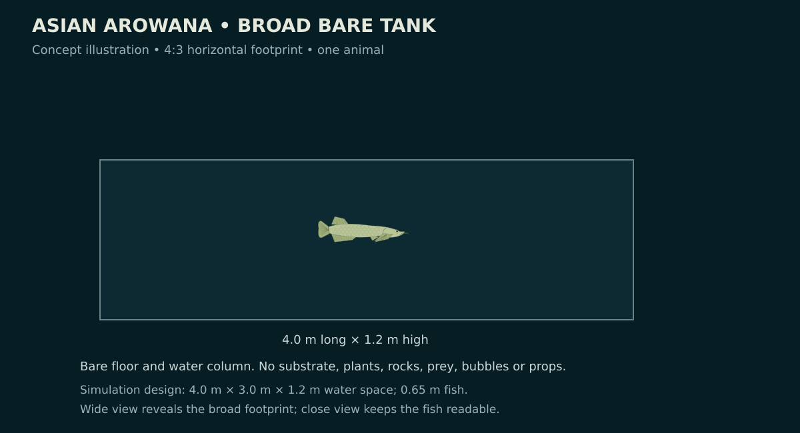
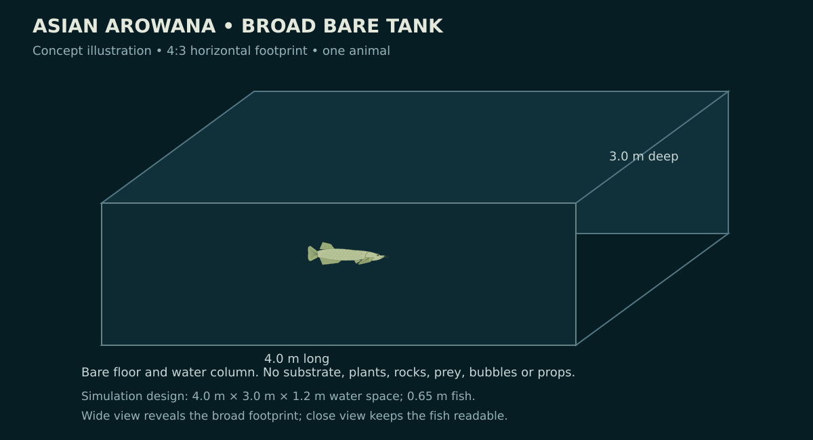
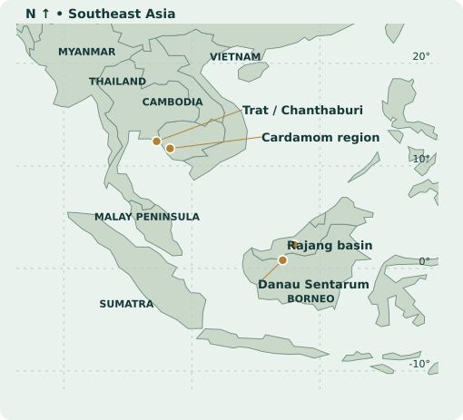
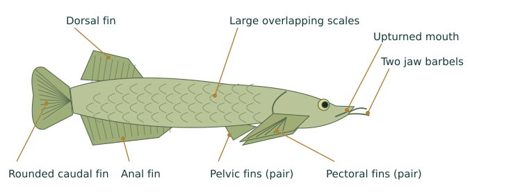
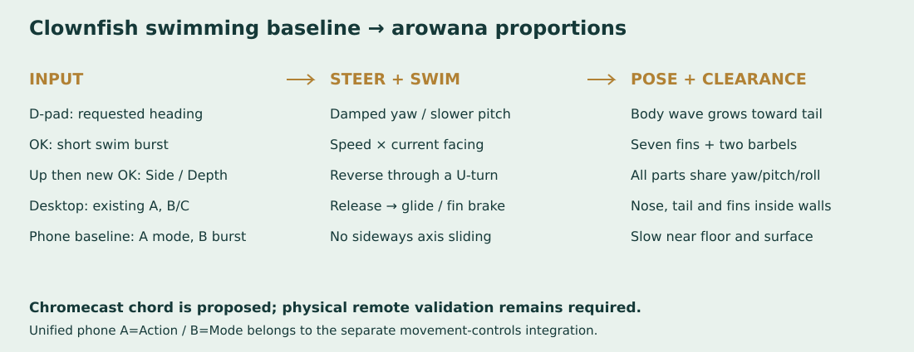

# Asian Arowana — one fish in a bare tank

Date: 2026-10-02. Requested by Will. Status: broad-tank level, long-fish controller, attached fin deformation and seventh menu entry implemented; desktop verification passed; response patch deployed and D-pad recovery checked on Chromecast HD; physical remote gestures/lifecycle/profiling pending.

## The scene

Make a new level named **Asian Arowana** with one player-controlled Asian arowana (*Scleropages formosus*). The fish is the entire attraction. No sand, substrate, plants, rocks, ornaments, other animals, visible food, bubbles, or decorative particles. An empty tank enclosure, water/background treatment and lighting provide the minimum space needed to see the fish. The floor is a plain empty tank boundary, not a sand-colored plane. Any required collision/camera/director actors stay invisible.

Start with a green/gold appearance informed by the side-view photograph below. Preserve the elongate body, deep overlapping scales, upturned mouth, paired jaw barbels and distinctive posterior fins. Keep the materials opaque: the engine does not yet support translucency. A pale fin membrane with darker rays can convey the fin structure without alpha blending.

**Tank revision, 2026-10-02:** Will prefers a bigger, more square tank and delegates the final proportions to research-informed judgment. Use a **broad rectangular tank, 4.0 m long × 3.0 m deep × 1.2 m high**, with the **0.65 m total-length fish**. The 4:3 horizontal footprint gives a distinct near-square enclosure while keeping a longer swimming axis. This supersedes both the original 3.0 × 1.2 × 1.0 m box and the briefly proposed narrow tank with rounded ends. No oval or curved collision system is required.

The [USFWS species account](https://www.fws.gov/sites/default/files/documents/Ecological-Risk-Screening-Summary-Asian-Bonytongue.pdf) reports up to 0.90 m total length. [Practical Fishkeeping’s species feature](https://www.practicalfishkeeping.co.uk/features/how-to-keep-asian-arowana/) recommends tank length of six times fish length and width of twice fish length, illustrating 3 × 1 m for a 0.50 m adult. Applied to the chosen 0.65 m game fish, that guideline gives 3.9 × 1.3 m. The selected 4 × 3 m footprint retains that long swimming axis and adds substantial turning space in keeping with Will’s preference. The 1.2 m height and added width are game design choices; neither source establishes an optimal near-square tank or these exact dimensions. These are simulation dimensions, not a husbandry specification for a maximum-size adult.

Keep the enclosure bare, with a plain floor and no scenery or animals beyond the one arowana. Reframe wide/close views and regenerate side/oblique mockups to show the broader footprint. Keep a normal camera view that makes the front-to-back depth apparent; a front elevation alone would hide the shape change. Validate reversals, diagonal turns, depth swimming and corners against all six walls using the entire animated fish envelope, including nose, tail, barbels and fins.

Apply the aquarium ×10 world-scale convention consistently: **40 × 30 × 12 world units**, fish total length **6.5 units**. Keep dimensions in a species configuration so later size changes do not require edits to shared tank code.

## Review artifacts

- [Tank mockups and diagrams](2026-10-02-asian-arowana/index.html)
- [Actual A3 poster](../reference/asian-arowana-poster/poster.html) · [print PDF](../reference/asian-arowana-poster/asian-arowana-a3.pdf) · [PNG preview](../reference/asian-arowana-poster/poster.png)
- [Poster sources, licensing and reproduction](../reference/asian-arowana-poster/README.md)

The following tank images are original concept illustrations, not game screenshots or exported mesh renders. The poster contains two actual licensed photographs, an original anatomy diagram, a map built from Natural Earth data, and a clearly identified proposed motion diagram.

## Research that informs the fish

The USFWS account reports the species from parts of Cambodia, Indonesia, Malaysia, Myanmar, Thailand and Vietnam; named examples include Trat/Chanthaburi, the Cardamom region, Danau Sentarum and the Rajang basin. Its habitat includes slow forest waterways, lakes, swamps and flooded forests; some streams are tannin-stained blackwater. Young fish take insects at the surface, while adults also take fish and small vertebrates. The reported maximum is **90 cm total length**, including the caudal fin. These observations inform the animal and poster, rather than adding scenery or prey to this level. [USFWS, 2019](https://www.fws.gov/sites/default/files/documents/Ecological-Risk-Screening-Summary-Asian-Bonytongue.pdf)

Pouyaud, Sudarto and Teugels describe the elongate body, large scales, paired barbels and fin anatomy. Their 2003 paper proposes splitting colour varieties into species; later broad accounts do not use that treatment consistently. Keep this project’s label *S. formosus* and identify the chosen green/gold visual treatment, without claiming every ornamental colour name is an accepted species. The male carries eggs and larvae in his mouth; the paper also discusses the dragon-fish association with luck and prosperity. [Original study, Cybium 27(4):287–305](https://horizon.documentation.ird.fr/exl-doc/pleins_textes/divers19-11/010033034.pdf)

The poster labels **Endangered, IUCN 2019 assessment**, rather than implying a new assessment in 2026. The current FishBase field guide displays the assessment date as 3 June 2019 and links the assessment. NParks’ July 2026 page also identifies Asian arowana as a CITES Appendix I species; the poster does not give import or ownership advice. [FishBase assessment link](https://fishbase.se/Fieldguide/FieldGuideSummary.php?c_code=458&genusname=Scleropages&speciesname=formosus), [NParks](https://avs.nparks.gov.sg/businesses/breeders/ornamental-fish-business/)

Treat captive and introduced records separately from native distribution. A published Lower Peirce observation explicitly describes Singapore arowana as introduced. Older Myanmar accounts can overlap with taxonomic changes involving *S. inscriptus*; do not manufacture a precise Myanmar range from that evidence. [NUS biodiversity record, 2013](https://lkcnhm.nus.edu.sg/app/uploads/2017/04/sbr2013-021.pdf)

The map uses a real Natural Earth coastline and country boundaries. Its four gold dots are approximate **region centres**, not GPS sightings or statements that these populations remain extant. No country is filled as a species range; no complete/current range polygon is drawn. Coordinates and that limitation are recorded in [locations.json](../reference/asian-arowana-poster/locations.json). Natural Earth data is [public domain](https://www.naturalearthdata.com/about/terms-of-use/).

## Model and rig

Build a dedicated fish rather than stretching a clownfish. Separate the body/head, caudal fin, dorsal fin, anal fin, left/right pectorals, left/right pelvics and left/right barbels: **10 primary groups**. Eyes, gill-cover detail, mouth/jaw and scale relief can be additional meshes. Seven fins means three unpaired fins plus two paired sets; both sides must exist in three dimensions even when hidden in the side-view diagram.

Begin around 6,000–10,000 triangles for the complete hero fish, then measure frame time and memory on Chromecast. This is a profiling target, not a reason to remove the barbels, paired fins or scale silhouette. Use shallow overlapping scale geometry for the prominent rows; avoid expensive fully separate high-resolution copies of every scale. Increase head and gill-cover resolution where the close view reveals it. Maintain a lightweight distant version if profiling requires it.

Use an explicit head→tail coordinate and rest pose. Keep the head comparatively stable and grow lateral body-wave displacement toward the peduncle and tail. Give the dorsal and anal fins local deformation weights, independent pectoral paddling/braking, small pelvic stabilization, and restrained barbel motion. Move every appendage through the same root yaw/pitch/roll transform. Avoid fixed-world fin pieces and billboard-only scales. The current shared X-wave deformer is a starting point; any extensions must preserve existing fish and use model metadata rather than fish-specific engine branches.

## Motion and controls for the long fish

Use the **0.65 m total-length fish in the 4 × 3 × 1.2 m bare tank**, with the same ×10 spatial scale as the other tanks. The broad footprint is meaningful swimming space: depth steering and an oblique wide camera must expose it. Record total length, body-only length and the maximum animated envelope separately; the paired barbels extend the clearance envelope beyond the mouth.

States: **rest/scull → build forward drive → cruise → brake/turn → rebuild drive**, plus **brief burst → recovery**. Input requests heading and drive; movement remains along current facing. A reversal brakes into a broad U-turn and accelerates as the body aligns. The head leads, the posterior body and tail follow. Do not rotate the complete straight fish around its centre at full cruise speed, reverse its velocity before turning, or use sideways translation to manufacture turning room. Large direction changes immediately enter a braking turn. Retain gentle forward creep, blending the cruise rate toward a bounded fin-assisted rate as speed falls. At a wall, retain steering authority for small inward changes even when forward motion is blocked. The full swept silhouette stays reserved; these are game approximations, not measured arowana pivot maneuvers.

**Turn radius scales with length and speed.** Start with a cruise radius of at least **0.75 total lengths** (0.4875 m / 4.875 world units), increasing toward **1.25 lengths** near walls or during a burst. These are review values, not biological limits. Limit yaw rate by `abs(yaw_rate_rad_s) <= forward_speed / turn_radius` while cruising. Keep the existing damping as well; a fixed yaw-rate cap alone allows an implausibly tight arc as speed drops. Give the separate braking/low-speed reorientation state its own bounded rate limit instead of dividing by a near-zero speed or freezing the controls. For example, at 2 world units/s and a 4.875-unit radius, the cruise cap is about **0.065 revolutions/s**, appreciably below the draft’s fixed 0.23 rev/s ceiling. The full U-turn corridor must accommodate the fish envelope as well as twice the centre-path radius.

**Pitch and bank stay restrained.** Begin with roughly 20° ordinary pitch, 30° only when clear of floor/surface, and ≤8° bank. Changes ramp; Up/Down asks for a forward climb/dive, and release gradually levels. Near a wall, Up alone should steer into available water before climbing, rather than lift a level body or remain pinned nose-first. Reduce allowable pitch using transformed nose and tail clearance; a 65 cm fish needs more vertical room than the invisible hull suggests.

**Rig response:** keep the head and anterior body relatively stable; grow the lateral wave toward the peduncle and caudal fin. Cruise uses modest, coherent body–tail strokes; burst temporarily increases drive and stroke amplitude; coasting reduces them. Tune cadence for this fish instead of copying the clownfish’s pectoral frequencies or mandatory short burst/coast cycle. Dorsal and anal fin roots must follow the locally bent posterior body, with their free edges lagging. Both pectorals respond asymmetrically to turning and flare for braking; both pelvics stabilize. Both barbels follow the jaw/root pose with only small delayed flex. Transform every attachment by full yaw/pitch/bank and keep local bend/fin deformation consistent with that transform. Inspect fin roots under maximum bend, not only when the body is straight.

**Anticipate wall clearance.** Use a conservative multi-segment body envelope or sampled deformed bounds, including tail swing, pectoral spread and barbels. Check the current pose and the proposed short turn sweep before applying steering. Start braking at the larger of stopping distance and swept-envelope clearance, with a margin. A 180° request chooses the inward side offering clearance for the whole fish, including corner and diagonal cases. If neither forward arc fits, brake, then use the bounded low-speed reorientation state. Position clamping is a final numerical safeguard; visible sideways pushes, instant heading flips or tail clipping fail review. Maintain inward recovery when the fish starts against any wall.

**Controls:** Side mode maps Left/Right to heading and Up/Down to pitched forward swimming; Depth mode maps Up/Down to toward/away heading. Plane switching changes input interpretation only: it preserves pose/momentum and waits for neutral/repress before accepting new directional drive. OK alone requests a restrained forward burst on a new press, with recovery before another burst; holding/repeating OK cannot stack speed. Hold Up, then press OK to switch plane; consume the chord through both releases so it never also climbs or bursts. Desktop keeps the existing A burst and B/C depth mapping. Preserve the current phone A=Mode/B=burst for baseline captures; adopt the shared proposed A=Action/B=Mode explicitly with help updates. No feeding, prey-release chord or jump action belongs to this tank. Preserve Back/menu, clear held input on suspend/reconnect, and retain the physical-remote Controls-panel fallback.

**Camera and review:** oblique wide view shows the 4:3 footprint and the complete turn path; close side view shows body curvature, fin attachment and barbels. Follow the fish centre smoothly with hysteresis; frame the entire fish during maximum yaw/pitch without whipping the camera toward the requested heading. Capture matched start, sustained cruise, reversal, corner U-turn, pitched climb/dive, burst, release/brake and wall-recovery traces. Log actual speed, heading/pitch, yaw rate, requested/achieved radius and minimum full-envelope clearance. Verify 20/30/60 Hz traces, prolonged low-speed input, diagonal steering and input release order. Desktop screenshots and pivot checks alone do not establish full silhouette clearance, convincing motion, or Chromecast performance.

The standalone now uses a species controller in `aquarium_tanks/arowana_motion.fth`, canonical input/math helpers, and ten anatomical groups in a common rest frame. Length-dependent curvature, predictive braking with a conservative full-turn reserve, posterior fin-root following, burst recovery and neutral plane switching are implemented. Actual compiled-Forth tests exercise 20/30/60 Hz motion, walls/corners, reversals, slow frames and input rearming; renderer tests verify attachment and rest-pose deformation. The desktop check covers transformed animated-envelope clearance; the response revision also checks direction-to-motion latency. Physical remote/lifecycle validation and Chromecast profiling remain pending. Shared integration contract: [Aquarium movement and controls](2026-10-02-aquarium-movement-and-controls.md).

## Files, integration and ownership

Keep the new implementation isolated under proposed `wflevels/aquarium_arowana/` and species helpers under `wflevels/aquarium_tanks/`. Generate the new standalone before editing menu packaging. Do not overwrite `wflevels/aquarium/`, its current standalone, or the other species’ work.

When ready, append **Asian Arowana at index 6** to the canonical `aquarium-menu.manifest` and rebuild `aquarium-menu-cd.iff`; preserve indices 0–5 and **Planted Tank**. Update menu tests from six to seven entries only at that integration step. Keep Android’s asset link and APK dependencies on this canonical path. Do not introduce another parallel menu manifest/pack. Menu ownership stays with this workstream; coordinate any device testing so one actor controls the Chromecast at a time.

## Implementation and acceptance checklist

- [x] Research biology, habitat, regional locations, anatomy and conservation context; distinguish captive/introduced observations.
- [x] Produce side/oblique mockups, anatomy, movement and controls diagrams.
- [x] Build the actual A3 poster with licensed full-fish/head photographs, geographic map, diagrams and source credits.
- [x] Select revised tank shape/dimensions: broad rectangular 4 × 3 × 1.2 m, informed by adult length and swimming-space guidance.
- [x] Regenerate broad-tank mockups and build the 4 × 3 × 1.2 m enclosure with wide/close camera framing; final clearance validation remains below.
- [x] Build the opaque 3D fish, named rig groups and appendage deformation; capture actual side/oblique renderings for later model review.
- [x] Generate a standalone with one animal and bare floor/water column; content tests audit inherited scenery/prey.
- [x] Port the clownfish steering/swim behavior and full-root pose; compare start, reverse, pitch, burst, release glide and wall approach captures.
- [x] Validate nose/tail/barbel/fin clearance during U-turns and maximum pitch, including corners and all six walls. Show no clipping, snaps or world-fixed appendages.
- [ ] Profile realistic wide/close views on Chromecast; record frame time and any justified mesh reduction.
- [x] Append the seventh canonical menu entry, update payload/content tests and exercise all seven selections and returns in the desktop engine.
- [ ] Validate device cold/resume paths with the final engine and bundle.
- [ ] Test the physical one-button remote and fallback if necessary, without overlapping device inputs.

Implementation: `wflevels/aquarium_arowana/`, model/rig `wflevels/aquarium_tanks/arowana.py`, controller `wflevels/aquarium_tanks/arowana_motion.fth`. Build with `bash wflevels/aquarium_arowana/build.sh`; run with its `run.sh`. The default profile supports the one-button remote chord and desktop depth keys. The oblique camera sits inside the enclosure so opaque walls cannot obscure the fish. The canonical menu appends index 6, preserving indices 0–5.

Response revision, 2026-10-03: a recorded reversal previously took 11.65 s to begin swimming the requested way and 13.10 s to approach alignment. It braked almost to rest before entering a 0.035 rev/s turn. The controller now enters the braking turn immediately, retains 0.9 world units/s of forward creep where clear, and ramps its yaw cap toward 0.18 rev/s as speed falls. Cruise is 2.8 world units/s; acceleration, release and pitch response are quicker. Normal cruise retains the existing length-based radius. These are deliberate game response choices. The compiled-Forth trace now begins reverse motion around 2.3 s and approaches alignment around 3.5 s. Tests require reverse motion within 3 s and near alignment within 4.5 s at 20/30/60 Hz.

The previous cruise-only yaw limit could freeze a small inward request when speed reached zero at a wall. A blocked fish now enters the bounded turning state even for a small heading error and completes alignment before returning to cruise. A regression starts almost flush with a corner and demands recovery within four seconds. No position push is required. The Up+OK mode classifier now accepts direction-first and simultaneous presses; OK-first retains Action. Neutral/repress behavior and burst cooldown remain intact. Pectoral cadence is reduced to 0.65–1.2 Hz for the existing rig.

Desktop evidence: [checks and telemetry](2026-10-02-asian-arowana/engine/checks.json), [close view](2026-10-02-asian-arowana/engine/side-close.png), [wide oblique view](2026-10-02-asian-arowana/engine/whole-tank-oblique.png), [reversal capture](2026-10-02-asian-arowana/engine/reverse-turn.mp4). The revised video records each 20 Hz simulation step at 20 fps and spans five seconds of simulated reversal; capture overhead is excluded, so it is not a performance benchmark. The desktop engine measured first reverse motion at 2.35 s and near alignment at 3.30 s; all 255 audited poses passed with minimum full-envelope clearance of 0.366 world units. All 22 focused motion/content/deformation tests pass, including existing Betta regressions, and six menu/content checks pass. Physical remote testing, lifecycle validation and Chromecast profiling remain open. The response update is deployed as described below.

TV response update, 2026-10-03: Will identified TV remote speed and getting stuck as the problems. Inspection of the installed APK confirmed it still carried the original 2.0 world units/s cruise and 0.035 rev/s turn. The revised 2.8 cruise/controller was packaged into that installed release, preserving the other six level payloads, menu labels, native libraries and all other non-signature/non-bundle APK entries byte-for-byte. The resulting bundle matches the canonical local menu. The signed replacement is installed on Chromecast HD; the standard release APK output now matches it.

[Native device checks](2026-10-02-asian-arowana/device/2026-10-03-response/checks.json) and [package preservation checks](2026-10-02-asian-arowana/device/2026-10-03-response/package-checks.json): a 2.5 s Right hold plus release coast reached X=7.556; continued Right approached the clearance boundary at X=15.507; a 6 s Left hold plus coast recovered to X=6.003, Y=0.849. Native position samples remained inside the reserve, and no script/runtime errors were logged. These tests use timed Android key events and the release engine's position log, because its debug bridge is disabled. They establish on-device movement/recovery, not the physical remote's hardware repeat/chord behavior. The app is left in Arowana ready for the remote. [TV screenshot](2026-10-02-asian-arowana/device/2026-10-03-response/ready-for-remote.png).
