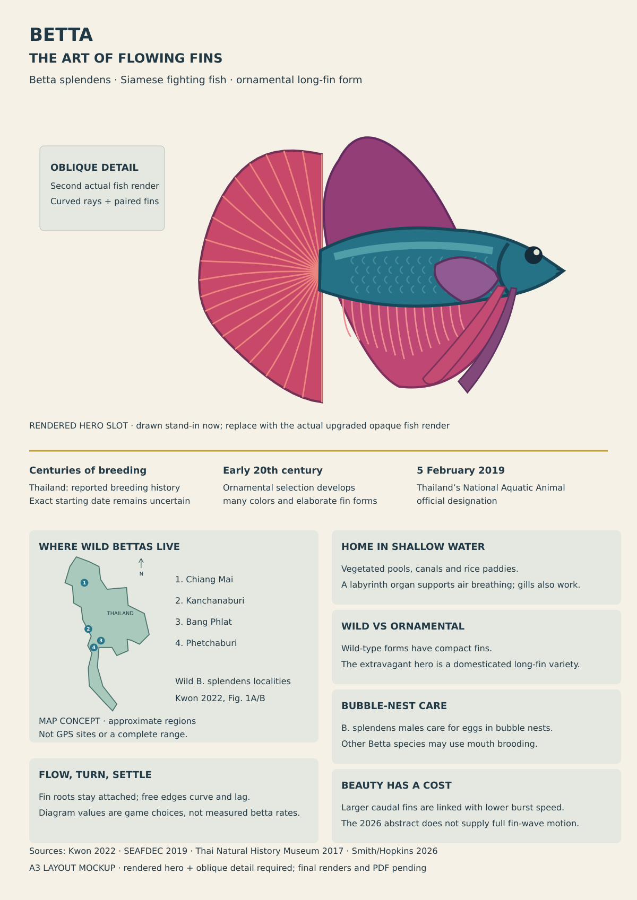
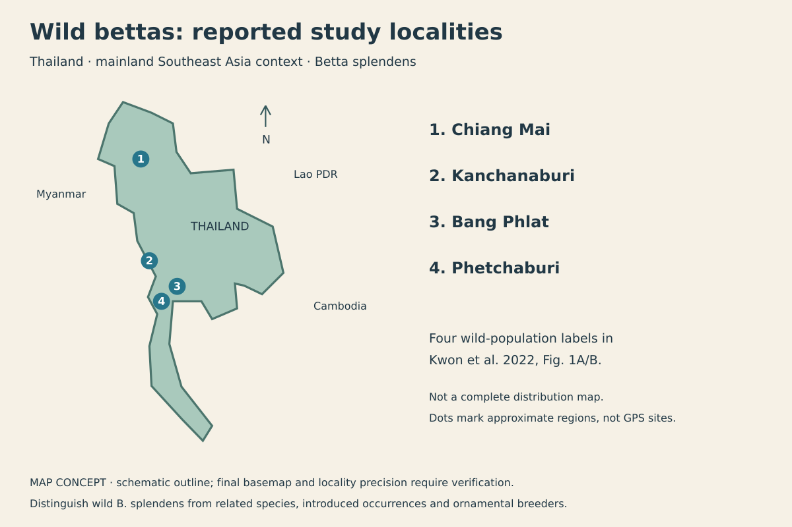
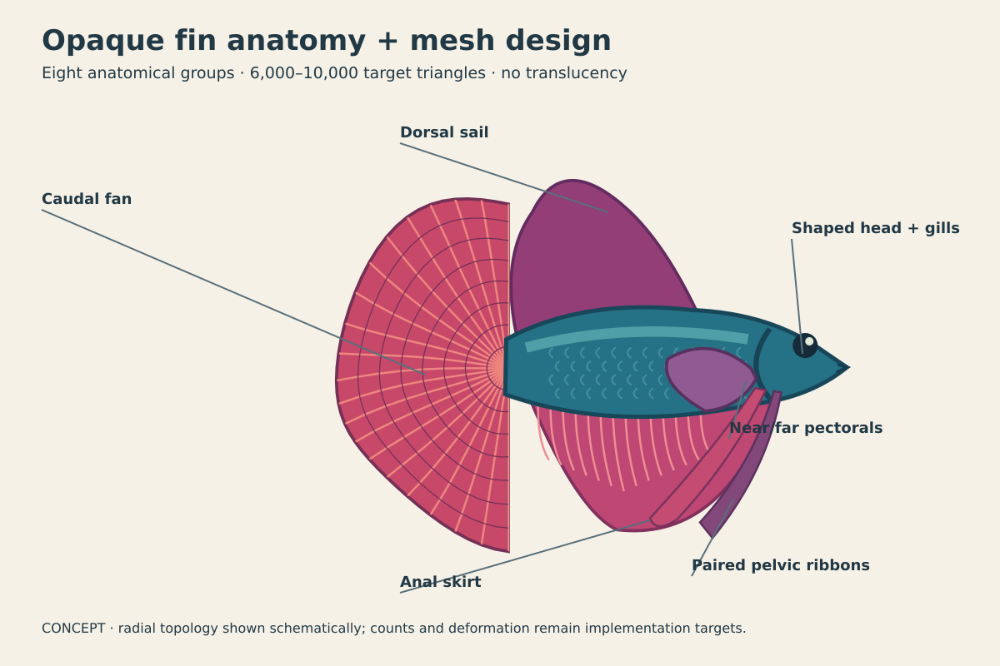
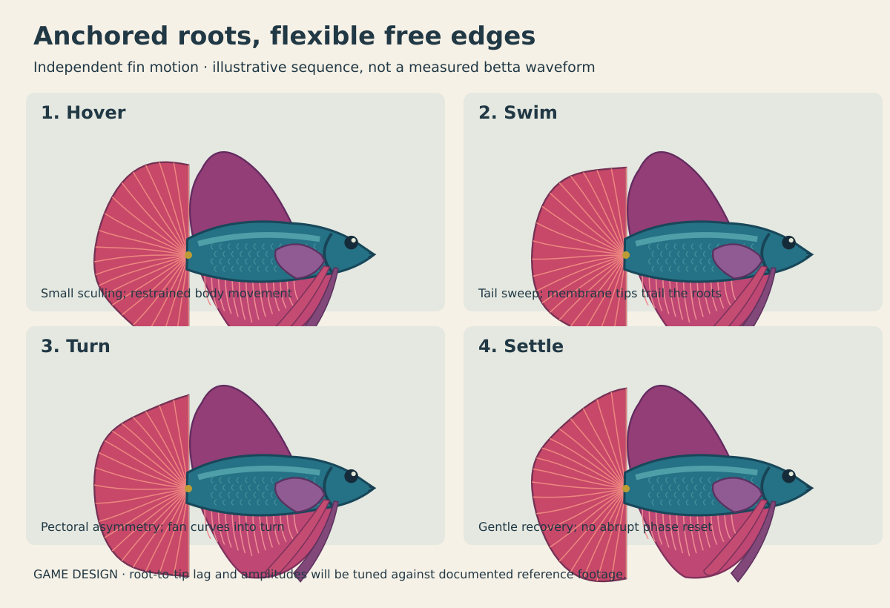
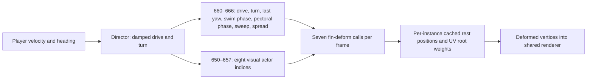
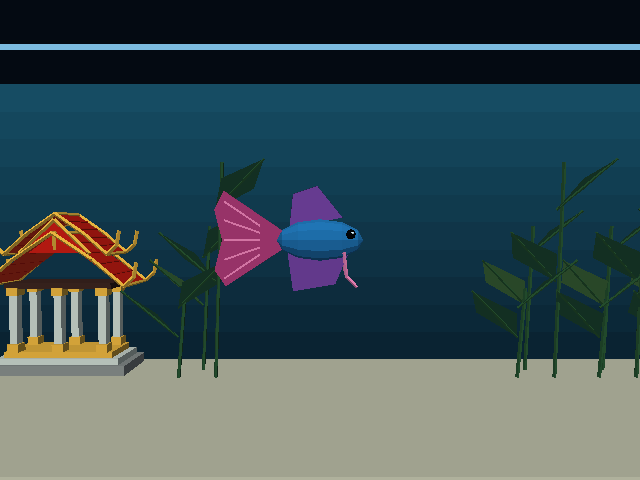
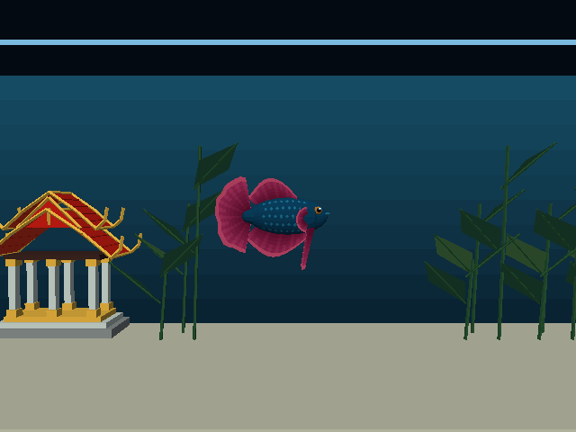
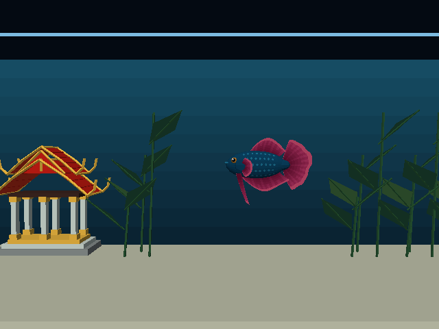
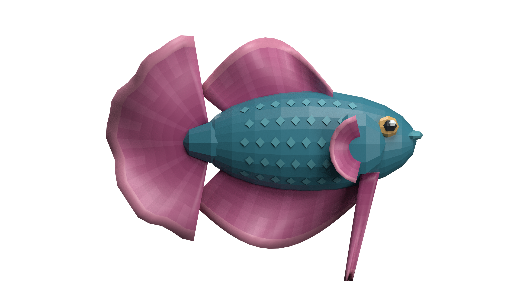
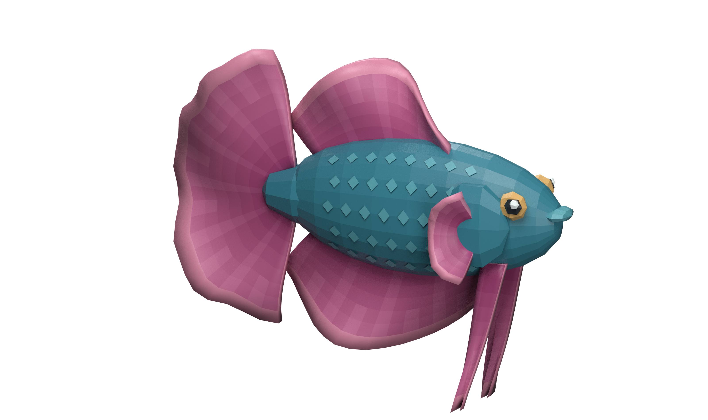

# Betta: history, habitat, an A3 poster and flowing fins

Date: 2026-10-02. Status: **Implemented, profiled and verified on Chromecast HD; final release includes corrected Back help text.**

Will subsequently requested the finished poster now. [Open the A3 poster](../reference/betta-history-and-biomechanics-poster/poster.html) · [print PDF](../reference/betta-history-and-biomechanics-poster/poster.pdf) · [render/model evidence and sources](../reference/betta-history-and-biomechanics-poster/README.md). The original 40,060-triangle studio study remains archived; the current poster uses the actual runtime geometry and native-equivalent fin pose.

Will wants the betta to have the ornate, flowing fins of a real ornamental fish, with substantially more polygons and separate meshes. This plan combines an educational poster with a visual and motion upgrade to the Calm Betta tank. Every fin in this upgrade uses **closed opaque geometry and materials**, with no translucency dependency. The existing Thai pavilion stays architectural, with an empty hall and **no Buddha or statues**. Planted Tank and its slow sea urchin are a separate level.

- [x] Research history, habitat, natural history and fin mechanics using institutional and primary sources.
- [x] Inspect the current betta geometry and animation path.
- [x] Specify poster content, mesh budgets, fin motion and verification.
- [x] Include A3 layout mockup, annotated mesh diagram and motion sequence.
- [x] Add a geographic map panel and identify four published wild-fish locality labels.
- [x] Build and review the richer betta mesh and motion in the actual engine.
- [x] Render the upgraded fish for the hero and oblique fin-detail images.
- [x] Build a Natural Earth geographic map with explicitly approximate regional representative points and recorded precision.
- [x] Produce the A3 poster with original diagrams and sourced captions; archive the earlier studio study and regenerate the fish imagery from the integrated runtime mesh.
- [x] Measure and deploy the visual upgrade after desktop and Chromecast checks.

## Research that informs the poster and fish

### History: wild fish, Siamese breeding and ornamental forms

Kwon et al. (2022) describe centuries of selective breeding for fighting in Southeast Asia, with historical reports reaching the 14th century in Thailand, followed by ornamental breeding from the early 20th century. Their genomic work identifies ornamental fish as primarily derived from *Betta splendens*, with contributions from related species. Present these as documented/reported history, not an exact universally agreed domestication date. The paper's much older inferred population divergence is **not** a date when humans began breeding bettas. [Primary paper, DOI 10.1126/sciadv.abm4950](https://api.repository.cam.ac.uk/server/api/core/bitstreams/bda0af65-2fcf-4502-ac6f-6f47c1102462/content).

A Thai Department of Fisheries author records the designation of the Siamese fighting fish as Thailand’s National Aquatic Animal on **5 February 2019**. This supplies a concrete modern milestone and cultural connection for the poster. [Sermwatanakul, SEAFDEC, 2019](https://repository.seafdec.org/bitstream/handle/20.500.12066/5516/Siamese-fighting-fish.pdf).

### Habitat and natural history

Show vegetated, shallow freshwater: floodplain pools, canals, rice paddies and slow-water wetland margins. Distinguish wild habitat from the ornamental aquarium and from the full geographic range of the genus. The labyrinth organ supports surface air breathing alongside gill respiration. Vegetation, surface access and calm water are useful visual cues; air breathing is not a claim that the fish needs no proper aquatic environment. [SEAFDEC species account](https://repository.seafdec.org/bitstream/handle/20.500.12066/5516/Siamese-fighting-fish.pdf).

The Thai Natural History Museum review distinguishes bubble-nesting and mouth-brooding species across the genus. *B. splendens* belongs with the nest builders; do not imply that every *Betta* builds bubble nests. Its discussion describes display involving the gill covers and dorsal, anal and caudal fins, with pelvic-fin flickering. Show a brief display as a separate behavior rather than permanently locking the calm tank fish into a confrontation. [Panijpan et al., 2017, museum journal](https://journal.nsm.or.th/sites/default/files/2023-10/THNHMJ01-2017.compressed.pdf).

### Map: where wild bettas live

Will requested a map of betta locations on the poster. Include a readable **Thailand/mainland Southeast Asia map**, focused on wild *B. splendens*, alongside the shallow-water habitat explanation. Kwon et al. (2022), Fig. 1A/B, identify four wild-population locality labels: **Chiang Mai, Kanchanaburi, Phetchaburi and Bang Phlat**. The figure and its labels were inspected directly. These are useful named locations for the poster; they are not a complete distribution survey or exact collecting coordinates. [Primary study, Fig. 1 and sample metadata reference](https://api.repository.cam.ac.uk/server/api/core/bitstreams/bda0af65-2fcf-4502-ac6f-6f47c1102462/content).

Use numbered locality markers with a short adjacent list, a north arrow, country/context labels and a source caption. The layout mockup uses **approximate regional placement on a schematic outline**. For the final artwork, use a checked geographic basemap and either published collection coordinates or clearly labeled regional representative points. Record locality, species, source/figure, coordinate source, precision and native/introduced/captive status in `map-localities.json`; do not invent GPS positions from a province name. The numbered list must agree with the dots after projection and label placement.

Keep *B. splendens* separate from the broader genus and related species such as *B. smaragdina*, *B. imbellis* and *B. siamorientalis*. Do not color every country containing some *Betta* as the native range of this species. Documented wild localities and any approximate native-range shading need separate legend keys. Introduced occurrences, breeders and aquarium-trade origins are different layers and should be omitted from the compact panel unless individually researched and distinctly labeled. The ornamental rendered hero is a domesticated form, not a claim that elaborate long fins are the local wild phenotype.

Allocate roughly 125 × 100 mm for this panel, merging the former habitat and air-breathing text into a neighboring panel to preserve readable history, trivia, fin diagrams and the large actual fish renders. Do not shrink the rendered hero or source text to squeeze in a tiny unreadable map. The finished location map remains pending geographic verification; the current map is a reviewable concept.

### Interesting trivia, kept precise

Use three small poster callouts: Thailand’s national aquatic animal; surface air breathing with a labyrinth organ; and paternal care associated with the bubble nest. The museum review supports male nest-building care, while other species use mouth brooding. Another inset contrasts the compact wild-type silhouette with the ornamental long-fin silhouette. Do not mix different varieties into an anatomical claim about wild fish. [Museum review](https://journal.nsm.or.th/sites/default/files/2023-10/THNHMJ01-2017.compressed.pdf).

For the hero fish, choose a **long-finned halfmoon-inspired ornamental male**: broad caudal fan, generous dorsal and anal membranes, two pectorals and two long pelvic fins. The IBC’s published 2022 exhibition standard defines the fully displayed halfmoon caudal fan by a 180° spread. That is a reference silhouette in display, not the angle to force during every swimming frame, and the cited edition is not represented as the latest judging rule. [IBC published standard, page 57](https://www.ibcbettas.org/wp-content/uploads/2025/06/IBC-2022-Exhibition-Standards-Book-01-Final.pdf).

### Movement: structure and evidence versus artistic values

Fin rays support membranes and can change curvature and stiffness. Alben, Madden and Lauder’s experiments and model address active ray-shape control in **bluegill**, providing a general ray-fin mechanism rather than measured betta animation settings. Flammang et al. describe curvature and flexibility in bluegill pectoral rays during swimming, hovering and turning. This supports curved, flexible surfaces instead of rotating an entire rigid triangular fin. [Alben et al., 2007, DOI 10.1098/rsif.2006.0181](https://bpb-us-e1.wpmucdn.com/sites.harvard.edu/dist/6/58/files/2022/03/AlbenMaddenLauder2007.pdf), [Flammang et al., 2013, primary abstract](https://pubmed.ncbi.nlm.nih.gov/23720195/).

A betta-specific 2026 study reports a negative relationship between caudal-fin size and burst swimming speed in its mixed-sex sample of ornamental *B. splendens* varieties and *B. imbellis*. Its accessible abstract supports a locomotor cost associated with enlarged fins; it does **not** give us a complete fin-wave reconstruction, drag coefficient or universal speed reduction. Do not fabricate those values or claim the paper supplies a measured motion clip. [Smith and Hopkins, 2026, DOI 10.1080/03949370.2026.2658495](https://www.tandfonline.com/doi/full/10.1080/03949370.2026.2658495).

The exact flutter frequency, amplitude, lag and spread curves below are **proposed animation choices**. Before final tuning, examine documented footage of the chosen long-fin variety in hover, ordinary swim, turn, stop and brief display. Record source, frame rate, playback speed and which features were actually visible. Separate those observations from measured studies; never infer fin-beat rates from an unverified slow-motion clip.

## Poster: A3 portrait, original illustrations

Use 297 × 420 mm, 12 mm safe margins, vector labels/diagrams and embedded fonts. Proposed title: **BETTA — THE ART OF FLOWING FINS**; subtitle: *Betta splendens* · Siamese fighting fish · ornamental long-fin form. Favor warm ivory, teal body color, red/violet fins and restrained gold accents. A **rendered upgraded betta** should occupy about the upper 40% of the page, with readable fin labels rather than dense text over the fish.

| Area | Content | Evidence treatment |
|---|---|---|
| Rendered hero + anatomy | A large beauty render of the upgraded opaque ornamental mesh, with caudal, dorsal, anal, paired pectoral and pelvic labels | Actual authored fish geometry; an oblique secondary render reveals depth and paired fins |
| History strip | Reported centuries of breeding → early 20th-century ornamentals → 2019 national designation | Source labels; avoid a false exact founding date |
| Habitat panel | Shallow vegetation, water surface and air-breathing inset | Original schematic, not a range map or recreated field photograph |
| Location map | Thailand/Southeast Asia context with the four published wild-population locality labels | Original geographic artwork; distinguish locality records from range, related species and introduced/captive origins |
| Wild versus ornamental | Short-fin silhouette versus generous halfmoon-inspired fan | Explicitly distinguish forms, without claiming wild fish have ornamental fins |
| Motion sequence | Hover → swim → turn → settle, with anchored roots and delayed tips | Schematics; animation parameters labeled GAME |
| Trivia and sources | National designation, labyrinth organ, paternal nest care | Short captions with source numbers and linked DOI footer |

Aim for 10–11 pt body text, 14–16 pt panel headings and at least 8.5 pt sources. Original fish renders and graphics only; no pasted journal figures, copied photography or lengthy quoted prose. Final deliverables: editable HTML/SVG, a single-page A3 PDF and a 150 dpi PNG under `docs/reference/betta-history-and-biomechanics-poster/`. Check physical PDF size, embedded fonts, label collisions and page boundaries. Include sources beside claims and an accessible text version. The poster is planned here; a finished PDF has not been created.

### Rendered fish on the final poster

The poster must contain **actual rendered fish**, not only silhouette drawings or diagrams. Use the final upgraded ornamental betta for a large side/three-quarter beauty render with a relaxed, generous fin spread, and a smaller oblique detail render showing membrane curvature, branched rays and the paired pectoral/pelvic fins. These can be two views of the same fish; do not imply they are different species. The wild-type comparison can remain a clearly labeled schematic unless a separate researched wild-form mesh is authored.

Render the actual authored mesh in Blender with reproducible camera, pose and studio lighting, using fully opaque materials. Produce original high-resolution PNGs at approximately 300 dpi at their final printed size: a 240 mm-wide hero needs at least 2,835 pixels across; target 3,200–4,000 pixels. Use a background color matching the poster paper and natural soft shading so the closed membranes read as thin folded surfaces. Keep fins uncropped and labels clear of the fish. Save the render scene/settings and exact mesh revision beside the poster sources. Do not use an unrelated stock fish or a synthetic illustration as a substitute for the upgraded mesh.

The poster beauty render and an engine capture must represent the **same geometry and fin pose**. Compare them before delivery, and disclose any studio lighting difference; the render must not suggest unsupported translucency, extra anatomy or motion that the app cannot display. Include at least one in-engine verification image in the plan/evidence gallery, while the printable poster uses the clean fish renders.

The current mockup uses a drawn stand-in to mark the rendered-fish placement. Replace that stand-in with the actual rendered hero and fin-detail image after the mesh upgrade. The original diagram remains a design concept; completed runtime renders and engine captures are linked below.

## Mockups and diagrams

[Open the visual gallery](2026-10-02-betta-poster-and-flowing-fins/index.html). These original SVG concepts show composition, anatomical groups, topology, proposed motion and the new geographic map panel. They are not engine captures, measured fish motion or finished poster artwork. The motion sequence illustrates a design direction; it does not substitute for independent pectoral motion or verified vertex deformation in the implementation.

## Upgrade the actual fish

The pre-upgrade procedural betta was **400 triangles across four visual meshes**: body 312, tail 64, dorsal 12, anal 12. Its pelvic filaments are baked into the body and it lacks independently moving pectorals. Whole-fin rotations make the silhouette read as stiff panels. Counts were taken from `wflevels/aquarium_tanks/models.py` on 2026-10-02; exported triangulation and render submissions must also be recorded during implementation.

Target **roughly 6,000–10,000 rendered triangles**, substantially beyond the existing fish. Budget is a starting range, not a reason to discard the flowing appearance. Use eight anatomical mesh groups: body, caudal, dorsal, anal, left/right pectoral, left/right pelvic. Eyes, mouth, gill covers and scale highlights can share the body mesh; fin rays can share the corresponding fin mesh. Mesh groups need not each become physics bodies or separately scripted actors.

| Geometry | Starting allocation | What the added geometry must achieve |
|---|---:|---|
| Body/head/eyes/gills | 1,400–2,000 triangles | Tapered peduncle, shaped head and mouth, rounded belly, clear eyes and opercula |
| Caudal fan | 2,000–3,200 | 40–56 angular divisions, 12–16 radial samples, smooth fan outline and curved rays |
| Dorsal + anal | 1,800–2,800 total | Rounded dorsal sail, generous anal skirt, distinct root and free edges |
| Pectoral pair | 400–800 total | Small near/far fans, believable hover/sculling and asymmetry in turns |
| Pelvic pair | 400–800 total | Tapered flowing ribbons with multiple samples and delayed tips |

Use thin **closed opaque membranes**, smooth shading and coherent normal orientation. Give front/back surfaces real separation and close the perimeter; overlapping reversed faces must not produce depth flicker. Add teal/blue scale shading, warmer red/violet membrane gradients, pale margins and fine branched ray detail. Select one coherent variety; avoid arbitrary fins pasted onto a generic body. Opaque materials are the final supported treatment for this upgrade. Delicacy comes from tapered edges, actual curvature, visible ray structure, folded geometry and restrained shading gradients. Keep near/far fins distinct through spacing and value contrast; their overlap must render cleanly with depth testing. Do not add alpha blending, translucent textures or a renderer feature as a dependency.

### Flowing-fin motion contract

Roots remain attached to the body. Deformation increases smoothly from root to free edge. The tail receives a modest body/peduncle wave plus delayed fan curvature; dorsal and anal have independent phase and restrained amplitude. Pelvic ribbons trail with delayed bending instead of acting as rigid rods. Pectorals have smaller, quicker sculling motion at hover and asymmetric movement while turning. The head should remain steady enough that the fish reads as calm.

At low speed, keep broad fins gently breathing and fluttering rather than pumping as one synchronized unit. During acceleration, trailing edges sweep back; during braking and turning they spread and recover with a damped response. Avoid perpetual maximum flare. A brief display can open the fan, dorsal/anal and gill covers, then return to rest. The existing action can remain a short restrained swim burst; enlarged fins do not justify making a rocket-fast fish.

Use bounded phase clocks and a few cached oscillators, not a Forth trigonometric call for every vertex. A proposed displacement profile grows approximately with squared root-to-edge distance, with phase delayed toward the edge. Low-amplitude secondary ripples add variation. Blend between states smoothly; do not reset phase or instantly snap fin spread. Frequency/amplitude must be tuned against reference footage and actual engine clips rather than presented as biological constants.

### Engine approach and isolation

Start in `wflevels/aquarium_betta/` with a dedicated detailed model module and preserved baseline capture. The existing `fish_deform.h` path only supplies a longitudinal body wave with a stable front region; it is not already a complete radial membrane/ribbon solution. Audit mutable mesh ownership and both rendering backends before extending it. Reuse the verified deformation infrastructure when suitable; add explicit root-to-tip fin weights and independent phase parameters rather than assuming body X-coordinate deformation will animate every fin correctly.

If a richer vertex path needs engine changes, coordinate with the current engine/first-tank work. An articulated prototype may demonstrate shapes, but numerous rigid strips with visible cracks do not satisfy the final flowing-fin requirement. Keep script control in zForth, export through the established level pipeline, and add only the actual mailbox/vertex interfaces needed. Recalculate lookup slots beyond the current four-part table before adding meshes; do not collide with the existing scratch globals or resident storage.

## Delivery and verification

1. Record the current wide/close views, complete mesh counts and same-engine timing baseline.
2. Build the detailed static mesh and inspect side, front, rear, above and oblique views. Verify all seven fins, attachments, ray topology, eye placement, edge normals and fixed-point triangle safety.
3. Prototype flexible caudal, dorsal/anal, pectoral and pelvic motion. Capture 20–30 second clips containing hover, swim, turn, stop and a brief display. Inspect root continuity, tip lag and fin overlap.
4. Recalculate full animated bounds at all headings, pitches and spread extremes. Verify six control limits and inward recovery, plant/pavilion clearance, both views and action cooldown.
5. Compare render/update time using the same engine and fixed camera trace; then verify release-frame presentation on Chromecast HD. Prefer spending geometry on the single hero betta and simplifying unseen scene work where needed. Record any actual tradeoffs instead of claiming the target budget is automatically fast.
6. Render the upgraded fish in its hero and oblique detail poses, then finish the poster from those renders, verified sources and original diagrams. Link its anatomy to the fish’s final mesh while keeping game motion distinct from research evidence.
7. Package the upgraded Betta at its existing menu index 2, preserving all seven entries, including Asian Arowana at index 6 and Planted Tank at index 5. Install and verify selection, Back, resume and stable rendering on Chromecast.

The [new six-player movement/controls plan](2026-10-02-aquarium-movement-and-controls.md) governs betta locomotion and device bindings, including the Chromecast's D-pad plus single OK button. This poster plan remains responsible for the detailed opaque mesh, fin appearance, researched content, rendered fish and geographic panel.

The earlier 6,000–10,000-triangle target was a starting budget. The 8,088-triangle prototype was reduced to **4,076 triangles** after actual device profiling and Will’s feedback that more polygons alone did not make the fins realistic or flowing. The original 40,060-triangle poster study remains an archive, separate from the runtime asset.

## Implementation and revised appearance

The initial rigid, fully spread fan looked like a paper cutout. The final shape uses a relaxed halfmoon-inspired caudal outline, narrower dorsal/anal sails, small pectorals and separate pelvic ribbons. The [relaxed fish photograph](https://www.ribkite.bg/product/2823/beta-halfmoon.html) was used as a morphology reference, not as measured motion evidence. Ray contrast is restrained; the membranes have folds and curl visible from the side. Motion frequencies and amplitudes are game tuning, not biological measurements. Reference-footage tuning and physical controller feel remain review work.

| Group | Exported triangles |
|---|---:|
| Body, eyes, gills, scale patches | 1,180 |
| Caudal | 896 |
| Dorsal | 540 |
| Anal | 604 |
| Pectoral pair | 424 |
| Pelvic pair | 432 |
| Total | **4,076** |

The level has **32 actors versus 28 originally**, with eight anchored visual groups and the existing small invisible player hull. No extra physics bodies were introduced. Fin materials are opaque and prelit; studio renders use smooth studio lighting. Deformation modifies each actor’s own vertex storage before the shared renderer path. Android builds both ARM ABIs; desktop GL is captured. Apple/Metal visual verification is not established by these checks.

The native `fin-deform` word takes phase, amplitude, sweep, spread and actor. A one-time cache stores rest positions, root-to-tip squared weights, matched root columns and sine/cosine phase delays. Each call starts from rest geometry, so there is no cumulative drift. Roots stay fixed, edges bend with delayed phase, and spread/sweep recover with damping. Pectorals have an independent clock and turn asymmetry. Hover remains partly folded; drive trails the fins; turns/action briefly open them. Whole-fin tail/dorsal rocking has been removed from this detailed path.

Mailboxes 600–627 retain the existing tank controller state; actor indices occupy 650–657 and fin state occupies 660–666. Solid-material UV.u identifies the root/ray column and UV.v is root-to-tip. This data is preserved in the binary mesh export and is not sampled as a transparent texture.

[Actual 24-second engine motion clip](2026-10-02-betta-poster-and-flowing-fins/engine/betta-motion.mp4) covers hover, swimming, turning, settling, action/recovery, climbing and depth movement. [State trace and receipt](2026-10-02-betta-poster-and-flowing-fins/engine/checks.json) records 240 captured frames at a fixed 30 Hz simulation; screenshot pauses make it unsuitable as a performance measurement.

The existing movement bindings remain; the action burst is reduced to 1.15 units/s. The separate seven-player movement/controls plan still governs future steer-and-swim locomotion and remote chords. Fin completion does not mark that broader work complete.

## Back navigation

A short Back press in a selected level returns to its selector. Back on the selector exits the app. This applies to both Aquarium and SMB, including when the phone-controller pairing panel is visible. Android consumes key-down/repeats and performs exactly one action on key-up. Desktop Backspace has the same level/menu behavior. The former held-Back rule is superseded.

The focused native-handler test covers level return, selector exit, repeats and standalone fallthrough. Device selection, Home/resume, fin animation and installed APK checks are recorded in [the device receipt](2026-10-02-betta-poster-and-flowing-fins/device/checks.json) after completion.

## Corrected Chromecast measurements

Same release native libraries, seven-entry selector and stationary camera on Chromecast HD, 1920 × 1080. Each variant warms for 30 seconds, followed by three 12-second uninstrumented SurfaceFlinger presentation runs. CPU sections come from a separate 12-second opt-in probe, averaging the final two complete windows. CPU child sections overlap; total is update + render, excluding frame waiting. These are stationary comparisons, not worst-case moving-camera results.

| Variant | Fish triangles | Actors | FPS median | p95 presented interval | Update ms | Render ms | Total CPU ms | Animation section ms | PSS MiB |
|---|---:|---:|---:|---:|---:|---:|---:|---:|---:|
| Original | 400 | 28 | 29.97 | 33.37 ms | 1.806 | 2.607 | 4.413 | 0 | 39.29 |
| New static | 4,076 | 32 | 29.97 | 33.37 ms | 1.900 | 5.414 | 7.314 | 0 | 40.37 |
| New animated | 4,076 | 32 | 29.97 | 33.37 ms | 2.100 | 5.406 | 7.505 | 0.135 | 40.40 |

Static → animated total CPU delta is **+0.191 ms (+2.61%)**; update delta +0.199 ms. Original → animated is **+3.092 ms (+70.08%)**, primarily render work, with four additional visual actors. The larger 8,088-triangle animated prototype measured 9.555 ms total CPU: reduction is **−2.050 ms (−21.45%)**. Cross-run prototype deltas are approximate, not an interleaved controlled experiment.

All three corrected variants present at 29.97 FPS. The earlier run's original presented near 58.88 FPS, but the original subsequently also presented at 29.97 FPS with the same native libraries and essentially unchanged CPU cost. The device reports thermal status zero and cooling devices zero. This does **not** establish a geometry-induced halving of FPS or identify the pacing cause. Retain raw timestamps and disclose the changed baseline rather than equating CPU milliseconds with observed FPS.

The static copy now has a different level hash and **zero native fin-deformation calls**; animated has seven. Static uses full rest spread while animated rests partly folded, so visibility and triangle submission differ slightly. New scripts still compute motion/pose in the static comparison: it isolates native deformation, not every script cost. The first prototype's purported static row accidentally retained animation; it is explicitly invalidated in [its archive](2026-10-02-betta-poster-and-flowing-fins/profiles/initial-8088-triangles/README.md).

[Corrected results and raw receipts](2026-10-02-betta-poster-and-flowing-fins/profiles/chromecast/comparison.json) · [APK/bundle and mesh receipt](2026-10-02-betta-poster-and-flowing-fins/device/build.json). The final normal APK contains no profiling arguments.

## Desktop comparison

Same Linux ASAN/debug GL engine, vsync disabled, fixed 60 Hz simulation. Three subtraction timings (600 minus 100 frames), plus separate 1,200-frame CPU probes. This is diagnostic host evidence; it is not Android release performance. Background host scheduling can affect these wall times.

| Variant | Wall ms/frame median | Update ms | Render ms | Total CPU ms | Animation section ms | Native fin calls/frame |
|---|---:|---:|---:|---:|---:|---:|
| Baseline | 8.824 | 1.292 | 7.450 | 8.742 | 0.000 | 0 |
| Static | 20.159 | 1.637 | 17.756 | 19.392 | 0.000 | 0 |
| Animated | 20.461 | 2.414 | 17.844 | 20.258 | 0.715 | 7 |

Static → animated total CPU delta: **+0.865 ms (+4.46%)**. Original → animated: **+11.515 ms (+131.72%)**. [Full desktop receipts](2026-10-02-betta-poster-and-flowing-fins/profiles/desktop/comparison.json).

## Runtime render parity

[Matched native pose capture](2026-10-02-betta-poster-and-flowing-fins/engine/poster-pose.png) and [pose receipt](2026-10-02-betta-poster-and-flowing-fins/engine/poster-pose.json) reproduce the poster state to fixed-point precision: swim phase .21, pectoral phase .39, spread .72, zero drive/sweep. This separate debug-authored pose is for geometry/pose comparison; the motion clip uses controller inputs. Studio uses the same closed opaque source surfaces and native deformation formula, with different camera and smooth lighting.

## Completed checks and remaining review

- [x] 91 focused tests pass: root attachment/no accumulation, closed oriented membranes, fixed-point triangle safety, animated tank clearance, UV export, no extra fin physics, native Back handler, existing fish/feeding/phone paths and selector regression tests.
- [x] Actual GL engine captures a 24-second input-driven motion sequence and a separate pose matching the poster settings.
- [x] Android release builds include both ARM ABIs and the exact seven-entry bundle, with no profiling arguments.
- [x] Chromecast renders all seven Aquarium tanks and all four SMB selections; short Back returns from each to the selector and selector Back exits.
- [x] Betta Home/resume retains the process and renders again. Two idle captures show 2,711 changed pixels in the fish region, corroborating live fin motion.
- [x] Final APK hashes are checked against the installed packages; Betta is available for normal play.
- [x] The A3 poster PDF is regenerated from the runtime mesh: one A3 page, visually checked captions, uncropped fins and complete source footer. Side and oblique images are 3,200 × 1,900 pixels.
- [ ] Will’s visual review on the TV, including whether the softer folds and independent edges feel sufficiently flowing.
- [ ] Tune against observed betta footage if greater biological fidelity is required; current clocks are disclosed game tuning.
- [ ] Physical remote feel and Apple/Metal visual parity. Automated Android key injection establishes the navigation path, not physical-controller feel.

The device harness uses a 120 ms menu press with an unmapped Shift companion because Android’s timed-key command requires two key codes. Back itself is an ordinary short key-down/up, with no held-Back gesture. Every initial level selection is confirmed in the game log before Back is tested, so a missed selector press cannot masquerade as a level-return failure.

The final APK was rebuilt after profiling solely to correct the pairing-overlay Back help text. Measurement receipts retain their APK hashes; the fin geometry, deformation and navigation paths are unchanged by that help-text refresh.

[Final installed hashes](2026-10-02-betta-poster-and-flowing-fins/device/installed.json) confirm both text-refreshed releases. The full selection/Back/resume receipt retains its pre-refresh hashes. A subsequent full-run attempt did not establish an initial live PID; it is not reported as a pass. The final installation check reads hashes and captures the current view without injecting input or interrupting play.
