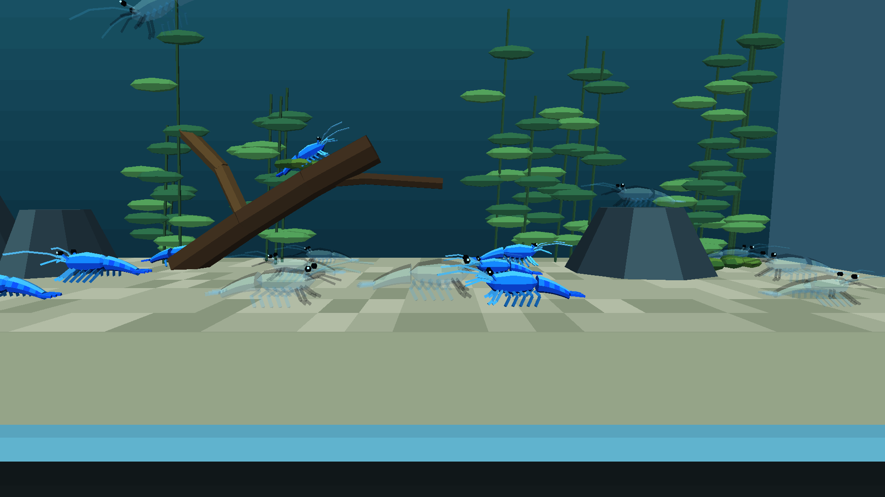
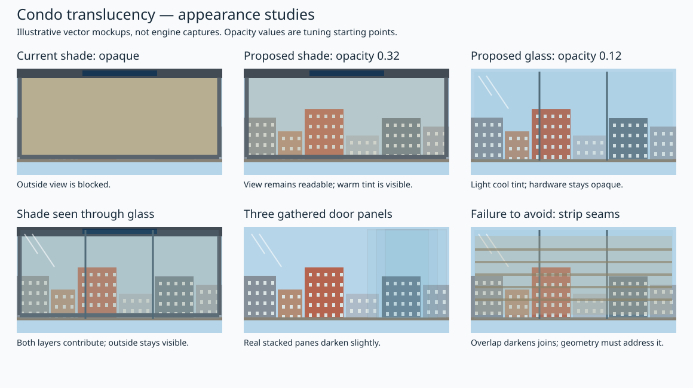
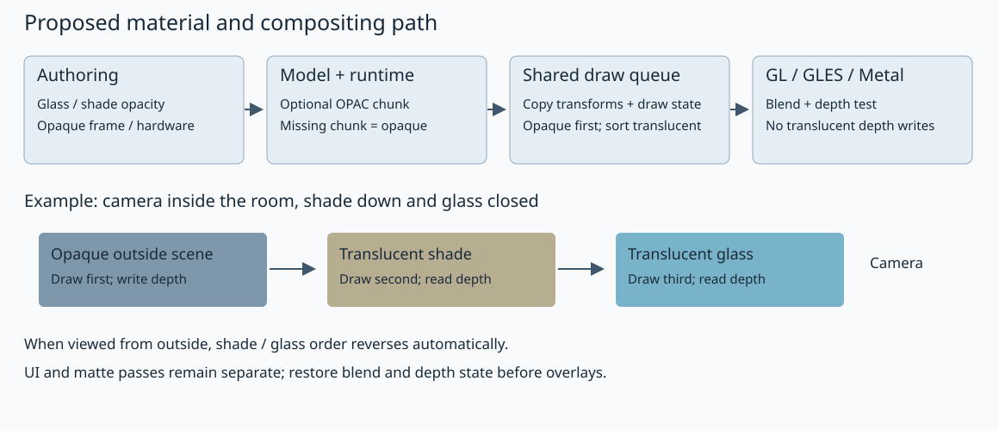

# Engine translucency support: materials, compositing and backends

**Date:** 2026-10-02; implementation/writeup 2026-10-03. **Status:** engine support implemented and exercised with the mixed shrimp tank on desktop GL and Chromecast GLES. Metal changes await Apple validation; WebGL runtime validation remains open. Condo material/geometry changes remain separately pending. Planning SVGs are labelled separately from actual game captures.

The engine work is shared by the condo shade/glass and the separately planned shrimp materials. Material authoring/serialization, render-state transport, sorted compositing and backend parity belong here. Shrimp content and its A3 poster are in the [mixed shrimp tank plan](2026-10-03-aquarium-blue-shrimp-varieties.md). Shrimp display support is authorized; condo material/geometry changes await approval.

## Shrimp implementation learnings — 2026-10-03

- The second shrimp appearance uses an RGB palette atlas on the existing model. The legacy packer does not preserve continuous image alpha, so opacity is explicit material metadata; texture cutouts retain their existing behavior.
- `OPAC` version 1 is little-endian: `uint32 version = 1`, `uint32 materialCount`, then one `uint32` 16.16 opacity per MATL slot, bounded to 0–65536. Omit the chunk for fully opaque models. MATL stays exactly 264 bytes per slot. This loader's model contract requires MATL before OPAC, just as it requires MATL/VRTX before FACE; the exporter writes that order.
- The common compositor queues translucent triangles across actors in eye space, renders opaque submissions immediately, then sorts by centroid depth with submission order as the tie-breaker. It snapshots lighting, fog and cutout state; projection changes and camera completion drain the queue.
- The initial queue has a diagnosed limit of 8192 triangles and 64 distinct state snapshots. Triangle storage is allocated from the supplied engine memory allocator only for translucent frames and freed before camera/frame completion. Measure the full colony on Chromecast before calling this implementation validated.
- GL/GLES use source-over blending with depth tests retained and depth writes disabled. EndFrame restores depth writes because the next frame's depth clear also uses that mask. Metal has a matching blend pipeline, but still requires an Apple build/device check. Opacity travels in GPU vertex data so switching between translucent shell and leg materials does not force a draw call.

## Simulated PR — explicit material translucency across actors

**Target branch:** `2026-new-level`. **Status:** local implementation commits and retrospective review description; no remote PR has been opened or published.

### Problem and resulting behavior

The renderer previously wrote alpha 1.0 for both flat and textured materials. Although texture uploads sometimes enabled GL blending, materials had no continuous opacity path and all faces wrote depth. Giving a pale shrimp a different RGB texture therefore still produced a solid animal. Simply enabling blending would also leave it dependent on actor submission order: scenery submitted after a shell could paint over it, and overlapping shells could blend in the wrong order.

Materials can now opt into continuous opacity. In the test tank, the Jelly shell contributes at 0.28 and its legs/antennae at 0.18, while eyes remain opaque. All opaque world geometry establishes the depth buffer first. Translucent triangles from every actor then composite from far to near, depth-tested against that opaque scene. The shared sorter makes this ordering independent of which actor was visited first.

### Implementation commits

These are actual local commits, in implementation order; the PR itself is simulated. Inspect them with `git show <hash>`.

| Commit | Subject | Review scope |
|---|---|---|
| `92e8cc0a` | Add explicit material opacity with compatible OPAC model metadata | Blender export/import, optional binary metadata, runtime material opacity and all eight triangle submission variants |
| `1bdde381` | Composite translucent triangles across actors with per-vertex opacity | Shared compositor, camera completion hook, GL/GLES shader/state, Metal shader/pipelines and batching |
| `3c0b4ac3` | Verify translucent ordering state lifetime and opacity round trips | Recording-backend compositor tests and Blender round-trip/malformed metadata checks |

The separate shrimp content commit `1aef7152` contains the second texture, deterministic half-colony assignment and regenerated assets. Those content choices consume the engine API; they are not part of the engine's material format or sorting policy.

### Authoring and model compatibility

[Blender export/import](../../wftools/wf_blender/export_level.py) reads the explicit custom material property `wf_opacity`, defaulting to 1.0. It validates the 0–1 range and serializes opacity as fixed-point metadata. Import restores that property and Principled Alpha, selecting Blender's dithered surface rendering for translucent materials. Transmission is not interpreted as opacity.

The existing MATL record remains **264 bytes**. A separate, optional OPAC chunk follows MATL:

| Byte offset | Field | Meaning |
|---|---|---|
| 0 | `uint32 version` | 1 |
| 4 | `uint32 count` | Number of MATL slots |
| 8 onwards | `count × uint32 opacity` | 16.16 values, 0–65536 inclusive, in material-slot order |

The exporter emits OPAC only if at least one slot is below full opacity. The [runtime loader](../../wfsource/source/gfx/rendobj3.cc) checks version, count, payload length and opacity bounds using engine assertions. Models without OPAC get opacity 1.0. [Material](../../wfsource/source/gfx/material.hp) stores the float in its runtime object rather than changing the disk struct. Ordinary material colour and legacy texture blend flags keep their separate roles.

The authoring contract is material opacity, not arbitrary continuous RGBA image alpha. The legacy texture packer quantizes alpha; the Jelly uses an RGB palette atlas and explicit shell opacity. Existing texture cutout behavior is preserved. Older loaders are expected to ignore the optional chunk and show an opaque model, but a complete older-engine compatibility run remains unverified.

### Common draw ordering and saved state

[RendererBackend](../../wfsource/source/gfx/renderer_backend.hp) gains `SetOpacity()` and `FlushTranslucency()`. Each of the eight flat/textured, flat/Gouraud and lit/prelit triangle paths forwards its current material opacity. Matte submission explicitly uses 1.0.

[The backend factory](../../wfsource/source/gfx/glpipeline/backend_factory.cc) wraps GL or Metal in the same compositor. It forwards opaque triangles immediately, skips opacity-zero triangles, and queues the remaining triangles with:

- Positions and face normals transformed into eye space at submission, preserving each actor's actual transform.
- Vertex RGB/UVs, material opacity, texture reference, prelit and culling policy.
- A snapshot of ambient/directional lighting, fog and cutout state. Light directions are captured in eye space too.
- Camera-space centroid depth and a submission index for deterministic equal-depth ordering.

At a camera boundary the queue sorts by depth, farthest first. Replay uses identity modelview because the stored vertices already carry their original transforms. Only adjacent compatible triangles may batch after sorting; texture regrouping never overrides blend order. The current scene state and modelview are restored afterward. Projection changes, texture destruction and shader reload drain pending work before invalidating its state or resources. [RenderCamera::RenderEnd](../../wfsource/source/gfx/camera.cc) flushes the current world pass, and EndFrame provides a final drain before overlays/presentation.

The queue accepts up to **8192 triangles and 64 state snapshots**, with assertions diagnosing overflow. Triangle storage comes from the supplied engine `Memory` allocator and is released when the camera/frame drains. Opaque-only scenes allocate no queue. The fixed triangle capacity reserves about **1.06 MiB on 32-bit** or **1.125 MiB on 64-bit** for a translucent pass, plus state snapshots. This is a meaningful cost relative to the engine's small-memory baseline; a smaller queue or different storage strategy would be needed for tighter targets. The frame allocation uses the existing LIFO allocator and must remain the top allocation until released.

### GPU compositing and the batching correction

[GL/GLES](../../wfsource/source/gfx/glpipeline/backend_modern.cc) adds an opacity vertex attribute and shader varying. Fragment alpha comes from that value; lighting and fog affect RGB. The translucent pass enables straight-alpha source-over blending, with RGB factors source-alpha / one-minus-source-alpha and alpha factors one / one-minus-source-alpha. Depth testing remains active while depth writes are disabled. Opaque draws disable blending and write depth. EndFrame restores depth writes and disables blending, since the following frame's `glClear` also respects the depth write mask.

The first implementation held opacity in a uniform and flushed whenever it changed. Depth sorting interleaved shell and leg triangles, so those changes produced excessive small batches. Moving opacity into the packed GPU vertices preserves each triangle's alpha while allowing adjacent translucent materials to share a batch. Switching between opaque and translucent policy still flushes; changing texture or prelit state retains the existing batch boundary.

[Metal](../../wfsource/source/gfx/metal/backend_metal.mm) receives the same opacity vertex attribute, a source-over blend pipeline and a depth state with writes disabled. It selects the opaque or blended pipeline per batch and uses the same compositor. These source changes have not been compiled or run on Apple hardware in this implementation round. WebGL shares the GLES shader path but has not received a browser runtime check here.

### Validation and review evidence

- [x] Desktop engine build and Android Aquarium release build pass.
- [x] `pytest -q tests/test_translucent_queue.py tests/test_aquarium_blue_shrimp.py`: **10 passed**. The recording backend verifies late opaque submission, cross-actor eye-space transforms, depth ordering, captured lighting/fog/prelit state, equal-depth ordering, projection-boundary draining, zero-opacity skipping and allocation cleanup. Content tests verify 12/12 and identical exported triangle geometry.
- [x] [Blender checks](2026-10-03-aquarium-blue-shrimp-varieties/engine/opacity-roundtrip.txt): all five Jelly parts retain opacity through import/export; legacy materials default to opaque; truncated headers, wrong versions/counts and out-of-range opacity are rejected by the importer.
- [x] [Desktop runtime checks](2026-10-03-aquarium-blue-shrimp-varieties/engine/checks.json): resident animation, both cameras, six directional bounds, leaving those bounds and backward tail flick pass. [Motion recording](2026-10-03-aquarium-blue-shrimp-varieties/engine/shrimp-motion.mp4) shows the real mixed colony. The old six-second wall deadline was too short for the existing 0.70 m/s movement and 0.28 m/s descent; checks now allow travel and turning time without changing the controller.
- [x] Updated release installed on Chromecast HD; log confirms selector level 1, Blue Shrimp. The app also survived Home/resume and later tank changes; the final [resume capture](2026-10-03-aquarium-blue-shrimp-varieties/device/blue-shrimp-resumed.png) shows the subsequently selected Planted Tank, not a matched shrimp resume comparison. [Actual game capture](2026-10-03-aquarium-blue-shrimp-varieties/device/blue-shrimp-optimized.png) shows both appearances, opaque eyes and scenery through Jelly shells.
- [x] Chromecast full-colony pacing spot checks: [initial implementation](2026-10-03-aquarium-blue-shrimp-varieties/device/shrimp-frames.txt), 126 intervals, median **83.42 ms ≈12 FPS**, p90 **100.10 ms**; [per-vertex batching implementation](2026-10-03-aquarium-blue-shrimp-varieties/device/shrimp-frames-optimized.txt), 126 intervals, median **33.37 ms ≈30 FPS**, p90 **50.05 ms**. These are samples of the running tank, not a controlled opaque baseline comparison or proof of sustained 30 FPS.
- [ ] Apple compile/runtime checks and WebGL browser checks.
- [ ] Numeric pixel tests against analytical layer colours, a controlled opaque-baseline performance comparison, and the broader legacy-level capture sweep.

The desktop debug/ASan timing estimate is approximately **108.8 ms/frame** and is recorded separately from device release results. No claim of a universal performance improvement or backend parity follows from these measurements.

### Limits and follow-up

This is centroid-sorted alpha compositing. Intersecting triangles or cyclic overlaps can still produce incorrect local ordering; it is not order-independent transparency. Curved shells may accumulate tint where their existing mesh pieces overlap, and visual tuning remains reviewable in the [A3 poster](../reference/blue-shrimp-poster/poster.pdf). The original Blue Dream materials remain opaque in this rollout because Will requested that half the colony retain the original appearance.

The engine now supplies the shared mechanism for glass and the cassette shade, but this implementation does not alter condo geometry or materials. The pane/slat overlap investigation and condo acceptance cases below remain open. Refraction, reflection, blur and continuous texture-alpha export also remain outside this change.

## Intended result

The lowered balcony shade should let Will see the outside scene through a lightly tinted sheet. The telescoping glass doors should look like glass rather than a solid coloured wall: a faint tint, visible edges and opaque handles, with the patio and lowered shade visible beyond them. Raising the shade and opening the doors retain their existing motion and collision behaviour.

Start with adjustable material opacity and correctly ordered compositing across desktop GL, Android GLES, WebGL and Metal. Opacity here means how strongly the surface contributes to the image: zero is invisible, one is opaque. This first phase keeps the scene sharp through the material. Optical blur, refraction and physically based reflection would be separate work if later needed; alpha blending alone cannot produce those effects.

## Appearance mockups

The mockups use shade opacity **0.32** and glass opacity **0.12** as starting points for review, not measured properties of the eventual purchased fabric or existing doors. Suggested tuning ranges: shade 0.20–0.45; glass 0.06–0.18. Keep cassette, solar strip, guides, bottom bar, door handles and locks opaque. The glass highlights shown are an appearance cue; the first phase does not promise a dynamic reflection system.

True stacked door panes should accumulate a little tint. Accidental double surfaces on one pane, or the existing shade-strip overlap, must not create the same effect. At opacity 0.32, drawing the same sheet twice gives effective opacity approximately 0.54; lowering one material’s alpha without addressing its geometry would therefore be misleading.

[Open the visual preview](2026-10-02-condo-translucency/preview.html). [Combined PNG preview](2026-10-02-condo-translucency/preview.png).

## Findings before implementation — 2026-10-02

| Stage | Evidence | Consequence |
|---|---|---|
| Condo material authoring | `wflevels/condo_639_640/blender_create_condo.py`: `make_flat_material()` sets Base Color and diffuse alpha to 1.0. `SHADE_RGB['fabric']` is beige RGB. Doors reuse the imported `glass` material. | Changing only the shade colour cannot make it see-through. The source glass material’s actual alpha/node setup still needs a read-only Blender probe before implementation. |
| Shade geometry | Same generator: `SLAT_T = 0.003`, `SLAT_DY = 0.001`, `SLAT_OVERLAP = 0.002`; slats have front/back surfaces, with top/bottom faces removed. | Thin-box surfaces and overlapping neighbours need deliberate handling to prevent doubled tint and dark horizontal bands. |
| Door geometry | Same generator: `_door_panel()` builds solid panels with hardware material slots. | Make glass surfaces transparent without making the handles transparent or altering collision boxes. |
| Blender model export/import | `wftools/wf_blender/export_level.py`: `_extract_mat_info()` exports RGB, texture name and flags; it does not export Principled Alpha, Base Color alpha or transmission. `_make_blender_material()` imports Base Color alpha as 1.0. | Opacity currently disappears during export and round trip. |
| Model format | `wfsource/source/gfx/material.hp`: `_MaterialOnDisk` contains flags, `Color` and a 256-byte texture name; the historical `_opacity` field is commented out. The exporter assumes a 264-byte MATL record. | Adding a field directly would break existing asset layout. Preserve MATL size. |
| Legacy texture transparency | `material.cc` picks up `bTranslucent` and historical texture blend flags. `pixelmap.cc` decodes texture pixels to alpha 0, 128 or 255. `textile-rs/src/bitmap.rs` quantizes input alpha into a legacy bit. | Existing flags are not continuous material opacity. Enabling all texture alpha could also expose old colour-key/black-pixel artefacts; audit separately. |
| Shared draw interface | `wfsource/source/gfx/renderer_backend.hp`: `RBVertex` contains RGB; `DrawTriangle()` passes texture, culling exemption and prelit state, but no opacity or blend mode. | New material state must reach every flat/textured and lit/prelit submission path. |
| GL/GLES/WebGL shader | `glpipeline/backend_modern.cc`: both flat and textured fragment paths output alpha 1.0; texture sampling uses only `.rgb`. Texture creation also enables blending as a global side effect. | There is no usable material-opacity path even though blending is sometimes enabled. Blend/depth policy must belong to drawing, not texture creation. |
| Metal shader/pipeline | `metal/backend_metal.mm`: fragment alpha is also 1.0; the inspected pipeline has no blend configuration and uses depth writes. | Metal needs a corresponding blend pipeline and read-only depth state. |
| Ordering | `rendobj3.cc` groups faces by material; `glpipeline/rendobj3.cc` submits them under each actor’s transform. Current batches key texture/prelit and flush on state changes. | Material order and per-actor sorting cannot correctly composite shade strips, glass leaves and the world behind them. Deferred draws must retain their own transforms and lighting state. |

These describe the initial read-only investigation. The implementation and runtime evidence added on 2026-10-03 are recorded in the simulated PR above; condo assets have not been regenerated.

## Proposed design

### 1. Explicit, compatible material opacity

- [ ] Probe the existing `glass` material and exact face layout read-only; record whether the source uses Alpha, Base Color alpha or transmission. Do not equate transmission automatically with alpha: they describe different rendering effects.
- [ ] Add explicit authoring properties for blend mode (`opaque` or `blend`) and opacity. Default existing materials to opaque. For these condo materials, set the properties deliberately and mirror the approved appearance in Blender’s preview. Import restores the same properties.
- [x] Add an optional `OPAC` model chunk, leaving MATL unchanged; the final v1 layout is documented in the simulated PR above. Opacity below 1.0 opts into blending.
- [x] Read OPAC after MATL under the existing ordered-model contract; validate version, count, size and opacity range. Missing chunk means fully opaque. Full older-engine compatibility remains a separate validation item.
- [ ] Preserve the chunk through Blender import/export, model packaging, editor save and round trip. Audit other model writers/loaders before selecting the final format. Do not repurpose the high byte of `Color`, which is also used by existing primitive conventions.
- [x] Add runtime opacity/blend accessors independently of legacy texture blend flags. Keep ordinary RGB updates from resetting opacity.

### 2. Shared ordering and backend state

- [x] Pass material opacity through all eight triangle variants using the backend state setter; existing DrawTriangle arguments remain unchanged.
- [x] Introduce a common translucent queue so GL and Metal use the same deterministic order. Keep the opaque batching path intact. Queue only blended world triangles; capture vertices, current model/view/projection transforms, normals, texture handle, fog, lighting, prelit and culling policy by value or stable ownership.
- [x] Render opaque world geometry first, with depth test and writes. Then sort blended triangles back to front in camera space, with a stable tie-breaker, depth testing against the opaque scene, and depth writes disabled. Triangles across different actors must share this ordering; texture batching may combine only adjacent compatible draws after sorting.
- [x] Partition the queue by camera/render pass. Flush world translucency before matte/HUD/overlay drawing and before frame capture; clear it at the actual frame boundary. Do not let deferred draws inherit the last actor’s transform or leak into another camera’s pass.
- [x] Use straight-alpha source-over compositing for explicitly opted-in materials. For initial flat glass/shade, alpha is material opacity. Ordinary textured materials retain their present opaque behaviour. Texture-alpha cutouts and continuous texture-alpha preservation remain a separately audited extension; the first phase must not make legacy black texels into unintended holes.
- [ ] GL/GLES/WebGL: explicit per-pass blend/depth state and shader opacity. Metal: equivalent blend factors and write-disabled depth state; preserve the ordinary opaque pipeline. Restore state for overlays and the following frame, including opaque framebuffer alpha.

Centroid triangle sorting is adequate as the initial approach for these mostly parallel surfaces, but is not a general solution for intersecting/cyclic transparent geometry. Test oblique views and gathered door leaves before accepting it. If this geometry produces visible sorting errors, split the affected surfaces or reconsider the technique; do not claim order-independent transparency.

### 3. Condo material and geometry treatment

- [ ] Give the moving door panes a dedicated glass material copy, so tuning does not silently change unrelated condo windows. Keep hardware material slots opaque.
- [ ] Make each pane contribute one visible optical surface from either side. Options to assess during implementation: a two-sided render sheet with unchanged collision geometry, or outward-wound thin boxes with back-face culling that admits one broad face per view. Avoid drawing front and back together for the same pane. Verify side-edge appearance and both camera directions.
- [ ] Apply the same principle to shade strips. Retain actor count, export order, indices, collision and existing motion. Separate render geometry from collision geometry where necessary rather than collapsing moving actors and invalidating Forth indices.
- [ ] Eliminate double coverage at the slat joins while retaining the gap-free visual invariant through the full travel. A simple alpha change or equal tint on every existing box is insufficient. Check front, back and oblique views; crop/split visible strips or use a dedicated visual sheet if the motion representation requires it. The chosen solution must also cover intermediate motion states and raised parking inside the cassette.
- [ ] Tune approved shade/glass opacity with fixed cameras in the actual condo. Lighting and fog affect RGB, not the material’s opacity. Inspect back-facing sheet lighting so the material does not turn black from one side.

## Additional engine validation client: translucent shrimp

The separate [Blue Jelly / Blue Dream content plan](2026-10-03-aquarium-blue-shrimp-varieties.md) consumes this engine support. Include a moving curved shell with opaque eyes and overlapping articulated parts in the renderer acceptance scenes, so sorting/state handling is verified beyond flat condo surfaces. Content-specific shell cleanup, colour, population, rig and tank composition belong to that plan. This plan does not rebuild or tune the shrimp colony.

## Implementation sequence after approval

1. **Baseline and format:** read-only glass probe, reproducible captures, material contract and OPAC round-trip tests. Deliver material values to a small test scene before rebuilding condo content.
2. **Renderer:** shared queue, state lifetime and ordering; GL/GLES/WebGL and Metal parity. Prove synthetic layered scenes first.
3. **Condo integration:** glass/shade material copies and geometry treatment; preserve interaction/collision/motion invariants. Validate curved-shell rendering with a test fixture; shrimp content follows its separate plan.
4. **Review evidence:** matched before/after captures and timing results, including Android/Chromecast. Tune from the visual review before rollout.

## Verification and review gates

| Case | Required evidence |
|---|---|
| Legacy assets | Existing assets without OPAC render as before; exporter emits no new chunk for fully opaque models. Include coloured-but-textured, prelit, sky/matte and HUD examples. |
| Export/import | Two material slots with different opacity; opaque old model; malformed/count-mismatched chunk; round trip retains values and MATL layout. |
| Compositing | Known flat colours over a fixed background at opacity 0, 0.25, 0.5 and 1; two layers in reversed submission order; opaque object in front; late-submitted opaque object behind. Check numeric pixel results within documented tolerances. |
| Transforms/state | Two differently transformed actors and differing fog/lighting states in one queue, multiple camera passes, overlay after translucency, and the next frame. |
| Glass | Closed, partial and fully gathered doors viewed from both sides and obliquely; real stacked panes tint naturally; single panes are not double tinted; handles stay opaque; player cannot pass closed glass. |
| Shade | Raised, half-lowered and closed; seam close-up plus balcony-wide view; no dark bands, gaps, bright seams or leaked parked fabric. Cassette/guides/bar stay opaque. |
| Both | Camera inside looking through closed doors and lowered shade; camera outside looking inward; sort order follows the camera, not actor creation order. |
| Platforms and cost | Matched captures on desktop GL, WebGL, Android GLES/Chromecast and Metal where hardware/build access exists. Record queued triangles, draws, queue memory and CPU/GPU frame time; compare with the same camera/state baseline. Mark unavailable platform evidence explicitly. |

Use the existing condo shade/door geometry and interaction verification scripts, plus renderer capture infrastructure such as `tests/compare_renderer_frames.py`. Add targeted opacity/order/round-trip tests at the layers that own those behaviours. Existing tests passing is necessary but does not establish the visual result; the matched captures above are required.

## Scope to approve

Recommended first phase: explicit flat-material opacity, optional model metadata, shared sorted compositing, corresponding GL/GLES/WebGL/Metal support, and corrected condo render surfaces. The separate shrimp plan consumes this engine support. The mockup values are provisional. Continuous RGBA texture export, frosted blur, refraction, dynamic reflection and order-independent transparency are possible later phases, each with additional format/performance implications.

- [x] Inspect the authoring, model format, draw interface and both active backends.
- [x] Identify strip-overlap, double-surface and legacy-texture compatibility risks.
- [x] Prepare condo appearance mockups and a rendering-flow diagram.
- [x] Identify curved shrimp shells as another validation client; separate their content plan and poster.
- [x] Will authorizes the shared engine work for the second shrimp appearance on 2026-10-03.
- [x] Implement and exercise that engine path with shrimp on desktop and Chromecast.
- [ ] Complete remaining cross-platform, numeric compositing and regression evidence.
- [ ] Will approves condo-specific material/geometry integration before it starts.

Related plans: [existing Blue Shrimp tank and menu](2026-10-02-aquarium-levels-blue-shrimp.md), [balcony shade](2026-09-30-condo-balcony-shade.md), [telescoping glass doors](2026-09-20-condo-project-room-telescoping-doors.md), [Metal renderer](2026-09-20-macos-metal-renderer.md).

Primary API references for implementation: [Khronos glBlendFunc](https://registry.khronos.org/OpenGL-Refpages/gl4/html/glBlendFunc.xhtml), [Khronos glDepthMask](https://registry.khronos.org/OpenGL-Refpages/gl4/html/glDepthMask.xhtml), [Apple Metal blend configuration](https://developer.apple.com/documentation/metal/mtlrenderpipelinecolorattachmentdescriptor). Repository findings above come from local source inspection; these references are implementation reading, not runtime validation.
