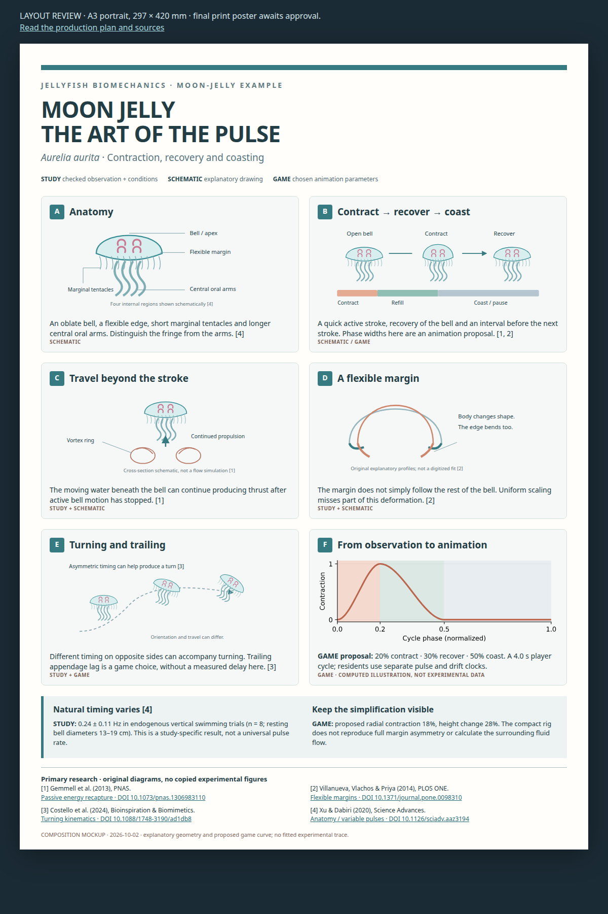

# Moon-jelly swimming poster — A3

Date: 2026-10-02. Status: **plan and layout mockup ready for Will's review; final poster awaits approval.**

Will requested jellyfish-motion research and an A3 poster, then specified that this plan should be saved in `docs/plans/` and opened in the browser for review and approval. Prepare an illustrated explanation of moon-jelly swimming, with the same clear evidence labels used in the clownfish biomechanics poster. The biological story dominates; a small panel connects it to the Aquarium animation.

- [x] Read primary research on propulsion, bell-margin flexibility, natural pulse variation and turning.
- [x] Define content, source boundaries, A3 layout and production checks.
- [x] Build a full-page layout mockup with original diagrams and an illustrative computed pulse curve.
- [ ] Obtain Will's approval of the poster plan/layout.
- [ ] Build the final data sheet, vector artwork, one-page A3 PDF and PNG preview.
- [ ] Check source/parameter consistency, PDF dimensions, links, text size and clipping.
- [ ] Inspect a physical A3 print if one is available.

## Browser review

[Open the A3 layout mockup](2026-10-02-jellyfish-biomechanics-poster/layout.html). It is a **composition mockup**, not the final print artifact. Its graphs are explicitly illustrative animation proposals, not digitized experimental results.

Proposed title: **MOON JELLY — THE ART OF THE PULSE**. Subtitle: *Aurelia aurita*: contraction, recovery and coasting. The mockup uses A3 portrait, 297 × 420 mm, to match the existing clownfish poster. Portrait, paper colors and panel balance are reviewable design choices.

## The six panels

| Panel | Diagram | Main message and provenance |
|---|---|---|
| A — Anatomy | Original side-view bell with apex, margin, short marginal tentacles and central oral arms; inset for internal regions | Distinguish the fringe from oral arms. Anatomical reference: Xu & Dabiri 2020, Fig. 1D. Shapes are schematic, not measurements. |
| B — One swimming cycle | Three bell states and a timeline: contract → recover/refill → coast | Circular muscle contraction drives the active stroke; recovery and the interval before the next pulse matter. Sources: Gemmell et al. 2013 and Villanueva et al. 2014. |
| C — Motion can outlast the stroke | Bell outline above a simple vortex cross-section; active stroke versus continued travel | Fluid motion can provide extra propulsion after active bell motion. Original explanatory arrows, with no claim to a computed flow field. Source: Gemmell et al. 2013. |
| D — The margin matters | Overlay of relaxed/contracted profiles with the flexible edge highlighted | Bell motion is more complex than uniform scaling; the flexible margin matters. Source: Villanueva et al. 2014. |
| E — Turning and trailing | Curved path with rotated bell silhouettes; short side comparison of central arms versus fringe | Turning can involve left/right timing differences; direction and travel need not immediately align. Source: Costello et al. 2024. Appendage lag is an animation proposal, not a measured phase delay. |
| F — From observation to animation | Computed normalized contraction curve, evidence badges and a compact proposed/current parameter table | Use independent pulse and drift clocks, recovery/coast intervals and bounded state. Clearly distinguish study values from our game choices. |

The completed poster will include an original moon-jelly illustration, diagrams, readable captions, figure-level source markers and a footer bibliography. Do not substitute a screenshot of the low-poly game model for biological anatomy. Do not copy a published figure, photograph or movie frame into the poster. Original redraws describe mechanisms rather than reproduce specific experimental plots.

## Checked research and claims

**[1] Gemmell et al. (2013), PNAS — passive energy recapture.** The paper describes contraction, relaxation/refilling and an interpulse phase. Muscle contraction occupies only a relatively small part of the cycles studied (approximately 20% across their illustrated species); post-relaxation propulsion can continue without active bell motion. Reported post-relaxation travel is 32% (SD 0.6%) of distance per pulse in their experiment. If used, that number gets its study context and a source marker; it is not a universal efficiency figure or a rule for every jellyfish. [Paper](https://pmc.ncbi.nlm.nih.gov/articles/PMC3816424/), [author-hosted full text](https://static1.squarespace.com/static/55885cf4e4b04e6344662d6a/t/5589cc6ce4b09ddbc396cc74/1435094124705/Ge_etal_PNAS13.pdf), [DOI](https://doi.org/10.1073/pnas.1306983110).

**[2] Villanueva, Vlachos & Priya (2014), PLOS ONE — flexible margins.** Their 6 cm *A. aurita* reference was digitized through the swim cycle; the margin followed a different deformation pattern from the rest of the bell. The poster highlights that flexible edge and calls whole-bell scaling a simplified game representation. It will not invent a fitted margin angle or bend law from the paper. [Full text](https://journals.plos.org/plosone/article?id=10.1371/journal.pone.0098310), [DOI](https://doi.org/10.1371/journal.pone.0098310).

**[3] Costello et al. (2024), Bioinspiration & Biomimetics — turning.** They describe asymmetric bell-margin timing associated with turning and rotation while the body continues translating, described as skidding. The drawing will show a curved path and changing orientation without assigning a measured turn radius or claiming our rig reproduces the asymmetry. [Author-hosted paper](https://static1.squarespace.com/static/55885cf4e4b04e6344662d6a/t/65afe9d4bbe6d727cb6b8396/1706027477599/CoCoGeDaKa_BB2024.pdf), [DOI](https://doi.org/10.1088/1748-3190/ad1db8).

**[4] Xu & Dabiri (2020), Science Advances — anatomy and variable pulses.** Fig. 1D provides the anatomical reference. Their free-swimming endogenous trials report 0.24 ± 0.11 Hz (n = 8); those vertical swimming trials used resting bell diameters of 13–19 cm. State those conditions beside the number. Do not confuse it with the 0.16 Hz spectral peak from their separate constrained experiment, or with electrically driven pulse frequencies. Natural pulsation varies; there is no single universal moon-jelly beat rate. [Full text](https://pmc.ncbi.nlm.nih.gov/articles/PMC6989144/), [DOI](https://doi.org/10.1126/sciadv.aaz3194).

These four primary papers were opened/read during this task. Where a PMC page returned a browser challenge, the full paper was checked using the publisher or author-hosted version. Search summaries alone are not sufficient for a “checked” number. The research covers moon-jelly examples, not all jellyfish species or every life stage.

## Evidence labels and numerical discipline

Use three small, consistent badges: **STUDY** (a checked observation with conditions), **SCHEMATIC** (original explanatory geometry/curve) and **GAME** (an explicit modelling choice or measured engine result). Put a badge next to each quantitative annotation, not just once in the footer.

Proposed game cycle: 20% contraction, 30% recovery, 50% coasting; a 4.0 s player period and 4.0–5.4 s resident periods, with separate slower drift routes. These are **GAME proposals**, not fitted timing data. The approximately 20% active portion and substantial interpulse interval in [1] motivate the structure; [4] demonstrates why the poster must retain biological variability. A normalized contraction curve uses a smooth rise and recovery, then a flat open-bell interval. Bell width contracts while height increases modestly; the viewer must see a stroke rather than an inflating balloon.

Proposed radial contraction 18%, height change 28%, and appendage lag/tilt values remain labelled GAME. The completed poster must read the actual adopted values from the level's motion constants; if tuning selects different values, update the diagram and table before printing. If performance appears on the poster, label local desktop debug timings separately from release/device measurements. Current desktop timing is not a claim about jellyfish physiology.

Do not present schematic pressure/vorticity arrows as numerical CFD, invent a measured oral-arm delay, claim an exact turning law, or apply pulse frequencies from one size/condition to all animals. The simplified rig lacks full asymmetric margin deformation; document that limit in panel F.

## Final production after approval

Target directory: `docs/reference/jellyfish-biomechanics-poster/`, with `data.json`, a local generator, self-contained `poster.html`, one-page `poster.pdf`, editable figure SVGs and `poster.png`. Link each quantitative claim to a data-sheet row with value, units, study context, evidence badge, URL and optional game symbol. The generator reads adopted motion constants rather than maintaining a second numerical copy.

Use vector anatomy/mechanism drawings and standard plotting tools for curves. The mockup's curve is computed with Matplotlib from a proposed normalized cycle; no tracing of a research plot is involved. Final curves retain the “illustrative” label unless actual experimental data are obtained and used with their provenance.

A3 portrait: 297 × 420 mm, one page, 10–12 mm safe margins, white/light paper, dark text and teal/coral accents that remain distinct in grayscale. Main title about 32–36 pt; panel titles 13–15 pt; body at least 10 pt; bibliography at least 8.5 pt. Keep every heading with its caption and each table row on the page. Use italic scientific names and unbroken value/unit pairs.

Provide a self-contained HTML print source and a PDF with embedded fonts, selectable text/vector diagrams and working bibliography links. A3 PDF size should be approximately 841.89 × 1190.55 pt (allow small browser rounding), with exactly one page. PNG preview: 150 dpi for review; optionally export a 300 dpi print raster when requested. No remote fonts or assets should be required after generation.

The poster work owns these new document directories and a focused test file if needed. It does not change shared `Taskfile.yml`, the active first Aquarium tank, app bundle or device. A standalone generator is enough while concurrent work continues.

## Review and completion checks

Before final delivery, verify the page count/dimensions with `pdfinfo`; render the PDF to PNG and inspect the entire page plus diagram/table/footer details. Check clipping, overlap, label contrast, small text, italics, embedded fonts and link targets. Confirm every study value against its source/context and every GAME value against the adopted constants. Confirm the contraction curve wraps continuously, separates the three phases, and never labels its chosen timing as experimental data.

Will's requested approval applies to **the final poster build**. This turn prepares the plan and review mockup only; no final poster PDF is produced before that approval. Jellyfish tank tuning is separately authorized and can use the research without waiting for poster approval.

Related: [three new tanks and runtime evidence](2026-10-02-aquarium-three-more-tanks.md), [clownfish biomechanics poster](2026-09-30-clownfish-biomechanics-poster.md).
