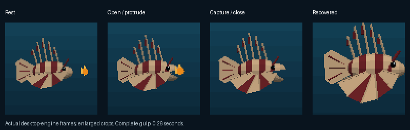
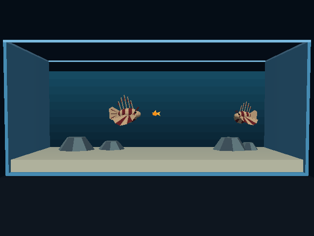
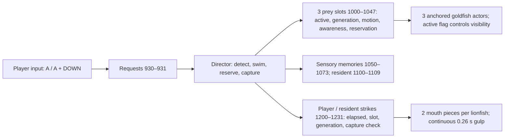

# Lionfish tank: goldfish, chasing and feeding

Date: 2026-10-02. Status: **implemented, integrated into the six-tank selector, installed and verified on Chromecast**. The separate menu agent finished and Will authorized integration/install. The revised implementation replaces immediate target acquisition and the temporary body accent with sensory detection, escape behavior and a complete articulated gulp.

Will requested a goldfish mesh and animation for the Lionfish level. **A + DOWN releases one goldfish**, with **at most three live goldfish** in the tank. The resident lionfish chases goldfish. The player can approach a goldfish and **press A to eat it**.

- [x] Inspect the current lionfish assets, input handling, resident motion and actor allocation.
- [x] Specify asset, controls, goldfish lifecycle, pursuit and verification below.
- [x] Build and inspect the animated goldfish asset.
- [x] Implement release, three-slot lifecycle and player eating.
- [x] Implement resident pursuit and capture behavior.
- [x] Implement sensory target detection and goldfish alarm/escape behavior; spawning must not notify predators.
- [x] Build a complete, quick lionfish feeding animation for both player and resident, synchronized with capture.
- [x] Verify controls, animation, boundaries and performance on desktop and Chromecast using the exported scripts, desktop runtime and shipped controller protocol. Physical controller feel remains a manual check below.
- [x] Rebuild the active aquarium selector bundle and install the verified release.

## Current level and integration points

The level is [`aquarium_lionfish`](../../wflevels/aquarium_lionfish/README.md), built through [`aquarium_tanks/generate.py`](../../wflevels/aquarium_tanks/generate.py). It currently has **two lionfish**: the player and one resident. Each visible lionfish has four mesh actors: body, tail and two fin fans. The player also has its existing collision/control actor. The original export contained **34 actors**; the completed feeding export contains **41**: three goldfish and four articulated mouth pieces added to the original level.

The shared [`controller.fth`](../../wflevels/aquarium_tanks/controller.fth) makes A a short swim burst in the keyboard/gamepad profile. In the touch profile, A changes Swim/Depth mode and B triggers the burst. The resident follows an authored sinusoidal route generated into the Director script; it has no prey-targeting state. This feature needs lionfish-specific input and Director behavior, rather than changing the other tanks' actions.

Use stable generated names and actor indices from `actor-map.json`, not today's numeric indices. Existing controller mailboxes occupy 600–627, posing actor references 650–655, and the resident route uses 800–811. Allocate the new goldfish and pursuit state through named generated constants, audit all consumers and assert disjoint ranges below the user-mailbox ceiling of 1900. Player input produces requests; the Director owns spawning, pursuit and consumption so one fish cannot be consumed twice by two scripts.

## Controls and action precedence

For the lionfish tank, A is the feeding/action button consistently across gamepad, desktop and phone controls. Keep the existing touch Swim/Depth functionality accessible through a separately labelled mode control; do not silently turn the requested A into B or lose depth movement. Verify the actual phone controller mapping and simultaneous A/Down input during implementation.

| Input/context | Result |
|---|---|
| Hold DOWN, then newly press A; fewer than three goldfish active | Release exactly one goldfish into the tank. |
| Same chord; already three active | No spawn; consume the action without eating or triggering a swim burst. |
| A newly pressed without DOWN; a goldfish is in eating range | Eat the nearest eligible goldfish. |
| A newly pressed without DOWN; no goldfish in eating range | Preserve the existing swim burst and its cooldown. |
| A held across several frames | No repeated release or repeated eating. Release and press A again for another action. |
| DOWN held without A | Normal downward swimming. |

Evaluate the **release chord before eating and before the old A action**. This guarantees that A + DOWN never eats a nearby fish by accident. Consume downward movement while the release chord is held, so releasing food does not simultaneously drive the player into the floor. Resume ordinary downward movement when A is released if DOWN remains held. A pressed before DOWN is an ordinary A action; the release gesture is DOWN held when the A press edge arrives. Do not add an input-delay window to guess future button presses.

Use separate release/eat request edges and burst cooldown state. Eating and food release should not fail merely because a prior swim burst is cooling down. A release rejected at the three-fish limit stays rejected until the next A press; it must not unexpectedly spawn later when a slot becomes free while A is still held.

## Goldfish mesh and animation

Create a recognizable small orange/gold goldfish: volumetric body, readable eye, dorsal fin, pectoral fins and a forked tail. Start with a simple single-tail shape that remains legible in the wide camera. Proposed total length is **about 25–35% of the player lionfish's nose-to-tail length**, measured from actual asset bounds; keep all three prey comparable in size. This is a scene-design choice, not a biological size claim.

Use **one mesh, one material and one visible actor per goldfish**, with fins/tail included in the mesh and no separate fish-part rig or physics hull. Share the mesh/material across three instances. Begin with roughly 100–160 triangles, refining silhouette when useful; measure cost instead of treating that count as a hard budget. Prefer opaque vertex colours for the orange body, fin accents and eye, matching the existing tank assets. If a texture is needed for readability, document its UVs and alpha policy explicitly.

Provide a real swimming animation on that mesh: a stable head and oscillating rear body/tail, small fin movement where affordable, and independent phases. Reuse the existing native single-mesh `fish-deform` path where it produces the right shape, checking its axis/rest-position conventions against the new goldfish. Tune cycle frequency and amplitude to movement speed, with a slightly stronger escape cycle; deformation must always derive from rest vertices without drift. Inspect side, end-on and close views, triangle winding, fin backsides and fixed-point triangle safety throughout the cycle.

Include a short entry motion when released. Both lionfish require the complete feeding animation specified below; the temporary body/fin feeding accent is insufficient. Capture asset views and in-engine swimming, escape and feeding clips in this plan's artifact directory before final delivery.

## Lionfish feeding animation

Animate **one quick, complete gulp in a single uninterrupted motion**: mouth opens and protrudes, prey enters, mouth closes, then the head/jaw returns to the swimming pose. Lionfish capture prey by suction produced by opening and protruding the mouth. The reference supports a whole-prey gulp rather than a repeated chewing loop. [Lionfish feeding observations and experiments](https://pmc.ncbi.nlm.nih.gov/articles/PMC13435627/).

Use this same action for the player's successful A-triggered attempt and the resident's feeding strike. Make the mouth opening readable from the tank camera and inspect it close up. Swimming and fin motion continue beneath the feeding action; starting or ending the action must not snap the body pose. Build whatever jaw/head mesh changes and animation controls are needed to show an actual opening, protrusion and closure. Do not substitute a whole-body scale pulse. Prefer deformation within existing mesh actors; if separate jaw actors are necessary, record the revised actor count and profile their cost. The one-mesh/one-actor requirement for each goldfish remains unchanged.

Start with an adjustable **0.18–0.30-second complete animation** for visual review, concentrating mouth opening and capture early in the cycle. This is a proposed game timing, **not a measured biological duration**. Drive progress from elapsed time so the complete motion plays once at different frame rates, without holding the mouth open or restarting while A is held.

An eligible action starts a strike and reserves the selected slot **and generation**. At the capture point, recheck mouth reach and obstruction; successful capture transfers the prey into the mouth and removes it exactly once from live targeting/population. A miss finishes the mouth motion without removing prey. A reserved fish still counts toward the three-live-fish limit until capture, and cannot be claimed by the other predator. After capture, any brief visual draw into the mouth is non-edible. Clear reservations on miss, completion, restart and slot reuse. Resolve competing strike starts with the player's intentional action first.

Acceptance: side/close and wide-camera clips show the entire open–capture–close–recover cycle for both lionfish, a missed strike, no looping on held A, no duplicate consumption, and continuous swimming before and after feeding. Include a sequence of frames showing the mouth at rest, maximum gape, capture and closure.

## Release location, movement and lifecycle

Preallocate **three reusable goldfish slots**, each with one actor and state containing active flag, generation/identity, position, heading/velocity, animation phase and any spawn/capture timer. The completed export has **41 actors**: the original 34, three goldfish slots and two moving mouth pieces per lionfish. This count is independent of how many prey slots are active and is confirmed by the Android runtime profiler. No runtime actor creation or unbounded list is necessary when the population cap is three.

Inactive goldfish use the existing exported **Visibility Mailbox** field, bound directly to each slot's active flag. Desktop runtime captures confirm hiding/restoration; Android profiler counts confirm exactly zero, one or three additional render actors and deformations. Inactive slots skip swimming and deformation; no off-camera parking or zero-scale geometry is needed.

Release from a fixed feeding point near the upper water, inside the tank's safe swimming envelope, rather than at the player's mouth. Offset successive occupied slots so the fish do not appear stacked. Validate the point against rocks, tank faces and both lionfish; choose another nearby clear point when obstructed. Give the prey an initial downward/forward swim into the open tank, not a teleport to the floor or a physical drop through the water.

Goldfish swim independently with bounded, gradual steering and a small deterministic wander. Use the sensory alarm/escape model below and steer away from walls/rocks. Store continuous positions and smoothly change velocity/heading; do not reproduce the barb discontinuity of applying a newly selected heading retrospectively to an elapsed motion interval. Use bounded phases/timers and variable-delta integration. Give each fish enough clearance for its complete animated silhouette.

State transitions are **inactive → released/swimming ↔ alarm/escape/recovery → captured → inactive**. Strike reservation is separate from locomotion: prey may still escape an attempted capture. Only live slots count toward the limit or enter prey scans. On consumption, clear target references, animation/capture state and pending requests for that slot before reusing it. Increment its generation on reuse, so an old strike cannot consume the newly released fish. No automatic replacement fish: the player must release another one. Entering/restarting the level starts with zero goldfish, no target and no pending action.

## Goldfish threat perception and escape: research and model

Goldfish have experimentally demonstrated defensive responses to visual looming. Weak cues can produce subtle alarm; stronger looming cues can trigger a rapid **C-start**, comprising a body bend followed by a propulsive return stroke away from the threat. Response depends on the perceived stimulus, rather than merely another fish existing nearby. These experiments do not establish that goldfish understand mortality or innately recognize lionfish. Model sensory risk assessment, with potentially naïve prey. [Otero Coronel et al., 2020](https://www.frontiersin.org/journals/neural-circuits/articles/10.3389/fncir.2020.00023/full).

Use **swim → alarm → escape burst → recovery → swim**, with stronger cues able to trigger a burst directly. Estimate visible threat from the predator's apparent size, closing velocity and approach direction, gated by sight range and obstruction. A slowly stalking or stationary lionfish need not produce immediate panic. An approaching large silhouette raises alarm; a close, rapidly approaching predator can trigger a brief C-bend/return-stroke animation and acceleration away, followed by ordinary evasive swimming. A hidden or receding predator should not sustain panic indefinitely.

Keep escape direction sensitive to available wall/rock clearance, with small deterministic variation between prey. The sudden bend and burst are intentional responses, but positions and subsequent steering remain continuous. Add recovery/hysteresis so the fish do not retrigger every frame. Threat originates in actual predator motion and proximity; an A press that does not move or strike cannot itself frighten the prey. Initial awareness thresholds, ranges and recovery durations are game tuning parameters; measure and label them separately from biological evidence.

The lionfish study used seabass and seabream, not goldfish; therefore its prey responses are not evidence that goldfish specifically recognize lionfish. Directed water jets can influence prey orientation, but adding jet effects is outside this first implementation. The initial model combines observed goldfish escape responses with observed lionfish hunting behavior, and is a stated design inference. [Lionfish experiment methods](https://pmc.ncbi.nlm.nih.gov/articles/PMC13435627/).

## Resident lionfish pursuit

With no detected prey, retain calm continuous motion even when goldfish are active elsewhere. **Releasing a goldfish must not immediately notify or target it.** Detect prey through a named sight range, forward/side visual envelope, unobstructed line of sight and accumulated observation. Begin with a tunable 0.4–1.2-second observation interval for ordinary visible prey; this is a game parameter, not a measured lionfish reaction time. Prey outside the visual envelope remains unnoticed until the resident turns or it moves into view; a spawn-age timer alone must not make it visible.

Allow immediate orientation/strike eligibility for prey appearing directly at the lionfish's mouth or within its immediate sensory neighborhood, if unobstructed. This handles the dropped-on-top exception without granting every new fish automatic immunity. Otherwise use **idle/search → notice/orient → stalk/pursue → strike → recover**. Lionfish are observed slowly stalking before a suction strike; tune pursuit so it is a deliberate approach rather than a constant high-speed chase. [Lionfish hunting study](https://pmc.ncbi.nlm.nih.gov/articles/PMC13435627/).

Select the nearest reachable **detected** live fish in 3D. Keep a target until it is consumed/unreachable or another detected fish is clearly preferable; use hysteresis and deterministic slot-index tie-breaking. Brief loss of sight permits a bounded pursuit of the last observed position, rather than continued omniscient tracking through obstacles. Decay awareness and return smoothly to searching when contact is lost.

Replace the authored route with a continuous bounded pursuit while chasing. Turn toward prey with an explicit angular-speed limit, accelerate smoothly from idle to pursuit speed and slow near the target. Begin with direct pursuit and a short capped velocity lead if needed; three prey do not justify a new navigation framework. Respect tank and rock clearance, and avoid the player's lionfish. Returning to idle must continue from the resident's current position rather than snapping back to its old sinusoidal path.

**Proposed default:** the resident automatically starts a feeding strike when its detected target reaches the same capture envelope used for the player, and catches it at the animation's capture point if it remains eligible. Keep auto-capture configurable so a chase-only resident can be selected without rewriting targeting.

## Player eating and competing catches

Measure proximity from the **lionfish mouth**, transformed by its actual pose/scale, to the goldfish body/silhouette—not from a fin tip or the invisible player's box centre. Use a small radius derived from goldfish body thickness and an appropriate mouth offset. Require the prey to be in front of the mouth, within the chosen depth/vertical tolerance and unobstructed; nearby prey behind a rock or tank face is not eligible. The front-of-mouth rule should be forgiving enough to play comfortably in the wide view.

On a new A press without DOWN, select the nearest eligible goldfish and start one complete feeding strike, consuming **at most one** at its capture point. Being near food without pressing A does not feed the player. Pressing A out of range does not remove a distant fish. Keep the distance/angular thresholds named and adjustable, and demonstrate just-inside/just-outside cases rather than guessing their final feel from source units.

Resolve both lionfish in a single Director tick against the same active-slot and reservation state: **explicit player eating requests first**, then resident strike requests. This gives the player's intentional action priority when both mouths reach one unreserved fish in the same tick. Each capture operation verifies reservation ownership, active state and generation, clears the slot exactly once, and invalidates the resident target. There is no health, hunger, score or inventory change in this feature.

## Implementation steps

1. Build the shared one-mesh animated goldfish asset and a standalone inspection scene/capture. Record vertices, triangles, material count and complete animated bounds.
2. Add three goldfish slots to the lionfish generator/config and generate actor/state constants. Implement inactive hiding, initialization, bounded swimming and A + DOWN release before introducing chase behavior.
3. Add the lionfish-specific A dispatcher and Director request/consume path. Demonstrate the population cap, edge-triggered input and mouth-proximity eating; verify that the other tanks retain their controls.
4. Add resident sensory detection, observation delay, smooth stalking/pursuit, sight-loss/retarget handling and configurable strikes. Add goldfish alarm, C-start escape and recovery. Check the near-drop exception, continuity returning to idle and deterministic competing strikes.
5. Build the complete lionfish mouth/head feeding animation and synchronize reservations and capture with its timeline. Inspect successful and missed strikes for both lionfish at different frame rates; record any extra mesh actors.
6. Run scripted regressions and actual-engine motion/interaction captures. Tune prey size, escape speed, mouth range and pursuit using the wide and close cameras.
7. Compare the unchanged lionfish level with zero, one and three active goldfish, then detection/escape/strike/capture. Rebuild the lionfish standalone and **the active selector bundle**, verify exact payload parity, build the normal release and reinstall on the local Chromecast once shared resources are clear. Preserve whichever five/six-tank manifest is actually selected at integration time.

## Verification and measurements

| Area | Required checks |
|---|---|
| Input precedence | DOWN then A releases once; a held chord does not repeat; cap rejects the fourth fish; no eat/burst from a release chord; A-first remains ordinary A; release DOWN/A in either order; new press required after a rejected spawn. |
| Eating | Near without A stays alive; A in mouth range consumes one; out of range, behind the mouth or behind an obstacle stays alive; held A does not repeatedly consume; deterministic nearest/tie behavior. |
| Lifecycle | Consume then release reuses a slot; stale target/request cannot eat the reused fish; no duplicates/ghosts; restart/menu return resets zero live prey. |
| Pursuit | No prey retains idle; targets acquired at each tank region; target persists through similar distances; consume/lose target retargets; returning idle has no position jump. |
| Detection | Ordinary release does not instantly acquire a target; prey behind/outside sight remains unnoticed; visible observation accumulates; near-mouth drop allows immediate response; occlusion breaks tracking after bounded memory. |
| Goldfish escape | Slow or stationary predator does not cause permanent panic; visible closing threat raises alarm; strong approach triggers C-bend and burst; obstacles constrain escape; recovery prevents repeated bursts; button-only input causes no alarm. |
| Feeding animation | Player and resident perform one complete quick gulp; mouth visibly opens/protrudes/closes; capture occurs at the defined point; a miss leaves prey alive; held input does not loop; competing reservations and reused generations remain safe. |
| Simultaneous capture | Player and resident overlap one prey in the same tick: one consume, player priority, live count correct; another prey remains valid. |
| Geometry/motion | One mesh/actor per prey; genuine deformation; no extra Jolt bodies; safe triangles and fin faces; continuous positions/turns; full animated silhouettes remain inside the tank and clear of rocks. |
| Devices | Desktop/gamepad A + DOWN; simultaneous phone controls plus retained mode/depth control; TV/gamepad action mapping; wide/close views; short/held Back and menu restart. |

Use a repeatable release/swim/chase/eat input trace, the same camera/device conditions and 30-second warmup for steady-state measurements. Retain raw receipts and screenshots. Use three presented-frame runs for the final device comparison, and a separate opt-in CPU diagnostic. Report frame intervals/FPS, actor/Director CPU, pursuit and deformation cost, draw submissions, memory and actual allocated actor counts. Distinguish three allocated prey actors from zero/one/three **active** prey. Keep profiler arguments disabled in the installed normal release.

| Chromecast variant | Level actors | Active goldfish | Update CPU ms | Total CPU ms | p95 ms / FPS | PSS MiB | Δ total CPU vs baseline |
|---|---:|---:|---:|---:|---:|---:|---:|
| Original lionfish | 34 | 0 | 2.019 | 4.713 | 33.37 / 29.97 | 41.88 | +0.000 ms |
| Feeding rig, slots inactive | 41 | 0 | 2.644 | 5.480 | 33.37 / 29.97 | 43.71 | +0.767 ms |
| One swimming/chased prey | 41 | 1 | 2.914 | 6.001 | 33.37 / 29.97 | 45.52 | +1.287 ms |
| Three swimming/chased prey | 41 | 3 | 3.633 | 7.284 | 33.37 / 29.97 | 45.12 | +2.571 ms |

Artifacts are saved under `docs/plans/2026-10-02-lionfish-goldfish-feeding/`; completed results and receipts follow.

Related: [lionfish tank plan](2026-10-02-aquarium-three-more-tanks.md), [selector integration](2026-10-02-aquarium-five-tank-selector.md), [barb movement and single-mesh profiling](2026-10-02-aquarium-tiger-barbs.md).

## Completed implementation and evidence

The shared goldfish asset contains **80 exported vertices, 110 triangles, one material**, and occupies 3,096 bytes. Its opaque 32 × 8 palette texture encodes body, fin and eye colours. Nose-to-tail length is 0.47 scene units, about 31% of the original lionfish length. Each instance has one anchored mesh actor and no Jolt body. Normal swimming and the brief escape bend use native rest-vertex deformation; the latter approximates a C-start within that existing wave deformer, rather than claiming a measured anatomical reconstruction. [Asset counts](2026-10-02-lionfish-goldfish-feeding/assets.json).

Each lionfish now has six visible pieces: body, tail, two fan fins, upper mouth and lower mouth. The original closed snout is replaced by two hinged head halves, with dark inner surfaces and forward protrusion. Each mouth half has 47 exported vertices and 90 triangles; it adds no physics body. The complete gulp lasts **0.26 s**, with capture at **0.10 s**. Reservations identify both slot and generation; missed strikes finish without eating, and held A cannot restart the action. A small timing tolerance handles fixed-point delta quantization.

Detection uses a **5.5-unit sight range**, forward/side envelope, exact conservative segment/rock-box occlusion and **0.65 s of accumulated observation**. An unobstructed prey within 0.4 units of the mouth can be detected immediately. Lost sight preserves the last observed position for **0.8 s**, then forgets the target. The natural desktop release was acquired after about 0.6 s beyond the harness's initial release frames; a full natural approach and capture completed without teleports. Maximum resident displacement over two 20 Hz steps was **0.080 units**. A separate real player approach triggered a goldfish escape burst; button-only input, hidden approaches and receding threats are covered by the script regressions. [Desktop interaction receipt](2026-10-02-lionfish-goldfish-feeding/engine/checks.json), [natural hunting clip](2026-10-02-lionfish-goldfish-feeding/engine/chase.mp4).

The Director owns mailboxes **930–978** for requests/scratch, **1000–1047** for three prey slots, **1050–1073** for sensory memories, **1100–1109** for the resident, and **1200–1231** for two strikes. Player input only publishes release/eat edges. Actor references come from the generated map; source code does not assume today's object indices. Rare `GF` log events record release, strike, capture and A-action snapshots, without per-frame feeding logging.

### Measurement interpretation

The Chromecast HD runs Android 14 at 1920 × 1080 with the 32-bit release library. Each variant had a 30-second warmup followed by **three consecutive 12-second uninstrumented presented-frame runs**. CPU values come from a separate opt-in run and its final two complete profiling windows. All four variants remained at **29.97 FPS**, p95 **33.37 ms** in this stationary-camera protocol. Three active prey add approximately **1.614 ms of update CPU**, **1.416 ms of Director CPU**, and **2.571 ms of total CPU** relative to the 34-actor baseline. Native deformation averages **0.021 ms/frame** for all three. PSS varies with Android allocation/cache state; its non-monotonic one/three-prey readings are not per-fish memory estimates. [Full device comparison](2026-10-02-lionfish-goldfish-feeding/profiles/chromecast/comparison.json).

The actor/Director and rendering costs are substantially larger than the deformation cost. The unchanged presented frame rate shows available headroom under this protocol, not zero added work. CPU sections overlap: total is update + render; actor, Director, feeding (`school`), pose and animation timings must not be added to it. The feeding section includes the resident's pose; pose also includes the player. Runtime level-object counts confirm **34 versus 41**, and render/deformation counts confirm **0/1/3 active prey**.

Desktop measurements use the ASAN debug engine, fixed 60 Hz simulation and vsync disabled; they are diagnostics, not TV FPS predictions. Median wall costs were 8.72 ms baseline, 9.73 ms empty feeding rig, 10.53 ms one prey and 12.03 ms three prey. The chase/capture-enabled exploratory run averaged 11.93 ms; it does not independently establish capture activity during every profiling window. Actual successful capture is established by the interaction traces. [Desktop measurements](2026-10-02-lionfish-goldfish-feeding/profiles/desktop/comparison.json), [preserved interim implementation measurements](2026-10-02-lionfish-goldfish-feeding/profiles/desktop/interim-comparison.json).

Profile variants were built in `/tmp` and retained the same six-tank selector and native release libraries. Auto-capture was disabled only in the fixed-population benchmark copies; pursuit remained active. The final normal APK has zero prey initially, auto-capture enabled and no `wf_args.txt` profiling arguments. Rare feeding-event logging was added after the steady-state profiles; those events do not execute in the measured steady-state windows.

### Integration and remaining manual checks

The active manifest has **six tanks**, including Planted Tank. The generated lionfish standalone is packaged byte-for-byte at selector index **4**, and both Android ABIs are present. All six selections and returns passed in the desktop runtime. The normal release was installed with `adb install -r`; uninstalling was unnecessary. [Build and payload receipt](2026-10-02-lionfish-goldfish-feeding/device/build.json).

- [x] Geometry, slot lifecycle, input precedence, delayed detection, visibility, sight memory, occlusion, misses, stale generations and competing reservations covered by actual exported-script tests.
- [x] Whole gulp verified at 15, 20, 30 and 60 Hz in script tests; both feeding and faster-approach escape verified in the actual desktop engine.
- [x] Release APK built and all six selector payloads checked.
- [x] Baseline/zero/one/three-prey presented-frame and CPU comparisons collected on Chromecast HD.
- [x] Final shipped controller-path release/capture/eating interaction check on the Chromecast.
- [ ] Physical phone and paired gamepad feel; actual remote held-Back return. A PC controller client and Android injected keys do not establish these physical-device interactions.

The final installed release passed real phone-controller protocol checks for held A + DOWN producing one release, three-prey capacity, player approach + A capture, consumed-slot reuse, and natural resident capture. The client connected to the TV's LAN controller address and maintained the normal input heartbeat during screenshots; no actor teleport or debug bridge was used. The installed APK hash matches the build receipt. [Device interaction receipt](2026-10-02-lionfish-goldfish-feeding/device/checks.json), [three active prey](2026-10-02-lionfish-goldfish-feeding/device/three-goldfish.png), [after player capture](2026-10-02-lionfish-goldfish-feeding/device/after-player-gulp.png), [after resident capture](2026-10-02-lionfish-goldfish-feeding/device/after-resident-gulp.png). The app was left in a fresh lionfish tank with zero prey.
