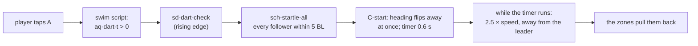
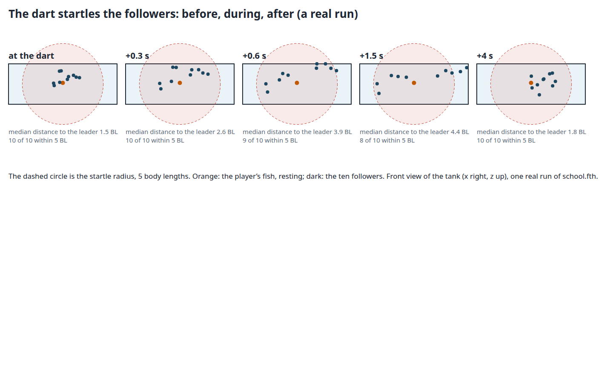

# The dart startles the school

Status: **implemented and verified on the PC engine (2026‑10‑02); not yet on the Chromecast** (the TV was not reachable from this PC when this was written).

- [x] Phase A: the trigger: the player's dart starts a startle in `school.fth`
- [x] Phase B: a fast start that is visible: heading flips at once, 2.5 times the speed for 0.6 s
- [x] Phase C: tests: the model in the standalone host, the level's Director, the real engine
- [ ] Phase D: the Chromecast: install, look, a new demo clip
- [x] Phase E: the poster says what is true

## Request

The user: **"fix: dart doesn't startle"**, and **"write plan to docs/plans/"**, and **"update poster, too"**.

The plan for the school (`2026-10-01-aquarium-schooling.md`) always had a startle: when the player darts (A), the followers nearby scatter, then regroup. `school.fth` had the word (`sch-startle-all`), its tests passed in the standalone interpreter, and the poster said "the game does not call it yet". Nothing in the level called it: **pressing A did nothing to the followers.**

## Cause

`school_rig.fth` (the Director's glue) never looked at the dart. The dart is the player's own state (`aq-dart-t`, a level mailbox the swim script sets when A is tapped and counts down), and the school had no reason to read it.

A second, quieter problem: even when called, the old startle was a *gentle* one. A follower was only told to turn away from the leader and keep swimming at its normal 2 body lengths a second, and it turns at 120° a second, so a fish facing the leader needed over a second to turn round. In the standalone model the median distance to the leader went from 1.5 to only 2.4 body lengths. A reviewer would call that "nothing happened".

## Design



- **Trigger (`school_rig.fth`, `sd-dart-check`):** each tick, if `aq-dart-t` is above 0 and was 0 last tick (mailbox 1039 remembers), call `5 sch-startle-all`. Five body lengths is about a third of the tank's width: the nearby fish are kicked, the far ones are not.
- **A fast start (`school.fth`):** `sch-startle-all` sets each follower's startle timer (`MB_STARTLE_T`, 0.6 s) **and flips its heading straight away from the leader at once**, like the real C-start of a fish; while the timer runs a follower swims `MB_KICK` times faster (2.5; a new parameter cell, 981) in the direction away from the leader (`startle-gain` in `advance`). The renderer's position carry-over between updates uses the same gain.
- **Regroup:** nothing special. When the timer ends the usual zones act, and the followers return on their own.
- **Not changed:** the leader, the modes, the walls (the hard limit still applies to a startled fish), the poses.

Numbers: radius **5 BL**, duration **0.6 s**, gain **2.5**. They are ours (the paper has no startle) and untuned beyond "visible and short".

[](2026-10-02-school-dart-startle/startle.html)

The picture is **a real run of `school.fth`** in the engine's zForth (the standalone host): a resting leader with ten followers swarming round it, a dart, then the front view of the tank at 0, 0.3, 0.6, 1.5 and 4 s. The median distance to the leader goes **1.5 → 2.6 → 3.9 → 4.4 body lengths, and is back to 1.8 at 4 s**.

## Mailboxes

One more cell in each block: parameter cell **981** (`MB_KICK`; the parameters are now 960 to 981, the scratch block still starts at 985) and global mailbox **1039** (the dart was on last tick). Both are in [the mailbox map](2026-10-01-swarming-poster.md#mailboxes-where-the-state-lives)'s ranges.

## Verification

Numbered; each shows its raw output with PASS or FAIL.

1. The model: a startled follower's heading is flipped away from the leader at once, its timer is 0.6 s, it ends further than 3.2 body lengths away after six ticks (a plain 0.6 s swim at 2 BL/s would be 1.2 BL), the far follower is untouched, and the timer counts down to zero.

    ```
    $ python3 -m pytest tests/test_swarming.py -q -k "startle or box or equals or compiles"
    .......
    7 passed
    ```

    **PASS**

2. The level: the Director calls the check each tick, and the dart trigger and the fast start are in the built script.

    ```
    $ python3 -m pytest tests/test_aquarium_level.py -q
    ```

    **PASS** (see the test list: `test_the_dart_startles_the_school_in_the_built_director`)

3. **On the real engine, in the real level**: rest, tap A, and read the followers' distance to the leader from the mailboxes (`scripts/analyse-aquarium-school.py --dart`).

    ```
    before the dart: mean distance to the leader 1.55 BL
      +0.5 s: mean distance to the leader 3.38 BL  nearest neighbour 1.77 BL
      +1.0 s: mean distance to the leader 4.17 BL  nearest neighbour 1.75 BL
      +1.5 s: mean distance to the leader 4.16 BL  nearest neighbour 1.68 BL
      +2.0 s: mean distance to the leader 3.90 BL  nearest neighbour 1.35 BL
      +3.0 s: mean distance to the leader 3.05 BL  nearest neighbour 1.14 BL
      +4.0 s: mean distance to the leader 2.36 BL  nearest neighbour 1.16 BL
      +6.0 s: mean distance to the leader 2.42 BL  nearest neighbour 1.13 BL
    ```

    **PASS**: the school scatters (1.55 → 4.17 BL within a second) and gathers again by about 4 s.

4. The Chromecast: the same on the device, by eye: a new demo clip with a dart in it. **PENDING** (the Chromecast was not reachable from this PC; the next step is to install the build and record: `scripts/record-aquarium-school-chromecast.py`, with a dart added).

5. The poster says the dart startles the school and carries the real-engine numbers. **PASS** (`task test-swarming`: the poster no longer says "not called yet", and prints the dart figures).

## Out of scope

- A tuned startle (radius, gain, duration by eye on the TV), a startle that scales with the dart's speed, or other triggers (the leader hitting a wall). Tuning is Phase 2 of [the schooling plan](2026-10-01-aquarium-schooling.md).
- The anemone: the startled fish still ignore it.

## Cost

None.

## Delegation

| Work | Tier | Why |
|---|---|---|
| Trigger, fast start, tests, the poster wording | T5 | done inline: small, and it depends on what the session found (why the first version was invisible) |
| Look at it on the TV and record the clip | T5 | needs the user's TV and a judgement by eye |
