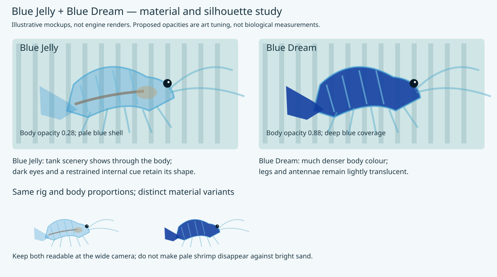
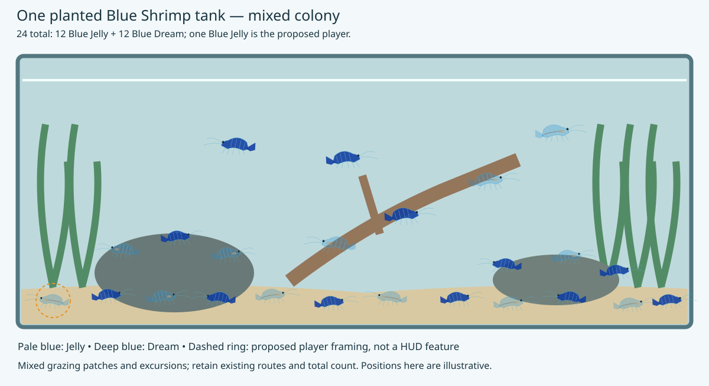
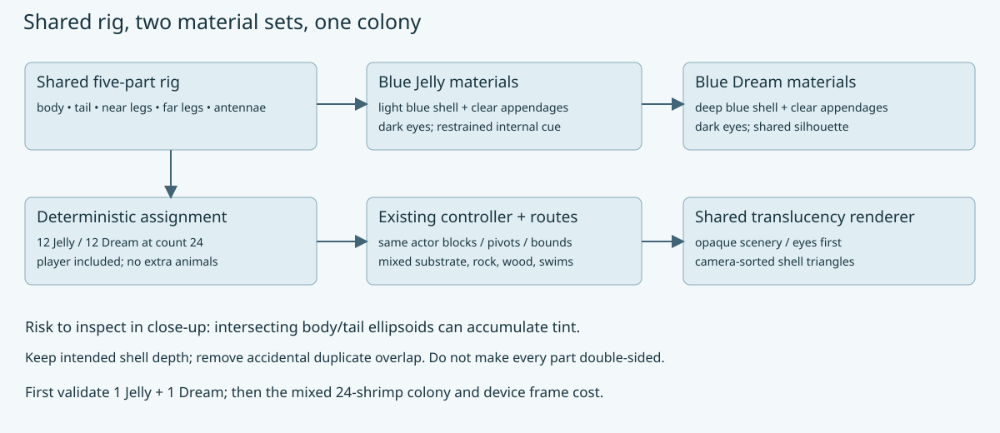

# Blue Jelly and Blue Dream: a mixed shrimp tank

**Date:** 2026-10-03. **Status:** implemented on the shared model, 12/12 colony verified, desktop checks passed, and the release installed/running on Chromecast HD. The A3 poster includes four real render panels. Planning SVGs remain labelled mockups; Apple/WebGL verification and further visual tuning remain open.

This plan owns the shrimp: appearance, shell geometry, shared rig, colony assignment, tank composition, motion, evidence and the A3 poster. The [engine translucency plan](2026-10-02-condo-translucency.md) separately owns material serialization, blending, sorting and backend support. This content work consumes that support and does not implement a second renderer.

## A3 poster

[Open the A3 portrait poster](../reference/blue-shrimp-poster/poster.html) · [Print-ready PDF](../reference/blue-shrimp-poster/poster.pdf)

The poster includes four real render panels (each morph in Blender and in-game), both colour morphs, simplified anatomy, natural grazing/swimming context, the mixed-tank composition and a five-part rig diagram. Biological facts carry source numbers; colony counts, material opacity and animation treatments are labelled as proposed game choices. No simulation frequency or speed is presented as a measured biological result.

### Required poster renderings

Arrange the renderings as a comparison grid: one row per shrimp variety, with **Blender** and **In-game** columns. Both renderers must use the actual shared shrimp model and the corresponding texture/material set.

| Shrimp variety | Blender panel | In-game panel |
|---|---|---|
| Blue Jelly | Render the pale, translucent variant; show shell, legs and opaque eyes clearly | Capture the same variant in the running aquarium after engine translucency support works |
| Blue Dream | Render the original blue variant using the same model | Capture the original variant in the running aquarium |

Use comparable camera angles, poses and apparent size so differences between varieties and renderers are easy to assess. Show enough background behind the shrimp to make translucency visible. Caption each panel with its variety and renderer; record material settings and capture provenance alongside the poster assets. Retain the anatomy and rig diagrams, and check the finished poster remains readable on one A3 page.

- [x] Add Blue Jelly — Blender rendering.
- [x] Add Blue Jelly — in-game rendering.
- [x] Add Blue Dream — Blender rendering.
- [x] Add Blue Dream — in-game rendering.
- [x] Rebuild the A3 poster PDF and visually inspect all four panels, captions and page boundaries.

The SVG illustrations remain planning mockups, now supplemented by the real renders in the poster. In-game panels depend on the engine work; do not present an illustrative or Blender image as an in-game capture.

## Two varieties in the same tank

Both varieties go into **one existing planted Blue Shrimp tank**, `wflevels/aquarium_blue_shrimp`. They are colour/material variants sharing the same species silhouette and articulated rig. Keep the menu entry “Blue Shrimp”; there is no separate tank per variety and no change to the tiger-barb tank in this scope.

Blue Jelly are the pale, transparent-looking target; Blue Dream are the darker, more densely pigmented target. Trade names and individual appearance vary, so use these as art directions rather than an exact biological opacity specification. [Shrimp breeder’s Blue Jelly / Blue Dream comparison](https://www.garnelenhaus.de/wiki/blue-jelly-oder-blue-dream).

### Shrimp appearance mockup

| Part | Blue Jelly starting treatment | Blue Dream starting treatment |
|---|---|---|
| Body / segmented abdomen / tail fan | Pale cyan-blue, opacity around 0.28; background visible through shell | Original blue palette retained at opacity 1.0 in this rollout |
| Legs / antennae | Nearly clear blue, opacity around 0.15–0.25 | Original opaque appendage materials retained in this rollout |
| Eyes | Small dark opaque eyes | Small dark opaque eyes |
| Interior cues | Optional restrained warm/grey internal mark if needed in close-up | Mostly concealed by dense body tint |
| Visual identity | Pale shell, subtle segment boundaries, darker eyes | Saturated body with restrained highlights; no glowing neon fill |

These numbers are provisional artistic tuning. Keep Blue Jelly legible. The original Blue Dream remains unchanged for the requested half-colony replacement; more translucent Dream appendages would be a later appearance change. The internal cue in the mockup is illustrative, not an anatomical claim or a requirement for a full organ model.

### Same tank, mixed colony

Proposed default: **24 shrimp total: 12 Blue Jelly and 12 Blue Dream, including the player**. Use a Blue Jelly player initially so movement and close-up cameras exercise the harder translucent case; camera framing identifies it without turning it opaque. Alternate morph assignment across the existing actor slots and authored routes, placing both on the sand, rock and wood routes and on water-column excursions. Do not double the population to 48.

For reduced counts, balance the two varieties deterministically; one-shrimp builds remain a Blue Jelly validation case. A configurable player morph can support paired captures without creating a new menu/input feature.

[Open the shrimp visual gallery](2026-10-03-aquarium-blue-shrimp-varieties/mockups.html). Regenerate the planning SVGs with [make-mockups.py](2026-10-03-aquarium-blue-shrimp-varieties/make-mockups.py).

### Baseline shrimp code and implementation checklist

Source inspection before implementation on 2026-10-03: `geometry.py` describes all geometry as opaque and uses overlapping ellipsoid/tube pieces. `PARTS` contains five meshes: body, tail, near legs, far legs and antennae. The generator currently builds one shared mesh set, applies palette materials, and assigns those mesh references to every shrimp. `constants.py` caps the population at 24 and supplies deterministic resident routes. The older Blue Shrimp plan records 596 triangles per shrimp and a slow desktop debug measurement; treat that as historical evidence, not a fresh release or device benchmark.

- [x] Extend the palette/material authoring to two deliberate material sets using the shared opacity contract above. Keep eyes opaque even when they are in the same body actor.
- [x] Share geometry and rig calculations. If the asset format attaches materials to meshes, export two reusable mesh/material sets (one per morph), not 24 unique model sets. Share identical parts where their appearance matches; use variant filenames only where required.
- [x] Assign morph by generated shrimp slot, keeping actor count, five-part pivots, resident-table stride, collision hull and zForth mailbox layout unchanged. Add an explicit morph map to generated metadata for inspection and tests; do not encode it indirectly in actor names or runtime colour guesses.
- [ ] Inspect overlapping body/tail/segment geometry. This is a volume/shell rather than a flat glass pane: test whether front/back contributions give useful depth or excessive tint. Remove hidden duplicate overlap or simplify the shell where needed. Do not apply the pane’s single-sheet rule blindly to the whole animal.
- [ ] Check eyes and optional internal cues behind/in front of the shell. Opaque internals draw in the opaque pass; shell layers composite over them. Verify the result from both sides and throughout tail/leg motion.
- [ ] Keep scenery, fog and water representation unchanged while validating the shrimp. Tank-glass refraction or water optics are separate scope. Do not add a translucent full-screen water layer to solve shrimp appearance.
- [ ] Make a two-shrimp validation build (one of each) before the full mixed colony. Preserve minimum triangle area and rig bounds; translucency must not introduce a fresh geometry/collision regression.

### Additional acceptance evidence

- [ ] Export/import preserves both morph material sets and distinguishes transparent shell from opaque eyes. Existing opaque assets still behave as before.
- [ ] Capture side-by-side close-ups of both varieties over the same backdrop, sand and dark rock; record opacity settings. A light background alone is not sufficient to show Jelly legibility.
- [ ] Capture both viewing sides, overlapping shrimp, tail flick, antenna crossing the body, grazing and short swims. No dark body joints, disappearing limbs, draw-order popping or unintended tint doubling.
- [ ] Confirm exactly 12/12 at count 24, with the player counted once; deterministic reduced-count assignments. Confirm shared asset reuse and unchanged movement/collision/controller checks.
- [ ] Compare the mixed 24-shrimp colony against the same count and camera in the opaque baseline on desktop, Android/Chromecast, WebGL and Metal where available. Record opaque/blended triangles, sorting cost, draw calls, memory and frame pacing. The existing debug performance is already a concern; opacity approval is not performance approval.
- [ ] Keep the whole-tank and close-up camera views readable at actual output resolution and TV viewing distance. Adjust tint/opacity before adding geometry or animation actors solely to make pale shrimp visible.

## Approved execution order and poster review learnings

Will resumed work after the first A3 poster on 2026-10-03. Keep the existing shrimp geometry and five-part rig. The second variety is a texture/material variant; do not remodel it or add separate animation actors. Keep content and engine support in separate plans.

Implementation learnings: the original shrimp use flat palette colours rather than a texture image. Author the second appearance as a small RGB palette atlas with UVs on the same geometry; retain the original material set for the other half. The legacy texture packer quantizes alpha, so continuous shell opacity travels as explicit material metadata rather than relying on image alpha. Keep eyes and eye glints opaque. Verify geometric equality by triangle positions, allowing material sorting and UV seams to change exported vertex/face order.

1. Update this plan with review learnings (same model; two texture appearances; exactly half the existing colony uses the new texture).
2. Make the second shrimp texture on the existing model. Preserve original geometry, rig, pivots, collision and controller.
3. Assign the new texture to half the shrimp in the existing tank (12 of 24, including the player); retain the other half’s original appearance.
4. Update the engine to display the new translucent texture/material through the separately tracked translucency work.
5. Add real renderings to the A3 poster: **Blue Jelly in Blender, Blue Jelly in-game, Blue Dream in Blender, Blue Dream in-game**. Use matched model poses, background, scale and documented material settings. Label each renderer and distinguish isolated model studies from tank captures. Keep the anatomy/motion diagrams and biological citations. If a renderer has not been validated, mark its panel pending; never substitute a mockup and label it a runtime image.
6. Install and run the updated aquarium on Chromecast, select Blue Shrimp, inspect both varieties, and record actual device evidence. Refresh the poster with the device view as additional evidence where useful.

- [x] Inspect current shrimp geometry, materials, rig and population.
- [x] Prepare both appearance mockups and a mixed-tank mockup.
- [x] Prepare a rig/material diagram and initial A3 poster.
- [x] Resume after Will’s poster review and record the requested execution order.
- [x] Produce the second texture with the same model; exported triangle geometry matches the original.
- [x] Assign it to exactly half the tank population; generated metadata and content checks confirm 12/12, including the Jelly player.
- [x] Implement engine translucency support and validate on desktop GL and Chromecast GLES; Apple and WebGL checks remain open in the engine plan.
- [x] Add four labelled Blender / in-game shrimp renderings to the A3 poster.
- [x] Install and run on Chromecast; record verification.

## Implementation results — 2026-10-03

Content commit [1aef7152](2026-10-02-condo-translucency/commits/1aef7152.html) adds the RGB Jelly atlas, shared-model UV/material variant, deterministic 12/12 assignment and regenerated standalone assets. The original appearance remains on odd-numbered shrimp; the Jelly player and even-numbered shrimp use the second appearance. Five-part geometry, rig and controller are retained.

[Desktop checks](2026-10-03-aquarium-blue-shrimp-varieties/engine/checks.json) pass for colony animation, both cameras, six directional boundaries and backward tail flick. Ten content/compositor tests pass, and all five Jelly parts preserve opacity through a Blender import/export round trip. [Motion recording](2026-10-03-aquarium-blue-shrimp-varieties/engine/shrimp-motion.mp4) and [Chromecast capture](2026-10-03-aquarium-blue-shrimp-varieties/device/blue-shrimp-optimized.png) show the running mixed tank.

The installed Android release includes the updated shrimp standalone in the existing tank-selector packet. Logs confirm Blue Shrimp at level 1. The full-colony Chromecast sample has median 33.37 ms (approximately 30 FPS), p90 50.05 ms; these are spot measurements, not an opaque-baseline comparison. Initial uniform-opacity batching measured approximately 12 FPS before moving alpha into vertex data. Desktop debug/ASan estimate: 108.8 ms/frame. The [engine plan’s simulated PR](2026-10-02-condo-translucency.md#simulated-pr-explicit-material-translucency-across-actors) explains the engine changes and lists its three implementation commits.

The A3 poster remains one portrait page, visually checked after rebuilding. Its Blender images use the exported models with a common studio camera; the in-game panels are labelled crops of the actual Chromecast tank capture. The different lighting/backdrops are explicit rather than presented as a pixel-matched renderer comparison.

## Biology and animation references

These are colour morphs of *Neocaridina davidi*. UF/IFAS describes five pairs of walking legs, five pairs of abdominal swimming limbs, and grazing on algae and biofilms. The current five-part game rig groups appendages for economy; it is not a five-limb anatomical model. Preserve that distinction when improving the silhouette. [UF/IFAS species profile](https://ask.ifas.ufl.edu/publication/IN1301).

Grazing and short swimming excursions already exist in the tank. Retain those behaviours for both morphs; coordinate visible feeding/leg motion with resting/crawling and swimming appendages with excursions where the rig budget allows. Tail flick speed, gait periods and animation phases remain game tuning until supported by species-specific motion measurements. No breeding or live-animal husbandry simulation is added in this plan.
