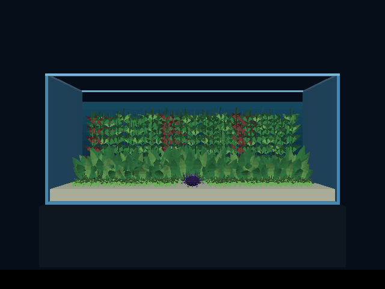
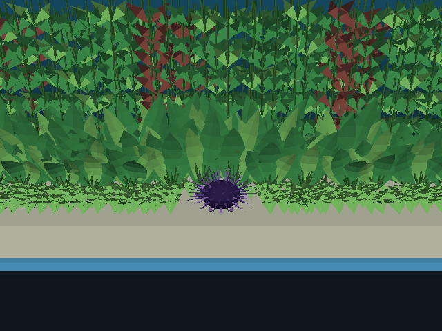
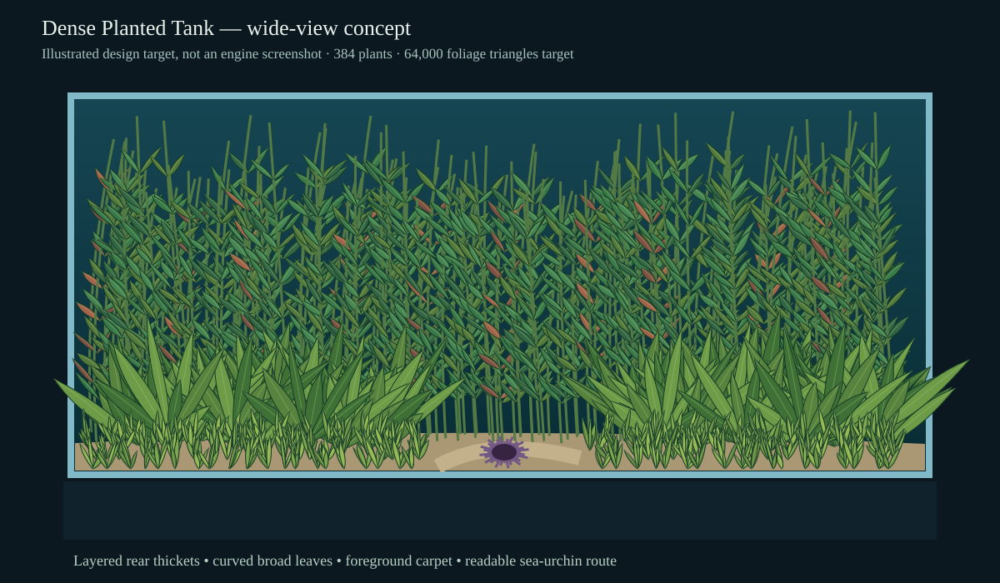
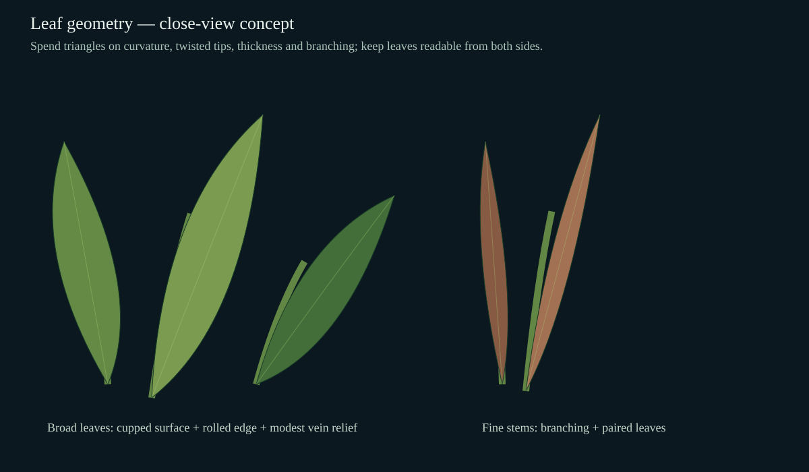
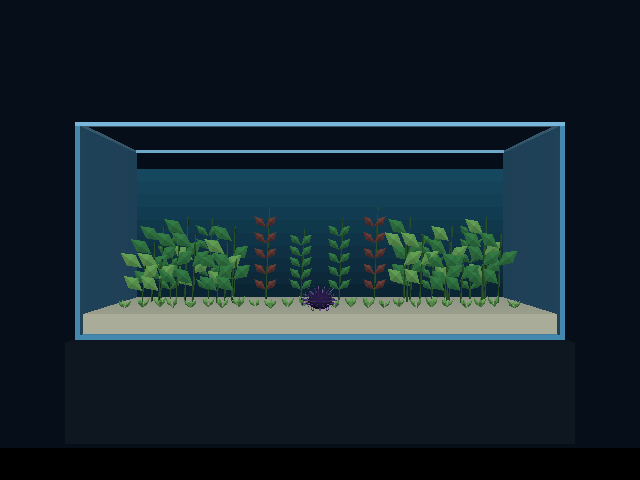
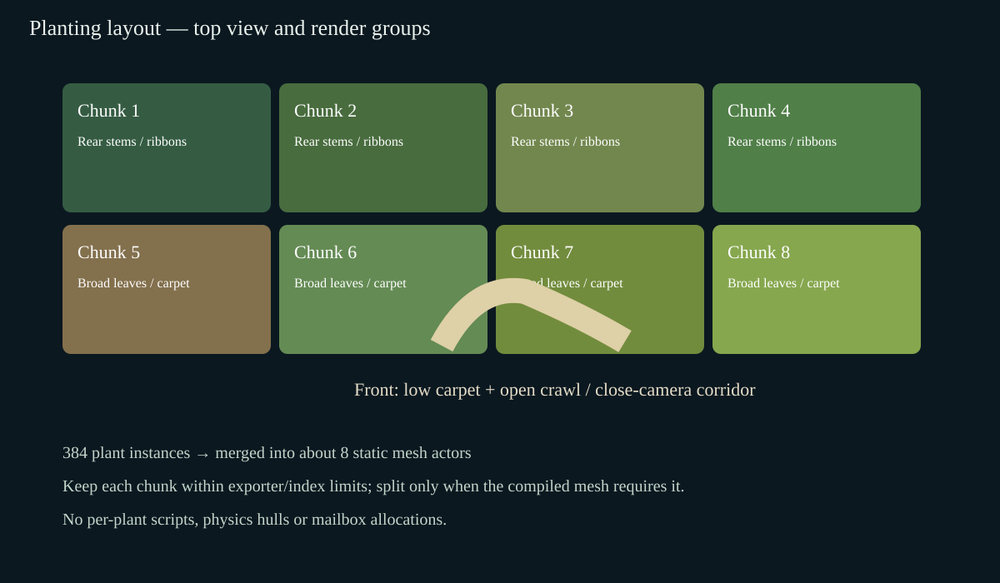
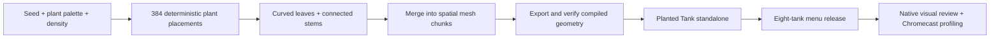

# Aquarium: a tank mostly full of detailed plants

**Status:** completed historical dense-static trial. The current Planted Tank uses seeded runtime colonies, fresh/salt textures, visible growth and gentle sway; see the [implemented successor and current-build benchmark](2026-10-03-aquatic-plant-clumps-and-poster.md). Keep this trial's captures and performance figures as archived evidence; its row-based asset is only the current benchmark's reference control.

Make **Planted Tank mostly full of plants**, rather than a few separated clumps around a large open center. Target **75–85% projected foliage coverage of the submerged interior in the whole-tank camera**, including tall growth through the center and overlapping layers in depth. This is a visual composition target, not a claim that solid plant geometry occupies that percentage of the water volume. Keep a narrow, irregular route at substrate height for the existing sea urchin, with enough visibility to use the close camera. Keep the selector name **Planted Tank** and index **5**.

## Visual review

The SVG designs below are concepts. [Open the native review](2026-10-03-aquarium-dense-planted-tank/index.html) for actual engine captures and motion.

These are authored SVG design mockups, **not engine screenshots**. Shape, density and coverage are the targets; final lighting and shading must be assessed in the engine.

The full tank should read as a continuous planted habitat. Tall, curved ribbon leaves and branching stems reach near the waterline; broad rosettes overlap through the middle; low plants fill the substrate. Use varied greens, a smaller amount of red/brown foliage, different heights and irregular spacing. Avoid evenly spaced rows, mirrored clumps and a bare middle strip. Depth should remain visible through overlapping silhouettes and gaps between leaves.

The close view needs leaves that curve along their length, cup across their width, twist toward their tips and have readable thickness. Add modest midrib relief and branching stems. More polygons must visibly improve these forms rather than subdividing the current angular leaves without changing their silhouette. Use geometry and materials that work on both sides of a leaf; alpha-cutout support is not a prerequisite.

## Current level and proposed scale

Source inspection of `wflevels/aquarium_tanks/planting.py` gives the current counts below. Triangle counts include the existing leaf backs and stem caps. The baseline image is an archived native-engine capture, not a new measurement.

| Measure | Current level | Detailed target |
|---|---:|---:|
| Broad-leaf plants / rosettes | 24 | 64 |
| Rear stems / tall plants | 8 | 128 |
| Foreground tufts | 25 | 192 |
| Total rooted plants | **57** | **384** (~6.7×) |
| Leaves | 227 | Approximately 3,000 (~13×) |
| Foliage triangles | **2,328** | **64,000 nominal** (~27.5×); review band 48,000–80,000 |
| Foliage actors | 3 static groups | Approximately 8 static spatial groups |
| Total exported actor-map entries | 33 | Approximately 38 if eight foliage groups suffice |
| Per-plant scripts / physics / mailbox state | None | None |

The target mix is a starting budget: roughly 8 leaves per broad plant, 12 per tall stem and 5 per foreground tuft gives 3,008 leaves. Include ribbon-shaped foliage within the tall-plant count. Tune size and placement to achieve the mostly-full appearance, rather than treating the count alone as acceptance. Report final compiled counts separately from these proposed budgets.

## Layout and geometry

Use deterministic placement with varied height, spread, lean, leaf age and color. Fill front-to-back space; use lower foreground growth to expose the urchin locally without opening a large empty vertical window. Keep foliage inside the tank and below the waterline. Leave an envelope around the urchin's crawl route for its body and animated tube feet. Plants remain visual geometry without hundreds of individual collision actors.

Generate connected curved leaf surfaces with several longitudinal sections and transverse curvature. Broad leaves receive more sections than tiny carpet blades. Build stems as connected swept tubes with smooth bends and branches, avoiding capped tubes at every segment. Weld vertices where shading allows; inspect normal handling before assuming smooth normals survive export. Preserve deliberate crease edges and material variation where required for readable shading.

Merge plants into about eight spatial chunks, grouped by location rather than one actor per plant or leaf. Inspect the actual mesh format/index and exporter limits before setting a hard chunk size; also verify fixed-point bounds, triangle area and texture/material limits. Split a chunk only where geometry limits or measured rendering costs require it. The higher triangle budget should principally increase rendering work, without a proportional increase in actor/script dispatch.

## Implementation phases and profiling

Use matched release native libraries, camera positions, input sequences and profiling settings for every comparison. Record exact APK/source hashes and compiled vertex/triangle/actor counts. Capture wide and close views because close foliage may expose geometry and overdraw costs hidden by a distant camera. Use at least three repeated runs per configuration and report both aggregate results and run spread.

1. **Baseline:** profile the current level, with its 57 plants and 2,328 foliage triangles. Record whole-tank idle, close-view idle and a repeatable urchin crawl/camera-change sequence.
2. **Density pass:** fill the tank using approximately 384 plants with the existing simple leaf shapes. Nominal foliage budget is around 8,000–16,000 triangles. Use the intended spatial grouping. Verify the mostly-full composition and crawl visibility. This isolates the cost of population and screen coverage before detailed geometry.
3. **Detailed geometry pass:** retain the density-pass positions and grouping, replace simple leaves/stems with curved, thicker, more detailed forms, targeting roughly 64,000 foliage triangles. Verify wide/close silhouettes, normals, front/back surfaces and tank bounds, then profile again. Distinguish extra geometry cost from actor and scripting changes.
4. **Optional later motion:** subtle coherent sway may be proposed after the dense detailed tank is accepted. It is not required for the requested density/geometry pass. If added, use grouped mesh deformation rather than independent plant actors and profile its incremental cost separately.

Collect presented FPS, p95 frame interval, missed-vsync percentage, actor/script CPU time, render CPU time, animation/deformation CPU time, memory and package/mesh sizes where the existing tools can measure them. Do not label CPU render submission time as GPU time. Record GPU measurements only if a supported tool produces them. Avoid assuming triangle count is the limiting factor: use the measurements to identify whether screen coverage, render work, actor time or something else dominates.

| Configuration | Plants | Foliage triangles | Foliage actors | Presented FPS | p95 frame ms | Missed refresh % | Actor / director CPU ms | Render CPU ms | PSS MiB | Delta FPS vs baseline |
|---|---:|---:|---:|---:|---:|---:|---:|---:|---:|---|
| Baseline | 57 | 2,328 | 3 | 39.87 | 33.37 | 50.34 | 1.283 / 0.139 | 3.702 | 45.21 | +0.00 (+0.0%) |
| Density | 384 | 26,112 | 8 | 29.94 | 33.37 | 99.36 | 1.265 / 0.117 | 18.158 | 54.78 | -9.93 (-24.9%) |
| Detailed | 384 | 66,048 | 8 | 20.21 | 66.73 | 99.59 | 1.322 / 0.122 | 42.884 | 79.79 | -19.66 (-49.3%) |
| Clumps + sway | Same | Pending | Same | Planned | — | — | — | — | — | — |

| Configuration | Wide idle FPS | Close idle FPS | Close crawl FPS | Aggregate FPS run range |
|---|---:|---:|---:|---|
| Baseline | 59.77 | 30.35 | 29.97 | 39.86–39.99 |
| Density | 29.97 | 29.93 | 29.89 | 29.93–29.96 |
| Detailed | 20.93 | 19.92 | 19.74 | 20.18–20.27 |

Provide absolute and percentage deltas against baseline, plus detailed-minus-density deltas. If performance degrades, first test grouping, hidden surfaces, redundant vertices and excessive tiny geometry while preserving the mostly-full composition. Make an evidence-based geometry tradeoff; do not silently revert to the sparse original layout.

## Work locations and acceptance

Extend `wflevels/aquarium_tanks/planting.py` or a dedicated foliage geometry module consumed by it. Keep the `plants` branch in the shared generator isolated from other species. Rebuild `aquarium_plants` assets and the canonical eight-tank Android menu bundle. Adapt the existing plant tests and native captures to assert actual compiled group/count/bounds contracts and verify urchin motion, both cameras and visibility in the new foliage.

Acceptance requires the whole tank to look mostly planted across its width and depth; substantial curved-leaf detail to be apparent in the close view; a usable urchin crawl route; no per-plant controller/mailbox allocation; valid exported triangles and chunk limits; and a completed comparison table with fresh Chromecast measurements. Verify selector navigation, phone-panel dismissal and back-arrow return behavior. Other seven tank payloads should remain unchanged.

After direct-launch profiling APKs, reinstall the normal **eight-tank selector release**, verify its installed hash and selector startup, and leave that release on Chromecast. The recent missing-selector incident came from leaving a direct-launch profiling build installed.

## Trial results and limitations

Chromecast HD, Android 14, 1920 × 1080: three matched normal-release runs per configuration, 30-second warmup, then 12 seconds each of wide idle, close idle and close crawl. Separate one-run instrumented builds supplied CPU/counter windows. The APKs share identical native libraries and the other seven level payloads; an earlier unmatched baseline is explicitly excluded. Source and package identities are in [build.json](2026-10-03-aquarium-dense-planted-tank/build.json) and [package-identity.json](2026-10-03-aquarium-dense-planted-tank/package-identity.json); [raw profiles](2026-10-03-aquarium-dense-planted-tank/profiles/) and [comparison data](2026-10-03-aquarium-dense-planted-tank/performance.json) are retained. Scenario boundaries are approximate to one polling round trip plus a frame.

Actor work stays around 1.3 ms with 29 actor-mailbox writes per frame; the added cost is mainly in the measured render path: 3.70 → 18.16 → 42.88 ms. This is CPU time including render submission/driver work, not a GPU timing measurement. Population and coverage changes precede the detailed-geometry comparison; the latter holds positions and eight groups fixed. Detailed geometry costs another 9.73 presented FPS (32.5%) versus density, with about 24.73 ms more render CPU time. Normal-run PSS rises by 9.57 MiB for density and 34.58 MiB for detailed geometry versus baseline.

The density pass actually has 26,112 triangles, above its nominal 8k–16k target, because the final leaf census is 3,008 closed leaves. Detailed geometry has 38,335 compiled vertices and 66,048 triangles across eight static groups. Baseline has 33 mapped objects; both dense variants have 38. No plant scripts or plant-specific mailbox allocations were added. The level requires a 24 MB room pool and one loaded-room slot: the original 6 MB pool is insufficient, and three 24 MB slots exceed the global heap.

The normal eight-tank release was restored after all profiling and its installed hash verified: [restore receipt](2026-10-03-aquarium-dense-planted-tank/profiles/restored.json), [selector screenshot](2026-10-03-aquarium-dense-planted-tank/profiles/restored-selector.png), [installed plant view](2026-10-03-aquarium-dense-planted-tank/profiles/restored-plants.png). Native captures show controls and wide/close views; 40 relevant plant, movement, menu, Android packaging and back-navigation checks pass.

This is a geometry/density trial, not the final naturalistic composition. User feedback identifies the regular rows as too linear. Preserve the measurement reference while replacing rows with connected colonies and then adding separately profiled root-pinned sway under the successor plan.
