# Aquarium: clumped plant growth, gentle water motion and an A3 poster

**Status:** runtime growth, fresh/salt textures, gentle sway and TV/phone settings are implemented and device-verified. The mature textured/shaded and 128/256/512 atlas comparisons are complete, with normal-APK restoration verified. **Keep 256**, as approved: 128 softens detail without useful speed gain; 512 adds fine close-up grain, about 4 MiB PSS and worse close-up pacing, with a 4.7% saltwater FPS cost. Broader growth/sway/seed-spread and repeated-entry memory measurements remain pending. The A3 portrait poster is complete. Implementation: `0aa37847`; earlier texture benchmark: `d7e70afb`.

Replace obvious rows with **connected, irregular patches of growth**. Grow toward a mostly-full mature tank: overlapping clumps should eventually cover roughly 75–85% of the submerged interior in the whole-tank view, with local gaps and a small, winding substrate route for the sea urchin. Add subtle, coherent water-driven bending with anchored roots. Make an **A3 portrait poster**, split into saltwater on the left and freshwater on the right; reserve the **bottom 25% of the page** for diagrams and explanations of clumping and branching.

## Plant-level behavior

**Every time the player selects Planted Tank, start a new seeded ecosystem and let the player watch it grow.** Begin with 12–18 small young founder colonies. Runners extend, daughter shoots emerge, leaves unfurl, stems elongate and side branches/whorls appear; the scene gradually becomes the mostly-full mature tank. Returning to the selector and selecting it again starts different founders and growth choices. Changing camera keeps the current ecosystem; pause freezes growth and sway, and resume continues without a large catch-up jump. The eight-tank selector, sea urchin and existing controls remain the content baseline.

Growth is visibly accelerated and authored, not presented as real biological time. Initial tuning target: clearly noticeable development within 5–10 seconds, several expanding colonies by 30 seconds, and a mostly-full canopy around 90–180 seconds. These were the original composition targets. Tested seeds fully develop after about 117–144 growth seconds; see the implementation and measurement sections below. Mature growth slows or stops at bounded density; indefinite turnover is deferred. Keep the urchin route usable at every stage.

Use a fresh engine-owned seed per entry and log/display it. Allow player seed entry and expose a developer fixed-seed override for reproducible captures, regression checks and matched profiling. Same seed, settings and generator version must reproduce positions, lineage, shapes and colours. Independent random streams for growth choices, morphology and sway prevent a new leaf rule from unexpectedly relocating every colony. A fresh seed changes the scene while bounded density and spacing rules keep every result usable.

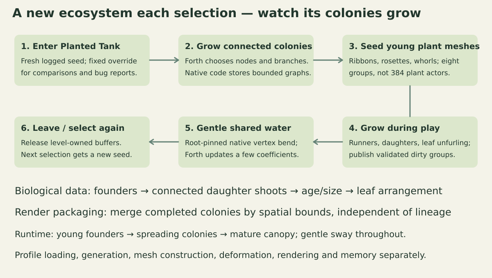

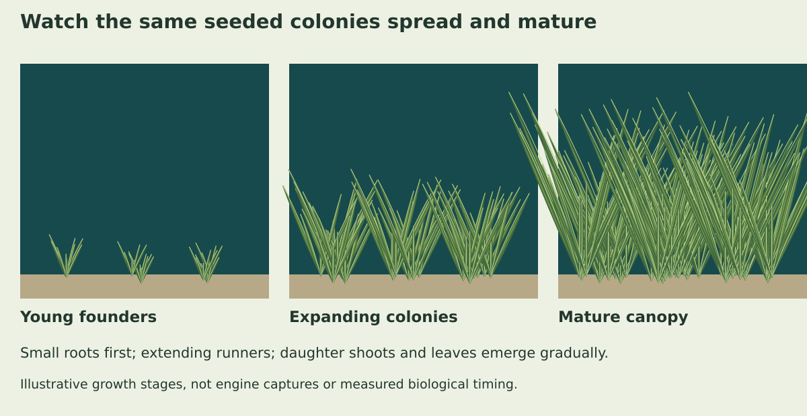


These illustrations are design mockups. Actual runtime captures and verification receipts appear below. The runtime mesh interfaces are implemented; the remaining measurements are tracked separately. Continued mature-tank turnover remains a later option.

## Player water-type, seed and growth-speed controls

Show **`Seed: 713 · Freshwater`** (or `Saltwater`) (the actual current value) at the **bottom left** of the planted-level view, inside the TV safe area. Use readable high-contrast text with a restrained dark backing; reserve the bottom-right area for the existing WF badge/FPS. Keep the seed visible while plants grow, after switching cameras and when reopening a replay. The number stays constant during one ecosystem's lifetime.

Players can enter a seed and **regenerate the level**:

- **TV remote / gamepad in the level:** hold **A / the remote centre button** for about one second to open the seed editor. A short press retains its existing camera action; distinguish tap versus hold and never perform the camera action after a recognized hold. Show the concise `Hold A: change seed` hint beside the seed. Tap/hold handling and remote navigation are implemented and covered by the device checks.
- **Selector:** with Planted Tank highlighted, **→** opens the same seed editor before entering. Normal selection starts a fresh random ecosystem. Seed-entry regeneration selects Planted Tank with the submitted seed; other level controls remain unchanged.
- **Connected phone:** provide a `Plant settings` action opening the **entire settings interface on the phone**, not merely a numeric keyboard. Opening settings through the TV/gamepad also presents that full panel on the connected phone. It includes the freshwater/saltwater toggle, current seed, numeric entry, growth-speed slider/value, **← Apply settings and close**, **Regenerate**, **New random seed**, validation messages and **Cancel**.
- **No connected phone:** show the complete TV panel with the standard 10-key keypad and remote/gamepad navigation. Keep both routes functionally equivalent.

The settings panel has a **Freshwater / Saltwater** toggle, a seed field, a standard **10-key numeric keypad** laid out `1 2 3 / 4 5 6 / 7 8 9 / ⌫ 0 Clear`, a **Growth speed** slider, **Regenerate**, **New random seed**, and cancel. Enter the number through the 10-key keypad or phone numeric field; a connected physical numeric keyboard may also type digits directly. Direction arrows move between the spatially nearest controls in the visible grid without wrapping keypad rows. A selects a key/action or enters/leaves speed adjustment; during speed adjustment, ←/→ changes the rate. **← on the remote applies settings and closes**. Invalid seed input stays in the editor. Pause growth, sway and the urchin while editing. Cancel resumes the same tank at the same growth time, without a new seed or resource replacement. Keep current seed visible/pre-filled; entering a new value replaces it through normal editing.

Accept decimal unsigned seeds **0–4,294,967,295**, at most ten digits; zero is valid. Reject empty, non-integer and out-of-range input with a short inline explanation, preserving the current tank. Normalize leading zeros after successful submission. Handle the seed as an exact native integer: do not silently round it through a single float-valued Forth cell. Pass deterministic PRNG state to Forth in an exact supported representation, or keep PRNG state native with explicit bounded-number operations.

**Regenerate** resets the growth clock, safely releases/replaces level-owned growth and mesh buffers, and starts young founders from the submitted seed and water type. Re-entering the same seed replays the same growth choices at the same simulation time, rather than restoring the previous plant ages. **New random seed** chooses and displays a fresh seed and starts a new ecosystem in the selected water type immediately. Log seed, generator version and growth settings for reproduction. Repeated regeneration must not leak buffers or disturb the other aquarium levels.

### Freshwater / saltwater toggle

Add a two-position **Freshwater / Saltwater** toggle to the complete phone panel and TV fallback. Default to **Freshwater**, matching the current plant forms. Remember the last applied water type for subsequent level selections during the session; each normal selection still chooses a fresh random seed. The selected type changes plant forms and their growth rules, rather than merely changing the water colour.

The toggle edits the settings draft. **Regenerate** applies it and starts young colonies using the entered seed and selected speed; **New random seed** starts that selected type with a new seed. Preserve the entered seed when switching the toggle so players can compare the two palettes. Cancel leaves the existing tank unchanged. Remove the **Apply speed** button and preserve its empty position in both layouts. The remote/phone **←** applies all draft settings and closes: speed-only edits retain the existing ecosystem and growth age; seed or water-type edits regenerate young colonies. On the selector it applies the draft for the next entry and closes without entering the tank. There is no extra confirmation step after pressing Regenerate.

Replay identity is **water type + seed + generator version + growth settings**. The same seed in freshwater and saltwater intentionally produces different botanical forms, with repeatable results inside each mode. Display the active type next to the bottom-left seed and include it in logs, phone/TV acknowledgements and profiling receipts. Carry the toggle draft across phone disconnect/reconnect just like seed and speed.

| Water type | Plant palette from poster/research | Growth and motion |
|---|---|---|
| Freshwater | Crypt-like rosettes, Vallisneria-like ribbon tufts, Limnophila-like feathery whorls | Short/long daughter runners, rosette leaf emergence, stem nodes and side branches; rooted flexible sway |
| Saltwater | Eelgrass-like ribbon meadows, Halophila-like paired paddle-leaf carpets, branching brown-algal forms | Connected seagrass rhizomes and paired daughter leaves; bounded algal tip forks with anchored holdfasts; flexible sway weighted from each base |

These are authored plant-form palettes; the marine examples span different climates and are not labelled as one verified natural biotope. Keep species-specific growth rules distinct, particularly rooted/rhizomatous seagrasses versus holdfast-anchored algae. Both modes retain the same level slot, controls, growth-speed slider, clumping/coverage targets and bounded mesh-group strategy. This toggle selects the plants; it does not add water-chemistry simulation or change the player character.

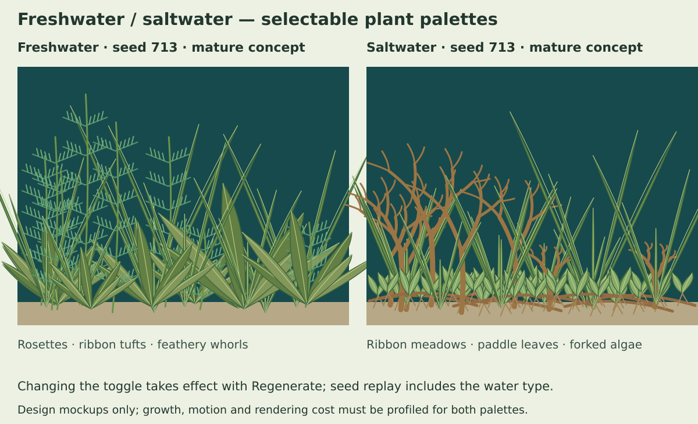

### Complete settings interface on a connected phone

Use a phone-sized settings page/drawer instead of sending users back to the TV to finish an action. The seed field opens the phone's numeric keyboard; the full growth-speed slider and every apply/regenerate/random/cancel action are in the same phone panel. Show current water type, seed, selected multiplier and growth state/age. Preserve the normal joystick screen as the return destination after applying or cancelling settings.

The engine owns the actual water type, seed, growth clock and applied speed; the phone edits a draft. Opening the panel pauses the tank and captures current settings. **←** applies the draft and closes, keeping the current ecosystem for speed-only edits and regenerating for seed/water-type edits; **Regenerate** submits water type/seed/rate and resets growth; **New random seed** requests a new engine seed and resets growth; **Cancel** discards the draft and resumes. Acknowledge success and show the authoritative resulting water type/seed/rate on both devices. Display validation/errors inline on the phone. Do not infer success merely from sending a message.

While phone settings are active, the TV can show a restrained `Plant settings on phone` overlay with the current water type/seed/speed; it need not display a second editable keypad. The bottom-left seed remains readable. Support **←** on the remote to apply and close that session; the explicit **Cancel** button discards edits. If the phone disconnects, move the open draft to the TV fallback panel, with a clear connection message and no automatic regeneration; keep the tank paused until ←/Regenerate/Cancel. Reconnecting mirrors authoritative state and the current edit session. Prevent duplicate submissions and stale sessions from regenerating twice; ignore joystick movement while the settings modal is active.

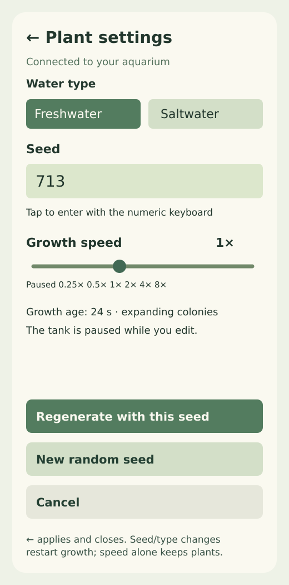

### Growth-speed slider

Default **1×**: author the mature canopy to appear around **90–180 seconds**, with a visible change in 5–10 seconds. Add selectable **Paused, 0.25×, 0.5×, 1×, 2×, 4× and 8×** positions, now implemented. Their complete active-growth pacing comparison remains pending. At 0.25× the target becomes approximately 6–12 minutes; at 2×, 45–90 seconds; at 8×, roughly 11–23 seconds, **if the measured update budget can sustain that rate**. Do not promise unsupported maximum rates: measure them and revise the offered range if necessary.

When the slider is focused, A enters/leaves rate adjustment, and ←/→ adjusts the rate while editing; touch dragging chooses a position. Show the selected multiplier beside the track. Changing speed preserves seed, plants, current growth time and growth history. Keep it as a session setting for subsequent regenerations/selections. The explicit **Cancel** button discards unsubmitted water-type/seed/speed edits. **Regenerate** commits water type, seed and speed and restarts from young founders; keep the former **Apply speed** position empty; **←** applies and closes, preserving the ecosystem for speed-only changes. A displayed **Paused** growth setting stops growth but leaves gentle water sway and urchin controls active after closing the panel; opening the modal panel still pauses the whole tank.

The slider scales only the fixed-step **growth clock**, not water motion, player movement, camera response or render frame rate. Derive development from accumulated growth time; use seeded fixed-step events so different rates reach the same botanical state at the same growth time. Root-pinned sway uses its own real-time clock. High speeds must respect bounded dirty-group construction/upload budgets and avoid bursts of mesh replacements; measure worst-frame pacing while dragging/changing speed and during rapid growth. Profiles specify seed, multiplier, growth time and young/intermediate/mature snapshot explicitly.

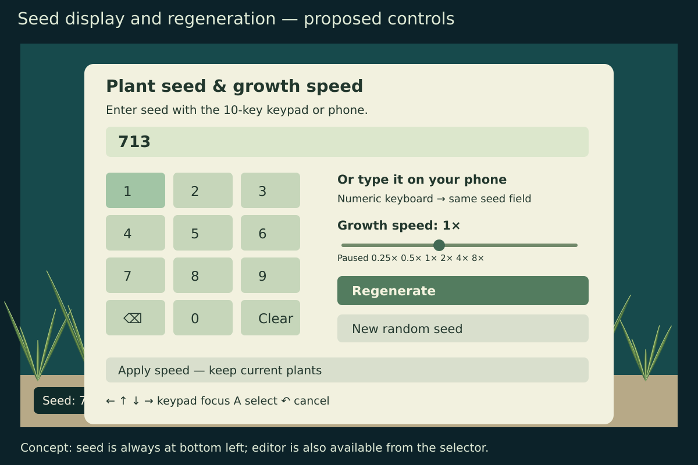

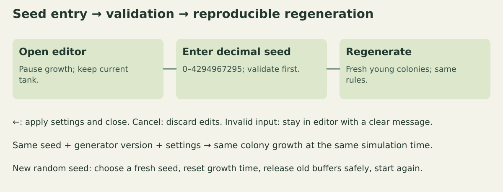

## Leaf textures — approved addition

Will approved adding textures because shaded solid colours still do not provide convincing plant surfaces. Keep the curved meshes and their lighting, then add surface detail that follows each leaf rather than painting one pattern across an entire colony.

- [x] Generate a six-form albedo preview for the plan.
- [x] Prepare a compact, padded texture atlas and add UVs to runtime leaf geometry.
- [x] Bind textured plant materials without adding actors or render groups.
- [ ] Verify both water palettes, both leaf faces, young growth and mature sway on Chromecast.
- [x] Profile mature static textures against shaded controls at seed 713, age 150, matching cameras/input; report FPS, p95, render CPU and memory. Growth/sway profiling remains pending.

| Form | Surface detail | UV direction |
|---|---|---|
| Freshwater broad rosette leaves | Midrib, fine branching veins, restrained mottling | Base to tip along the midrib |
| Freshwater ribbon leaves | Parallel longitudinal veins and gentle colour variation | Lengthwise along each curved ribbon |
| Freshwater whorl leaflets | Fine midrib and subtle tissue grain | Lengthwise on each leaflet |
| Saltwater seagrass ribbons | Parallel fibres and subdued green variation | Base to tip |
| Saltwater paddle leaves | Midrib and delicate lateral veins | Base to tip on each paddle |
| Brown-algal forks | Mottled olive/brown tissue and longitudinal striations | Along each branch; no terrestrial leaf venation |

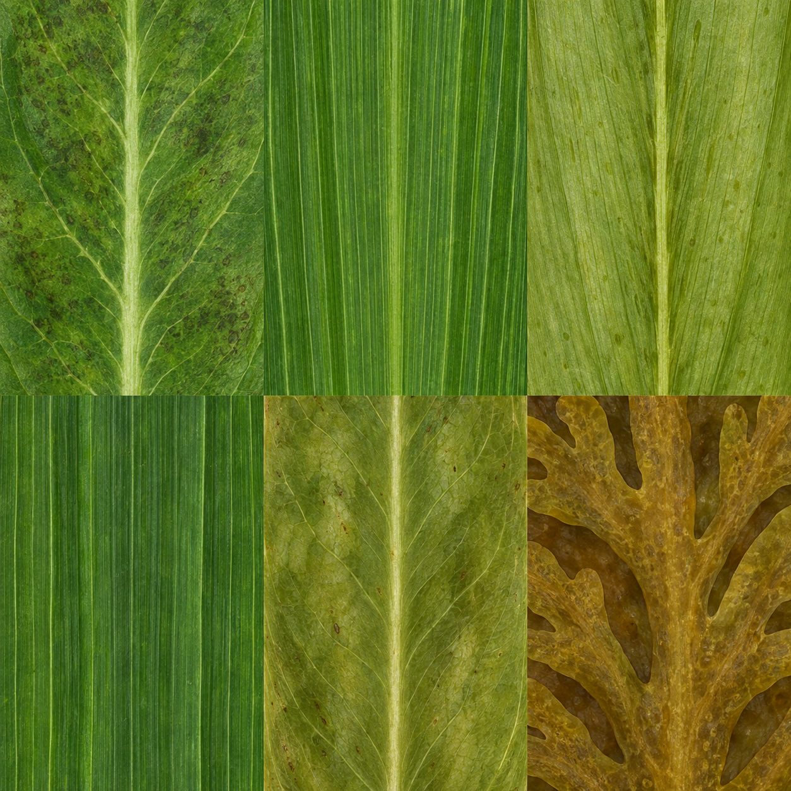

This is a generated artwork preview, not an engine capture or botanical identification plate. Its six rectangular tiles show the proposed surface treatment. The padded production atlas is implemented and linked below; this earlier preview is retained for reference.

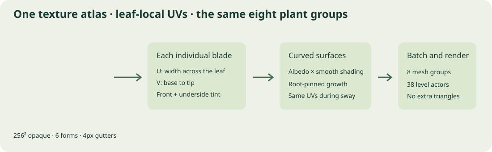

Use diffuse albedo with restrained contrast; keep directional highlights and shadows in the existing mesh shading. Orient UVs per leaf so veins follow the surface through growth and bending. Use the same leaf surface on front and back with a modest underside tint, and preserve the mesh silhouette; transparent cutout cards are unnecessary for these closed leaves. The production atlas is **256 × 256**, with six **72 × 112** interiors, four-texel extruded gutters and one shared material per existing chunk. It occupies **128 KiB** in the packed 16-bit room page (the current GL room slot remains 256 × 256 / 256 KiB RGBA8 even when a smaller page is loaded); inspect filtering, seams, tip stretching and fine-detail readability at TV viewing distance. Scale tiny whorl detail down rather than adding polygons for veins. Preserve seeded layout, birth times, actor count and the eight-group rendering structure. Record the texture resolution, format and memory in the comparison. The native rest-vertex record gains UVs and a separately shaded texture tint: 12 extra bytes per planned vertex (about 0.95 MiB for freshwater seed 713). A developer `--plant-texture=0` control uses the same native binary and level payload to render the shaded comparison. Runtime material changes refresh the cached renderer alongside flags, so its triangle layout matches the published primitives. Plant materials explicitly enable **texture × vertex colour** modulation in the GL and Metal backends: the legacy replace-if-white rule otherwise ignores albedo on shaded grey vertices. Other materials retain the legacy rule. The device check rejects missing green foliage or brown algae; The compositor forwards and retains this mode through deferred draws and state restoration. A recording-backend regression verifies both opaque forwarding and sorted translucent state; Mac/Metal visual verification remains a separate target check.

### Implementation and the white-foliage fix

- [x] Generate and package six opaque leaf/thallus surfaces into the 256² padded atlas.
- [x] Add width/length UVs to each individual closed blade; preserve them during growth and sway.
- [x] Retain the existing eight mesh groups, 38 actors and triangle counts.
- [x] Refresh cached material renderer dispatch when runtime material flags change.
- [x] Add opt-in texture modulation to GL and Metal and forward it through the common compositing wrapper, including deferred-draw state capture/restoration.
- [x] Build Android and desktop; verify green textured freshwater foliage on Chromecast. Will confirmed that the colour is working.
- [x] Extend the production compositor regression to check texture-mode forwarding and restoration (3 focused compositor/translucency checks passed). The earlier aquarium/growth/phone regression suite passed 81 checks.
- [x] Complete the latest end-to-end phone/device check: remote/selector settings, exact seed, both palettes, disconnect/reconnect draft, apply-on-back, new seed on entry and Home/resume. The earlier interrupted attempts are superseded by the final build’s new receipt.
- [x] Verify textured saltwater foliage on device: green seagrass and olive/brown algae.
- [x] Run three matched mature-static release traces per water type against shaded controls, plus separate CPU traces, and record deltas.

**Why the leaves appeared white:** the generated atlas contained the intended colours. Runtime vertices supplied a grey lighting tint, expecting **albedo × tint**, but the existing shader uses a legacy **replace-if-white** rule: a vertex that is not nearly white keeps its vertex colour and ignores the sampled texture. The first modulation change also missed the compositing wrapper, whose default no-op method prevented the new mode reaching the actual GL backend. Forwarding the flag through that wrapper fixed the remaining white foliage. Other materials retain the legacy rule.

A separate earlier failure was cached material dispatch: runtime flags selected a Gouraud textured primitive while the cached render function still expected the old flat primitive layout. Refreshing the cached renderer with the flags fixed that crash. Material validation now checks that the cached renderer matches the flags.

The current device test checks foliage colour as well as controls: missing green leaves or missing brown algae fails verification. Keep the generated preview separate from the production atlas and from actual engine evidence. The Metal implementation mirrors the opt-in mode; its visual verification has not been run on an Apple device.

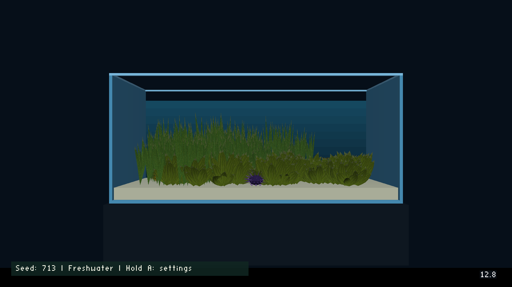

[Production atlas](2026-10-03-aquatic-plant-clumps-and-poster/leaf-surfaces-atlas.png) · [Texture pipeline diagram](2026-10-03-aquatic-plant-clumps-and-poster/leaf-texture-pipeline.svg). The capture above uses seed **713**, accelerated growth to the mature canopy, and the regular textured renderer. It is visual evidence, not a completed performance result.

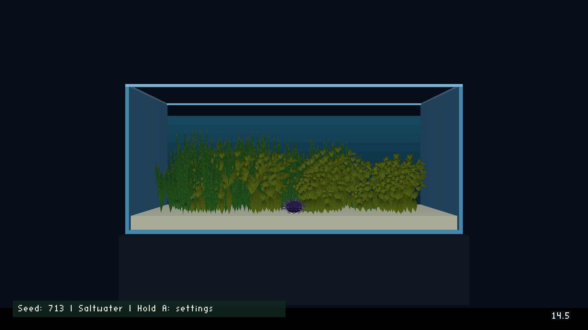

[Final device verification receipt](2026-10-03-aquatic-plant-clumps-and-poster/runtime-evidence/textured-device/checks.json) verifies installed APK SHA-256 `eabc18940d8ab8ba7d62b71a05ab9607d8533d599d1153b4e64d291d5c751e2c`. Colour checks found 127,066 green foliage pixels in freshwater and 131,955 green / 1,469 brown pixels in saltwater inside the fixed foliage region; grey/white foliage fails these checks.

## Poster and research reference

[Open the A3 PDF](2026-10-03-aquatic-plant-clumps-and-poster/aquatic-plants-a3.pdf) · [Vector SVG](2026-10-03-aquatic-plant-clumps-and-poster/aquatic-plants-a3.svg) · [Browser review](2026-10-03-aquatic-plant-clumps-and-poster/index.html).

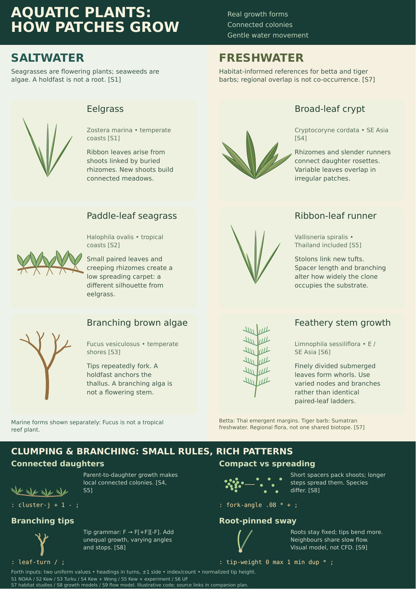

The page is **297 × 420 mm**, portrait. Its upper 75% has equal left/right subject areas; the lower band starts at exactly **315 mm**. Use original botanical schematics rather than photos copied from sources. Illustrations show growth forms, not diagnostic identification plates or literal scale. Source identifiers on the poster map to the linked bibliography below and in the browser review. [Compact Forth snippets](2026-10-03-aquatic-plant-clumps-and-poster/plant-helpers.fth) are [checked in the actual zForth VM](2026-10-03-aquatic-plant-clumps-and-poster/forth-verification.json) (nine arithmetic/boundary cases with balanced stacks); they are not complete botanical simulations or existing plant-deformation APIs.

Print the PDF at **actual size / 100% on A3 portrait**, without additional printer margins or fit-to-page scaling. The SVG remains the editable vector master.

## What the research supports

**Marine seagrasses and seaweeds are different growth systems.** Seagrasses are flowering plants with roots and rhizomes; seaweeds are algae, commonly attached by holdfasts. The left panel includes eelgrass, paddle-leaf seagrass and a branching brown-algal form, with habitat distinctions. Sea anemones are animals and do not belong in the plant list. [NOAA seagrass overview](https://floridakeys.noaa.gov/plants/seagrass.html), [NOAA restoration guide](https://repository.library.noaa.gov/view/noaa/70998/noaa_70998_DS1.pdf).

**Clumps emerge from lineage and spacing.** A multi-species seagrass study found substantial variation in rhizome extension, internode spacing, and branching rate/angle. Short spacers and repeated branching can produce compact occupation; longer spacers spread shoots more widely. Do not assign one universal branch angle or spacing to every species. Research models explicitly generate connected rhizome structures, including density-dependent rules. [Marbà & Duarte: rhizome elongation and clonal growth](https://pure.knaw.nl/portal/en/publications/rhizome-elongation-and-seagrass-clonal-growth), [seagrass space occupation study](https://www.nature.com/articles/s43247-024-01758-0), [L-system seagrass model](https://pmc.ncbi.nlm.nih.gov/articles/PMC3189841/).

**Freshwater runner systems also connect neighbouring shoots.** Experiments on *Vallisneria spiralis* describe stolon-linked ramets and changes in spacer length and branching angle under sediment stress. This supports modelling local connected expansion rather than placing independent plants on a grid. [Vallisneria clonal architecture experiment](https://www.sciencedirect.com/science/article/abs/pii/S0304377009000771), [clonal integration experiment](https://www.sciencedirect.com/science/article/abs/pii/S0304377006001227).

**Regional plants for the fish we have made:** wild *Betta splendens* was observed among dense emergent vegetation near Thai rice-field margins; that habitat should not be reduced to an underwater garden of ornamental stems. *Cryptocoryne cordata* has a Southeast Asian range including Thailand and Sumatra, but regional overlap is not proof that a particular plant occurs with a particular fish at a particular site. *Vallisneria spiralis* is documented in Thailand, and *Limnophila sessiliflora* has finely divided submerged leaves in whorls. These are useful habitat-informed shape references, with their provenance stated accurately. [Wild betta habitat study](https://doi.org/10.1111/j.1095-8649.2001.tb02288.x), [Kew: C. cordata distribution](https://powo.science.kew.org/taxon/urn:lsid:ipni.org:names:86676-1), [Kew: V. spiralis distribution](https://powo.science.kew.org/taxon/431996-1), [University of Florida: L. sessiliflora](https://plant-directory.ifas.ufl.edu/plant-directory/limnophila-sessiliflora/).

*Cryptocoryne cordata* descriptions include slender runners and variable leaves; this is a direct botanical basis for irregular daughter rosettes. Prefer the descriptive flora over an inconsistent aggregated web description. [Wong's Araceae of peat-swamp forests, pp. 59–60](https://www.aroid.org/gallery/wong/Araceae%20of%20Peat%20Swamp%20Forests%20-%20%5BBiodiversity%20of%20Tropical%20Peat%20Swamp%20Forests%20of%20Sarawak%2035-86%5D%20Wong%202016.pdf).

The tiger-barb panel emphasizes **Sumatran freshwater**, rather than claiming Thai betta and tiger barbs share one habitat. Published native-range accounts conflict and older records include congeners; the poster therefore avoids a precise unsupported plant/fish co-occurrence claim. Further fish levels can receive their own geographically matched flora later. [US Fish & Wildlife Service tiger-barb assessment](https://www.fws.gov/sites/default/files/documents/Ecological-Risk-Screening-Summary-Tiger-Barb.pdf).

**Branching seaweed is algorithmically interesting.** Research has modelled multiple seaweeds with L-systems. *Fucus vesiculosus* is a temperate brown alga with repeated dichotomous branching, not a tropical reef plant. Show a simple two-daughter tip grammar as a schematic, then add unequal growth, missed branches and species-specific attachment/shape. Do not present one grammar as the biology of every seaweed. [Corbit & Garbary: seaweed L-systems](https://doi.org/10.1016/0097-8493(93)90055-E), [University of Turku field-research thesis](https://www.utupub.fi/server/api/core/bitstreams/39593dae-44c6-4535-85e2-d398204c85a7/content).

**Gentle water motion should bend the plants, not move their roots.** Flexible vegetation reconfigures with flow, and neighbouring stems experience a shared flow field. Our proposed low-amplitude oscillation is a visual approximation, not a fluid simulation or measured current. [Flexible aquatic vegetation motion model](https://doi.org/10.1016/j.coastaleng.2019.04.009), [ecological biomechanics review](https://academic.oup.com/jxb/article/73/4/1104/6535216).

## Clumping and branching design

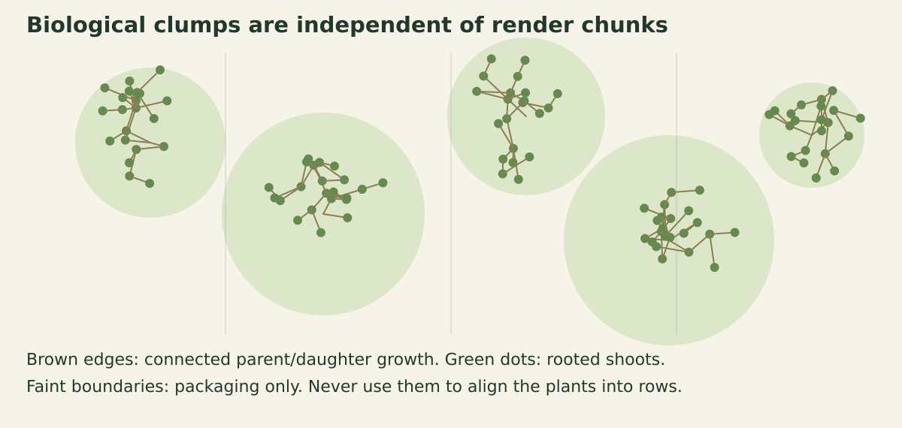

On each entry, start from around **12–18 founder patches**, with irregular sizes and outlines. Allocate most plants to a few substantial colonies and fewer to small satellite patches. Grow daughter plants from existing parent nodes using species-specific step lengths and correlated heading changes; avoid random jitter of the old rows. Stop or divert growth at tank margins, the crawl route and excessive local crowding. Use bounded parent-to-daughter rhizome/stolon walks in the first version, with minimum spacing and local crowding checks. Independent random dots around founders are useful for a prototype mockup but are not the final growth model.

Correlate species, age, height and colour within each patch, then vary them among individuals. Younger daughters tend to occupy expanding edges in the simplified authored model. Blend adjoining patches and create local pockets rather than dividing the scene into eight rectangular botanical zones. **Render chunks are independent of biological clumps:** partition the finished geometry for mesh limits, but do not let chunk boundaries determine planting positions.

### Plant palette and growth rules

Use both sides of the poster as **shape and architecture references** for the two selectable palettes. Freshwater uses rosettes, ribbon tufts and whorled stems; saltwater uses seagrass rhizomes, paired paddle leaves and anchored branching algae. This does not assert an exact biotope or change the existing sea urchin. Keep the palettes separate and retain the climate distinctions of the source examples.

| Form | Colony model | Mesh silhouette | Variation and crowding |
|---|---|---|---|
| Crypt-like broad rosette | Short connected runner steps produce compact daughter groups | Curved oval/cordate leaves emerge radially from each base; varied petiole lengths | Mixed young/small and mature/broad rosettes; taper density near patch edges |
| Vallisneria-like ribbon tuft | Longer stolon steps with occasional side daughters spread through neighbouring space | Long flexible ribbons, varied width, bend and tip height | Clustered bases, individually curved blades; avoid parallel equal-height fences |
| Limnophila-like fine stem | Local stem colonies with variable internodes and bounded side branches | Feathery submerged whorls around nodes, rather than identical paired leaves | Vary whorl count, orientation, branch length and age; retain gaps between stems |

Use roughly 384 rooted shoots or anchored plant/algal bases as an initial mature-population reference, but distribute them unevenly between 12–18 colonies. Colony quotas, footprint, species mix and age distribution vary per seed; global shoot/leaf/vertex limits stay bounded. These quotas and 75–85% coverage are authoring targets, not measured botanical population ratios. Grow most tall foliage through the back and middle depth, mixed broad colonies in front/middle, and low daughter growth around edges. Preserve a winding substrate route and local pockets for the urchin instead of one bare straight strip. Nearby colonies can interlock; avoid both rectangular botanical partitions and evenly spaced decorative islands.

For branch structure, use bounded tip growth: extend a parent axis; optionally fork or form a side shoot; reduce daughter segment length/radius gradually; vary branching angles and node spacing; terminate below the minimum useful segment size. Keep leaf arrangement appropriate to the chosen form—basal rosette, ribbon tuft, paired leaves, or whorls. Preserve the curved leaf meshes from the dense pass where they fit the selected form.

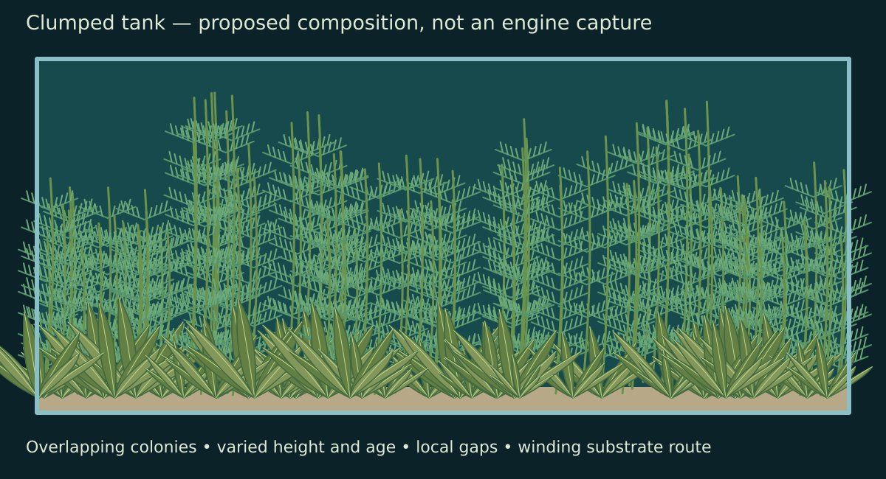

This is a concept mockup, not an engine capture. The dense detailed pass remains the measurement reference. The present level contains a sea urchin alongside generic freshwater-style foliage; this is an established authored scene, not a validated freshwater biotope. The poster keeps marine and freshwater examples separate. The new toggle explicitly selects the freshwater or saltwater plant palette while retaining the current player/controller.

## Water motion and Forth

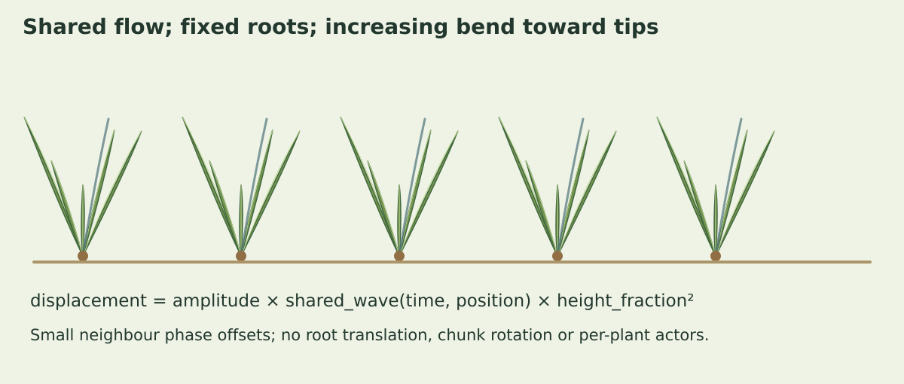

Use a slow shared oscillation with a small secondary component. Initial **authored** tuning: a 5–9 second primary period, tall-tip displacement around 1–3% of plant height, much less for short carpet growth, and modest phase differences across space. Apply continuous interpolation and a root-to-tip weight such as `w²`. Pin root vertices exactly; retain each stem's base, material assignments and leaf shape. Neighbours should sway broadly together rather than perform independent metronomic dances. Clamp resumed-frame time and reinitialize safely after pauses.

The simple arithmetic fits Forth well:

```forth
: tip-weight ( height-fraction -- weight ) 0 max 1 min dup * ;
: cluster-j ( uniform-a uniform-b -- centred-offset ) + 1 - ;
: fork-angle ( heading signed-side -- daughter-heading ) .08 * + ;
: leaf-turn ( leaf-index leaf-count -- turns ) / ;
: ease ( current target dt -- next )
  0 max .8 * 1 min >r over - r> * + ;
```

The examples use cycles/turns where appropriate. `.08` turns is a schematic branching parameter, not a measured universal angle. `cluster-j` needs independent uniform inputs supplied by a deterministic generator; it creates a centre-heavy triangular distribution but is not by itself a full clumping model. `leaf-turn` describes a radial rosette before authored angular/length variation. `ease` is a simple stable interpolation rule, not a physical spring. The poster prints the smallest helpers; the accompanying Forth file contains comments and numeric checks.

The implemented native generator builds the bounded lineage graph and mature rest meshes at entry. During play, growth age reveals shoots and scales rooted blades; native deformation applies gentle sway. Forth registers the eight chunks with `plant-register` (syscall 175) and invokes `plant-step` (176); native code owns the species rules, buffers, growth clock and sway coefficients. The mature freshwater seed-713 rest mesh has 82,888 vertices, so vertex work stays native. This implements visible authored growth rather than drawing an extending underground runner or physically unrolling each leaf. Individual plants have no actors, and roots remain pinned.

## Completed 512 atlas quality/cost comparison

Will requested profiling **512 for improved looks**, with performance measured as a possible cost rather than an expected benefit. The approved production default remains **256** during this experiment. **PASS:** coordinator job `J-ff43c21dd4e7` completed all **16 corrected traces**, restored and hash-verified the normal 256 APK. The corrected benchmark compares freshwater and saltwater at 256 and 512, each with three release repeats and one separate CPU trace. Seed 713, age 150, paused growth/sway, cameras, geometry, native libraries and no-phone conditions match the preceding protocol. Fresh 256 control traces are measured inside this session rather than reusing earlier timings.

The 512 atlas is **repacked from the original six-tile artwork**, not upscaled from the production atlas. Its interiors are **144 × 224** with eight-texel extruded gutters and the same normalized tile layout. Packed page payload rises from **128 to 512 KiB (+384 KiB)**. The compiled planted level rises from **196,608 to 589,824 bytes (+384 KiB)**. Source meshes, level script and 256 control are checked byte-for-byte.

The larger page requires `--vram-slot-width=512 --vram-slot-height=512 --vram-height=1024` with the existing native renderer. The global VRAM height must exceed 512 because the legacy UV descriptor check uses a strict `<` bound. This changes all nine transient room slots, not just the planted page: the nine CPU RGBA8 pixel buffers rise from **2.25 to 9 MiB (+6.75 MiB allocated capacity)**. GPU textures are created lazily on each slot’s first `Load`: each uploaded slot rises from **256 KiB to 1 MiB (+768 KiB)**, with +6.75 MiB total capacity only if all nine are uploaded. These figures describe buffers, not measured driver residency or process PSS; the profile will report PSS separately. The global CPU pixel map also grows by **2 MiB** when its height rises from 512 to 1024, giving **8.75 MiB total extra CPU buffer capacity**. GPU residency remains dependent on which slots are uploaded. Permanent/palette sizes and production settings remain unchanged. A future per-room allocation optimization would be a separate change.

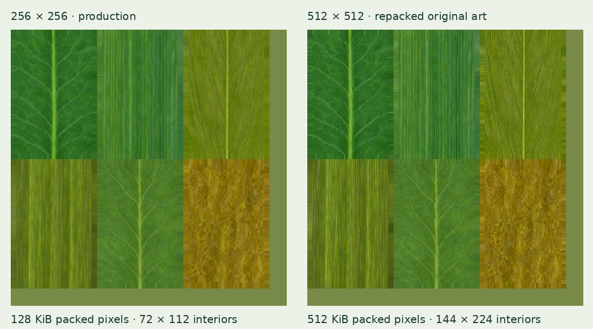

The first attempt (`J-95746bdfdb14`) failed entering the 512 scene and verified restoration. It provides no valid 512 timing. A desktop diagnostic reproduced `h = 512, Display::VRAMHeight = 512` in `gfx/rmuv.hpi`; raising only the test VRAM height to 1024 passed the ten-frame standalone diagnostic. The diagnostic uses a desktop build solely to identify the bound; it is not a Chromecast performance result. [Failed-attempt receipt](2026-10-03-aquatic-plant-clumps-and-poster/runtime-evidence/texture-512-comparison/failed-attempt/receipt.json).

The corrected Chromecast scene check **passed** as job `J-ad42f2d506ff`, verified the expected mature seed/geometry and all three VRAM arguments, and restored the normal APK. [Preflight capture](2026-10-03-aquatic-plant-clumps-and-poster/runtime-evidence/texture-512-comparison/preflight/screenshot.png) · [Receipt](2026-10-03-aquatic-plant-clumps-and-poster/runtime-evidence/texture-512-comparison/preflight/receipt.json).

**Camera audit:** the first 256 repeat entered close framing, then toggled to wide; other observed repeats followed the intended order. The primary comparison therefore uses both actual stationary views per repeat, reclassifies their labels from screenshots, excludes the first second of each segment for camera/input settling, and excludes crawl from every case. Every run contains both distinct stationary views; all 16 camera pairs passed the audit. This keeps the camera workload matched without hiding the input/entry timing issue. Raw traces remain unchanged alongside derived matched-static inputs and the audit.

**Visual result:** 512 adds finer freshwater vein/surface grain and saltwater tissue detail in close-up. At whole-tank scale the difference is subtle. Silhouettes, curvature, broad vein patterns and density are unchanged; higher resolution does not address faceting or UV distortion. These representative captures show no obvious new tile-edge seam. The report pairs the **actual** matching camera views, including the corrected first 256 view labels, and preserves screenshot pixels in the detail crops.

| Water / atlas | FPS (range) | p95 ms | Render CPU ms | Actor CPU ms | Deform CPU ms | PSS MiB |
|---|---:|---:|---:|---:|---:|---:|
| freshwater-256 | 14.72 (14.64–14.88) | 83.42 | 60.29 | 1.32 | 0.017 | 78.41 |
| freshwater-512 | 14.80 (14.57–14.82) | 83.42 | 60.63 | 1.33 | 0.018 | 82.76 |
| saltwater-256 | 16.64 (16.43–16.68) | 66.73 | 53.70 | 1.30 | 0.017 | 78.34 |
| saltwater-512 | 15.86 (15.84–15.95) | 66.73 | 53.68 | 1.38 | 0.018 | 82.25 |

| 512 versus 256 | FPS delta | Render CPU delta | Median PSS delta | Packed-page increase |
|---|---:|---:|---:|---:|
| freshwater | +0.08 / +0.55% | +0.34 ms / +0.56% | +4.35 MiB | +384 KiB / +300% |
| saltwater | -0.78 / -4.70% | -0.02 ms / -0.04% | +3.91 MiB | +384 KiB / +300% |

| Actual stationary camera | Fresh 256 FPS / p95 ms | Fresh 512 FPS / p95 ms | Salt 256 FPS / p95 ms | Salt 512 FPS / p95 ms |
|---|---:|---:|---:|---:|
| wide-idle | 14.89 / 66.73 | 15.03 / 66.73 | 16.92 / 66.73 | 16.71 / 66.73 |
| close-idle | 14.55 / 83.42 | 14.58 / 116.78 | 16.33 / 66.73 | 15.03 / 116.78 |

**Cost:** freshwater median FPS is essentially unchanged (+0.55%, overlapping repeat ranges). Saltwater drops **4.70%** across the matched stationary views, and about **7.96%** in close-up. Combined p95 remains roughly 83.42 ms freshwater / 66.73 ms saltwater, but that hides worse close-up tails: freshwater **83.42 → 116.78 ms**, saltwater **66.73 → 116.78 ms**. The larger atlas/configuration is a visual-quality option with a measured pacing cost in this session, not a performance optimization.

CPU rendering changes only **+0.34 ms** freshwater / **−0.02 ms** saltwater. These are separate single diagnostic runs, each with three complete five-second CPU windows within the retained idle intervals. Nested thread timings are not additive or GPU timings. The presentation changes with roughly stable render CPU do not identify their cause; this test does not isolate GPU/cache/driver time.

| Case | PSS snapshot range across three release repeats |
|---|---:|
| freshwater-256 | 78.07–79.43 MiB |
| freshwater-512 | 79.83–83.30 MiB |
| saltwater-256 | 76.46–78.44 MiB |
| saltwater-512 | 78.65–82.33 MiB |

PSS rises by about **4 MiB** in both water types, while configured CPU buffer capacity rises by 8.75 MiB. PSS includes process/driver/allocator accounting and does not separately measure GPU residency; do not equate either value with atlas bytes alone. Case blocks are sequential rather than randomized. Thermal snapshots all report status 0; current core temperatures ranged from **48.3 to 52.7°C**. Geometry and native libraries match; all CPU cases retain 38 objects, 26 render actors and 25 draws.

These values use only audited stationary views, with one second removed at each segment start. They should not be directly pooled with the earlier 128 comparison’s three-segment aggregate.

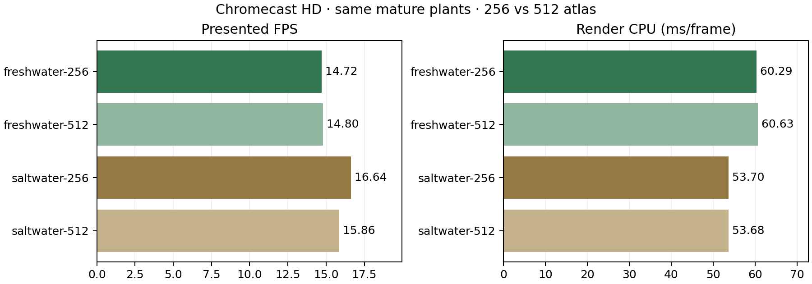

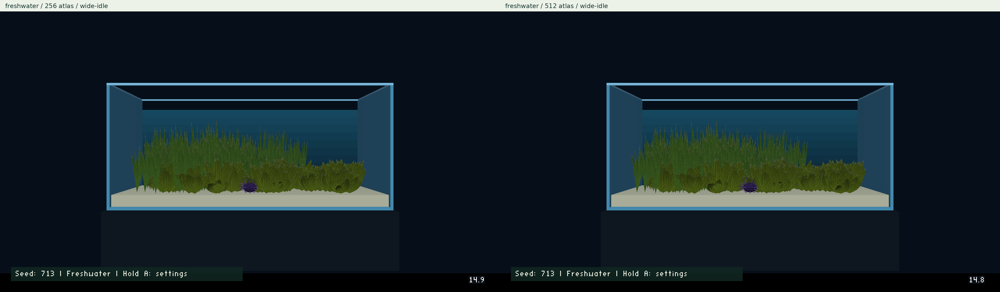

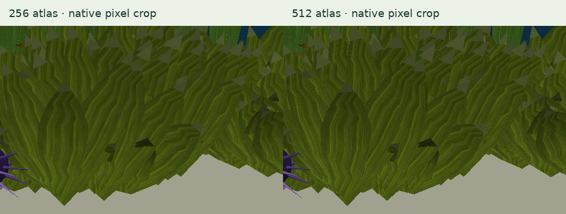


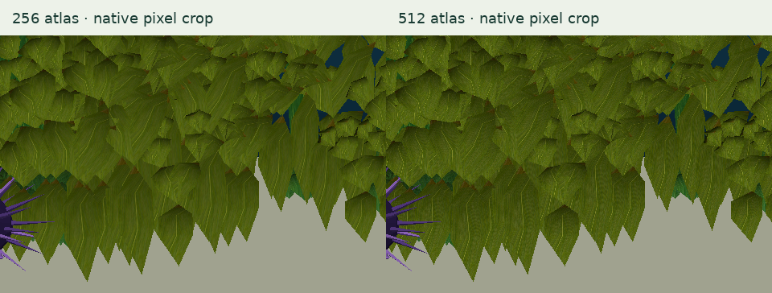

[Complete freshwater close views](2026-10-03-aquatic-plant-clumps-and-poster/runtime-evidence/texture-512-comparison/final/freshwater-close-idle-pair.png) · [Complete saltwater close views](2026-10-03-aquatic-plant-clumps-and-poster/runtime-evidence/texture-512-comparison/final/saltwater-close-idle-pair.png) · [Camera audit](2026-10-03-aquatic-plant-clumps-and-poster/runtime-evidence/texture-512-comparison/final/camera-audit.json) · [Freshwater audit contact sheet](2026-10-03-aquatic-plant-clumps-and-poster/runtime-evidence/texture-512-comparison/final/freshwater-camera-audit.png) · [Saltwater audit contact sheet](2026-10-03-aquatic-plant-clumps-and-poster/runtime-evidence/texture-512-comparison/final/saltwater-camera-audit.png) · [Measured values and deltas](2026-10-03-aquatic-plant-clumps-and-poster/runtime-evidence/texture-512-comparison/final/comparison.json) · [Completed restoration receipt](2026-10-03-aquatic-plant-clumps-and-poster/runtime-evidence/texture-512-comparison/final/receipt.json).

**Production remains 256 × 256**, as approved. The 512 variants are profiling/visual-review artifacts. Normal APK `79433b3c5e80625b13b4bf566e8fd941185affd62f779488ad30bab775f7c1d5` was restored and its installed hash verified; cleanup returned Home/prior foreground. No production texture, native code or shared coordinator deployment changed.

Reproduce the audited comparison from the repository root:

```bash
plant_512=docs/plans/2026-10-03-aquatic-plant-clumps-and-poster/runtime-evidence/texture-512-comparison
python3 scripts/summarise-plant-resolution-comparison.py "$plant_512/final" \
  --recipe "$plant_512/recipe.json" \
  --identities "$plant_512/identities.json" \
  --comparison-size 512 --matched-static
```

The helper verifies completion/restoration, frozen APK/native identities, the required VRAM flags, repeat counts, distinct camera views and CPU-window coverage. Original logs are preserved losslessly as gzip files; `matched-static` contains derived stationary inputs with corrected labels and settling intervals. `package-plant-resolution-comparison.py --sizes 256 512` rebuilds isolated variants from a frozen current APK while checking exact production 256 payload and unchanged source geometry. Saved recipes identify this completed session’s artifacts.

 [Frozen identities](2026-10-03-aquatic-plant-clumps-and-poster/runtime-evidence/texture-512-comparison/identities.json), [packed sizes](2026-10-03-aquatic-plant-clumps-and-poster/runtime-evidence/texture-512-comparison/pages.json), [recipe](2026-10-03-aquatic-plant-clumps-and-poster/runtime-evidence/texture-512-comparison/recipe.json).

## Completed atlas resolution comparison — keep 256

**PASS:** coordinator job `J-fde5d307fbae` completed all **16 traces**, restored the normal APK and verified its installed hash. It compares **256 × 256 versus 128 × 128** in both freshwater and saltwater. Each case has three release traces plus a separate CPU trace, using identical current native libraries, seed 713, mature age 150, paused growth and sway. Cameras, geometry and texture modulation remain unchanged. The 256 level control is byte-for-byte identical to production. The smaller atlas is a Lanczos downsample of the entire production atlas, preserving normalized UV layout; interiors become 36 × 56 with two-texel gutters.

| Atlas | Packed 16-bit pixels | Room TGA including header | Compiled planted level | Leaf interiors |
|---|---:|---:|---:|---|
| 256 × 256 | 128 KiB | 131,090 bytes | 196,608 bytes | 72 × 112 |
| 128 × 128 | 32 KiB | 32,786 bytes | 98,304 bytes | 36 × 56 |

The reduction saves **96 KiB / 75%** of texture-page payload and **96 KiB / 50%** of the compiled planted level. It does not change plant buffers, actors, topology or per-triangle texture submission. The modern GL renderer allocates fixed 256 × 256 room slots and uploads the whole slot through `PixelMap::Load`; loading a smaller page does not automatically shrink those slots. Process PSS snapshots are not an isolated GPU-memory measurement.

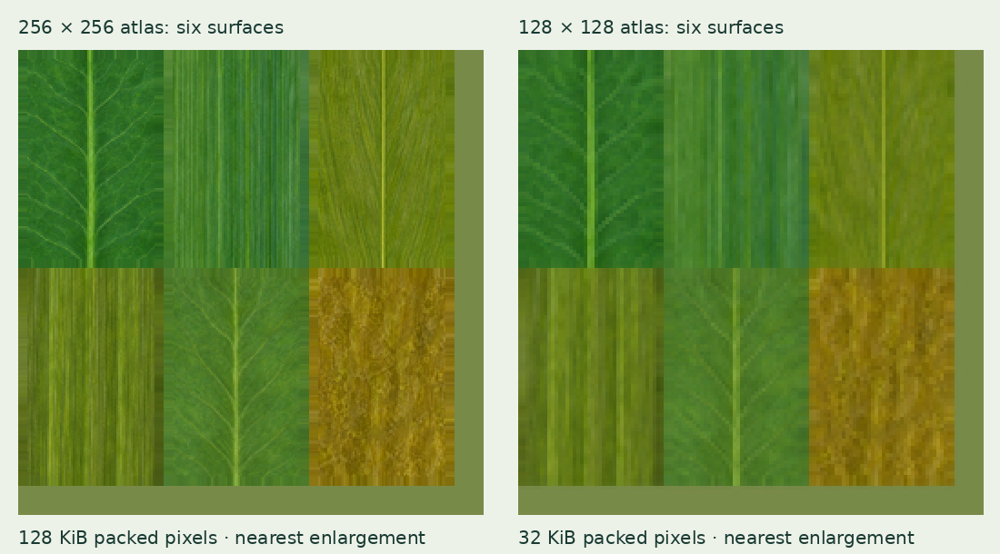

**Decision: keep 256 × 256**, confirmed by Will after reviewing the comparison findings. The large source artwork is an authoring reference, not the deployed map. The 128 variant remains a comparison artifact; production assets and native code are unchanged.

| Water / atlas | FPS (range) | p95 ms | Render CPU ms | Actor CPU ms | Deform CPU ms | PSS MiB |
|---|---:|---:|---:|---:|---:|---:|
| freshwater-256 | 14.66 (14.63–14.81) | 83.42 | 60.50 | 1.39 | 0.018 | 68.76 |
| freshwater-128 | 14.80 (14.70–14.80) | 83.42 | 60.64 | 1.34 | 0.018 | 72.45 |
| saltwater-256 | 16.49 (16.46–16.59) | 66.73 | 53.70 | 1.33 | 0.018 | 73.30 |
| saltwater-128 | 16.55 (16.47–16.56) | 66.73 | 53.53 | 1.33 | 0.018 | 72.47 |

| 128 versus 256 | FPS delta | Render CPU delta | Combined p95 delta | PSS snapshot delta |
|---|---:|---:|---:|---:|
| Freshwater | +0.14 / +0.97% | +0.14 ms / +0.23% | ≈0 ms | +3.68 MiB |
| Saltwater | +0.06 / +0.37% | −0.16 ms / −0.30% | ≈0 ms | −0.83 MiB |

The release FPS ranges overlap in both water types. There is **no useful measured performance gain** from halving resolution. CPU timings come from separate diagnostic runs, using 4–6 complete five-second windows inside timed segments; nested sections are not additive and are not GPU timings. Case blocks were sequential rather than randomized. All thermal snapshots report status 0; current core temperatures ranged from 47.1 to 52.7°C. PSS varies with Android accounting and allocation state, so these process snapshots do not establish texture-memory savings.

All CPU cases retain **38 level objects, 26 render actors and 25 engine draws**. Average submitted triangles remain approximately 27,055 freshwater and 23,827 saltwater; small differences reflect camera movement/culling and frame weighting. Source geometry and compiled mesh/level scripts were checked byte-for-byte. Native hashes match the frozen production APK in every variant.

| Camera | Fresh 256 FPS / p95 ms | Fresh 128 FPS / p95 ms | Salt 256 FPS / p95 ms | Salt 128 FPS / p95 ms |
|---|---:|---:|---:|---:|
| wide-idle | 14.94 / 66.73 | 15.01 / 66.73 | 16.92 / 66.73 | 16.97 / 66.73 |
| close-idle | 14.63 / 83.42 | 14.72 / 83.42 | 16.43 / 66.73 | 16.38 / 66.73 |
| crawl-close | 14.40 / 83.42 | 14.61 / 83.42 | 16.17 / 66.73 | 16.28 / 83.42 |

The combined p95 stays unchanged, but the saltwater 128 crawl segment has a worse median p95 (83.42 versus 66.73 ms). This reinforces the absence of a demonstrated pacing improvement; it does not establish a resolution-caused regression from this small sequential sample.

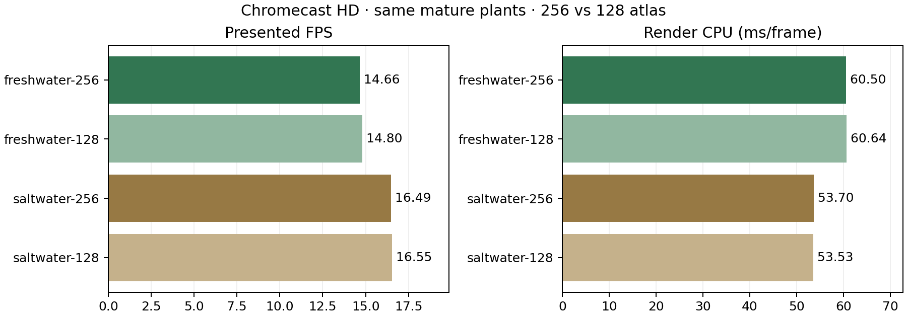

At whole-tank scale the two variants look very similar. Close-up native-pixel crops show softer freshwater veins and reduced saltwater surface grain at 128. The 256 atlas retains clearer leaf detail. Neither comparison capture introduces an obvious new tile-edge seam; this is a visual assessment of these cameras and seed, not an exhaustive filtering test. Each paired image uses the same crop coordinates and original screenshot pixels; click complete views to inspect their full size.

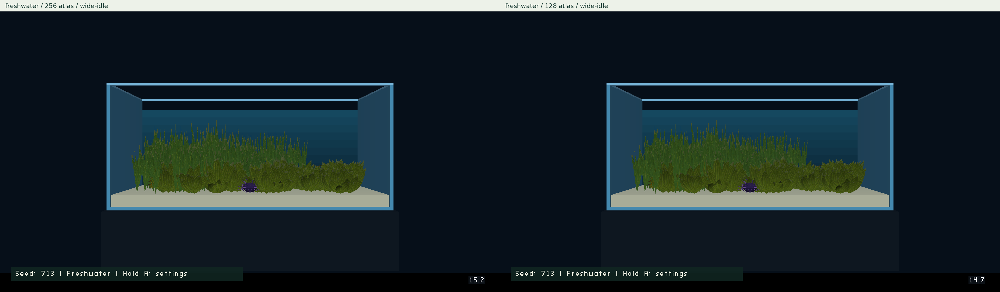

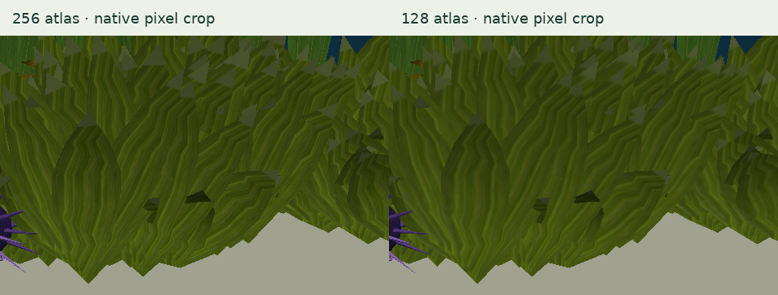

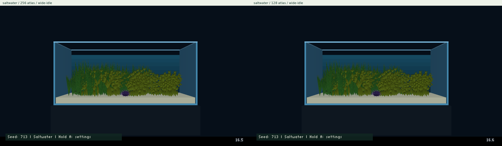

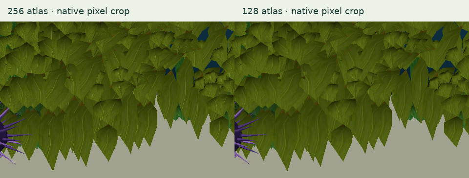

[Complete freshwater close views](2026-10-03-aquatic-plant-clumps-and-poster/runtime-evidence/texture-resolution-comparison/final/freshwater-close-idle-pair.png) · [Complete saltwater close views](2026-10-03-aquatic-plant-clumps-and-poster/runtime-evidence/texture-resolution-comparison/final/saltwater-close-idle-pair.png) · [Measured values and deltas](2026-10-03-aquatic-plant-clumps-and-poster/runtime-evidence/texture-resolution-comparison/final/comparison.json) · [Completion/restoration receipt](2026-10-03-aquatic-plant-clumps-and-poster/runtime-evidence/texture-resolution-comparison/final/receipt.json).

The verified restored normal APK is `79433b3c5e80625b13b4bf566e8fd941185affd62f779488ad30bab775f7c1d5`. Cleanup returns the prior foreground/Home rather than leaving the test scene running. The previous textured/shaded comparison still identifies texture-path CPU cost; atlas resolution does not remove that per-triangle work. Keep the current detail while investigating renderer submission/UV processing separately.

Reproduce the saved measurements from the repository root:

```bash
plant_resolution=docs/plans/2026-10-03-aquatic-plant-clumps-and-poster/runtime-evidence/texture-resolution-comparison
python3 scripts/summarise-plant-resolution-comparison.py "$plant_resolution/final" \
  --recipe "$plant_resolution/recipe.json" \
  --identities "$plant_resolution/identities.json"
```

`package-plant-resolution-comparison.py` generates isolated variants from a frozen current APK, verifies unchanged geometry/native libraries and an exact production 256 control, and records actual packed-page dimensions. Losslessly compressed engine, memory and thermal logs preserve the raw evidence. A new device comparison must freeze the then-current production APK; saved recipe paths identify this completed run.

 [Frozen APK identities](2026-10-03-aquatic-plant-clumps-and-poster/runtime-evidence/texture-resolution-comparison/identities.json), [page sizes](2026-10-03-aquatic-plant-clumps-and-poster/runtime-evidence/texture-resolution-comparison/pages.json), [recipe](2026-10-03-aquatic-plant-clumps-and-poster/runtime-evidence/texture-resolution-comparison/recipe.json).

## Completed current-build texture comparison

**PASS:** coordinator job `J-cfbb812fc1ff` completed all **20 traces** (three uninstrumented release repeats and one separate CPU trace for each of five cases). Every variant has the current normal APK's identical native libraries; the reference swaps only the archived planted-level asset into the current selector. Native identity checks passed before submission. Each trace uses a 30-second warmup, then 12 seconds each of wide idle, close idle and close crawl. No phone was connected. Timed analysis excludes screenshot gaps and warmup; do not pool these results with the older phone-connected traces.

| Case | FPS | p95 ms | Render CPU ms | Actors CPU ms | Growth/deform CPU ms | PSS MiB |
|---|---:|---:|---:|---:|---:|---:|
| old-static | 20.20 | 50.05 | 42.78 | 1.30 | 0.00 | 84.42 |
| freshwater-mature-static | 14.64 | 83.42 | 60.39 | 1.33 | 0.02 | 67.60 |
| freshwater-mature-static-shaded | 22.19 | 50.05 | 33.02 | 1.30 | 0.02 | 77.85 |
| saltwater-mature-static | 16.52 | 66.73 | 53.70 | 1.33 | 0.02 | 75.99 |
| saltwater-mature-static-shaded | 25.43 | 66.73 | 29.55 | 1.32 | 0.02 | 76.24 |

The freshwater texture pair loses **7.55 FPS (−34.0%)**, increases p95 interval by **33.37 ms (+66.7%)**, and adds **27.37 ms (+82.9%)** of render CPU. Saltwater loses **8.91 FPS (−35.0%)** and adds **24.14 ms (+81.7%)** of render CPU; its p95 interval remains approximately **66.73 ms** in both modes. Actor CPU changes by only **+0.030 ms** freshwater / **+0.006 ms** saltwater. Both retain 38 level objects, eight plant groups, about 25 engine draws, and identical paired geometry. Submitted triangle counts are after culling; authored geometry counts include the closed leaf backs.

The shaded runtime forms are faster than the archived static detailed reference: **+9.9% FPS** freshwater / **+25.9% FPS** saltwater. The textured forms are slower. The measured CPU increase makes the texture submission/render path the first optimization candidate; this does not isolate GPU time or identify one specific hot function. Keep leaf detail, density and coloured surface appearance when investigating bulk submission, UV work and material handling. These measurements do not justify reducing actors further as the first remedy.

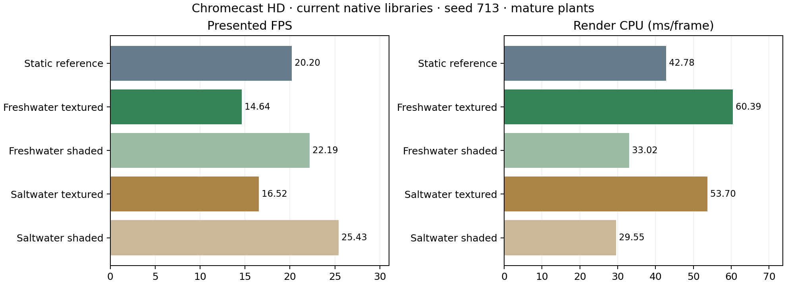

[Measured values, per-camera results and absolute/percentage deltas](2026-10-03-aquatic-plant-clumps-and-poster/runtime-evidence/coordinator-current-comparison/final/comparison.json). CPU timings use complete five-second thread-CPU windows inside timed segments; nested sections are not additive, and CPU repeats are diagnostic single runs. PSS values are process snapshots and vary with Android accounting/allocator state. Both textured/shaded controls retain the atlas and the same native buffers: their PSS differences are **not** texture-storage savings.

[Completion/restoration receipt](2026-10-03-aquatic-plant-clumps-and-poster/runtime-evidence/coordinator-current-comparison/final/receipt.json) records successful reinstall and installed-hash verification of normal APK `79433b3c5e80625b13b4bf566e8fd941185affd62f779488ad30bab775f7c1d5`, followed by verified cleanup. The earlier [normal planted-level capture/check](2026-10-03-aquatic-plant-clumps-and-poster/runtime-evidence/coordinator-normal-verified/receipt.json) passed with that same artifact. The repository includes analysed results, presentation samples, identities, receipts, representative captures and losslessly compressed engine/memory/thermal logs. Full screen captures also remain in coordinator evidence. Re-analysis of three CPU cases using only compressed logs reproduced all recorded values exactly.

This completes the **mature static texture comparison**, not the broader runtime matrix. Growth-versus-frozen, sway-versus-static, alternate-seed cost spread, speed-change pacing and same-process repeated-entry memory/entry latency remain separate pending checks. The historical direct phone/lifetime procedures are preserved as reference text under `docs/reference/device-harnesses/`; they need typed coordinator workflows before being run again.

### Reproduce the saved comparison without a device

From the repository root:

```bash
plant_evidence=docs/plans/2026-10-03-aquatic-plant-clumps-and-poster/runtime-evidence/coordinator-current-comparison
python3 scripts/summarise-coordinated-plant-textures.py "$plant_evidence/final" \
  --recipe "$plant_evidence/recipe.json" \
  --identities "$plant_evidence/identities.json"
```

This validates the completed receipt, APK identities, matching native libraries, repeat counts and CPU-window coverage before rebuilding the tables/charts. Compressed `wf.log.gz` and `meminfo.txt.gz` retain the original data. A new device run must package variants from the then-current frozen normal APK; only the planted-level asset is archived for the static reference. The saved recipes record this completed run's paths and hashes, not an automatic latest-build selection.

## Implemented runtime and verification status

The native generator creates a bounded, deterministic graph and mature rest geometry at entry: 16 founders expand to at most 384 shoots, rendered through eight mesh groups (38 level actors). Forth registers and ticks those groups; graph construction and vertex work are native. Daughter shoots inherit parent lineage and species-dependent spacing. Underground runners are represented in the graph, not rendered as extending rhizomes.

Growth time reveals geometry and smoothly scales blades from their rooted bases. Topology eligibility advances in half-second age buckets; dirty groups publish with round-robin scheduling, at most one group per frame. This is an authored growth approximation: individual leaf curling/unrolling and fully articulated whorl emergence are future refinements. Slow, coherent native sway follows growth deformation and keeps roots pinned. Rate changes preserve growth age; editing pauses the tank. Mature geometry stays bounded.

For tested seeds 0, 713 and 4,294,967,295, full unfurling occurs at about **117–144 growth seconds** (roughly two minutes at 1×). The last blade finishes around 14.6–18 seconds at 8×; device foliage captures verify accelerated growth, while the full high-speed performance comparison remains pending.

Android and desktop builds succeeded. **81 runtime, phone, asset, selector and species regressions passed**, plus **three compositor/translucency regressions**. The final Chromecast check verified remote grid/keypad/slider actions, phone draft reconnect/cancel/apply, fresh/salt regeneration, selector re-entry and Home/resume. [Final device receipt](2026-10-03-aquatic-plant-clumps-and-poster/runtime-evidence/textured-device/checks.json).

### Historical phone-connected measurements — incomplete matrix

These four archived cases use the earlier growing-plants native libraries, a connected phone, the same wide/close/crawl input trace and three uninstrumented release repeats. The old static asset is measured with the current native binary; earlier static-trial figures below are historical. FPS/p95 exclude warmup and screenshot gaps.

| Case | Release repeats | FPS | p95 frame interval | PSS MiB | FPS delta vs old static |
|---|---:|---:|---:|---:|---:|
| Old static detailed tank | 3 | 19.83 | 66.73 ms | 87.65 | — |
| Freshwater young, frozen | 3 | 40.57 | 33.37 ms | 59.73 | +104.6% |
| Freshwater spreading, frozen | 3 | 32.02 | 50.05 ms | 64.24 | +61.5% |
| Freshwater mature, frozen | 3 | 14.66 | 83.42 ms | 78.10 | −26.1% |

These older traces do **not** isolate texture cost and must not be pooled with the completed current-build comparison above. That newer comparison supersedes them for mature-static texture deltas. Growth/sway and seed-spread profiling remain pending. [Machine-readable results and deltas](2026-10-03-aquatic-plant-clumps-and-poster/runtime-evidence/profiles/comparison.json), [benchmark identities](2026-10-03-aquatic-plant-clumps-and-poster/runtime-evidence/profiles/identities.json).

### Current-version benchmark correction

Will identified the old version during job `J-55854e3f8c29`. Its variants used the older growing-plants native libraries, although its restore APK was current. The job was cancelled and normal-APK restoration/hash verification completed; [cancellation receipt](2026-10-03-aquatic-plant-clumps-and-poster/runtime-evidence/outdated-benchmark-cancelled/receipt.json). Do not use its partial traces as current-build measurements.

All variants were rebuilt from the frozen current normal APK. Native SHA-256 identities are checked against it before submission. The baseline packages the archived planted level inside the current eight-tank selector, keeping the other seven current payloads. [Corrected identities and method](2026-10-03-aquatic-plant-clumps-and-poster/runtime-evidence/coordinator-current-comparison/method.json), [corrected recipe](2026-10-03-aquatic-plant-clumps-and-poster/runtime-evidence/coordinator-current-comparison/recipe.json). Job `J-cfbb812fc1ff` completed the corrected comparison and verified normal-APK restoration. The normal scene check already passed: [verification receipt](2026-10-03-aquatic-plant-clumps-and-poster/runtime-evidence/coordinator-normal-verified/receipt.json).

### Device recovery and remaining checks

The earlier benchmark interruption left restoration unverified. On October 4, coordinator reconnect `J-75b1959ed0da` completed successfully. Normal Aquarium install/check job `J-d5a618ee0f01` installed the current main APK and verified its hash (`79433b3c5e80625b13b4bf566e8fd941185affd62f779488ad30bab775f7c1d5`), then timed out on `cat .../files/wf.log`. Cleanup succeeded and returned the TV home. [Receipt and command timeline](2026-10-03-aquatic-plant-clumps-and-poster/runtime-evidence/coordinator-restore/receipt.json). Installation passed; the scene/capture check did not.

The coordinator now uses a four-million-byte engine-log tail for scene confirmation and evidence, with a bounded logcat fallback. Its 40 coordinator regressions passed, including an oversized historical log retaining its recent scene marker. The initial install needed terminal sudo authentication. Will installed it; the protected source now contains the fix, and the subsequent normal planted-level check passed.

The [superseded benchmark recipe](2026-10-03-aquatic-plant-clumps-and-poster/runtime-evidence/coordinator-texture-comparison/recipe.json) originally compared older native libraries with old-static, freshwater mature textured/shaded and saltwater mature textured/shaded controls (three release runs and one CPU run each). All pairs are rerun through the coordinator with no phone connected. Treat this as a separate protocol from the earlier phone-connected traces. The recipe restores a frozen copy of the current main APK after measurement; [hashes and method](2026-10-03-aquatic-plant-clumps-and-poster/runtime-evidence/coordinator-texture-comparison/method.json). This initial recipe is superseded by the current-version correction above.

- [x] Implement runtime growth, sway, settings and textures; build Android/desktop.
- [x] Pass final remote/phone and fresh/salt colour checks on Chromecast.
- [x] Save the first four matched release cases and their raw traces.
- [x] Recover shared coordinator ownership/connectivity.
- [x] Restore the current normal APK and verify its installed hash.
- [x] Prepare and regression-test bounded log collection.
- [x] Install the protected coordinator update with terminal sudo authentication.
- [x] Pass normal planted-level scene/capture verification.
- [ ] Complete matched textured/shaded, growth/sway, saltwater, seed-spread and CPU measurements.
- [ ] Measure repeated-entry memory and entry-to-phone-ready latency in one process.
- [x] Restore and verify the normal APK after the completed mature-static texture benchmark.

The original frozen implementation APK remains in the growing-plants worktree with SHA-256 `eabc18940d8ab8ba7d62b71a05ab9607d8533d599d1153b4e64d291d5c751e2c`. Preserve that identity for its earlier receipts. The current main release is a newer artifact; the two hashes must not be conflated.

## Runtime implementation and profiling phases

**Measured reference:** the static dense trial is complete. Its matched Chromecast runs produced 39.87 FPS for the 57-plant baseline, 29.94 FPS for 384 plants with simple closed leaves, and 20.21 FPS for 384 detailed plants / 66,048 triangles. Render CPU time rose 3.70 → 18.16 → 42.88 ms while actor CPU stayed near 1.3 ms. These are render-path CPU measurements, not GPU timings. [Full comparison and receipts](2026-10-03-aquarium-dense-planted-tank.md), [machine-readable data](2026-10-03-aquarium-dense-planted-tank/performance.json).

| Phase | Implemented behavior | Verification / measurements |
|---|---|---|
| Seeded colonies | Native bounded lineage graph, 16 founders → 384 shoots; eight chunks and 38 level actors | Seed/bounds/lineage regressions and mature device captures passed; startup latency and alternate-seed cost spread pending |
| Botanical forms | Fresh rosettes/ribbons/whorls; salt ribbons/paddles/forked algae; leaf-local textured UVs | Both palettes and colour checks passed; additional geometry-budget comparisons pending |
| Visible growth | Rooted blade scaling and age-dependent topology; at most one dirty group published per frame | Growth and speed controls verified; frozen-versus-growing CPU/pacing and speed-change spikes pending |
| Gentle water | Native root-pinned coherent bending, independent of growth rate | Implemented and visually checked; static-versus-sway incremental cost pending |
| Seed / water / speed settings | Exact uint32 seed, TV grid/keypad, connected-phone panel, apply-on-back, cancel and reconnect draft | Remote/phone device checks passed, including selector return and Home/resume |
| Mature-static texture cost | Matching native libraries, geometry, cameras and trace; textured/shaded pairs | **Complete:** three release repeats plus one CPU trace per case; 34–35% FPS cost, actor CPU ≈1.3 ms |
| Atlas resolution / quality | 128 and 512 compared with matching 256 controls; all native libraries/geometry fixed | **Complete:** retain approved 256; 512 offers subtle close detail with memory/pacing cost, and is not adopted |
| Repeated entry | Level-owned render buffers released on exit; new seed on normal entry | Source ownership and re-entry functionality checked; same-process memory/latency stress measurement pending |

Next measurement work: add typed coordinator workflows for active-growth and repeated-entry phone assertions, then measure young/spreading/mature growth, static/sway pairs, seeds 0/713/MAX and settings speed changes. Keep layout, camera trace and native identity matched within each comparison. Every device session must restore and hash-verify the normal APK before releasing ownership. Renderer optimization is a separate implementation decision; the measured texture-path CPU cost is its starting evidence.

### Runtime ownership and bounded work

Use a few level-owned mesh groups (initially eight), never one actor per rooted shoot. Retain rest positions, per-vertex local base/height weights and per-group bounds. The existing static exporter and fish-deformation path are useful references; runtime plant mesh publication and material handling are implemented in the render-actor interface. Keep render buffers/material references alive until replacement is safe, clear them on level exit, and never mutate shared meshes belonging to other tanks.

Bound founders, daughter attempts, shoot count, branch depth, leaves and total vertices. Stop or divert crowded growth instead of running an unbounded rejection loop. Validate index bounds, winding, triangle area, tank/water bounds and rooted bases before publishing each changed group. Check the existing mesh/index limit and split groups before exceeding it. Keep the last valid group until a complete validated replacement is ready; reject invalid growth additions cleanly. Seeded failure must be reproducible; do not turn a generation failure into a black screen.

The current detailed level uses a 24 MB room pool and one room slot. Runtime graph storage, rest vertices, deformation weights and temporary construction buffers add peak memory; measure those explicitly and reuse scratch buffers where practical. Bound generation batches so loading and ongoing controls remain responsive. Preallocate bounded capacity where useful, and update only changed groups. Smooth growth of existing vertices should use native local growth weights/rest geometry; topology additions and sway share the same root/base ownership contract. Apply sway after growth deformation so young and mature plants both keep their roots fixed. Keep the whole-tank growth clock independent of render frame rate. Profile Forth policy, graph construction, leaf/branch meshing, upload/publication, actor updates, deformation and render work independently. Do not claim a loading-time target until device measurements exist.

| Phase | Layout / geometry | Motion | Required comparison |
|---|---|---|---|
| Archived sparse / dense simple / dense detailed | Fixed row-based assets | Static | Completed 39.87 / 29.94 / 20.21 FPS references |
| Seeded colonies | Fresh founders; frozen mature control | Static | Startup, memory and mature layout delta versus fixed assets |
| Revised botanical forms | Same chosen seeds; variable detail budgets | Static | Silhouettes/coverage plus layout, geometry and rendering deltas |
| Visible growth | Young → spreading → mature; fixed seed/time snapshots | Smooth unfurling plus topology additions | Frozen vs growing CPU/pacing and allocation spikes at each stage |
| Shared gentle water | Same growing colonies and meshes | Root-pinned sway | Incremental native deformation and pacing cost |
| Repeat selections | New seeds; released/recreated level buffers | Same | Variation, bounded generation, no memory growth or leaked resources |

Profile both freshwater and saltwater palettes, including their young/intermediate/mature stages; compare per-mode static/growing/sway deltas and cross-mode cost at matched coverage. For each steady-state phase, use three repeated release runs with identical native binaries, seeded layout, camera positions and input trace: wide idle, close idle and close crawl. Record presented FPS/p95 pacing, actor/director time, construction/deformation/render CPU, memory, triangles/groups and absolute/percentage deltas. Report startup costs separately so they cannot be hidden inside a steady-state average. For growing captures, also match water type, growth clock, node count and topology state; compare pauses at fixed young/intermediate/mature snapshots and active growth over the same interval. Use multiple seeds to report cost spread and worst observed composition, then replay the same seeds for comparisons.

Acceptance: freshwater/saltwater selection changes plant forms and growth rules on regeneration; bottom-left seed/type display and player-entered regeneration work on the remote; the same seed reproduces the growth sequence; each selection starts a different young ecosystem that visibly grows into a mostly-full tank; fixed-seed replay is reproducible; colonies have connected growth and irregular outlines; ribbon, rosette and whorled forms remain readable; tall foliage varies in height and age; roots remain fixed under slow coherent sway; the urchin has a usable local route; repeated level entry frees resources; and measured loading/rendering/motion costs are recorded. The A3 portrait PDF remains one page at 297 × 420 mm with its bottom-quarter pattern band and checked Forth examples.

## Poster bibliography

- **S1:** [NOAA: seagrass meadows and rhizomes](https://floridakeys.noaa.gov/plants/seagrass.html).
- **S2:** [Kew: Halophila ovalis morphology](https://powo.science.kew.org/taxon/urn:lsid:ipni.org:names:431761-1/general-information).
- **S3:** [University of Turku: Fucus tip growth and dichotomous branching](https://www.utupub.fi/server/api/core/bitstreams/39593dae-44c6-4535-85e2-d398204c85a7/content).
- **S4:** [Kew: Cryptocoryne cordata regional distribution](https://powo.science.kew.org/taxon/urn:lsid:ipni.org:names:86676-1); [Wong: runners and leaf morphology](https://www.aroid.org/gallery/wong/Araceae%20of%20Peat%20Swamp%20Forests%20-%20%5BBiodiversity%20of%20Tropical%20Peat%20Swamp%20Forests%20of%20Sarawak%2035-86%5D%20Wong%202016.pdf).
- **S5:** [Kew: Vallisneria spiralis in Thailand](https://powo.science.kew.org/taxon/431996-1); [Vallisneria spacer/branching experiment](https://www.sciencedirect.com/science/article/abs/pii/S0304377009000771).
- **S6:** [University of Florida: Limnophila leaf forms](https://plant-directory.ifas.ufl.edu/plant-directory/limnophila-sessiliflora/).
- **S7:** [Wild betta vegetation study](https://doi.org/10.1111/j.1095-8649.2001.tb02288.x); [USFWS tiger-barb distribution assessment](https://www.fws.gov/sites/default/files/documents/Ecological-Risk-Screening-Summary-Tiger-Barb.pdf).
- **S8:** [Rhizome branching across species](https://pure.knaw.nl/portal/en/publications/rhizome-elongation-and-seagrass-clonal-growth); [seaweed L-system modelling](https://doi.org/10.1016/0097-8493(93)90055-E).
- **S9:** [Flexible vegetation motion](https://doi.org/10.1016/j.coastaleng.2019.04.009).
