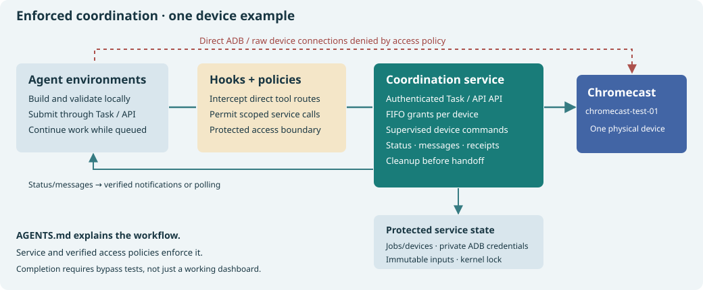
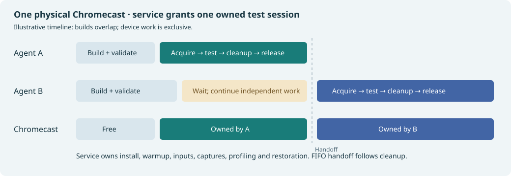
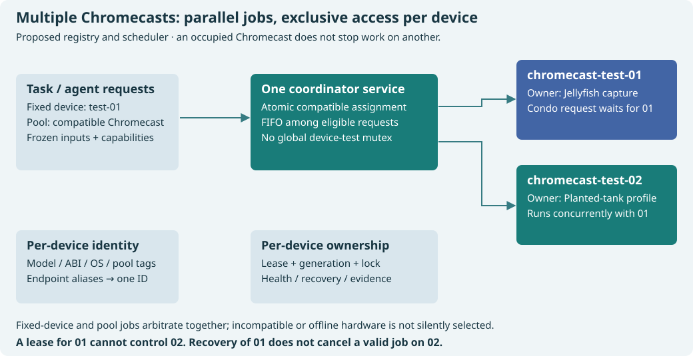
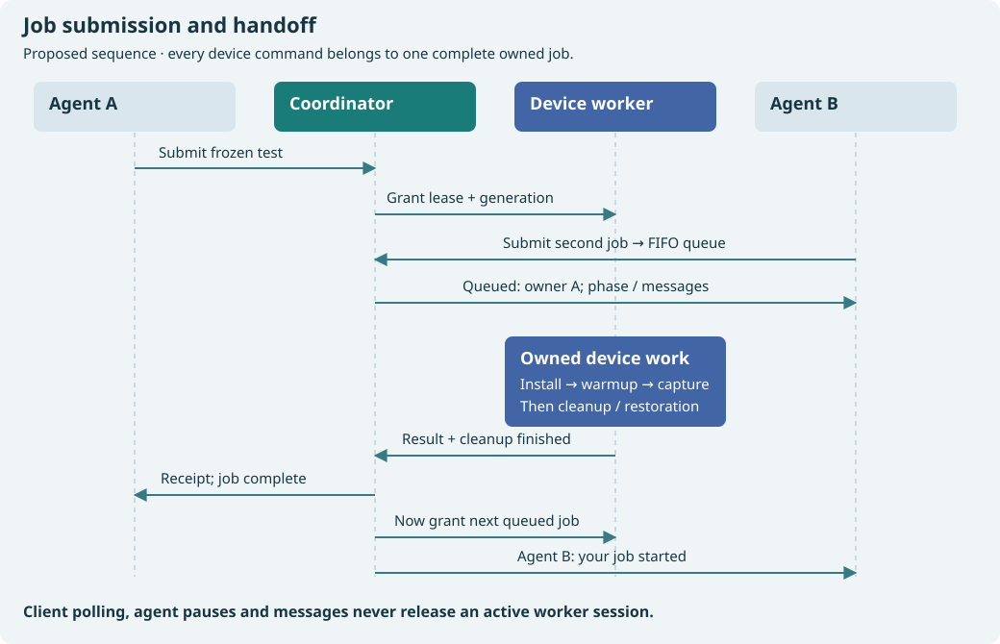
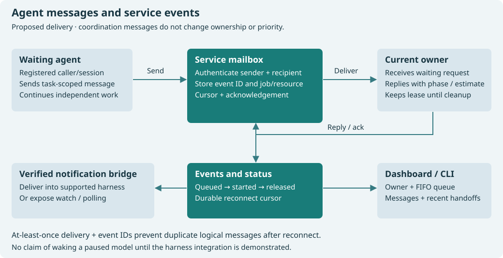
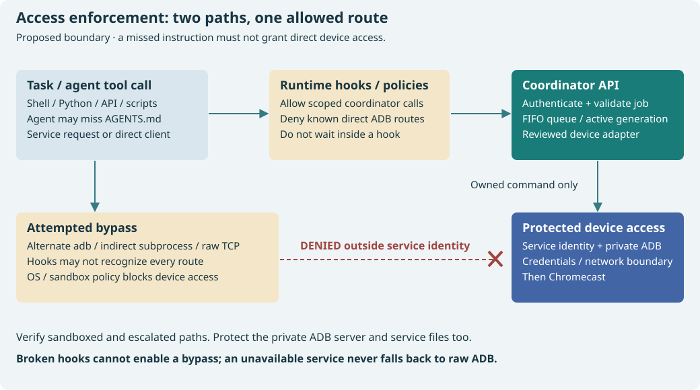
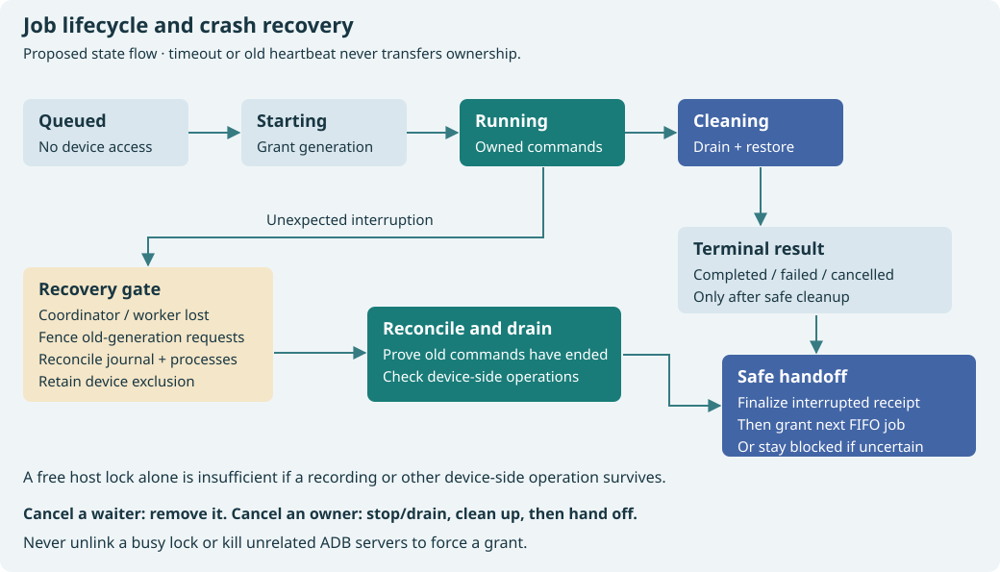

# Chromecast: enforced coordination service and standing authorization

**Date:** 2026-10-03. **Status:** Task/API service implemented and tested on both devices; protected service activated after repairing host crash-handler retention. Both devices are enrolled and ready; enforcement verification remains pending.

Will has dedicated Chromecast hardware to agent testing. Ordinary tests on registered test devices are already authorized. One shared service will coordinate any number of registered Chromecasts, serializing work per physical device while allowing different devices to run concurrently. It will publish status and relay coordination messages. Runtime hooks and access policies will direct every agent through that service, including agents that miss instructions in `AGENTS.md`.

> Will's standing instruction: “it's always a yes. this chromecast is setup for you guys to test things!” and “coordinate with other agents running and use some sort of semaphore between you all for this shared, single physical resource.”

**Revision after feedback:** the initial advisory-lock runner depended on cooperative adoption and postponed the broker. The service, hook integration, enforced access boundary and support for multiple Chromecasts now belong to the initial implementation. `AGENTS.md` documents the policy; it does not enforce ownership. Implementation is authorized. **2026-10-03 update:** implement the JSON API and Task client; omit MCP entirely.

- [x] Record standing authorization and inspect existing device runners.
- [x] Revise the design around a service, runtime policies, status and agent messaging.
- [x] Define queueing, whole-session ownership, crash recovery and bypass tests.
- [x] Provide architecture/sharing diagrams and an illustrative multi-device dashboard.
- [x] Specify per-device ownership, capability-aware pool selection and independent recovery.
- [x] Make `task chromecast:…` the primary interface and plan consolidation/retirement of legacy entry points.
- [x] Verify and record existing Chromecast connectivity, including the re-add/reconnect flow after power-off.
- [x] Provide sample output for all twelve proposed Task targets.
- [x] Include the second Chromecast in the planned inventory, with verified protected-service connectivity and enrollment.
- [x] Implement the service and Task/API interfaces; omit MCP.
- [x] Verify per-device queueing, parallel devices, cancellation, recovery and messaging in process tests.
- [x] Run real-device checks concurrently on both Chromecasts, plus a short profile and recording.
- [ ] Provision hooks and enforce exclusive service access to Chromecast.
- [ ] Migrate runners and prove coordination and bypass prevention.


## Implementation and validation record

The implementation is described in [the coordinator guide](../device-coordinator.md), with source in [scripts/wf_device](../../scripts/wf_device) and administrative provisioning in [the installer](../../scripts/install-device-coordinator.py). The JSON API, twelve Task commands, durable SQLite queue/events/messages, per-device locks, immutable APK upload, evidence streaming and read-only dashboard are implemented. No MCP adapter is included.

Development checks ran on both registered physical devices. Jobs `J-14130e2a5d4a` (device 01) and `J-42db239a1a07` (device 02) completed concurrently using the same frozen Aquarium APK. Both captured screenshots, logs, memory/thermal state and restoration receipts. Short profiling on device 02 (`J-8aea2aeba530`) and recording on device 01 (`J-45714b705f21`) also completed. [Validation summary](2026-10-03-chromecast-shared-device-coordination/validation-summary.json) records the parallel intervals and input checksum. These runs validate workflow behavior in the development deployment; they do not certify the protected deployment. The development service was stopped before production setup.

The first protected installation copied files but `systemctl daemon-reload` failed with a connection timeout. A later read-only probe found the system bus responsive, but a second install timed out too. Host logs show the first reload completed after **594585 ms (9 minutes 55 seconds)**, and the subsequent reload continued after its client timed out. The slowdown was traced to 48,863 retained failed Apport/DrKonqi crash-handler instances. A targeted reset and `CollectMode=inactive-or-failed` overrides reduced BPF descriptors from 97,748 to 22 and reload time to 7.158 seconds. The retention problem is repaired; protected coordinator activation subsequently completed on 2026-10-04. A read-only root diagnostic helper collects descriptor categories, CPU samples and kernel stacks. `--resume-activation` verifies current loaded units and avoids another reload; enabling units also uses `--no-reload`. The installer now checks the service manager before mutations, bounds administrative calls, reports partial activation without a traceback, and permits rerunning after the manager recovers. It checks service activity and socket readiness before printing success. It preserves existing queue state, credentials and unrelated Codex policy settings.

Remaining acceptance work: verify hook behavior in this runtime; close and test direct-address/container routes and DHCP/temporary-IPv6 gaps; migrate unique feeding, growth/settings and species assertions. Some legacy harnesses already delegate to typed jobs; the remaining specialized harnesses must not be described as migrated or replaced by generic captures. Administrative setup and incomplete enforcement are distinct from standing authorization for ordinary Chromecast tests.

## Intended experience

An agent builds and validates locally, freezes its APK and test inputs, and submits a typed test job. An agent selects a specific device or a compatible device pool. The service starts its job on an eligible free Chromecast; otherwise it queues it and reports relevant owners. Busy device A does not block a runnable job on free device B. The agent continues independent work and receives updates when its job starts and completes. No conversational request to Will is needed for an install, app switch, capture, profile or ordinary lifecycle check.

The service owns the entire install → launch → select tank → warmup → input → measurement → evidence → cleanup/restoration interval. A second agent cannot change the device during that interval. After handoff, its test may change the foreground app; receipts describe what was captured during ownership, not an indefinitely reserved TV screen.





## Three enforcement layers

| Layer | Responsibility | Limit |
|---|---|---|
| Agent instructions | Explain standing authorization, submission commands and expected behavior | Can be missed; never grants ownership |
| Runtime hooks and policies | Intercept supported tool calls, block direct ADB routes, approve the narrow service interface, inject status/messages | Tool coverage and hook failure behavior must be verified; command matching cannot catch every indirect client |
| OS/sandbox boundary and service | Only the service can reach the Chromecast's ADB connection and credentials; service workers execute one owned session per physical device, with independent devices running concurrently | Must apply to every participating execution environment; no hard-enforcement claim until bypass tests pass |

The intended protection is against missed instructions and accidental conflicting tests, rather than against Will using the physical remote or a host administrator overriding the configuration. Human/external changes during a measurement invalidate the affected run instead of becoming another agent's ownership grant.

Agents currently share a user account. Changing executable permissions, hiding an `adb` binary, setting an environment variable, or moving a lock file does not establish a reliable boundary between those agents and a same-user service. A separate service identity plus applicable network/filesystem restrictions is the proposed boundary. The implementation must verify what the actual host and agent platform can enforce.

## Service architecture

Use one small local service, provisionally `wf-device-coordinator`, with `task chromecast:…` as the primary interface, backed by a thin client speaking to one authenticated JSON API. A user-owned dashboard may display its read-only status. Redis and a general message platform are unnecessary for the single-host deployment.

| Component | Proposed responsibility |
|---|---|
| Coordinator service | Per-device FIFO scheduling plus compatible-pool requests, ownership, cancellation, events, messages and receipts |
| Service account / protected configuration | Own device credentials, private ADB server, reviewed job adapters and immutable job inputs |
| Device registry | One entry per physical Chromecast: stable ID, verified hardware identity, model/ABI/OS, pool tags, endpoint discovery and allowed actions |
| Local transport | Authenticated Unix-domain socket; Task targets and other API clients share the same protocol and authority |
| Primary interface | Documented `task chromecast:…` targets for device/status, submit/check/profile, watch, evidence and messages |
| Persistent store | SQLite job/event/message records in service-owned state; restart-safe state transitions |
| Runtime locks | Service-instance singleton lock plus one stable per-device kernel lock as defense against duplicate workers |
| Job workers | Reviewed typed workflows, supervised process groups, bounded commands and cleanup |
| Agent adapters | Registration, submission, status, evidence retrieval and message/event delivery |
| Dashboard | Current owner, phase, queue, recent handoffs, build identity and coordination messages |

Service executable, configuration and adapters must not be writable by normal agent jobs. Client-supplied repository paths do not become executable server code. APKs and other inputs are copied/uploaded into an immutable, hashed job spool; caller output paths are handled by the client downloading evidence, not by an unrestricted service filesystem-write API.

A logical device ID is stable across applications, DHCP changes, mDNS suffixes and ADB endpoint aliases. Verify physical identity before commands and use explicit device selection on every ADB operation. An ambiguous or mismatching target is a connection error. All demo packages targeting the same Chromecast share its resource; another physical Chromecast has a different resource.

A second control host must use the same coordinator before it is admitted. Multiple physical Chromecasts have independent owned jobs from the initial implementation. Neither a lock inside each worktree nor separate services on separate hosts provide shared ownership of this Chromecast.

## Chromecast inventory: verified host connectivity

Both devices have authorized connections to the current host. The protected service is active and both devices have authorized its separate ADB identity. Device 01 was observed **2026-10-03 20:25:06 +07 / 13:25:06 UTC**; device 02's ADB properties were verified **2026-10-03 20:46:35 +07 / 13:46:35 UTC**. Endpoints are observations, not permanent addresses.

| Connection / identity field | Chromecast 01 | Chromecast 02 |
|---|---|---|
| Proposed registry ID | `chromecast-test-01` | `chromecast-test-02` |
| Friendly name | Not recorded | `Project Room` |
| Hardware serial (`ro.serialno`) | `2628105GN0GT7C` | `26031HFDD67QH7` |
| Model / device | `Chromecast_HD` / `boreal` | `Chromecast` / `sabrina` |
| Product | `boreal` | `sabrina_prod_stable` |
| Android version | 14 | 12 (SDK 31) |
| Supported ABIs | `armeabi-v7a,armeabi` (32-bit) | `armeabi-v7a,armeabi` (32-bit) |
| Current host ADB state | `device` — authorized | `device` — authorized by Will on TV |
| Transport | Native wireless debugging / TLS | Legacy TCP/IP ADB |
| Observed connection endpoint | `192.168.4.43:41277` | `192.168.4.46:5555` |
| Observed LAN address | `192.168.4.43/22` on `wlan0` | `192.168.4.46` |
| ADB selector | `adb-2628105GN0GT7C-wwfiSB._adb-tls-connect._tcp` | `192.168.4.46:5555` |
| Advertised mDNS service | `adb-2628105GN0GT7C-wwfiSB`, `_adb-tls-connect._tcp` | No ADB mDNS service observed |
| Debugging setup | `adb_wifi_enabled = 1` | USB debugging enabled by Will; no native wireless-debugging menu |
| Pairing / authorization | Current host already authorized; no pairing endpoint/code recorded | TV authorization prompt accepted; no pairing code used |
| Protected service enrollment | Pending implementation | Pending implementation |
| Proposed pool | `chromecast-test`, after service enrollment | `chromecast-test`, after service enrollment |
| Connectivity evidence | [Device 01 snapshot](2026-10-03-chromecast-shared-device-coordination/existing-chromecast-connectivity.json) | [Device 02 snapshot](2026-10-03-chromecast-shared-device-coordination/second-chromecast-connectivity.json) |

Shared host tools: `/home/will/android-sdk-local/platform-tools/adb`, ADB `1.0.41`, platform-tools `37.0.1-15733141`. No private keys or pairing codes are stored in this plan.

The hardware serial is the expected stable identity. IP, TLS connect port, mDNS suffix and host transport ID can change after a power cycle or reconnect. Rediscover `_adb-tls-connect._tcp`, reconnect if required, then verify `ro.serialno` before device work. Do not pin the observed port, assume TCP 5555, or confuse the pairing port with the connection port. An ambiguous or mismatching serial blocks enrollment/control of that endpoint.

The current host's authorization does not prove that a newly provisioned service account has its own paired credentials. Establish the broker's protected ADB identity during rollout, then verify it can reconnect without copying keys into agent-readable files. Pairing codes and private keys are not stored in the plan or event log.

Existing `task find-chromecast` only discovers a LAN address; it does not restore disabled wireless debugging, pair ADB, or provide ownership. Historical controller URLs on port 8765 and older LAN addresses in game reports are not current ADB connection endpoints. Migrated discovery must return registered physical identities, not the first device whose model contains “Chromecast.”

### Re-add / reconnect after power-off

The proposed primary command is:

```sh
task chromecast:readd DEVICE=chromecast-test-01
```

This Task target is implemented; the protected service must be activated before use. It submits a service-owned connectivity maintenance job for the existing registry entry. It does not delete/recreate the entry, change the logical ID, discard queued work, or restart the shared ADB server.

The job resolves the current endpoint from registered-device discovery, checks whether the service's pairing is still usable, connects and re-verifies hardware identity. Where debugging is enabled and credentials still work, this completes automatically under standing authorization. If connectivity is lost during an active owned test, that owner's reconnect phase retains the same lease; an unrelated re-add request cannot interrupt it. Maintenance on device A never takes device B's test lease.

Will reports that wireless debugging settings can be lost when this Chromecast is powered off. If debugging is disabled, the service cannot repair it through the disabled ADB channel. Return a clear `needs-local-setup` state with the step to enable wireless debugging on the TV. If host pairing was lost, show how to open the TV's pairing screen, obtain its current pairing endpoint and enter the fresh code through a secure interactive/service prompt. Keep the code out of Task variables, shell history and persistent logs. This is required device setup information, not a request for permission to test.

After setup, rerun the same `task chromecast:readd` command (or resume its setup request), pair/connect through the protected service, verify the serial and update last-seen connectivity. Never guess a stale pairing code/port. Do not silently enroll another Chromecast that happens to be reachable.

Model connectivity maintenance separately from test grants: a registered offline device may accept a re-add job without falsely reporting itself ready for tests. An old worker/device-side operation must still be reconciled before any new ownership grant. Queued tests remain attached to their declared device/pool and resume only after the device becomes verified ready. Expose progress and outstanding local-setup requirements through `task chromecast:status`, queue watch and the dashboard.

## Second Chromecast: setup findings and remaining validation

Include **`chromecast-test-02`** in the planned test-device inventory. Will requested adding the second Chromecast on 2026-10-03. Its host ADB connection and distinct hardware identity have now been verified independently of `chromecast-test-01`. Enrollment in the future protected service is still required before service-scheduled jobs.

Read-only checks at **2026-10-03 20:37:45 +07 / 13:37:45 UTC** confirmed reachable Cast HTTP endpoints, friendly name `Project Room`, Cast revision `3.72.446070` and Cast UDN `5e305387-266b-84a6-639e-50805d1f06c2`. [Second-device connectivity snapshot](2026-10-03-chromecast-shared-device-coordination/second-chromecast-connectivity.json). These initially established reachable Cast endpoints. Subsequent targeted ADB queries at **2026-10-03 20:46:35 +07 / 13:46:35 UTC**, after Will enabled USB debugging and accepted host authorization, verified the serial, model, Android version and ABIs listed above. No installation or app switching was performed. Application behavior and coordinator ownership have not yet been tested.

1. Will confirms Project Room has Google TV menus and Developer options. Record Android version and hardware capabilities through ADB before declaring workflow compatibility; the generic Cast model string does not establish them.
2. Device 02 runs **Android TV OS 12**, as reported by Will from Settings. Use the legacy USB/TCP-IP debugging setup rather than requiring the Android 13+ TV wireless-pairing menu. Will does not see a wireless-debugging option on device 02; the diagnostic settings “Wireless display certification” and “Enable Wi-Fi verbose logging” do not enable ADB. Check for **USB debugging** under Developer options. A targeted check of `192.168.4.46:5555` returned connection refused before this setup. Will subsequently enabled USB debugging; `adb connect 192.168.4.46:5555` then reached ADB but reported authentication failure. Accept this host on the TV authorization prompt, selecting **Always allow from this computer**, then retry the same targeted connection. **Completed:** Will authorized the prompt and `adb devices -l` now shows device 02 as `device`. Enable USB debugging, then retry a targeted legacy ADB connection if the device exposes one; do not assume all models do. If it still refuses, use a data-capable USB connection to authorize ADB and enable TCP/IP explicitly, following the [official Android TV debugging instructions](https://developers.google.com/cast/docs/android_tv_receiver/debugging). Native wireless pairing is supported for TV from Android 13, per the [official ADB documentation](https://developer.android.com/tools/adb). For devices exposing it, enable wireless debugging on the TV. Inspect its current connect endpoint and, if required, open **Pair device with pairing code**. Pair via an interactive ADB prompt; never put a pairing code in Task variables, documentation or persistent logs. Follow the [official ADB wireless-debugging setup](https://developer.android.com/tools/adb#connect-to-a-device-over-wi-fi).
3. **Completed for the current host:** connected using `192.168.4.46:5555` and read the targeted properties below. Reverify after reconnection during service enrollment. Select device 02 explicitly for all subsequent commands; do not use untargeted ADB with two devices present. Verify `ro.serialno`, `ro.product.model`, `ro.product.device`, `ro.build.version.release`, `ro.build.version.sdk` and `ro.product.cpu.abilist` with targeted read-only `getprop` queries. Record the observation time, current endpoint and distinct physical serial in the snapshot/table.
4. Once the protected coordinator is activated, establish its own protected pairing, enroll the verified device, and run `task chromecast:check DEVICE=chromecast-test-02 APP=condo APK=/absolute/path/frozen.apk`. Record launch/lifecycle assertions and evidence, then profile/record as needed. These Task commands are implemented and the protected service is active.
5. Run one job on each physical device concurrently. Verify no same-device overlap, correct evidence identities, independent cancellation/reconnect and no interruption of device 01. Only then mark physical two-device validation complete.

During implementation, use the reported address `192.168.4.46` as an initial discovery hint, discover/select its current debugging endpoint, securely pair if needed, read and confirm its physical serial and capabilities, and persist the association with this logical ID. The IP alone is not an ADB endpoint: discover the current TLS connection port for native wireless debugging, or verify an explicitly enabled legacy TCP/IP endpoint. Store the transport type per device; do not assume port 5555 or require TLS/mDNS on a legacy device. After verification, reconnect by stable hardware identity even if DHCP changes its address. If discovery is ambiguous, require identification of the intended device rather than taking the first reachable Chromecast. Keep a pending inventory entry distinct from an enrolled-but-offline device. Pool scheduling excludes pending entries and evaluates each device's verified capabilities separately.

After enrollment, reconnect it with `task chromecast:readd DEVICE=chromecast-test-02`. Adding device 02 must not restart device 01's ADB session, change its lease or interrupt an active capture. Run two physical jobs concurrently and verify separate receipts, independent cancellation and recovery. The diagrams and completed-enrollment command examples show the intended two-device behavior, rather than evidence that coordinator scheduling is installed today; both physical devices are now reachable through the current host's ADB.

## Multiple Chromecasts and device pools

Maintain a registry of designated test hardware, initially including the enrolled `chromecast-test-01` and `chromecast-test-02`, with room for further entries. A friendly name, model, ABI, Android version, capability/pool tags and immutable verified hardware identity describe each device. Device 02 joins scheduling only after its identity, capabilities and service connection are verified. Never treat two endpoints for one physical device as two available devices, or a newly discovered unregistered device as test hardware.

An explicit `device_id` pins a job to that Chromecast. A `pool` request selects any registered device satisfying declared requirements, such as supported APK ABI, model class and Android version. Reject selectors with no compatible registered devices; distinguish that from compatible devices temporarily being busy/offline. Once granted, the physical identity is fixed for the job, all variants, evidence and restoration. Reconnection resolves a new endpoint for that same device; switching to another device requires a new job and separate receipt.

The scheduler chooses the oldest accepted eligible request for each available device. Fixed-device and pool requests participate in the same arbitration, so a newer fixed request cannot skip an older compatible pool request. Device allocation and lease creation are one transaction; two workers cannot both claim the same free device. Waiting for busy A does not prevent an eligible request from starting on B. Queue positions for pool requests are conditional; show eligible devices and blocking owners rather than a misleading single global queue position.

Each device has its own active lease, fencing generation, kernel lock, worker group, health/recovery state, reservation and receipt stream. There is no global test mutex. Cancelling, disconnecting or recovering A leaves B's valid session alone; do not restart a shared ADB server to recover one endpoint. Messages may target one device, a pool, or all registered test devices, and always show which physical resource an owner message concerns.

For comparisons, pin baseline and changed variants to the same physical device and record its hardware/OS in every sample. Dashboard/status lists all devices with their owners, phases, compatible waiters and health; it can drill down into one device. Record concurrent jobs and shared host/network load in performance metadata rather than assuming measurements on different devices are directly comparable.



## Queue and ownership

A submission produces a durable `job_id`. Runnable jobs are scheduled in accepted eligible order per device, after input validation; an agent cannot repeatedly jump ahead by releasing and resubmitting. Cancelling a queued job removes it without affecting the owner. Requests for extra time are messages/status updates, not permission to preempt another test. Explicit administrative reservation may pause new grants.

Each active device job receives a unique `lease_id` and a monotonically increasing generation for that physical device. The service validates device ID, job/lease ID and generation together; a valid lease for A cannot issue commands on B. The service validates both on every device action, including nested adapters. A token in an environment variable alone is insufficient. Old-generation actions are rejected after cancellation or recovery. A client's `release` request cannot free a session with outstanding worker commands or cleanup.

Jobs transition through queued → starting → running → cleaning → completed/failed/cancelled. A lost or interrupted job enters recovery before another grant. State transitions and grants are serialized by the service; status JSON and dashboard data are views of that state, not authority.

| Receipt/status field | Meaning |
|---|---|
| Device, job, lease and generation | Resource and exact ownership interval |
| Agent/session and task, repository/worktree | Caller identity and purpose; unavailable IDs remain unknown |
| Service/worker process start identities and host boot ID | Restart/crash reconciliation without confusing reused PIDs |
| Submitted/acquired/heartbeat/released timestamps, phase | Explain progress and the measured handoff |
| Estimated duration and queue position | Planning information; estimates do not authorize stealing ownership |
| Resolved device identity, package and scene | Actual target and expected test state |
| Source/APK/input hashes, adapter version | Identify the frozen test, even while shared files change |
| Evidence location, interruptions, outcome | Reproducible result and why a run was invalidated |

Builds and captured-data analysis run outside the queue's critical section. Input validation should reject or report an invalid job before it blocks the device. Device discovery that changes an ADB connection runs under service control; host-only status does not touch the device.



## Agent communication and notifications

The service maintains a resource-scoped mailbox and event stream. Its initial purpose is device coordination: ownership, queue updates, duration changes, release/handoff, cancellation and recovery. It does not need to become a general replacement for every agent's messaging system.

| Operation | Proposed behavior |
|---|---|
| `agent.register` | Register a session through an authenticated adapter; bind its identity and delivery capability |
| `queue.list` | Show all/device/pool requests, eligible hardware, active owners and blocking reasons without touching devices |
| `device.list`, `device.status` / `events.watch` | List devices/capabilities and obtain per-device or pool owners, phases and queue state; stream/poll updates |
| `job.submit`, `job.status`, `job.cancel` | Submit a typed test, follow it or cancel the caller's work |
| `message.send` / `messages.poll` / `messages.ack` | Relay a message to the owner, a waiting job, or resource participants |
| `job.evidence` | Fetch captures, logs and the result receipt |

Messages carry sender, recipient/resource, job ID, timestamp, unique event ID and acknowledgement state. Authenticate senders and scope recipients; do not trust a freely supplied `agent_session` string. Use at-least-once delivery with event IDs for deduplication. Keep a bounded retention period and reconnect cursor. A message does not change a lease or grant a priority override.

Examples: “My profile is queued behind yours,” “Restoration will take another two minutes,” “Capture finished; cleanup is running,” and “Device released; your job has started.” Important events also appear in the dashboard. The service can start a queued, fully specified job even while its submitting agent is doing local work; results remain available if that agent disconnects.

Deliver messages through a verified agent-harness notification route when available. Otherwise expose polling/watch tools and inject unread status through supported lifecycle/tool hooks. Do not claim that a running model can be interrupted or awakened until that integration is demonstrated. Task-scoped subagent mailboxes alone do not establish communication between independent root sessions.



## Hooks and policies

Official OpenAI documentation supports `PreToolUse` interception/blocking/rewriting, `PermissionRequest` decisions, and lifecycle hooks. It also warns that specialized tool paths can opt out and some unsupported output shapes can let calls continue. Hooks are a guardrail, not a complete device access boundary. [Hooks reference](https://learn.chatgpt.com/docs/hooks). Execution rules can deny matching command prefixes, but do not inspect arbitrary code inside every script. [Rules reference](https://learn.chatgpt.com/docs/agent-configuration/rules).

Before configuration, inspect the installed runtime/version and its supported hooks, trust model, managed policy mechanism and permission profiles. Documentation availability alone does not prove this active session has hooks enabled.

| Hook/policy | Intended action |
|---|---|
| Session start/resume | Register the session, expose service availability and standing authorization |
| Before supported tools | Detect direct device control, deny it with the service alternative, and validate service requests |
| Permission request | Automatically permit only configured routine service actions within Will's standing authorization; do not automatically approve arbitrary shell/Python |
| After tools | Attach job IDs/results and deliver bounded unread coordination events |
| Session end/interrupt | Inform the service; apply the declared detach/cancel policy, while the service supervises cleanup |
| Managed execution/network policies | Close legacy direct ADB routes and agent access to service credentials, private ADB server and Chromecast control endpoints |

Hooks return quickly. They submit/query jobs or reject a direct call; they do not hold a pre-tool hook open throughout a lengthy test or wait queue. Use documented denial output and validate timeout/error behavior on this runtime. Service unavailability must never cause a fallback to raw ADB.

A shell hook may recognize obvious `adb` calls and known scripts, but aliases, alternate binaries, Python subprocesses and clients speaking the ADB protocol evade simple string checks. The access boundary must deny those routes as well. A service API check remains authoritative regardless of which supported tool calls it.

Replace applicable previously approved broad direct-ADB routes with the narrow coordinator route during rollout. Preserve unrelated phone/device workflows. Do not approve a broker command that executes arbitrary host code or raw shell text. Initial host/policy provisioning may require a specific administrative/platform approval; that is separate from recurring permission to test Chromecast.

## Enforced device access boundary

Provision a separate service identity with private ADB access and authorized credentials for each registered Chromecast. Agents can reach the coordinator interface but cannot read its credentials, connect to its ADB server, directly open any registered Chromecast's debugging/control endpoints, or modify service code/policy. Discovery/reconnect is performed by the service. Preserve any unrelated ADB devices and host networking.

Use the host's supported service isolation and the agent platform's managed filesystem/network/command policies. Inventory all sandboxed and escalated execution paths first. Restrictions that apply only inside the sandbox while an approved host command bypasses them do not satisfy the goal. Test direct device-address connections and alternate SDK/client paths, not only the default `adb` executable.

If available platform controls cannot establish this boundary, record the exact gap and keep the rollout incomplete. A hook-plus-instructions deployment may still reduce conflicts, but must not be labelled enforced coordination. Do not silently broaden agent privileges or disable the platform's approval system to achieve convenience.

The service itself validates allowed actions, target identity, caller/session, active generation and input schemas. Typed install, launch, input, capture, profile and lifecycle operations implement routine testing. Factory reset, account changes, unrelated data deletion and disabling security are outside the recorded standing authorization.



## Primary interface: `task chromecast:…`

Use Task as the normal interface for Will and agents. Installation, tests, profiles, screenshots/recording, status and messages must be discoverable through `task --list` and documented examples. The client executable is an implementation detail; Other clients may use the same typed JSON API directly. Do not implement an MCP adapter. All clients share one queue and permission policy.

Implemented targets and illustrative output follow; protected activation is complete:

```sh
task chromecast:devices
task chromecast:readd DEVICE=chromecast-test-01
task chromecast:queue
task chromecast:queue DEVICE=chromecast-test-01
task chromecast:queue POOL=chromecast-test WATCH=true
task chromecast:status DEVICE=chromecast-test-01
task chromecast:submit DEVICE=chromecast-test-01 WORKFLOW=profile \
  APP=aquarium SCENE=jellyfish APK=/absolute/path/frozen.apk \
  WARMUP=15 RUNS=1
task chromecast:check POOL=chromecast-test REQUIRE_ABI=armeabi-v7a \
  APP=condo APK=/absolute/path/frozen.apk
task chromecast:watch JOB=JOB_ID
task chromecast:evidence JOB=JOB_ID OUT=/absolute/path/evidence
task chromecast:message JOB=JOB_ID TEXT='My capture is queued behind yours.'
task chromecast:cancel JOB=JOB_ID
```

`submit` returns a job ID promptly. `check`, `profile` and `record` are convenience targets that create typed jobs and optionally follow their results; they do not implement separate device-control loops. `readd` restores a registered device connection through a maintenance job, `devices` lists hardware/capabilities, `queue` lists accepted waiting requests plus active owners, and `status` gives device/job details. Queue/status can filter by device or pool; `WATCH=true` follows service events. A scenario/recipe identifies behavior by stable scene name or manifest identity instead of duplicating tank indices in numerous shell scripts.

Taskfiles contain thin service-client calls and local preparation steps. Validate variables and forward them as structured arguments or a request object, with tested quoting for paths/text and explicit rejection of unknown options. Do not interpolate caller text into arbitrary shell commands, use `eval`, or give the service the contents of an unreviewed Taskfile to execute. Build/freeze inputs before submission; generic build targets continue outside device ownership.

A Task target name is not an authorization boundary: an agent-writable Taskfile can redefine a command. Task runs in its ordinary agent environment, while the protected service authenticates and validates every device operation. Do not grant blanket privileged approval to `task`, shell, or Python. Hooks guide the agent to the relevant Task command; the narrow service route and access boundary enforce it.

Existing `task chromecast-aquarium`, `task chromecast-condo` and applicable release-run targets may be short-lived compatibility aliases to the same service-backed targets. If retained, print their replacement command and remove their direct ADB paths immediately. `task find-chromecast` must use registered multi-device discovery rather than selecting the first matching LAN host. Adopt one documented interface, not an expanding family of script-specific targets.

Submission chooses continue-on-client-disconnect or cancel-on-disconnect explicitly. Closing `watch` or yielding a tool call never frees ownership. Complete queued jobs may run while an agent does independent work; evidence is retrieved with `task chromecast:evidence`. Cancellation stops the caller's job and lets the service finish cleanup before handoff.

## Task command catalog and sample output

**All outputs below are illustrative interface designs, not results from installed commands.** Job IDs, owners, timings and measurement values are examples. The inventory example shows both enrolled devices; job examples assume compatible hardware. Endpoints remain rediscovered rather than fixed by these examples.

### `task chromecast:devices`

```sh
task chromecast:devices
```

```text
Registry snapshot: revision 18
DEVICE             MODEL          STATE               POOL
chromecast-test-01 Chromecast_HD  ready               chromecast-test
chromecast-test-02 Chromecast     ready                chromecast-test
01: serial 2628105GN0GT7C; Android 14; ABI armeabi-v7a,armeabi
02: serial 26031HFDD67QH7; Android 12; ABI armeabi-v7a,armeabi
02: service ADB verified at 192.168.4.49:5555; enrolled
```

An enrolled device lists its verified capabilities and last-seen time even when offline. Pending enrollment never counts as spare test capacity.

### `task chromecast:readd`

```sh
task chromecast:readd DEVICE=chromecast-test-01
```

```text
Maintenance job M-001 accepted for chromecast-test-01
Discovering current wireless-debugging endpoint...
Connected; serial verified: 2628105GN0GT7C
Device ready. Registry ID and queued jobs preserved.
```

If local setup is required, report actionable state rather than asking for testing permission:

```text
M-001: needs-local-setup; chromecast-test-01 is not ready
Enable Wireless debugging in the TV's Developer options.
If pairing is required, open its pairing screen and use the secure prompt.
Retry: task chromecast:readd DEVICE=chromecast-test-01
Queued tests remain waiting. Other devices continue independently.
```

The same target works for enrolled device 02 with `DEVICE=chromecast-test-02`. A pending entry instead reports `pending-enrollment` and the missing identity/setup steps; readd must not silently bind an unverified device.

### `task chromecast:queue`

```sh
task chromecast:queue
```

```text
Snapshot 2026-10-03 21:00:00 +07; revision 42; connected
DEVICE             OWNER / JOB       PHASE        HEALTH
chromecast-test-01 jellyfish / J-100  capture      ready
chromecast-test-02 plants / J-101     measurement  ready

WAITING  SELECTOR            ELIGIBLE DEVICES  REASON
J-102    chromecast-test-01   01                J-100 owns 01
J-103    pool:chromecast-test 01,02             both devices busy
Pool position is conditional on device eligibility and release order.
```

```sh
task chromecast:queue DEVICE=chromecast-test-01
task chromecast:queue POOL=chromecast-test WATCH=true
```

The device filter shows J-100, J-102 and compatible pool job J-103. The pool watch starts with the snapshot above, then follows changes:

```text
revision 43: J-100 -> restoring on chromecast-test-01
revision 44: J-100 -> completed; 01 released
revision 45: J-102 -> running on chromecast-test-01
J-101 continues on 02; J-103 remains queued.
```

A disconnected watch labels the snapshot stale and resumes from its event cursor. Closing it does not cancel jobs.

### `task chromecast:status`

```sh
task chromecast:status DEVICE=chromecast-test-01
```

```text
chromecast-test-01: ready / owned
Hardware: Chromecast_HD; serial 2628105GN0GT7C; Android 14
Owner: jellyfish; job J-100; generation 7
Phase: capture; elapsed 00:40; expected remaining about 00:20
Waiting: J-102 (fixed device), J-103 (compatible pool request)
Snapshot revision 42; connected
```

Remaining time is an estimate, never permission to reclaim a lease.

### `task chromecast:submit`

```sh
task chromecast:submit DEVICE=chromecast-test-01 WORKFLOW=profile \
  APP=aquarium SCENE=jellyfish APK=/absolute/path/frozen.apk \
  WARMUP=15 RUNS=1
```

```text
Accepted: J-104; workflow profile; aquarium / jellyfish
Input: frozen.apk copied into immutable job storage; SHA-256 recorded
Selector: chromecast-test-01
State: queued; current owner J-100
Follow: task chromecast:watch JOB=J-104
```

Acceptance means durable submission, not successful execution. Return promptly after input validation and upload; expose rejection reasons without creating a runnable job.

### `task chromecast:check`

```sh
task chromecast:check POOL=chromecast-test REQUIRE_ABI=armeabi-v7a \
  APP=condo APK=/absolute/path/frozen.apk
```

```text
Accepted: J-105; compatible devices 01,02; following job
Granted: chromecast-test-02; generation 9
Install / launch: PASS
Foreground / scene / lifecycle assertions: PASS
Evidence collected; restoration verified; device released
J-105: completed / PASS
Retrieve: task chromecast:evidence JOB=J-105 OUT=/tmp/condo-check
```

Check, profile and record submit and follow by default; an explicit asynchronous option may return after acceptance. Workflow failures return a failing exit status after cleanup.

### `task chromecast:profile`

```sh
task chromecast:profile DEVICE=chromecast-test-02 APP=aquarium \
  SCENE=planted-tank APK=/absolute/path/frozen.apk WARMUP=15 RUNS=1
```

```text
Accepted: J-106; following job
Granted: chromecast-test-02; generation 10
Warmup: 15 seconds; measurement started
Run 1: 29.97 FPS; frame p50 33.37 ms; p95 33.37 ms
Raw timings and hardware/build metadata saved
Restoration verified; device released
J-106: completed
Retrieve: task chromecast:evidence JOB=J-106 OUT=/tmp/plant-profile
```

These measurements are synthetic examples. Real receipts include sample count, measurement window, method, verified device identity and concurrent-job metadata; unlike-device results are not automatically comparable.

### `task chromecast:record`

```sh
task chromecast:record DEVICE=chromecast-test-02 APP=aquarium \
  SCENE=jellyfish APK=/absolute/path/frozen.apk WARMUP=15 DURATION=10
```

```text
Accepted: J-107; following job
Granted: chromecast-test-02; generation 11
Warmup complete; recording 10 seconds
Video pulled and verified: capture.mp4
Restoration verified; device released
J-107: completed
Retrieve: task chromecast:evidence JOB=J-107 OUT=/tmp/jellyfish-video
```

Validate scene/timing arguments against the reviewed record workflow. Local video annotation can run after release.

### `task chromecast:watch`

```sh
task chromecast:watch JOB=J-104
```

```text
J-104: queued; waiting for chromecast-test-01
J-104: granted on chromecast-test-01; generation 8
J-104: installing -> launching -> warming-up -> measuring
J-104: collecting-evidence -> restoring
J-104: completed; device released; evidence available
```

A late watcher replays relevant persisted events and shows the final result. Ctrl-C detaches the watcher; cancelling is a separate operation.

### `task chromecast:evidence`

```sh
task chromecast:evidence JOB=J-104 OUT=/tmp/jellyfish-profile
```

```text
J-104: completed; downloading evidence
Verified checksums: receipt.json, timings.csv, screenshot.png, logcat.txt
Saved: /tmp/jellyfish-profile
Receipt includes device identity, input hash, generation and cleanup result.
```

The client writes the destination under its own filesystem permissions. Do not silently overwrite conflicting local files. Incomplete jobs report which artifacts are available and which remain pending.

### `task chromecast:message`

```sh
task chromecast:message JOB=J-100 TEXT='My capture is queued behind yours.'
```

```text
Message MSG-008 accepted; sender condo; recipient owner of J-100
Device: chromecast-test-01
Delivery: pending acknowledgement
```

Later event/watch or hook output:

```text
MSG-008: delivered; recipient acknowledged
```

Acceptance and delivery are distinct. The service derives sender identity from authentication; a message cannot extend ownership, change queue order or cancel a job.

### `task chromecast:cancel`

```sh
task chromecast:cancel JOB=J-104
```

Queued case:

```text
J-104: cancelled before grant; removed from waiting queue
No device session was started.
```

Active case (an alternative state for the same command):

```text
J-104: cancellation requested; stopping worker on chromecast-test-01
Cleanup / restoration in progress; lease retained
J-104: cancelled; cleanup verified; device released
Other devices and their jobs are unchanged.
```

If cleanup fails, show `recovery-required` and retain the device's recovery gate. Authenticate cancellation authority; never cancel a different owner's job merely because it is ahead in the queue.

Command output must distinguish accepted, queued, running, terminal, needs-local-setup and recovery-required states. Reads succeed when their snapshot is obtained; asynchronous submission succeeds on durable acceptance; following a job succeeds only on successful completion. Validation, authorization, transport and workflow failures return nonzero status with an actionable reason. Define and test exact exit codes and machine-readable schemas during implementation; do not infer success from a friendly progress line.

## Existing entry points: retain behavior, consolidate code

Do not mechanically wrap every existing script. Review its unique behavior, assertions, callers and historical purpose first, then choose a shared workflow, declarative recipe, reusable validator or retirement. Device access, setup, sampling and restoration should each have one shared implementation.

The inspected scripts below show overlapping ADB/install/launch/capture logic; the selector checker also hard-codes an old five-tank inventory. Proposed dispositions must be confirmed against current callers and tests before removal:

| Existing entry point | Proposed disposition | Behavior worth retaining |
|---|---|---|
| `scripts/android-device-run.sh` | Replace its device-control body with the common `check` workflow; retain a temporary compatibility shim only if callers need it | Multi-app install/launch, process/lifecycle checks and evidence contract |
| `scripts/profile-aquarium-chromecast.py` | Extract one shared `profile` workflow and independent result-analysis code; retire the standalone ADB harness | SurfaceFlinger polling, foreground/build checks, trace segments and raw receipts |
| `scripts/profile-planted-tank-device.py` | Replace with a declarative variant-benchmark recipe | Variant order, CPU/normal cases and verified restoration under one lease |
| `scripts/profile-betta-fins-device.py`, lionfish profile scripts | Merge generic packaging/build preparation and variant profiling; keep species settings as recipes | Comparable baseline/static/animated inputs and species-specific scene/trace requirements |
| `scripts/record-aquarium-school-chromecast.py` | Replace the standalone device loop with `record` plus a school-demo recipe | Input/recording timeline; preserve ffmpeg annotation as local postprocessing |
| `scripts/check-aquarium-selector-device.py` | Retire the obsolete fixed five-tank harness after manifest-driven selector checks replace its useful assertions | Selection-to-scene verification, crash detection and Home/Back lifecycle expectations |
| `scripts/check-menu-back-device.py` and species/control check scripts | Keep unique assertions in shared validator modules or reviewed scenario extensions; merge common device setup/navigation | Real behavior checks that generic capture alone cannot replace |
| Jellyfish poster `capture_chromecast.py` | Retire the copied device profiler once a jellyfish profile/record recipe reproduces its evidence | Warmup/idle trace, selected scene and source/APK/evidence provenance |
| `scripts/find-chromecast.sh` | Consolidate discovery into the multi-device registry/service; optional shim for a demonstrated caller | Discovery parsing/caching, expanded to report registered identities and ambiguity |
| Historical one-off runners under documentation | Freeze/archive as provenance or remove runnable copies once superseded; exclude from supported job execution | Existing captures and recorded experimental procedure, without a competing active harness |

Inventory references in Taskfile, tests, scripts, documentation and other repositories. Distinguish runnable instructions from historical citations; update the former while preserving old receipts and results. A zero-caller script with no unique validated behavior can be removed. A still-needed assertion moves to a reusable validator before its original harness is deleted.

The proposed shared service workflows are `check`, `profile`, `variant-benchmark`, `record` and reviewed scenario validation. They use one device client, scene-navigation implementation, evidence collector and restore mechanism. Recipes supply validated data, such as scene identity, timing, input steps, variant hashes and expected assertions; recipes do not execute arbitrary caller Python, shell or plugin code. Stateful extensions are separately reviewed/versioned service modules rather than loaded directly from an agent worktree.

A nested profile stays inside its parent job rather than reacquiring. Multiple APK variants and restoration remain one owned session. Screenshot/video, log clearing, latency resets, recording pulls and diagnostic reads belong to that same workflow. Local analysis and ffmpeg work may continue after evidence has been pulled and ownership released.

Removal requires meaningful equivalent-behavior tests and a documented caller migration, not just identical function signatures. Verify current manifest coverage, lifecycle expectations, trace timing, measurement metadata and restoration on the replacement, and retain the old raw evidence. Do not keep an obsolete script executable merely because its file name appears in an old report.

## Crash recovery, cancellation and restoration

The service supervises workers in dedicated process groups/service control groups. Before release it cancels or drains outstanding device commands, performs bounded cleanup/restoration, verifies completion, then closes ownership. An overdue estimate or missing client heartbeat is not a new ownership grant. A default 15-minute expected budget may be overridden for declared longer runs; it is a planning estimate.

Keep a stable per-device kernel lock throughout the worker interval, including an inherited reference held by supervised device-command workers. On coordinator crash, workers stop initiating further commands when service ownership cannot be validated. A restarted coordinator rejects old-generation requests, reconciles journal/process identity and the real kernel lock, then drains or terminates proven old workers before another grant. A free lock alone is insufficient if an issued device-side recording or operation may still be active: reconcile it before beginning a new test.

Test descriptor inheritance and supervisor/worker `SIGKILL` behavior rather than assuming automatic cleanup. Never unlink the lock file to clear a busy device. Never terminate unrelated host processes or use a global `adb kill-server` as routine recovery. If ownership of a hung process cannot be proved, enter a blocked recovery state for the affected device and notify its coordinating agents; other devices continue.

Disconnect/reconnect retains ownership, invalidates the interrupted run, rechecks device and APK identity, and repeats warmup. Do not merge interrupted timestamps into a successful trace.

Normal jobs may leave their tested app open after releasing. Variant tests specify an immutable restore APK and policy before submission, verify its hash and finish restoration while still owned. No finalizer may install an older worktree APK after release and overwrite the next owner's test. Receipts include installed build/scene checks at capture boundaries, interruption markers and the final observed state.



## Seeing the queue

The primary queue interface is `task chromecast:queue`, with optional `DEVICE=…`, `POOL=…` and `WATCH=true`. The dashboard shows the same queue and active sessions. These are proposed interfaces; no live coordinator queue is currently installed.

The all-device view lists each Chromecast's owner, phase and health, then waiting requests. Each row shows job ID, caller/task, requested device or pool, compatible devices, acceptance time/order, expected duration and waiting reason. A device filter includes compatible pool requests competing for that device, not just jobs that explicitly name it. A pool filter includes its devices and eligible fixed/pool requests, with duplicate rows avoided.

Display known per-device ordering separately from conditional pool placement. A pool job waiting for either A or B cannot have a guaranteed absolute start position while both are busy. Show eligible devices, competing earlier requests and declared estimates; mark wait-time estimates as estimates. Offline, reserved and recovering devices have distinct waiting reasons. Queue queries are host/service reads and never acquire or interrupt a test lease.

`WATCH=true` follows structured events and reconnects with its event cursor. Every snapshot includes a service timestamp/revision; disconnected or stale views visibly say so instead of showing an apparently live queue. Read-only viewing is separate from the authorization to cancel a job. This visibility lets agents coordinate without asking Will which test may proceed.

## Visibility mockup and evidence

The browser mockup is illustrative, not current device state. List every registered device and show its owner/task, phase, declared estimate, eligible queue, build identity, recent messages and recovery warnings. Distinguish independent device queues from compatible-pool requests. CLI status and the dashboard must derive from the same service state. Dashboard changes such as cancellation require the same authorization as Task/API; displaying information does not confer control.

The earlier jellyfish capture measured 29.97 FPS, then a later check found Condo foreground. That motivates timestamped owned sessions and handoff receipts. A foreground-package check cannot detect every reinstall or tank change inside Aquarium. Persist lease/job/generation, source/APK hashes, selected scene, raw measurements, events and cleanup outcome with each result.

## Implementation and acceptance checks

### 1. Verify platform integration and boundaries

- [ ] Inspect current runtime hook/policy support and all sandboxed/escalated routes.
- [ ] Design a separate service identity, protected credentials/config/adapters and scoped device access rules.
- [ ] Seed the registry from the verified existing hardware serial/connectivity snapshot; implement rediscovery and `task chromecast:readd`, including secure pairing and explicit local-setup states.
- [ ] Prototype hooks against fake commands, including denial, rewriting, approval, errors/timeouts, code-mode/nested calls and interactive shell transport.
- [ ] Demonstrate that direct agent ADB/protocol/network access is blocked while the approved service interface works; preserve unrelated devices.

### 2. Implement the service and interfaces

- [ ] Implement authenticated registration, the multi-device registry, capability-aware pool selection, per-device eligible FIFO grants/generations and supervised workers.
- [ ] Verify all twelve documented Task targets and their success/failure output contracts against the installed interface.
- [ ] Add the service client backed by the authenticated JSON API, primary `task chromecast:…` targets, status/dashboard and evidence retrieval.
- [ ] Add coordination messages, event cursors, acknowledgements and a verified notification/polling bridge.
- [ ] Implement immutable input staging, typed reviewed adapters, cancellation, restart reconciliation and receipt generation.

### 3. Integrate agents and migrate runners

- [ ] Configure trusted/managed hooks and narrow execution/approval policy for every participating agent environment.
- [ ] Persist standing authorization and usage guidance in `AGENTS.md` and device documentation; relay the new entry point to active sessions.
- [ ] Audit each existing entry point for callers/unique behavior; consolidate common workflows, move recipes/assertions, and retire obsolete harnesses. Migrate nested variant/restore jobs and other repositories to the shared Task/service interface.
- [ ] Update live documentation and Task aliases, preserve historical evidence, and remove direct ADB paths from any retained compatibility shims.
- [ ] Add static checks against new direct ADB entry points as an additional regression guard.

### 4. Prove sharing and enforcement without occupying the TV

- [ ] Two independent roots/worktrees submit jobs: fake device-command intervals never overlap and grants follow accepted runnable-job order.
- [ ] Different apps and endpoint aliases share one physical resource; two distinct fake Chromecasts run simultaneously with no same-device overlap.
- [ ] Fixed-device and pool requests allocate atomically in eligible order; busy/offline A does not block compatible work on B.
- [ ] A lease for A cannot control B; cancellation, recovery and reservations on A do not interrupt B.
- [ ] Hardware/ABI filters select compatible devices; variants stay pinned, and retries never silently switch devices.
- [ ] Power-off/debugging-loss simulations preserve registry IDs and queued work, distinguish disabled debugging from lost pairing, and prevent stale ports/codes or wrong-device re-enrollment.
- [ ] Re-add maintenance on A preserves active ownership and does not interrupt B; setup codes never enter logs or Task/shell history.
- [ ] Direct ADB, alternate paths, indirect subprocess clients, raw protocol access and interactive-shell commands cannot bypass ownership.
- [ ] Missing/broken hooks cannot grant device access; service downtime never falls back to direct control.
- [ ] Forged/expired tokens and old generations are rejected; nested jobs retain the validated parent session.
- [ ] Waiter/owner cancellation, client disconnect, coordinator/worker death, PID reuse and device-side orphan operations recover without overlapping grants.
- [ ] Restoration finishes before handoff; changed caller APK files cannot change a staged job.
- [ ] Messages arrive once logically despite duplicate delivery/reconnect, and a message cannot preempt or release ownership.
- [ ] Routine typed jobs through `task chromecast:…` proceed under standing authorization without a fresh conversational permission request.
- [ ] Task variable/request handling preserves paths and message text literally; redefining an agent Taskfile cannot gain direct device access.
- [ ] Replacement workflows preserve unique assertions, current selector coverage, raw measurement provenance and restoration; retired scripts have no unmigrated live callers.

### 5. Verify on Chromecast and complete rollout

- [ ] Queue two short real jobs on one Chromecast from independent agents; verify eligible FIFO handoff and uninterrupted captures.
- [ ] Enroll the second Chromecast (`chromecast-test-02`), then run two physical jobs concurrently and verify independent ownership, targeting and cleanup. Until its connectivity is verified, record simulated tests separately from physical-device validation.
- [ ] Verify APK/scene hashes, recording/profile cleanup, recovery and service receipts.
- [ ] Verify a real direct-control attempt is blocked through the configured agent route without interfering with the active owner.
- [ ] Confirm lifecycle/tool notifications reach active sessions, or document and exercise the supported polling fallback.
- [ ] Record the installed hook/service/policy versions and bypass-test evidence; update this plan and open the real status view.

Completion requires exclusive execution per Chromecast, parallel scheduling across registered devices, verified access enforcement, and usable status/messaging. Software multi-device checks must pass even when only one physical test Chromecast is currently available; additional physical-device validation remains explicitly recorded until hardware is present. A functioning dashboard or a cooperative lock alone is not completion. Additional host clients can be supported through this same authority later; broad general-purpose agent messaging remains outside the initial device coordination service. The supported user/agent interface is `task chromecast:…`; consolidated service workflows replace duplicated active device harnesses.

Host slowdown investigation: [retained crash-handler units and targeted repair](../diagnostics/systemd-reload-investigation.md). Repair is verified: BPF descriptors fell from 97,748 to 22 and reload took 7.158 seconds. Protected coordinator activation subsequently completed on 2026-10-04.

**2026-10-04 address update:** Will reports Chromecast 02 at `192.168.4.49`. `task chromecast:readd DEVICE=chromecast-test-02 ADDRESS=192.168.4.49` now accepts a LAN-scoped address hint while retaining the hardware serial gate; this addition is deployed and verified against the physical serial.

**2026-10-04 current Aquarium deployment:** Both devices are ready under the protected coordinator. Job `J-d6b701aa4f34` installed a freshly rebuilt Aquarium on device 02, verified the installed APK checksum, opened the generative planted tank, captured the visible FPS counter (60.1) and procedural-generation log, and restored YouTube with cleanup verified. See [deployment evidence](../diagnostics/aquarium-cast2-deployment.md). Enforcement certification and specialized harness migration remain outstanding.
