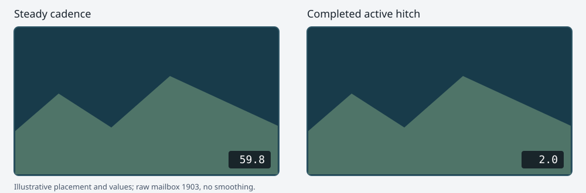
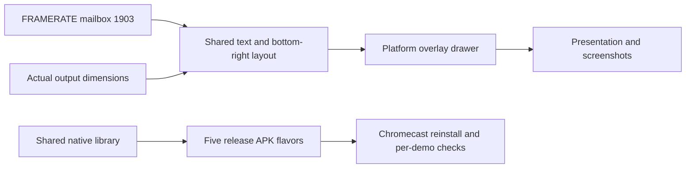

# FPS counter across all demos and Chromecast redeployment

**Date:** 2026-10-03

**Status:** Shared overlay implemented and checked; all five Chromecast apps updated and all selector entries captured. Native, WebGL, and Apple renderer checks passed. Additional manual HUD/input/performance checks remain listed below.

**Request:** Add a visible FPS counter to every demo, preferably at the bottom right, and reupload the updated demo apps to Chromecast.

## Result

Every active demo shows a small bottom-right diagnostic counter such as
`59.8`. It reads the engine's existing raw frame-rate mailbox 1903 and
retains fractional values, including `0.5` during a completed long stall.
The counter is enabled by default for demo runs and the five Chromecast demo
apps. It is independent of score/lives HUD activation and game scripts.

Use the shared game/render path so standalone levels, multi-level bundles,
and aquarium tank changes inherit the same behavior. No per-level authored
FPS script or new mailbox is required. The mailbox and display remain
diagnostic: they must never influence movement, physics, or gameplay timing.

## Scope and deployment inventory

| Chromecast flavor | Application ID | Content to verify |
| --- | --- | --- |
| Snowgoons | `org.worldfoundry.wf_game` | Snowgoons-only bundle |
| Aquarium | `org.worldfoundry.wf_game.aquarium` | Every tank in the current selector manifest |
| Condo | `org.worldfoundry.wf_game.condo` | Condo 639/640 demo |
| SMB | `org.worldfoundry.wf_game.smb` | W1-1 through W1-4, including level transitions |
| Q*bert | `org.worldfoundry.wf_game.qbert` | Packaged Q*bert demo and its existing HUD |

The aquarium manifest currently lists Clownfish & Sea Anemone, Blue Shrimp,
Calm Betta, Jellyfish, Lionfish, Planted Tank, Asian Arowana, and Tiger Barbs.
Read the manifest again when implementing; coverage follows its actual entries.

“All demos” also covers standalone demo levels using the shared engine,
including Moon, Marble Madness, PILOT, and the other runnable level bundles.
Inventory the runnable entry points from Taskfile and bundle manifests rather
than treating every model `.iff` as a demo. Reuse the five existing Android
flavors for the Chromecast rollout; standalone demos without an Android flavor
receive the shared overlay without inventing new app packages in this change.

## Display design

Bottom right is the default placement. Anchor to the full output surface,
rather than the camera's possibly square or letterboxed viewport. Start with
a 3% inset from the right and bottom edges for TV overscan, scaled text with a
minimum readable size, and white text on a compact translucent dark plate.
Size the plate to the actual visible glyph bounds, with equal 1.5 font-pixel
padding on every side (4.5 screen pixels at 1080p); do not use the font line
height, which leaves excess space below the digits.
Show only the number, always with one decimal place and no `FPS` label. Keep the right edge fixed as the number changes width.



The mockup illustrates placement and formatting; its numbers are not measured
device results. Confirm readability and the inset on the actual TV.

| State | Display |
| --- | --- |
| Startup, level reset, or first frame after resume | `0.0`, matching the mailbox reset value; positive readings follow the first valid sample |
| Ordinary cadence | One decimal place, for example `59.8` |
| Completed 500 ms active stall | `2.0` |
| Completed 2 s active stall | `0.5` |
| Positive value below 0.1 FPS | Round to one decimal place, including `0.0`; retain the raw mailbox value |
| Selector or loading screen outside active `StepFrame` | Hide the counter; those loops have no sampled game cadence |
| Application backgrounded | No overlay rendering; reset behavior follows the existing lifecycle contract |

Update the displayed value each rendered frame from the latest completed
interval. Scripts and the overlay therefore see the previous completed frame's
sample. A stall becomes visible when it finishes; this is not an in-progress
stall detector. Do not average, introduce a 10 FPS floor, or replace the value
with a configured simulation rate. A smoothed second mailbox remains separate
future work.

Provide one explicit way to disable the overlay, provisionally `--no-fps`, for
clean screenshots and existing rendering comparisons. Keep it on by default
for the requested demos; do not tie it to `DESIGNER_CHEATS`, Debug builds, or
whether the level writes score/lives mailboxes.

## Existing implementation surfaces

- [Raw FPS plan](2026-10-03-engine-framerate-system-mailbox.md) and
  [reviewed code](2026-10-03-engine-framerate-system-mailbox/simulated-pr.md):
  `WFGame` measures monotonic elapsed time, performs FPS arithmetic with
  `Scalar`, and exposes `EMAILBOX_FRAMERATE` through `Level::ReadSystemMailbox`.
- [game.cc](../../wfsource/source/game/game.cc): shared active frame loop and
  existing mailbox-to-HUD integration. Keep FPS data as `Scalar`; only text
  formatting converts it for presentation.
- [GL display](../../wfsource/source/gfx/gl/display.cc): existing desktop text
  HUD is conditionally compiled and gated on level HUD values. Those gates
  cannot govern the new counter.
- [Android window](../../wfsource/source/gfx/gl/android_window.cc): existing
  GLES rectangle overlay and menu drawing paths. Reuse their text-geometry
  approach; desktop fixed-function `GL_QUADS` drawing is not a GLES solution.
- [Portable menu](../../wfsource/source/game/level_menu.cc) and
  [phone overlay](../../wfsource/source/hal/phonepad/phonepad_overlay.h):
  examples of `stb_easy_font` text represented by rectangles without a font
  asset. Reuse existing drawing helpers where practical.
- [Android flavors](../../android/app/build.gradle.kts): all five packages
  share the native engine library and differ in application ID and assets.
- [Device runner](../../scripts/android-device-run.sh): supports all five
  apps, release APK installation, screenshots, logs, controls, and resume checks.

## Implementation sequence

- [x] Create an isolated worktree from the current `2026-new-level` integration
  state. Include the reviewed Scalar FPS changes through `eb974d6b` if they
  have not reached that branch. Keep current demo content and asset revisions.
- [x] Inventory runnable demos and all current Android selector entries.
- [x] Add a small shared FPS overlay formatter/layout helper. Input is the
  cached mailbox `Scalar` plus actual surface dimensions; output is text and
  existing overlay geometry. Keep representation-specific arithmetic inside
  `Scalar`; do not add `SCALAR_TYPE_*` branches or another timer.
- [x] Read `EMAILBOX_FRAMERATE` through the level mailbox interface once per
  active rendered frame. Feed the same value to the overlay, avoiding a second
  independent FPS calculation.
- [x] Draw after the scene and before presentation/capture at a boundary that
  also runs for `StepFrame(false)`. Ensure the geometry reaches the current
  renderer before its frame is finalized. Save/restore render state.
- [x] Implement/reuse the rectangle drawing path for desktop GL, Android GLES,
  browser/WebGL hosts, and the Apple Metal demo renderers as needed. Check each
  backend's existing overlay capability; missing drawers must be implemented
  before claiming that backend's demos are covered.
- [ ] Keep the counter independent of the existing game HUD gate. Verify its
  placement alongside Moon overlays, arcade HUDs, touch controls, phone pairing
  panels, and game-over screens. Counter visibility should follow active game
  rendering, not whether gameplay simulation is paused.
- [x] Add the default-on setting and screenshot opt-out. Update argument help
  and Android per-app arguments only where needed.
- [x] Run the local checks below and produce the release APKs.
- [x] Notify Will before starting Chromecast installation or testing.
- [x] Reinstall and verify every app and selector entry, then tell Will when
  Chromecast work is finished.



## Local checks and packaging

- [x] Check zero/reset formatting, fractional FPS, sub-0.1 values, changing
  label widths, and bounds at small, 1080p, and 4K surface sizes.
- [ ] Capture a demo with an arcade HUD and one without any existing HUD; the
  counter must appear in both. Exercise the host loop without a buffer swap.
- [x] Verify the 2 FPS and 0.5 FPS cases with controlled sampler intervals;
  preserve the mailbox's raw behavior and fixed simulation-rate independence.
- [x] Rerun the existing sampler/mailbox integration tests. Use focused checks
  for overlay layout; avoid duplicating unrelated gameplay tests.
- [x] Check representative rendering on each supported backend. Record any
  unavailable runtime separately from a successful compile.
- [x] Record the integration commit, APK hashes, packaged assets, enabled FPS
  setting, and compatible ABIs. Build release packages for performance checks.

`task build-apk` assembles the five release flavors and currently rebuilds the
aquarium menu bundle. Refresh any other changed demo bundles using the existing
`build-cd-iff-snowgoons`, `build-cd-iff-condo`, `build-cd-iff-smb`, and
`build-cd-iff-qbert` tasks as needed. Check the packaged assets rather than
assuming an engine rebuild also rebuilt every level bundle.

Output names are
`android/app/build/outputs/apk/<flavor>/release/worldfoundry-<flavor>-release.apk`.
Keep `armeabi-v7a` for Chromecast HD and `arm64-v8a` for the other supported
Android devices; inspect the connected target's actual ABI before installation.

## Chromecast rollout and evidence

After notifying Will, reuse the existing install/run flow once per app:

```sh
task install-apk APP=snowgoons -- <device-target> --resume
task install-apk APP=aquarium -- <device-target> --resume
task install-apk APP=condo -- <device-target> --resume
task install-apk APP=smb -- <device-target> --resume
task install-apk APP=qbert -- <device-target> --resume
```

Use the existing package IDs, signing identity, and `adb install -r` update
path, preserving app data and launcher entries. Do not replace the real apps
with the earlier temporary FPS-check package. A successful install is only the
start of verification: select every aquarium tank, exercise SMB transitions,
and confirm the counter persists on the actual game views.

- [x] Each of the five release apps installs and launches successfully.
- [x] Counter is visible and legible at the bottom right of every demo view;
  no important existing HUD/control element is obscured.
- [x] Each aquarium tank and SMB world has a retained in-game screenshot.
- [ ] Play through SMB flag/axe transitions to check overlay persistence/reset.
- [x] All five apps recover in the same process after Home/background and reopening.
  The sampler reset contract passes local/browser checks.
- [x] Remote D-pad/OK selects each tank and world.
- [ ] Pair a physical phone and check gameplay input/HUD interactions.
- [x] Retain per-app APK hashes, screenshots, logs, and installation results;
  create a manifest of app/level coverage alongside this plan.
- [ ] Confirm screenshot values are plausible against engine diagnostic
  samples. SurfaceFlinger pacing is additional evidence, not an identical
  measurement of engine cadence.
- [ ] Check the overlay's cost against an otherwise equivalent run with it
  disabled, using existing cadence captures; investigate a repeatable loss.
- [x] Stop test sessions, leave the requested updated apps installed, and
  notify Will that Chromecast deployment/testing is complete.

Completion means the overlay is implemented, locally checked, and visibly
verified in the updated Chromecast demos. Record failures and uncovered demos
explicitly; do not mark the rollout complete solely because all APKs installed.

## Implementation record

Worktree: `/tmp/WorldFoundry-fps-overlay`, branch `feature/demo-fps-overlay`.
The counter renders raw mailbox 1903 as `%.1f` with no label, including `0.0`
after resets. Geometry uses a fixed-capacity cache with no heap allocation.
The GL/GLES/WebGL and Metal drawers reuse their existing shader pipelines,
flush pending scene/translucent work, and preserve scene transform/state.
`--no-fps` disables the default-on counter.

- [x] All 9 selected native CTests pass (13.88 s), including overlay layout,
  raw mailbox integration, and the unswapped host loop.
- [x] Both mailbox hot-path pytest checks pass.
- [x] Number-only layout checks pass at 320×240, 1080p, and 4K.
- [x] All five release APK flavors build for both Android ABIs.
- [x] Will notified before starting the Chromecast rollout.
- [x] Chromecast installation, all eight tank/four world captures, and per-app resume checks.
  See the [deployment receipt](2026-10-03-demo-fps-overlay-chromecast/deployment.md).
- [x] Browser runtime, real hide/show, and FPS reset/resume verification.
- [x] Apple builds/runtime/captures: iOS simulator CI passed; final macOS overlay and reference gates passed.

The APKs use a snapshot of the current workspace's demo bundles, including its
eight-tank aquarium selector. Copied content remains separate from the overlay
source commit; retain APK/asset hashes with deployment receipts.

### Padding correction

The first Chromecast capture showed excess space below the digits. The plate
now follows the actual glyph bounds with half the original padding. Layout
checks assert equal padding on all four sides for every tested size/value.
All five release APKs were rebuilt with this correction.

The corrected background was visually verified on Chromecast in all five apps,
including every selector entry. Will was notified when Chromecast work finished.
All nine native checks passed again (12.00 s); WebGL compilation and browser
FPS/reset/resume checks passed. Apple checks exercised the renderer at `606cc488`; the final macOS run includes
the dependency-free capture checker at `5777274a`.

Browser verification exited successfully after correcting Chrome profile cleanup.
The macOS build, raw mailbox checks, number-only A/B capture, and Linux-reference
comparison passed; its first CI job failed only because the new checker imported
Pillow. The checker now reuses the existing dependency-free PNG reader and passes
with Python site packages disabled. CI was restarted at `5777274a`.

iOS simulator CI passed on `606cc488` (build
`6ac0f8e919b21eeb2e6508bc`). The final macOS build is
`6ac0fbb262a19ecd81c28673` on `5777274a`.

Final macOS CI passed the build, raw mailbox integration, overlay A/B capture,
Linux reference comparison, and windowed rendering gates. The checker fixes
change test tooling only; all installed Chromecast APKs contain `606cc488`.
