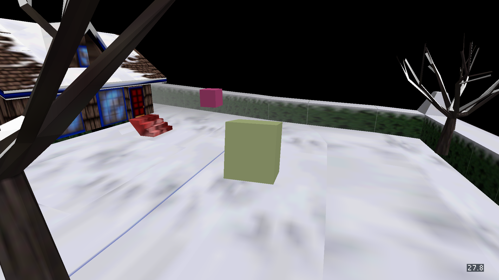

# Chromecast deployment receipt

2026-10-03; engine revision `606cc488`; Chromecast HD, Android API 34,
`armeabi-v7a`, 1920×1080. The same release APKs also contain `arm64-v8a`.

All five apps installed using the existing package IDs and `adb install -r`.
Every app launched, remained alive, and resumed in the same process after Home.
No crash lines were found. APK assets reflect the workspace snapshot used for
this rollout; they include the current eight-tank aquarium selector.

| Flavor | APK SHA-256 | Packaged `assets/cd.iff` SHA-256 |
| --- | --- | --- |
| snowgoons | `f0d8b357ddd2455a725c63324a98e4a4050e96604f796f4ca665ad9ee91d9f53` | `09a35b0f89fd0536d79dc3533f51dd34642f519920b36e1f3acf1c8e2c8048ab` |
| aquarium | `816724ed1fe0b6c1ce2462db218d047a550e8f3a11b75b353c1ed1a0a3adcdf6` | `0a72b33aeadef35c2f04abd2e2ccd36cb58efbf3bc1e300224392cc37fd75f33` |
| condo | `28f7064de9704a60165fd3b8732d81e511925fc702c2958f8246acdc17065f0a` | `bb91e9c82555e31ae8dcdcc6bdc634354127da7c0b1d6e763862c3d206e4b4dc` |
| smb | `c11112279d35b14582dbf2605c9fa9c089a01d652828cd998ece55096878147b` | `d018075985d52af7032f1306fca948b2433469c61ce183be0b97835f4919e8da` |
| qbert | `d93a17d3611330ab6bf11dba236aa2eae12ad97147a4411b0e1276c0ef9a8397` | `425e19cd2febd7b207264e04a8aa29ae84d2625540fe5f2d8dca9874a34daff4` |

## Visible game views

| View | Captured number |
| --- | --- |
| Snowgoons | 27.8 |
| Condo | 20.2 |
| Q*bert | 59.3 |
| Clownfish & Sea Anemone | 30.0 |
| Blue Shrimp | 23.7 |
| Calm Betta | 35.3 |
| Jellyfish | 24.6 |
| Lionfish | 29.5 |
| Planted Tank | 20.1 |
| Asian Arowana | 29.8 |
| Tiger Barbs | 27.5 |
| World 1-1 | 57.1 |
| World 1-2 | 45.6 |
| World 1-3 | 61.6 |
| World 1-4 | 63.2 |

These are individual raw readings, not averaged performance measurements.
All views show only one decimal-place number at the bottom right.
The controller-pairing panel does not cover the number; its dimming layer
also dims the counter while open. D-pad/OK inputs selected every tank/world.

Detailed screenshots, logs, resume captures, and presentation timestamps:
`/tmp/fps-overlay-evidence/chromecast-tight/`.
The selector captures are in its `selectors/` directory.

Not covered by this receipt: pairing a physical phone, playing through SMB
flag/axe transitions, a controlled overlay-on/off performance comparison,
or physical Apple devices. Selector level loads and per-app Home/reopen
were exercised. SurfaceFlinger pacing does not equal the engine mailbox.

## Other renderer checks

Nine focused native CTests passed after the padding correction (12.00 s).
The browser runtime check passed with real window hide/show and restored FPS
samples. Its capture shows the compact number-only plate.
iOS simulator CI passed at `606cc488` (build `6ac0f8e919b21eeb2e6508bc`);
the retained iPhone screenshot includes the counter alongside the touch controls.
Apple evidence is retained under `/tmp/fps-overlay-evidence/ios/` and `macos/`.
The macOS capture changes only `(591,452)–(621,466)` on a 640×480 surface,
with 103 white glyph pixels. The clean capture matches the Linux reference
within the existing 3-channel-value tolerance.

Final macOS run `6ac0fbb262a19ecd81c28673` on `5777274a` passed the
number-only A/B capture gate and the Linux-reference comparison in CI.
