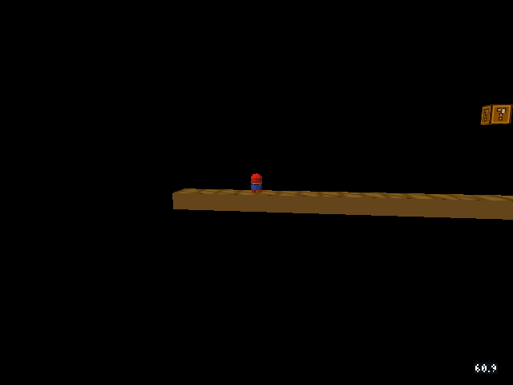
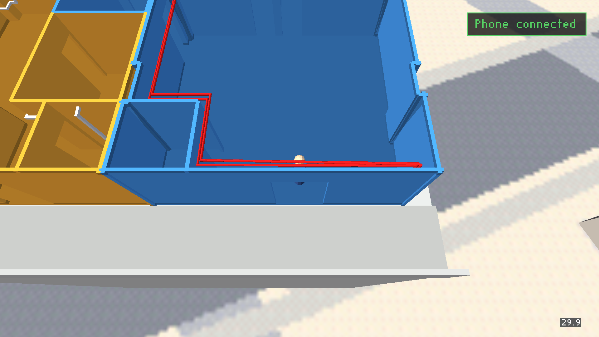

# Remaining FPS overlay checks

2026-10-03; merged engine source `cd4ba77a` (runtime identical to the tested feature engine).

## Chromecast performance comparison

Six alternating Snowgoons trials used identical native libraries and game assets.
Only `--no-fps` differed between variants. Both pinned the simulation clock to
`-rate20` and enabled the same periodic engine mailbox probe. This fixes the
game-step configuration; it does not fix the measured presentation cadence.
Warmup precedes twelve seconds of SurfaceFlinger polling. The initial frame
history is excluded using the first captured timestamp. Raw timestamps and
per-trial results are in [performance.json](performance.json).

| Counter | Average presented interval | Median interval | 90th percentile |
| --- | --- | --- |
| On | 33.3029 ms | 33.3667 ms | 33.3671 ms |
| Off | 33.2995 ms | 33.3667 ms | 33.3670 ms |

The average difference is 0.010%; median and 90th-percentile cadence are
unchanged within timer precision. The small average difference is below the
variation between trials. No material presentation loss was detected on this
Chromecast HD scene. This is not a CPU/GPU cost measurement or proof that the
overlay has zero cost on every level/device. Engine probes are retained as
diagnostic evidence; SurfaceFlinger measurements are a different metric.

## SMB flag and axe transitions

The desktop GL engine loaded the actual four-world menu bundle. Debug commands
teleported the live Player into each authored flag sensor and the W1-4 axe.
They did not write the celebration/end/next-level mailboxes. The game scripts
and collision triggers performed the transitions. Tests watched celebration
and level requests, observed a zero FPS baseline, then a positive reading in
the newly loaded world. Player indices were discovered from each world; W1-3
uses a different index.

| Transition | Trigger | FPS reset/recovered |
| --- | --- | --- |
| W1-1 → W1-2 | Flag contact | Pass |
| W1-2 → W1-3 | Flag contact | Pass |
| W1-3 → W1-4 | Flag contact | Pass |
| W1-4 → W1-1 | Axe contact at (228, 0, 1.5) | Pass |

See [smb-transitions.json](smb-transitions.json). This verifies the shared
game/overlay loop on desktop GL; it is not a manual Chromecast playthrough.
Earlier device captures already cover the four SMB game views.

An existing desktop debug-server reconnect race interrupted the initial
continuous harness: a detached old client closes a reused file descriptor
after level teardown, producing `accept() failed: Bad file descriptor`.
Each transition was therefore checked from a fresh process in the original run.
The subsequent [listener teardown correction](../../2026-06-02-debug-bridge-listener-teardown-deassert.md#reconnect-correction-2026-10-03)
fixes that race. Its regression run completed eight continuous transitions (two
full laps) in one desktop engine process, with FPS reset and mailbox traffic
resuming after every reconnect. The listener fix is separate from the overlay;
it does not change the Chromecast performance evidence above.

## Controller delivery and overlay placement

All **91** controller tests passed: browser button delivery, protocol safety,
Android wiring and overlay layout. A mobile-sized touch-capable Chrome session
also paired with the real Chromecast Condo server. A/C/D/E/F presses delivered
the expected masks to the running engine; screenshots were retained for each.
The connected-controller badge is at the top right and the compact FPS number
remains unobstructed at the bottom right. The pairing panel also leaves it clear.

The controller browser is automated on the host. **A physical phone was not
available/connected**, so real handset touch, Wi-Fi and wake-lock behavior
remain unverified. Legacy desktop arcade/game-over HUD modes were not added
to this run; earlier iOS screenshots cover the counter alongside touch controls.

## Restoration and coordination

The coordinator service was not installed when these tests started. The
sessions used a host-wide advisory lock and foreground checks, not a service
lease or enforced FIFO queue. No hard-enforcement claim is made.
The installed Snowgoons, SMB and Condo APKs were saved before testing, restored
afterward, and verified to have the same SHA-256 hashes. The final performance
session touched only Snowgoons. The TV was returned to Home and the lock released.
No temporary test APK remains installed.

Detailed host evidence: `/tmp/fps-remaining-checks/`.
