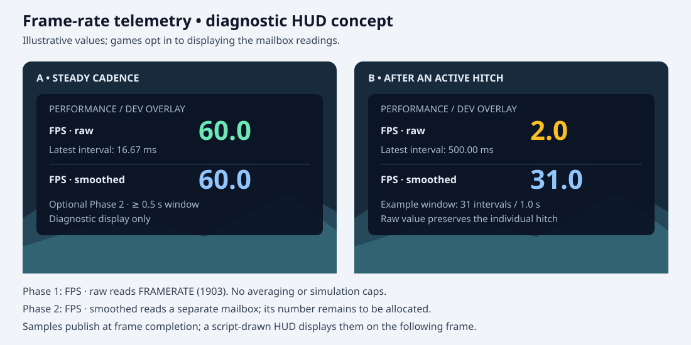
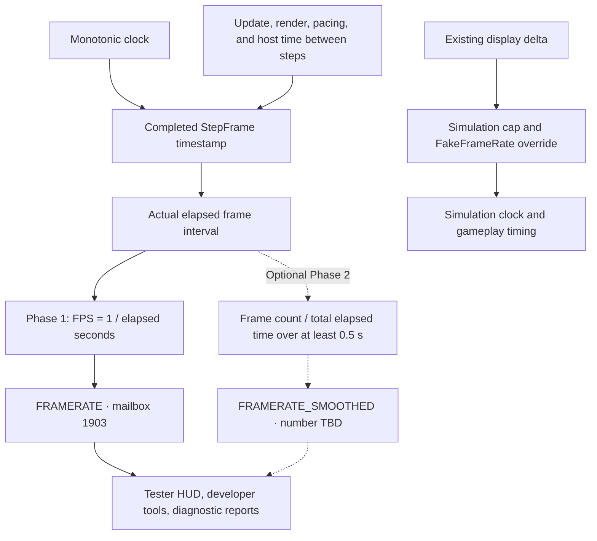
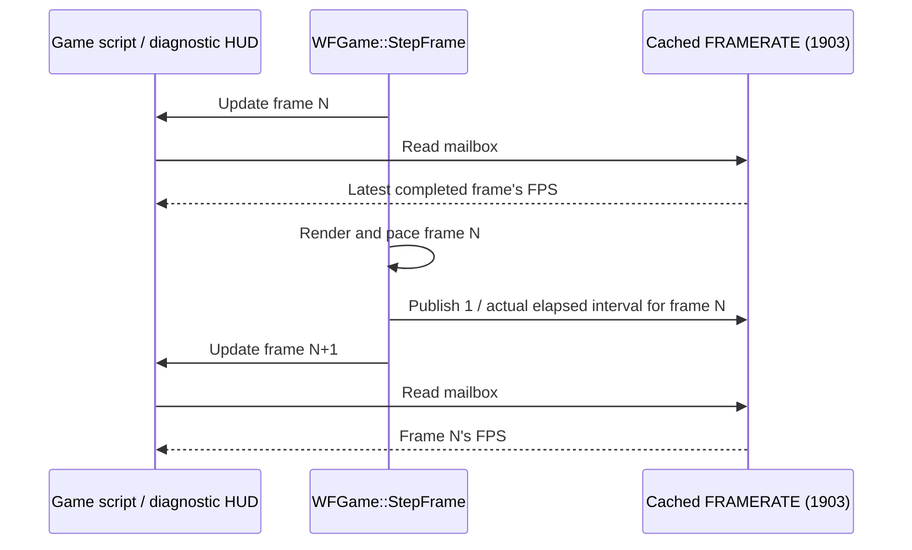

# Engine frame rate through a global system mailbox

**Status:** Phase 1 implemented on branch `feature/engine-framerate-mailbox`; Linux runtime and Android build/sampler checks passed. Remaining platform validation is listed below. Phase 2 remains deferred.
**Date:** 2026-10-03
**Testing coordination:** Notify Will before any further Chromecast testing. The standalone device sampler test recorded below ran before this preference was received; no game APK was installed or launched.
**Request:** Have the engine calculate the true measured frame rate on every supported platform and expose it through a predefined global system mailbox for testers and developers. This is diagnostic telemetry and must never drive gameplay mechanics. Games may read it to display an FPS overlay or report performance.

## Feasibility and existing code

Yes: the current Linux, Android, iOS, macOS, and browser/WASM engine paths share `WFGame::StepFrame`, so the measurement and mailbox behavior can be implemented once. Platform builds and runtime checks are still required before claiming verified support on all five.

The mailbox already exists: [`mailbox.inc`](../../wfsource/source/mailbox/mailbox.inc) reserves `FRAMERATE` at **1903**, inside the global system range `[1901, 1922)`. [`Level::ReadSystemMailbox`](../../wfsource/source/game/level.cc) had no `EMAILBOX_FRAMERATE` case before Phase 1, so reading it reached the invalid/read-unimplemented assertion path (or returns zero with assertions disabled). Reuse this number; no mailbox allocation or range expansion is needed.

Baseline behavior examined before implementation:

- [`LevelMailboxes`](../../wfsource/source/game/mailbox.cc) routes global system reads to `Level::ReadSystemMailbox`.
- [`scripting_stub.cc`](../../engine/stubs/scripting_stub.cc) generates shared `INDEXOF_*` script constants from `mailbox.inc`; `INDEXOF_FRAMERATE` is already included in that table. Verify its availability in each supported interpreter rather than inventing another naming convention.
- [`WFGame::StepFrame`](../../wfsource/source/game/game.cc) updates, renders, and calls `PageFlip()` or `MeasureDelta()`. It returns early while the application is suspended. The same entry point supports standalone games and editor hosts.
- `DELTA_TIME` (1907) returns the simulation clock delta. [`sim_constants.hp`](../../wfsource/source/game/sim_constants.hp) caps simulation steps at 100 ms, and `Level::update` can substitute `FakeFrameRate`. Consequently, `1 / DELTA_TIME` would report a simulated rate, with a false 10 FPS floor during stalls.
- The GL display timer uses `gettimeofday` and clamps elapsed time; the iOS and macOS display timers also use `gettimeofday`. Measure FPS independently with a monotonic clock, before any simulation clamping or overrides. These existing timer behaviors must not alter the diagnostic value.

## Phase 1 public contract

| Property | Behavior |
| --- | --- |
| Mailbox | `FRAMERATE` / `EMAILBOX_FRAMERATE` / `INDEXOF_FRAMERATE`, number 1903 |
| Access | Read-only, using existing global system mailbox routing |
| Unit | Frames per real elapsed second, returned as a `Scalar`; retain fractional FPS |
| Meaning | Reciprocal of the latest actual completed frame interval: `1 / elapsed_seconds`, including rendering work, pacing, and time between host calls |
| Sampling | One sample per completed `StepFrame`, after `PageFlip` or `MeasureDelta` |
| Smoothing/clamping | None in mailbox 1903: publish every completed frame, with no minimum FPS floor, target-rate substitution, or averaging. A diagnostic UI may separately average its display |
| Startup | Zero until the first valid frame interval is available |
| Script visibility | The most recently published result; scripts executing within a frame see the previous completed measurement, consistently throughout that frame |
| Lifecycle | Reset to zero and discard the previous timestamp on level load, unload, and application suspend/resume |
| Simulation overrides | FPS continues to measure real cadence regardless of `FakeFrameRate` or simulation delta caps |

For example, a 500 ms active frame reports **2 FPS**, and a 2 s active frame reports **0.5 FPS**, even though the simulation delta is capped at 100 ms. Keep fractional values so stalls below 1 FPS remain visible. Gameplay must continue using its simulation timing APIs; this mailbox is only for diagnostic display and reporting.

This measures the engine's frame cadence, not monitor refresh rate, GPU completion, or compositor-confirmed presentations. An active step without a valid camera still counts; an unavailable Metal drawable can also prevent a presentation without preventing an engine step. Those facts should be explicit in the mailbox documentation. A separate presented-frame metric can be added later if games need it.

Continue counting when the debugger pauses simulation but the engine still renders. Do not count `FrameResult::Suspended`, loading work, teardown-only `PageFlip` calls, or menu loops outside `StepFrame`. Ordinary active stalls must remain in the measured interval so low rates are observable. Lifecycle suspension is the explicit reason to discard a gap; do not silently discard every long interval as though it were a pause.

## Diagnostic HUD mockup



The overlay is an example of how a game could surface the readings to testers and developers, rather than a required engine HUD. Phase 1 shows the raw row; Phase 2 can add the smoothed row. The hitch example's smoothed window contains 30 intervals totaling 0.5 s plus one 0.5 s hitch: `31 / 1.0 = 31 FPS`. Values are illustrative, not measured runtime evidence.

## Measurement and mailbox flow



Both diagnostic paths receive the actual monotonic interval. The simulation timing path remains separate. Active stalls contribute their full elapsed duration; lifecycle suspension resets the sampler.

## When scripts see the value



Reads return a cached value and never advance the timer. A hitch becomes observable once that frame completes; the engine cannot update an on-screen counter while stalled. After a lifecycle reset, reads return zero until a valid interval completes.

## Implementation design (implemented for Phase 1)

1. Add a small frame-rate sampler owned by `WFGame`, with a read-only accessor returning the cached `Scalar`. Keep timestamps and elapsed intervals in a high precision monotonic representation; convert only the published FPS value to `Scalar`.
2. Use `std::chrono::steady_clock` in shared engine code as the initial clock choice. The engine already uses it in runtime/script profiling. Confirm `is_steady` and runtime behavior on all five toolchains, including WASM. If a target needs an adapter, expose a monotonic HAL time source with the same semantics rather than branching the FPS algorithm by renderer. Do not use the centisecond-resolution `SYS_TICKS` interface for frame intervals.
3. At the start of the first active `StepFrame` after reset, establish a baseline. At its end, after display pacing/measurement, feed the completion timestamp into the sampler. Later intervals run from the previous completion to the current completion, including host work between calls. This avoids counting level-loading time while retaining the cost of the first actual frame. Publish only after completing a step.
4. For each valid completed interval, publish `1.0 / elapsed_seconds` and retain the completion timestamp as the next baseline. Do not smooth or clamp the measured interval; long active stalls must produce their actual low FPS. Reject nonpositive intervals without dividing by zero; reset measurement state if an invalid clock sample prevents a meaningful interval. Handle numeric representability explicitly before conversion, including fixed-point configurations. Numeric overflow/underflow handling is separate from a performance cap; document any limits imposed by the mailbox representation.
5. Reset sampler state at level boundaries and on application lifecycle transitions. The suspended branch must invalidate it before returning. Also handle platforms that stop scheduling steps while hidden/backgrounded: browser visibility pause/resume and native lifecycle hooks must invalidate the next interval even if no suspended `StepFrame` occurred. Use an engine-thread reset or lifecycle generation flag if callbacks run on another thread.
6. Add `EMAILBOX_FRAMERATE` to `Level::ReadSystemMailbox`, returning the owning game's cached result. Confirm how `Level` accesses its `WFGame` owner; add a minimal accessor/reference if necessary. Leave writes rejected by the existing system mailbox write policy, and document the read-only contract.
7. Document the semantics alongside `FRAMERATE` in `mailbox.inc` and in scripting references. Use the existing mailbox constant registration and read primitive. For zForth, the intended usage is:

   ```forth
   INDEXOF_FRAMERATE read-mailbox  ( -- fps )
   ```

   Confirm this exact expression in a running interpreter. Other interpreters should use their existing global mailbox read APIs and registered constant conventions.

No changes to physics timing, display pacing, or `DELTA_TIME` are needed. Keep any broader migration of display timers to monotonic time as separate work.

## Platform coverage

The platform definitions in [`CMakeLists.txt`](../../CMakeLists.txt) select these five current engine targets. Historical platform source directories are not sufficient evidence of a supported runnable port.

| Platform | Current frame path | Verification needed |
| --- | --- | --- |
| Linux | Shared `StepFrame`; GL `PageFlip` or host-owned `MeasureDelta` | Standalone and editor host; include host swap/work between steps |
| Android, including Android TV | Shared `StepFrame`; EGL display path | Physical-device cadence and background/resume reset |
| iOS | Shared `StepFrame`; Metal rendering and `WFIosWaitForVSync` pacing | Apple build, device run, lifecycle reset and unavailable drawable semantics |
| macOS | Shared `StepFrame`; Metal rendering and display timer/pacing wrapper | Apple build, runtime read, level transition and window lifecycle behavior |
| Browser/WASM | Browser animation callback calls `StepFrame`; canvas composition follows callback return | Browser build/run, hidden-tab resume reset, standalone and hosted editor cadence |

Windows and historical console/MCU ports are outside the demonstrated current build matrix. Any revived port must supply a monotonic clock and use the same frame/reset contract. Record untested platforms as pending, rather than reporting universal runtime validation from a Linux-only test.

## Validation and acceptance criteria

First test the sampler with injected timestamps, without real sleeps:

- Stable 30, 60, and 120 FPS intervals produce the corresponding fractional `Scalar` values within conversion tolerance.
- Irregular intervals publish each interval's reciprocal on the next completed frame, without smoothing; 500 ms produces 2 FPS and 2 s produces 0.5 FPS.
- A multi-second active stall yields a low measured FPS rather than the simulation clamp's 10 FPS floor.
- Startup/reset returns zero; reset discards both the old published value and previous timestamp; the next baseline excludes loading/suspension time.
- Duplicate/invalid timestamps cannot divide by zero or overflow, and high rates remain representable.
- Multiple reads in one frame return the same cached value and do not advance measurement state.

Then add an integration fixture that reads the named system mailbox from a game script and exposes the value through an ordinary test mailbox or log. Check direct C++ and script reads agree, system writes follow the existing rejection policy, and neighboring mailbox IDs retain their behavior. Verify registered constants and read paths for supported scripting backends; a backend without a real interpreter should not be counted as a script runtime pass.

Run standalone and hosted frame loops. Cover simulation pause, `FakeFrameRate`, a controlled active hitch, level reload, suspension, and resume. Compare individual FPS samples against independently measured monotonic frame intervals; use tolerances for timestamp precision and conversion instead of assuming a 60 Hz display. Confirm that an optional averaged overlay does not change the raw mailbox value. Compile all five platform targets and run available native/device/browser smoke tests, recording exact remaining gaps.

**Done when:** games can read mailbox 1903 by its predefined name, the documented measurement remains independent of simulation timing, lifecycle gaps reset cleanly, and every current platform has a recorded build/runtime result or an explicit pending validation entry.

## Phase 1 implementation and validation

The implementation uses [`FrameRateSampler`](../../wfsource/source/game/frame_rate.h), owned by `WFGame`, and `WFGame::DiagnosticFrameRate()` through the existing `Level::ReadSystemMailbox` route. A thread-safe HAL lifecycle generation invalidates old timestamps even when suspend/resume happens entirely between steps. The browser host-context path now registers visibility handling too. FPS samples are taken after display pacing, using a separate monotonic clock; display/simulation timing behavior is unchanged.

- [x] Raw read-only mailbox 1903 implemented; named constant remains `INDEXOF_FRAMERATE`.
- [x] No smoothing, target-rate substitution, or simulation FPS floor.
- [x] Level load/unload and lifecycle invalidation implemented.
- [x] Deterministic sampler tests cover cadence, host gaps, stalls, invalid timestamps, cached reads, and lifecycle transitions; live clock check also passes.
- [x] Linux game/script integration verifies two named zForth reads against the C++ mailbox read, an active hitch, immediate recovery, simulation pause, and write rejection.
- [x] The integration test also passes with `-rate10`, proving that simulation overrides do not become the diagnostic FPS value.
- [x] Linux standalone and host-context smoke tests pass at one and two load/unload cycles. Smoke checks assert zero FPS after loading and after unloading.
- [x] Android `arm64-v8a` and `armeabi-v7a` engine builds pass with NDK r26c.
- [x] Sampler tests pass on a connected `armeabi-v7a` Android device, linked to the real Android lifecycle implementation. NativeActivity/window dependencies are stubbed for this standalone executable; no game APK is installed by this test.
- [ ] Full Android game mailbox/background-resume integration remains pending.
- [ ] iOS and macOS Apple-toolchain builds and runtime checks remain pending; this Linux environment has no Apple SDK.
- [ ] Browser/WASM build, visibility/resume runtime check, and hosted editor check remain pending; an Emscripten toolchain is not installed here.
- [ ] Direct runtime verification of `StepFrame(false)` and the other optional scripting backends remains pending. The host-context smoke uses `StepFrame(true)`; injected-timestamp tests verify host-gap accounting independently.
- [ ] Phase 2 smoothed mailbox remains deferred.

See [validation commands and evidence](2026-10-03-engine-framerate-system-mailbox/validation.md). On current float-based targets FPS retains fractional values; for historical signed 16.16 configurations, conversion saturates at approximately 32768 FPS and values below one fractional unit round toward zero. These are representation limits, not performance clamps.

## Scope and delivery

Deliver in three steps: shared sampler and mailbox wiring; focused unit/integration coverage and script documentation; platform builds and runtime evidence. The implementation is small, but all-platform verification depends on Apple toolchains/devices and browser/Android test access.

## Phase 2: optional smoothed FPS mailbox

After the raw FPS mailbox is implemented and validated, consider exposing a second read-only global system mailbox, provisionally named `FRAMERATE_SMOOTHED`, for stable diagnostic overlays. Phase 1 does not depend on this addition. Mailbox 1903 retains its raw per-frame contract.

The proposed calculation is completed frame intervals divided by their total real elapsed time over a window of at least 0.5 s. Publish using the actual window duration, including overshoot, and retain the last result between publications. Do not average instantaneous FPS reciprocals: that would give short frames disproportionate weight. Include active stalls without applying simulation caps. Reset the window and published value on the same lifecycle boundaries as the raw sampler; return zero until the first complete window is available.

Select the mailbox number during Phase 2 after checking the current allocation. The existing global system range is full of named entries; do not assume 1922 is free, since it is currently the exclusive range sentinel. If appending there, move `GLOBAL_SYSTEM_MAX`, audit range consumers and generated constants, and preserve existing mailbox numbers. Register the new predefined script constant through `mailbox.inc`.

Validate steady cadence, irregular intervals, active stalls, window overshoot, and lifecycle resets with injected timestamps. Verify both mailboxes through script reads and confirm that publishing the smoothed value never changes the raw value. Both metrics remain diagnostic telemetry and must never drive gameplay mechanics.
