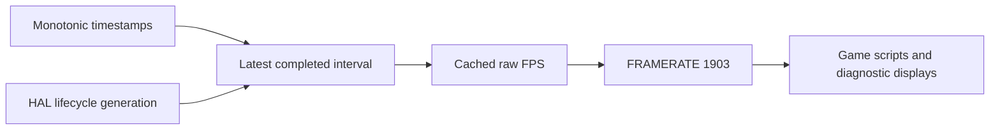

# Simulated PR: expose raw diagnostic FPS through system mailbox 1903

**Date:** 2026-10-03  
**Target branch:** `2026-new-level`  
**Status:** Retrospective PR document for implemented and merged code; this is not an actual GitHub PR.  
**Merged baseline:** [`73c0634e`](https://github.com/wbniv/WorldFoundry/commit/73c0634e)  
**Implementation:** [`402d0f2f`](https://github.com/wbniv/WorldFoundry/commit/402d0f2f)  
**Verification integration:** [`2639369a`](https://github.com/wbniv/WorldFoundry/commit/2639369a)

## PR description

Games can now read `INDEXOF_FRAMERATE`, the existing global system mailbox
1903, to show testers and developers the engine's latest measured frame rate.
Previously, this reserved mailbox had no implemented read handler. Inferring
FPS from `DELTA_TIME` also concealed stalls because simulation steps are capped
and can be replaced by `FakeFrameRate`.

The new sampler uses `std::chrono::steady_clock` and publishes the reciprocal
of the latest completed real frame interval. A 500 ms active interval reports
2 FPS; a 2 s interval reports 0.5 FPS. It includes frame pacing and gaps between
host-driven steps. The next completed interval replaces the value immediately,
without smoothing or a minimum FPS floor.

This mailbox is diagnostic telemetry for overlays and performance reports.
Gameplay must continue using simulation timing. The measurement describes
engine frame cadence; it does not confirm GPU completion or screen presentation.

## Public API and observable behavior

| Property | Contract |
| --- | --- |
| Address | Global system mailbox `FRAMERATE`, number 1903 |
| C++ identifier | `EMAILBOX_FRAMERATE` |
| Script constant | `INDEXOF_FRAMERATE`, registered through the shared mailbox table |
| Value | FPS as an engine `Scalar`, retaining fractions where the script bridge supports them |
| Access | Read-only; writes follow the existing system mailbox rejection policy |
| Publication | After each completed `StepFrame`, following `PageFlip()` or `MeasureDelta()` |
| Script reads | Current updates see the previous completed frame's cached value |
| Startup/load/unload | Zero until a valid interval has completed |
| Suspend/resume | Discard the interrupted interval and return zero before the first new valid sample |
| Active stalls | Include their full elapsed time, including stalls below 1 FPS |
| Simulation pause/override | Continue measuring real cadence while active frame stepping continues |
| Numeric limits | Conversion respects `Scalar` precision and saturates only at its representable maximum |

Example game reads:

```forth
INDEXOF_FRAMERATE read-mailbox
```

```lua
local fps = read_mailbox(INDEXOF_FRAMERATE)
```

## Code under review

These excerpts describe the implementation including the Scalar correction.
Source links target `verify/engine-framerate-mailbox`; excerpts omit surrounding
unrelated code. The commit links above identify the earlier merged baseline.

### 1. Sample actual elapsed time independently of simulation

[`wfsource/source/game/frame_rate.h`](https://github.com/wbniv/WorldFoundry/blob/verify/engine-framerate-mailbox/wfsource/source/game/frame_rate.h)
adds a small sampler owned by `WFGame`. Its timestamps are arguments so tests
can exercise long stalls and invalid timestamps deterministically.

```cpp
using Clock = std::chrono::steady_clock;
using TimePoint = Clock::time_point;
static_assert(Clock::is_steady, "FPS requires a monotonic clock");

void EndFrame(TimePoint now, unsigned int lifecycleGeneration)
{
    if (_generation != lifecycleGeneration || !_hasBaseline || now <= _last)
    {
        Reset();
        return;
    }
#if defined(SCALAR_TYPE_FIXED)
    const auto nanoseconds = std::chrono::duration_cast<std::chrono::nanoseconds>(now - _last).count();
    constexpr std::uint64_t numerator = 1000000000ULL * SCALAR_ONE_LS;
    constexpr std::uint64_t maximum = 0x7fffffffULL;
    const std::uint64_t raw = nanoseconds > 0 ? numerator / nanoseconds : maximum;
    const std::uint64_t bounded = raw > maximum ? maximum : raw;
    _fps = Scalar(static_cast<int16>(bounded >> 16), static_cast<uint16>(bounded & 0xffff));
#else
    const Scalar seconds(std::chrono::duration<FLOAT_TYPE>(now - _last).count());
    _fps = Scalar(1, 0) / seconds;
#endif
    _last = now;
}
```

`BeginFrame` establishes the initial baseline and resets it when the lifecycle
generation changes. Later samples measure from the previous frame's completion,
so idle time between host calls remains in the interval. `Read` returns zero
when the cached generation no longer matches the HAL generation.

The sampler stores and returns the mailbox's `Scalar` type. Floating Scalar
builds use their native `FLOAT_TYPE` for chrono conversion and divide Scalars;
there is no separate double intermediate. Fixed-point builds calculate 16.16
FPS directly from integer nanoseconds, saturating at the representable maximum.
This avoids both floating-point arithmetic and quantizing elapsed seconds to
16.16 before taking the reciprocal.

### 2. Publish from the common frame loop

[`game.hp`](https://github.com/wbniv/WorldFoundry/blob/verify/engine-framerate-mailbox/wfsource/source/game/game.hp)
owns `FrameRateSampler _frameRate` and exposes `DiagnosticFrameRate()`.
[`game.cc`](https://github.com/wbniv/WorldFoundry/blob/verify/engine-framerate-mailbox/wfsource/source/game/game.cc)
resets it during level load/unload and suspended stepping, begins sampling
before update/render, and completes sampling here:

```cpp
_deltaTime = do_swap ? _display->PageFlip() : _display->MeasureDelta();
if (HALIsSuspended())
    _frameRate.Reset();
else
    _frameRate.EndFrame(FrameRateSampler::Clock::now(), HALLifecycleGeneration());
```

`DiagnosticFrameRate()` returns zero while suspended, checks the generation,
then returns the cached `Scalar` directly. Both standalone games and editor
hosts use this path, including `StepFrame(false)` with no buffer swap.
Existing simulation delta clamping and overrides remain independent.

### 3. Wire the predefined mailbox into games

[`Level::ReadSystemMailbox`](https://github.com/wbniv/WorldFoundry/blob/verify/engine-framerate-mailbox/wfsource/source/game/level.cc)
adds the missing dispatch case:

```cpp
case EMAILBOX_FRAMERATE:
    return _game.DiagnosticFrameRate();
```

[`mailbox.inc`](https://github.com/wbniv/WorldFoundry/blob/verify/engine-framerate-mailbox/wfsource/source/mailbox/mailbox.inc)
documents the existing 1903 entry. Shared constant generation already supplies
`INDEXOF_FRAMERATE`; there is no new mailbox allocation or level-format change.
[`docs/scripting-languages.md`](https://github.com/wbniv/WorldFoundry/blob/verify/engine-framerate-mailbox/docs/scripting-languages.md)
documents units, startup behavior, lifecycle resets, and diagnostic use.

### 4. Invalidate samples across platform lifecycle transitions

[`hal/lifecycle.h`](https://github.com/wbniv/WorldFoundry/blob/verify/engine-framerate-mailbox/wfsource/source/hal/lifecycle.h)
adds `HALLifecycleGeneration()`. Android, iOS, and the shared Linux/macOS/web
lifecycle implementations increment an atomic generation on suspend and resume.
A frame whose generation changes is discarded. This also catches background
transitions that occur entirely between two calls to `StepFrame`.

[`gfx/gl/emscripten_window.cc`](https://github.com/wbniv/WorldFoundry/blob/verify/engine-framerate-mailbox/wfsource/source/gfx/gl/emscripten_window.cc)
registers visibility handling for the adopted host WebGL context as well as the
standalone path, allowing browser/editor background gaps to reset the sampler.



### 5. Add runtime probes and resolve verification blockers

The verification commits add opt-in `--frame-rate-checks` /
`WF_FRAME_RATE_CHECKS=1` probes that compare real script reads with the engine
value. The probes temporarily use user mailbox 1899 and restore its contents;
they abort on disagreement. Normal execution does not enable these probes.

| Supporting change | Reason included |
| --- | --- |
| `engine/stubs/scripting_wamr.cc` | Real WAMR reads exposed trailing NULs in import names and uninitialized borrowed-vector counts; fix the bridge so named imports resolve correctly. |
| `CMakeLists.txt` Ficl configuration | Generate its softcore and disable upstream Unity test references so the alternate Forth fixture builds. |
| Apple `display_ios.cc` / `display_macos.cc` | Supply missing `Display::GetSurfaceSize` definitions required to link the runtime checks. |
| Web `HALRequestClose` and editor media hooks | Supply missing shared-interface definitions required to build standalone WASM and the hosted editor. |
| `codemagic.yaml` | Exercise Apple mailbox/lifecycle behavior and retain diagnostic evidence. |
| Native host harness and browser fixture | Check unswapped host cadence and actual browser hide/resume behavior. |

These are additional changes in the verified feature history, beyond the
initial sampler/mailbox implementation. The integration merge also contains
concurrent aquarium work; that work is outside this simulated PR's scope.

## Validation

- [x] Deterministic sampler checks: raw cadence, 500 ms and 2 s stalls, host
  gaps, invalid timestamps, and lifecycle resets.
- [x] Linux integration: named zForth reads match C++ reads, repeated reads
  agree, an active 550 ms hitch reports approximately 1.753 FPS, and recovery
  is immediate. The same checks pass with fixed `-rate10` simulation.
- [x] Read-only write rejection and availability while simulation is paused.
- [x] All 8 selected native CTests and 2 mailbox hot-path pytest checks pass
  again on the integrated tree.
- [x] Runtime mailbox probes pass for Lua, Fennel, Wren, zForth, QuickJS,
  WAMR, and PILOT.
- [x] Android engine builds pass for `arm64-v8a` and `armeabi-v7a`.
- [x] Chromecast NativeActivity runtime passes script reads and same-process
  background/resume checks across 3207 samples. The isolated test app was removed.
- [x] macOS arm64 workflow passes, including two unswapped load/unload cycles
  with raw cadence independent of fixed `-rate20` simulation.
- [x] iPhone and iPad simulator workflows pass real UIKit background/resume.
- [x] Standalone WASM and hosted browser editor build and runtime checks pass,
  including real window minimization/restoration and the adopted WebGL context.

See [validation.md](validation.md) for commands, exact Apple workflow revisions,
and evidence, and [runtime-checks.txt](runtime-checks.txt) for retained results.
Apple workflows tested their recorded revisions; the final integration rerun
covered native tests and Android builds. Physical iOS hardware and Android
arm64 device runtime were not tested.

## Known limitations and follow-up

Ficl's existing integer mailbox bridge passes its probe but truncates fractional
FPS: 62.5 becomes 62 and 0.5 becomes zero. Atlast, embed, libforth, and pForth
build but fail their runtime probes. JerryScript verification is blocked by
existing build failures. These are recorded backend defects, not passing
fractional-FPS configurations.

The metric is the latest completed interval, so a stall becomes visible when
that interval completes. Reads do not estimate an in-progress stall. Ordinary
active stalls count in full; explicit background suspension is discarded.

- [ ] Phase 2: consider a separate smoothed mailbox with an independently
  documented window and mailbox number. Raw mailbox 1903 retains its behavior.
- [ ] Resolve the optional interpreter failures and Ficl fractional precision.

## Reviewer focus

Review the timestamp boundary around `PageFlip` / `MeasureDelta`, generation
invalidation across suspend/resume, and the `Scalar` conversion first. Then
review the shared mailbox dispatch and script probe coverage. Supporting
WAMR, Apple, Ficl, and web build changes should be assessed separately from
the small sampler implementation.

The [implementation plan](../2026-10-03-engine-framerate-system-mailbox.md)
contains the design rationale, lifecycle diagrams, and illustrative HUD mockup.

## Review correction 1: use the mailbox type

Will requested replacing the sampler's `double` seconds/FPS with the mailbox
`Scalar` type. The correction also removes `Scalar::FromDouble` from the getter
and optional Forth fixture. A dedicated fixed-point sampler target checks
short intervals, saturation, fractional stalls, lifecycle resets, and values
below fixed-point resolution alongside the native Scalar sampler tests.

- [x] Correction validation: all 9 selected native CTests and both mailbox
  hot-path pytest checks pass. The ninth test is the fixed-point sampler.

The platform results in the validation table above are baseline evidence;
the Scalar correction has been retested locally on Linux only.
