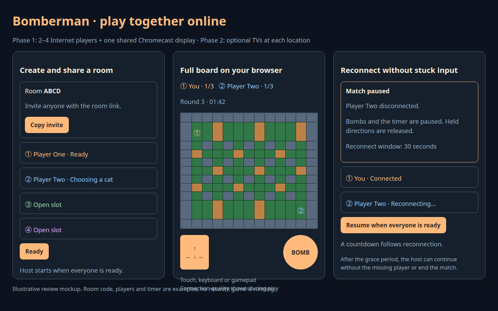

# Bomberman: general online multiplayer

Status: reviewed scope updated 2026-10-04: two-to-four players over the Internet; one existing Chromecast in phase one, optional displays on participants' own Chromecasts in phase two. Implementation has not resumed; no multiplayer service or public game link has been launched.

## Outcome

Anyone can create a private room, share its link, and play Bomberman with remote friends. Each participant sees the complete arena and controls on their own device. Support iPhone Safari, Android browsers and desktop browsers. Phase one includes the existing Chromecast as a shared match display at its location. Remote players do not need to see that TV or own a Chromecast. Phase two can optionally show the same shared content on each participant's own local Chromecast.

The design supports two to four players. Prove the first complete match with two, then exercise the same architecture with three and four before calling multiplayer v1 complete. There is no person-specific behavior, geographic assumption, hardcoded player name or special invitation flow.

## Player experience

1. Open the game, enter a display name, and choose **Create room** or **Join room**.
2. The lobby shows a room code, a copyable invite link, cat choices, player slots, connection state and ready buttons. Joining an invite requires only a display name. No phone app or account is required.
3. Choose a cosmetic cat and tap **Ready**. The host starts when at least two connected participants are ready; show a synchronized 3–2–1 countdown.
4. Each screen shows the same arena, timer and scores. A persistent color, player number and ground marker identify each participant even when cats match. The local player is clearly labeled.
5. On a phone, use the D-pad and Bomb button simultaneously with independent fingers. Desktop users can use keyboard or a gamepad. Release/cancel/background clears input.
6. One life per round; last survivor wins. Simultaneous elimination and a timeout with multiple survivors draw. First to three round wins is the proposed default. Offer **Ready for next round**, **Rematch** and **Leave room**.

The initial invite is a private-room link that players share themselves. No automatic messages to friends, public lobby listing, matchmaking, profiles or account system.

## Responsive surfaces

Portrait phone: compact room/status header, score strip, arena, then D-pad and Bomb button above the safe-area inset. Landscape phone: arena in the middle with controls at its sides. Desktop: larger arena, keyboard/gamepad hints, room and score panel. TV: spectator arena and room/QR panel with no phone controls.

Show lobby waiting, active match, round result, disconnected/reconnecting, and spectator states. A player joining during a round waits as a spectator and may take an available slot between rounds. More than four active participants remain spectators. Spectators cannot move players, place bombs, ready a participant, start a match or change scores.

The mockup is illustrative. It is not a running network game or evidence of measured latency.

## Architecture

Reuse `party-games/platform/server/createServer.js` for HTTP assets, WebSocket rooms, session identity, room creation, presence and reconnects. Add Bomberman as a game plugin with a shared rules module and browser client. Extend the existing shell through its game seam; avoid a second unrelated pairing/relay system. Audit the Aquarium phone controller for touch and lifecycle behavior that can be reused, rather than using its current single-phone takeover semantics for multiple remote players.

The server owns the grid, player positions, input sequence, bomb ownership/capacity, explosion timing, pickups, eliminations and match scores. Clients send input and actions, never positions or results. Use a fixed simulation timestep; timestamp and number authoritative snapshots. Validate message shapes, room membership, role, action rates and monotonic input sequence. One room's state cannot affect another.

Active slots remain bound to resumable server-issued session identities. Rejoining from a saved session restores the same slot and score. Transfer lobby host duties when the host leaves. The room lifecycle must cancel simulation timers when abandoned; cap room/client resources and expire empty rooms. Keep the rule core testable with injected clock/random sources.

## Movement, bombs and latency

Integrate the separate [movement plan](/home/will/wf-games/docs/plans/2026-10-03-bomberman-movement.md): smooth cardinal motion, turn buffering, corner assistance, bomb collision and consistent held input. Do not treat the current prototype's cell jumps as final multiplayer movement.

Render remote actors with a short interpolation buffer. Predict the local player's movement using the same collision rules as the server; reconcile with authoritative snapshots and replay unacknowledged inputs. Input messages carry sequence numbers; repeated transport delivery cannot replay a bomb press. A bomb action acknowledges its accepted cell or rejection so the client does not silently invent a placement. Server confirmation owns flame damage and scoring. Test input/explosion ordering explicitly; do not rewind damage independently on each client.

Heartbeat held controls and bound stale input duration (start at 500 ms, tune from tests). Clear held controls on pointer cancel, blur, page suspension, socket loss and pause. Returning from suspension requires a fresh press. Reconnection must not revive stale movement or bomb actions.

Display measured ping and connection quality. Test synthetic 50/150/300 ms round-trip delay, jitter and brief outages; these are test conditions, not promised responsiveness. Record action latency and reconciliation error. If sustained latency makes a match unplayable, show a clear connection warning and allow pausing. Do not hide the difference between a nearby player and an intercontinental player.

## Disconnect and round policy

Proposed friendly-match policy: a disconnected active participant pauses the simulation, including bomb fuses and the round timer. Clear everyone's input. Show who disconnected and allow a 30-second reconnect window. After reconnection, all remaining active participants confirm **Resume**, followed by a countdown.

After the window, the host may end the match or continue without the missing participant. Continuing eliminates that participant for the round and resolves last-survivor/draw normally; it does not silently award a win before the grace period. If everyone disconnects, expire the abandoned room after five minutes. Spectator disconnects never pause play. These policies are review choices, not verified original-game behavior.

## Battle rules and scope

Ship one readable 13×11 arena with opposite safe corners for two players and four corner spawns for three/four. Each spawn must provide a viable initial bomb escape route. Use consistent hard-wall geometry and seeded soft-wall generation. Verify that all participants can reach each other after digging.

Implement owned bombs, simultaneous capacity, cardinal blast rays, hard-wall/first-soft-wall stopping, immediate deterministic chain reactions, one elimination per player, and destruction of exposed pickups by later blasts. Resolve all damage for a simulation tick before selecting a round winner. Capture bomb range at placement. A player can leave a bomb placed beneath them and cannot re-enter it afterward.

Initial pickups: capacity, flame range and player speed with explicit caps. Full original-version item parity, additional arenas, bots, campaign, production audio/animation and native engine conversion remain separate backlog items. Online rooms should not require those features to be complete, but correctness and usable movement are required.

## Hosting and Chromecast

For review, start an isolated development server and temporary HTTPS/WebSocket tunnel only when implementation is ready. Clearly label the link as temporary and record how to restart it. Use a room invite rather than exposing unrelated services. No public service is started by writing this plan.

For regular play, choose a stable HTTPS domain and persistent relay hosting separately. Measure host-region latency for the expected player locations before choosing a region; the architecture cannot assume the developer's laptop is always online. Pin the runtime supported by the existing platform and preserve its dependency/license workflow.

**Phase one — one existing Chromecast:** join the same Internet room through the existing TV wrapper/receiver and display the shared arena, timer, scores and lobby state. The TV is a display, not the simulation authority or a player slot. Its disconnection must not pause the match. Players use their browser controls; remote players also retain the full browser board. Use the coordinator for builds/installations and preserve video playback with install-only jobs. Launch/capture only when the device is available for interactive use. Update the installed solo app to offer **Solo** and **Online** rather than replacing the working solo mode. Browser access and the one-TV integration are both phase-one deliverables.

**Phase two — optional local displays:** a participant with a Chromecast may attach it to the same room and show the shared match at their own location. Support independent display joining/rejoining without claiming another player slot, changing match authority, taking over another participant's TV or requiring a common LAN. Review sender/receiver setup, compatible Chromecast models and remote provisioning before implementing this phase. Participants without a TV continue with the full browser experience. Additional displays render the same authoritative match; they do not create separate matches.

## Phase-one infrastructure and cost

Planning prices checked 2026-10-04; no hosting has been purchased or provisioned.

On AWS, use one always-on Node.js process for room management and authoritative game simulation, serving browser assets and WebSockets behind HTTPS. On Cloudflare Workers, adapt the same shared rules to one Durable Object per room and validate lifecycle recovery. Two-to-four player browsers plus the existing Chromecast connect as clients; the Chromecast draws game state locally rather than receiving streamed video. Keep live simulation state in memory; checkpoint when required by the selected runtime. Phase one needs neither a separate managed database nor one VM per match; persistent accounts and leaderboards remain out of scope. The AWS deployment needs a process supervisor; both candidates need bounded logs, health monitoring and reproducible configuration.

| Setup | Incremental hosting cost | Practical tradeoff |
|---|---|---|
| Existing computer plus a free development tunnel | No new hosting subscription; existing Internet/electricity still apply | Computer and tunnel must remain running; temporary address and no uptime guarantee |
| AWS Lightsail Linux with public IPv4 | Example: $7/month before applicable taxes | Stable address and no dependence on the developer's laptop; maintain one server |
| Cloudflare Workers + Durable Objects | $5/month paid-plan minimum plus usage overages | Managed rooms; adapt the server runtime and measure awake-room billing |
| Cloudflare Containers | Paid-plan minimum plus container resources and egress | Reuse Node in a container; validate total metered cost and lifecycle |
| Existing suitable Internet server | Potentially no added monthly charge | Verify spare CPU/RAM, access, location and operating cost before selecting it |

A concrete AWS baseline is Lightsail's public-IPv4 Linux bundle, listed at $7/month with 1 GB RAM, two burstable vCPUs, 40 GB SSD and 2 TB transfer; confirm the selected region's allowance. The $12/month 2 GB bundle is a candidate upgrade if measurements justify it. These are starting sizes, not measured room-capacity guarantees. See [AWS pricing](https://aws.amazon.com/lightsail/pricing/). Follow the [AWS and Cloudflare comparison/capacity plan](2026-10-04-bomberman-aws-room-capacity.md) to qualify the alternatives, including sustained AWS load after burst capacity is low. EC2 remains available if existing infrastructure or measured compute needs justify it.

Cloudflare hosting uses the [Workers paid plan](https://developers.cloudflare.com/workers/platform/pricing/) and [Durable Objects](https://developers.cloudflare.com/durable-objects/platform/pricing/), or separately metered [Containers](https://developers.cloudflare.com/containers/platform/pricing/). Active game timers prevent room hibernation. The comparison plan models awake room-hours, billing-unit rounding, runtime adaptation and geographic latency; $5 is a minimum, not a guaranteed final bill. AWS currently offers the simplest path to reuse the Node server. Provider selection remains open for review.

Reuse a subdomain of an existing domain to avoid purchasing another domain. Cloudflare offers [free DNS](https://developers.cloudflare.com/dns/faq/), [free Universal SSL](https://developers.cloudflare.com/ssl/) and [WebSocket proxy support on all plans](https://developers.cloudflare.com/network/websockets/). An additional paid Cloudflare plan is not required when it only fronts the AWS server. Hosting simulation on Cloudflare has the separate costs above. [Quick Tunnels](https://developers.cloudflare.com/tunnel/get-started/quick-tunnels/) are suitable for review sessions, with temporary hostnames and no uptime guarantee; they are not the regular-play availability plan.

Illustrative bandwidth budget, not a measurement: 1 KB snapshots × 20 updates/second × five clients (four players and one TV) is approximately 360 MB/hour outbound. At 60 hours/month that is about 22 GB, plus assets and protocol overhead. Measure actual snapshot sizes and compression before setting limits. Additional rooms consume CPU and transfer; additional TV displays consume another state stream, not another simulation server. Voice/video chat is not included in this estimate.

Proposed AWS budget for early regular play: about $7/month for Lightsail using an existing domain, excluding taxes, optional snapshots and transfer overages. Developer work and future maintenance are separate from hosting charges. Test latency from participants' actual locations before choosing the server region; a CDN does not eliminate the distance to the authoritative simulation. The capacity plan must establish a sustainable room limit before one is promised.

## Phase one — Internet multiplayer and one Chromecast

1. **Rules and rooms:** extract the shared simulation; add slot/role assignment, readiness, countdown, scoring, rematch and room cleanup. Verify complete two-player and four-player matches using deterministic clocks.
2. **Playable browsers:** implement lobby/invites, cat selection, full arena on each screen, phone controls, keyboard/gamepad input, responsive layout and spectator rendering.
3. **Network behavior:** add prediction/reconciliation, sequencing, latency diagnostics, disconnect grace, pause/resume and session restoration. Exercise adverse-network conditions before presenting it as ready for remote play.
4. **Single-TV integration and review deployment:** connect the existing Chromecast as the shared room display, run isolated server/tunnel, verify from outside the LAN, collect browser/device evidence and provide a general create/join link. Complete two-to-four-player browser play and the one-TV display before marking phase one complete.

## Capacity qualification and regular hosting

After review, implement and verify the shared room protocol and simulation before benchmarking hosting. Build a one-room JMeter test on the isolated development server and verify input pacing, acknowledgment correlation, snapshot consumption and reconnect. Then compare AWS and Cloudflare with identical workloads, adding load-generator engines only when measured generator saturation requires them. Geographic latency tests are a separate reason to use generators in multiple regions.

Follow the [capacity plan's execution order and decision gates](2026-10-04-bomberman-aws-room-capacity.md#execution-order-and-decision-gates). Review qualified simultaneous rooms, monthly room-hour costs, latency and implementation/maintenance effort before selecting permanent hosting. Set an actually tested admission limit with headroom and upgrade triggers before regular-play deployment. Temporary review hosting can support functional play tests while this comparison remains open.

## Phase two — participants' local Chromecasts

Plan and implement optional shared match displays at multiple participants' locations after phase one. Verify independent room attachment, reconnect, display-only permissions and continued browser play when a TV is absent or disconnected. This expansion is deferred and does not block phase one.

## Verification and acceptance

Append commands, raw output and PASS/FAIL beneath each numbered step when implementation is resumed. The draft does not claim the following checks have run.

1. **Rules:** deterministic tests cover safe spawns, wall/bomb collision, owner departure, placement/capacity, pickup caps, speed affecting the right player, blast stopping, same-tick chains, simultaneous deaths, draws, timer expiry, round scoring and rematch resets.
2. **Room isolation and roles:** real WebSocket clients create independent rooms; validate invite joins, two/three/four active slots, late joiners/spectators, host migration and rejection of unauthorized or malformed actions.
3. **Browser play:** Chromium and WebKit clients create/join/ready, complete rounds and a match, choose duplicate cats with distinct markers, rematch and leave. Exercise simultaneous movement/Bomb pointers and all cancellation paths.
4. **Network:** controlled delay/jitter/loss fixtures verify authoritative agreement, input sequencing, accepted/rejected bomb actions, bounded reconciliation error, stale-input release and no repeated actions after reconnect.
5. **Lifecycle:** disconnect an active player, confirm frozen bombs/timer, resume via the same session and countdown, expire grace and continue/end, then verify abandoned-room timers stop. Spectator disconnect must not affect the match.
6. **Layout:** portrait 320px/390px phones, landscape phones and desktop views retain a readable arena and usable controls with no unintended scroll/clipping. Save screenshots; verify safe-area handling on an actual iPhone when available and label WebKit automation separately from physical-device results.
7. **Internet play:** verify HTTPS asset loading and WSS room traffic from outside the LAN with two independent clients. Publish the general room flow and record the temporary service's lifetime. No person-specific links or hardcoded opponent details.
8. **Single Chromecast and regression:** run existing platform room/shell tests and preserve other game plugins and the existing Bomberman solo mode. Verify the existing Chromecast shows the same room, arena, timer and scores as remote browsers, consumes no player slot, and can disconnect without pausing play. TV jobs must leave reservations intact and preserve playback during installation. Multiple local Chromecast displays are phase-two acceptance work.

## Confirmed scope and remaining review choices

- Confirmed: two-to-four players over the Internet, general private rooms and a full browser board for remote players.
- Confirmed: the existing Chromecast shows the shared match in phase one; optional displays on each participant's local Chromecast are phase two.
- Proposed defaults: one initial arena and first-to-three match scoring.
- Friendly disconnect pause with a 30-second grace period and explicit continuation.
- Include smooth movement and network prediction in the first usable online version.
- Temporary review hosting first; choose permanent hosting after measured play tests.

Before the request to pause for review, an unverified two-player plugin draft and narrow shell changes were started. They remain local drafts; no public multiplayer service or tunnel was started. Review this plan as the intended scope, not those incomplete implementation details.
