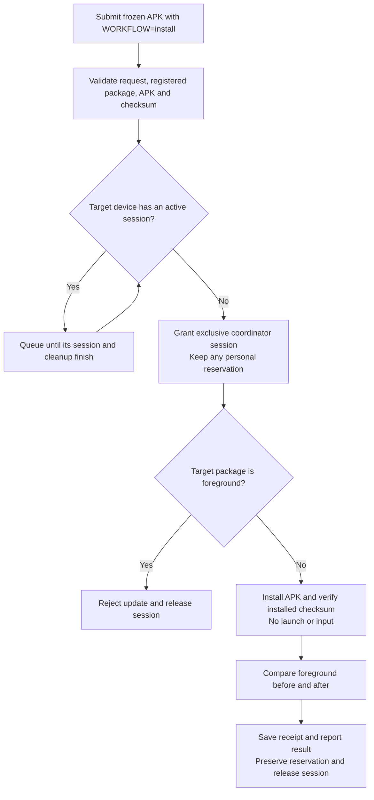

# Plan: Chromecast background installation

Status: deployed and installation verified on both Chromecasts, 2026-10-04. Will completed terminal authentication and deployment after the startup recovery correction. The coordinator queue resumed, both install-only jobs completed, and the personal reservation on device 02 remains intact.

## Intended behavior

Install a frozen APK through `task chromecast:submit WORKFLOW=install` while another app plays video. Preserve Will's personal reservation and leave playback alone. Schedule independently per device: profiling on Chromecast 01 should not block a background installation on Chromecast 02 once the service supports this workflow.

An installation on the same device as an active coordinator job waits for that job's complete session, including cleanup. APK installation consumes device resources and can affect performance measurements. Updating the foreground package is rejected before installation. Launching, input, recording, and other interactive test workflows continue to respect reservations.



## Why the current command waits

`android/bomberman/install.py` checks the protected service for install support before submitting APK jobs. If support is absent, it invokes `android/bomberman/deploy-coordinator.py`. That deployment helper waits for all running **and queued** jobs to disappear before stopping and replacing the service. The repeated messages about `J-cfbb812fc1ff` describe that service upgrade wait, rather than an APK installation waiting on video playback.

At inspection on 2026-10-04, device 01 was measuring that job and device 02 was reserved by Will for watching TV. The source tree already contains the background workflow in `service.py`, reservation eligibility in `store.py`, and the install-only adapter in `workflows.py`. The immediate work is to verify and deploy those changes, improve the upgrade path, and make the installer report the distinction clearly.

```mermaid
sequenceDiagram
    participant User as Installer
    participant Upgrade as Service deployment
    participant Broker as Coordinator
    participant D1 as Chromecast 01
    participant D2 as Chromecast 02
    User->>Upgrade: Ensure background-install support is deployed
    Note over Upgrade,Broker: Current helper waits for the entire queue to empty
    Broker->>D1: Existing profiling session continues
    Note over D2: Video playback and Will's reservation remain intact
    D1-->>Broker: Finish measurements and cleanup
    Upgrade->>Broker: Deploy verified code and restart while idle
    User->>Broker: Submit install-only job for each device
    Broker->>D1: Install under its own session when eligible
    Broker->>D2: Background install under its own session
    Note over D2: Retain reservation; no launch or remote input
    Broker-->>User: Installation results and evidence
```

## Implementation

1. Verify the prepared service changes against the protected deployment and reviewed hashes. Retain request restrictions, registered app checks, immutable APK admission, and foreground-package rejection. Replace the installer's source substring check with an explicit capability response from the service so it can distinguish supported, unsupported, and unavailable service states.

2. Add a protected maintenance/drain operation for service upgrades. Persist maintenance state and make the scheduler stop granting new sessions atomically with that state change. Continue accepting queued submissions, reporting that grants are paused for maintenance. Allow existing sessions to finish normally. Expose drain state and active jobs through status and queue output. Restrict maintenance control to the deployment administrator.

3. Deploy when there are no running sessions, without requiring queued jobs to disappear. Recheck drain state and running jobs before stopping the broker. Verify reviewed source identities before mutation; preserve the database, reservations, credentials, evidence, and frozen inputs. Restart, verify capabilities and health, and clear maintenance so queued work resumes. Use a single administrator deployment lock to prevent competing installers. If deployment fails, restore reviewed previous files where necessary, report the failure, and leave grants paused until recovery is verified. Bound waits and describe how to resume a paused deployment.

4. Keep per-device exclusive leases. The existing scheduler should grant an install on an idle reserved device even while another device is busy. Do not add overlapping leases to install during a measurement session. Ensure successful and failed install-only cleanup sends no home/back keys, force-stop, or relaunch commands. Preserve existing recovery gates for uncertain interrupted installations.

5. Update Bomberman's installer to report separate stages: service capability check, service upgrade drain if required, APK submission, device wait, installation, and evidence download. Submit both frozen APK jobs before watching either. Persist job IDs immediately so an interrupted watcher can resume without duplicate submissions. Print evidence destinations and read diagnostic results directly. Use the shared Task coordinator interface for device work.

```mermaid
stateDiagram-v2
    [*] --> Serving
    Serving --> Draining: Administrator begins maintenance
    Draining --> Draining: Existing sessions finish; new work queues
    Draining --> ReadyToDeploy: No running sessions remain
    ReadyToDeploy --> Updating: Lock and verify reviewed files
    Updating --> Verifying: Restart service with preserved state
    Verifying --> Serving: Capabilities verified; resume grants
    Updating --> RecoveryPaused: Deployment fails
    Verifying --> RecoveryPaused: Verification fails
    RecoveryPaused --> Verifying: Administrator repairs or restores deployment
```



## Scheduling examples

| Device state | Install-only job | Interactive job |
|---|---|---|
| Idle, no reservation | Runs under exclusive session | Runs under exclusive session |
| Idle, personally reserved for video | Runs; reservation retained | Waits for Will to release reservation |
| Active coordinator session on the target device | Waits for complete session cleanup | Waits for complete session cleanup |
| Active coordinator session on another device | Runs if target is eligible | Runs if target is eligible |
| Target package currently foreground | Rejects before install | Follows its authorized test workflow |
| Service draining for deployment | Queues until verified deployment resumes grants | Queues until verified deployment resumes grants |

## Verification and rollout

PASS: the isolated commit's coordinator suite passes all 50 tests; both device installation receipts confirm completion, checksum verification, and preserved foreground activities. See [commit test results](../diagnostics/coordinator-background-install-commit-tests.txt) and the completed deployment evidence below. Hardware gameplay and playback continuity measurements remain pending as stated below.

Extend `tests/device_coordinator/test_background_install.py` to verify that an install on reserved device 02 is granted while device 01 is profiling, while an install on device 01 waits. Verify reservation ownership and persistence, foreground rejection, invalid request rejection, installed-checksum failures, and cleanup without display control.

Add process tests for the deployment drain: race submission against maintenance activation, retain queued jobs, finish existing workers, restart with reservations intact, recover failed deployment, and resume grants only after verification. A deployment must never classify a live job as abandoned because it restarted too early.

Run the coordinator regression suite and save its output under `docs/diagnostics/`. Deploy the reviewed changes through the administrator path after existing sessions drain. Do not cancel another owner's job or release Will's reservation. Service unavailability has no direct-device fallback.

Build/freeze Bomberman's APK locally and verify its receipt. Inspect `task chromecast:queue`, submit one `WORKFLOW=install` job per device, follow with `task chromecast:watch JOB=...`, and download with `task chromecast:evidence JOB=... OUT=...`. Verify installed checksums and foreground evidence. Use Will's playback observation alongside the receipt to assess continuity; a matching foreground package alone does not prove uninterrupted video. Do not launch Bomberman for verification while the personal reservation remains active.

Completion requires a deployed capability check, passing coordinator tests, retained reservations, verified installation receipts for both devices, and independently scheduled work across devices. Report queued, failed, and installed devices separately. Runtime bypass verification remains a separate requirement before calling the coordinator deployment enforced.

## Related material

- [Coordinator documentation](../device-coordinator.md)
- [Bomberman packaging and installation plan](2026-10-04-bomberman-chromecast-install.md)
- [Current installer log](../diagnostics/bomberman-chromecast/installation.log)

## Implementation notes

The service exposes authenticated capabilities. A durable maintenance table gates grants in the same transaction as scheduling; only the administrator deployment helper changes this state. Existing sessions continue, submissions remain queued, and queue/dashboard show maintenance. The helper serializes deployments, checks reviewed source and deployed hashes, retains reservations and queued work, and verifies the restarted capability before resuming grants. Failed deployment restores previous files and leaves the service stopped because old adapters may ignore maintenance.

The first upgrade from the currently deployed version cannot pause its old scheduler through the new table. It therefore waits for running sessions and stops the service while holding the scheduler's database transaction lock. Subsequent upgrades honor the persisted drain immediately. Full provisioning retains its existing guard; this reviewed adapter deployment is a separate path.

The installer uses capabilities instead of reading a source substring and persists device/job mappings before watching. The source already prepared for install-only execution has been retained and verified. Regression evidence, including multi-device scheduling, maintenance races, rollback, and a real service-process restart using fake hardware, is saved in [test output](../diagnostics/coordinator-background-install-tests.txt).

### Startup recovery correction

The terminal deployment subsequently reached restart but checked the socket before the service finished binding it. Verification failed, previous files were restored, and the service was deliberately left stopped. Readiness verification now retries the authenticated capability and maintenance checks for a bounded 30 seconds. The installer also resumes reviewed deployment when the socket is missing or refuses connections, including when initial client registration fails. Permission failures and other connection errors still propagate. Ten focused deployment/recovery tests pass, including delayed socket readiness, timeout, and missing/refused socket recovery; see [recovery tests](../diagnostics/coordinator-startup-recovery-tests.txt). Agent recovery still requires interactive sudo authentication; rerun the same terminal installer command.

### Completed deployment and installation

Will's corrected installer run recorded successful capability verification and queue resumption in the [installation log](../diagnostics/bomberman-chromecast/installation.log). Both devices installed frozen APK `79a44b2e72253f3236777b44c6540d1fad576335331438edeb373e8da39012b6`, with installed checksum verification and successful cleanup:

| Device | Job and evidence | Foreground preserved |
|---|---|---|
| Chromecast 01 | [J-ac7fa776da28 receipt](../diagnostics/bomberman-chromecast/J-ac7fa776da28/receipt.json) | Google TV launcher |
| Chromecast 02 | [J-905b237085a2 receipt](../diagnostics/bomberman-chromecast/J-905b237085a2/receipt.json) | YouTube TV activity |

Both receipts report `completed`, `cleanup_verified: true`, and background cleanup without launch or input. Device 02's receipt records device 01's concurrent installation, demonstrating independent sessions across devices. Foreground snapshots match before and after each install. The [final queue snapshot](../diagnostics/coordinator-background-install-final-queue.txt) shows both devices ready, no active or queued jobs, and device 02 still reserved by `interactive` for `Watching TV`. Foreground equality verifies activity preservation; uninterrupted video playback was not independently measured. Interactive Bomberman gameplay remains untested on hardware.
