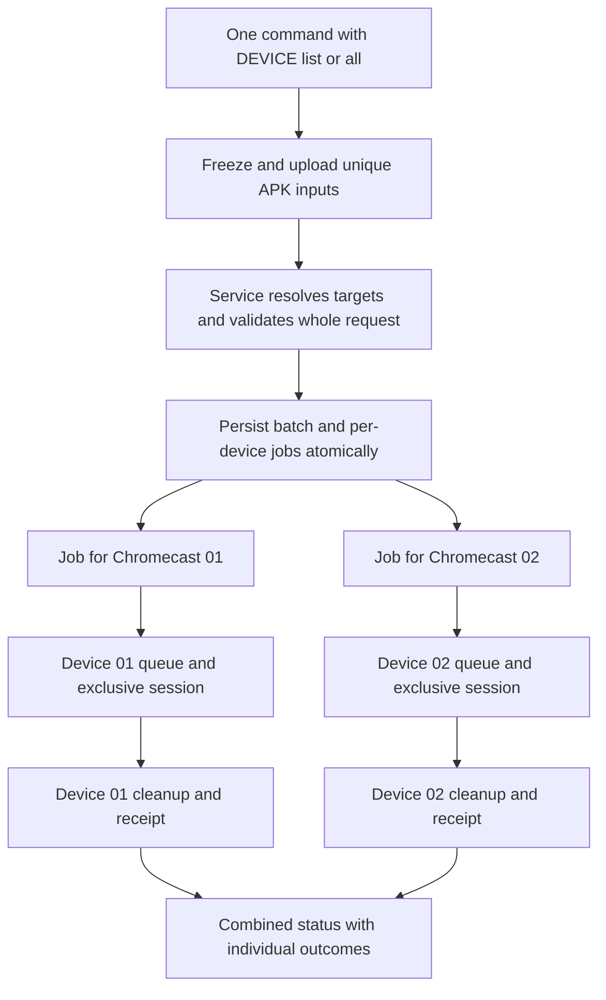
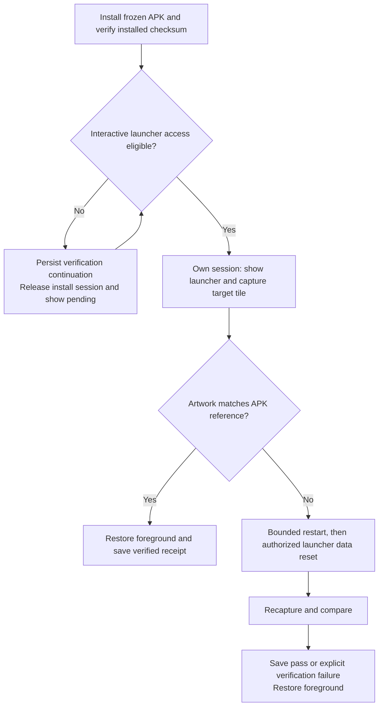

# Plan: Chromecast commands targeting multiple devices

Status: implemented, deployed and verified on both Chromecasts, 2026-10-05. Multiple-device installation, capture and reconnect passed; automatic launcher restart/data-reset recovery repaired stale artwork and both normal Cat-Boom! icons are restored. Full suite: 89 tests passed. Updated to require launcher artwork verification and stale-icon recovery as part of APK installation, for single and multiple devices.

## Intended behavior

Accept multiple device IDs in one `DEVICE` value. Install the same frozen APK on both Chromecasts with one command, verify the launcher shows its updated artwork, and extend this targeting convention to the other device-oriented commands. Preserve the current single-device syntax and the coordinator's ownership, reservation and cleanup rules.

Proposed command for both registered devices:

`task chromecast:submit DEVICE=chromecast-test-01,chromecast-test-02 WORKFLOW=install APP=aquarium APK=/absolute/path/app.apk`

Proposed shortcut for all registered devices:

`task chromecast:submit DEVICE=all WORKFLOW=install APP=aquarium APK=/absolute/path/app.apk`

The comma list also accepts surrounding whitespace when quoted. Normalize whitespace, deduplicate IDs while preserving their first occurrence, and reject empty entries, unknown IDs and mixed `all`/explicit lists. Repeating `DEVICE=...` arguments is not the interface: Task variable assignment cannot reliably represent a repeated option.

`DEVICE=all` resolves to the registered device list once when the service accepts the operation. Print and persist that exact selection; devices added later do not join the operation. Include reserved and disconnected devices in that selection, and report their individual eligibility or setup state instead of silently omitting them. Reject an empty registry. `DEVICE` and `POOL` remain mutually exclusive. `POOL=chromecast-test` continues to select one eligible device.

## Command coverage

| Commands | Multiple-device behavior |
|---|---|
| `submit`, `check`, `profile`, `record`, `capture` | One ordinary owned job per selected device; independent scheduling and cleanup. |
| `readd` | One reconnect job per selected device using its registered discovery information. Explicit `ADDRESS` or `PAIRING_ENDPOINT` requires exactly one device. |
| `devices`, `queue`, `status` | Filter one combined snapshot to the selected devices. Preserve unfiltered behavior when `DEVICE` is omitted. |
| `reserve`, `release` | Apply to the selected devices after validating all targets and ownership; reservations remain owned by the calling session. |
| `watch`, `evidence`, `cancel` | Keep single-job `JOB` behavior; add a separate `BATCH` selector for the jobs created by a multi-device command. |
| `message` | Keep its existing destination job; do not broadcast to other owners implicitly. |

The `cast1` and `cast2` personal-use aliases remain single-device shortcuts. `chromecast:install` provisions the host coordinator, rather than installing an APK, and does not accept device fan-out.

## Admission, persistence and scheduling

Add an authenticated batch submission method. The client uploads each unique APK once, including variant and restore APKs, and submits their immutable hashes with the normalized selection. The service resolves `all`, validates every target and workflow, and writes a batch and its child jobs in one database transaction. A validation failure creates no child jobs. Keep existing single-job submission responses unchanged.

Return a durable batch ID and a device-to-job mapping. Use a session-scoped request token so retrying after a lost admission response retrieves the same batch rather than submitting duplicate installations. Bind the token to the normalized request and frozen input hashes; reject reuse with different contents. Record this mapping in queue/events and expose batch status through the API and dashboard.

Each child is a normal pinned-device request. Do not acquire all devices together or introduce a shared device lock. A busy device waits for its own existing session and cleanup while another device may start immediately. Within each device, retain the existing scheduler ordering. The batch itself holds no device lease.

Reservations remain effective for every child. Install-only jobs retain the background-install exception, reject updating the foreground app, and send no launch or remote input. A reserved device does not block another child's progress. An unhealthy target receives a clear setup outcome, with `readd` available for recovery. Retain variant-benchmark restoration and checksum verification independently for each device.

For multi-device reserve/release, validate every selected device and session owner in one transaction before changing any reservations. Preserve waiting-for-cleanup semantics and idempotent release. Agents must not create or release Will's personal reservations on his behalf.

## Installation includes launcher artwork verification

**Current behavior confirmed from source:** `Adapter.install()` checks the immutable input, APK package/ABI, successful installation and the device's installed APK SHA-256. The install-only branch additionally compares the foreground before and after installation. Neither step examines the actual launcher tile or refreshes its cached artwork. A matching APK hash therefore does not prove the visible icon is current.

Make launcher verification part of `WORKFLOW=install` by default, for both the existing single-device command and the new multi-device form. No separate manual cache-clearing command should be required. Verification covers the TV banner/tile and launcher icon appropriate to the device's launcher, rather than assuming the TV uses the manifest's ordinary icon.

1. Resolve the installed package's launcher activity and expected artwork from the exact frozen APK, including banner, adaptive icon and applicable resource variants. Record resource hashes and the expected rendered reference. Derive the reference from the APK, not a mutable source PNG or a previous launcher screenshot.
2. Once interactive use is eligible, open the actual launcher, locate the target app's tile and capture it. Use the app/component identity to select the tile, allow a bounded loading period, and compare the artwork crop against the appropriate APK reference after accounting for launcher scaling, masking and focus treatment. Retain screenshots, crop coordinates, comparison method and result. If identification or comparison is inconclusive, report unverified rather than passing on the APK checksum alone.
3. If the tile is stale, try a bounded launcher reload/restart under the same owned session, then locate, capture and compare again. If still stale, clear the resolved Google TV launcher's data/cache and reopen it, then capture and compare again. **Will explicitly authorized this recovery on 2026-10-05**, including resetting the launcher's saved home layout/app order. Discover the actual HOME package, restrict resets to reviewed launchers, and record every recovery attempt. Preserve the game's data.
4. If reset/recheck still fails, report `installed / launcher verification failed` with diagnostic evidence and a concrete recovery instruction. Launcher reset is automatic for an identified stale tile; inability to locate a tile alone does not establish staleness. Avoid reinstalling an already verified APK unless evidence identifies a package installation problem. Do not erase the game's data.
5. Restore the previous foreground app when verification finishes and record restoration. Only report fully completed installation when both APK checksum and visible launcher artwork have passed.

### Preserve background installation and reservations

The APK installation stage keeps its foreground-preserving behavior. Showing HOME or restarting the launcher is an interactive operation, so it must respect personal reservations and complete-session ownership even when background installation is allowed.

If interactive verification cannot run immediately, persist the verification continuation on the same job and release the installation session. Show `APK installed; launcher verification pending` and schedule verification when interactive access becomes eligible. Keep the continuation linked to the same installation/batch result; do not require Will to submit another command, hold a device lock while waiting for a reservation to end, or claim final success before verification finishes. A watcher may wait for verification or detach normally. Background installation must not trigger HOME, remote input, launcher termination or playback interruption during a reservation.

A later install of the same package supersedes an older pending verification: compare the installed APK hash before touching the launcher and label the old continuation superseded rather than checking the newer icon against the older reference. Continuation ownership and cancellation follow the original caller's job. Cancellation after installation records `installed / icon unverified`; it does not undo the APK installation.

Each device gets its own icon result, refresh history and screenshots. A batch cannot hide one stale tile behind another device's successful installation. Capabilities must distinguish basic background installation from installation with launcher verification; older services must not advertise checksum-only installation as artwork-verified.

## Following jobs and collecting results

`submit` prints the batch ID and every child job immediately. Convenience commands submit all children before following any of them, then show combined progress. `ASYNC=true` returns after admission. Closing or interrupting a watcher detaches without cancelling submitted jobs.

Proposed follow-up commands:

- `task chromecast:watch BATCH=B-example`
- `task chromecast:status BATCH=B-example`
- `task chromecast:evidence BATCH=B-example OUT=/absolute/path/evidence`
- `task chromecast:cancel BATCH=B-example`

Reject simultaneous `JOB` and `BATCH`, or ambiguous job/batch/device selectors. Batch cancellation validates ownership and requests cancellation of unfinished children; completed jobs remain recorded and active jobs finish cleanup. Watch until every child is terminal and report each result. Return zero only when all children completed successfully; partial failure returns nonzero and preserves successful results. Async submission returns success for admission, not eventual execution.

Evidence downloads use `OUT/<device-id>/<job-id>/` and a root batch manifest containing selected targets, job IDs, states, errors and input hashes. Preserve evidence checksum verification and safe path handling. Show a concise device/job/state table rather than interleaving unlabelled logs. Recipes must not silently override the command's target selection; conflicting selectors are validation errors.

## Implementation and verification

- [x] Extend `scripts/wf_device/client.py` with selection normalization, batch submission, combined watching and evidence collection; add `BATCH` to the Task environment in `Taskfile.yml`.
- [x] Extend `scripts/wf_device/service.py` and `store.py` with authenticated batch admission, durable mappings, retry tokens, atomic reservation operations and filtered queries. Advertise batch support through capabilities; an older service must produce a clear upgrade-required error without partially submitting a list.
- [x] Keep worker workflow requests single-device; update dashboard/API visibility and hook command recognition where needed.
- [x] Implement default install artwork verification, persisted interactive continuations, expected APK resource references and device-specific bounded launcher refresh/recheck. Add distinct installed, pending, verified, failed and superseded results.
- [x] Add meaningful process tests for parsing, unknown/empty selections, stable `all` expansion, repeated-token admission, rollback, owner checks, per-device parallelism, reservations, one-child failure, watcher detachment, cancellation/cleanup and evidence layout.
- [x] Verify legacy target syntax and pool selection remain compatible, while install completion now includes artwork verification. Reject multi-device pairing/address overrides before submitting work.
- [x] Test stale tile recovery, wrong/missing tile detection, inconclusive comparisons, bounded refresh failure, cancellation, restart recovery and superseded APKs. Assert a reserved background installation sends no HOME/input/launcher restart and leaves verification pending.
- [x] Deploy the reviewed service through the documented maintenance/drain path, preserving active sessions, queued jobs and reservations.
- [x] On both Chromecasts, install one frozen background APK through a single command and collect both receipts. Verify foreground preservation, checksums and independent scheduling. Verify visible launcher artwork on both devices, including one deliberate icon update that exercises the refresh/recheck path; archive before/after tile captures and resource references. Exercise capture/readd through owned sessions and record partial-failure behavior using process tests rather than disrupting a TV.
- [x] Update the [service manual](../device-coordinator.md), Task descriptions with the approved syntax and batch follow-up commands.
- [x] Update the [home README](/home/will/README.md) after protected-service deployment and real-device acceptance.

## Source references

- [Current Task commands](../../Taskfile.yml)
- [Task/API client](../../scripts/wf_device/client.py)
- [Request validation and service](../../scripts/wf_device/service.py)
- [Persistent queue and reservations](../../scripts/wf_device/store.py)
- [Background-install policy and deployment plan](2026-10-04-chromecast-background-install.md)
- [Shared coordinator implementation plan](2026-10-03-chromecast-shared-device-coordination.md)

## Prepared implementation and evidence

The service persists a batch and child jobs transactionally, normalizes `DEVICE` lists/all, deduplicates immutable uploads, exposes combined watch/status/evidence/cancel, and applies reservation changes atomically. Installation persists its interactive continuation on the **same job**, retaining its ID and ownership while releasing the background session. The desktop host's system Python has Pillow available for PNG reference and screenshot comparisons. Blank ordinary screencaps fall back to the already-reviewed UI Automation helper; if both captures are blank, the check fails without claiming that artwork is current.

Process tests cover successful parallel batches, retry tokens, atomic rejection/reservation updates, reserved children, cancellation, restart persistence, stale artwork reset/recheck, missing-tile failures and superseded checks. Initial expanded suite: **83 passed**; subsequent launcher recovery tests: **23 passed** in the targeted suites. Full regression suite subsequently passed **86 tests**; the final suite including black-capture fallback tests passed **88 tests** (`pytest -q tests/device_coordinator`, 26.73 seconds).

Reference extraction was checked against the actual Bomberman and Aquarium APKs. On Chromecast 01's existing launcher capture, the Cat-Boom! circular tile matches its frozen APK reference with mean absolute error 11.42, RMS 21.10 and worst-region error 19.10 (48px comparison). This validates that example's image comparison, not the full installation/navigation workflow. Chromecast 02's observational capture was black, so it provides no artwork acceptance evidence. Preflight jobs `J-00fc00d7af56` and `J-32df463794da` completed without input and left both devices ready.

Administrator deployment was attempted with `sudo -n python3 android/bomberman/deploy-coordinator.py`; the host required interactive authentication. No service files were changed by that attempt. Run the reviewed deployment from a terminal, then complete both-device acceptance through the coordinator. Do not claim these source changes are deployed before capability and real-device checks pass.

## Real-device acceptance, 2026-10-05

Will ran the protected installer and reviewed adapter deployment from his terminal. Both devices were ready afterward; device 02 was rediscovered at `192.168.4.54:5555`. One `DEVICE=all WORKFLOW=install APP=bomberman` submitted both jobs and resolved the latest Bomberman APK from its build receipt.

| Batch | Chromecast 01 | Chromecast 02 | Result |
|---|---|---|---|
| `B-680f108a0702` — normal Cat-Boom! install | `J-2b5a71828a95`: checksum and visible icon passed | `J-6e5ee4d7f0ed`: checksum and visible icon passed | Both succeeded independently. |
| `B-dfae27f7dea8` — artwork-only trial | `J-b90ed22b116d`: stale cat tile detected as inconclusive; verification failed | `J-c6b1e9005c21`: stale cat tile rejected; launcher restart then data reset; new trial tile verified | Partial failure exposed a real classification defect; the successful child retained its result. |
| `B-29d91b215624` — normal APK restoration | `J-48b01b19fc82`: normal APK and cat tile verified | `J-a9096e12bf4a`: normal APK checksum passed; cached trial tile remained, verification failed | Both normal APKs restored; device 02 still requires visible-icon recovery. |

The temporary trial changed only the banner/icon PNGs. Its manifest and `classes.dex` were byte-identical to the normal APK, with the same signature and version code. The normal APK hash is `71d079d9c146a20cbdf4529df84bd61f87432915e687fa47f6d665e8c1cafd40`; the trial hash is `8027b8e5abe3bf7bb16350d3ba4112a934adb805e0290070f69301fddcdce312`.

The brightness classifier previously discarded identified tile comparisons whose gain fell outside 0.65–1.3. That correctly prevented a visual pass, but also prevented stale-cache reset by misclassifying a bright/dark mismatch as missing geometry. The fix retains mismatch scores while bounding brightness correction and forbidding a pass outside that range. Reanalysis of Chromecast 01's saved stale tile now produces a real mismatch (gain 0.449, MAE 44.42, RMS 58.29), so reset is eligible. The added regression test and targeted suite passed: **22 tests**. The source/deployed hashes were reviewed before requesting another administrator deployment.

Evidence is under [multi-device diagnostics](../diagnostics/chromecast-multi-device/): `install-both/`, `artwork-test/`, `restore-first/`, `artwork-trial.json` and `brightness-regression.json`. The successful device 02 trial's launcher result records both restart and `launcher-data-reset-and-home`, followed by a verified screenshot. The data reset preserved the game installation and game data, as intended.

- [x] Deploy the brightness fix through the reviewed administrator helper.
- [x] Repeat restoration and verify the normal Cat-Boom! tile on both devices.
- [x] Record the final both-device receipts and mark acceptance complete.

Full regression suite with the brightness-classification fix: **PASS: 89 tests passed** in 26.89 seconds (`pytest -q tests/device_coordinator`).

## Final acceptance and restoration

Will deployed the reviewed brightness fix, and protected adapter hashes match the tested source. Batch **`B-6b2f26d99587`** completed on both devices: `J-c0967ed1190e` (01) and `J-fcf47177949b` (02). Both installed APK checksums match the normal Cat-Boom! build, and both displayed cat icons passed the screenshot/reference comparison.

Chromecast 02 initially retained the bright trial artwork after normal APK installation. The fixed checker recorded it as a mismatch (gain 1.370, MAE 58.82, RMS 73.82), tried a launcher restart, then reset launcher data and rechecked. The normal cat tile then passed (gain 0.822, MAE 11.29, RMS 13.19). This is direct device evidence that installation repairs a stale launcher tile instead of treating APK bytes as proof of visible icon freshness. [Final per-device evidence](../diagnostics/chromecast-multi-device/restore-verified/batch.json).

Additional accepted batches: **`B-c50e36d95202`** for `readd DEVICE=all`, and **`B-c62c15250502`** for comma-list `capture`; both completed on both devices and the capture client downloaded evidence into separate device/job directories. `devices DEVICE=id,id` and `queue DEVICE=all` also worked. Reservations and cancellation/partial-failure behavior are covered by process tests, without creating personal reservations on Will's behalf.

The normal APK is restored on both devices, no trial artwork remains, and all submitted sessions completed cleanup. Service/manual and home README commands now describe the deployed behavior. No further implementation or device acceptance work remains in this plan. General coordinator enforcement certification remains in its separate existing plan.
