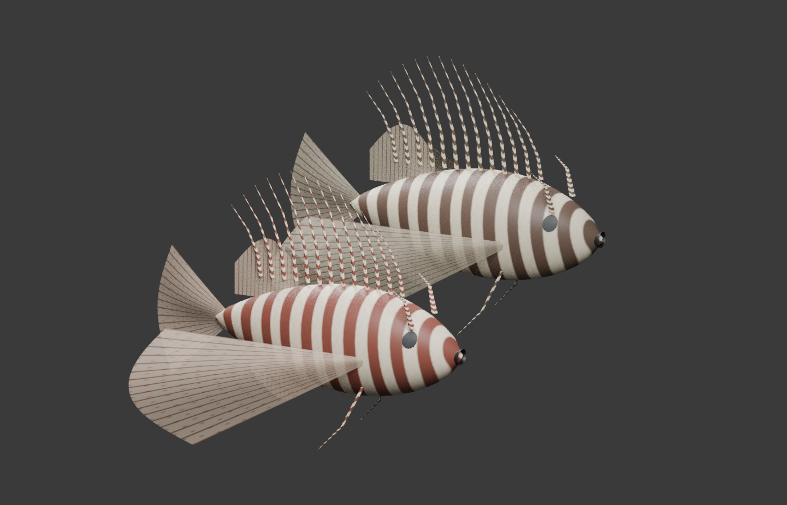
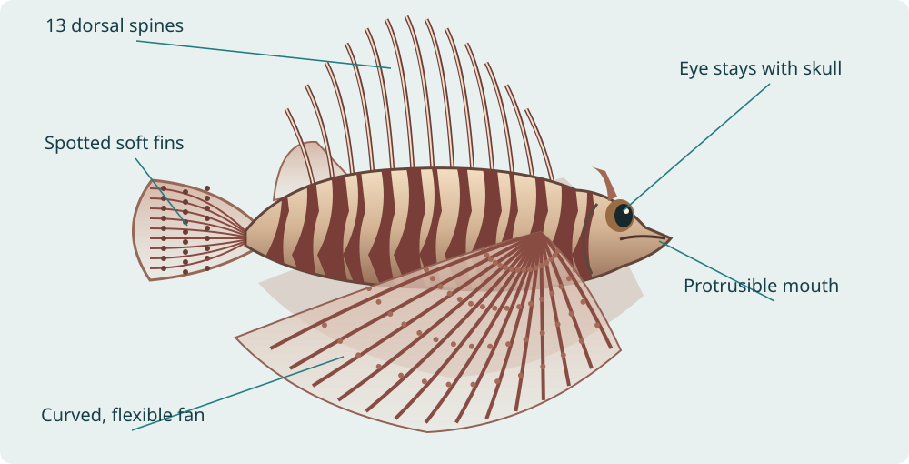
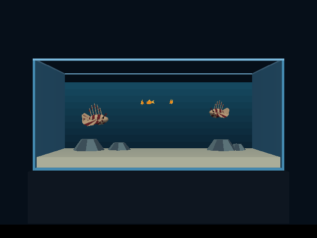
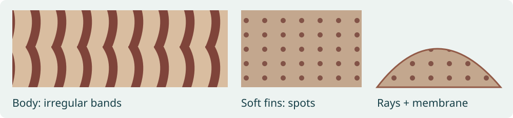
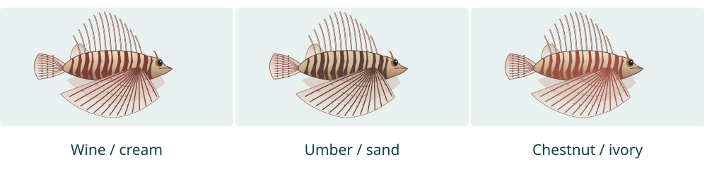
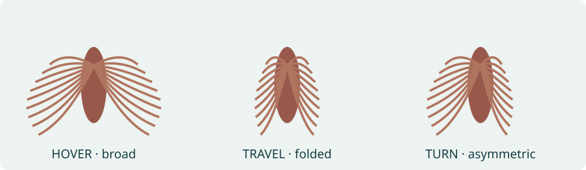
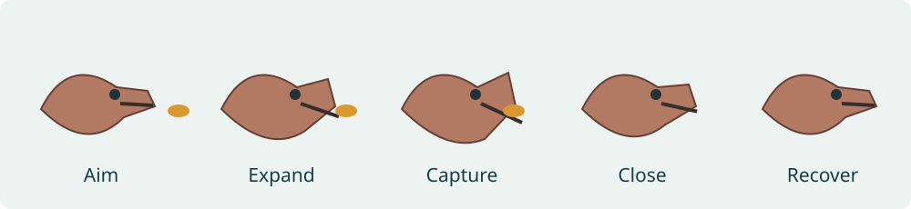
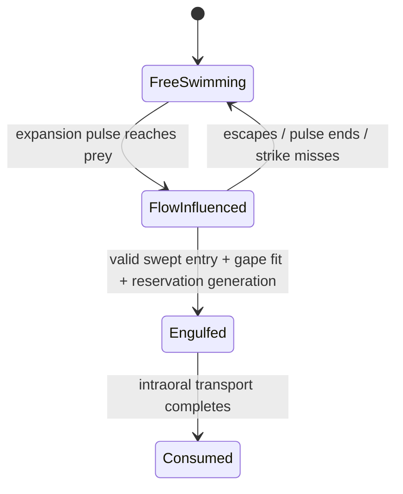
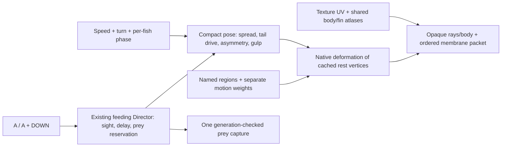

# Lionfish: realistic silhouette, texture maps and coordinated animation

Status: **native single-mesh rig, shared texture palettes and suction feeding implemented; installed on both Chromecasts; device profiles and selector checks complete**.
Research checked 5 October 2026. This extends the implemented
[goldfish feeding plan](2026-10-02-lionfish-goldfish-feeding.md).

Will approved the concrete [engine integration scope](2026-10-05-lionfish-realism/engine-integration-proposal.md)
with “implement”, then approved the separate debug-bridge command initialization
and bounds fix with “go ahead”. The standing requirement to discuss and obtain
permission for future World Foundry engine changes remains in AGENTS.md.

The two red lionfish now use one 4,068-triangle visible mesh each, including
13 dorsal, three anal and paired pelvic spines; two shared 256² maps; stable
wine/cream and umber/sand palettes; curved pectoral membranes at 0.55 opacity;
selective jaw/skull/throat motion; and transient local suction. The Director
keeps prey swimming before swept mouth entry. Intraoral transport completes
consumption. A + DOWN release, three-prey limit, proximity + A eating, delayed
visual detection and escape from actual approaching predators remain.

[Implementation report, runtime captures, checks and profile comparisons](2026-10-05-lionfish-realism/implementation-report.md)
· [Runtime feeding assertions](2026-10-05-lionfish-realism/runtime/checks.json)
· [57 checks in the integrated checkout](2026-10-05-lionfish-realism/implementation-tests.txt).




## Poster and review visuals

[A3 portrait PDF](../reference/lionfish-biomechanics-poster/poster.pdf) ·
[browser poster](../reference/lionfish-biomechanics-poster/poster.html) ·
[print preview](../reference/lionfish-biomechanics-poster/poster.png) ·
[editable generator](../reference/lionfish-biomechanics-poster/make_poster.py).
The poster is 297 × 420 mm, with cited research, game settings, original
schematics and an actual engine capture labelled separately. The illustrations below are **concept diagrams**, not
finished mesh renders or photographed animals. The poster includes an actual engine capture; Blender pose studies and device
captures are linked in the implementation report.





## Historical feeding baseline

The lionfish branch of `wflevels/aquarium_tanks/models.py` makes an ellipsoid
body, colour bands from face groups, **five** dorsal spines, and two flat fans
with **six rays each**. Feeding uses six visible pieces per fish: body, tail,
two fans and two mouth halves. `lionfish_mouth.py` trims the original head by
face-number ranges, then supplies hinged half-head meshes with dark caps.
The pose generator rotates whole fans and the tail with `tk-gait` and expands
the body slightly. It does not create a travelling curvature across each fan.

The historical feeding action was 0.26 s, with timer-driven capture at 0.10 s.
The new action retains the 0.26 s envelope but captures on actual mouth entry. The current
feeding baseline has 41 tank actors, including three goldfish slots; those slots
are pooled even when empty. Each mouth half exports 47 vertices/90 triangles;
the goldfish exports 80 vertices/110 triangles. These are recorded counts from
the earlier feeding build, not a new measurement of today's complete lionfish.
Re-export and inventory the exact baseline before implementation/profiling.

## Research and decisions

| Evidence | Change to model or animation | Limits |
| --- | --- | --- |
| Galloway & Porter (2019): 13 dorsal, 3 anal and one spine on each pelvic fin; tapered spines have regional mechanical differences. | Restore the count and taper; separate rigid-looking spines from flexible soft membranes. Add pelvic/anal anatomy. | Do not treat every fan ray as a venomous spine, or drive spines with the same floppy wave as membrane tips. |
| Florida Museum: irregular red/white banding, spotted soft fins and fleshy head tabs. | Replace polygon colour rings with UV-painted, uneven bands; add restrained head detail, spotted tail/soft fins and a visible gill cover. | Pattern and head tabs vary between animals; choose a consistent reference phenotype. |
| Kolonay & Glaspie (2025): relaxed, traverse and strike behaviors differ in speed and fin posture. | Broad fins while hovering; fold fins/spines back for faster travel; stronger short caudal strokes for travel. | Field speed means are physical measurements, not game-world velocities or measured fin frequencies. Small strike sample. |
| Turingan & Sloan (2016): suction capture coordinates gape, hyoid depression, cranial and jaw rotation. | Lower-jaw depression, modest head lift, mouth protrusion and throat expansion, then fast closure/recovery. Eyes remain attached to the skull. | Extract timing from the lionfish footage, not from another species or a generic chewing loop. |
| Peterson (2022), primary thesis: persistent pursuit heads toward the prey's present position. | Resident should stalk smoothly and present fins during approach; reserve the sudden action for a close strike. | Existing detection/occlusion remains; the fish does not know about newly dispensed prey immediately. |
| Bottacini et al. (2026): water jets can influence prey orientation in P. miles. | Record as an optional future behavioral extension. | Different species; no automatic jet effect or universal prey response in this P. volitans update. |

Primary sources:

1. [Galloway & Porter, 2019, Journal of Experimental Biology](https://pubmed.ncbi.nlm.nih.gov/30814293/) — anatomy and spine mechanics; DOI 10.1242/jeb.197905.
2. [Florida Museum, red lionfish profile](https://www.floridamuseum.ufl.edu/discover-fish/species-profiles/red-lionfish/) — identification/pattern reference; use photographs as references, not unlicensed texture copies.
3. [Kolonay & Glaspie, 2025, PeerJ 18474](https://peerj.com/articles/18474.pdf) — original field study. Relaxed 44.75 ± 15.46 mm/s (15 events), traverse 138.99 ± 48.66 (12), strike 625.44 ± 66.94 (5). Events need not be independent fish; do not convert them to an anatomical constant.
4. [Turingan & Sloan, 2016, feeding kinematics](https://pmc.ncbi.nlm.nih.gov/articles/PMC5192426/) — lionfish sequence/kinematic variables; distinguish temperature treatments from game settings.
5. [Peterson, 2022, UC Irvine primary thesis](https://escholarship.org/uc/item/89n1p8wt) — persistent pursuit and species-dependent evasion.
6. [Bottacini et al., 2026, Behavioral Ecology](https://academic.oup.com/beheco/article/37/5/arag087/8741288) — jet-blowing experiments in P. miles, not a measured P. volitans animation template.

## Model and texture design

Author one cohesive fish mesh with separate deformation regions for skull,
lower jaw, protrusible mouth/throat, trunk, caudal fin, left/right pectorals,
soft dorsal/anal/pelvic fins and dorsal spines. These regions can be disconnected
geometry islands in one draw mesh; they do not require individual game actors.
Use named regions/weights, not fragile assumptions about face indices.
Implemented LRIG v1 preserves region, weight and pivot independently of UVs
through exported vertex duplication. The model exports 2,496 vertices and
4,068 triangles; 2,503 authoring vertices include collapsed/unused roots.

Start at **3,000–6,000 triangles per fish** as a modelling budget, not a biological
requirement or a promised performance result. Add radial segments along rays and
root-to-tip segments across curved fan membranes. Keep long dorsal spines
slender/tapered, with variable lengths; model the soft dorsal separately.
Round the tail silhouette and form a real mouth cavity/gill-cover contour.
Do not subdivide the body repeatedly while leaving fin motion rigid.



Use one **256 × 256 opaque body atlas** and one **256 × 256 fin atlas** shared by
every animal, including future lionfish. **The texture maps, UVs, bands, spots,
detail and alpha are identical between fish; only the palette changes.** Give body islands enough texel area for the head/band boundaries;
give soft fins rays and spots plus **translucent membranes using the existing
renderer capability**. Bake subtle scale
and gill detail into the supported colour map, without baked highlights that
fight runtime lighting. This is two 256 KiB RGBA8 images, 512 KiB together before
mips/compression; count actual uploaded format/memory. Generate 512 candidates
only for a side-by-side close-up review and measured cost/benefit.

### Same texture, individual palettes



Assign the two current fish visibly different, plausible palettes: wine/cream
and umber/sand. Chestnut/ivory is a third proposal for future fish. These names
describe art choices, not different species or measured color morphs. Preserve
dark eyes, subtle highlights and the readable ray/membrane contrast.

Represent the source maps as shared palette-role masks plus tonal detail and
coverage, or shared albedo plus a shared role mask. Pass palette colors/index
per instance to the native material path. Select the exact encoding after
checking exporter/material support; do not generate recolored PNGs or duplicate
textures per fish. With role masks, preserve fin alpha and tonal detail, and
ensure filtering blends colors rather than interpolating discrete palette IDs.
Texture memory must remain constant as the population grows. Record any shared
mask/LUT cost separately; the two-atlas 512 KiB estimate above is the base
proposal, not a promise including additional mask resources.

Choose a palette once from the tank seed and stable fish ID, then retain it for
that fish's lifetime. Give new fish a palette through the same spawn helper,
and resolve identical neighboring assignments when alternatives exist. Larger
populations may repeat palette families; bounded parameter variations provide
individuality without requiring unlimited distinct materials. Do not change
colors with motion, LOD, eating or reloads under the same seed/ID. Add tests that
the same fish reproduces its palette, the initial pair differ, new fish use the
shared maps, and palette state does not leak between instances. Profile draw
grouping/material updates as well as texture memory.

Texture UVs must **remain texture coordinates**. The existing betta native fin
path stores motion weights in the UV channel; reusing it unmodified would
corrupt patterned textures. Cache weights from a separate exported attribute,
or a validated region-local rest-coordinate mapping. Preserve both mappings
through Blender/exporter and OpenGL/GLES/WebGL paths. Share immutable atlases
and rest geometry while retaining per-instance pose state.

Translucency is already available: reuse the established translucent material
path, including the jellyfish precedent. Use opaque rays plus thin translucent
membrane regions; aim for one opaque and one blended
material packet per fish. Check both face directions and back-to-front sorting.
Palette substitution must preserve the shared texture's alpha/coverage channel.
This is a compositing/appearance validation step, not a capability-discovery task.
If sorting artifacts remain, try a lower-overlap mesh/cutout alternative and
document the quality difference before adding rendering complexity.

## Motion and feeding



Blend hover, travel, turn, stalk and strike continuously. Hover is restrained:
small fin-tip movement and gentle station keeping, without an always-busy tail.
Travelling narrows the silhouette and increases tail drive. Turning adds a
left/right bias and delayed tip response rather than snapping the whole fan.
Keep each fin root fixed to the fish, and derive every pose from cached rest
vertices to avoid accumulated deformation. Separate the two fishes' phases.
Treat wave amplitudes, lag and frequencies as art settings until footage fits
them; do not import betta/clownfish frequencies as lionfish measurements.



The gulp runs once: aim → expand/protrude → capture → close → recover. Keep the
current **0.26 s total / 0.10 s capture** as the first compatibility trial;
reference footage may justify retiming. They remain game choices. The throat
expands briefly and recovers; eyes and most of the skull do not peel into head
halves. Maintain reservation/slot-generation checks, one capture event, and
missed-strike completion without eating. Author state entry/exit envelopes so
turning, pausing or being near glass cannot restart a gulp or move through glass.

### Suction influence first; capture ownership only at mouth entry


These trajectories use the implemented helper and illustrative pulse settings;
they are game-model diagnostics, not measured lionfish flow.
[Reproduction script](../../wflevels/aquarium_tanks/plot_lionfish_suction.py).

**Expansion does not attach or take control of the goldfish.** The existing
feeding Director remains the single movement writer for prey throughout all
states. The lionfish publishes its moving mouth pose, gape and expansion rate;
the Director combines prey swimming/escape with the brief local suction field.
Strike reservation is bookkeeping to avoid double capture, not a movement lock.

Replace the current `gf-strike-tick` coordinate interpolation (`dt * 10` toward
the mouth) with velocity/acceleration integration. It currently starts at
0.06 s and moves the prey's X/Y/Z independently toward the mouth. That shortcut
is specifically excluded from the new rig.

Research on suction-feeding fishes shows rapidly declining flow away from the
mouth and a strong interaction between jaw protrusion, flow acceleration and
prey distance. Those flow measurements are from other species: they justify
the mechanism, **not lionfish-specific force constants or a universal suction
radius**. [Day et al., original bluegill flow measurements](https://pubmed.ncbi.nlm.nih.gov/16000536/),
[Holzman et al., jaw protrusion and prey forces](https://pmc.ncbi.nlm.nih.gov/articles/PMC2607355/).

Use a cheap, explicitly approximate transient flow model rather than full CFD:

- Drive flow strength with positive buccal/throat expansion rate and changing
  gape, including a short rise/peak/decay. An open mouth held still is not a
  perpetual vacuum. Protrusion moves the aperture and changes prey distance.
- Evaluate a smoothly bounded converging field in front of the actual mouth,
  scaled by current gape and rapidly weakened with distance. No pull from behind
  the skull, through a rock/glass, or across the tank. Avoid a hard switch at the
  field boundary and a singularity at the mouth center.
- Keep prey velocity, inertia and active escape effort. Integrate acceleration
  from flow-relative drag and a bounded flow-acceleration/pressure-gradient
  approximation, alongside its swimming drive. Coefficients are tunable game
  approximations, not fitted lionfish hydrodynamics. Apply the same local field
  to other nearby live prey; a reservation does not make water selectively pull
  one fish. Capture remains limited to the generation-checked reserved target.
- Mouth movement plus converging flow and the prey's starting velocity produces
  a curved, accelerating off-axis entry. Let orientation respond with bounded
  angular acceleration; do not snap the fish nose-first or impose a spiral.
  A centered, aligned entry can naturally be nearly straight: prohibit constant
  speed/linear position tweens, not physically plausible straight trajectories.
- Use bounded internal substeps for the short pulse, independent of rendering
  cadence. Reevaluate mouth pose and sweep mouth/prey entry between steps, so
  a low frame rate cannot skip suction or tunnel through the capture plane.

The proposed integration, with variables defined in the moving mouth frame,
is `v += (swim_accel + drag(u_flow - v_relative) + flow_accel_term) * dt`, then
`position += v * dt`. It is a visual physical approximation, not a claim to solve
the fluid equations. Profile its native/script cost with at most three live prey.

**Capture is a spatial event**, not automatic eating at 0.10 s. That time is a
starting target for the animation envelope. Require the reserved prey to cross
the current open aperture/capture plane, fit the gape, and still match its slot
generation. If it escapes, misses the aperture or is blocked, finish the strike
without consuming. Only after valid entry switch that prey to an engulfed state:
its short intraoral motion follows the mouth/buccal flow, escape drive ends and
the fish disappears inside the mouth as closure completes. Hold the slot until
that visual transport finishes so a newly dispensed fish cannot reuse it early.
Maintain one consumption event and cancel/release stale reservations safely.



Review close-up trajectories from centered and off-axis starts, transverse
escape, changing mouth heading, blocked flow and failed strikes. Overlay
mouth/aperture, flow vectors, prey position/velocity and capture-plane crossing
in diagnostic footage; keep these overlays out of normal play. Compare 20/30/60
Hz and a frame hitch for the same seeded strike. Acceptance requires visible
acceleration, retained pre-capture escape, curved off-axis convergence, coherent
engulfment and no remote pull, teleport, repeated eating or reservation-driven
position locking.



The goal is **one visible mesh actor per fish**, with deformation and jaw motion
handled natively in the same asset. One mesh may still produce two material
draws. Reuse the rest-cache approach in `fin_deform.h`/`fish_deform.h`, not the
entire betta parameterization. Count controller/root actors separately from
visible actors. If one-actor export/renderer changes prove broad, evaluate that
cost explicitly before retaining temporary multipart assets.

```forth
\ Compact blend helper; lion-pose is the implemented native word.
: lf-blend ( now target alpha -- next )
  >r over - r> * + ;
\ alpha is clamped/time-dependent; blend per fish.
\ publish phase/spread/turn/gulp once, native code poses vertices.
```

Allocate a documented per-fish pose block only after checking the mailbox map.
Preserve feeding allocations 930–978, 1000–1047, 1050–1073, 1100–1109 and
1200–1231 unless an intentional migration updates every producer/consumer.
No per-ray mailbox/actor loops. Every pose field gets one named owner and reader.

## Phases and profiling

1. **Baseline + reference poses.** Freeze current normal APK, count geometry,
   visible/root/controller actors, draw packets and texture memory. Capture
   side/front/three-quarter hover and the existing gulp. Review real reference
   footage and list anatomical landmarks. The A3 research sheet is ready now.
2. **Model + texture trial.** New rest mesh/UV maps; compare silhouette at tank
   distance and close-up. Ensure fin front/back visibility and alpha over sand,
   rock, body and the opposite fin. Keep behavior stable while measuring asset
   cost; record any transitional rig actor count.
3. **Continuous fin + head rig.** One visual actor, separate deformation weights,
   smooth posture blending and coordinated suction capture. Verify player and
   resident behavior, collisions, sensing delay and all three goldfish slots.
4. **Tune + integrate.** Compare 256/512 and any membrane fallback only if visual
   review requires them. Rebuild the full selector, verify return-to-menu and
   unrelated tanks, refresh the poster with actual exported-model/engine/device
   panels. Install only after implementation is authorized.

Profile through `task chromecast:*` on **both** devices, sequentially per device.
Use the same camera, tank, two lionfish and 0/3 live goldfish scenarios; warm up
15 s, record three 30 s samples per scenario/version. Include a scripted
approach/gulp segment once a reviewed coordinator trace supports it; save raw
input timelines, build SHA, samples and receipts. A screenshot is not a profile.
Compare per-device medians and p95/p99 pacing, plus script/pose/native deformation
and render CPU time where instrumentation permits. Unavailable metrics stay
marked unavailable; do not infer actor cost from FPS alone. Add no new physics
bodies. The existing 41-actor feeding build is historical, not a new result.

The measured final build has 4,068 triangles per fish, 31 tank actors, two
visible lionfish actors and 18/21 total frame draws with zero/three active prey.
Cast1 retains ~30 FPS; cast2 averages ~40 FPS against ~60 FPS in the controlled
baseline. Native animation is 0.45–0.61 ms/frame; render submission/waits are
the principal added cost. Detailed per-device CPU, pacing, memory and delta
[tables and raw evidence](2026-10-05-lionfish-realism/profile-comparison.md)
replace the original pending measurement table. No optional 512² source-map
trial was needed: both deployed maps remain 256².

Protocol note: the controlled baseline and first implementation used three
12-second presentation windows, while intermediate/final builds use three
30-second windows, all with 15-second warmup. This differs from the original
all-30-second proposal; durations are stated alongside the data. Separate
instrumented CPU runs use their final complete ~5-second window, excluding
older log sessions. Feeding cadence/generation behavior is tested separately;
no custom coordinator feeding trace or isolated GPU timing was added.

## Acceptance and ownership

Runtime implementation, automated checks, device profiles and full eight-tank
selector/Home/resume checks are complete on both Chromecasts.
[Exact comparisons and limitations](2026-10-05-lionfish-realism/profile-comparison.md).

- [x] New sourced A3 portrait research/proposal poster, diagrams and this plan.
- [x] Side/front/three-quarter mesh review: anatomical spines, rounded body/head,
  curved fans, spotted soft fins; no intersecting rays or disconnected jaw gaps.
- [x] Texture UV and motion weights survive export separately; no white-texture
  regression, alpha sorting failure, missing backfaces or hard baked highlights.
- [x] Every lionfish uses the same texture maps with its own stable palette;
  current pair differ, future spawn assignment works and texture memory is shared.
- [x] Hover feels calm; travel folds the silhouette; tips lag during turns.
- [x] One whole gulp, coherent throat/mouth/skull motion, no repeated chewing;
  correct miss/reservation/capture behavior at low and high frame rates.
- [x] Suction uses local, transient flow and velocity integration; prey remains
  free before actual mouth entry, off-axis paths converge naturally, and no
  direct coordinate lerp or capture-by-timer replaces the spatial event.
- [x] Both devices profiled with deltas; independent per-fish animation and no
  per-ray actor/mailbox overhead; no new physics bodies.
- [x] Poster updated again with actual implementation captures and final adopted
  constants; all remaining illustrative curves explicitly labelled.

Prefer isolated new `lionfish_model.py`, texture/rig helpers and native lionfish
deformation code. Shared `generate.py`, exporter/material support and selector
packaging need a narrow integration diff. Preserve other tanks and ongoing
unrelated work; do not rebuild shared outputs during concurrent level editing.
Record export/build/profile commands and dependencies in the lionfish toolkit
README when implementation lands.
