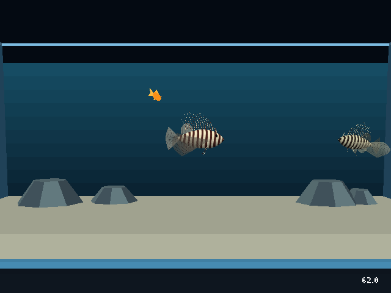
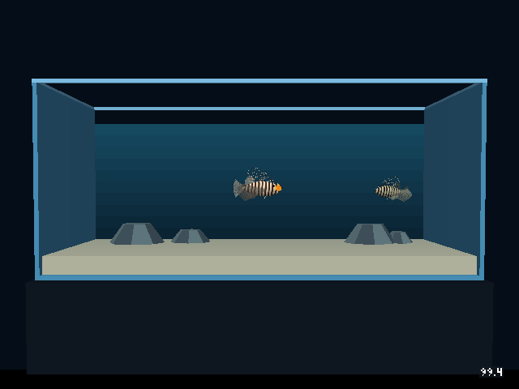
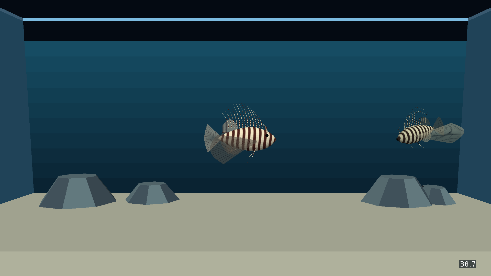
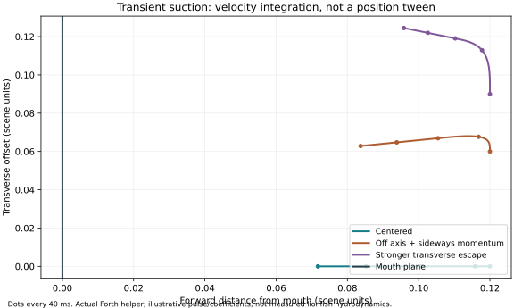
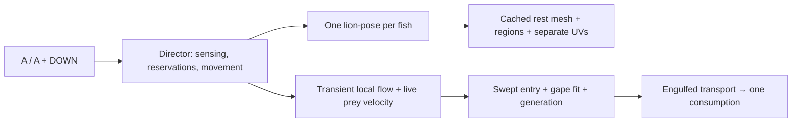

# Implemented lionfish rig, textures and suction feeding

The lionfish tank now uses **one visible mesh actor per fish**, 4,068 triangles,
shared texture maps with stable individual palettes, selective native fin/head
motion and a spatial suction/capture sequence. The approved changes are
integrated into the primary checkout; unrelated Bomberman changes are preserved.
The standalone level and eight-tank Android bundle have been rebuilt.

[Whole gulp](runtime/mouth-rest.png) → [open](runtime/mouth-open.png) →
[capture](runtime/mouth-capture.png) → [recovered](runtime/mouth-closed.png).
[Natural resident chase trace and assertions](runtime/checks.json).

## Mesh, materials and animation

| Property | Exact historical feeding asset | Implemented asset |
| --- | ---: | ---: |
| Visible pieces per fish | 6 | 1 |
| Exported triangles per complete fish | 844 | 4,068 |
| Tank actors, including three pooled prey | 41 | 31 |
| Texture pattern | polygon/material bands | shared irregular bands, ray/detail and spots |
| Body/fin source maps | small palette swatches | two 256 × 256 grayscale RGBA8 maps |
| Palette assignment | face/material colors | stable fish ID selects dark/light endpoints |
| Soft fins | articulated whole pieces | curved membranes with travelling tip response |
| Mouth | hinged half-head pieces | selective jaw, skull, protrusion and throat regions |
| Capture | timed event with position interpolation | swept open-aperture entry, then intraoral transport |

The authoring mesh has 2,503 vertices; seam/root canonicalization exports 2,496.
It includes 13 dorsal spines, three anal spines and paired pelvic spines.
LRIG v1 carries region, weight and pivot independently of UVs. Metadata follows
UV seam duplication and canonicalization. Adding Blender attribute layers can
invalidate earlier RNA handles; the exporter/toolkit re-fetches the attributes
before writing. Region/UV correspondence is tested on the actual exported model.

`lion-pose` receives phase, drive, turn, gape, packed dark/light colors and actor
index once per fish. Each instance poses cached immutable rest vertices; fin
roots stay fixed. Travel narrows the fans and folds spines, turning biases the
left/right tips, and tail drive rises with movement. Gulp depresses the lower
jaw, lifts/protrudes the head slightly and expands the throat. Eyes remain on
the skull. Closing returns to the rest geometry without accumulated drift.

Both fish sample the **same** body/fin image data. `palette_for(seed, fish_id)`
assigns wine/cream, umber/sand or chestnut/ivory; adding fish through the tank
generator uses that helper. This level does not introduce a runtime fish-spawn
factory. The source textures stay grayscale and identical for every instance;
the renderer maps the sample between each fish's two endpoints. Translucent
membranes use existing material opacity **0.55**, with unchanged opaque alpha
in both texture maps. All palettes share the same source alpha and constant material opacity.

[Editable Blender study](assets/lionfish.blend) · [hover](assets/hover.png) ·
[travel](assets/travel.png) · [turn](assets/turn.png) · [gulp](assets/gulp.png).
Blender lighting and shape-key studies are authoring previews; actual runtime
captures above establish native integration.

## Suction and capture

The Director remains the sole prey movement writer. A strike reservation never
attaches or immobilizes a goldfish. Its swimming velocity and escape continue
while a short, local, mouth-aligned flow field changes acceleration. Distance
attenuation is rapid; behind-head or blocked prey receives no suction. Other
nearby unreserved goldfish feel the same field, without becoming capture targets.

The helper is a game approximation with bounded drag/flow acceleration and up
to ten 5 ms internal steps per tick. It is not fitted lionfish hydrodynamics.
Centered entry can be straight; off-axis prey retains sideways momentum and
curves toward the aperture. [Reproduce the diagram](../../../wflevels/aquarium_tanks/plot_lionfish_suction.py).

Actual swept aperture entry requires sufficient gape, body-fit clearance,
line of sight, reservation ownership and the same slot generation. Only then
is prey engulfed; intraoral flow transports it into the mouth and completes
one consumption event. Slots stay held until transport finishes. The 0.26 s
whole-gulp envelope remains; 0.10 s is a historical animation target, **not an
automatic capture deadline**. Missed or stale-generation strikes finish without
eating. The resident pursues the last observed prey position and preserves
tangential movement at the water surface instead of freezing horizontally.

Feeding/sensing/strike allocations are retained. New Director-only transient
flow scratch is **1300–1347**; no per-ray mailboxes or new physics bodies were
added. [Current actor/mailbox map](../../../wflevels/aquarium_lionfish/actor-map.json).

## Verification and approved scope

**57 tests pass** in the integrated checkout, covering asset export, palette
stability, actual Forth flow and feeding, 15/20/30/60 Hz gulp behavior,
generation safety, misses, sight/rock occlusion, independent poses, rest recovery,
complete posed silhouettes at glass boundaries, common translucent sorting,
palette-only batch preservation and existing fish/swim deformation/tank checks.
[Full output](implementation-tests.txt).

The actual Linux engine passes release limit/held-button checks, proximity + A,
one complete gulp, slot reuse, delayed sight, natural resident chase/consumption
and escape from actual moving threats. This recorded release was noticed after
0.6 s; that sample is evidence of the delay, not a new universal constant.
The posed full mesh fits the tank over sampled yaw/pitch/roll, drive, turn and
gape extremes. [Runtime assertions](runtime/checks.json).

Will approved [the concrete rig/material/Forth scope](engine-integration-proposal.md)
with “implement” and the separate debug-command initialization/bounds fix with
“go ahead”. Linux and both Android ABIs build. GL/GLES runtime is tested;
Metal source mapping is updated, but Apple and WebGL runtime are unverified.
The retired fixed-function renderer has no palette shader. Unflagged materials
retain the original sampling path. The other seven standalone tank payloads
are byte-identical to the baseline.

[Updated A3 portrait poster](../../reference/lionfish-biomechanics-poster/lionfish-biomechanics-a3.pdf)
includes the actual engine capture, implementation constants, the Forth
interface and cited research; it is one 297 × 420 mm page.

## Profiling protocol and evidence

Original stock APK: SHA-256
`79433b3c5e80625b13b4bf566e8fd941185affd62f779488ad30bab775f7c1d5`.
The initial three 30-second stock runs are retained in [baseline evidence](baseline/batch.json).
Cast2 included one 30 FPS run among two 60 FPS runs, so these are not pooled with
the later matched comparisons.

Controlled baseline/first full implementation: [batch B-0f8d52c91422](profiles-first-trial/batch.json),
three **12-second** presentation runs with 15-second warmup, plus separate
instrumented CPU variants. Baseline and updated variants contain the same other
tank payloads. Each has two lionfish and zero or three live goldfish. Fixed
three-prey variants disable resident auto-capture so the population stays three.
The normal restored APK retains resident feeding.

An intermediate palette-attribute trial, [B-edf562de0055](profiles-palette-attributes/batch.json),
uses three 30-second runs. That alone did not solve batching: the compositor
still replayed lighting/fog setters on palette changes. The final build also
skips that replay for palette-only state changes, and is measured separately.
Do not mistake the intermediate recipe's `optimized-*` labels for the final
accepted build; build hashes and batch IDs distinguish them.

Final build: **B-483e17a947be**, three **30-second** presentation runs per
scenario/device, 15-second warmup, with separate 30-second CPU runs after a
5-second warmup. The longer final windows improve pacing coverage but are not
identical in duration to the 12-second controlled baselines. CPU figures use
only the last complete approximately five-second window in each instrumented
run. Appended logs include earlier sessions; averaging all log lines would
contaminate the comparison. Sections overlap (pose contains native animation;
Director contains its script work), so never sum them. Render time includes
submission/driver waits; it is not an isolated GPU execution measurement.

The first full implementation generated about 1,000 draw calls per frame:
globally sorted fins alternated palettes stored in uniforms. Per-vertex palette
endpoints plus a compositor palette-only fast path preserve ordering and reduce
that overhead without changing mesh, textures or fin opacity. The profile
counters below establish the resulting draw count.

Presentation, CPU, memory and delta tables follow in [profile comparison](profile-comparison.md).
[Machine-readable summary](profile-summary.json) ·
[Reproducible preparation/summary tool](../../../scripts/profile-lionfish-realism.py).

Packed texture pages are 512² to fit the two **256² source maps** plus the
small prey palette. Aquarium arguments configure a 2048 × 1024 buffer and 512²
transient/permanent slots, using existing engine options. The source images
are 512 KiB RGBA8 together; each uploaded full 512² page is 1 MiB RGBA8 before
any driver overhead. Configured capacity is not measured GPU residency. PSS
is a process snapshot and does not isolate texture allocations or GPU memory.

## Final device installation and selector validation

[Final selector batch B-97e9624e60fe](menu-final-check/batch.json) passes all eight
scene entries, Back from each scene to the selector, Home/resume without process
replacement and Back from selector to leave the activity on both Chromecasts.
The Betta animation assertion reports **3,435 changed center pixels on cast1**
and **868 on cast2**, above its unchanged 500-pixel threshold.

An earlier check of the first full implementation stopped at that threshold
([original evidence](menu-check/batch.json)). The original APK subsequently
passed the same check on cast2 ([baseline assertions](menu-baseline-check/assertions.json));
the final APK passes on both. No Betta asset, animation setting or validator
threshold was changed to obtain the pass. Keep those earlier failures as
recorded observations rather than claim they never happened.

Both final profile receipts report completed sessions with verified cleanup;
the benchmark restored and SHA-verified normal APK
`ddeeeb889eac5201527c9129e4b8f653901ebe76f16b3c84e367eabe0e191d77`.
The final menu checks use that same normal APK. The primary build artifact is
`android/app/build/outputs/apk/aquarium/release/worldfoundry-aquarium-release.apk`.
The shared coordinator owns all install/input/capture/profile work; no raw
Chromecast commands or personal reservations were used.

Only the discussed rig/material/Forth integration and explicitly approved debug
bridge fix changed engine code. The engine-permission rule remains in AGENTS.md.
Source, generated lionfish assets, plan, poster and raw evidence are integrated
for review. 
