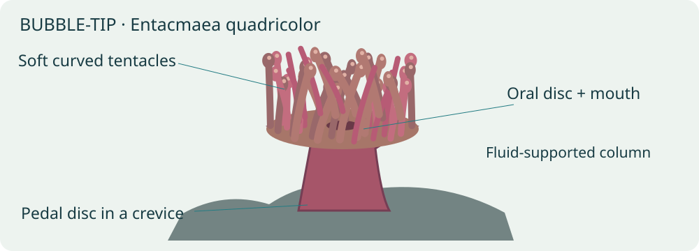
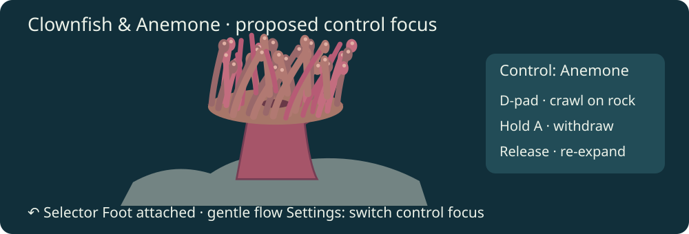
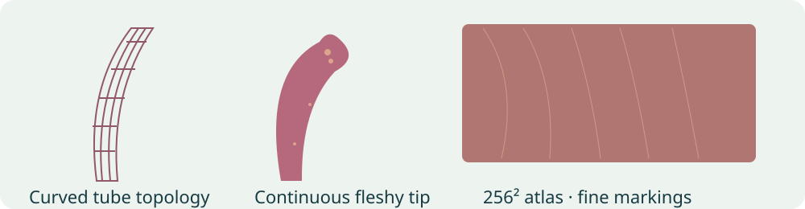
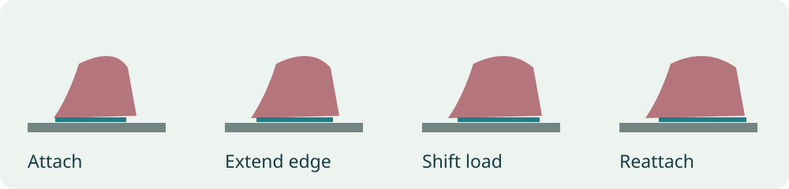
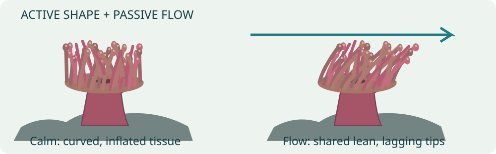
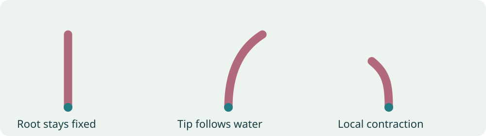
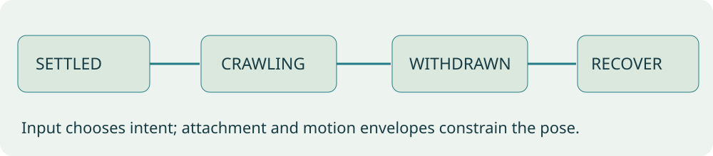
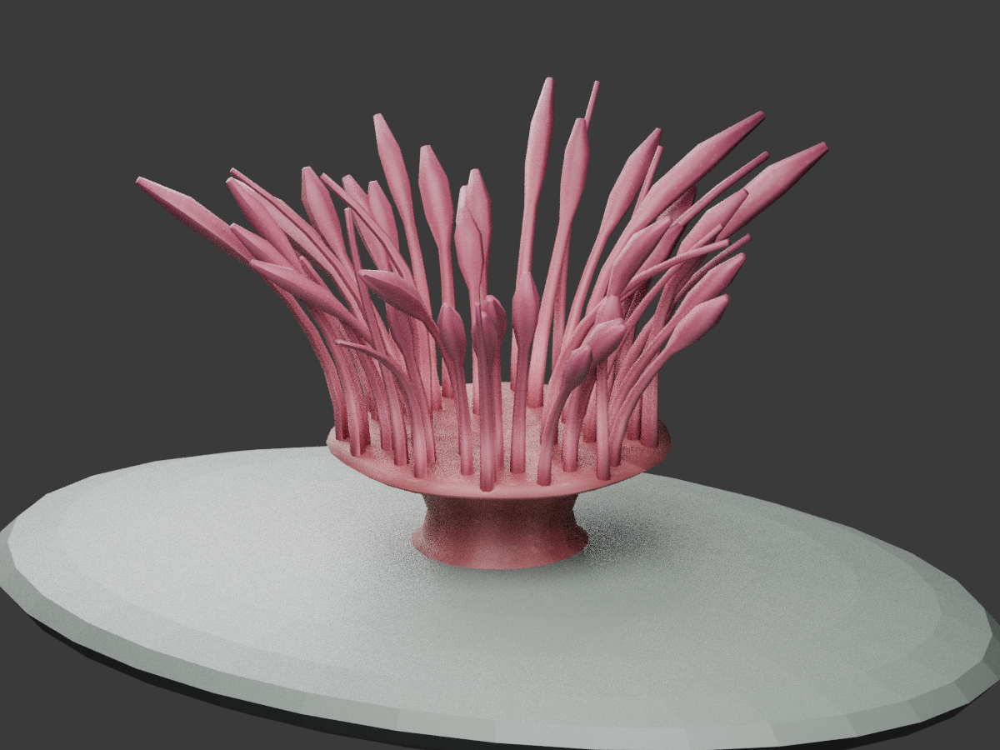

# Sea anemone: substrate controls, living mesh, texture and animation

Status: **implementation in progress; assets generated; engine scope awaiting approval**.
Prepared 5 October 2026. No engine files have been edited; runtime integration is pending.

The biological research was saved first in the independent
[sea-anemone research document](../reference/sea-anemone-research.md).
This plan derives design decisions from that evidence. Physical speeds and
species-specific animation timing have not been established; every numerical
starting point below is a **game trial setting**, not a biological measurement.

## Poster and review mockups

[A3 portrait poster PDF](../reference/sea-anemone-biomechanics-poster/sea-anemone-biomechanics-a3.pdf) ·
[browser poster](../reference/sea-anemone-biomechanics-poster/poster.html) ·
[PNG preview](../reference/sea-anemone-biomechanics-poster/poster.png) ·
[editable poster/diagram generator](../reference/sea-anemone-biomechanics-poster/make_poster.py).
The poster is 297 × 420 mm. All artwork is original schematic illustration,
not a photograph, a finished game asset or a captured runtime result.



## Current implementation and concrete problems

`wflevels/aquarium/blender_create_aquarium.py` identifies the animal as
**Entacmaea quadricolor** and makes a pedal disc, column, oral disc and
**18 tentacles**. Each tentacle is a three-segment flat strip ending in a
small sphere. Two separated rows provide fish occlusion; six tentacle clumps
are independent visible actors, plus the static body. Materials supply
pink/brown face colors instead of a dedicated surface texture.

`aquarium_constants.py` provides six independent periods from **3.05–4.75 s**,
with about **4–5.5°** lateral and **1.2–1.5°** depth rotation.
`aquarium_swim.fth` rotates whole clumps around their average root.
Tentacles therefore remain rigid within each group; roots do not individually
stay fixed. Those settings describe the existing game, not researched biology.

The current controllable animal is the **clownfish**. Keyboard/gamepad arrows
steer, A darts and B/C control depth; the phone uses A for Swim/Depth and B
for dart. There is no existing player-controlled anemone to claim as fixed.
Add a clearly labelled anemone control focus while keeping the fish available.

Historical generator comments record 14.7 ms/frame for a 27-tentacle variant
versus 9.1 ms with box stand-ins; bulb faces dominated that variant's geometry.
These old figures are context only, not today's baseline or device comparison.
Freeze and remeasure the current build before making performance claims.

## Biology translated into behavior

| Saved evidence | Proposed change | Interpretation limit |
| --- | --- | --- |
| Bubble-tip adults relocate in aquarium observations. | Substrate-bound crawling with attached and settled states. | No established real crawling speed; gameplay acceleration must be labelled. |
| Pedal-disc adhesion and locomotion vary by species. | Deforming foot edge, gradual load shift and reattachment. | A visual approximation until species-specific close-up footage is reviewed. |
| Aiptasia field tentacles bend and flutter with ambient water. | Shared gentle flow plus local lag, length variation and curvature. | Another species and a conference abstract; do not copy amplitudes numerically. |
| Active muscles enable shortening and retraction. | A withdrawal envelope and slower re-expansion, plus sparse local contraction. | Exact response times remain trial settings. |
| Bubble-tips have dense, variable, sometimes translucent tentacles. | Uneven crown; a mix of slender and swollen blunt tips; textured tissue. | Avoid making tip inflation a button-driven reflex without evidence. |
| Stomphia has predator-triggered swimming. | Explain it in the poster; defer it from this species' controls. | Escape swimming is not a bubble-tip locomotion default. |

The research document contains the source links and evidence qualifications.
Collect continuous bubble-tip footage of gentle flow, crawling and withdrawal
before calibrating motion. Record time-lapse acceleration and scale references.

## Controls and camera



Declare a compact OAS/OAD enum **Control: Clownfish / Anemone**, with its
labels/default authored in the schema and its live value held in a mailbox
consumed by Forth. Reuse a data-driven runtime settings interface and mirror
it on a connected phone. Entering the tank still selects Clownfish by default.
Expose settings through the existing pack controls/help interface; inspect the
actual remote button mapping before final binding, and publish one consistent
legend on TV and phone. Avoid appropriating a held input or phone button used
for depth without a visible focus change.

| Input in Anemone focus | Behavior |
| --- | --- |
| D-pad left/right | Crawl left/right along the surface tangent. |
| D-pad up/down | Crawl away from/toward the glass along the valid rock surface; no vertical swimming. |
| Diagonal | Normalize intent so diagonal movement is no faster. |
| No direction | Settle attachment and stop translational movement smoothly. |
| Hold A / phone primary action | Withdraw crown and shorten exposed column; inhibit crawl while withdrawn. |
| Release A | Re-expand smoothly. Holding or key-repeat does not restart the transition. |
| Settings focus choice | Transfer control; cancel held input and retain the anemone's settled location. |
| Back arrow ↶ | Close an overlay first; otherwise return to the tank selector. On the selector, exit the app. |

Use an edge-driven focus transition and held/released action state. Test remote,
keyboard/gamepad and phone independently, including disconnect/reconnect and
returning from a settings overlay. Use standard back-arrow art in the final
legend. The mockup's arrow is schematic.

The rock must offer enough connected traversable surface for meaningful movement.
Extend the existing flat perch into a rounded creviced rock shelf as necessary.
Represent legal attachment patches with a small baked surface graph in asset data;
interpolate position/normal along an edge, constrain the foot footprint, and
reject gaps, sand and tank glass. The bubble-tip reference requires stable hard
substrate. At a boundary, settle; do not glide through the rock or float over sand.
Steer intent should be relative to the displayed camera, with consistent front/
close-up orientation. Keep the clownfish's hosting target and camera zone attached
to the anemone's moving crown, retaining camera hysteresis.

Trial control responsiveness: show intent immediately, ease actual translation
in/out over **0.25–0.5 s**, and cap speed initially at **0.03 crown diameters/s**.
This is accelerated, legible game locomotion, subject to footage and user review.
Do not present it as the natural rate. Start withdrawal at **0.35–0.7 s** and
recovery at **1.5–3 s**, also unmeasured trial settings. Gentle clownfish hosting
contact should not repeatedly trigger full withdrawal.

## Mesh and texture



Author a continuous column/oral disc/foot and an irregular radial crown of curved
tubes, rather than two straight rows. Preserve front/back depth occlusion so the
fish can nestle among tentacles. Recess the column/foot in a crevice. Add a subtle
mouth slit with restrained disc folds; do not add the column bumps absent from
this species' morphology.

First art trial: **48 tentacles**, roughly **6 radial sides × 8 length spans**
per tentacle (about 96 side triangles each), plus tips and a **600–1,000 triangle**
body. Aim around **5–6k triangles** total; export actual counts, including seams
and caps. This is a review budget, not a mandate to maximize polygons. Compare
24/48/72 crowns at the same scale. Increase longitudinal spans only where curved
silhouette improves. Mix lengths, lean, tip swelling and small seeded variations;
use smooth rounded transitions and blunt ends. Preserve a recognizable mouth
region without opening an artificial fish corridor through the whole crown.

Aim for **one visual mesh/actor** for the whole anemone and one inexpensive
collision representation or existing body collider. No actor per tentacle.
Single mesh does not necessarily mean one draw call: separate opaque tissue and
translucent groups must be inventoried and profiled.

Use one shared **256² RGBA atlas** initially. Separate UV islands for column,
oral disc, tentacle shafts and tips; pad seams; keep deformation metadata separate
from texture UVs. Paint irregular low-contrast longitudinal striation, fine
speckles, tissue gradients and selective light mottling near bulbs. Support a
restrained rose/brown palette first, then green/tan variants with the same UVs.
Textures describe the surface; geometry supplies curved silhouettes.

Existing translucency is available. Start mostly opaque, with selective subtle
translucency in thin tentacle tissue after the opaque version is verified. Test
against fish, water and glass from both cameras. Avoid washing the whole crown
white, alpha sorting pops or bright fringe halos. Validate the texture binding,
material indices, atlas packing and retained alpha on the actual Chromecasts.
A 512² look comparison is optional only if 256² demonstrably loses visible detail;
no assumed FPS benefit. Retain 256² as the initial target.

## Animation model







Store rest curves and compact per-tentacle descriptors: root, length, radial
orientation, stiffness/lag variation and tip form. The column/foot use separate
weights. A single global flow signal supplies a slow mean direction plus gentle
oscillation; local phase lag and modest deterministic variation break perfect
synchrony. Neighboring tentacles should visibly share the same water.

For normalized root-to-tip coordinate `u`, begin with bending weight `u²`.
Deform the centerline and rebuild tube frames from its tangent, so cross-sections
stay coherent. Approximate length preservation; avoid tip orbiting rigid clumps,
root drift, cumulative stretching or sudden wrapping. Add bounded low-rate active
shortening to a few tentacles independently. Withdrawal folds/shortens the crown
into the crevice and reduces exposed column height; recovery restores the rest
form smoothly. Do not drive bulb inflation with the same wave signal.

Trial ambient flow: **0.03–0.08 tentacle lengths** tip excursion, **4–8 s** broad
cycle, with longer tentacles responding more visibly. These are calm game trial
settings; stronger wave-whipping belongs to the poster's comparative biology.
All envelopes use elapsed time, interpolate across simulation ticks, and resume
without jumps after pause, frame loss or menu return.

Illustrative Forth math, not a complete controller or promised new engine API:

```forth
\ Root-to-tip weighting; u is normalized 0..1
: tip-weight ( u -- w ) dup * ;
\ dt >= 0; tau > 0. Avoid lag overshoot on a long tick.
: lag-step ( x target dt tau -- x' )
  / 1 min 0 max >r over - r> * + ;
```



State precedence is **withdrawal > recovery > crawling > settled**. Recovery can
be interrupted by a new hold; the new envelope starts from the current pose.
Motion intent and attachment state are separate: input can change while the foot
remains constrained. Turning at a boundary must not reset an animation timer.
The displayed state diagram is an overview, not a strictly linear transition list.

## Engine permission and implementation route

The standing rule in AGENTS.md requires discussion and explicit permission before
any World Foundry engine edits. This plan grants none. Implementation work can
start with generators, asset descriptors, textures, Forth state/controls and
mockups independently.

Read-only investigation found existing `fish-deform`, `fin-deform`, `swim-deform`,
`jelly-deform`, `plant-register`, `plant-step` and `lion-pose` bindings in
`engine/stubs/scripting_zforth.cc`. Their presence does **not** establish that
any one of them supports a rooted radial anemone crown and crawling foot.
Before choosing a route, inspect their actual weight conventions and constraints.
Do not repurpose plant topology or lionfish regions in a way that breaks those
levels, and do not assume a skeletal animation importer exists.

Preferred end state: one compact pose publication for one visual actor; cached
rest geometry; batched native deformation if existing facilities truly fit.
If they do not, prepare a separate concrete engine proposal listing files,
pose ABI, asset metadata, rest-cache invalidation, root/collision invariants,
backend coverage and profiling scope. Obtain permission **before editing engine
code**. New Forth words are proposals until that approval and implementation.
A six-group asset/controller prototype is acceptable as a measured intermediate,
but must be labelled as such; it does not satisfy the final flexible-crown goal.

## Phases and profiling

| Phase | Deliverable | Compare with |
| --- | --- | --- |
| 0 · Baseline | Freeze current APK/assets; count actors, vertices, triangles, materials and mailbox calls. Capture wide and close-up motion. | Current six-clump anemone. |
| 1 · Shape and texture | 24/48/72 crown art study; select shape; 256² texture and material verification. Keep a frozen rest-pose profiling variant. | Baseline, isolating mesh/texture cost. |
| 2 · Living crown | Shared flow, local curvature/lag, bounded active contractions and withdrawal/recovery. | Phase 1, isolating deformation cost. |
| 3 · Controls and crawling | Focus UI/phone parity, traversable rock patches, attachment animation and camera/host target updates. | Phase 2, isolating control/locomotion cost. |
| 4 · Polish | Translucency comparison, palettes, roots/collision fixes and density review. | Phase 3, retain only visible improvements worth their cost. |

Profile on **both chromecast-test-01 and chromecast-test-02** through the coordinator.
Freeze one APK per variant; preserve hashes, device/version, viewport, thermal
state, scene seed, camera, duration and raw results. Warm up 30 s, record at least
60 s; collect three samples per comparison when thermal state is comparable.
Use matched wide/close-up scenes: idle, hosted clownfish, sustained crawl and
repeated withdrawal/recovery. Include controls overlay and translucent overlap
captures. Do not interpret a CPU recording or encoded-video rate as rendering FPS.

| Variant/device/scene | Actors | Triangles | Draw calls | Mailbox calls/tick | Script ms | Animation ms | Render ms | Frame p50/p95/p99 ms | RSS/texture bytes | Δ vs baseline | Δ vs previous |
| --- | --- | --- | --- | --- | --- | --- | --- | --- | --- | --- | --- |
| Phase 0 | pending | pending | pending | pending | pending | pending | pending | pending | pending | — | — |
| Phase 1 | pending | pending | pending | pending | pending | pending | pending | pending | pending | pending | pending |
| Phase 2 | pending | pending | pending | pending | pending | pending | pending | pending | pending | pending | pending |
| Phase 3 | pending | pending | pending | pending | pending | pending | pending | pending | pending | pending | pending |
| Phase 4 | pending | pending | pending | pending | pending | pending | pending | pending | pending | pending | pending |

Expand rows for each device/scene; report absolute and percentage deltas.
Unavailable counters stay explicitly unavailable, not zero. Keep both visual
quality comparisons and performance outcomes; triangle count alone is not a
performance diagnosis. Actor time, mailbox calls, deformation and transparency
cost need separate evidence.

## Acceptance and files to update

- Crown roots stay fixed relative to the oral disc while tips curve; no synchronized rigid clusters.
- Fish can host within the crown, with correct depth occlusion and no tentacle collision stair-stepping.
- Crawling stays on connected rock, with foot contact and no penetration; release settles cleanly.
- A hold/release is continuous and does not retrigger on repeat; changing focus clears held input.
- Camera/hosting target follows relocation without flickering between shots.
- Texture looks like pigmented living tissue, with visible detail at close-up and correct alpha.
- TV, phone and gamepad mappings are documented and verified, including actual held/released D-pad input on cast2.
- Back arrow closes overlays, then returns to selector; selector back exits. Help uses arrow artwork.
- Both-device profiles and deltas accompany each phase; no claimed measurements until saved.

Likely implementation files: `wflevels/aquarium/blender_create_aquarium.py`,
`aquarium_constants.py`, `aquarium_swim.fth`, `run_aquarium_checks.py`, new anemone
asset/texture authoring files and the existing pack's selector/phone interface.
Determine the exact UI owner before editing shared files; preserve unrelated work.
Regenerate/export level resources through the established tooling. Update this
plan, the poster and research qualifications as new footage/measurements arrive.
Any engine files belong exclusively to a separately discussed, approved proposal.

## Implementation in progress

The 48-tentacle single-mesh authoring asset is generated: **3,420 vertices,
5,756 triangles, one 256² tissue atlas**. Geometry/reference-pose checks: **10 passed**.
These are authoring previews, not runtime evidence.



[Flow left](2026-10-05-sea-anemone-realism/assets/flow-left.png) ·
[Flow right](2026-10-05-sea-anemone-realism/assets/flow-right.png) ·
[Withdrawal](2026-10-05-sea-anemone-realism/assets/withdrawn.png) ·
[Editable Blender asset](2026-10-05-sea-anemone-realism/assets/anemone.blend).

The existing deformation APIs do not support this asset's rooted radial crown
and independent texture coordinates. The concrete
[engine integration proposal](2026-10-05-sea-anemone-realism/engine-integration-proposal.md)
is awaiting explicit approval under the standing engine-edit rule.
Asset and Forth work continues independently. The settings proposal is being
revised to use an OAS/OAD declaration and script state, rather than dedicated
anemone C++ settings. Existing schema dropdowns are editor controls; a reusable
runtime TV/phone bridge remains to be specified and separately approved.

The standalone Forth control core now passes its own behavior checks: **23
combined asset/controller/schema-authoring tests passed**. It covers surface bounds, normalized
diagonals, hold/release withdrawal, focus-change input suppression and long ticks.
[Saved check output](2026-10-05-sea-anemone-realism/authoring-tests.txt).

## OAS/OAD settings follow-up

See [entity settings migration TODOs](2026-10-05-runtime-settings-oas-oad-migration.md).
The Planted Tank is the existing C++ settings owner identified by the audit;
the new anemone settings must use authored definitions and the reusable bridge.
Conversions remain pending and engine changes require separate approval.

## Saved baseline · 5 October 2026

Coordinator job **J-5cd67c4fff20** profiled the frozen current eight-tank APK
in the clownfish scene: 30 s warmup, three 60 s idle runs. The recorded median
is **29.970 FPS**, with **33.367 ms p95** presented-frame interval on
chromecast-test-01. These are frame-presentation measurements, not CPU stage
timings or proof of the limiting stage. No new anemone asset was installed.

[Baseline summary and APK hash](2026-10-05-sea-anemone-realism/baseline-summary.json) ·
[Raw evidence](2026-10-05-sea-anemone-realism/baseline/chromecast-test-01/summary.json).
Chromecast 2 currently reports **needs-local-setup** and has not been measured.
Later-phase comparisons and all deltas remain pending.

## Reusable deformation revision

Will requested reuse by other actors. The
[generic deformation design](2026-10-05-sea-anemone-realism/generic-deformation-proposal.md)
now replaces the proposed species-specific ARIG/anemone-pose route. It shares
rest-mesh caching and evaluation, with authored rooted curves, weighted transforms
and travelling-wave groups. OAS/OAD defines parameters; Forth publishes behavior
channels once per actor; independent asset metadata defines geometry weights.
Engine implementation remains pending an approved revised scope.
