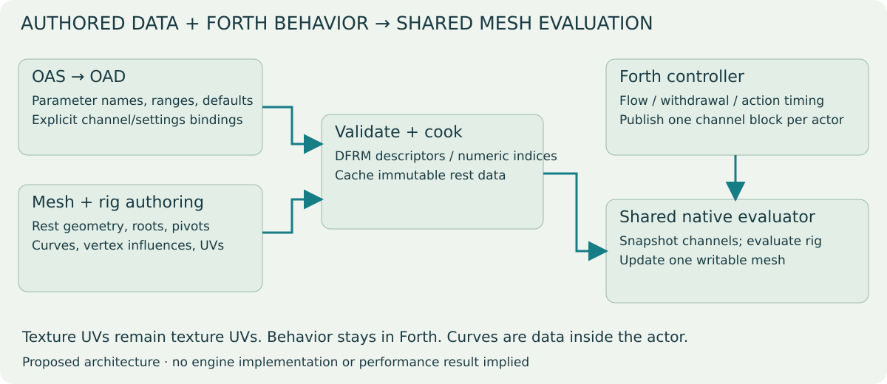
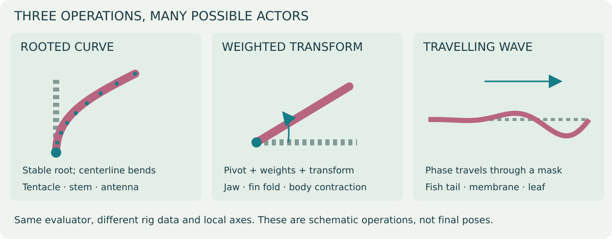
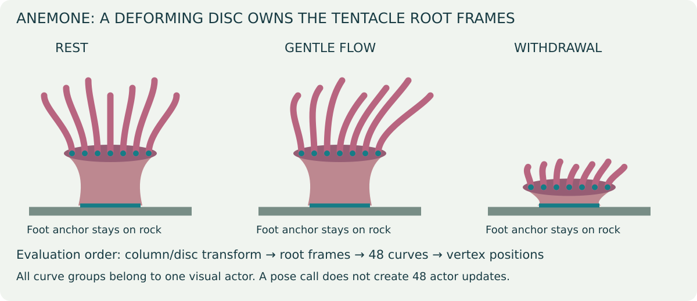
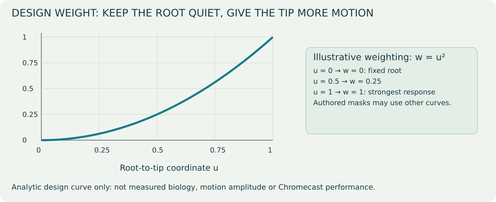
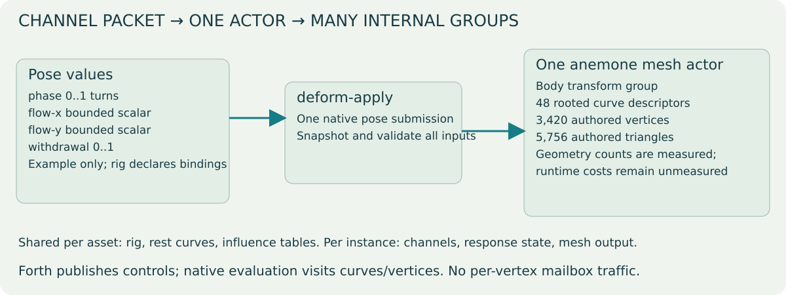

# Reusable deformation: authored rigs, shared native evaluation

Status: **design proposal; no engine edits authorized or made**.
5 October 2026. Replaces the earlier species-specific ARIG/anemone-pose proposal
as the preferred direction for discussion. Runtime settings migration remains
separate from this deformation design.

## Architecture at a glance



The upper-left path defines parameters; the lower-left path defines geometry
and influences. They meet during cooking. Forth supplies changing values at
runtime, while the same evaluator consumes each actor's authored rig.

## What should be shared

The existing fish, swim, fin, jelly and lionfish implementations all cache a
rest mesh, compute weights, evaluate a pose and write vertices through the same
RenderActor3D path. Their differences currently live in species-specific formulas,
fixed coordinate assumptions, UV-derived weights or hard-coded region enums.

Share the rest-cache lifecycle, optional rig metadata, parameter transport,
operator evaluation, bounds/lighting handling and profiling. Author the spatial
weights, curve roots, local axes, operator order and parameter bindings as asset
metadata. Keep behavioral decisions and action envelopes in Forth. The engine
should understand a rooted curve or weighted rotation without knowing whether
it belongs to an anemone, fish, plant or another actor.

A generic function taking a species/type enum and switching between the old
formulas would only rename the existing coupling. A shared mechanism needs
reusable mathematical operations, explicit inputs and a clear composition rule.

## Shared machinery compared with the current approach

| Concern | Existing implementations | Proposed shared evaluator |
| --- | --- | --- |
| Entry points | Fish, swim, fin, jelly and lionfish pose functions | One generic pose submission driven by the loaded rig. |
| Weights and axes | Mix of fixed species formulas and UV-derived coordinates | Explicit rig influences and local frames, separate from texture UVs. |
| Rest cache | Separate cache structures and exclusion checks | Common lifecycle; immutable rest data with per-instance pose/output. |
| Behavior | Forth controls timing, with pose formulas in native functions | Forth retains timing; native operations consume authored channel bindings. |
| New actor | Often needs another custom native function | Author a rig from supported operations; add a primitive only for a missing capability. |
| Rendering correctness | Checked within individual paths | Shared requirements for normals, animation bounds, validation and cache reset. |
| Performance | Existing paths have their own measured results | Must be measured; no implied FPS gain. |

## A deliberately small operator set

| Operator | Authored data | Inputs | Possible consumers |
| --- | --- | --- | --- |
| **Curve/strand deformation** | Rest centerline samples, root/local frame, per-vertex segment coordinate and cross-section offset, taper; optional parent frame | Shared flow vector, phase, amplitude, shortening/fold controls | Anemone tentacles, plant stems, shrimp antennae, jelly trailing tissue |
| **Weighted transform** | Pivot/frame, affected vertex weights, optional parent transform | Rotation, translation and bounded scale channels | Jaw opening, throat expansion, fin folding, column withdrawal |
| **Weighted travelling wave** | Direction/local frame, root-to-tip weight, phase delay coefficients | Phase and amplitude, optional directional bias | Fish body/tail waves, fin membranes, leaves |



The dashed grey lines show the reference shape. Colored lines show a schematic
pose; dots identify stable roots or pivots. These illustrate the mathematics,
not finished animal assets.

These are operations on authored rest geometry, not biology-specific programs.
Implement only the operations required by the anemone first: rooted curves and
weighted transforms. Add the travelling-wave operation when a second consumer
needs it or if it provides the cleanest curve-input implementation. Sparse morph
targets can be a future operation for forms poorly expressed by these primitives;
do not introduce a full skeletal/morph system before demonstrating the need.

## How a single-mesh anemone uses it



The three states show which parts move together. During flow the disc/root
attachments remain stable; during withdrawal they follow the contracting body.
The teal foot segment stays on the substrate. This is a schematic of the
proposed dependency order, not a runtime capture.

One authored body transform group contracts the exposed column/oral disc while
keeping the foot weight zero. Forty-eight rest curves describe the tentacles.
Each curve's root frame is attached to the appropriate deformed oral-disc frame.
Its vertices follow that centerline using stored cross-section offsets.

The actor supplies shared flow, phase and withdrawal channels. Curves carry local
length/stiffness/phase variation. Shared flow produces coherent movement; local
lag supplies variation. Root position is inherited from the disc, rather than
being displaced independently by a wave. Shortening/folding follows the same
withdrawal channel and starts from the current envelope.

This is **one actor and one native evaluation**, even though its rig contains
many curves. Curves/groups are data, not independent actors or per-tentacle
Forth scripts. A curve evaluator should operate on a bounded number of samples,
then place vertices from those samples. Preserve rest arc length during ordinary
sway; intentional shortening is a separate channel. Maintain continuous frames
along curves so they do not flip when the tangent approaches a coordinate axis.

For a lionfish, a later authored rig could combine two pectoral wave groups,
a tail group, jaw/head weighted rotations and throat expansion. The gulp state,
prey detection and suction stay in Forth; deformation only consumes the published
pose values. That separation avoids moving gameplay ownership into the renderer.

## Root-to-tip response: an explicit design curve



This chart plots the proposed starting weight `w = u²`. At halfway along a
strand, its weight is 0.25; at the root it is zero. It is a design function,
not measured tissue stiffness, biological movement or a performance benchmark.
The final curve can be authored differently without changing the evaluator.

## Metadata and authoring

Propose a versioned optional **DFRM** model chunk instead of ARIG. Separate tables
hold parameter declarations, operator/group descriptors, curve rest samples and
vertex influences. Vertex influences reference these tables; do not repeat a
whole curve descriptor at every vertex. UV/material seam duplication must copy
the corresponding influence records. UVs remain texture coordinates.

The first version has a small fixed operator set, bounded group/sample/influence
counts and explicit model-space units. It is an authored operator pipeline,
not a bytecode interpreter or an arbitrary runtime expression language. Cook the
rig to efficient contiguous arrays; avoid evaluating string names or rebuilding
weights while posing an actor.

OAS/OAD owns editable parameter names, types, defaults, legal ranges and exposed
settings where applicable. The asset owns geometry-dependent influences, curve
samples, pivots and masks. The build pipeline validates bindings between them
and exports numeric channel indices. An OAD field alone does not describe vertex
weights or a curve. Those still require mesh/rig authoring attributes.

Illustrative authored parameter declaration:

```text
phase       scalar, turns
flow-x      scalar, fraction of strand length
flow-y      scalar, fraction of strand length
withdrawal  scalar, 0..1
```

These names belong to this asset's configuration; they are not hard-coded engine
fields. An actor with other behavior can publish another channel set against the
same supported operators.

## One pose submission per actor



| Pose-publication work | Current anemone | Proposed single-mesh rig |
| --- | --- | --- |
| Visible anemone actors | Static body + six tentacle clumps | One mesh actor; collision representation accounted separately. |
| Motion publication | Three rotation writes per clump: **18 actor-mailbox writes/tick** | Four scalar channel writes + **one native submission/pose update**. |
| Additional mailbox work | Phase accumulators, time reads and scratch state | Forth envelope/state work and four native channel reads; count these too. |
| Internal work | Rotate six rigid groups | Evaluate body transform, 48 curves and vertex influences. |
| Geometry | Export/count the frozen baseline | Authored mesh: **3,420 vertices / 5,756 triangles**; final seam-split counts pending. |
| Frame-time difference | Baseline captured separately | Pending implementation and device profiles. |

The publication counts above follow the current script and proposed interface;
they are not a measured full-tick mailbox total. A single submission still does
curve and vertex work. Compare total script/native/render cost, not just calls.

Proposed Forth entry point:

```forth
\ Publish scalar channel values into a reserved parameter block,
\ then ask the mesh's authored rig to evaluate them together.
\ API is proposed; not currently defined in the engine.
: an-publish ( -- )
  740 anemone-actor deform-apply ;
```

`deform-apply ( channel-base actor -- )` snapshots the descriptor's bounded
channel count from the actor's configured parameter block. Validate the entire
block before changing the mesh. The exact mailbox scope and base/range contract
must be fixed in the implementation proposal; first use is a level-global scalar
block with an explicitly reserved range. The call must not read beyond the
level's allocated mailboxes. Channels requiring lossless integers are outside
this scalar pose transport.

Forth may write several scalar channels, but makes one native submission per
actor, not one call per vertex/group. Cache static phase-delay coefficients and
other rest-dependent values. Evaluate shared trigonometric inputs once where
mathematically valid; curve frames and local response still have a measured CPU
cost. Cache/buffer the last two poses for render interpolation if simulation and
render clocks differ. Interpolation must not re-run behavior or accumulate into
the already deformed mesh.

## Composition and correctness contract

1. Each evaluation begins from immutable rest coordinates and fresh pose inputs.
2. A bounded, authored operator order determines composition. Parent-frame
   dependencies must be acyclic; the exporter validates the order. Applying two
   operations to a group is deliberate, not two competing cache owners.
3. An influence is explicit and independent of texture UVs. Weighted transforms
   must declare blending/normalization rules; reject invalid weights.
4. Fixed roots stay fixed relative to their current parent frame. Anemone roots
   follow the contracting disc; the foot remains at its substrate anchor.
5. Pose inputs are finite and constrained by authored limits. Model reload,
   topology changes and actor destruction invalidate the rest/evaluation cache.
6. Correct normals/lighting and conservative animation bounds are part of the
   evaluator contract. Audit the existing rendering path before choosing whether
   to update normals or derive them during rendering. Bounds must encompass legal
   poses so moving tips do not disappear through culling.
7. This operation deforms visuals. Collision/locomotion retain their existing
   explicit representation and owner. Do not silently change collision geometry
   or promise physical fluid simulation from a visual curve approximation.
8. Share immutable rig/rest descriptors where practical, with per-instance pose
   and writable output. Preserve palette/UV/material data during all poses.

## Migration and measurement

| Step | Visual/check artifact | Performance evidence | Completion gate |
| --- | --- | --- | --- |
| 0 · Freeze current tank | Wide/close-up captures; exported inventory | Current APK profile and hash | Reproducible baseline. |
| 1 · Cook generic rig | DFRM layout, seam/influence correspondence | Cook time and descriptor/rest-cache memory | Valid bounded metadata and fixed-root checks. |
| 2 · Animate anemone | Rest → flow → withdrawal → recovery | Frozen-rest vs animated asset on both Chromecasts | Stable roots, correct textures, lighting and bounds. |
| 3 · Prove reuse | A leaf/fin/antenna fixture with different local axes | Same evaluator, second geometry | No anemone-specific assumptions in the evaluator. |
| 4 · Migrate one existing consumer | Matching before/after poses | Old path vs generic path with deltas | Equivalent behavior and acceptable measured cost. |

All generic-runtime rows are pending. The authoring previews and existing-tank
baseline do not establish that a generic engine rig already works.

Start with the anemone as one real consumer, then prove reuse with one small
second asset—such as an existing leaf/fin strip or an antenna authoring fixture.
The second asset must use a different local axis/layout to expose accidental
anemone assumptions. A fixture is not permission to alter the shipped betta or
shrimp levels.

Keep the current fish/fin/jelly/lionfish APIs and metadata functioning during
introduction. Convert them individually, using adapters where needed, only with
explicit scope and matching visual/performance evidence. Do not quietly change
existing UV semantics or all assets at once. Dynamic plant growth creates new
topology; its geometry generator is separate from deforming an existing rest mesh
and need not be folded into this first version.

Profile descriptor load/cook time and memory separately from per-tick evaluation
and GPU upload/render cost. Measure actor count, pose calls, mailbox reads/writes,
curve/group counts, vertices/triangles, animation CPU time, draw calls, memory
and p95/p99 pacing on both Chromecasts. Genericity is an authoring/maintenance
benefit; it does not establish an FPS improvement. Compare a frozen rest asset,
animated asset and the current baseline with the same scene/camera/thermal state.

Implementation requires a separately approved revised engine scope. Candidate
engine changes replace `anemone_deform.h`/`anemone-pose` with a shared evaluator,
DFRM reader/rest cache and one generic pose binding; the existing settings bridge
proposal remains data-driven. No engine files have been edited.

## Editable visual sources

[Diagram generator](generic-diagrams/make_diagrams.py) produces all five original
SVG diagrams/charts. Each image is a standalone editable vector file. The
[anemone plan](../2026-10-05-sea-anemone-realism.html) contains actual Blender
asset previews and the saved current-device baseline, labelled separately.
