# Sea urchin: traction, articulated spines and a textured model

5 October 2026 · **Phases 0–3 completed; each phase committed and pushed.** The sea-anemone and generic-deformation projects remain set aside. This plan does not authorize engine changes.

Improve the planted tank's sea urchin so it crawls with visible traction, has a more convincing short-spined silhouette and surface, and moves its spines through basal joints. Keep the slow movement the user previously chose. Separate believable contact from decorative motion, and measure actor/script costs as well as geometry.

## Research and poster

Research was saved before creating the poster and this plan: [independent research document](../reference/sea-urchin-research.md). Sources, study species and access limitations are recorded there.

[Open portrait A3 poster](../reference/sea-urchin-biomechanics-poster/poster.html) · [printable PDF](../reference/sea-urchin-biomechanics-poster/sea-urchin-biomechanics-a3.pdf) · [PNG preview](../reference/sea-urchin-biomechanics-poster/poster.png) · [editable generator](../reference/sea-urchin-biomechanics-poster/make_poster.py).

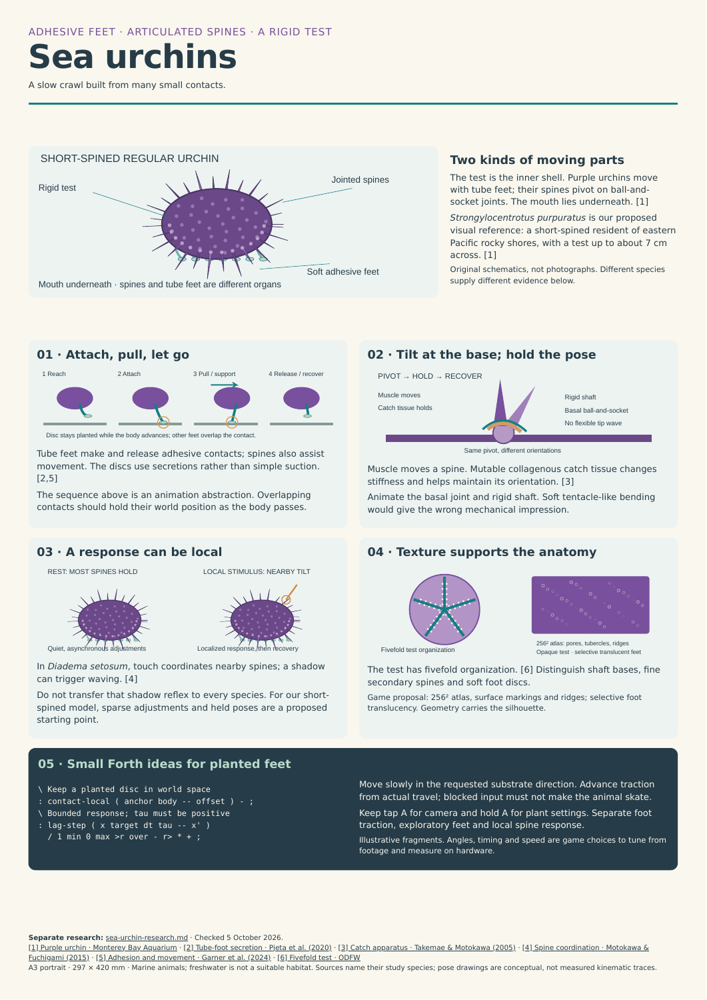

The principal distinction is between a soft, adhesive tube foot and a rigid spine that pivots at its base. The test remains comparatively rigid. Feet make and release traction contacts; spine movement includes holds and localized adjustments. [Tube-foot adhesion study](https://doi.org/10.3390/ijms21030946), [spine catch mechanics](https://doi.org/10.2307/3593098).

## Current baseline, from source

| Component | Existing implementation | Change to pursue |
|---|---|---|
| Test and spines | One colored ellipsoid, 61 static four-sided tapered spines | Anatomical organization, better shafts/bases and texture |
| Geometry | 412 triangles in body/spine mesh; 56 per foot; **860 animal triangles** | Geometry counts recorded per revision, rather than assumed costly |
| Actors | One body plus eight feet; **9 animal actors / 38 scene actors** | Bound added articulation actors and measure their cost |
| Movement | Direct X/Y input, diagonal normalized, velocity smoothed; fixed substrate Z | Retain direct, very slow crawl: **0.0125 world units/s** |
| Foot phase | `abs(dx)+abs(dy)` displacement drives phase | Correct diagonal distance bias; actual travel remains the driver |
| Feet | Body-relative offsets with alternating contact/swing groups | Persistent world-space contact during support |
| Art | Flat material colors; no dedicated urchin texture atlas | Readable markings, anatomy and material separation |
| A button | Runtime plant settings owns short camera tap / long settings hold | Preserve current behavior and modal input handling |

The phase 0 counts were computed from the frozen baseline Python mesh faces using `sum(len(face)-2)`, before compilation; cooked counts may differ. Scene count comes from the existing generated actor map, not a fresh build. No performance measurements were available when this plan was first written; completed Chromecast measurements now appear in the implementation log and comparison report.

Sources: [urchin.py](../../wflevels/aquarium_tanks/urchin.py), [plants_controller.fth](../../wflevels/aquarium_tanks/plants_controller.fth), [generate.py](../../wflevels/aquarium_tanks/generate.py), [current actor map](../../wflevels/aquarium_plants/actor-map.json).

## Visual target and habitat

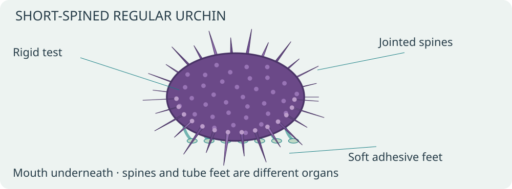

Propose *Strongylocentrotus purpuratus* as the visual reference, rather than silently identifying the current unnamed animal. Its rocky eastern Pacific habitat suits a marine macroalgae treatment; it is not a tropical freshwater resident. [Monterey Bay Aquarium species reference](https://www.montereybayaquarium.org/animals-the-ocean/animals-a-to-z/purple-sea-urchin).

Use the saltwater planted-tank variant for previews. Before shipping, resolve the freshwater variant explicitly: an appropriate freshwater resident requires its own design, or freshwater can be a plant-only view. Do not silently relabel the urchin as freshwater or remove the existing toggle. Species and freshwater resident behavior are decisions to settle at the implementation review; asset/contact work can proceed independently.

## Controls: direct crawl with visible traction

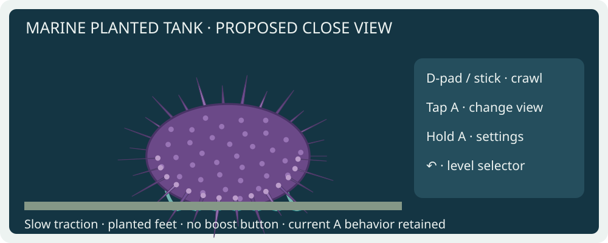

| Input / situation | Proposed behavior |
|---|---|
| D-pad or connected phone stick | Crawl in the requested substrate direction; normalize diagonal input |
| Release | Smoothly stop, preserving existing contact until release/replant is needed |
| Reversal / direction change | Redirect traction without body snap, obligatory turn or fish-like bank |
| Tap A | Existing wide/close camera toggle |
| Hold A | Existing plant settings; no extra locomotion boost or spine action on the same gesture |
| ↶ in settings | Apply/close settings as currently designed; clear held movement |
| ↶ in level | Return to selector; ↶ on selector exits |
| Tank boundary or blocked movement | Stop locomotion phase when displacement is zero; settle contacts without skating |
| Menu, focus loss, stale phone session | Clear held input, suspend locomotion safely; resynchronize contacts on resume |

Keep current speed at 0.0125 world units/s; this is a game choice, not a measured biological velocity. Improve readability with the close camera rather than speeding up the animal. Movement, foot animation and spine response must remain independent of the plant growth-speed setting. Do not introduce species settings in C++: any new authorable parameters belong in OAS/OAD; prefer no new player-facing settings for the first iteration.

## Foot contact and locomotion animation

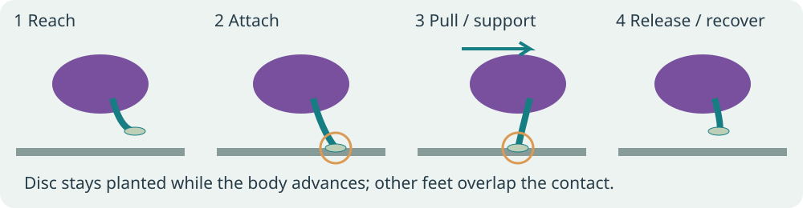

Use a bounded pool of eight visible traction feet initially. These are representative contacts, not a claim that real urchins have only eight feet. Give each foot `REACH → ATTACHED → RELEASE → RECOVER` state, world anchor, rest root and extension limit. Several feet remain attached while others recover. Stagger phases with small deterministic variation; avoid a rigid two-team march.

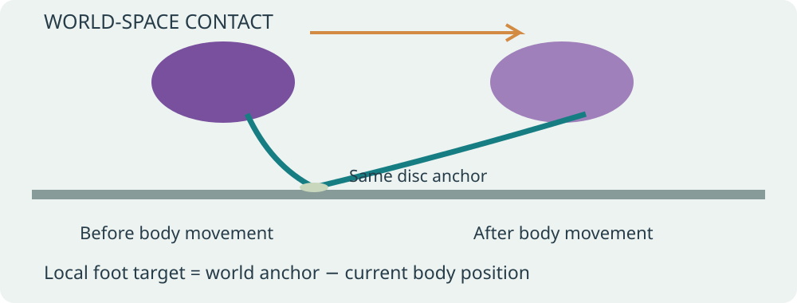

Store the disc's world anchor on attachment. Each frame, compute its local offset from the current body position. Release when the contact reaches its extension limit or its support interval ends; choose a new target in the intended travel direction and replant smoothly. Do not transform an attached pad along with the body.

Correct the Manhattan-distance phase bias using actual Euclidean travel, or a bounded approximation whose diagonal error is documented and tested. Inspect available Forth words before choosing the calculation; do not assume a square-root primitive exists. Limit large-delta updates and reinitialize on scene changes so teleports do not cause multiple skipped contact cycles.

**Existing-engine first trial:** rebuild each foot with its actor origin at the attachment disc and its rest stem pointing toward a body root. Position the actor at the anchor; orient its stem toward the root using existing transforms. Verify available scale controls before attempting length adjustment. Fixed-length contact windows are an acceptable first trial, but disclose the remaining root mismatch; do not claim a flexible world-anchored stem is solved by translating the foot alone. A continuous curved stem needs verified existing animation support or separately approved support.

The director owns contact state; foot actors need no independent behavioral scripts. Reuse the existing eight slots, audit mailbox ownership and generate explicit bindings. No ad hoc mailbox ranges overlapping runtime plants. Illustrative Forth ideas:

```forth
\ Disc position relative to the moving body, one axis at a time.
: contact-local ( anchor body -- offset ) - ;
\ First-order convergence; tau > 0, dt already bounded.
: lag-step ( x target dt tau -- x' )
  / 1 min 0 max >r over - r> * + ;
```

These demonstrate small reusable calculations, not a complete contact solver. Implement using this repository's actual Forth vocabulary and check stack effects in the host harness.

## Spine animation: pivot and hold

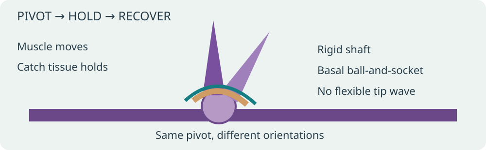

Treat each moving spine as a rigid shaft around its tubercle. Never translate the tip independently or bend it like an anemone tentacle. Clamp tilt to an authored envelope; use continuous approach/hold/recover envelopes, not an endless shared sine. Decorative idle changes can be sparse; lower spines should respond to ground proximity and traction without penetrating the substrate.

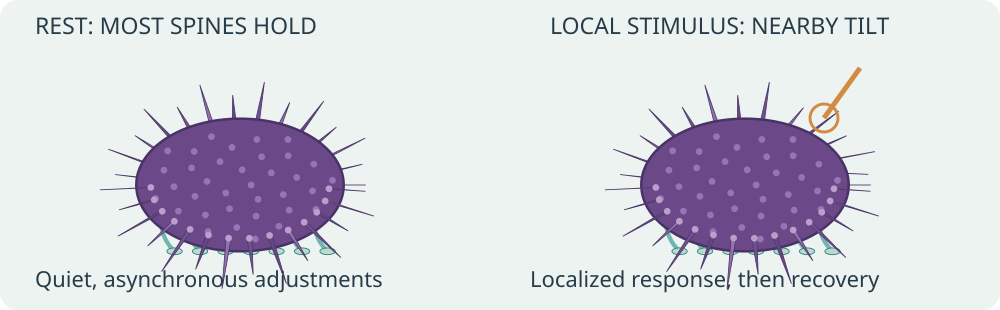

Local touch coordination and shadow waving are documented for *Diadema setosum*. They do not establish those exact reflexes for the proposed purple-urchin model. [Primary spine-coordination paper](https://doi.org/10.1242/jeb.115972). Start with modest orientation adjustments and contact clearance, then tune from matched-species footage. Do not make a remote button press cause an unexplained whole-animal defensive wave.

**Bounded existing-engine prototype:** detach eight prominent spines from the body mesh and give each a local origin at its base. Use existing `INDEXOF_ROTATION_A/B/C` actor transforms. Keep the remaining spines static initially. This deliberately tests mechanics and actor cost before committing to full articulation. It adds eight actors: 17 animal / approximately 46 total if the rest of the scene is unchanged. Geometry should not be duplicated under the detached spines.

Full articulation of all spines and flexible feet in one body mesh is a desirable later target, not an existing capability assumed by this plan. First audit existing animation/asset hooks read-only. If unavailable, prepare a concrete engine proposal with data layout, affected files, normals/bounds requirements and measured alternatives; discuss and obtain permission before any engine edit. Do not implement the paused generic-deformation project as a dependency. Retaining the bounded actor prototype remains an option if it profiles well and looks convincing enough.

## Mesh and texture

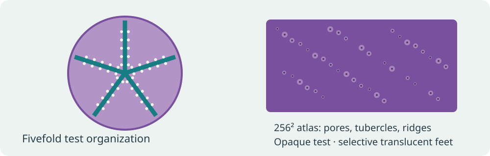

| Region | Geometry | Surface / animation |
|---|---|---|
| Test | Rounded but slightly flattened oral side; fivefold anatomical organization | Opaque purple/lilac variation, plate and pore hints |
| Primary spines | Tapered shafts with more convincing cross section, varied lengths and basal collars | Fine longitudinal ridges; rigid basal rotation |
| Secondary spines | Smaller geometry concentrated between large shafts | Break up uniform silhouette without one actor per spine |
| Tube feet | Narrow soft stems with terminal adhesive discs | Distinct pale pigmentation, selective translucency if useful |
| Oral area | Simple recessed underside/mouth suggestion | Refine only where close view shows it; feeding simulation deferred |

Start with a **256 × 256 atlas**, following the existing texture-size preference. Keep opaque regions opaque, and use the engine's existing translucency capability only where it improves foot appearance. Confirm the actual material path respects alpha; do not assume support is missing or introduce renderer changes. Use one shared atlas/material where compatible and preserve texture color through cooking. UV markings cannot substitute for joint geometry or meaningful silhouette.

Proposed first mesh budget: roughly **2,000–4,000 animal triangles**, including feet; this is an authoring target pending inspection, not a measured optimum. At the close camera, inspect spine aliasing and overly thin shafts. Avoid raising atlas resolution before comparing equal geometry at the camera distance used in play. Keep source meshes, atlas, palette and generator settings reproducible.

## Data flow and implementation phases

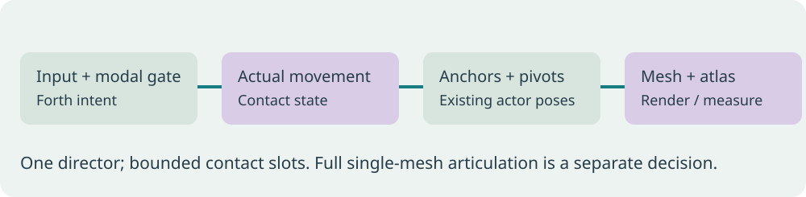

| Phase | Deliverable | Gate |
|---|---|---|
| 0 · Baseline | Current marine plant seed, growth age, camera and input traces; counts and device profile | Save APK/hash and evidence; do not use clownfish timing as urchin baseline |
| 1 · Model and texture | Improved test/spines/feet and 256² atlas; existing actor layout | Review stills in wide/close views; confirm texture and alpha paths |
| 2 · Crawl and contact | Actual-distance phase, overlapping planted contacts, smooth reversals and modal transitions | Compare underside/close video and traces; disclose any rigid-foot prototype limitation |
| 3 · Spine prototype | Eight independent basal pivots, local clearance, sparse move/hold/recover | Review realism and actor/mailbox cost; decide whether to retain or replace |
| 4 · Full articulation, optional | Single-mesh articulated spines and flexible feet if supported or separately approved | Explicit engine discussion/permission if required; paused generic work stays paused |
| 5 · Release polish | Matched-species tuning, selected habitat behavior, final docs and device verification | User reviews visual result; profile same scenario against phase 0 |

Phases 1–3 can be explored using assets, level generators and Forth plus existing transforms. Phase 2's flexible stems and phase 4's one-mesh rig must not be promised without a verified deformation path. The user authorized phases 0–3 on 5 October 2026, with a separate commit and push after each completed phase. Engine changes remain unauthorized. Performance comparisons use Chromecast evidence exclusively; desktop traces are only for deterministic control/contact checks and visual review.

## Profiling report to fill during implementation

Use the Chromecast coordinator, through `task chromecast:*`; freeze the APK before submitting each test. Profile both device models when available and respect reservations. For each revision use the same seed, water mode, growth age and camera; run three 60-second samples each for idle, crawl/diagonal/reversal and dense mature plants. Separate plant regeneration/growth cost from steady-state animal updates. Never publish invented timing deltas.

[Measured comparison report](2026-10-05-sea-urchin-realism/comparison.html) · [machine-readable comparison](2026-10-05-sea-urchin-realism/comparison.json) · [frozen native-library hashes](2026-10-05-sea-urchin-realism/evidence/native-library-check.json).

| Revision | Animal / scene actors | Animal source triangles | Atlas | Status |
|---|---:|---:|---|---|
| Phase 0 baseline | 9 / 38 | 860 | Flat colors | Measured on Chromecast |
| Phase 1 model | 9 / 38 | 3,540 | 256² | Implemented and measured |
| Phase 2 contacts | 9 / 38 | 3,540 | 256² | Implemented and measured |
| Phase 3 eight pivots | 17 / 46 | 3,540 | Same 256² | Implemented and measured |
| Optional single-mesh route | Target ≤ baseline actors | Undetermined | 256² initially | Deferred; engine discussion/permission if required |

Report draw/material batches, memory and animal update time if exposed; otherwise state which metrics are unavailable. Report absolute milliseconds and percent differences. A capped FPS can conceal extra CPU work. Animal actor count matters alongside triangles; compare the eight-pivot prototype with the static revision before proposing an engine extension.

## Acceptance checks

- Foot anchors remain stable through support, with bounded measurable drift; roots and discs remain visibly connected. Specify numeric tolerances after deciding game-space scale.
- Diagonal travel and gait rate match cardinal travel at the same speed. Blocked input produces no traction progress; exploratory motion remains distinct.
- Smooth stop/reverse and consistent 0.0125-unit/s sustained motion; no false roll, teleport or foot reset at each input change.
- Spine bases stay attached; shafts pivot rigidly and hold between movements. No whole-crown synchronized wave or substrate penetration.
- Textures retain purple/pale variation in game lighting; no white fallback, incorrect alpha cutoff or transparent test.
- A tap/hold behavior, settings navigation and ↶ hierarchy still work. Pause/focus/phone reconnect does not replay held input or catch up stale animation.
- Chromium/WebView 91 remains supported if phone/TV text is touched; no unguarded `.at()` or newer API assumptions.
- Review close and wide videos beside the poster. Stills alone cannot establish credible locomotion.
- Update this plan with phase evidence, performance deltas, engine decisions and habitat resolution before reporting completion.

## Files likely affected later

Authoring changes belong in `wflevels/aquarium_tanks/urchin.py`, the plants section of `generate.py`, `plants_controller.fth`, an urchin-specific behavior helper if needed, texture sources and generated plant-level assets. Keep shared tank-generator edits narrow and coordinate with any concurrent level work. Add meaningful host checks for phase/contact logic and emitted bindings, rather than tests that merely restate constants. Engine files remain read-only until discussed and explicitly approved.

## Implementation log

Phase 0 completed matched device baselines under job `J-949aa09956f9`. [Phase comparison](2026-10-05-sea-urchin-realism/comparison.html). The reviewed coordinator plants trace provides 60-second wide idle, close idle and cardinal crawl segments; three release repeats and one CPU-instrumented repeat. Diagonal/reversal traces are correctness checks, not desktop performance measurements. Chromecast 2 reports `needs-local-setup`.

Phase 0 results: 14.520 FPS, p95 present interval 83.417 ms, actor CPU 1.313 ms and render CPU 55.111 ms (CPU is one separately instrumented repeat). Existing plant content tests: 5 passed. Native frame stepping is correctness-only.

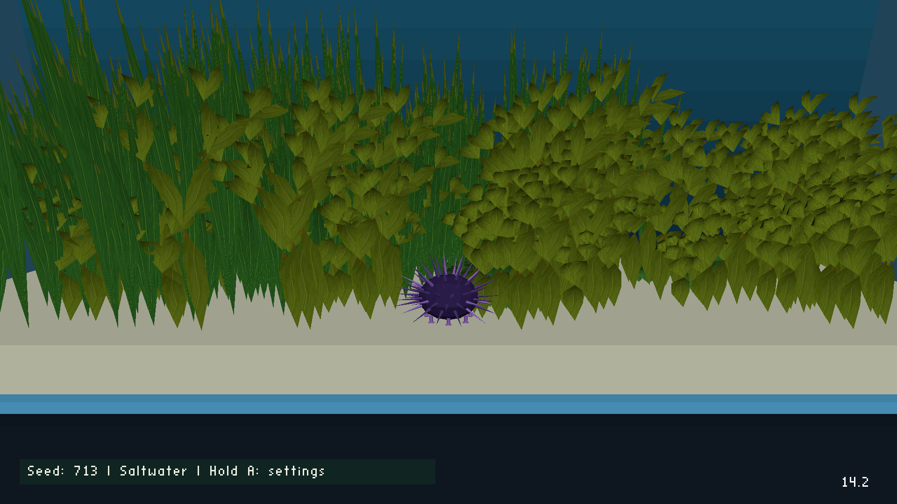

### Phase 1 · Mesh and texture

Implementation retains 9 animal / 38 scene actors and uses 3,540 animal source triangles. One 256² atlas covers the opaque purple test and spines, with material opacity 0.78 on pale feet. Body and feet share the existing PERM asset slot, preserving the runtime plant texture page. Source geometry and cooked material checks: 8 passed. The first trial exposed undersized foot-pad faces; simplified pad topology fixes the engine assertion, and feet now participate in the fixed-point normal check. No engine changes. Matched device job: `J-64d791da3158`, completed. Release median 13.722 FPS (−5.50% vs phase 0); p95 present interval 83.417 ms. Instrumented actor CPU 1.287 ms (−0.026 ms), render CPU 58.919 ms (+3.808 ms). The render increase is observed in a single instrumented repeat, not a statistically isolated attribution to geometry.


### Phase 2 · World-space contacts

Eight existing feet now retain world-space anchors during support and use separate release, recovery and reach envelopes. Euclidean actual travel drives new contacts, so blocked input does not march and diagonal travel has no Manhattan-distance phase bias. Per-foot support limits stagger contact changes. Smooth reversals preserve anchors. The Director owns scratch 800–839 and eight 16-cell contact slots 840–967; generated actor bindings record ownership. Travel is stored at 1024× scale to preserve small steps in 16.16 mailboxes. No extra actors or source triangles: 9 animal / 38 scene, 3,540 triangles.

The rigid prototype stems aim and stretch between pad and body root through existing actor rotation/scale; the discs tilt with them. Independently level pads and curved flexible stems remain outside phases 0–3. Actual-engine Forth host checks exercise both floating and 16.16-quantized mailbox storage: asset/contact checks total 22 passed. A 400-frame native correctness trace recorded 2,411 consecutive planted contact pairs with zero anchor drift, 38 completed cycles and maximum endpoint error 0.000395 world units. Native trace/video is visual/control evidence only; debug stepping remained wide, so close review uses device captures. [Correctness evidence](2026-10-05-sea-urchin-realism/evidence/phase-2/native/correctness.json).

Matched Chromecast job `J-0043bcb35806` completed successfully. Release median 13.639 FPS (−6.06% vs baseline, −0.60% vs phase 1), p95 present interval 83.417 ms. Single instrumented repeat: actor CPU 1.303 ms (−0.010 ms vs baseline, +0.016 ms vs phase 1), render CPU 58.936 ms (+3.825 ms vs baseline, +0.017 ms vs phase 1). Director CPU, which includes contact Forth plus runtime plants, measured 7.336 ms (+0.376 ms vs phase 1); plant animation measured 6.760 ms. Actor mailbox writes rose from 29 to 53/frame. The CPU samples do not isolate statistical or causal attribution. The comparison includes absolute CPU deltas, FPS percentages and raw compressed logs.

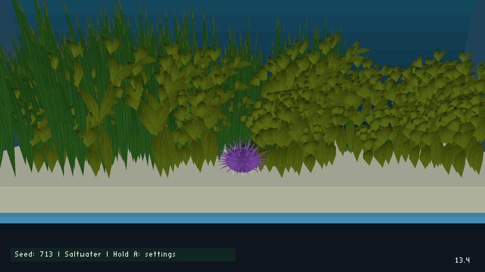

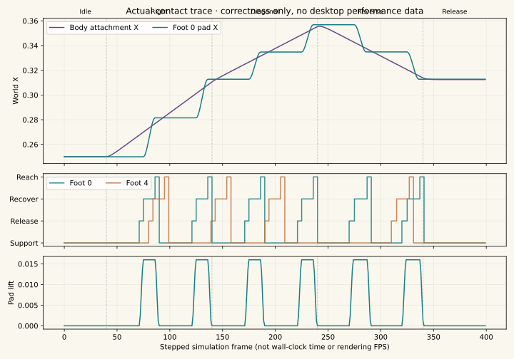

### Phase 3 · Eight rigid basal pivots

Eight representative lower/equatorial primary shafts now have local origins at their basal joints and are removed from the static body mesh. Their rigid lengths and shared atlas remain unchanged; total geometry stays at 3,540 source triangles. Counts rise from 9 to 17 animal actors and from 38 to 46 scene actors. Each uses existing rotation B/C mailboxes, with no independent actor script; the Director owns eight 12-cell slots 1000–1095 and scratch 1100–1111. These ranges do not overlap the foot slots.

Smooth 0.7-second orientation changes lead into 1.25-second holds and 1-second recovery, then staggered 4.10–6.97-second rest intervals. Small orientation adjustments alternate direction; actual travel contributes a bounded local direction bias. This is an authored prototype, not a claim to reproduce a measured *S. purpuratus* reflex. The representative lower shafts retain substrate clearance across their complete envelopes. No whole-crown sine wave, bending shaft, remote-button defensive reflex or engine changes. Other spines remain static and curved flexible feet remain deferred.

Asset/contact/pivot checks: 27 passed, including float and 16.16-quantized Forth, base attachment, rigid length, bounded continuous angles, asynchronous holds, ground clearance, long-pause suppression, teleport reset, mailbox ownership and no duplicated triangles. Matched Chromecast job `J-4b484dfa0849` completed successfully. Release median 13.514 FPS (−6.92% vs phase 0, −0.91% vs phase 2), p95 present interval 83.417 ms. Single instrumented repeat: actor CPU 1.473 ms (+0.170 ms vs phase 2), Director CPU 7.559 ms (+0.222 ms), render CPU 59.403 ms (+0.467 ms). Mailbox writes rose from 53 to 93/frame; render actors from 26 to 34, draws from 19 to 27. Rendered triangle counters stayed effectively unchanged (25,154.2 vs 25,154.5/frame). These are observed revision differences, not isolated causal estimates from repeated CPU samples.


Normal gameplay packaging preserves the original runtime/VRAM arguments and removes the benchmark-only seed, age and zero-growth overrides. Its CD content and native libraries are byte-identical to the measured phase 3 build. [Normal APK identity](2026-10-05-sea-urchin-realism/evidence/phase-3/ordinary-identities.json). Final selector/Home/resume verification used this normal build, not the fixed-scene benchmark. Job `J-4df2eb1a5e7f` passed all eight level starts, level-to-selector back-arrow transitions, Home/resume process continuity, betta animation, and selector exit. [Assertions](2026-10-05-sea-urchin-realism/evidence/phase-3/menu-check/assertions.json).

[Phase 3 Chromecast movement video](2026-10-05-sea-urchin-realism/evidence/phase-3/device-motion/capture.mp4) · [urchin-specific action timeline](2026-10-05-sea-urchin-realism/evidence/phase-3/device-motion/urchin-segments.json). Device record job `J-e8e0b6b373e5` completed successfully. The existing reviewed `school` trace supplied only its input choreography: here A switches the camera and horizontal movement crawls; no fish/dart/climb behavior is involved. Original service labels are preserved separately for provenance. The 49.93-second video is visual evidence; its nominal encoder frame rate is not game FPS. Wide view runs first; A selects the close camera at approximately 21 seconds, followed by left/right crawling and pauses.

<video controls preload="metadata" style="width:100%;max-width:960px" poster="2026-10-05-sea-urchin-realism/evidence/phase-3/chromecast/release/run-1/close-idle.png"><source src="2026-10-05-sea-urchin-realism/evidence/phase-3/device-motion/capture.mp4" type="video/mp4"><track kind="captions" src="2026-10-05-sea-urchin-realism/evidence/phase-3/device-motion/urchin-captions.vtt" srclang="en" label="Controls"></video>

The normal build is saved at `android/app/build/outputs/apk/aquarium/release/worldfoundry-aquarium-release.apk` and installed on Chromecast 1 under job `J-9c1d7ce29667`; launcher artwork verification passed. SHA-256: `9ab68610506321d42b5a08ec2a4cbb0b3932390fb941f4e912fa6fe38794d5fd`. Chromecast 2 remains unavailable (`needs-local-setup`). This work makes no engine edits. Optional full articulation/flexible feet, species-specific response tuning and the freshwater resident decision remain outside completed phases 0–3. The sea-anemone/generic work stays set aside.

### Delivery record

All four implementation phases were committed separately and pushed to `2026-new-level` on 5 October 2026.

| Phase | Delivered | Commit |
|---|---|---|
| 0 | Research, A3 poster, frozen baseline and Chromecast measurements | [6186420c](https://github.com/wbniv/WorldFoundry/commit/6186420c) |
| 1 | Textured model, shared 256² atlas and matched profile | [12cc5c97](https://github.com/wbniv/WorldFoundry/commit/12cc5c97) |
| 2 | Anchored contacts, travel-driven crawl and matched profile | [775f883c](https://github.com/wbniv/WorldFoundry/commit/775f883c) |
| 3 | Eight basal pivots, final comparison, device video and normal APK | [6bf7793c](https://github.com/wbniv/WorldFoundry/commit/6bf7793c) |

Performance evidence is exclusively from Chromecast 1. Desktop/Forth host evidence verifies geometry, state transitions and contact correctness. The completed checks are 27 asset/contact/pivot tests, the eight-level selector/back-arrow/Home-resume device check, and final installation with launcher artwork verification.

Remaining review and optional work:

- Review the recorded motion for species-specific tuning and decide the freshwater resident treatment in phase 5.
- Recheck connected-phone settings holds, modal transitions and reconnect behavior; these were not exercised by the recorded remote choreography or menu validator.
- Verify on Chromecast 2 once local setup is complete.
- Phase 4 full articulation and flexible feet remain optional. Any required engine changes need separate discussion and explicit permission. The current prototype has eight moving spines and rigid stems/discs.
