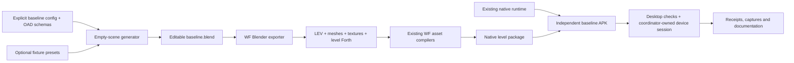
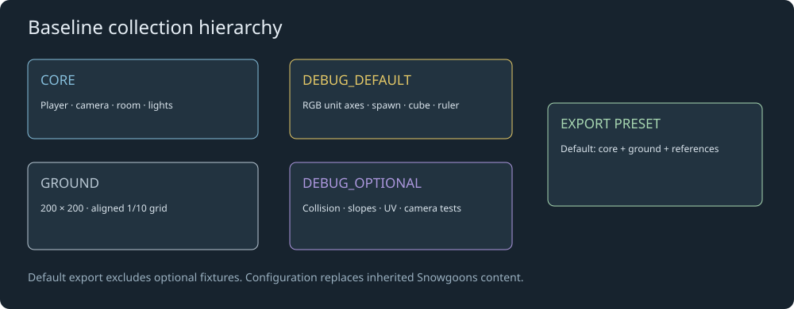
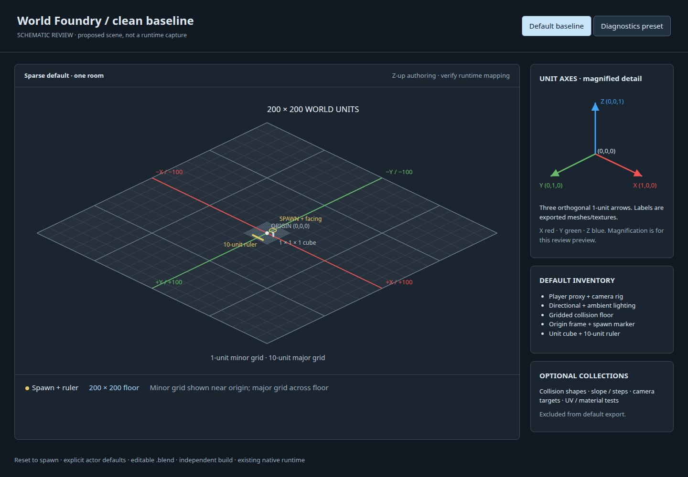
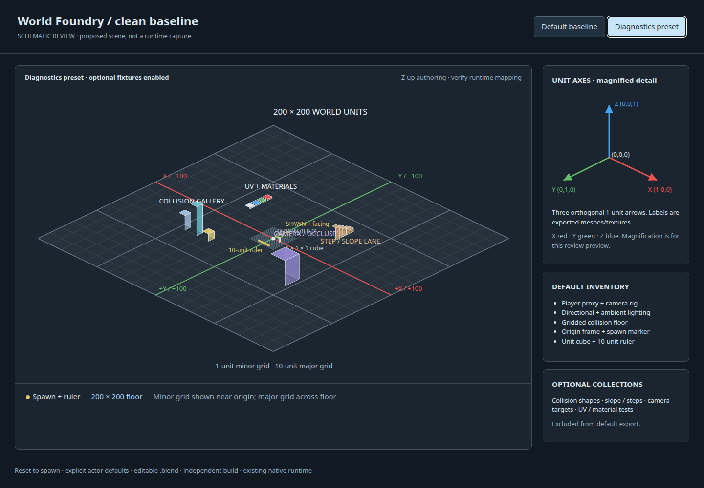
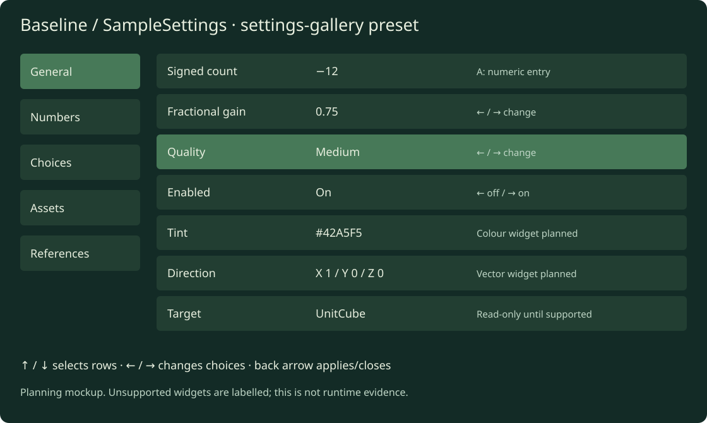

# A clean World Foundry baseline level

Create a reusable starting level, editable Blender file, small authoring/build toolkit and dedicated documentation. Update current level-authoring and debugging documentation to use this new baseline as the standard starting point. This becomes the foundation for new levels instead of importing Snowgoons and carrying its settings forward. Implementation authorized on 2026-10-06; the `.blend` and production toolkit are deliverables below.

## Status

Moved on 2026-10-06 from Finding Your Way into the World Foundry project, with
the complete plan-specific mockup bundle. Implementation ownership is now here;
Finding Your Way consumes the finished baseline in a separate migration.

- [x] Inspect the current generator, scaffold actor types and native build pipeline.
- [x] Specify a minimal scene, larger floor and coordinate tools.
- [x] Create architecture/layout diagrams and interactive scene mockups.
- [x] Implement the baseline generator, editable `.blend`, exporter/build entry points and docs.
- [x] Verify export, native movement/collision, camera behavior and coordinate conventions.
- [ ] Migrate current documentation, quick starts, examples and screenshots from the Snowgoons scaffold to the verified new baseline.
- [x] After baseline verification passes, append it to the main `cd.iff`, preserve existing level indices and verify selection/launch from the assembled bundle.
- [ ] Commit and release the verified baseline; migrate a copy of Finding Your Way separately.

## Current implementation

Initial implementation is under [wflevels/baseline](../../wflevels/baseline/README.md).
The generator starts empty and saves an editable Blender file. Export/build,
optional fixture exclusion and OAS/OAD source/compiled checks are implemented.
Native gameplay checks and all 20 default/gallery assertions passed on both Chromecasts.
Baseline is appended at main CD index 7, preserving the previous shell and seven levels.
The rebuilt bundle passed all 156 checks. The shared settings host and Planted Tank
consumer migration are implemented under explicit engine authorization.
[Acceptance evidence](../diagnostics/baseline/generic-settings/README.md)
records matching build hashes and passing plant acceptance on both Chromecasts.

## Scene contract

Start from an empty Blender scene. Construct each required World Foundry actor explicitly using the existing OAD schemas and a reviewed configuration manifest. Inspect the proven player/camera setup for compatible values; do not import the Snowgoons level, its models, actors, textures or scripts. Every retained actor gets a documented purpose and explicit settings. An actor that appears required must be confirmed by export/runtime testing before it becomes part of the baseline.

Default proposed floor: **200 × 200 world units**, centred at `(0, 0, 0)`, with its walking surface at `Z=0` and a 0.5-unit slab below it. This is over 50 times the area of the current 26 × 28 Temple floor. Treat one Blender unit as one world unit; use a provisional metre interpretation for dimensions and speed, and verify exporter/runtime scale before documenting it as metres. Keep dimensions configurable. Test this size against native bounds, numeric precision and clipping rather than assuming that arbitrarily larger coordinates work.

The floor has **1-unit minor grid lines**, stronger **10-unit major lines**, and numbered major coordinates around the perimeter and near the origin. Make the grid a small repeating texture with deliberately aligned UVs; avoid thousands of line actors, duplicate coplanar surfaces or a huge unique texture. Verify wrapping/repetition through the existing texture atlas path. If UV wrapping cannot survive that path, use bounded tiled floor render meshes and retain a small collision mesh. Measure export/chunk sizes before choosing the fallback. Minor lines can become faint at distance; major lines should remain readable. Use a neutral dark floor so the RGB axes stand out.

### Required default objects

| Object / collection | Purpose | Proposed settings |
| --- | --- | --- |
| `CORE/Level`, `CORE/Room` | Level metadata and spatial membership | Explicit mailbox count and room bounds enclosing floor, camera and player; runtime-confirmed margin |
| `CORE/Director` | Minimal level initialization | Only reset, camera and debug state; no adventure/dialogue logic |
| `CORE/Player` | Movement and collision reference | Simple visible capsule-shaped proxy; explicit collision hull, dimensions, speed and gravity |
| `CORE/Camera`, follow/target actors as needed | Inspect the scene while playing | Documented follower with optional first-person mode; explicit near/far planes and input bindings |
| `CORE/Directional`, `CORE/Ambient`, background actor if required | Stable lighting reference | One directional and one ambient light, neutral background |
| `GROUND/Floor` | Large collision surface and grid | 200 × 200, top at Z=0, consistent grid origin; no invisible rescue floor |
| `DEBUG_DEFAULT/OriginAxes` | Coordinate orientation and scale | Three unit basis arrows, labels and endpoint coordinates |
| `DEBUG_DEFAULT/Spawn` | Identify initial position/facing | At `(0, -5, clearance)`, labelled ring and forward arrow; visual mesh has no collision |
| `DEBUG_DEFAULT/UnitCube` | Known scale and collision reference | 1 × 1 × 1 cube at `(5, 0, 0.5)`, dimension labels and visible collider |
| `DEBUG_DEFAULT/Ruler` | Distance/speed reference | Flat 10-unit measuring strip alongside the origin area; contrasting 1-unit ticks |

Player dimensions are a proposed 0.6-unit diameter and 1.8-unit height. Native collision may use a different shape: display the actual configured hull, not an invented capsule collider. The camera must cover the floor diagonal from the intended viewpoints; select a tested far plane and room bounds together. Keep reset-to-spawn available so the large floor is practical to explore. Debug meshes do not become unintended physical obstacles.

## RGB coordinate frame

Use three **unit basis vectors** from a shared origin:

| Axis | Colour | Vector / tip |
| --- | --- | --- |
| X | Red `#ef5350` | `(1, 0, 0)` |
| Y | Green `#66bb6a` | `(0, 1, 0)` |
| Z | Blue `#42a5f5` | `(0, 0, 1)` |

Each shaft plus arrowhead ends exactly one unit from the origin. Put the letters **X**, **Y**, **Z** beyond the tips and label the origin `(0,0,0)`. Include short negative-axis ticks so direction is unambiguous. These are three separate unit vectors; a diagonal `(1,1,1)` would have length √3. Keep geometry dimensions accurate even when the preview shows a magnified detail.

Blender authoring uses Z-up. Verify the export/runtime axis mapping and handedness using known point locations, movement and camera captures. Document the verified mapping instead of assuming the runtime matches Blender. Include labels as actual exported geometry or textured meshes; Blender viewport-only annotations must not masquerade as runtime features. Labels carry axis identity independently of colour.

A magnified coordinate-frame view is useful for inspecting the one-unit arrows. A screen-corner orientation compass is an optional later overlay only if the existing runtime can support it through level assets/scripts. The mockup inset is explanatory UI, not a promised engine HUD.

## Optional debugging fixtures

Keep these in separate collections, excluded from the default export. Provide a `diagnostics` preset that enables a selected set. Each collection has an explicit name, purpose, actor/texture cost and reset behavior.

| Fixture | What it tests | First implementation |
| --- | --- | --- |
| Collision gallery: box, sphere-like mesh, wedge, thin wall | Hull alignment, collision versus visual mesh, face winding | Three simple solids and visible actual hulls; distinguish render mesh from collision data |
| Ramp and stair lane | Grounding, slopes, step heights, edge cases | Labelled 15°/30°/45° ramps; 0.1/0.2/0.4-unit steps; enable only tested physics features |
| Floor seam and drop edge | Snagging, tunnelling, airborne state and recovery | Small bounded test pad beside the main floor; reset after falling |
| Camera target / occlusion wall | Follow distance, near clipping, obstruction behavior | Height-marked target and movable wall; document observed obstruction behavior |
| Material / UV swatches | Lighting, UV orientation, mirroring, transparency, texture seams | Neutral/rgb swatches, checkerboard and asymmetric labelled UV test pattern |
| Moving platform / rotating object | Script timing, transforms, attachment behavior | Off by default; add after static baseline passes |
| Room-boundary pair | Membership, adjacency, asset loading | Separate two-room preset, not an invisible complication in the default room |
| Runtime readout and input echo | Position, heading, speed, grounded state, camera mode, pressed/released controls | Use available logs/captures first; add an on-screen panel only with existing level capabilities |
| Timing / actor counters | Regressions from enabled fixtures | Existing coordinator profiling and runtime logs; report measured values rather than decorative HUD numbers |

Recommended first extras: unit cube/ruler, collision gallery, slope/step lane, UV swatches and reset-to-spawn. Add motion, room transitions and readouts after the static baseline is dependable. Baseline physics parameters should be documented together; this should not silently inherit the adventure's disabled jumping, dialogue input remapping or 512-mailbox allocation.

## Deliverables and ownership

Use `wflevels/baseline/` in World Foundry for the implementation. Keep it
independent of Finding Your Way's `parmenides-slice`; other games consume this
baseline as the standard template. Follow existing level build conventions.

```text
wflevels/baseline/
  README.md                 # quick start, export/build/play
  baseline.json             # dimensions, actors, camera, controls, presets
  baseline.blend            # reviewed editable default scene
  generate.py               # empty scene → explicit actors and meshes
  fixtures.py               # optional fixture builders
  build.py                  # existing WF compilation and APK packaging
  verify.py                 # structural and exported/runtime assertions
  scripts/baseline.fth       # minimal level behavior
  settings.oas              # level-owned sample object property schema
  settings-bindings.json    # stable field IDs and instance exposure
  docs/
    scene-contract.md       # object inventory and inheritance-free defaults
    coordinates-and-scale.md
    controls-and-debugging.md
    export-and-runtime.md
  build/                    # ignored outputs, receipts and diagnostics
```

The `.blend` is a real deliverable, not just a disposable intermediate. Keep its clean default collections visible and optional fixtures hidden/excluded. Document generator ownership: regenerating produces a new output and must not overwrite hand-edited `baseline.blend` without an explicit command. Preserve editable meshes, readable actor names and collection grouping. Commit the reviewed Blender file plus source/config; record Blender/exporter/tool versions in build receipts. Exclude signing keys and machine-specific absolute paths from the portable configuration.

Proposed commands: `task baseline:generate`, `baseline:export`, `baseline:build`, `baseline:verify`, and `baseline:check`. Export the reviewed `.blend` independently of regeneration, so manual edits can be tested. Build an independent Android package such as `org.worldfoundry.wf_game.baseline`; use the existing engine libraries unchanged and identify their hashes in receipts.

## Documentation migration to the new baseline

Make the new baseline the documented starting point for creating, exporting, playing and debugging a level. Update existing entry points as well as writing the new baseline docs; a separate guide alone is insufficient. Name it **World Foundry baseline** consistently and link to its reviewed `.blend`, configuration, quick start and debug-fixture guide.

| Documentation area | Planned update |
| --- | --- |
| Finding Your Way `README.md`, `docs/operations.md`, `docs/plans/world-foundry-adventure.md` | Point new-level authoring and debugging instructions to World Foundry's `wflevels/baseline/README.md`; describe the separate migration of the existing adventure accurately |
| `game/parmenides-slice/README.md` | Document use of the new baseline after the adventure generator is migrated and parity passes; link its explicit player/camera setup rather than recommending a Snowgoons import |
| World Foundry `README.md` and `docs/dev-setup.md` | Make the baseline the first new-level/verification walkthrough, with explicit build/output paths and tested launch commands |
| World Foundry `docs/wf-edit-manual.md` | Replace starter walkthroughs with baseline assets, actor names and fresh editor screenshots; demonstrate grid scale, axes and unit cube |
| World Foundry `docs/level-layouts.md` | Add a baseline layout/inventory section and make it the recommended reusable template; describe optional diagnostics separately |
| World Foundry `docs/scripting-languages.md` | Use the minimal baseline player/director behavior for introductory examples; identify any sample-specific script demos explicitly |
| Blender/exporter guides and linked quick starts discovered during implementation | Use the new `.blend` and baseline export paths for create-a-level examples; document required actors and explicit defaults |

For each guide, update copyable commands, asset paths, screenshots, labels, actor counts and expected output together. Capture actual baseline/editor/runtime images once implementation passes; schematic plan mockups do not become verification screenshots. Link shared scene/coordinate/controls documentation rather than maintaining conflicting copies of the actor defaults.

Current runtime and editor defaults may still select Snowgoons: `docs/dev-setup.md` documents a hardcoded boot level, and `docs/wf-edit-manual.md` documents Snowgoons defaults. Use verified explicit launch arguments, a build wrapper or the appropriate level package in the new walkthrough. Continue to document actual executable defaults accurately until they change. Changing engine defaults is a separate implementation decision subject to the existing engine-approval rule; replacing documentation examples does not require claiming such a change.

Preserve factual historical investigations, archived milestone receipts and Snowgoons-specific regression/game documentation. They describe real past artifacts. Label a superseded starter guide and link to the new baseline where appropriate; do not replace historical asset names or byte-identity claims with baseline names. Keep Snowgoons available as a sample/regression fixture, while making the new baseline the recommended authoring template.

- [ ] Inventory active Snowgoons-as-starter references across both repositories and record each destination/update.
- [ ] Update the main quick start and level-creation walkthrough to use only the baseline's assets, scripts and build commands.
- [ ] Update editor, scripting, layout and exporter examples with verified baseline screenshots and expected output.
- [ ] Run every documented command from a fresh generated baseline or reviewed `.blend`, following the stated prerequisites.
- [ ] Check relative links and asset paths; search again for remaining Snowgoons starter instructions and resolve or explicitly retain each occurrence.
- [ ] Confirm historical evidence and sample-specific tests still identify their original assets correctly.

## Architecture diagram



[](2026-10-05-world-foundry-baseline/layout.svg)

## Mockups

These are schematic previews of the proposed scene, not Blender renders or evidence of a playable implementation. The interactive preview switches between the sparse default and optional diagnostics. The floor overview draws major grid lines; the 1-unit detail and coordinate inset show the fine scale. Prototype controls are review controls, not final gameplay bindings.

[Open interactive mockups](2026-10-05-world-foundry-baseline/mockups.html).

### Default baseline — large floor and scale tools

[](2026-10-05-world-foundry-baseline/mockups.html)

### Diagnostics preset — optional collision and camera fixtures

[](2026-10-05-world-foundry-baseline/mockups.html#diagnostics)

## Implementation sequence and acceptance

1. Inventory required OAD types and enumerate explicit defaults. Confirm actor IDs, references, input policy and camera configuration using the existing runtime. Create the new configuration/schema documentation first.
2. Generate the empty-scene baseline, floor/grid, lighting, player/camera and unit references. Save the editable `.blend`. Add optional fixtures in separate collections with a tested export exclusion mechanism.
3. Export and compile with the existing toolchain. Verify that grid UVs, axis colours/labels, collision hulls, scene units and room membership survive the pipeline. Record measured actor, triangle, texture and chunk counts.
4. Check native movement in +X/+Y, gravity/up direction, scale and camera switching. Walk a known 10-unit distance, test floor quadrants/seams and confirm repeatable reset. Inspect collision rather than accepting appearance alone.
5. Verify the same frozen APK on Chromecast through `task chromecast:*`, with coordinator-owned launch/input/capture/lifecycle sessions. Capture the axes, grid, cube and diagnostics preset; keep receipts and hashes. Phone acceptance is separate if a phone target is added.
6. Migrate the documentation entry points listed above after the baseline passes. Execute each updated walkthrough, capture real screenshots, verify links and audit remaining Snowgoons starter references.
7. After the baseline passes native and device verification, append `baseline-standalone.iff` to the main `build-cd-iff` bundle without shifting existing TOC indices or changing its boot level. Rebuild `cd.iff` and verify the baseline launches from the assembled bundle. Keep this integration gated on matching verification evidence.
8. Commit source, docs, reviewed Blender file and test evidence. Demonstrate that a second fresh level can be created using only this baseline, without a Snowgoons import or Parmenides dialogue/assets. Migrate Finding Your Way in a separate change after parity checks.

- [ ] Default exported inventory contains only documented core actors and sparse debug references.
- [ ] Floor spans exactly −100…+100 on X/Y, with its top at Z=0 and measured 1/10-unit spacing.
- [ ] All three axes are perpendicular, have unit-length tips, carry correct colours and readable X/Y/Z labels in Blender and runtime.
- [ ] Native axis mapping, scale, collision shape, speed/gravity and camera clips are verified and documented.
- [ ] Optional fixtures add no actors/textures/scripts to the default export; generated scene has no adventure content or Snowgoons asset references.
- [ ] Regeneration and manual-edit workflows preserve user work and have reproducible receipts.
- [ ] Current new-level walkthroughs start from the new baseline, all documented commands/links work, and screenshots show the verified baseline; executable defaults and historical Snowgoons records remain accurate.
- [ ] Native desktop checks and matching APK device evidence pass; camera, input release, reset and Home/resume work.

Engine modifications remain governed by [World Foundry’s AGENTS.md](../../AGENTS.md): “Authorization to implement a level, asset, animation or plan does not authorize engine changes.” Investigate existing capabilities and continue asset/script/tooling work; prepare a concrete proposal for discussion if a required feature needs an engine change. No engine changes are part of this planning work.

## Sample configuration object: generic OAS/OAD settings

Add `CONFIG/SampleSettings` with a level-owned `settings.oas` and bindings to the
[generic runtime object editor](2026-10-06-runtime-oas-oad-object-editor.md).
Use one instance with readable sections and groups, plus a second instance for
isolation tests. The default baseline includes a small representative settings
section; the `settings-gallery` preset exposes the complete coverage fixture.
Keep it separate from gameplay/physics defaults so exploring the gallery cannot
break the movement reference.

The complete fixture contains **one field per meaningful type/`showAs` pair**,
not just one field per normalized widget kind. Expand every type listed in a
matrix row into separate fields and IDs. Save a coverage manifest containing
the original button type, byte width, full `showAs` byte (including modifier
bits), range, choices, default, stable field ID and expected TV/phone behavior.
Also record identity/display names, help, section/group order, enable expression,
string length/filter, XData conversion action, exposure/read-only policy and
known-versus-synthetic provenance. Preserve the original metadata even
when several descriptors use the same generic widget.

### Coverage matrix

Sources: [legacy descriptor codes](../../wfsource/source/oas/oad.h),
[OAS descriptor macros](../../wfsource/source/oas/types3ds.s),
[shared normalization](../../wftools/wf_attr_schema/src/lib.rs),
[current catalog cooker](../../scripts/build-object-properties.py).

| Type / semantic constraint | `showAs` values; create a distinct example for each | Sample / expected behavior |
|---|---|---|
| `BUTTON_INT8`, `INT16`, `INT32`, plain signed integer | `N_A`, `NUMBER`, `SLIDER`, `HIDDEN` | Signed count; explicit width/range; slider uses arrows directly; hidden field never becomes a row |
| `INT8`, `INT16`, `INT32`, bounded enumerated values with labels | `N_A`, `NUMBER`, `SLIDER`, `TOGGLE`, `DROPMENU`, `RADIOBUTTONS`, `COMBOBOX` | `Low\|Medium\|High`, including a nonzero minimum; arrows change enum values directly; preserve labels and numeric storage |
| `INT8`, `INT16`, `INT32`, Boolean range 0…1, without choice labels | `CHECKBOX`, `TOGGLE` | Enabled flag; left = off, right = on; never permit arbitrary integers; do not infer Boolean solely from the current value |
| `INT8`, `INT16`, `INT32`, Boolean range 0…1, with `False\|True` labels | `CHECKBOX`, `TOGGLE`, `RADIOBUTTONS`; default/number/slider/dropdown/combo presentations covered by the enum row | Legacy Boolean macros normalize labelled values as Enum; verify logical off/on behavior and preserve each presentation |
| `BUTTON_FIXED16`, `FIXED32` | `N_A`, `NUMBER`, `SLIDER`, `HIDDEN` | Signed fractional gain; correct storage scale/step; validate exact bounds |
| `BUTTON_INT32`, mailbox ID | `MAILBOX` | Existing mailbox in the configured level; validate against actual mailbox capacity rather than a magic 3999 |
| `BUTTON_INT32`, packed RGB | `COLOR` | Colour swatch plus packed `0xRRGGBB`; validate 0…0xFFFFFF; no pretending an arbitrary integer widget is a finished colour picker |
| `BUTTON_STRING`, bounded single-line text | `N_A`, `NUMBER`, `HIDDEN` | Short label, empty value and maximum length; NUMBER includes the shipped decimal unsigned Seed with 0 and 4294967295 boundary cases; preserve text storage and its explicit validation rule; hidden value omitted from form |
| `BUTTON_STRING`, multiline text | `TEXTEDITOR` | Notes with line breaks; bounded text and appropriate phone keyboard |
| `BUTTON_STRING`, suggested labels with editable text | `COMBOBOX` | Suggested names plus a custom value; distinct from integer enum storage |
| `BUTTON_FILENAME`, `MESHNAME` | `N_A`, `FILENAME`, `HIDDEN` | Existing cooked asset choices and filters; no host filesystem browser on TV |
| `BUTTON_STRING`, path-valued bounded text | `FILENAME` | Explicit path semantics/filter; resolves only allowed assets, not arbitrary device files |
| `BUTTON_OBJECT_REFERENCE`, `CAMERA_REFERENCE`, `LIGHT_REFERENCE`, `CLASS_REFERENCE` | `N_A`, `COMBOBOX`, `HIDDEN` | Valid typed existing targets, null option where allowed, missing/deleted target; class reference remains a class ID |
| `BUTTON_XDATA` with `XDATA_IGNORE`, annotation/text only | `N_A`, `TEXTEDITOR`, `DROPMENU`; `COMBOBOX` as synthetic editable-suggestion coverage | Legacy TYPEENTRYSTRING emits XData, not BUTTON_STRING; the shipped test String has DROPMENU and labels. Preserve string storage, labels and original hint; report unsupported choice presentation rather than silently turning it into an integer enum. Classify authoring-only versus runtime-retained text explicitly |
| `BUTTON_OBJECT_REFERENCE` with `VECTOR` modifier | `VECTOR \| N_A`; hidden companion for omission checks | Match shipped Follow/Target reference descriptors. Preserve the typed target and modifier; this is not a scalar XYZ vector. Determine modifier semantics from exporter/host behavior and mark unsupported interpretation explicitly |
| Fixed-point X/Y/Z component triplet | `VECTOR` flag with `N_A`, `NUMBER`, `SLIDER`; also hidden triplet | One logical vector with component IDs; each component uses correct scale; preserve component/group metadata |
| `PROPERTY_SHEET`, `GROUP_START`, `GROUP_STOP` | `N_A` | Sections and named groups, empty group, multiple sections, scrolling; structural entries have no editable scalar value |

`VECTOR` is the modifier bit `0x80`, not a stand-alone scalar type. Inspect and
verify actual triplet encoding before cooking that fixture: the legacy
`TYPEENTRYVECTOR` descriptor macro is not sufficient evidence of correct X/Y/Z
encoding. `N_A` requests the type's default presentation. Hidden is sensible
for any retained value type; add hidden companions for the enum, Boolean,
mailbox, colour and annotation examples too. Structural markers and compiler
flags are not editable configuration fields. XData conversion/script chunks,
camera-extraction directives, waveform/compiler flags and common-block markers
are represented in an authoring audit, not fabricated runtime settings controls.

Do not expand meaningless combinations such as a float colour, numeric filename
slider, checkbox with five states or section header as a mailbox. Any additional
legacy pairing found during schema/exporter auditing must be classified and
added to the manifest, or given a concrete exclusion reason. The audit must
account for every declared descriptor type and `showAs` code.

### Coverage review and acceptance boundaries

Reviewed on 2026-10-06 against the descriptor enum/macros, checked-in OAD usage,
shared normalizer and catalog cooker. The matrix is the coverage contract. Initial implementation now provides
`wflevels/baseline/settings.oas`, `settings-gallery.oas`, their compiled OADs and
`settings-coverage.json`: five representative default fields and 118 gallery
fields, with all descriptor types/presentation codes classified. Source/compiled
checks and the shared settings host are implemented. Default/gallery device
acceptance passed; complete interactive coverage of every presentation remains pending. The small mockup is representative, not the complete gallery.

The manifest must classify all 29 declared button types and all 13 base
`showAs` codes (0…12), plus the VECTOR modifier. The scalar, reference, text and
structural types are covered above. Give explicit exclusions for
`NOINSTANCES`, `NOMESH`, `SINGLEINSTANCE`, `TEMPLATE`, `EXTRACTCAMERA`, `ROOM`,
`COMMONBLOCK`, `ENDCOMMON`, `EXTRACTCAMERANEW`, `EXTRACTLIGHT`, `SHORTCUT`,
`BUTTON_EXTRACT_CAMERA` and `BUTTON_WAVEFORM`: compiler/export directives or
authoring data, not fabricated instance settings. Check each actual occurrence;
a declared but unused type remains an audit entry, not an invented shipped use.
Converted XData actions likewise require individual exclusion reasons.

A type/hint matrix alone is insufficient. Add these semantic variants without
requiring a meaningless Cartesian product:

- Booleans with and without pipe labels; enums with negative/nonzero minima,
  two/three/many choices, long labels and an invalid range/choice-count mismatch.
  Distinguish closed integer COMBOBOX choices from editable string suggestions.
- Fixed16 and Fixed32 signed fractions, exact representable limits, smallest
  representable steps and nonzero slider minima; test storage quantization and
  the chosen UI step independently. Narrow storage stays supplemental until
  supported by the actor packing path.
- Empty/maximum-length/overlength text, multiline line breaks and UTF-8 byte
  limits versus phone character limits; readonly companions for editable value
  families. A read-only display does not count as editable-widget acceptance.
- Visible, hidden and conditionally enabled fields, including dependencies
  changed in a draft. Preserve enable expressions and report unsupported
  evaluation/retention instead of claiming conditional parity.
- Typed null/valid/wrong-type/missing/deleted references, class IDs distinct
  from actor IDs, allowed/disallowed asset choices and original file filters.
  Current catalogs must explicitly report any metadata they discard.
- Repeated display labels with distinct identity keys/IDs, multiple sections,
  empty/populated groups, all-choice sections, long help and scrolling. Verify
  structure/order survives cooking and both instances remain independent.
- Known VECTOR-marked references, separately proposed scalar triplets, and
  document VEC3/EULR/BOX3 transforms. The last category is an authoring/export
  audit unless explicitly exposed by a supported runtime binding; do not
  fabricate Euler/box OAD types.

For each case record source OAS → compiled OAD → normalized schema → cooked
catalog → effective instance value, or the exact stage and reason for exclusion.
Visible editable, visible read-only, hidden omission, unsupported and
synthetic/unimplemented are separate results. Declaring all codes accounted
for is not the same as implementing all runtime widgets.

### Visibility and relevance gate

Before using an Observed behavior entry as a runtime widget requirement, audit
its actual descriptors and enable conditions. Separate known visible settings,
always-hidden/generated values, authoring/compiler data and synthetic
compatibility examples. See the [known-usage visibility audit](../reference/2026-10-06-oas-oad-editor-rendering-audit.md#visibility-filtering-and-known-usage).

Always-hidden cases get omission and applicable retention/readback checks,
not visible gallery rows or missing-widget claims. Compiler flags, common-block
markers and generated slope coefficients do not become runtime settings merely
to exercise renderer fallback code. Keep visible fixed-point, colour and
reference examples: their known descriptors are not universally hidden.
Evaluate conditional fields in eligible states before excluding them.

Record unused meaningful type/hint pairs as synthetic coverage in the manifest;
they do not establish a current gameplay requirement. Keep document transforms,
VECTOR-marked references and proposed scalar-vector triplets distinct.
Annotation examples require an explicit authoring-only versus runtime-retained
classification; being skipped by wf-edit does not make them universally hidden.
The complete audit still accounts for excluded types and hints with reasons.

### Current support and planned gaps

See the [Blender / wf-edit / runtime rendering audit](../reference/2026-10-06-oas-oad-editor-rendering-audit.md) for actual host behavior and simplified fallbacks.

Current sources cover integer/fixed/text/enum/Boolean fields, sections,
actions and generic validation; TV includes slider/radio rendering and phone
includes a packed-RGB colour control. This is source capability, not acceptance
of every matrix pair. A complete TV colour control and grouped vector widgets
remain gaps. File/object references cook as read-only; XDATA_IGNORE annotations
now cook as text with multiline validation when explicitly bound. Their runtime
retention/exposure still needs a fixture. Hidden values are omitted by the
current catalog cooker. Narrow-width OAD types exist in the reader, while standard legacy actor
layout macros disable narrow storage for alignment reasons. Test them as
supplemental catalog fixtures without silently changing actor packing.

The baseline gallery must expose these gaps honestly. Show read-only values
where meaningful and track dedicated widget/retention work as TODOs. Implement
editable asset/reference/vector/colour support only through reviewed existing
APIs or a separately approved engine proposal. Do not call the full matrix
implemented merely because the form can display a numeric fallback.

### Interaction, mockup and acceptance



```text
Sample Settings                       General | Numbers | Choices | Assets
  Signed count                 -12             [A: numeric entry]
  Fractional gain               0.75           [← / →: change]
  Quality                       Medium         [← / →: change]
  Enabled                       On             [← off / → on]
  Tint                          ■ #42A5F5      [planned colour widget]
  Direction                     X 1 / Y 0 / Z 0 [planned vector widget]
  Target                        UnitCube       [read-only until supported]
  Notes                         Baseline sample

↑ / ↓ selects rows     ← / → changes choices     ← applies / closes
```

Opening the form consumes its opening press and keeps numeric entry closed.
A fresh A press opens numeric entry only for a numeric/text field. For choices,
toggles and sliders, arrows work immediately and do not also move focus into
the section rail. Section navigation must retain a reachable explicit path;
test an all-enum section as well as mixed rows. Phone controls mirror schema
types, constraints, choices and the same authoritative draft.

- [ ] Create OAS/OAD fixtures and the complete pair-coverage manifest; record exclusions and support status explicitly.
- [ ] Verify shared normalization, field widths/scales, enum offsets, defaults and cooked readback for every pair.
- [ ] Confirm invalid type/presentation pairings fail or report unsupported status, rather than silently changing type.
- [ ] Test TV/phone apply, cancel, invalid values, bounds, release gating, enum arrows and scrolling across all sections.
- [ ] Verify two instances retain independent edits and stale/deleted targets are handled correctly.
- [ ] Record actual desktop/device captures and property snapshots; mockups remain labelled as mockups.
- [ ] Keep fixture costs out of the sparse default performance baseline, and measure the gallery as a separate preset.
