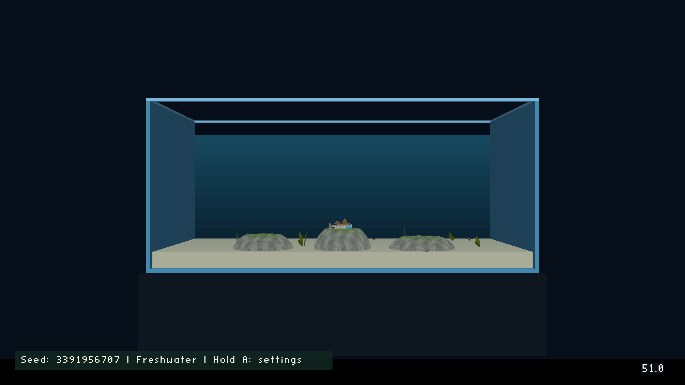
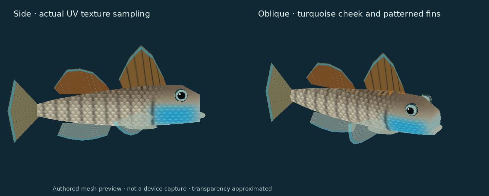
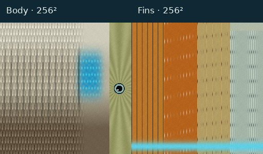
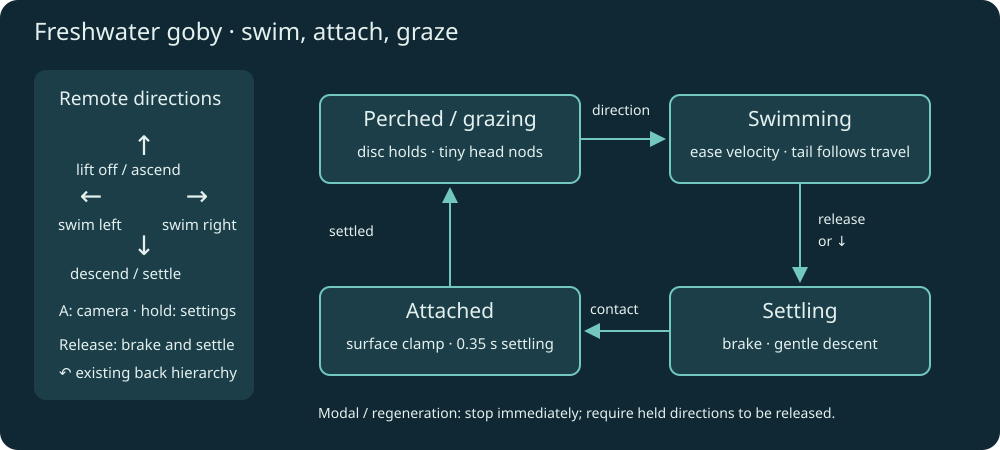
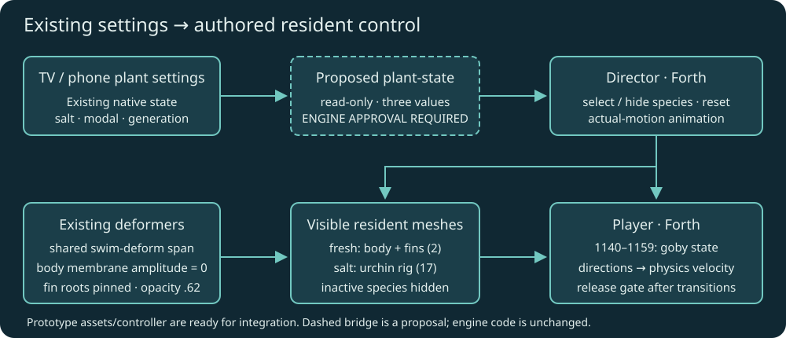

# Freshwater rainbow goby in Planted Tank

6 October 2026. Selected by Will: rainbow goby for freshwater, with different
controls from the sea urchin. Engine edits require a separate explicit approval.

## Result

Freshwater has one playable adult male **Stiphodon ornatus**. Saltwater retains
the sea urchin. Changing water type in the existing settings regenerates plants
and switches the resident, clears held input and resets locomotion. Seed and
growth speed keep their current meanings. Returning through the selector keeps
the existing back-arrow hierarchy.

This is a planted aquarium with rounded grazing stones, rather than a claim to
reproduce a rocky stream. [Independent research and sources](../reference/rainbow-goby-research.md)
were saved before this plan and prototype.

[A3 portrait research poster](../reference/rainbow-goby-biomechanics-poster/poster.html)
· [Printable PDF](../reference/rainbow-goby-biomechanics-poster/rainbow-goby-biomechanics-a3.pdf).

### Grazing rocks — implemented 6 October

Three rounded rocks are now visible in freshwater, with a deterministic 256²
mottled stone/biofilm texture. Broad top surfaces support a stable grazing pose.
The goby's authored Forth support profile uses the same rock dimensions as the
meshes, along its fixed swim plane. Saltwater hides these freshwater perches.
This adds three visual actors and 384 source triangles, without additional
physics bodies or engine changes. Four 256² animal/rock textures share the
existing 512² permanent page.

The cast1 launch check passed (`J-f5bfc4b9d263`); its log reports the goby settled
at Z=1.365 on the centre stone. Twelve goby tests pass, including support heights,
settling and compilation of the actual exported scripts in both configurations.





This is a source-mesh preview, not a device capture. The prototype is two meshes
(body and fins), with two deterministic 256² maps. Fins use existing material
translucency at 0.62 and existing `swim-deform`; body uses the same head/tail span
with membrane amplitude zero. The joined pelvic pad is pinned against fin flutter.
Opaque eyes and lip remain in the body mesh. Two dorsals, a broad caudal fin and
raised eyes distinguish the goby from betta/clownfish assets.

### Revised colours and textures

Will requested substantially better textures and colours. The revised albedo
uses silver/brown overlapping scales and broken dusky posterior bars, a local
turquoise cheek, orange dorsal membranes, dark first-dorsal rays, spots along
second-dorsal/tail/pectoral rays, and thin cyan margins. Eyes now have a dark
pupil, coloured iris and small highlight. The maps remain **256²**; geometry,
actor count, fin opacity and motion UV weights are unchanged.



The updated preview rasterizes interpolated UVs with bilinear texture sampling;
the first preview incorrectly presented one sampled colour per face and hid
most texture detail. Neither preview is a device screenshot. The first version
is retained under `first-prototype/` for comparison. Authoring remains editable
in `goby.py`; no photographic pixels were copied into the maps.

## Controls and movement

| Input | Freshwater goby | Saltwater urchin |
|---|---|---|
| ← / → | Detach and swim horizontally; turn smoothly | Existing slow substrate crawl |
| ↑ | Lift off and swim upward | Existing movement in tank depth |
| ↓ | Descend; settle and graze when near a perch | Existing movement in tank depth |
| Release | Brake, descend gently, attach, then graze | Stop crawling; feet finish recovery |
| Short A | Existing camera toggle | Existing camera toggle |
| Hold A | Existing plant settings | Existing plant settings |
| Back arrow | Close/apply settings, then selector, then exit | Same hierarchy |

Goby movement stays in the visible X/Z swimming plane. The initial authored
speed targets are 0.55 horizontally and 0.42 upward, with exponential velocity
easing, a gentle 0.16 descent after release and a 0.45 deliberate descent. These
are game tuning values. Position clamps stop outward speed at the glass.
Attachment settles before grazing; stationary grazing uses tiny head nods and
pectoral flutter with no whole-body crawl. Tail waves follow actual displacement,
so pressing against glass does not produce a full swimming animation.



## Authored integration

Keep the existing Player physics carrier. Its urchin mesh is visible only in
saltwater. Two anchored goby mesh actors follow it only in freshwater; hide the
urchin feet and eight spine actors and skip their motion scripts in freshwater.
Keep plant meshes as eight native foliage groups. Authored stones have matching
surface-height metadata used by `gb-floor`; no new collision engine is proposed.
Use low, broad flat-topped stones so attachment has an unambiguous surface.

Forth owns goby state and input envelopes. Mailboxes 1140–1159 are reserved for
the goby controller, separate from urchin 800–967 and 1000–1111. Director owns
the resident selection, appearance and actual-motion animation; Player owns
physics velocity. After water/regeneration/modal transitions, zero speed and
require directional release before accepting movement. Re-anchor urchin contacts
when returning to saltwater. Phone directions feed the same held-input path.



## Water-selection integration — under discussion, engine unchanged

The automatic resident switch described above is an integration assumption,
not an approved engine requirement. Will questioned the engine bridge on
6 October. Goby meshes, textures and movement use existing engine capabilities.
Do not implement a new primitive until the scope and existing binding options
have been discussed and permission given.

Read-only investigation found that the native plant settings own `salt`, `modal`
and `generation` in `wfsource/source/game/plant_settings.h`. `plant-step` advances
geometry but returns none of these values. An OAS/OAD value alone would be a
second unsynchronised water setting; it cannot read the setting already changed
by the phone or TV interface.

The original proposal was **one read-only Forth primitive** in
`engine/stubs/scripting_zforth.cc`, reusing existing state:

```forth
plant-state ( -- saltwater modal generation )
```

The new syscall would be 178 (custom 50, currently unused). Its implementation
would only push those three existing fields; add `: plant-state 178 sys ;` to the
existing bridge dictionary. No new C++ settings state, renderer changes, UI
changes, water-setting writes or hardcoded goby mailbox addresses are proposed.
Forth stores the results in its authored bindings. Invoke after registration,
and once per Director frame, before species visibility and movement decisions.
Generation change triggers a reset even when the water type did not change.
Modal state blocks locomotion and protects held input across closing settings.

Follow-up audit: `game.cc` already pauses level updates while plant settings are
modal, so a new modal query is not needed simply to pause locomotion. Existing
plant settings do not currently publish water selection to a Forth mailbox;
the saved OAS/OAD runtime-settings migration remains a proposal rather than a
shipped binding. Prefer an authored water mailbox over a plant-specific syscall
if that integration is implemented. Do not imply that adding a schema by itself
already connects the native TV/phone setting to the authored mailbox.

Proposed new dispatch branch, between existing custom 49 and 72:

```cpp
} else if (custom == 50) {
    const auto& s = planted::state();
    zf_push(ctx, s.salt ? 1 : 0);
    zf_push(ctx, s.modal ? 1 : 0);
    zf_push(ctx, s.generation);
```

Add the one dictionary definition to the existing `zf_eval` bridge string.
Validate the stack order, current field values and absence of mutations. The
generation is used transiently for comparison, rather than accumulating a
fixed-point time counter. The proposal affects only the scripting bridge file.

**Await Will's explicit permission before editing engine code.** This follows
[AGENTS.md](../../AGENTS.md): “prepare a concrete proposal describing the required
engine changes and obtain permission before editing engine code.”

## Verification and delivery

1. Source geometry/UV/texture checks and actual Forth tests in float and simulated
   16.16 mailbox modes: lift, swim, release, settle/graze, held-input reset and
   glass clamps. Desktop tests establish correctness only.
2. After bridge approval, integrate and cook Planted Tank. Verify material
   texture names, translucency, permanent-page packing and actor ownership.
3. Chromecast: initial freshwater, saltwater switch and return, same-water seed
   regeneration, camera, TV/phone settings, held/released directions, Back,
   Home/resume and repeated selection. Include video of attachment and grazing.
4. Matched Chromecast seed/age/speed/camera traces before and after integration:
   three release runs plus a separate CPU trace, FPS/frame pacing, actor,
   Director/render CPU, draw calls, triangles and memory, with delta table.
   Do not compare unlike freshwater and saltwater foliage as a resident-only cost.
5. Restore and install ordinary Aquarium APK; record hash and coordinator job.

## Status

- Research saved; body/fin assets and texture authoring implemented independently.
- Goby controller prototype implemented with authored surface bindings.
- `pytest -q tests/test_goby.py`: **8 passed**, covering real Forth in float and
  simulated 16.16 mailbox modes, valid source geometry and deterministic textures.
- Engine code unchanged. Native bridge, generator integration, cooked assets and
  Chromecast verification remain pending integration discussion and implementation.
- This plan does not resume the deferred sea-anemone or generic deformation work.
