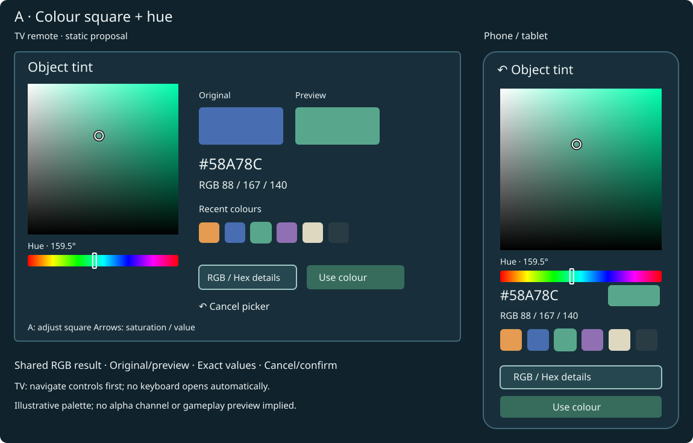
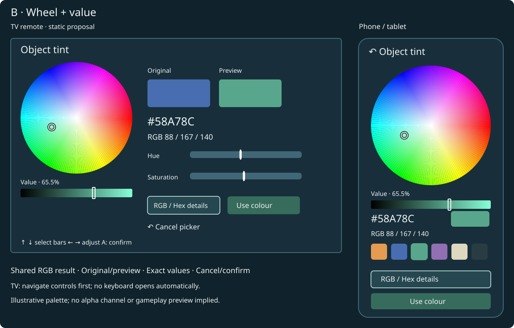
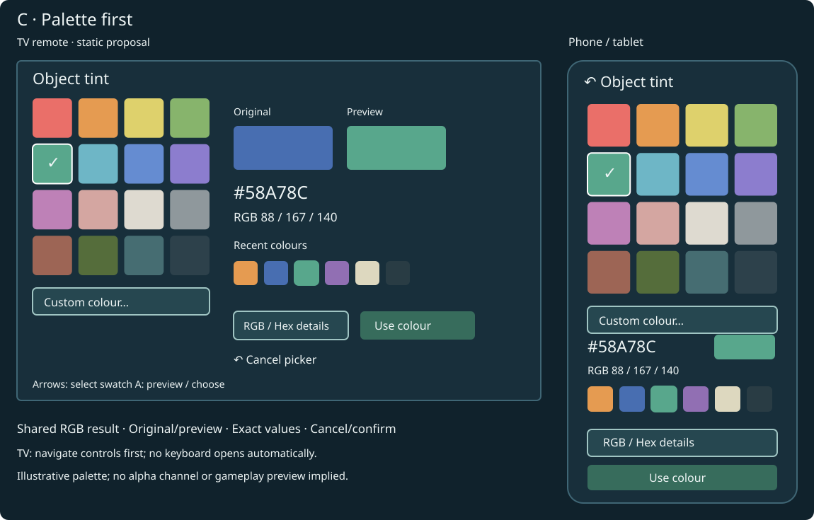
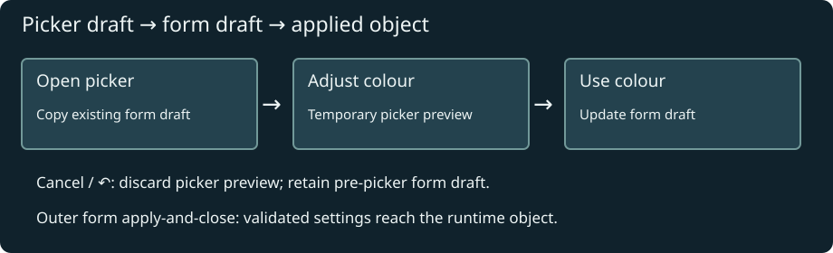
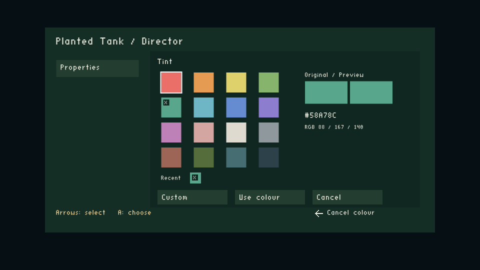
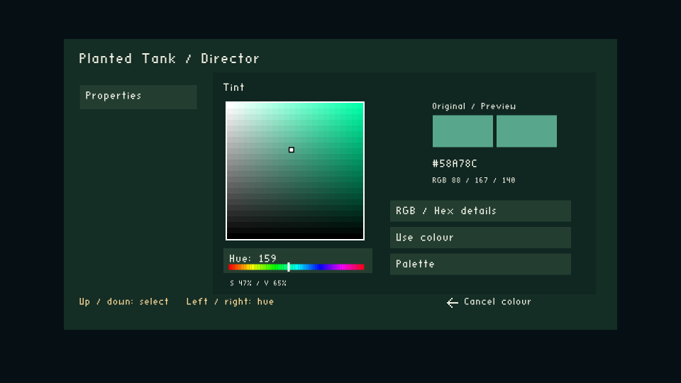
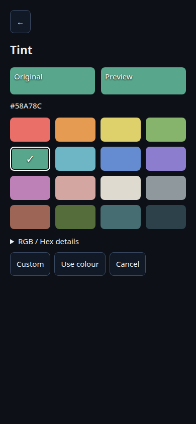
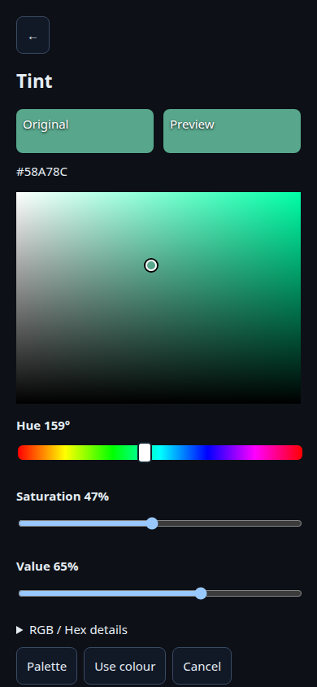
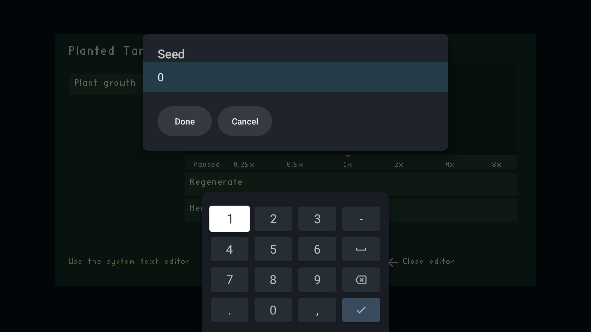

# Runtime colour picker: palette-first replacement

Date: 2026-10-06 · Status: Option C implemented and locally validated; TV text contrast verified on both devices; complete Chromecast palette interaction/profile acceptance remains pending.

Replace the basic runtime RGB picker with a visual colour editor for all `BUTTON_INT32 / SHOW_AS_COLOR` fields. Will selected C and explicitly authorized the two TV engine UI files on 2026-10-06. The original proposals remain below for comparison. The chosen design should work with a TV remote, phone/tablet touch, and browser keyboard/mouse. It belongs to the generic OAS/OAD editor, rather than to the plant level.

## Selected design and approval boundary

Will selected **C — Palette first + custom shades** on 2026-10-06. Implement the palette grid as the initial view, with selected/highlighted swatches, recent session colours and a Custom route to Option A’s saturation/value square and hue strip. Keep exact RGB/hex entry available.

The proposed engine surface is limited to `wfsource/source/game/runtime_property_controls.h` (palette navigation, temporary colour state, HSV conversion, custom editing and confirmation/cancellation) and `wfsource/source/game/runtime_property_ui.cc` (palette, original/preview swatches, custom square/hue strip and mode-specific hints). Spectrum drawing would initially use bounded existing solid rectangles, with cached colour calculations; device profiling will decide whether that approach is acceptable. No renderer API, core property binding, storage format, or Forth bridge change is proposed. If existing text-entry callbacks need adjustment for RGB/hex, keep it within the UI helper and the existing host contract.

The phone implementation changes `wfsource/source/hal/phonepad/controller.html` to the same palette/custom workflow with browser controls compatible with WebView 91. Tests and these documents accompany the changes. Any additional engine files or renderer changes require a fresh proposal. Permission for the two TV engine UI files was explicitly granted by Will (“i authorize”). The [AGENTS.md](../../AGENTS.md) rule still applies to any additional engine surface. Android Java text-field contrast was also corrected after Will reported unreadable black text; this uses the existing dialog and IME.

## Current behaviour

The TV presents a swatch, hexadecimal readout and three RGB bars. Left/right changes the selected channel by one; up/down selects a channel or Done. Choosing an unfamiliar colour means adjusting three numbers without seeing the available colours. The phone has a browser-native colour input plus RGB sliders, so its visual picker depends on the browser.

Read-only audit locations: `wfsource/source/game/runtime_property_controls.h`, `runtime_property_ui.cc`, and `wfsource/source/hal/phonepad/controller.html`. The TV helper currently emits solid `PhonepadRect` rectangles and bitmap text; a smooth spectrum is not an existing primitive in that helper. wf-edit already uses ImGui `ColorEdit3`; Blender uses its own picker through `wf.pick_color`. Importing either whole editor into runtime is unnecessary.

The stored value remains an integer `0x00RRGGBB`, transported as decimal. HSV is an editing representation, not a replacement storage format. No opacity control is included: this field has no alpha channel, even though the renderer supports translucency.

## Research and what it suggests

| Reference | Observed design | Application to our picker |
|---|---|---|
| [Microsoft ColorPicker](https://learn.microsoft.com/en-us/windows/apps/develop/ui/controls/color-picker) | Spectrum, RGB/HSV/hex entry; square and ring variants; explicit flyout commit policy. Recommends a sufficiently large square or precise text entry. | A large spectrum plus exact entry; explicitly distinguish preview from confirmation. |
| [Adobe Photoshop picker](https://helpx.adobe.com/photoshop/desktop/adjust-color/choose-colors/choose-colors-with-the-adobe-color-picker.html) | Hue selection plus a two-dimensional saturation/brightness field; numeric RGB and hex entry. | Separate hue from saturation/value rather than making users mix RGB channels for every colour. |
| [Figma picker](https://help.figma.com/hc/en-us/articles/360041003774-Update-fills-using-the-color-picker) | Hue slider, multiple colour notations, and file/library colours alongside visual selection. | Swatches and exact values complement the spectrum; keep advanced fields compact. Its opacity control does not map to our RGB-only field. |
| [Blender manual](https://docs.blender.org/manual/en/4.4/interface/controls/templates/color_picker.html) | Documents circle/square variants and RGB/HSV/HSL/hex controls. | A wheel is a familiar alternative for authoring users. The manual search excerpt was available; fetching the full page failed, so detailed Blender interaction parity remains unverified. |
| [W3C slider pattern](https://www.w3.org/WAI/ARIA/apg/patterns/slider/) | Arrow adjustments, labelled controls, range/value announcements, keyboard endpoints. | Use native range controls where practical on the web and meaningful numeric labels for custom controls. A two-dimensional field also needs accessible one-dimensional controls. |

These are design references, not comparative usability measurements on our devices. The recommendation below is an inference from their controls and our remote constraints.

## Three choices

All mockups use the same selected RGB colour, **#58A78C** (88, 167, 140). They are static proposals, not screenshots or implemented controls. Phone mockups are intentionally displayed at document-sized widths.

### A — Saturation/value square + hue strip (recommended)

Pick a hue on the strip; choose saturation horizontally and value vertically in the square. The square goes from white to the selected hue across its top, and to black at its bottom. Recent colours and exact RGB/hex entry remain available.

TV: A enters the square; ←/→ changes saturation and ↑/↓ changes value. A or ↶ leaves square-adjustment mode and returns to control navigation. The hue strip changes directly with ←/→ when focused. Short presses are fine steps; held input repeats and accelerates, stopping immediately on release. Exact RGB entries provide single-channel precision.

Phone/tablet: drag in the square and along the hue strip. Desktop: pointer interaction or the separate Hue/Saturation/Value sliders under Details. This is the strongest general-purpose choice, provided the TV clearly displays whether arrows navigate or adjust.

### B — Hue/saturation wheel + value strip

The wheel’s angle selects hue and its radius saturation; the separate value strip controls brightness. Centre is neutral; the rim is fully saturated. This is an HSV disc, not a hue-only ring with an unexplained empty centre.

TV: use the labelled Hue and Saturation bars below the wheel, plus Value. ←/→ adjusts the focused bar; ↑/↓ navigates between bars. The wheel visualises the result without requiring a remote-controlled circular cursor. Touch/pointer users can manipulate the wheel itself.

This is the most visually playful option. The hue seam wraps naturally, but a radial surface gives less room to distinguish low-saturation colours. The remote and touch routes deliberately differ while producing the same RGB value.

### C — Palette first + custom shades

A compact grid offers a starting palette and recent selections. Choosing a colour family opens lighter/darker and more/less saturated variants. Custom opens the full Option A editor; the palette never limits the stored RGB value.

TV: ordinary grid navigation; A selects a swatch into the picker preview. The selected swatch is highlighted with a check mark; focus has a separate outline. Custom remains reachable in the grid’s final row. Touch uses the same swatches.

This is fastest for common choices and simplest on a remote, but adds an extra step for arbitrary colours. The default palette is generic, not a plant-specific list. Author-supplied palettes would be a separate schema proposal, not an implicit new OAS feature.

| Choice | Arbitrary colour | TV remote | Touch | Implementation effort, relative |
|---|---|---|---|---|
| A: square + hue | Direct; exact RGB/hex available | Explicit square-adjustment mode | Familiar drag surfaces | Medium; spectrum drawing and conversion |
| B: wheel + value | Direct; exact RGB/hex available | Three labelled bars | Natural radial gesture | Higher; radial rendering and hit testing |
| C: palette + custom A | Full range through Custom | Easiest common selections | Fast taps, custom when needed | Medium plus A; swatches alone would be lower |

**Research recommendation was A; Will selected C, which includes A under Custom.** Choose B for the wheel presentation, or C if quick remote choices matter most. Recent colours are held in memory for the app/browser session; they are not persisted or synchronised between hosts. No estimated FPS advantage is claimed for any design.

## Shared interaction and data contract

Opening the picker copies the field’s existing form draft into an original swatch and a temporary colour. Consume the opening A so it cannot immediately activate a control. Start in navigation mode; never open exact-entry keyboard automatically.

Changing a control updates the temporary swatch and RGB/hex readouts. It does not apply the whole settings form or mutate the gameplay object. **Use colour** writes the temporary colour into the form draft and closes the picker. **Cancel**, or ↶ from picker navigation, restores the pre-picker field draft. From square adjustment, ↶ first returns to picker navigation. From a system keyboard, the existing keyboard/dialog back sequence runs first. The outer settings form keeps its established apply-and-close behaviour.

The TV modal fully covers its own area on its first frame. Phone and TV share the existing form/session ownership and stale-command rejection. A phone colour edit must not silently overwrite an active TV edit: reuse the established ownership policy and show the resulting state. If that policy cannot support a private temporary colour, describe the small adapter change before implementation.

Keep hue while saturation or value is zero, so passing through grey/black does not unexpectedly reset hue. Convert HSV to rounded/clamped RGB bytes only when needed; displaying an unchanged field must not rewrite its original packed value. Numeric RGB stays 0–255. Hex accepts six digits with an optional `#`, with validation before updating the draft. Use the existing system/native text entry facility, not a new keyboard grid.

Focus markers use dark and light outlines; selection also has a check or label. Controls include names and values rather than conveying state only by colour. Browser range/text inputs provide a keyboard and assistive-technology route alongside the visual plane or wheel. Read-only fields show their swatch/value without enabling edits.

## Implementation routes after choosing

| Area | Intended reuse / change | Boundary |
|---|---|---|
| Data and validation | Existing SHOW_AS_COLOR binding, integer validation, form transaction and session protocol | No new OAS/OAD type, alpha, colour space or Forth bridge |
| Shared picker behaviour | Small UI state/conversion helper; original/temporary values, channel parsing, navigation | Share algorithms, not entire wf-edit/Blender widget libraries |
| TV | Replace basic drawer in `runtime_property_ui.cc` and input behaviour in `runtime_property_controls.h` | These are engine-tree files: discuss exact surface and obtain explicit engine permission before edits |
| Spectrum rendering | First investigate existing UI texture support read-only. A bounded rectangle grid is a fallback candidate; measure banding and draw cost before adopting it | Do not add a gradient/texture renderer API without a separately approved concrete proposal |
| Phone/tablet/web | Replace browser-dependent main colour input with chosen visible control, CSS gradients/canvas and native range/text controls | Chromium/WebView 91; keyboard uses existing input facilities |
| wf-edit / Blender | Audit existing visual behaviour; retain their established widgets initially | Matching every authoring picker is not required to replace runtime UI; changes need their own agreed scope |

A browser-native colour input remains a possible implementation shortcut, but does not give a consistent TV/phone layout. It is not the recommended primary editor. Native Android text-entry support does not itself provide a colour-picker dialog.

Do not depend on the web EyeDropper API: [Chrome documents support beginning at version 95](https://developer.chrome.com/docs/capabilities/web-apis/eyedropper), above our WebView 91 minimum. Sampling a shaded tank screenshot is also different from selecting the underlying property value. Screen sampling and wide-gamut/alpha editing are deferred.

## Delivery phases and acceptance

1. **Choice complete: C.** Palette first, with Custom opening A. Preserve the confirmation and back-arrow behaviour described above.
2. **Engine surface agreed and authorized.** The two TV UI files use existing solid-rectangle rendering; the spectrum is a cached 24×24 grid (576 cells), plus a 72-segment hue strip. No renderer API or property-schema changes were made for this picker.
3. **Implement selected controls.** Share conversion/state code where useful; keep existing property representation and session ownership. Update the generic editor plan and rendering audit with actual behaviour.
4. **Verify locally and on both Chromecasts through the coordinator.** Freeze APK before submission. Use an authored colour-field fixture, rather than assuming the plant settings already expose an RGB field.

Acceptance covers packed-value identity on opening; black/white/grey and primary-colour boundaries; hue retention; exact hex/RGB entry; Cancel versus Use colour; held/released remote input; opening-A consumption; keyboard dismissal; first-frame modal coverage; read-only fields; stale phone sessions; and TV/phone equality of the resulting integer. Verify touch and browser keyboard controls as well as actual WebView 91 behaviour on cast2.

Record picker-open latency, settings-overlay frame time, draw counts and memory at baseline and with the chosen picker on a Chromecast. Measure the solid-grid or texture approach rather than treating visual resolution as free. Compare closed-settings gameplay too, ensuring the picker does not keep generating spectrum work after it closes. Do not substitute fluctuating desktop FPS for device measurements.

Related: [generic runtime OAS/OAD editor plan](2026-10-06-runtime-oas-oad-object-editor.md) · [editor rendering audit](../reference/2026-10-06-oas-oad-editor-rendering-audit.md).

## Implementation and evidence — 2026-10-06

C is implemented in the TV and phone UI: 16 swatches, up to six recent colours, separate original/preview swatches, explicit Use colour / Cancel, and Custom with HSV controls plus RGB/hex entry. TV square adjustment supports held-input repeat and release; its back arrow first leaves adjustment mode. Exact TV values use the existing Android system editor. Phone editing opens a full-screen panel above the form header; native browser text inputs and labelled sliders provide exact entry and keyboard access.

The TV system editor explicitly uses a dark dialog context, light text, dark field background, readable hint/selection colours and light action labels. Phone text/textarea/select text, disabled text, caret, placeholder and selection colours are explicitly styled too. Default theme text colours are not relied upon.

### Actual UI captures

### Validation limits

The original native numeric validator failed on both devices at `native_numeric_text_applied_to_draft`. Captures confirm the text contrast fix. Retry logs show `wf_property_text: field=1 accepted=true bytes=1` before the injected digits arrive, followed by numeric keys being dropped by the game. The system editor completed during the validator’s Up probe; the validator should detect completion and reopen the field before injecting text. This is an inference from the event order, not a verified keyboard implementation detail. Keep the native IME; do not suppress its legitimate Done action just to satisfy an old test sequence.

The first device fixture had one menu entry; the engine deliberately skipped the selector. Its `poke-resume` jobs completed but did **not** exercise the palette. They are lifecycle evidence only, not colour-picker acceptance. `build_device_fixture.py` now prepares a two-entry test pack from an actual authored `actor.oad / Background Color / SHOW_AS_COLOR` field, keeping shipped levels untouched. Its RGB property has no gameplay consumer; it is a UI fixture, not an implemented plant tint setting.

Full Custom interaction and overlay performance measurements on the Chromecasts remain pending a reviewed coordinator validator capable of those interactions. Current fixed validators cannot arbitrarily drive this new picker. Local tests exercise conversion, private preview, cancellation, confirmation, native callbacks, stale callbacks and browser interaction. Device results must not be reported as complete palette editing or profiling without the corresponding captures and assertions.

| Check | Result | Scope |
|---|---|---|
| Shared property / picker / browser tests | 8 passed | Includes actual C++ UI and phone transport; conversion, preview isolation, confirmation/cancellation, exact input, stale callbacks and hold/release |
| Phone controller regressions | 14 passed | Held/released directional/button input, heartbeat, disconnect and takeover |
| Android release build | Passed, both ABIs | `armeabi-v7a` and `arm64-v8a` |
| TV text contrast | Verified from captures on cast1 and cast2 | Explicit readable text in the system edit dialog; numeric validator sequence still fails after Up completes the editor |
| Fixture lifecycle checks | Both devices completed | Captures showed gameplay, not palette: one-entry packs skip selector; the two-entry custom fixture does not satisfy the existing plant-only selector settings route |
| Palette/Custom editing on Chromecast | Pending | Requires a reviewed coordinator validator to enter a level, hold A and drive the authored colour field, rather than relying on the existing selector shortcut |
| Picker overlay performance | Pending | No FPS or latency claim from desktop timing or gameplay-only screenshots |

The second fixture likewise did not open the colour field: current selector settings are specifically tied to the Planted Tank preview registry. Its jobs `J-be5cd48f3730` / `J-220eefda3ae0` completed, but their captures must not count as palette acceptance. This limitation requires no additional engine change to implement the picker; the device validator needs to navigate the in-level generic editor.

The intermediate install-only restoration jobs failed launcher artwork verification with “HOME launcher left foreground during artwork verification”, after installing the normal APK. Final restoration uses ordinary coordinator launch/resume checks; preserve the receipts and report their final status separately.

### Release artifact and restoration

Final frozen release: `/tmp/wf-colour-picker-complete.apk`, SHA-256 `dd3f50a584a6ee582558bf4aa3b3a65184b6056d34fbfc2e9147463956b2a22d`. The standard build output is `android/app/build/outputs/apk/aquarium/release/worldfoundry-aquarium-release.apk`.

Normal Aquarium restoration and launch/resume completed on both devices for the preceding build (`J-e8dbb35fdee5`, `J-9571d091dca8`). Final hue-strip styling was browser-tested (2 transport/browser tests passed) and packaged afterward. Final installed-build checks: batch `B-c86dce349442`, cast1 `J-d54a9c1e169a`, cast2 `J-42fbffc7fb41`; final receipts are saved under `evidence/final-app/`.

Ordinary app test jobs close/restore their session afterward; these checks do not promise to leave Aquarium running. No dedicated-device reservation was created or released. No raw ADB was used.

**Final installation/lifecycle result: both completed.** Batch `B-c86dce349442` finished successfully on cast1 (`J-d54a9c1e169a`) and cast2 (`J-42fbffc7fb41`), using the frozen SHA-256 above. Both devices have the normal Aquarium pack again. This confirms installation, launch, basic input and Home/resume; it does not close the separately listed palette-edit/profiling checks.

[Matching readable editor capture on cast2](2026-10-06-runtime-colour-picker/evidence/native-retry/chromecast-test-02/J-d0a71323fbf2/native-numeric-keyboard-screenshot.png).
