# Runtime diagnostics through the coordinated Android debug bridge

Date: 2026-10-06. Status: Will approved the proposed engine diagnostics direction;
this plan documents scope before implementation. No engine changes have been
made for this plan. Start with coherent snapshots and input acknowledgements.

## Purpose

Give device tests facts about the running game: what input arrived, what consumed
it, which simulation frame moved an actor, and when a settings transaction took
effect. ADB supplies transport and Android lifecycle operations. The game engine
supplies game state; the coordinator owns the complete device session.

The cast1 plant-settings test illustrates the problem: it held a direction for
650 ms and compared the latest `ball pos` lines, but those lines are emitted only
every 30 physics ticks. A repeated position could mean a stale sample rather than
failed movement. The interim validator uses longer holds and explicitly checks
for new telemetry; the planned bridge makes sampling independent of frame rate.

## Existing code to reuse

| Existing source | Behavior | Planned extension |
|---|---|---|
| `engine/stubs/debug_server.cc` / `.hp` | `WF_DEBUG_BRIDGE` TCP/JSON listener, queued commands, actor position broadcasts, basic perf and mailbox watches | Versioned read requests, correlated replies and bounded diagnostic events |
| `wfsource/source/game/game.cc` | Drains bridge queue before update; broadcasts after update | Frame/level generations, coherent snapshot boundary and lifecycle events |
| `wfsource/source/hal/android/native_app_entry.cc`, `input.cc` | Android input ingestion and hardware state | Input receipt sequences and subsequent routing/consumption records |
| `engine/runtime_properties.hpp`, runtime property UI | Instance generations/revisions, effective values, modal/session state | Read committed state using existing APIs; separate draft and effective values |
| `scripts/wf_device/workflows.py` | Owned installation/input/capture/cleanup sessions | Owned bridge connection, event waits and saved diagnostic evidence |

The existing actor stream is emitted every six broadcasts and supplies index and
position, without a frame or level generation. Existing `perf.frame_ms` reports
the delta passed by the game loop; it must not be relabelled measured CPU work.
Audit the Android build/link path before choosing how to enable the bridge in a
diagnostic APK. Reuse the protocol; do not import wf-edit or build another editor.

## Data flow

```mermaid
flowchart LR
  Test[Fixed coordinator validator] --> Session[Owned device session]
  Session --> Transport[ADB-managed transport]
  Transport --> Queue[Existing debug bridge request queue]
  Queue --> Frame[Game-thread snapshot boundary]
  Frame --> State[Actors / input / modal / OAD state]
  State --> Reply[Bounded replies and events]
  Reply --> Evidence[JSON evidence and assertions]
```



The socket thread handles bounded messages and queues requests. Only the game
thread reads actor/property state. Serialization operates on copied snapshots;
a slow reader must never block rendering. Inspect and address the existing
`send_all_locked` path before relying on that guarantee.

## Phase 1: snapshots and input acknowledgements

Every reply carries protocol version, request ID, process/run ID, level
generation, host-independent monotonic time and frame sequence. Include a
simulation-update sequence separately: frames can continue while a modal pauses
simulation. Reject a stale actor generation rather than reading a reused slot.

| Snapshot group | Fields |
|---|---|
| Game | Active level, selector/game mode, focus, modal kind/session, paused state |
| Player/selected actor | Instance ID and generation, position, velocity, active/visible status |
| Properties | Qualified field IDs, committed values and revision; draft/error state separately when requested |
| Input | Source, receipt sequence, held mask, last press/release and last consumed sequence |

Input observations must distinguish **received**, **routed** and **consumed**.
Capture receipt at Android ingestion, then routing to keypad/form/selector/game
and consumption at the relevant update. Report reasons such as modal capture,
focus loss or waiting for release; do not infer rejection merely from no movement.
Hardware and phone sources remain distinguishable. Clear/release transitions
must be observable. ADB's successful key command is not an engine acknowledgement.

Example proposed response, with illustrative values:

```json
{"v":1,"request":42,"run":"boot-7","level_generation":4,
 "frame":910,"simulation_step":802,"op":"snapshot",
 "player":{"actor":3,"generation":8,"position":[0.3,-0.85,1.365]},
 "input":{"received":55,"consumed":55,"route":"game"}}
```

The validator requests a snapshot after a known sequence, observes input receipt,
and compares positions from subsequent simulation steps in the same generation.
It records release consumption too. Requests time out explicitly when simulation
is paused, the level changes or the process exits; they never accept old samples.

## Phase 2: completion events

Add correlated `level-ready`, `properties-committed`, `generation-complete`,
`focus-changed` and modal open/close events. Define “level ready” after loading and
actor initialization; define plant completion as regeneration completion, not
completion of biological growth. Property events include actor generation,
revision and edit session. Events carry a monotonic sequence; reconnect reports
any gap and obtains a new snapshot rather than replaying stale commands.

## Phase 3: actor inspection and profiling

Read-only actor inspection adds mesh/material identifiers, resolved texture
status and visibility source where available. Cap actor and field lists; use
pagination tied to a level generation. This should explain missing rocks and
white textures without changing gameplay state.

Profile actual wall/CPU work at existing boundaries: script/actor update,
physics, animation and rendering. Add mailbox read/write counters, optional
per-actor script totals, and resettable measurement windows. Distinguish CPU
submission time from GPU time and presentation pacing. Use existing profiling
hooks first; detailed timings are opt-in and measured for their own overhead.

## Minimal core surface and boundaries

Initial changes are the existing bridge protocol/parser, game-loop sequence and
snapshot hooks, input receipt/routing observation hooks, and a small read-only
diagnostic adapter to existing actor/property APIs. Build manifests may need to
include or enable the existing bridge for Android. Later phases add event hooks
at real completion points and counters at measured subsystem boundaries.

No physics behavior, asset formats, animation algorithm or gameplay control
policy changes are required. Do not implement a second OAD writer: diagnostics
read the generic instance registry; any future editing uses its existing
transaction/validation path. Existing bridge mutation features must be audited
and excluded from a read-only diagnostic capability rather than exposed by default.

Use a local-only bridge endpoint reached through coordinator-owned ADB transport.
Startup/shutdown, forwarding and cleanup belong to the same owned session. Never
expose this endpoint through the phone controller or accept arbitrary coordinator
scripts. Preserve personal reservations and Chromium/WebView 91 compatibility.
Android packaging must explicitly distinguish diagnostic and ordinary builds.

## Delivery and verification

| Step | Acceptance |
|---|---|
| 0: audit | Android build path, existing bridge threading/backpressure and property getters documented; concrete file list established |
| 1: snapshots/input | Cast1 verifies held/released directions using fresh simulation sequences, and keypad/form/selector routing; evidence includes acknowledgements and positions |
| 2: events | Settings apply/cancel, regeneration, level transition, Home/resume and disconnect/reconnect checks use completion events |
| 3: inspection/perf | Missing/hidden asset fixture is distinguishable; timings/counters report defined work and measurement windows |

Test malformed/oversized requests, queue limits, slow clients, stale generations,
actor deletion, modal pauses and disconnect cleanup. Test actual cast2 when its
local setup is restored. Profile bridge disabled, enabled without a client, and
subscribed at a bounded rate on the same device/seed/camera/growth state. Save
frame pacing, PSS, APK size and overhead deltas; desktop load is not the baseline.

Related: [generic runtime OAS/OAD editor](2026-10-06-runtime-oas-oad-object-editor.md).
