# Generic runtime OAS/OAD object editor

6 October 2026 · **Implementation authorized and in progress.**

Will permits minimal core changes for this approach, with their scope described.
This plan replaces the plant level's custom settings form with an object
property editor driven by OAS/OAD. Runtime code then reads the same edited
properties. It supersedes the proposed plant-specific `plant-state` syscall.
**Do not pull wf-edit into the runtime.** Use it as an implementation reference;
share small schema/editing components where that is practical.

## Intended behavior

Select an object with an attached OAD schema, inspect its current properties,
edit eligible values on the TV or connected phone, and apply a validated change
to that object. Forth and C++ read those effective instance values through one
generic API. Other objects sharing the same original OAD blocks stay unchanged.

The first production object is **Planted Tank settings**, attached to the tank's
Director (or another explicitly authored settings owner), not a process-global
anonymous form. Its Water type, Seed and Growth speed come from an attached
supplemental OAS/OAD schema. This does not require inventing a native actor class
or adding game-specific fields to every actor's common block.

Edit **instance values defined by OAS/OAD**. The running game does not rewrite
the `.oas` source or mutate the `.oad` schema's field definitions/ranges. Source
files and packed level data remain authoring inputs; runtime changes are an
instance overlay. Session-only edits are the initial default. Persisting/exporting
overrides is a separate explicit action, not an automatic write to the repository.

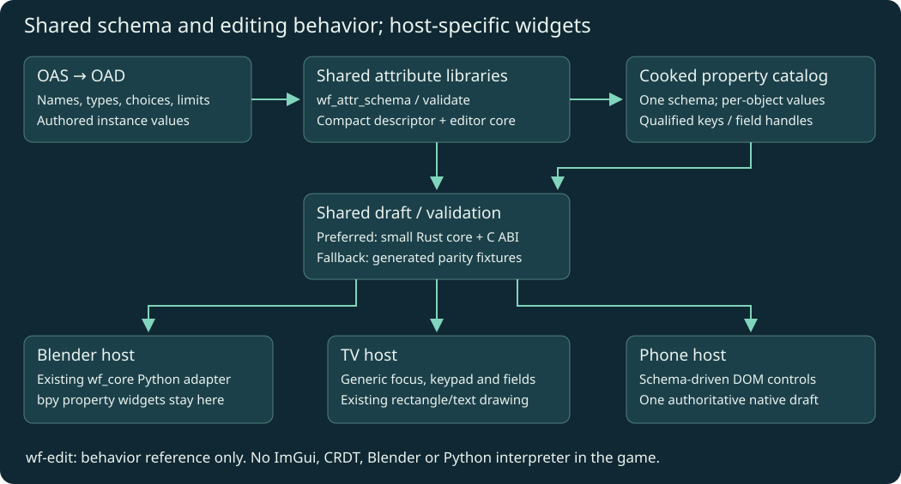

## Per-level authoring

Each level can own its schemas under `wflevels/<level>/`. For example,
`wflevels/aquarium_plants/settings.oas` defines the planted tank settings;
its compiled OAD is normalized into that level's property catalog. Level-wide
settings belong to an explicitly authored object such as the Director. Actor
schemas may also be local to a level or reused between levels. No global actor
schema changes are required for these supplemental properties.

## Implementation evidence so far

- Shared Rust OAD normalization and strict validation are implemented. Rust
  validation tests and three packing/C++ transaction tests pass, including
  exact unsigned seed text, per-instance isolation, stale revisions, keypad
  navigation and stale phone sessions.
- The versioned catalog uses an optional RAM locator and a sector-aligned
  appended chunk; existing asset bytes/offsets remain unchanged.
- Level-owned effective values and generic Forth read functions are implemented.
  TV navigation and phone controls now consume field descriptors. Integration
  and device validation are still in progress.
- The sanitizer-backed TV runtime harness and the real phone/browser integration
  test pass. The latter checks reconnect, invalid seed handling, cancel and apply.
  Core/catalog and goby tests pass (11 checks). An earlier APK passed a cast1
  launch check; final verification of the latest goby/phone build is pending.
- Phone transport accepts bounded extended WebSocket frames for property forms
  and commands; button input validation and control-frame limits remain enforced.
- Latest phone transport/browser regression suite: 55 checks passed. Both Android
  ABIs build. The goby integration's first cast1 launch exposed a tail-cap polygon
  below the fixed-point normal threshold. The asset now uses centre-fan caps;
  eight goby tests pass with a minimum normal-size check. Corrected device
  verification remains pending. No engine normal-calculation change was made.
- The next device check exposed incorrect rotation mailbox names in the new
  goby pose script. They now use the published `INDEXOF_ROTATION_A/B/C` names.
  Player scripts also omit Director-only contact/spine definitions. Tests now
  compile both actual exported scripts within the same dictionary in float and
  fixed-point configurations; the ten goby checks pass.
- Corrected cast1 verification passed: job `J-986002bc14ed`, APK SHA-256
  `7bc63a1c8af8619a3e6e7faa2d3c5a7c8ec03b6513204bd39d31be32d187c533`.
  The captured screen shows the freshwater goby, growing plants and seed HUD;
  the runtime failure check passed. Evidence is under
  [verified-launch](2026-10-06-runtime-oas-oad-object-editor/evidence/verified-launch/receipt.json).
  This resolves the observed black screen; matched profiling and full device
  settings/mode-switch validation remain outstanding.
- Shared code comprises the existing Rust schema reader/model/validator and the
  new strict validation wrapper. Draft transactions/navigation live in the
  reusable C++ runtime layer; they are not yet shared with Blender or wf-edit.
- Cast1 settings job `J-31cfa0e8c8f3` passed keypad navigation, both back-arrow
  steps, phone apply/cancel, invalid seed rejection, reconnect, stale-session
  rejection and freshwater/saltwater regeneration. The goby settles on the new
  central grazing rock. [Assertions and captures](2026-10-06-runtime-oas-oad-object-editor/evidence/settings-check/plant-assertions.json)
  are saved. The run stopped at held-left movement; it is not a complete pass.
  The validator used a 650 ms hold while position telemetry arrives every 30
  physics ticks, allowing stale samples. The revised validator uses 3000 ms,
  requires a fresh sample and saves movement measurements even on failure.
  Eight coordinator regression tests pass. Deployment and a device rerun are
  pending; movement, release, Home/resume and selector exit remain unverified
  by this run. No engine code was changed for this test correction.
- Rerun `J-bafa5af55376` passed all four directions with fresh samples,
  released-input settling and Home/resume in the same process. Settings checks
  passed again. [Movement measurements](2026-10-06-runtime-oas-oad-object-editor/evidence/settings-rerun/movement-samples.json)
  are saved. Final exit failed because the validator omitted a back-arrow step:
  resume reopened the phone-controller prompt, so navigation requires prompt
  dismissal → selector → exit. The resumed and following captures confirm prompt
  dismissal leaves gameplay visible. The validator now includes all three steps;
  its deployment and final exit verification are pending. This run is not a
  complete pass; no navigation behavior was changed.
- The follow-up deployment review now contains only `plant_checks.py`. Concurrent
  diagnostics changes to shared `service.py`/`workflows.py` caused the original
  source-hash check to stop before deployment. The existing deployed service
  already supports the plant validator. Both deployed/source hashes for the
  single-file review are verified, and eight coordinator regression tests pass.
- Final cast1 job `J-9ae18edfc74a` completed successfully with cleanup verified.
  All **26 assertions pass**, including settings, all four held directions with
  fresh samples, release settling, Home/resume and exit from the selector.
  The selector screenshot was reviewed and shows Planted Tank selected after
  returning from gameplay. Evidence: [assertions](2026-10-06-runtime-oas-oad-object-editor/evidence/settings-final/plant-assertions.json),
  [movement](2026-10-06-runtime-oas-oad-object-editor/evidence/settings-final/movement-samples.json),
  [selector](2026-10-06-runtime-oas-oad-object-editor/evidence/settings-final/returned-selector-screenshot.png),
  [receipt](2026-10-06-runtime-oas-oad-object-editor/evidence/settings-final/receipt.json).
  Tested ordinary APK SHA-256:
  `d82effba1e31696601185982a39c97461a89a84229ac073e8e00c33189f19cd5`.
  This completes the cast1 functional check; matched profiling and actual cast2
  verification remain separate outstanding work. The phone checks exercise the
  actual protocol/native state, not a physical phone browser display.

## Existing implementations: what to reuse

### RGB colour, full text entry and Notes — approved UI implementation

#### Revised keyboard decision: use system input; no custom fallback

Will rejected the custom TV key grid and approved replacing it with platform
text input. **Remove the custom alphabet/symbol and numeric on-screen grids.**
The captures below document the superseded implementation; they are not the
approved keyboard design. No custom fallback is requested for current targets.

| Host | Text entry |
|---|---|
| Android TV / Android native app | Native `EditText` dialog and installed system IME (normally Gboard on TV); text, numeric and multiline input types |
| Phone / tablet / browser controller | Native browser `input` / `textarea` and the user's installed keyboard; desktop browsers also accept physical keyboard input |
| wf-edit / Blender | Existing host text widgets and keyboard input |
| Standalone desktop game runtime | Verify its text-event / IME integration before claiming support. A connected browser is the existing entry route; do not draw a replacement keyboard grid |

Android TV's system keyboard supports ordinary text and numeric layouts and
speech input. [Android TV keyboard documentation](https://developer.android.com/training/tv/get-started/onscreen-keyboard).
The app currently uses `NativeActivity`; add a small subclass with a native
text dialog, preserving the existing launcher component through an activity
alias. A bounded JNI/UI-thread bridge opens the editor and returns text on the
game thread, using the existing `Edit::set()` transaction. No property storage,
validation, Forth readback or catalog-format change is needed.

Native editor requirements: correctly labelled text field, ordinary/numeric/
multiline input modes, normal cursor/selection, explicit Done and Cancel,
UTF-8 byte-limit validation, and Notes newlines. Closing the IME/editor must
not apply the outer form or navigate out of the level. Back closes the system
keyboard first; closing the native dialog retains its draft. Cancel restores
the pre-dialog value. Clear held inputs on modal transitions, and discard
results for closed/replaced forms, stale sessions or object generations.
Phone takeover, Home, recreation and level exit must dismiss stale editors.

Android UI surface: a Java `NativeActivity` subclass, Android manifest alias,
JNI text-dialog request/result wiring in the Android HAL, and the runtime UI
input/drawing helper. Will approved replacing the keyboard after this Android
UI integration was proposed. Keep colour controls; the keyboard change is
independent of section/group layout selection.

Acceptance: actual Gboard on cast1 and cast2, text and numeric editing, Notes
newlines, Done/Cancel/back ordering, held/released remote input, stale callback
rejection, phone takeover and Home/resume. Save new real-device captures;
the old custom-grid tests/captures do not prove system-IME acceptance.

Implementation status: `WorldFoundryActivity` extends `NativeActivity` and owns
the Android text dialog; the launcher alias retains `android.app.NativeActivity`.
`hal/android/property_text_input.h` queues bounded UTF-8 results, delivered on
the game thread. `runtime_property_controls.h` dispatches text/numeric/Notes
to this host and rejects stale results. Focus transitions clear held game input.
The UI draws no alphabet, punctuation or numeric key grid. Desktop hosts without
a registered text editor use the connected browser route; standalone desktop
physical-keyboard/IME integration remains unimplemented.

Current evidence: seven property/UI/phone tests and the sanitizer-backed plant
host pass; both Android release ABIs build. Cast1 job `J-254663bfc68a` passes
launch/input/Home/resume using APK
`53423d846f8aa03edff9918de3d082bf869a892e67f3ecfc7cf4b2320aed6825`.
[Receipt](2026-10-06-runtime-oas-oad-object-editor/evidence/native-ime/launch-resume/receipt.json).
This verifies the activity/launcher transition, **not Gboard entry**.

The standalone coordinator's plant validator now detects the APK's system-input
capability, checks actual IME visibility, enters seed 1254 with native text input,
and checks Done/back ordering before the existing settings regression. It retains
the legacy test path for older APKs. Ten targeted tests pass; the complete
packaged coordinator suite passes 133 tests (before adding two native-branch
tests). [Validator log](2026-10-06-runtime-oas-oad-object-editor/evidence/native-ime/validator-tests.log).
Reviewed deployment also includes the already prepared prompt-dismissal and
diagnostic held/released-input fixes and version 0.1.1; hashes were verified.

Will deployed the reviewed release successfully. Source/installed hashes were
verified, queue resumed and device identities/reservations retained.
[Deployment log](2026-10-06-runtime-oas-oad-object-editor/evidence/native-ime/coordinator-deploy.log).
The earlier non-interactive attempt made no service changes.
The reviewed command used was:

```bash
task -d ~/chromecast-coordinator coordinator:deploy CLI_ARGS='--review /home/will/WorldFoundry-wbniv/docs/plans/2026-10-06-runtime-oas-oad-object-editor/native-ime-deploy-review.json'
```

The subsequent two-device check `B-f472b7381e21` could not complete Gboard
acceptance. Cast1 `J-dec31a3f31b5` failed connection discovery before launch;
its coordinator readd also required local Wireless debugging setup. Cast2
`J-0079ed755a7a` installed/launched and captured the properties form, then lost
its ADB daemon/device connection before opening the keyboard; cleanup was gated
as recovery-required. Its first readd found the previous worker's kernel lock
still held; a second readd attempt `J-3366f47f8413` reported the same held-lock condition. These are test-transport/recovery failures, not a passed IME check.
[Cast1 receipt](2026-10-06-runtime-oas-oad-object-editor/evidence/native-ime/device-batch/chromecast-test-01/J-dec31a3f31b5/receipt.json),
[cast2 receipt](2026-10-06-runtime-oas-oad-object-editor/evidence/native-ime/device-batch/chromecast-test-02/J-0079ed755a7a/receipt.json).
Restore coordinator device connections, then rerun the same frozen APK and save
native keyboard captures/assertions. Neither launch acceptance nor portable
callback tests replace this remaining Gboard entry/newline verification.

Implement these controls on TV and phone, matching the existing authoring
editors' value semantics. RGB uses `BUTTON_INT32` / `SHOW_AS_COLOR` (7):
packed **0x00RRGGBB**, stored as the same decimal integer as before. No alpha
channel, schema change, renderer colour-space change or asset conversion.
TV: A opens a colour drawer with a preview, hexadecimal value and three labelled
0–255 channel sliders. Up/down selects a channel; left/right changes it by one;
Done or the back arrow closes the drawer, retaining the draft. Phone: native
colour picker plus explicit R/G/B sliders, with a preview and hex value. Every
channel edit sends one packed value through the existing validated transaction.
wf-edit and Blender retain their existing colour pickers.

General `Str` fields now use the native Android text editor and system keyboard.
Seed and numeric fields request numeric input; Notes requests multiline input.
Phone uses its normal keyboard (`inputmode=text`), with native selection/cursor
editing. Keep byte limits, read-only fields, draft/apply/cancel, reconnect and
stale-session checks. Text travels as UTF-8, including supplementary characters;
the native editor supplies fonts and input composition. The initial printable-
ASCII TV grid was a rejected trial, not a fallback or completion target.

**Notes:** explicitly bound `Annotation` / ignored-XData fields become bounded
multiline text in the runtime catalog (`kind=Str`, `rule=2`). The cooked instance
overlay owns these values: ignored XData still does not create native actor
binary storage. Default limit is 4096 UTF-8 bytes, overridable in the binding.
Ordinary strings use the same control with `SHOW_AS_TEXTEDITOR`, or can opt in
with `multiline: true` in the explicit binding.
Android TV uses a multiline native editor and system IME; phone/tablet/web
use a textarea and their normal keyboard. Verify newline entry on the actual
installed TV IME rather than assuming its phone layout. Preserve newlines through apply/cancel, reconnect and runtime readback.
Unbound annotations and converted/script XData remain outside this configuration
catalog; do not promote them to editable settings automatically.

Revised implementation surface: a reusable runtime **UI** helper for keyboard
and colour-drawer state, `runtime_property_ui.cc` for drawing, and the host's UI
input dispatch. Phone rendering is in `hal/phonepad/controller.html`.
Use existing `Form`/`Edit::set()` APIs, descriptors, validation,
snapshot/command protocol and storage. Do not change
`engine/runtime_property_form.hpp/.cpp`, property storage, Forth readback,
physics, actor mutation bridge or the property catalog format. The new controls
are presentation/input code, not new core engine capabilities. Will explicitly
approved these UI controls. Notes normalization also changes the catalog cooker;
it reuses the existing string kind and validators without a binary format change.

Acceptance: RGB black/white/channel isolation and packed readback; keyboard
Shift/punctuation/space/delete/clear and numeric-mode distinction; byte-limit
rejection, read-only controls, apply/cancel and reconnect. Verify actual TV
drawer rendering and phone DOM against the real native transaction host.
Include multiline Notes newline/UTF-8 round trips, byte-limit errors and explicit
binding/cooked descriptor fixtures.

Implementation: UI helper `game/runtime_property_controls.h`, TV drawing in
`runtime_property_ui.cc`, host input dispatch in `plant_ui.cc`, phone controls
in `controller.html`, and explicit Notes projection in
`scripts/build-object-properties.py`. The existing core form/property API is
unchanged by this follow-up. Blender/wf-edit retain their existing native
colour/text controls; this does not claim to repair wf-edit's separately audited
Notes document-field mapping caveats.

Seven local checks pass: native transaction/readback, TV drawer input and bounds,
full printable-ASCII key coverage, RGB channel clamping, UTF-8 deletion/limits,
Notes packing/newlines, and real phone/browser apply/cancel tests. Captures below
come from the actual TV rectangle output and real phone DOM; they are **local
test evidence**, not Chromecast or physical-phone acceptance.
[Test log](2026-10-06-runtime-oas-oad-object-editor/evidence/colour-text-notes/tests.log).

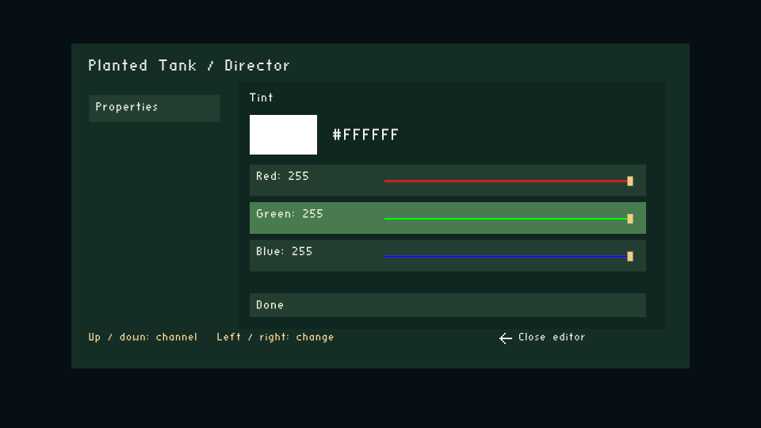
<details><summary>Rejected custom keyboard trial (historical captures)</summary>

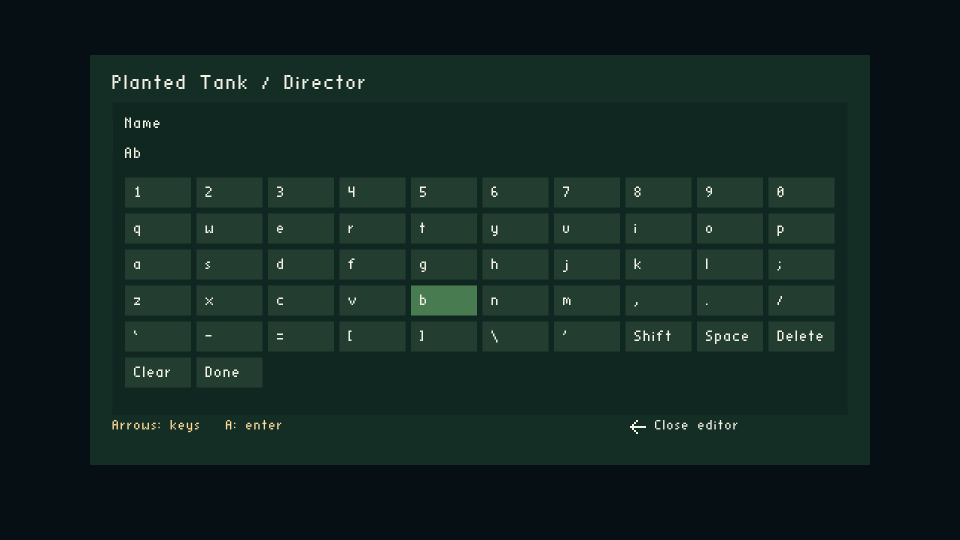
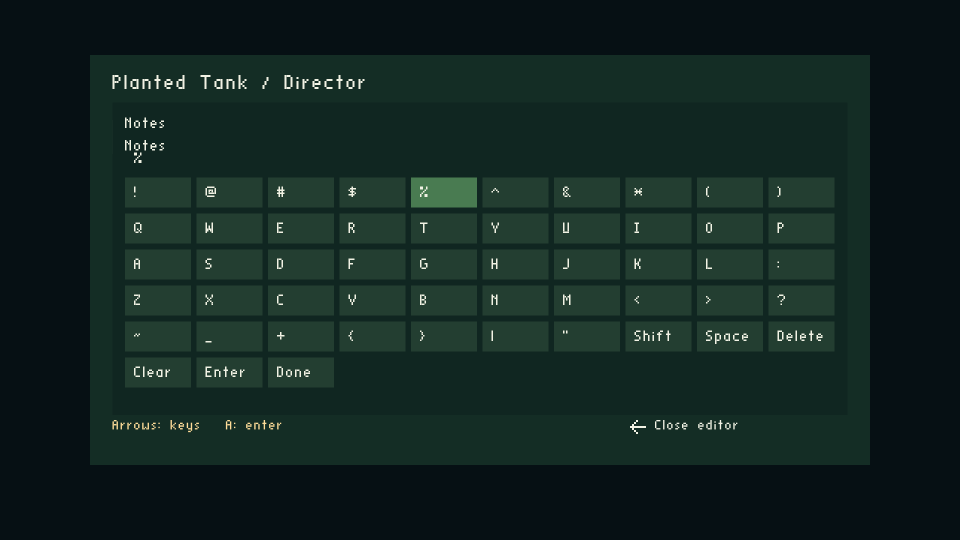

</details>

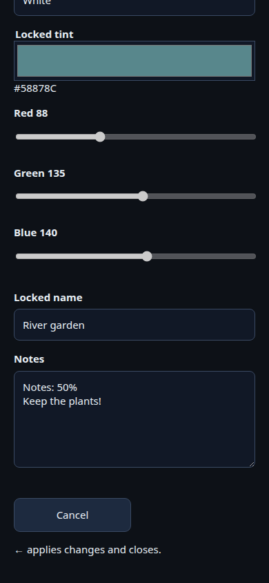

Phone follow-up checks also pass after reconnect and at tablet width. Both
Android release ABIs build ([build log](2026-10-06-runtime-oas-oad-object-editor/evidence/colour-text-notes/android-build.log)).
Cast1 settings regression job `J-77cad3b00e9f` uses frozen APK SHA-256
`48e89c05b364f2d200c569dcf84168b80e73c3a84756888e585f9960e09c7430`;
the app installed and **seven existing-settings assertions passed**, including
TV keypad/back behavior, opening settings with held A, and phone seed/water
apply. The job then failed with `[Errno 32] Broken pipe` on the phone test
connection; it is **not a complete device pass**. Saved
[assertions](2026-10-06-runtime-oas-oad-object-editor/evidence/colour-text-notes/device/plant-assertions.json)
and [receipt](2026-10-06-runtime-oas-oad-object-editor/evidence/colour-text-notes/device/receipt.json).
The remaining device regression needs a repaired/reliable test connection and
a rerun. The production plant schema currently has no RGB or Notes fields:
this job checks existing controls, not those new fixture fields. Actual new-field
device acceptance belongs to an explicitly authored gallery/sample configuration.

### Sections/groups — three layouts for review

These are review alternatives, **not authorization to replace the layout**.
The mockup sheet includes TV, phone and authoring-editor views of each option;
Blender retains native panels, with the same authored order and group names.

| Option | Sections | Groups | Tradeoff |
|---|---|---|---|
| A · Rail / navigation | TV and wf-edit left rail; phone section selector | Always-visible headings inside the selected section | Clear location and readable fields; needs an explicit route to the rail from arrow-editable values |
| B · Tabs | Horizontal tabs; phone scrolls tabs when necessary | Labelled bordered cards | Compact for a few sections; many/long tabs require scrolling |
| C · Accordion | Stacked collapsible section headers | Nested labelled groups, fields indented | Natural phone/document flow; TV focus and collapsed-state handling need care |

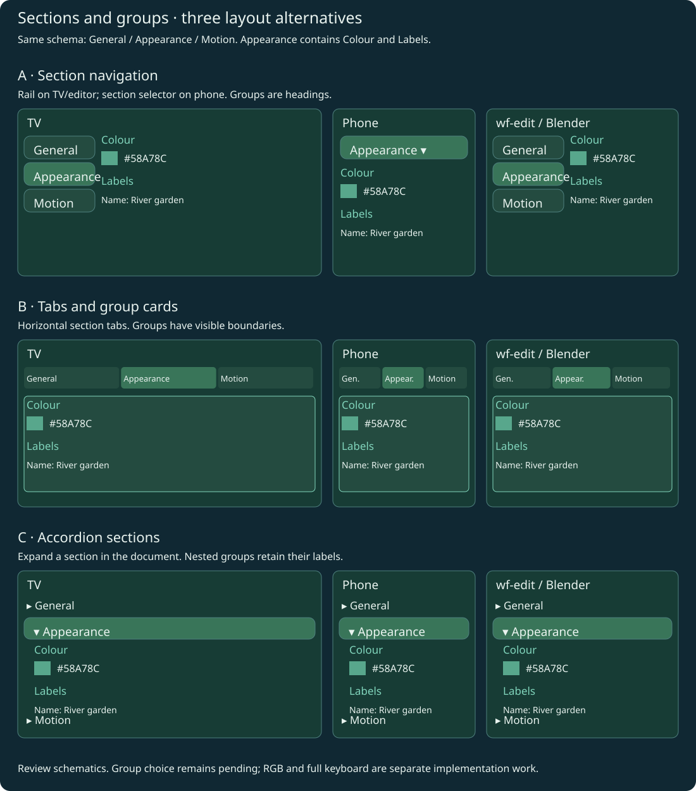

All three preserve schema order, stable field identity, help/errors, scrolling
and edits when switching sections. Section selection does not apply settings.
Keep selection/focus visibly distinct from a selected enum value. Choose the
section/group policy after review; colour and keyboard work can proceed independently.

### Finish enum/dropdown controls on TV, phone and authoring editors

Will requested completing the audit's **Enum/dropdown** row across TV, phone,
wf-edit and Blender. This is required follow-up work, not completed by the
existing Water type radio buttons or Growth speed slider.

Use Blender's visible-choice policy as the target: highlighted single-choice
buttons with the selected value visible. Hints **4/5** with **more than three
choices** use a **two-column grid**; smaller choice sets use a button row.
Apply this policy to generic enum/dropdown fields in TV, phone and wf-edit,
and verify Blender against the same fixtures. Preserve the original hint and
choice values in the shared descriptors. Slider-hinted enums retain their
labelled slider rather than being converted to a choice grid. Do not leave the
TV showing only its current label, or the phone/wf-edit using a generic dropdown
as the final implementation of this requested presentation.

Define the choice-layout policy in reusable schema/presentation code, with
host-specific rendering and existing transaction semantics. TV directional
input must select choices directly without an extra A-to-adjust step. Specify
grid focus, property/section navigation and scrolling so one arrow press cannot
both edit a value and move focus to another field. Phone users tap choices;
provide a clear selected state, accessible labels and appropriate disabled or
read-only behavior. Preserve Apply/Cancel, validation and revision/session checks.

Acceptance fixtures cover two, three, four and seven choices, odd final rows,
long labels, nonzero enum minima, slider exceptions, read-only/conditionally
enabled fields and sections containing only enums. Check that every host maps
the selected label to the same stored value and restores it after Cancel,
reopening or reconnecting. Capture the actual TV and physical phone browser
layouts; protocol tests alone do not complete phone acceptance. Verify held and
released directional input on cast1 and cast2, and test the phone controls on
the minimum Chromium/WebView 91 compatibility baseline. Include interactive
wf-edit and Blender checks before marking this row finished.

This update records the implementation and verification target. Describe any
additional engine changes concretely and obtain permission before editing them,
as required by this project's engine-change rule.

### Requested change: open the form without opening numeric entry

Growth speed currently uses `BUTTON_INT32` / `SHOW_AS_SLIDER` with seven labels
and values 0–6 (Paused, 0.25×, 0.5×, 1×, 2×, 4×, 8×). The runtime currently
normalizes these as an enum and loses the specific visual presentation.
Will requested reviewing the existing `SHOW_AS_RADIOBUTTONS` alternative first.
The [TV/phone radio mockup](2026-10-06-runtime-oas-oad-object-editor/growth-speed-radio.html)
shows all seven choices with a selected marker; TV arrows change choices
directly, and phone users tap a choice. The mockup is a review schematic. Will
subsequently requested and approved the rendering change. The TV and phone now
dispatch `SHOW_AS_RADIOBUTTONS` to radio choices. Will then selected
`SHOW_AS_SLIDER` for growth speed. Its final hint is slider, with seven stops
and the existing rate mapping. TV now draws a track, labelled stops and a moving
thumb; phone uses its existing range control. Water type retains the radio hint but renders highlighted single-choice buttons
without circles, per Will's follow-up request. Blender already uses selected
buttons; wf-edit, TV and phone now use this presentation. The wf-edit changed
translation unit passes a syntax check; interactive editor validation is pending.
Five local checks pass, including TV thumb endpoints and real phone range/radio
controls with apply/cancel/reconnect. Both Android ABIs build; cast1 verification
is in progress.

The [editor rendering audit](../reference/2026-10-06-oas-oad-editor-rendering-audit.md)
compares Blender, wf-edit and runtime behavior and tracks remaining gaps.
Correction: phone already honored `SHOW_AS_SLIDER`; TV did not draw a visible
slider. Radio hints previously became a dropdown on phone and one label on TV.

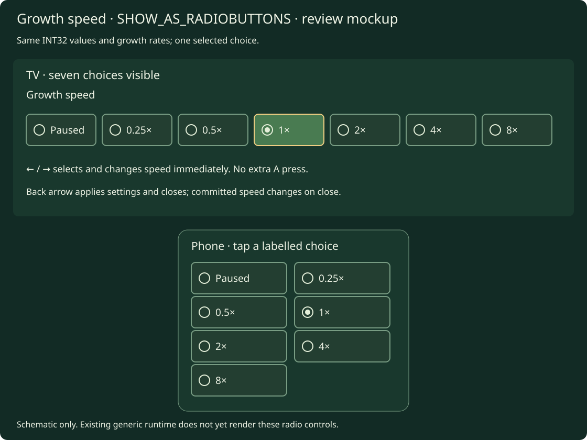

Will requested that opening settings leave the numeric keypad closed. The form
already initializes `drawer=false`, but the held A press used to open settings
is immediately forwarded into the new form and treated as a fresh edit press.

Approved and implemented engine change: consume the opening A press until release, and require
a subsequent A press to edit the focused seed field. Preserve seed focus,
arrow navigation, phone editing and the back-arrow apply/close behavior. Keep
this in the reusable form input lifecycle rather than an asset-specific keypad
exception. Expected surface: `engine/runtime_property_form.cpp` / `.hpp`, and
only the host opening call if an explicit opening-input mask is needed.

Add a regression that holds A across form creation, confirms the drawer remains
closed through release, then confirms a new A press opens it. Verify the actual
held-A opening on cast1 with captures before and after the fresh edit press.
No physics, asset format or OAD schema changes are needed. Will explicitly
approved both input changes. `Form::begin` accepts the opening input mask;
the plant host passes its held input, preventing a second edit edge from the
opening press. Four local regression checks pass, including a sanitizer-backed
host test of held-A opening/release/fresh press. Both Android ABIs build in the
ordinary and diagnostic variants; cast1 verification is queued.

Will also requested removing the extra button press needed to cycle enum or
similar choices. Implemented behavior: when an enum field is focused, left/right
changes its value immediately, without A entering an adjustment mode. Phone
controls continue to use the schema's choices. Resolve section-rail navigation
explicitly so an arrow press cannot both change a value and change focus; numeric
text fields retain A-to-edit. An alternative is an explicit visible choice list.
Focused enums, Boolean toggles and sliders consume their arrow press as a value
change, preserving row focus. Other rows retain the existing section-rail path.
The TV hint now describes direct adjustment. A does not enter an enum adjustment
mode. Phone schema editing is unchanged. See the
[baseline settings-gallery coverage plan](2026-10-05-world-foundry-baseline.md#sample-configuration-object-generic-oasoad-settings).

This audit read the current checkout, not only old plans. Comments that describe
wf-edit's panel as read-only are stale: its current API includes editing and a
live bridge.

| Code | Current behavior | Reuse / boundary |
|---|---|---|
| [wf_oad](../../wftools/wf_oad/src/lib.rs) | Rust reader for the legacy OAD header and descriptors | Reuse at build/authoring time; preserve legacy codes/layout |
| [wf_attr_schema](../../wftools/wf_attr_schema/src/lib.rs) | Normalized field keys/labels/help/groups, kinds, limits, defaults, widths and fixed-point scales | Primary shared schema model; extend with a compact runtime projection |
| [wf_attr_validate](../../wftools/wf_attr_validate/src/lib.rs) | Range, enum and text checks over schema values | Share validation; add strict type/non-finite checks rather than relying on its present permissive mismatch handling |
| [wf_attr_serialize](../../wftools/wf_attr_serialize/src/lib.rs) | Authoring attribute import/export | Reuse for authoring round trips, not as the cooked level byte-layout oracle |
| [wf_py](../../wftools/wf_py/src/lib.rs), [Blender panel](../../wftools/wf_blender/panels.py), [operators](../../wftools/wf_blender/operators.py) | `wf_core` exposes Rust descriptors; Blender stores `wf_<key>` values and renders host widgets | Reuse underlying schema/validation; preserve Blender widgets and storage |
| [Blender exporter](../../wftools/wf_blender/export_level.py), [levcomp OAD loader](../../wftools/levcomp-rs/src/oad_loader.rs) | Resolve schemas, serialize object values, resolve references and common blocks | Generate runtime descriptors/initial values alongside cooking; use actual compiler layout |
| [wf-edit panel](../../engine/wf_edit/property_panel.cc), [OAD adapter](../../engine/wf_edit/oad_reader.h), [engine bridge](../../engine/wf_edit/engine_bridge.cc) | C++ OAD widget dispatch; CRDT document edits translated to live mutation | Reference for dispatch, groups, commit/readback and errors. No ImGui/CRDT/application dependency in the game |
| [wfmut](../../engine/mutation/wfmut.hpp), [implementation](../../engine/mutation/wfmut.cpp) | Existing field getters/setters, generated block offsets; debug/editor-only | Reference/reuse small resolved-field adapters, not wholesale enablement in release |
| [OAS header generation](../../wfsource/source/oas/regen-headers.sh) | Generates `kpropmap_generated.inc` and wf-edit name-to-path mapping | Reuse qualified naming/offset generation where applicable; avoid a second handwritten property table |
| [Earlier settings extractor](../../scripts/build-runtime-settings.py) | Enum-only OAD-to-JSON authoring proof | Replace/extend using the shared reader/model; do not retain its fixed-offset parser as another authoritative implementation |
| Legacy [oaddump](../../wftools/oaddump/oad.cc), iff2lvl/lvldump readers | Historical C++ descriptor readers and compiled-level interpretation | Compatibility references/fixtures, not additional runtime UI dependencies |

### Share functionality, keep host widgets separate

Share field descriptors, typed values, validation, draft/apply/cancel transactions,
change detection and canonical error results. Keep ImGui rendering, Blender
`bpy` controls, TV drawing and phone DOM controls in their respective hosts.
Matching visual appearance is not required; matching field meaning and values is.

Recommended proof: a small **`wf_attr_edit`** Rust component on the existing
schema/validation libraries, with a narrow C ABI for the game and a Python
binding through `wf_py`. It owns the draft reducer and validation. No CRDT,
Python interpreter, Blender or editor application is linked into the game.
The TV and phone use one native draft/session, rather than independently
implementing validation and commit semantics in JavaScript.

Runtime descriptors are already normalized at build time. The runtime need not
parse a full authoring OAD or embed the old C++ dumper. Separate the normalized
value/editor model from the OAD reader if that is necessary to avoid pulling the
reader into the static runtime library. C ABI handles must be owned explicitly;
no Rust panics cross the boundary. Measure the new static-library/binary cost.

**Reuse gate:** prove this shared core on one real enum, one fixed-point field
and one text field, including Android cross-compilation. If that adds excessive
build/dependency complexity, use a small C++ editor model and shared generated
descriptors/conformance fixtures instead. Record which behavior is actually
shared; do not claim shared source merely because two UIs look similar. Both
routes keep wf-edit out of the runtime. Decide at phase 0 before core edits.

## Runtime data and instance ownership

OAD is schema metadata. Cooked actor data is a separate layout: common-block
markers become offsets, references are resolved, and some authoring fields emit
no runtime bytes. The full descriptor cannot simply be treated as a struct
offset table. `levcomp` and `wf_attr_serialize` also have different packing
contexts; their sizes must not be interchanged.

Generate a versioned compact catalog with schema identity, qualified field keys,
runtime field handles, kind/width/scale, labels/help/groups, bounds/enum options,
exposure/apply policy, and per-object initial values. Deduplicate schemas across
instances; keep values and overrides independent per instance. Defaults apply
only when no authored initial value is supplied.

Package the catalog as an optional level asset/chunk (**working name `RPRP`**).
Phase 0 must identify the exact insertion and lookup point in the existing
sector/TOC format; do not append arbitrary bytes or change fixed RAM layouts.
Old bundles without this metadata continue to load and have no runtime form.
Test existing cooking/decompilation/packing readers with the optional metadata.

Level owns a property registry keyed by `(level epoch, object identity,
instance generation)`. Registration checks the object exists and its schema
matches. Removal/slot reuse cannot inherit the old object's values or draft.
Use a supplemental schema attachment for new level settings; allow descriptors
for existing class OAD properties through the same service.

Use fully qualified field keys and generated handles, not UI labels or wf-edit's
fuzzy name matching. Handle collisions/duplicate names are build errors. Numeric
handles are local to a catalog version; saved overrides use qualified keys and
schema version, not a handle from an older APK.

### Why existing `wfmut` is insufficient as-is

Its field writes explicitly mutate potentially deduplicated/shared common pages.
Its header provides no-op getters/setters when both debug and editor flags are
off; Android forces those flags off. It also exposes a subset of fields, not
the full typed authoring model. Enabling the debug/editor stack is not the
production solution.

For phase 1, use **per-instance effective values**, falling back to cooked
initial values. Do not write through `const_cast` into shared pages. Native
consumers that still dereference legacy blocks do **not** automatically see an
overlay: migrate a consumer to the generic getter or supply an explicit live
apply adapter. Present that distinction honestly in the editor.

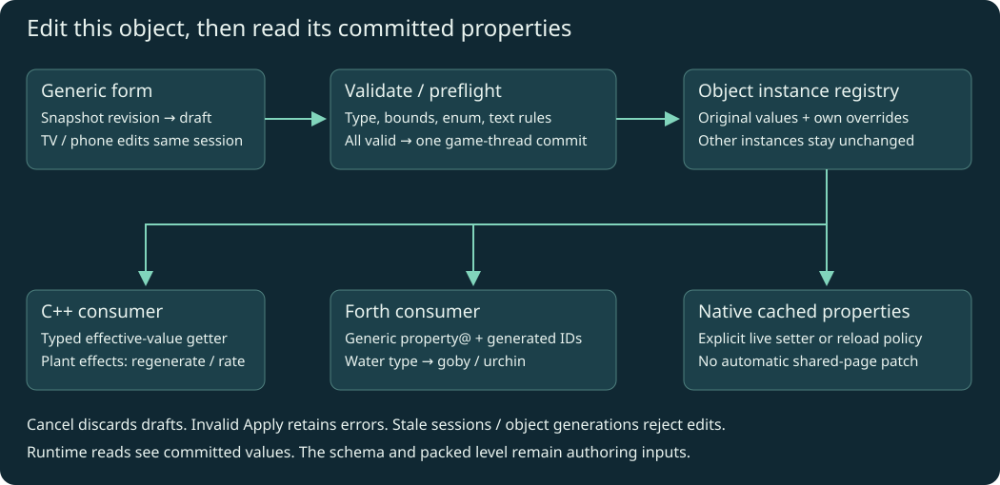

## Edit, validate, apply, read

1. Open the object form and snapshot effective values/revision into a draft.
2. TV/phone edit the same draft using field handles, retaining schema-derived
   labels and choices. Reject obsolete object/session/revision commands.
3. Apply validates the entire draft, including cross-field rules declared in
   authored policy. Invalid input leaves the form open with an inline error.
4. Commit the whole valid change once on the game thread. Preflight any effect
   that can fail; an error must not leave part of the transaction applied.
5. Increment revision and notify consumers of changed field handles. C++/Forth
   reads see committed effective values; drafts do not leak into simulation.
6. Cancel drops the draft; reopening reads committed values. Changes originating
   outside the form require revision checking/rebase, rather than silent overwrite.

The property service operates independently of pausing. For the plant form,
preserve current pause behavior; its existing native modal already stops level
updates. Clear held input at open/close/focus transitions and resume only after
release. Back arrow applies/closes; validation errors keep it open. A activates
a field or finishes slider adjustment. Keep a regular visible navigation grid.

## Layout algorithm for arbitrary objects

Layout is generated from the attached schema and current viewport. The plant
form is one use of this algorithm, not the template every other object must fit.
Share the ordered form model, widget classification and focus identities between
hosts; TV and phone render different arrangements of that model.

### 1. Build an ordered form tree

Walk OAD entries in source order. A `PROPERTY_SHEET` starts a section;
`GROUP_START` / `GROUP_STOP` bracket a named group. Fields remain in their
authored order inside the section/group. Fields before the first sheet go in a
virtual General section. A schema with no sheets produces one simple form.
Group markers and common-block delimiters are not mutable field values.

Use display names with field-key fallback, schema help, `showAs`, field kind,
enum choices and fixed-point scale. OAD `x`/`y` authoring-dialog coordinates do
**not** place runtime widgets: they are tied to legacy editor dialogs and do not
define a usable TV/phone layout. Runtime exposure policy filters fields once
before layout; hidden fields stay hidden and inspect-only fields show a status.
Missing optional help or labels does not make a field disappear.

Section order follows OAD. On TV, the first section marked initially active
is selected, otherwise the first section. Phone uses section default-open hints;
General opens initially. Preserve the user's section/focus/scroll choices while
the same object form is open. Malformed group nesting must produce a build-time
diagnostic rather than a broken runtime layout.

### 2. Choose widgets and size rows

| Schema presentation | Generated control | Sizing / overflow |
|---|---|---|
| Checkbox / toggle boolean | One labelled toggle | One regular row |
| Enum dropdown / combo | Current choice; A opens a choice list | Scroll long lists; preserve numeric index offset |
| Radio choices | Inline choices when the measured labels fit; otherwise choice list | Widget editing uses left/right; no tiny squeezed buttons |
| Slider numeric field | Value plus slider | Limits/step follow schema/policy; reserve a taller row |
| Plain integer / fixed-point number | Value field; A opens numeric entry | System numeric editor with signed/decimal input type |
| Bounded string | Text preview; A opens text entry | Wrap or abbreviate the preview; show full value in editor |
| Multi-line text | Taller text preview and dedicated editor | Scroll text rather than expanding the entire form indefinitely |
| Inspect-only reference / reload-required field | Current value and short status | Focusable for full value/help; editing only with a supported policy |

Measure labels with the host's font metrics. Long labels wrap and increase row
height; values do not overwrite labels. Help appears for the focused field in a
reserved area or detail view, instead of printing every paragraph between rows.
Row sizing is based on legible controls, not total field count. Hundreds of fields
must scroll, not cause smaller text and controls. Optional later search operates
on stable field keys/labels; it is not required to make sections work initially.

### 3. TV: section rail and scrolling label/value rows

Use a bounded safe-area panel with an object/title header, a section rail when
there are multiple sections, a scrolling field viewport and a persistent footer.
Within the viewport, every regular row has the same label/value column boundary
(approximately 40/60, clamped to measured minimum control widths). Groups occupy
the full row width with headings; their fields use the same columns. There is
one focusable field entry per row; no arbitrary nearest-coordinate navigation.

At the reference 1920 × 1080 layout, start with 64-pixel minimum regular rows
and 28-pixel labels, then scale against display density/safe area. Verify at
720p and 1080p. Taller rows follow wrapped labels or sliders; scroll the focused
row fully into view. Reduce optional help/sidebar space before shrinking text.
If horizontal space is tight, sections become a single selector row above the
fields rather than squeezing the rail and controls together.

More sections than fit in the rail make the rail itself scroll. Large field lists
use a clipped/virtualized viewport; only visible rows and a small overscan are
drawn, while focus still traverses the complete ordered model. Keep footer actions
visible. Plant-specific Regenerate/New random seed appear as authored actions
after that section's fields; other objects need not have those actions. The empty
former Apply speed space is an authored spacer for the plant form, not a button
or a gap inserted into every object's editor.

### 4. Remote focus and editing modes

| Current focus / mode | Direction / A behavior | Back arrow |
|---|---|---|
| Field list, browsing | Up/down: previous/next field or authored action; left: section rail; A: enter field editing | Validate/apply form and close; errors retain form |
| Section rail | Up/down: previous/next section; right/A: its remembered field, otherwise first entry | Same form apply/close behavior |
| Slider / inline choice, editing | Left/right changes the draft; A or up/down finishes editing, with up/down then moving to the adjacent row | Validate/apply form and close, preserving existing plant Back behavior |
| Choice popup | Up/down selects; A accepts into draft | Dismiss popup, retaining the prior choice |
| Native numeric/text editor | Host widget / IME owns navigation, typing, selection and Done/Cancel | Hide IME, then close editor; retain draft before outer form apply |
| Footer actions | Left/right within the footer; up returns to remembered row; A activates | Form apply/close behavior |

Up/down from the final row reaches the footer; the rail/row/footer regions have
explicit edges and do not wrap. The native text widget owns its input while open. Opening a
drawer pins the edited field's label/value in its header and owns input; its
controls do not compete with field-list navigation. This avoids the old plant
form's mixture of number buttons and unrelated settings in a coordinate search.

Focus identity is `(section key, field key, subcontrol role)`, never a pixel
coordinate or visible-row index. Reflow, scrolling and phone reconnect cannot
silently retarget input to another field. If a focused field becomes unavailable,
choose the next surviving entry in that section, then its previous entry, then
the section header. No hidden/disabled control participates in navigation.

### 5. Phone: scrolling sections and native controls

Use one scrolling column with collapsible section headings and group headings.
Fields occupy full-width rows; labels sit above their controls at narrow widths.
Use native numeric/text keyboards, toggles, sliders and choice controls. A long
enum uses a selection list rather than an expanding line of buttons. The object
header and apply/close/cancel actions remain available without scrolling back
through all fields. Validation scrolls the first erroneous field into view.

The phone renders descriptors from the same ordered form tree. It does not
derive a separate plant field order or validation rules. Changing section or
scroll position changes presentation only; committed object values remain
independent of whether that section is visible.

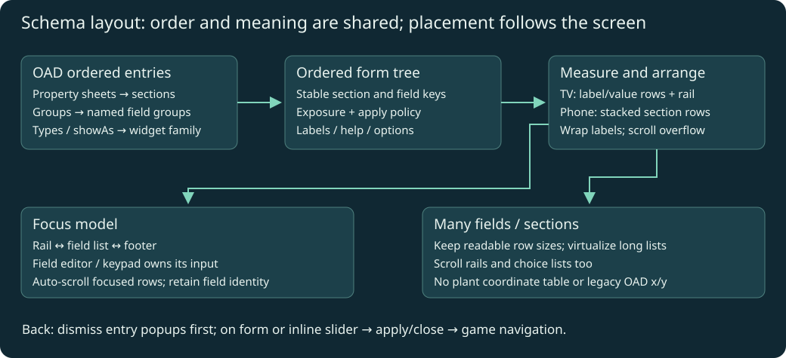

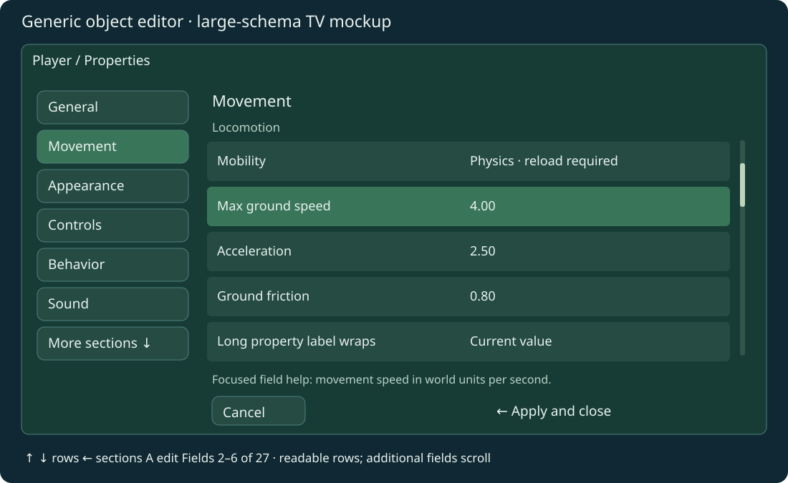

### Layout acceptance checks

Use real OAD fixtures for Player, Light and a supplemental plant schema, plus a
large synthetic schema (100 fields, 12 sections, long labels/help, 30 enum choices,
mixed sliders/text, inspect-only and hidden fields). Verify deterministic section
and field order, widget selection, regular remote traversal, scrolling, focus
retention on reflow, nested entry/back behavior and errors in off-screen sections.
Check 720p/1080p TV and narrow/full-height phone views. No test may depend on the
plant form's exact number of fields or screen coordinates.

### Types and apply policies

| Property kind | Initial editing support | Runtime representation / effect |
|---|---|---|
| Boolean / enum | Toggle, choice list | Typed bool/integer; options and index offset from OAD |
| Int8/16/32 | Numeric field/system editor | Exact signed integer, respecting actual width/range |
| Fixed16/32 | Numeric field/slider | Exact raw fixed-point plus schema scale (256 / 65536), finite checks |
| Bounded text | Text field/phone entry | Owned UTF-8 text with validated byte limit |
| Object reference | Initially inspect-only; later validated picker | Resolved instance identity, not a text label or raw pointer |
| File/mesh/script reference | Initially inspect-only | Needs explicit asset/script reload adapter before live editing |
| Groups / sheets | Presentation/help | No mutable runtime value for layout markers |
| Explicitly bound Notes annotations | Multiline system editor / phone textarea | Existing bounded UTF-8 string overlay; ignored actor XData stays ignored |
| Mobility, collision shape, mailbox counts, constructor-only fields | Inspect-only or explicitly marked reload-required | A value change alone does not rebuild their native state |

Expose a policy for each editable field: **script-observed**, **native live setter**,
or **reload-required**. Policies supply exposure, bindings and effect categories;
they do not duplicate labels, ranges or enum options already in OAD. The first
delivery supports script-observed settings and the plant adapter, not live
reconstruction of every engine subsystem.

### Runtime access proposal

Use a small typed C++ interface: `describe(object)`, `get(object, field)`,
`beginEdit`, `setDraft`, `commit`, `cancel`, and revision/change notification.
These are conceptual names; exact ABI is settled by the phase-0 proof.

Forth gets generic property reads, not a plant-specific word. Build tooling emits
field constants for authored scripts. Resolve descriptors once at load; do not
parse names/schema JSON on every actor tick.

```forth
\ Proposed API and generated bindings; not implemented words.
\ property@ ( actor field -- scalar ok )
PlantedSettings PROP_WATER_TYPE property@
if 0 = if goby-tick else urchin-tick then else drop then
```

`property@` covers bool/enum and supported scalar values. Exact 32-bit integers
cannot all travel through the current float-valued Forth/mailbox path. Add a
generic byte-oriented integer read when needed (`property-int-bytes@`, four
0–255 bytes plus success), and text-byte access for bounded text rather than
returning unmanaged native pointers. Final word names/stack order require tests.
Do not put a full unsigned seed, or an unsigned 16-bit half above 32767, into a
single signed 16.16 mailbox. Optional mailbox mirrors are explicit typed bindings,
not a second source of truth; use four bytes when exact 32-bit transport is needed.

No new Forth setter is required to replace the UI initially: the generic edit
service performs runtime writes. A later script setter can use the same validated
transaction API if a level needs it.

## Replace the plant form

| Authored property/action | Generic form | Consumer behavior |
|---|---|---|
| Water type | OAD enum: Freshwater / Saltwater | Commit regenerates the plant graph; Forth reads the same property to choose goby/urchin |
| Growth speed | OAD choices: Paused, 0.25×, 0.5×, 1×, 2×, 4×, 8× | Speed-only commit keeps age and graph |
| Seed | OAD bounded decimal text; authored unsigned-32 validation policy | Native adapter parses exactly 0–4294967295, preserving replay |
| Regenerate | Authored form action referencing the same property service | Rebuild even if the seed/water values are unchanged |
| New random seed | Authored action sets a valid seed in the transaction | Commits new seed and regenerates once |
| Cancel / back arrow | Generic form actions | Cancel discards; back validates/applies/closes |

Use decimal text for the seed because existing OAD limits are signed i32; do not
silently introduce a new legacy ButtonType or constrain the seed to signed range.
The native plant simulation may retain age, water-motion clock, generated meshes
and topology caches. Field definitions, draft speed/seed/water and the custom
hardcoded widget layout move out of `planted::State` into the generic service.
Any compatibility access to `s.salt`, `s.seed`, `s.speed` must be derived/synced
from committed properties during migration, then removed where practical.

The plant adapter defines effects (regenerate graph / update rate), not its own
editor or schema. A settings object can be prepared in selector context and
transferred by stable authored identity to its level instance; do not expose a
fake live actor index before that instance exists. Preserve Right-to-settings
from the highlighted selector and short-A/hold-A behavior in the level.

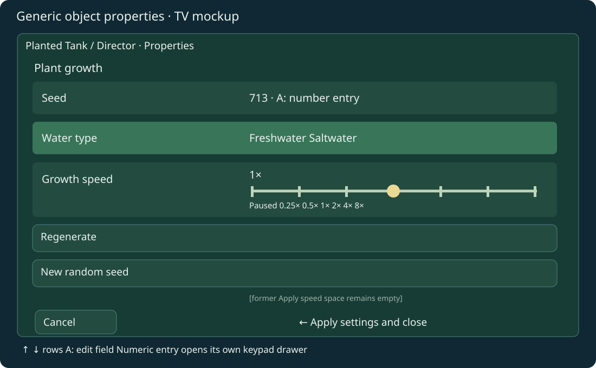

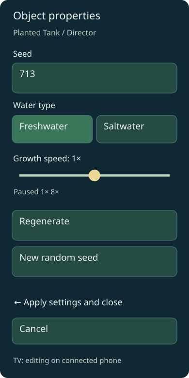

The mockups show the generic renderer with plant schema content. Leave the former
Apply speed button space empty. Growth speed is a slider/choice field; it needs
no separate Apply speed action. When connected, the phone owns active editing,
with TV status and back-arrow close/apply behavior preserved. Phone widgets must
support the measured Chromium/WebView 91 minimum.

## Proposed engine surface area

This is a bounded generic extension, not a one-line plant patch. Paths below are
proposed; exact names can change in the phase-0 design review. No engine files
have been edited for this plan.

| Area / files | Proposed changes | Boundary |
|---|---|---|
| New `engine/runtime_properties.{hpp,cpp}` | Typed object registry, per-instance overlay, catalog access, transactions and consumer notifications; adapter to shared edit core | No change to existing actor class layouts or direct shared-page writes |
| `wfsource/source/game/level.{hp,cc}` | Own registry; load optional metadata; register startup instances; lifecycle hooks for removal/spawn/slot reuse | Old metadata-free levels retain existing behavior |
| `engine/stubs/scripting_zforth.cc` | Generic bounded typed property reads and bootstrap words | No species-specific syscall; no arbitrary native-memory access |
| `CMakeLists.txt`, `engine/build_game.sh` | Build small runtime component and shared-core C ABI, with Android/iOS targets verified | Do not enable `WF_ENABLE_EDITOR`, `WF_DEBUG_BRIDGE`, ImGui or CRDT in release |
| New `game/runtime_property_ui.{h,cc}` and `game/game.cc`, `gfx/gl/display.cc` | Generic TV form presentation/focus/input; replace plant form dispatch and modal routing | Reuse current rectangle/text/backend drawing; no renderer redesign |
| `hal/android/native_app_entry.cc`, `hal/phonepad/controller.html` | Transport generic describe/draft/commit/cancel and render schema widgets | One authoritative native draft; no per-level hardcoded HTML fields |
| `game/plant_settings.h`, `plant_ui.{h,cc}`, small plant adapter | Remove plant-specific draft/form definitions and route effects through generic properties | Keep mesh growth/sway algorithms; delete obsolete form code after parity |
| Existing `wfmut` / editor bridges | Initially reference only; later optional adapter to the same value service | No broad mutation refactor or editor integration bundled into this delivery |

Foundation touches one new core component, Level lifecycle, the Forth boundary
and build wiring. UI replacement and plant consumption are separate, visible
native changes; they count toward the agreed review scope too. Avoid changing
`BaseObject`/`Actor` data layout by keeping the registry Level-owned. If a test
shows a further native consumer change is necessary, identify that file/effect
before expanding the implementation scope.

Outside the engine: shared Rust editor component/C ABI, Python exposure, catalog
generator/packing, supplemental plant OAS and bindings, level Forth/generator,
fixtures and tests. A small Blender adoption is optional after the runtime
works; wholesale replacement of either existing desktop editor is out of scope.

## Phases and review gates

| Phase | Deliverable | Evidence / completion gate |
|---|---|---|
| 0 — shared editor proof | Real OAD → normalized catalog → shared draft reducer/validator; demonstrate fields through C ABI and existing Python adapter; settle optional asset packaging | Semantic parity for enum offsets, widths, scales, groups, hidden fields; Android cross-build and dependency-size report. Review concrete core diff scope before implementation |
| 1 — instance edit/read foundation | Load/register properties; edit/commit/readback on two objects sharing the same original common page; C++ + Forth read path | One object changes, other does not; same-frame/read-next-tick contract; invalid types/ranges, exact integer/text transport, missing metadata and stale handles tested |
| 2 — generic TV/phone form | Schema-driven sections/groups, measured scrolling rows, regular focus navigation, entry drawers, draft/apply/cancel and session protocol | Large-schema layout matrix above; remote/phone parity, release handling, stale session rejection, error retention, nested Back and reconnect; WebView 91 verified |
| 3 — plant migration | Remove hardcoded plant form; properties own seed/water/speed; selector preparation and plant effect adapter | Existing settings behavior preserved; full unsigned seed range; one regeneration per commit; speed-only continuity; no duplicate field definitions |
| 4 — goby integration and measurement | Forth reads Water type; selects textured goby versus urchin and resets active rig | Actual Chromecast captures and matched device traces; ordinary APK restored and install receipt saved |

Tests exercise the actual shared validator/core and Forth bridge, not a parallel
Python simulation of the intended implementation. Include cook/load/round-trip
fixtures and the existing wfmut tests to ensure this work does not accidentally
change legacy mutation semantics. Test instance lifetime and fallback reads.

Measure on Chromecast: APK/native-library size delta, catalog bytes, RSS/PSS,
load/commit/regeneration latency, idle/closed-form overhead, actor/Director CPU,
render CPU and frame pacing. Use matched seed, water, growth age/rate and camera,
three release runs plus separate CPU instrumentation where appropriate. Include
a before/after delta table in the delivery report; desktop timing is not the
game-performance baseline.

Review this plan before implementation. The key decisions are the shared-core
route and exact metadata packaging; the user-facing goal and instance readback
contract are the same whichever small host adapter is chosen.

Related: [previous C++ settings migration audit](2026-10-05-runtime-settings-oas-oad-migration.md),
[approved runtime diagnostics bridge plan](2026-10-06-runtime-diagnostics-bridge.md),
[goby asset/control plan](2026-10-06-freshwater-rainbow-goby.md),
[original mutation API plan](2026-05-19-engine-mutation-api.md).

## Slider / highlighted-choice verification follow-up

The final renderer build retains growth speed as `INT32` / `SHOW_AS_SLIDER` and
water type as `SHOW_AS_RADIOBUTTONS`, with the latter displayed as highlighted
buttons. Both Android ABIs build; five local browser/runtime/catalog checks pass.
[Real phone-browser capture](2026-10-06-runtime-oas-oad-object-editor/evidence/slider-controls/phone-slider-buttons-browser.png).

Cast1 attempts revealed two coordinator assumptions: the phone URL can fall out
of a 2000-line logcat query, and an unconditional startup Back can exit a selector
when no phone prompt is visible. The reviewed harness correction caches an
authenticated owned-device endpoint and recovers it from this session's captures;
it also reopens the app once if prompt dismissal exits the selector, saving logs
before retrying. Twelve coordinator regression checks pass. Protected service
deployment requires interactive sudo; final frozen slider/button APK testing is
pending that deployment. No successful final device run is claimed yet.

### Numeric keyboard Up crash: fixed

Will reported pressing Up from the 1 key crashed the native numeric editor.
Owned jobs `J-c40d759cc60b` and `J-8c28af8e8ec5` reproduced an
`UnsatisfiedLinkError` calling `WorldFoundryActivity.textResult`. Both APK
ABIs exported the JNI symbol. Will explicitly approved the Android-host fix:
load `wf_game` through `System.loadLibrary` in the activity static initializer.
Diagnostic and ordinary APK builds pass. Fixed diagnostic jobs
`J-2b93477c9b6c` and `J-484dfebcef68` preserve the process through Up and
show no JNI errors or fatal exceptions. The full settings validator still needs
to reopen the editor after this Up probe before typing the seed.
Evidence: [crash/fix receipt](../../docs/diagnostics/coordinator-extraction-20261006/up-crash/report.json).


## Palette colour picker replacement — 2026-10-06

Will selected Option C and authorized the two TV engine UI files. The generic RGB editor now uses a palette first, with Custom opening HSV selection and RGB/hex details. The integer SHOW_AS_COLOR format is unchanged. Android system editor and phone field text colours are explicitly styled after the reported black-text contrast failure. See the [replacement plan, actual captures and validation limits](2026-10-06-runtime-colour-picker.html). Full Chromecast palette interaction/profiling is pending; lifecycle checks alone are not colour editing acceptance.
