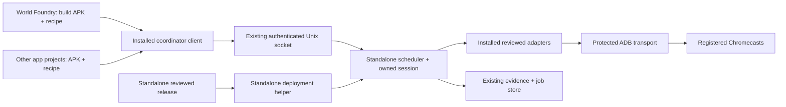

# Standalone Chromecast coordinator project

Date: 2026-10-06. Status: source migration and initial live cutover implemented;
diagnostic correction deployed; full acceptance pending.
Repository: `/home/will/chromecast-coordinator`, with its own `.git`,
release history, deployment tools, tests and device-operations documentation.
GitHub repository: [`wbniv/chromecast-coordinator`](https://github.com/wbniv/chromecast-coordinator), created **private**
from the start and kept private until the full verification matrix passes.
Private visibility has been verified. The initial source and release tooling
are pushed; the existing host service has been upgraded in place to the standalone 0.1.0 release.

## Implementation progress

- Independent checkout and private GitHub remote created. Eight selected source
  commits retain their authors; pending coordinator/validator files are recorded
  in a source-hash provenance manifest. World Foundry history was not rewritten.
- Installable package, CLI, module workers and packaged UI Automation helper
  implemented. Standalone clients require explicit APKs/recipes; local build and
  variant-preparation tools remain in World Foundry.
- Standalone provisioning, hashed release bundle, complete-file upgrade review,
  maintenance drain, SQLite/configuration backup, rollback and installed upgrade
  helper implemented. Existing operational paths and identities are retained.
- **136 local tests pass** against an installed wheel from a temporary cwd.
  Private GitHub CI passes on **Python 3.11 and 3.14**, including release bundle
  build/review without a Git checkout for `dd800e9`. Refreshed local tests cover
  commit `14bab10`; its private CI is pending; the refreshed 0.1.1 release is deployed.
- Bomberman and Prime Numbers installers now require advertised capabilities
  and report a standalone upgrade requirement instead of copying adapters or
  invoking sudo from an app directory. **13 producer/client checks pass**; shared maintenance tests now live in the new repo.
- The initial reviewed cutover completed after terminal sudo authentication.
  The backup is `/var/lib/wf-device-coordinator/backups/standalone-20261006-121134-1254238`.
  Installed file hashes and protected ownership/modes matched at cutover. A later
  installed native-keyboard validator update matches current standalone source.
- Cast1 passed all 26 settings/input/lifecycle assertions, plus recording and
  profiling. Cast2 completed owned capture and Prime Numbers WebView checks,
  including held/released directions, Home/resume and exit. An intermittent Cast
  discovery failure was recovered through the verified endpoint; its evidence is
  retained. Capture while cast2 was asleep produced a black image as expected.
- Shared runtime, deployment resources and tests have been removed from World
  Foundry. APK defaults, legacy producer helpers and capability checks delegate
  to the installed client. Concurrent phone/prompt fixes were preserved with
  provenance before source removal.
- The runtime diagnostic check exposed a release-sampling race. Version 0.1.1
  waits for the complete hardware input cycle and carries the concurrent fixes;
  local tests and Python 3.11/3.14 CI pass. Its refreshed reviewed deployment completed; diagnostic rerun and overhead
  checks remain pending.

The first 0.1.1 review correctly rejected installed drift in `plant_checks.py`
before changing service state. The refreshed bundle preserves the newer native
Android keyboard checks and adds saved preflight failure transcripts. Fresh
review `/tmp/chromecast-coordinator-review-011-refresh.json` passed; release
`/tmp/chromecast-coordinator-release-011-refresh` is frozen at `14bab10`.
Terminal deployment completed at 13:34; post-deployment review passed and the
queue resumed. Protected backup:
`/var/lib/wf-device-coordinator/backups/standalone-20261006-133404-1324408`.
The diagnostic rerun `J-fbd9502170cd` passed all four directional press/release,
actor-consumer and movement checks, then failed because long OK produced
`keypad` while the validator expected `form`. The modal transition remains an
acceptance failure; evidence is saved under `refreshed-011/runtime-check`.
Cast2 owned recovery `J-8614a8111f41` completed successfully.

The rebuilt diagnostic APK `801cebf080a6a3f8561be5eb416a7b174968b0d04d981fb93fae79cac47d81e9`
contains the existing opening-button fix. Six host tests pass; cast1 check
`J-d60e572a8cf5` confirms long OK opens only the form, with held input clear and
simulation paused. All directional checks pass. The later legacy
`keypad_input_acknowledged` assertion fails on this system-text-input APK;
the diagnostic validator must gain native-editor acceptance before the complete
check can pass. Forwarding cleanup passed. Evidence: `opening-press/cast1`.
Cast2 `J-b92c0ef39416` stopped before the opening gesture because Android 12
rejects `input keycombination -t`; this validator needs an owned compatible
held-input implementation before cast2 acceptance. Evidence: `opening-press/cast2`.

The running installation remains authoritative: database/enrollment/keys,
reservations and evidence were retained, and no second scheduler was created.
Both devices are ready after the completed owned cast2 recovery. Host bypass verification and licensing/publication review
remain outstanding; the repository stays private. See
[local extraction evidence](../diagnostics/coordinator-extraction-20261006/receipt.json)
and the standalone project's `docs/migration-status.md`.

## Objective

Make the shared Chromecast coordinator an independent host service used by
World Foundry and other projects. Coordinator maintenance must belong to that
project: upgrading the shared device service should not execute
`android/bomberman/deploy-coordinator.py` or depend on an application checkout.

Preserve the existing complete-session ownership model, queued jobs, personal
reservations, immutable APK inputs, evidence, pairing identity, recovery gates
and protected device access throughout the move. World Foundry continues to
build game APKs and submit typed jobs through its familiar `task chromecast:*`
commands. No World Foundry engine changes are required for this extraction.

## Current coupling found in the source audit

| Source | Coupling to remove |
|---|---|
| `scripts/wf_device/`, `scripts/chromecast.py` | Shared service and client live in World Foundry; workers launch a repository-relative entry point |
| `scripts/install-device-coordinator.py` | Provisioning copies code/config from this checkout and owns host policy installation |
| `android/bomberman/deploy-coordinator.py` | Shared maintenance drain, adapter replacement, rollback and readiness checks are housed in an app directory; default review is Bomberman's |
| Bomberman and Prime Numbers `install.py` | App installers compare shared adapter hashes and invoke that deployment helper with sudo |
| `scripts/wf_device/client.py` | Missing APK defaults resolve through World Foundry's build folders and app receipts |
| `scripts/wf_device/workflows.py`, `service.py` | Generic scheduling/transport and reviewed application validators share app-specific names, scenes and package rules |
| `legacy.py`, `prepare_variants.py` | Compatibility submission is mixed with World Foundry level packing, APK preparation and profile analysis |
| `capture.py`, `scripts/device-capture/` | Helper lookup/build depends on the repository directory layout |
| `Taskfile.yml`, `tests/device_coordinator/` | Clients and tests invoke scripts by their World Foundry paths |
| `config/device-coordinator/`, `docs/device-coordinator.md`, `AGENTS.md` | Units, host enforcement, device policy and operational instructions belong to the game repository |

The installed service already has independent operational paths:
`/opt/wf-device-coordinator`, `/etc/wf-device-coordinator`,
`/var/lib/wf-device-coordinator` and `/run/wf-device-coordinator`.
Retain these paths and the `wf-device-coordinator` service account/unit names
for the first standalone release. Repository separation does not require a
simultaneous rename of the host installation or API.

## Ownership and target layout

```text
/home/will/chromecast-coordinator/
  .git/
  AGENTS.md
  README.md
  LICENSE                     # preserve applicable source licensing/attribution
  pyproject.toml
  Taskfile.yml
  src/chromecast_coordinator/
    cli.py, client.py, service.py, store.py, dashboard.py
    discovery.py, transport.py, workflows.py, capture.py
    launcher.py, image_assertions.py, integration.py
    adapters/worldfoundry/    # reviewed game validators and protocol clients
  deploy/
    provision.py, upgrade.py
    manifest.schema.json
  packaging/
    systemd/, policy/, client/
  capture-helper/
    WfCapture.java, build.py
  config/examples/
  tests/
    core/, adapters/, deployment/, integration/
  docs/
    architecture.md, operations.md, deployment.md, recovery.md
    plans/, diagnostics/
```

The module layout is a target, not a requirement to rewrite every adapter during
the first copy. First establish a standalone, tested package; split generic
transport and application adapters in reviewable follow-up commits within this
migration. Public entry points are an installed `chromecast-coordinator` command
and a small versioned Python client API. Service/worker launch uses installed
module entry points, with no inferred source-checkout root.

| Standalone project owns | World Foundry retains |
|---|---|
| Scheduler, leases, reservations, batches, recovery and evidence storage | Engine, game assets and APK builds |
| Protected ADB discovery/transport and complete workflow cleanup | Local APK freezing/build receipts and profile recipes |
| Capture/helper, launcher verification and dashboard | Level packing, species/plant variant preparation and result analysis |
| Provisioning, reviewed service upgrades, rollback and host policy | Thin `task chromecast:*` aliases and producer integration tests |
| Reviewed validators, including plant, Prime and runtime diagnostics adapters | Engine side of the runtime diagnostics protocol |
| Operational device policy and authoritative service documentation | A short shared-service reference and the engine-change permission rule |

Initially ship the existing reviewed application adapters with the coordinator
release so all current workflows keep working. World Foundry may contribute
adapter changes to the standalone repo. Do not replace the allowlist with
caller-provided Python modules, shell commands, URLs or executable scripts.
The coordinator imports only adapters included in its reviewed installed release.



## Phase 0: record the extraction boundary

Inventory every import, entry point, installer, Task alias, unit/hook command and
test that names the old locations. Include general Android runner routing,
legacy Aquarium profile/record scripts, both app installers and deployment-test
fixtures. Record package runtime requirements and capture-helper build inputs.

Record the installed coordinator revision/capabilities and current queue/device
health through the shared client. Treat live installed configuration and the
durable registry as authoritative; the repository's sample `devices.json` has
historical endpoints and offline statuses and must not overwrite enrollment.

Establish the current test baseline and an explicit extraction manifest with
source commit and file hashes. Include approved working-tree additions and fixes,
not just committed files: runtime diagnostics and current plant validators are
being developed in this checkout. Review concurrent changes by file and preserve
their owners' work; do not clean/reset the source checkout.

Acceptance: the manifest identifies code, tests, build resources and licensing,
and every producer dependency has an owner and replacement path.

## Phase 1: create the independent repository

Create the sibling project as its own repository, rather than a World Foundry
worktree, nested repository or symlink. Use a temporary clone to extract history
for the selected coordinator paths; never filter or rewrite this repository's
history. Add the explicitly reviewed working-tree files as an integration commit
with source provenance. Preserve applicable licenses and contributor attribution.

Create the GitHub remote as private before the first push, and verify its
visibility through GitHub after creation and each release operation. If the
proposed repository name already exists, inspect its ownership and visibility
before using it. Keep code, CI artifacts and prereleases within the private
repository during development and testing. Exclude device credentials, pairing
codes, host configuration, state backups and private operational evidence from
Git and release artifacts regardless of repository visibility.

Use the new repository as the implementation workspace. The present workspace
permits writes only to World Foundry and `/tmp`; add/open the target workspace
before creating or editing `/home/will/chromecast-coordinator`.

Package the Python code with explicit CLI/service/worker entry points and declare
its dependencies. Tests must run from an installed package in a temporary working
directory with World Foundry absent from `PYTHONPATH`. Build the capture helper
from sources owned by the new repo and package its fixed runtime artifact.

Create the coordinator's own `AGENTS.md`: standing authorization for ordinary
device tests; complete sessions through the coordinator; respect reservations;
install-only exception; secure pairing prompts; no raw ADB or direct phone-control
fallback; save diagnostic output to files; verify bypass policies before claiming
enforcement. World Foundry retains its separate engine permission policy.

Acceptance: standalone checkout/package passes the extracted tests without
World Foundry installed, and produces its own release/deployment artifacts;
the independent GitHub remote exists and its private visibility is verified.

## Phase 2: separate clients, artifacts and reviewed adapters

Move World Foundry path defaults out of the general client. Producers pass an
explicit frozen APK path or a validated build receipt; the client uploads bytes
into the existing immutable store. Keep all app build tools, level packers and
local analysis in their producer repos. Split `prepare_variants.py` accordingly.

Move generic identity lookup/submission helpers into the client API; keep
World Foundry-specific legacy command parsing as thin local shims where needed.
Replace service worker path inference, capture-helper path fallback and test
`sys.path` injection with installed-package interfaces and explicit resources.

Define versioned capabilities covering protocol version, release revision,
workflows, validator IDs and supported request fields. A producer with an
unsupported workflow receives a clear upgrade requirement before installation
or device input. It does not silently upgrade the host service from an app's
installer. Preserve existing request/environment names during the transition
and test old-client/new-service compatibility.

Keep fixed application identity, scene, package and validator metadata with the
reviewed adapters. Avoid changing their gameplay assertions while extracting.
Optional app-side recipes contain data and frozen artifacts, never executable
server extensions. Client/user session identity remains compatible with the
existing authentication store.

Acceptance: application builds and adapter deployment are independent; no
standalone runtime path requires a World Foundry source directory.

## Phase 3: own provisioning and upgrades in the new project

Move provisioning and the reviewed upgrade algorithm into `deploy/`, with no
Bomberman default review or application-path invocation. Publish documented
project commands such as `task coordinator:build`, `task coordinator:test`,
`task coordinator:provision` and `task coordinator:deploy` in the new repository.
Finalize the exact CLI during implementation; producer commands remain separate.

Build an explicit release bundle and deployment manifest containing revision,
protocol compatibility, allowed file paths and artifact hashes. Deploy from that
reviewable artifact. Hashes establish which files are being installed; they do
not independently establish trust or grant administrator permission. Reject
source/hash drift, unexpected installed revisions and unsafe archive paths.

Retain the existing upgrade guarantees: deployment lock, persisted maintenance
drain, wait for complete running sessions/cleanup, retain queued jobs and personal
reservations, stop old workers/ADB children, install protected code, verify the
service, and resume grants. Failure restores the prior code and retains a safe
maintenance/recovery state; drain timeout never cancels somebody else's job.
Provisioning and upgrades remain separate operations.

Install a stable root-owned deployment entry point so routine release upgrades
have a coordinator-owned command. Keep the immutable installed device client
and its narrow operation allowlist. Review obsolete Bomberman-path command
approvals when the replacement is ready; do not grant unrestricted sudo, Python
or editable shell execution as a substitute. Administrator authentication is
still required where the host requires it.

Preserve and merge existing systemd, network and Codex policy settings. Repoint
hooks to installed coordinator entry points without replacing unrelated hook
groups. Preserve client permissions and any approved terminal/session behavior.
Audit IPv4/IPv6 access, containers, persistent ADB children and stale entry points
as part of the host checks; moving files does not prove enforcement.

Acceptance: reviewed upgrade, drift rejection, active-session drain, rollback
and readiness tests pass using only the standalone release and deployment tools.

## Phase 4: perform the host cutover

Prepare the release and concrete deployment review before requesting any needed
administrator execution. Save the deployment transcript to a printed destination
and read it directly. Take a consistent SQLite backup and protected configuration
backup under maintenance; account for WAL state. Retain file ownership/modes and
exclude private backup material from Git.

Preserve the existing SQLite database, owner/session credentials, job and batch
IDs, queue, reservation ownership, recovery records, evidence, APK input hashes,
device registry, ADB keys, socket path and client state directory. Do not create
a second scheduler or ADB identity and do not require users to re-pair or
re-register simply because the source repo moved. Never manufacture or release
Will's personal reservations during cutover.

Use the normal maintenance drain and restart to switch the installed code.
Avoid a database schema change in the first extraction release. If a schema
change proves necessary, document compatibility and recovery explicitly before
deployment; old-code rollback must remain able to read the retained state.

Acceptance: queue/reservation/evidence identity matches before and after;
old clients authenticate; a queued job is retained; reconnect and cleanup work;
no game checkout is needed to run or administer the host service. Test failure
recovery with fixtures before the live cutover. Do not deliberately interrupt a
real device owner's session to demonstrate rollback.

## Phase 5: update World Foundry and app consumers

Change `task chromecast:*` and `cast1`/`cast2` aliases to call the installed
coordinator client. Preserve all existing operation names, variables, literal
message handling, evidence destinations and secure pairing prompts. Keep local
APK default selection in a producer wrapper or pass an explicit receipt.

Update Bomberman and Prime Numbers installers to check coordinator capabilities
and submit typed jobs. Remove shared adapter-copying and automatic deployment
through an app directory. Update legacy profile/record scripts and
`android-device-run.sh` so registered Chromecasts still use the coordinator while
unrelated Android hardware keeps its existing explicit routing.

Replace local coordinator documentation with a concise consumer guide linking
to the standalone operations docs. Retain historical evidence and plans in
World Foundry; explain old command paths as history rather than active procedures.
Move current coordinator plans/operations docs and tests into the new project.
After consumers pass their tests, remove duplicate service/deployment source
from World Foundry and keep only intentional client compatibility shims.

Acceptance: builds and ordinary install/check/profile/record/capture workflows
still work through familiar producer commands; no app directory owns shared
service upgrades; dependency searches find only intended compatibility/history
references to the old source layout.

## Verification matrix

| Area | Required evidence |
|---|---|
| Standalone package | Tests run without World Foundry on import paths; service/worker/resource lookup works from a temporary cwd |
| Client compatibility | Old credentials and socket path work; frozen inputs, batch retries, watch, evidence conflicts and literal messages retain semantics |
| Ownership | Cross-owner cancellation/release denied; generation fences, kernel locks and complete cleanup remain intact |
| Reservations | Existing personal reservations survive upgrade; interactive jobs wait; permitted background installation preserves the foreground |
| Deployment | Drift rejected before mutation; drain retains queued work; restart checks pass; failed replacement restores code safely |
| Devices | Owned cast1 install/check/capture/profile and lifecycle smoke; equivalent cast2 smoke once local setup is restored |
| Diagnostics | Carry the current runtime adapter and frozen APK tests into the new release; retain forwarding cleanup, acknowledgement fences and bounded read tests |
| Host policy | Existing protected-client/hook checks plus IPv4/IPv6/container/runtime bypass tests; explicitly report any checks still pending |
| Producer separation | APK build remains in World Foundry; coordinator build/deploy runs from its own repo without application sources |
| Repository visibility | GitHub confirms private throughout migration; publication review covers source history, licensing and release artifacts |

## Private development and publication gate

Keep the repository private through extraction, host cutover and producer
migration. "Fully tested" means every required verification-matrix check has
passed with recorded evidence against the release being considered for
publication. Pending cast2 setup, skipped device tests, unverified host bypass
checks or unresolved rollback failures keep this gate closed. Any material
change after verification requires repeating the affected checks.

Before changing visibility, review the extracted history and release artifacts
for private data, resolve source licensing and attribution, and record the
tested commit, results and outstanding limitations in the standalone repo.
Passing these gates makes publication eligible; it does not automatically
change visibility. Present the concrete tested release and publication review
to Will before making the repository public. Public releases and externally
accessible documentation follow that visibility decision.

## Current diagnostics work and rollout order

The approved phase-one runtime bridge has locally built ordinary and diagnostic
APKs with matching game assets. Host/coordinator verification is recorded in
[the diagnostic evidence directory](../diagnostics/runtime-diagnostics-bridge/).
Its coordinator upgrade and real-device acceptance are pending; the old
Bomberman-path deployment attempt required interactive sudo authentication.

Include that adapter in the extraction manifest and review its pending changes
alongside the current plant validator. Give the next diagnostic deployment a
standalone coordinator release/command, then run the fixed cast1 acceptance and
disabled/no-client/subscribed overhead checks. This migration does not authorize
additional engine changes for diagnostics phases 2 or 3.

First deliver a tested standalone source/package and deployment artifact, then
cut over the installed service, then switch and remove producer-side copies.
Keep a known compatible release and state backup until both device and producer
checks pass. The initial delivery includes the independent local repository and
its private GitHub remote. Keep subsequent development and release testing
private until the publication gate above is satisfied.

Related: [shared coordination plan](2026-10-03-chromecast-shared-device-coordination.md),
[current operations](../device-coordinator.md),
[runtime diagnostics plan](2026-10-06-runtime-diagnostics-bridge.md).

## Reported numeric keyboard crash

Will reports pressing Up from the 1 key on the 10-key keyboard crashes the
app. Owned reproduction now confirms the crash on both TVs. A fixed validator probe
checks the Up action in both native and legacy numeric editors, records process
identity before/after and captures the original process log even on exit.
Standalone commit `f1f1c52` passes all 139 installed-package tests. Fresh release
`/tmp/chromecast-coordinator-release-numeric-up` and review
`/tmp/chromecast-coordinator-review-numeric-up.json` pass preflight. Deployment
completed with protected backup `standalone-20261006-135354-1341004`.
Jobs `J-c40d759cc60b` and `J-8c28af8e8ec5` both reproduce
`UnsatisfiedLinkError` calling `WorldFoundryActivity.textResult` after Up. Both
APK ABIs export the JNI method. A proposed activity static initializer loads
`wf_game` into the Java class loader; the patch compiles against Android 34 but
was explicitly approved and applied. Diagnostic and ordinary APK builds pass.
Fixed diagnostic jobs `J-2b93477c9b6c` (cast1) and `J-484dfebcef68` (cast2)
both pass `numeric_up_keeps_process`, with identical process IDs before/after Up
and no JNI errors/fatal exceptions. The first cast2 fixed attempt failed startup
foreground validation; its retry reached and passed the probe. The later seed
assertion fails because Up completes the native editor before the validator types;
reopen it before subsequent text-entry assertions. The crash itself is resolved. Evidence:
`docs/diagnostics/coordinator-extraction-20261006/up-crash/`.
