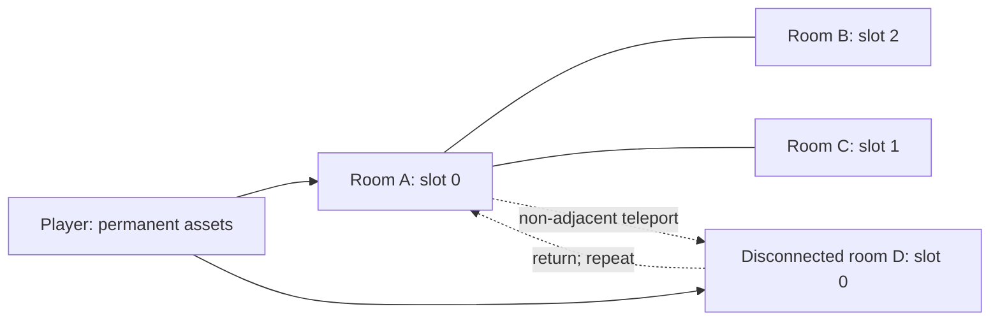

# T4: cross-room teleport audit

Status: three reproduced faults fixed and verified on desktop and both Chromecasts. Engine commit `c92ca353`. Broader architecture boundaries are recorded in [the audit review](../teleport-audit.md).

Will explicitly requested engine investigation and targeted fixes on 2026-10-08.
This authorizes the engine work in this task. Preserve unrelated working changes.
The pasted task contains “45 lines hidden”; the omitted scope and acceptance
requirements have been requested and remain unresolved.

## Baseline and isolation

- [x] Inspect main engine checkout and prior fix `2b893d48`.
- [x] Use isolated `~/WorldFoundry-wbniv/.worktrees/teleport-audit`.
- [x] Record exact baseline, configuration, level hashes and diagnostic paths.

The supplied worktree was absent in this session's filesystem and Git worktree
registry. Created the named isolated branch/worktree at `2b893d48` with
`task feature-start NAME=teleport-audit BASE=2b893d48`, as authorised by Will.
No existing worktree or branch was removed. Main checkout at `514e642e` and its
unrelated edits were preserved.

## Diagrams and invariants

```mermaid
flowchart LR
    A[Room A and neighbours loaded] -->|script position writes| C[Player in non-adjacent room C]
    C --> M[Move object membership to C]
    M --> S[Select C and its neighbours]
    S --> U[Unbind and unload departing rooms]
    U --> L[Load arriving rooms using freed slots]
    L --> B[Bind room actors; retain permanent moving actors]
    B --> R[Update collision, camera, sound and render]
```

The diagram describes the invariants to establish, not a proposed ordering fix.
Compare actual frame ordering and trace it in regression runs before changing it.

The regression must exercise both retained rooms and complete active-set
replacement, fewer arriving neighbours, multiple loads/unloads, and slot reuse.
Every co-active room must occupy a distinct transient slot. Moving actors must
retain permanent allocation and appear exactly once in room object lists.

## Audit matrix

| Area | Source to inspect | Evidence required |
| --- | --- | --- |
| Destination selection | `room/actrooms.cc::UpdateRoom` | Non-adjacent jump finds actual destination; gaps and overlaps reported |
| Transition lifecycle | `ChangeActiveRoom`, `_tblFromRooms`, `_tblToRooms` | Exact departing/retained/arriving sets; unload before reuse; correct room unbound |
| Slot assignment | `room/rooms.cc::InitRoomSlotMap` | Distinct slots for each active set; disconnected room components |
| Object membership | `room.cc::UpdateRoomContents`, `rooms.cc::AddObjectToRoom` | Moving actor leaves source, enters destination once; inactive destination works |
| Frame sequencing | `game/level.cc::update` | Script teleport versus selection, physics, membership, director and rendering |
| Asset lifetime | `asset/assets.cc`, `baseobject`, `game/actor.cc` | Stable permanent assets; unloaded actors cannot use freed memory; reload restores state |
| Scale writes | `game/actor.cc` scale mailbox cases and `BindAssets` | Reproduce nil diagnostic; prove cached scale survives reload or report loss |
| Collision and physics | `room/actrooms.cc`, movement/physical attributes, Jolt | Destination collision and pose; stale events and velocity semantics |
| Camera, scripts, sound | Director/watch object, scripting mailbox writes, sound lifecycle | No invalid unloaded dependency; destination view and sound stay consistent |
| Compiler and archive | levcomp room assignment and room-chunk TOC | Regression builds reproducibly; empty room/chunk behavior recorded |

Findings must include file/line references, observed behavior and reproduction
commands or an explicit “not reproduced”. Do not infer correctness from a model
of the code alone. Distinguish existing constraints from confirmed defects.

## Ordered work

1. [x] Finish plan and open it with `task md` before changes to engine code.
2. [x] Add a standalone multi-room regression level and engine-backed test.
   Record a failing run against the fixed baseline before each new fix.
3. [x] Audit the visible matrix and classify findings, reproductions and limits.
4. [x] Fix confirmed faults; Will chose immediate camera jumps on teleport.
5. [x] Run regression loops with assertions enabled and disabled, existing engine
   tests, and the Parmenides non-adjacent return tour as an integration check.
6. [x] Save review, scoped diff and raw evidence with limitations; update BUGS docs.

## Camera decision and implemented ordering

Will selected “Jump immediately on teleport” on 2026-10-08. Position-mailbox
writes and `wfmut::SetActorPos` mark the watched actor; normal physics walking does not mark it. After
actor scripts, resolve the final pose. For a different valid room, snap the
camera to the authored shot, migrate room membership before unloading, then
select/load the destination. Within-room writes keep smoothing. External writes
and director scripts have corresponding safe completion points.

The regression proves arrival in one paused script frame, repeated adjacent and
non-adjacent teleports, multiple writes in one script, retained rooms, complete
set replacement, slot reuse and unloaded scale caching. The scene9 chapter tour
adds 15 real level-script teleports with the dynamic player. It does not certify
all terrain/contact cases or every chapter route.

## Decisions reserved for Will

Stop only the affected part and record `ESCALATE: <why>` with code references and
reproduction evidence when a fix requires a gameplay or architecture policy:
teleport outside every room, ambiguous overlapping-room destination, velocity or
collision reset semantics, when a teleport becomes visible within a frame,
moving a non-permanent actor across rooms, or changing legal room topology and
archive formats. Continue independent investigation and mechanical fixes.

## Evidence bundle

- [x] Build the audited Android release library for both Chromecast ABIs (`armeabi-v7a` on both registered devices).
- [x] Freeze and hash autonomous four-room and chapter-tour diagnostic APKs.
- [x] Run coordinator-owned recording sessions on Chromecast 01 and 02.
- [x] Validate every recorded standalone arrival (151/146), inspect repeated chapter cycles and verify cleanup.
- [x] Save [device review and raw evidence](../diagnostics/t4-teleport-audit/android-review.md).

Use `docs/diagnostics/t4-teleport-audit/` for raw commands, build/test output,
baseline metadata, traces and reproduction receipts. The engine worktree's
review links the standalone regression, findings and scoped patch. Device
verification uses only the coordinator's `task chromecast:*` workflow.
