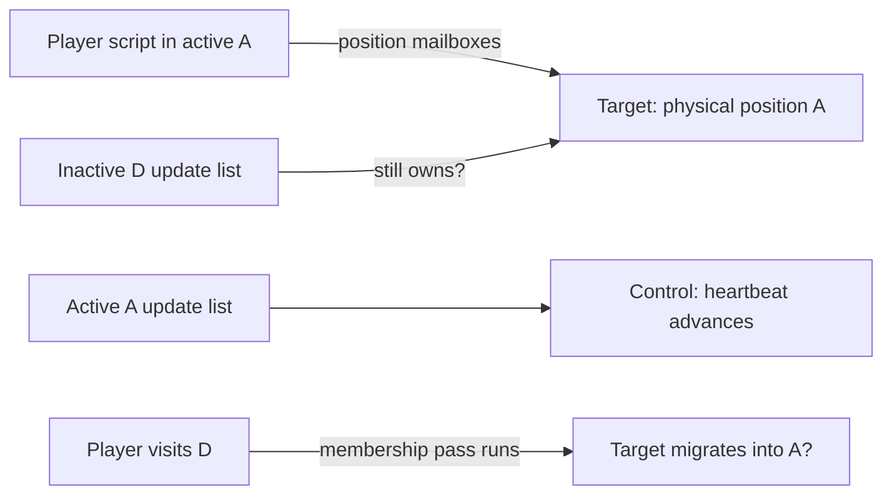

# Unloaded actor reproduction — 2026-10-09

- [x] Inspect the position-write notification and active-room membership pass.
- [x] Author legal Moves Between Rooms actors: target in inactive D; control in A.
- [x] Have the active Player script write the target's position into A.
- [x] Compare target heartbeat with the active control and Player over 120 updates.
- [x] Repeat after loading D once, then leaving it inactive.
- [x] Activate D again to test whether source-room visitation repairs membership.
- [x] Retain receipts, screenshots, logs, fixture hashes and source references.

This is an investigation fixture, not an engine fix. Test both a never-loaded
target and a previously bound target. Keep the camera watching the Player.
Room D retains its non-permanent marker so its archive chunk exists. Position
writes originate in Forth; the bridge only requests commands and observes.

Expected defect: pose writes succeed but the target heartbeat freezes until D
is activated. A passing reproduction harness means this defect was observed;
it is not a passing engine regression. The authorized repair and correctness
checks are recorded below.

Confirmed in both native release and assertions-enabled runs. Review and raw
evidence: [unloaded-actor-review.md](../diagnostics/unloaded-actor-review.md).

## Authorized repair

Will requested the fix after reviewing the reproduction (2026-10-09).

- [x] Coalesce MBR position writes at safe update boundaries.
- [x] Reconcile membership using inactive source rooms as well as active rooms.
- [x] Bind never-loaded MBR actors on entry into already active rooms.
- [x] Preserve inactive-room script/physics scheduling and watched camera behavior.
- [x] Register correctness regression, including exact next-frame updates.
- [x] Verify old engine fails and fixed release passes.
- [x] Assertions-enabled full suite: 24/24 passed.
- [x] Android/Chromecast verification: 117/114 intervals and verified cleanup.
- [x] Correct Android const-accessor compile error; rerun all three native
  teleport regressions and validate the autonomous fixture before upload.

Implementation and evidence:
[unloaded-actor-fix.md](../diagnostics/unloaded-actor-fix.md).
