# Porting status: World Foundry on every platform

As of 2026‑10‑01 03:05 (+07) = 2026‑09‑30 20:05 UTC. Everything below was observed in a Codemagic build or a local
run on that day, and each claim links to its evidence. **—** means not assessed today, not "works". Legend: ✅ verified on the real
platform (real hardware, or real macOS/Linux), 🟡 partial or only in a simulator or emulator, ❌ not working, ⬜ not tested. Plan: [the aquarium on every platform](plans/2026-09-30-aquarium-platforms.md).

## Summary

| Platform | Builds | Runs | Draws the game | Input | On a real device |
|---|---|---|---|---|---|
| **Linux desktop** (OpenGL) | ✅ | ✅ | ✅ (the reference renderer) | ✅ keyboard, gamepad | ✅ (this machine) |
| **macOS desktop** (Metal) | ✅ [build 6abd3923](https://codemagic.io/app/6aafa6886ab3f21cf431a6cb/build/6abd3923a7c72c2289f7506c) | ✅ window, close paths, fullscreen | ✅ pixel-matches Linux | 🟡 keyboard ✅, ⌘Q ✅, red button ✅, Esc not provable in CI | ⬜ no Mac owned; Retina untested |
| **iOS, iPhone and iPad** (Metal) | ✅ ([build](https://codemagic.io/app/6aafa6886ab3f21cf431a6cb/build/6abd4a709ee70f86b0ffeff6)) | 🟡 installs, launches and stays alive in the iPhone and iPad simulators (no real device) | 🟡 the game and the aquarium, in both simulators (no real device) | ⬜ touch not implemented yet | ⬜ needs the $99 Apple account |
| **Android phone and tablet** (GLES 3) | ✅ [build 6abd1529](https://codemagic.io/app/6aafa6886ab3f21cf431a6cb/build/6abd1529669c35dd0f161d7a) (was broken 09‑21 to 09‑30, fixed) | 🟡 the aquarium app runs in an Android emulator on this PC (x86_64 with ARM translation, software graphics; no real phone) | 🟡 in the emulator | 🟡 the on-screen touch D-pad and A/B buttons are drawn; not exercised | ⬜ never on a real phone |
| **Chromecast with Google TV** (same APK) | ✅ aquarium app ([CI build 6abd1c20](https://codemagic.io/app/6aafa6886ab3f21cf431a6cb/build/6abd1c20874cdae673caf7ae); 32-bit `armeabi-v7a` added 2026‑10‑01); the condo app too ([CI build 6abd6b03](https://codemagic.io/app/6aafa6886ab3f21cf431a6cb/build/6abd6b038c57d072922d7cf7), 6.1 free Mac-minutes; green again on the resume-fix commit, [build 6abd6e96](https://codemagic.io/app/6aafa6886ab3f21cf431a6cb/build/6abd6e966215672186731fea)) | ✅ runs on a **real Chromecast HD**: alive after 30 s, no crashes; the **release APK presents at 60 frames per second** (125 consecutive frames at 17 ms, locked to the TV's refresh), the debug APK only about 2.5 | ✅ the aquarium, the condo, SMB, snowgoons and Q\*bert (one app each), on the TV | ✅ the remote's D-pad moves the fish and its OK is button A (in the condo: doors and the balcony shade); **a phone is a gamepad over the local Wi-Fi** (QR on the TV, carrying the World Foundry logo; tried on a real phone, 2026‑10‑01); a hardware gamepad is not tested | ✅ a real device (Chromecast HD, Amlogic S805X2, Android 14) |

## The aquarium on each platform

Scripted, deterministic frames (`--frame-step-smoke`, `-rate20`, frame 20 of a fixed run; no player input), not
real-time play. The same level file and the same flags on every platform.

| Linux, OpenGL (reference) | macOS, Metal (Codemagic) |
|---|---|
|  |  |
| The committed reference frame, byte-identical across three runs. | Rendered by Metal on a Codemagic Mac. **306 865 of 307 200 pixels are exact; the other 335 differ by one level, none beyond the tolerance of 3** ([macOS build](https://codemagic.io/app/6aafa6886ab3f21cf431a6cb/build/6abd3923a7c72c2289f7506c)). |

| macOS Metal, frame 100 | macOS Metal, frame 200 | macOS Metal, real window |
|---|---|---|
| 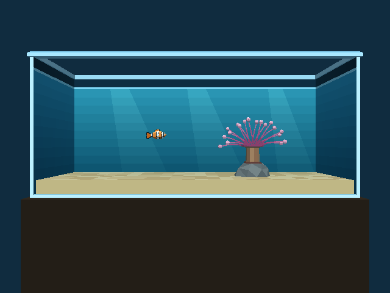 |  | 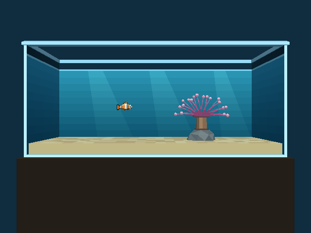 |
| Later in the same run: the anemone sways and the fish's pose changes. | Frame 200 of the same deterministic run. | Presented to a real `CAMetalLayer` window (`--windowed`) on the runner. |

| iOS simulator, iPhone 17 Pro | iOS simulator, iPad Pro 13‑inch |
|---|---|
| 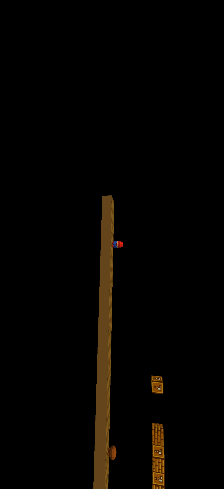 |  |
| **The game now draws.** The bundled level 0 (Super Mario Bros. 1‑1). The framing is not tuned for a portrait phone. | Same on the iPad. The banner at the top is a Simulator system notification. Both are simulators, not real devices. Earlier today both screenshots were a solid blue fill. |

| Android and Chromecast: the aquarium's app banner | The condo's app banner |
|---|---|
| 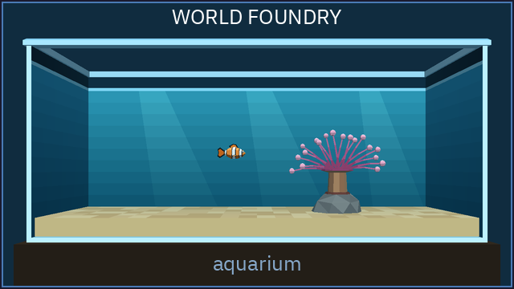 |  |
| The Google TV launcher banner of the aquarium app. | The same for the condo app, from a real capture of the level. |

(What the apps look like *on* the Chromecast is the pair of real-device screenshots above. An earlier "what the TV will show" Linux render stood here before any device had run the apps; it is gone because it was not a Chromecast screenshot.)

<!-- ios-aquarium-shots -->
| iOS Metal, **aquarium** on iPhone 17 Pro | iOS Metal, **aquarium** on iPad Pro 13‑inch |
|---|---|
| 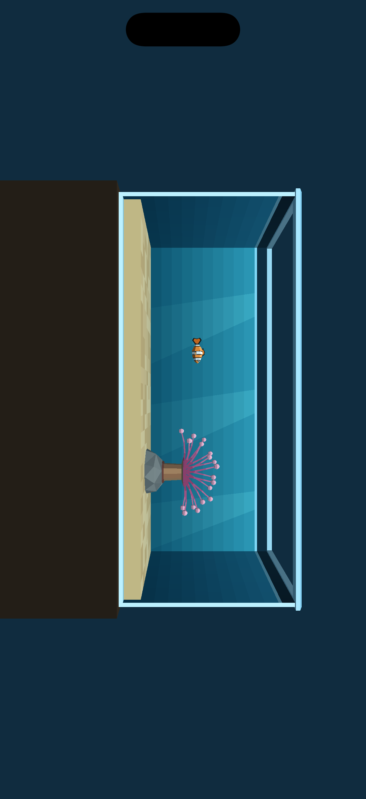 | 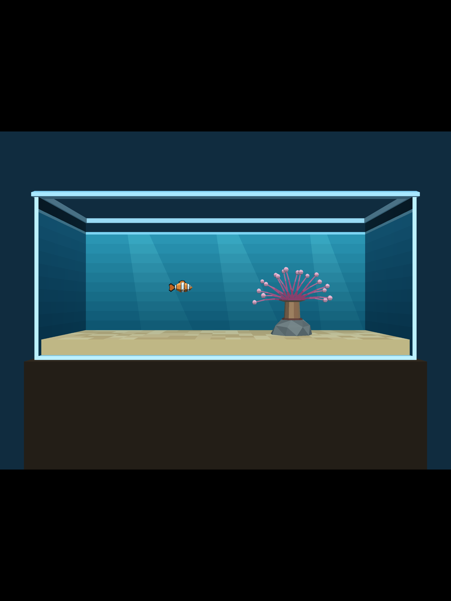 |
| The aquarium-only `cd.iff` in the iOS simulator ([CI run](https://codemagic.io/app/6aafa6886ab3f21cf431a6cb/build/6abd4f31103ed7df74f88df3), scripted, no input). **Rotated 90°:** the level is landscape and the app is landscape-only, but the screenshot was taken with the simulator in portrait. | Same on the iPad: the landscape frame sits letterboxed inside the portrait screen. Simulator only, not a real device. |

| Android emulator, TV-shaped screen (1920×1080) |
|---|
| 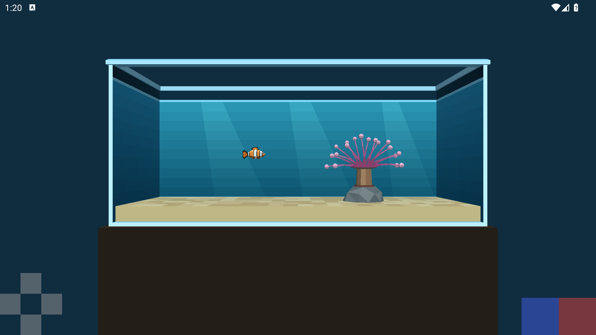 |
| The aquarium app in an Android emulator on this PC: x86_64 image with ARM translation, software graphics, scripted launch, no input. The D-pad and A/B in the corners are the touch overlay. About 0.4 s per frame in this setup, which says nothing about a Chromecast. **Not a real device.** |

| Real Chromecast HD: the aquarium after 30 s | Same, after the remote's D-pad was held RIGHT, then UP |
|---|---|
| 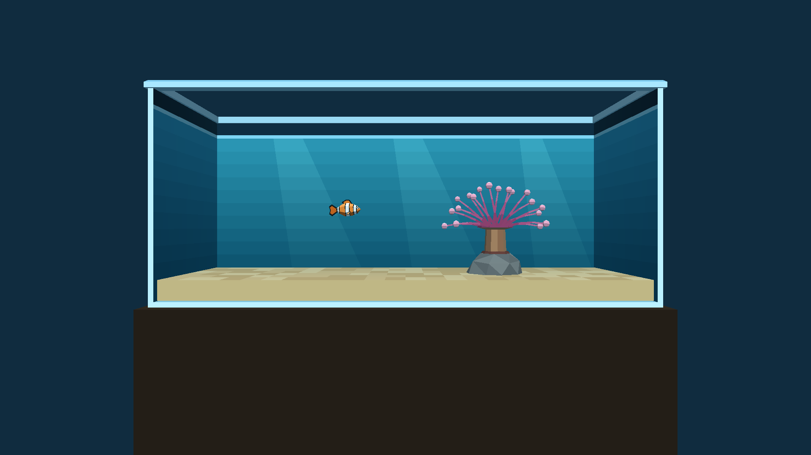 | 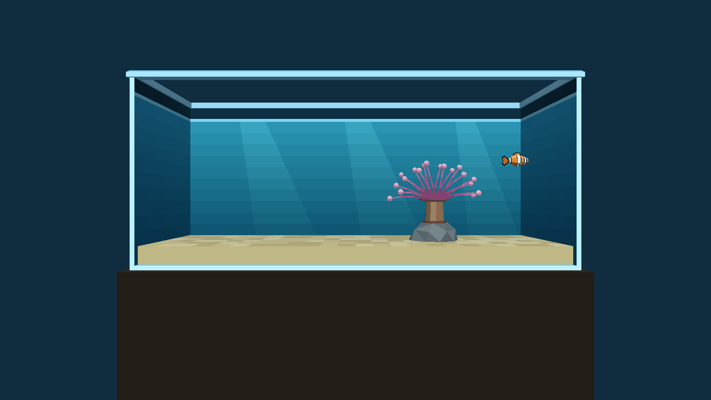 |
| Screenshot taken on the device over adb (1920×1080). The debug APK draws at roughly 0.4 s per frame; the release APK presents at 60 fps (measured from SurfaceFlinger's real drawing layer). | **The fish moved right and up:** the engine log shows its position going from (−1.600, 2.400) to (−0.725, 2.526). |

| Real Chromecast HD: the condo after 45 s (release build) | Same, after the remote's D-pad was held RIGHT, then UP |
|---|---|
| 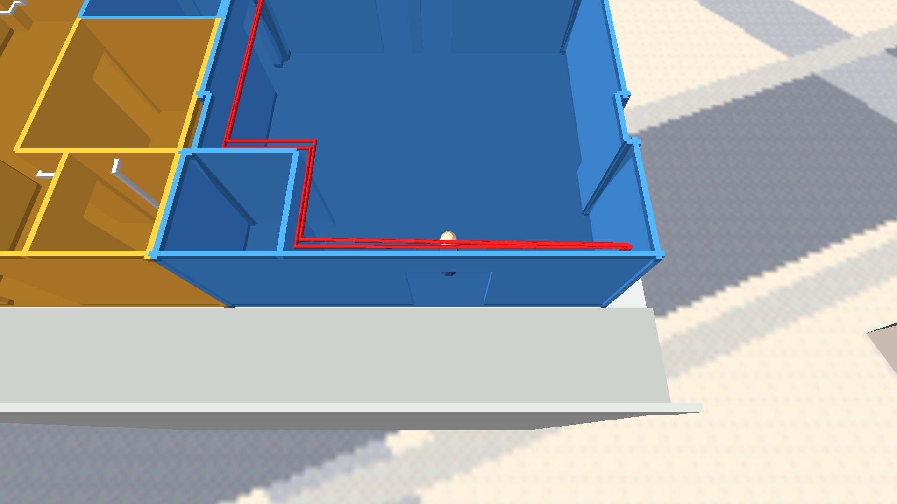 | 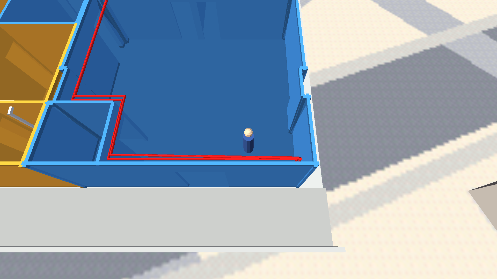 |
| The condo as its own app (`org.worldfoundry.wf_game.condo`, 2.4 MB `cd.iff`): **59.9 fps**, 126 frames at 16.7 ms, 61 MB total memory. Screenshot over adb, 1920×1080. | The camera and the player moved: the player's head and body are now in view, and the walls have shifted. Plan: [the condo on the Chromecast](plans/2026-10-01-condo-chromecast.md). |

## Details

### macOS (Metal): working
- CI `macos-desktop-debug` builds and links (Ninja, arm64, Jolt physics, Forth scripting), runs the headless frame-step smoke, and compares frames with Linux: snowgoons 306 702 of 307 200 exact, the aquarium 306 865 of 307 200, neither with any pixel beyond tolerance 3.
- A real window with a `CAMetalLayer` presents drawables on the runner; keyboard input works ([2026‑09‑21 VNC session](plans/2026-09-21-macos-human-verification.md)).
- **⌘Q and the red close button** quit cleanly (status 0) with real System Events input, and **`-fullscreen`** covers the display without changing its resolution ([close-paths step](plans/2026-09-21-macos-close-paths.md)).
- **Open:** Retina (the runner is scale 1.0), Esc delivery in CI (the VNC pass stands), double-click launch of the `.app`, the `cd.iff`-from-bundle path (CI uses `-L`), a real Mac.

### iOS (Metal): builds, links and draws in the simulators
- Today: from "configure fails" to "renders the game and the aquarium" in the iPhone 17 Pro and iPad Pro 13‑inch simulators ([CI run](https://codemagic.io/app/6aafa6886ab3f21cf431a6cb/build/6abd4a709ee70f86b0ffeff6), merged into `2026-new-level`). The fixes: Jolt extraction; the `MTLStorageModeManaged` iOS guard; three missing link symbols; the engine thread now presents its own frames (the display link only cleared the screen to blue and every triangle was dropped); iOS compiles the same GL-pipeline geometry files as macOS; audio is skipped on the **simulator only** (Apple's audio server never answers on the headless runner and the app is killed after 10 s; real devices are unchanged, `WF_IOS_SIM_AUDIO=1` turns it back on).
- The CI verdict: the app alive at 20 s and more than 50 colours in the centre of the screenshot, so a solid fill can no longer pass.
- **Open:** touch input and lifecycle (Phase 3), the landscape-only app shows rotated on an iPhone, a real device (Apple signing), audio on any iOS target.

### Android and Chromecast (GLES 3): builds and runs in an emulator
- The Android build had been **broken since 09‑21** (`GL_RGB5` is not in GLES 3.0; `backtrace()` needs API 33) and is fixed. Both apps (snowgoons and the aquarium, separate app ids) build in CI, on the free Mac machines.
- Codemagic's free Mac machines cannot run an Android emulator ([no nested virtualization](https://docs.codemagic.io/yaml-testing/testing/)), so the emulator run was done locally on this PC (KVM).
- **The Chromecast HD is 32-bit only** (`armeabi-v7a`, Amlogic S805X2 running Android 14), so the arm64-only APK could not even be installed: the Chromecast plan's assumption that the HD model takes arm64 was wrong (the 4K model is arm64). The APK now carries both ABIs.
- The first ever 32-bit ARM run exposed a memory-pool alignment assertion, and it was a regression from our own 64-bit work, not a 32-bit limit: the 2010 original asserted that entry sizes are a multiple of **4** (a message entry is 20 bytes on 32-bit, which passes), the May 2026 pointer-size pass (`292af662`) generalised that to `WF_POINTER_ALIGN`, and its 32-bit ARM carve-out set that to **8** (for heap allocators that may hand out `int64`/`double`), which 20 fails. The pool now rounds each entry to a free-list node's alignment, which is **4 on 32-bit ARM and 8 on 64-bit** (so 64-bit is unchanged, and 32-bit is back to the original 4), and each pool's stored types `static_assert` that they need no more. The heap allocators keep 8 on 32-bit ARM.
- The TV's screensaver starts after about 5 minutes idle and stops the app drawing, so device runs wake it first. Frame pace is read from SurfaceFlinger's drawing layer (the script's own probe used a wrong layer; fixed in the condo work).
- **The condo runs as a second real-Chromecast app.** It needs six `--vram-*` engine flags (a bigger texture budget: the condo has a 1024×1024 permanent texture atlas holding its OpenStreetMap sky dome and ground map, and the engine's default permanent slot is 256×256) that the desktop launchers pass and Android did not, so the first run hit `AssertMsg: width = 1024, map.GetXSize()+1 = 257`. The condo app now ships them in `assets/wf_args.txt`, which `native_app_entry.cc` reads at startup (no file, no change: the aquarium and snowgoons are untouched, re-verified on the device at 59.9 fps). The level itself is fine.
- **Home then reopen crashed both apps, and is fixed.** The engine aborted (signal 6) about 120 ms after `APP_CMD_RESUME`: Android delivers the resume before the new window, and the game loop drew into no surface (GL error 1286, `display.cc:866`). `HALIsSuspended()` now also waits for the window; `android-device-run.sh --resume` tests it (condo and aquarium, real Chromecast: alive and drawing after Home and reopen).
- **The OK button is button A, and the condo's A now toggles the doors and shade (2026‑10‑01).** The remote's OK sends `AKEYCODE_DPAD_CENTER`, which the Android key map dropped; it now maps to A ([plan](plans/2026-10-01-chromecast-ok-button.md)). The condo had no hop worth the name, so its door and shade control moved from B to A and A is no longer forwarded to the player as a jump; the user confirmed the toggle by hand on the TV with the real remote.
- **A phone can be the gamepad (2026‑10‑01).** The aquarium and condo apps serve a one-page controller over the local Wi-Fi and show a QR code and PIN on the TV; the user played the condo from a real phone (page served, 59 button changes in the TV's log: A, C, D, E, F, the stick and D+stick). The only failure in the first attempt was a phone on a different network. A measured finding: the Chromecast's Wi-Fi power saving makes a round trip about 156 ms median at 250 ms between frames and 21 to 28 ms at 20 to 50 ms, so the page sends a frame every 50 ms while connected (applied 2026‑10‑01; **21.5 ms median round trip over 60 s from a PC client on the TV's Wi-Fi, not yet measured from a phone**; [plan](plans/2026-09-30-aquarium-chromecast.md), Phase E).
- **One app per game (2026‑10‑01).** The multi-level `cd.iff` the snowgoons app shipped booted SMB W1‑1 (its TOC level 0), and nothing on the remote reached the other games. Now each game is its own app with its own one-game `cd.iff`: **SMB** (`org.worldfoundry.wf_game.smb`, W1‑1 to W1‑4, which still chain), **snowgoons** (keeps `org.worldfoundry.wf_game`, so the old install upgrades, and now boots snowgoons) and **Q\*bert** (`org.worldfoundry.wf_game.qbert`). An audit found no level writing an index outside its own game, so no level changed. On the real Chromecast HD all three release apps launch, stay alive, show the right game and present at 59.9 fps (8 s runs, no input). Astra Marble Madness gets no app (low priority) and stays in the desktop `cd.iff`, which is unchanged. "WF SMB" and "WF Q\*bert" are placeholder names. [Plan](plans/2026-10-01-split-cd-iff-one-app-per-game.md).
- **Open:** a hardware gamepad (not paired; the phone covers the condo's teleport, orbit and zoom meanwhile), audio (the audio device is real, but the apps carry no sounds or music, and nobody has listened on the TV), the phone's aquarium layout, wrong-PIN, second-phone and Wi-Fi-off checks and an iPhone, and tilt steering and vibration (parked).

- The phone-shaped emulator also started the game and drew it (the tank frame and the touch overlay are visible), but its screenshot is covered by the emulator's own "System UI isn't responding" dialog, which software graphics under load can trigger, so it is not shown.

### Linux: the reference
- Builds, runs and renders everything; the aquarium has 38 passing tests and a demo video (`tests/recordings/aquarium_phase4_motion_demo.mp4`). Its committed frames are the references the other platforms are compared against, and a test re-renders them so they cannot go stale.
- **SMB world select (2026‑10‑01).** The `smb` app and an opt-in desktop bundle open on a menu of World 1‑1 to 1‑4 (`wflevels/smb-menu-cd.iff`, `task build-cd-iff-smb-menu`; names from `wflevels/smb-menu.manifest`): Up/Down or the D-pad choose, A (Space, or OK on the remote) starts, and the flag/axe chain carries on from the chosen world. Back to the menu: Backspace on the desktop, Back held 1 s on the remote (a short Back still leaves the app). On the real Chromecast HD the release app showed the menu at 59.9 fps, moved on D-pad down and started World 1‑2 on OK; the held Back is for the user to try. `task run-smb-menu` plays it on the desktop, `task test-level-menu` runs its 30 tests. "WF SMB" and the world names are placeholders. [Plan](plans/2026-10-01-level-menu-selector.md).

## Reproduce

- Build and install without `sudo`: `cd android && ANDROID_HOME=~/android-sdk-local ./gradlew :app:assembleCondoRelease`, then `ADB=~/android-sdk-local/platform-tools/adb bash scripts/android-device-run.sh --app condo --release <ip>:<port>` (`task build-apk` stops at its `sudo` SDK install). The TV's wireless-debugging port changes and only the TV shows it.
- Stale app tiles on Google TV: the launcher caches each app's icon and name per package, and **neither a reboot nor an uninstall and reinstall refreshes them** (2026‑10‑02: the snowgoons, condo and aquarium tiles kept old art although the installed APKs were right). `adb shell pm clear com.google.android.apps.tv.launcherx` does; it resets the home layout (row order, cached icons and names), not any app's data. The adb address after a reboot is the `adb-<serial>._adb-tls-connect._tcp` entry in `adb devices`; the old wireless-debugging port is gone.
- Find the Chromecast when its DHCP address changes: `task find-chromecast` (walks the last octet up, then down, from the last known address and matches the Cast model; it found the HD at `192.168.4.38` after it left `.37`). adb over Wi-Fi then needs Wireless debugging switched on at the TV and the port it shows.
- Drive Codemagic without an AI in the loop: `scripts/codemagic-queue.py --run macos-desktop-debug:2026-new-level`.
- Budget: 500 free Mac-minutes a month on M2 machines, one build at a time.
