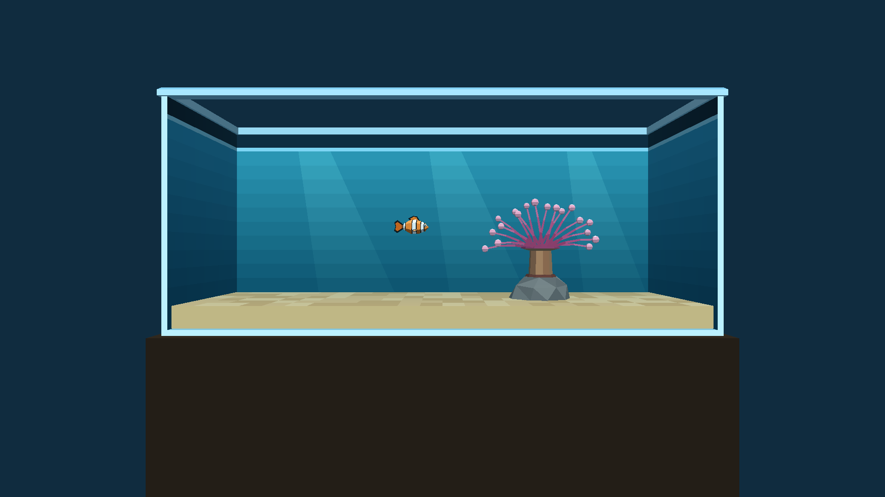

# Porting status: World Foundry on every platform

As of 2026‑10‑01 03:05 (+07) = 2026‑09‑30 20:05 UTC. Everything below was observed in a Codemagic build or a local
run on that day, and each claim links to its evidence. **—** means not assessed today, not "works". Legend: ✅ verified on the real
platform (real hardware, or real macOS/Linux), 🟡 partial or only in a simulator or emulator, ❌ not working, ⬜ not tested. Plan: [the aquarium on every platform](plans/2026-09-30-aquarium-platforms.md).

## Summary

| Platform | Builds | Runs | Draws the game | Input | On a real device |
|---|---|---|---|---|---|
| **Linux desktop** (OpenGL) | ✅ | ✅ | ✅ (the reference renderer) | ✅ keyboard, gamepad | ✅ (this machine) |
| **macOS desktop** (Metal) | ✅ [build 6abd3923](https://codemagic.io/app/6aafa6886ab3f21cf431a6cb/build/6abd3923a7c72c2289f7506c) | ✅ window, close paths, fullscreen | ✅ pixel-matches Linux | 🟡 keyboard ✅, ⌘Q ✅, red button ✅, Esc not provable in CI | ⬜ no Mac owned; Retina untested |
| **iOS, iPhone and iPad** (Metal) | ✅ ([build](https://codemagic.io/app/6aafa6886ab3f21cf431a6cb/build/6abd4a709ee70f86b0ffeff6)) | 🟡 installs, launches and stays alive in the iPhone and iPad simulators (no real device) | 🟡 the game and the aquarium, in both simulators (no real device) | ⬜ touch not implemented yet | ⬜ needs the $99 Apple account |
| **Android phone and tablet** (GLES 3) | ✅ [build 6abd1529](https://codemagic.io/app/6aafa6886ab3f21cf431a6cb/build/6abd1529669c35dd0f161d7a) (was broken 09‑21 to 09‑30, fixed) | 🟡 the aquarium app runs in an Android emulator on this PC (x86_64 with ARM translation, software graphics; no real phone) | 🟡 in the emulator | 🟡 the on-screen touch D-pad and A/B buttons are drawn; not exercised | ⬜ never on a real phone |
| **Chromecast with Google TV** (same APK) | ✅ aquarium app ([CI build 6abd1c20](https://codemagic.io/app/6aafa6886ab3f21cf431a6cb/build/6abd1c20874cdae673caf7ae); 32-bit `armeabi-v7a` added 2026‑10‑01); the condo app too ([CI build 6abd6b03](https://codemagic.io/app/6aafa6886ab3f21cf431a6cb/build/6abd6b038c57d072922d7cf7), 6.1 free Mac-minutes; green again on the resume-fix commit, [build 6abd6e96](https://codemagic.io/app/6aafa6886ab3f21cf431a6cb/build/6abd6e966215672186731fea)) | ✅ runs on a **real Chromecast HD**: alive after 30 s, no crashes; the **release APK presents at 60 frames per second** (125 consecutive frames at 17 ms, locked to the TV's refresh), the debug APK only about 2.5 | ✅ the aquarium and the condo (separate apps), on the TV | ✅ the remote's D-pad moves the fish; a gamepad is not tested | ✅ a real device (Chromecast HD, Amlogic S805X2, Android 14) |

## The aquarium on each platform

Scripted, deterministic frames (`--frame-step-smoke`, `-rate20`, frame 20 of a fixed run; no player input), not
real-time play. The same level file and the same flags on every platform.

| Linux, OpenGL (reference) | macOS, Metal (Codemagic) |
|---|---|
|  |  |
| The committed reference frame, byte-identical across three runs. | Rendered by Metal on a Codemagic Mac. **306 865 of 307 200 pixels are exact; the other 335 differ by one level, none beyond the tolerance of 3** ([macOS build](https://codemagic.io/app/6aafa6886ab3f21cf431a6cb/build/6abd3923a7c72c2289f7506c)). |

| macOS Metal, frame 100 | macOS Metal, frame 200 | macOS Metal, real window |
|---|---|---|
|  |  |  |
| Later in the same run: the anemone sways and the fish's pose changes. | Frame 200 of the same deterministic run. | Presented to a real `CAMetalLayer` window (`--windowed`) on the runner. |

| iOS simulator, iPhone 17 Pro | iOS simulator, iPad Pro 13‑inch |
|---|---|
|  |  |
| **The game now draws.** The bundled level 0 (Super Mario Bros. 1‑1). The framing is not tuned for a portrait phone. | Same on the iPad. The banner at the top is a Simulator system notification. Both are simulators, not real devices. Earlier today both screenshots were a solid blue fill. |

| Android and Chromecast: the app tile | What the TV will show (16:9) |
|---|---|
|  |  |
| The aquarium's Google TV launcher banner. The APK builds; no device has run it yet. | A Linux render at 1920×1080 (the TV's shape); the level was tuned for 4:3, and the whole tank still fits. **Not a Chromecast screenshot.** |

<!-- ios-aquarium-shots -->
| iOS Metal, **aquarium** on iPhone 17 Pro | iOS Metal, **aquarium** on iPad Pro 13‑inch |
|---|---|
|  |  |
| The aquarium-only `cd.iff` in the iOS simulator ([CI run](https://codemagic.io/app/6aafa6886ab3f21cf431a6cb/build/6abd4f31103ed7df74f88df3), scripted, no input). **Rotated 90°:** the level is landscape and the app is landscape-only, but the screenshot was taken with the simulator in portrait. | Same on the iPad: the landscape frame sits letterboxed inside the portrait screen. Simulator only, not a real device. |

| Android emulator, TV-shaped screen (1920×1080) |
|---|
|  |
| The aquarium app in an Android emulator on this PC: x86_64 image with ARM translation, software graphics, scripted launch, no input. The D-pad and A/B in the corners are the touch overlay. About 0.4 s per frame in this setup, which says nothing about a Chromecast. **Not a real device.** |

| Real Chromecast HD: the aquarium after 30 s | Same, after the remote's D-pad was held RIGHT, then UP |
|---|---|
|  |  |
| Screenshot taken on the device over adb (1920×1080). The debug APK draws at roughly 0.4 s per frame; the release APK presents at 60 fps (measured from SurfaceFlinger's real drawing layer). | **The fish moved right and up:** the engine log shows its position going from (−1.600, 2.400) to (−0.725, 2.526). |

| Real Chromecast HD: the condo after 45 s (release build) | Same, after the remote's D-pad was held RIGHT, then UP |
|---|---|
|  |  |
| The condo as its own app (`org.worldfoundry.wf_game.condo`, 2.4 MB `cd.iff`): **59.9 fps**, 126 frames at 16.7 ms, 61 MB total memory. Screenshot over adb, 1920×1080. | The camera and the player moved: the player's head and body are now in view, and the walls have shifted. Plan: [the condo on the Chromecast](plans/2026-10-01-condo-chromecast.md). |

## Details

### macOS (Metal): working
- CI `macos-desktop-debug` builds and links (Ninja, arm64, Jolt physics, Forth scripting), runs the headless frame-step smoke, and compares frames with Linux: snowgoons 306 702 of 307 200 exact, the aquarium 306 865 of 307 200, neither with any pixel beyond tolerance 3.
- A real window with a `CAMetalLayer` presents drawables on the runner; keyboard input works ([2026‑09‑21 VNC session](plans/2026-09-21-macos-human-verification.md)).
- **⌘Q and the red close button** quit cleanly (status 0) with real System Events input, and **`-fullscreen`** covers the display without changing its resolution ([close-paths step](plans/2026-09-21-macos-close-paths.md)).
- **Open:** Retina (the runner is scale 1.0), Esc delivery in CI (the VNC pass stands), double-click launch of the `.app`, the `cd.iff`-from-bundle path (CI uses `-L`), a real Mac.

### iOS (Metal): builds, links and draws in the simulators
- Today: from "configure fails" to "renders the game and the aquarium" in the iPhone 17 Pro and iPad Pro 13‑inch simulators ([CI run](https://codemagic.io/app/6aafa6886ab3f21cf431a6cb/build/6abd4a709ee70f86b0ffeff6), merged into `2026-new-level`). The fixes: Jolt extraction; the `MTLStorageModeManaged` iOS guard; three missing link symbols; the engine thread now presents its own frames (the display link only cleared the screen to blue and every triangle was dropped); iOS compiles the same GL-pipeline geometry files as macOS; audio is skipped on the **simulator only** (Apple's audio server never answers on the headless runner and the app is killed after 10 s; real devices are unchanged, `WF_IOS_SIM_AUDIO=1` turns it back on).
- The CI verdict: the app alive at 20 s and more than 50 colours in the centre of the screenshot, so a solid fill can no longer pass.
- **Open:** touch input and lifecycle (Phase 3), the landscape-only app shows rotated on an iPhone, a real device (Apple signing), audio on any iOS target.

### Android and Chromecast (GLES 3): builds and runs in an emulator
- The Android build had been **broken since 09‑21** (`GL_RGB5` is not in GLES 3.0; `backtrace()` needs API 33) and is fixed. Both apps (snowgoons and the aquarium, separate app ids) build in CI, on the free Mac machines.
- Codemagic's free Mac machines cannot run an Android emulator ([no nested virtualization](https://docs.codemagic.io/yaml-testing/testing/)), so the emulator run was done locally on this PC (KVM).
- **The Chromecast HD is 32-bit only** (`armeabi-v7a`, Amlogic S805X2 running Android 14), so the arm64-only APK could not even be installed: the Chromecast plan's assumption that the HD model takes arm64 was wrong (the 4K model is arm64). The APK now carries both ABIs.
- The first ever 32-bit run exposed a memory-pool alignment assertion (entry sizes had to be multiples of 8; a message entry is 20 bytes on 32-bit). The pool now rounds entry sizes up. On 64-bit nothing changes.
- The TV's screensaver starts after about 5 minutes idle and stops the app drawing, so device runs wake it first. Frame pace is read from SurfaceFlinger's drawing layer (the script's own probe used a wrong layer; fixed in the condo work).
- **The condo runs as a second real-Chromecast app.** It needs six `--vram-*` engine flags (a bigger texture budget) that the desktop launchers pass and Android did not, so the first run hit `AssertMsg: width = 1024, map.GetXSize()+1 = 257`. The condo app now ships them in `assets/wf_args.txt`, which `native_app_entry.cc` reads at startup (no file, no change: the aquarium and snowgoons are untouched, re-verified on the device at 59.9 fps). The level itself is fine.
- **Home then reopen crashed both apps, and is fixed.** The engine aborted (signal 6) about 120 ms after `APP_CMD_RESUME`: Android delivers the resume before the new window, and the game loop drew into no surface (GL error 1286, `display.cc:866`). `HALIsSuspended()` now also waits for the window; `android-device-run.sh --resume` tests it (condo and aquarium, real Chromecast: alive and drawing after Home and reopen).
- **Open:** a gamepad (the remote reaches only walk, strafe and hop in the condo; doors, teleport, orbit and zoom need one), audio (silent stub), and a real phone.

- The phone-shaped emulator also started the game and drew it (the tank frame and the touch overlay are visible), but its screenshot is covered by the emulator's own "System UI isn't responding" dialog, which software graphics under load can trigger, so it is not shown.

### Linux: the reference
- Builds, runs and renders everything; the aquarium has 38 passing tests and a demo video (`tests/recordings/aquarium_phase4_motion_demo.mp4`). Its committed frames are the references the other platforms are compared against, and a test re-renders them so they cannot go stale.

## Reproduce

- Drive Codemagic without an AI in the loop: `scripts/codemagic-queue.py --run macos-desktop-debug:2026-new-level`.
- Budget: 500 free Mac-minutes a month on M2 machines, one build at a time.
