<style>.card-grid { display: grid; grid-template-columns: repeat(2, 1fr); gap: 18px; margin: 20px 0; } .card { border: 1px solid #ccc; border-radius: 12px; padding: 16px; background: #fafafa; box-shadow: 0 2px 8px rgba(0,0,0,0.06); break-inside: avoid; page-break-inside: avoid; } .card h3 { margin: 0 0 8px 0; font-size: 1.25em; border-bottom: 2px solid #444; padding-bottom: 4px; } .card-img { display: block; margin: 8px auto; max-width: 220px; background: #888; border-radius: 6px; } .card-meta { font-size: 0.9em; margin: 6px 0; } .card-meta b { color: #222; } .card pre { font-size: 0.72em !important; background: #1e1e1e !important; color: #e0e0e0 !important; padding: 8px !important; border-radius: 6px !important; overflow-x: auto; line-height: 1.3; max-height: 320px; white-space: pre !important; } .card pre code { color: #e0e0e0 !important; background: transparent !important; } .swatch { display: inline-block; width: 14px; height: 14px; border: 1px solid #444; vertical-align: middle; margin-right: 3px; border-radius: 2px; } .mini-pyramid-grid { display: grid; grid-template-columns: repeat(4, 1fr); gap: 10px; margin: 16px 0; } .mini-pyramid-grid figure { margin: 0; text-align: center; font-size: 0.78em; } .mini-pyramid-grid img { width: 100%; border: 1px solid #999; border-radius: 4px; } .mini-pyramid-grid figcaption { margin-top: 3px; color: #444; } table.palette td:first-child, table.palette td:nth-child(2) { text-align: center; } table.palette td { font-family: monospace; font-size: 0.85em; }</style>

# Q✱bert Practice Level Catalogue

Generated 2026-05-17 from [`wflevels/qbert_practice/`](../../wflevels/qbert_practice/). Sources of truth: palette tables in [`gen_cube.py`](../../wflevels/qbert_practice/gen_cube.py); actor Forth scripts in [`blender_create_qbert.py`](../../wflevels/qbert_practice/blender_create_qbert.py). Mesh renders produced by [`render_cards.py`](catalogue/render_cards.py) running Blender headless on [`qbert_practice.blend`](../../wflevels/qbert_practice/qbert_practice.blend).

---

## 1. The pyramid

Twenty‑eight cubes in a 7‑row staircase (1+2+3+4+5+6+7 = 28). Geometry is one 2×2×2 cube replicated 28 times, defined once in [`gen_cube.py:42-82`](../../wflevels/qbert_practice/gen_cube.py). Each cube carries three material slots — **top** (state‑dependent, flips on hop), **lit** (constant per level), **shadow** (constant per level) — populated at runtime by the director script writing colours into per‑cube mailboxes.

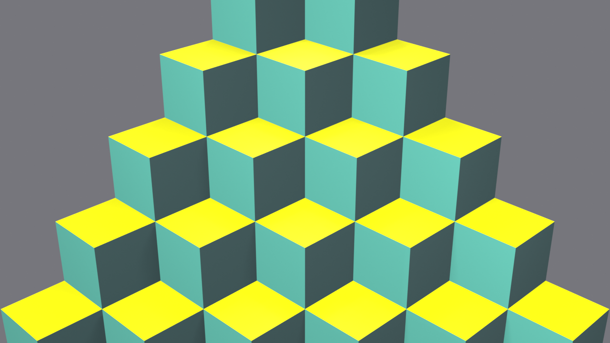

---

## 2. Round palette

Q✱bert has **4 levels × 4 rounds = 16 distinct palettes**. Sides change only on the level boundary; tops cycle each round. Levels 1 and 3 are *1‑hop* (state 0 → 2 directly); levels 2 and 4 are *2‑hop* (state 0 → 1 → 2). Two rounds (L2R4, L4R2) use flat black sides matching the arcade background.

### 2a. Swatch table

<table class="palette">
<thead><tr><th>Lvl</th><th>Rnd</th><th>Top (state 0 → 1 → 2)</th><th>Side lit</th><th>Side shadow</th><th>Notes</th></tr></thead>
<tbody>
<tr><td>1</td><td>1</td><td><span class="swatch" style="background:#5646EF;"></span>#5646EF → <span class="swatch" style="background:#DEDE00;"></span>#DEDE00 <i>(1‑hop)</i></td><td><span class="swatch" style="background:#56A999;"></span>#56A999</td><td><span class="swatch" style="background:#314646;"></span>#314646</td><td>purple → yellow</td></tr>
<tr><td>1</td><td>2</td><td><span class="swatch" style="background:#EFDE77;"></span>#EFDE77 → <span class="swatch" style="background:#0046DE;"></span>#0046DE <i>(1‑hop)</i></td><td><span class="swatch" style="background:#663100;"></span>#663100</td><td><span class="swatch" style="background:#FF7721;"></span>#FF7721</td><td>golden → blue</td></tr>
<tr><td>1</td><td>3</td><td><span class="swatch" style="background:#B9CECE;"></span>#B9CECE → <span class="swatch" style="background:#464646;"></span>#464646 <i>(1‑hop)</i></td><td><span class="swatch" style="background:#777777;"></span>#777777</td><td><span class="swatch" style="background:#212121;"></span>#212121</td><td>silver → dark‑gray</td></tr>
<tr><td>1</td><td>4</td><td><span class="swatch" style="background:#0066EF;"></span>#0066EF → <span class="swatch" style="background:#A9B910;"></span>#A9B910 <i>(1‑hop)</i></td><td><span class="swatch" style="background:#778888;"></span>#778888</td><td><span class="swatch" style="background:#101099;"></span>#101099</td><td>blue → olive</td></tr>
<tr><td>2</td><td>1</td><td><span class="swatch" style="background:#0046DE;"></span>#0046DE → <span class="swatch" style="background:#EFDE77;"></span>#EFDE77 → <span class="swatch" style="background:#21B931;"></span>#21B931</td><td><span class="swatch" style="background:#663100;"></span>#663100</td><td><span class="swatch" style="background:#FF7721;"></span>#FF7721</td><td>blue → gold → green</td></tr>
<tr><td>2</td><td>2</td><td><span class="swatch" style="background:#990066;"></span>#990066 → <span class="swatch" style="background:#0066EF;"></span>#0066EF → <span class="swatch" style="background:#A9B910;"></span>#A9B910</td><td><span class="swatch" style="background:#778888;"></span>#778888</td><td><span class="swatch" style="background:#101099;"></span>#101099</td><td>magenta → blue → olive</td></tr>
<tr><td>2</td><td>3</td><td><span class="swatch" style="background:#FF6666;"></span>#FF6666 → <span class="swatch" style="background:#5646EF;"></span>#5646EF → <span class="swatch" style="background:#DEDE00;"></span>#DEDE00</td><td><span class="swatch" style="background:#56A999;"></span>#56A999</td><td><span class="swatch" style="background:#314646;"></span>#314646</td><td>red → purple → yellow</td></tr>
<tr><td>2</td><td>4</td><td><span class="swatch" style="background:#CECE00;"></span>#CECE00 → <span class="swatch" style="background:#0046EF;"></span>#0046EF → <span class="swatch" style="background:#FF6666;"></span>#FF6666</td><td><span class="swatch" style="background:#000000;"></span>#000000</td><td><span class="swatch" style="background:#000000;"></span>#000000</td><td>flat black sides</td></tr>
<tr><td>3</td><td>1</td><td><span class="swatch" style="background:#2188CE;"></span>#2188CE → <span class="swatch" style="background:#003199;"></span>#003199 <i>(1‑hop)</i></td><td><span class="swatch" style="background:#B9B921;"></span>#B9B921</td><td><span class="swatch" style="background:#EF1021;"></span>#EF1021</td><td>blue → dark‑blue</td></tr>
<tr><td>3</td><td>2</td><td><span class="swatch" style="background:#464646;"></span>#464646 → <span class="swatch" style="background:#B9CECE;"></span>#B9CECE <i>(1‑hop)</i></td><td><span class="swatch" style="background:#777777;"></span>#777777</td><td><span class="swatch" style="background:#212121;"></span>#212121</td><td>dark‑gray → light‑gray</td></tr>
<tr><td>3</td><td>3</td><td><span class="swatch" style="background:#0046DE;"></span>#0046DE → <span class="swatch" style="background:#EFDE77;"></span>#EFDE77 <i>(1‑hop)</i></td><td><span class="swatch" style="background:#663100;"></span>#663100</td><td><span class="swatch" style="background:#FF7721;"></span>#FF7721</td><td>blue → golden</td></tr>
<tr><td>3</td><td>4</td><td><span class="swatch" style="background:#DEDE00;"></span>#DEDE00 → <span class="swatch" style="background:#5646EF;"></span>#5646EF <i>(1‑hop)</i></td><td><span class="swatch" style="background:#56A999;"></span>#56A999</td><td><span class="swatch" style="background:#314646;"></span>#314646</td><td>yellow → purple</td></tr>
<tr><td>4</td><td>1</td><td><span class="swatch" style="background:#21B931;"></span>#21B931 → <span class="swatch" style="background:#EFDE77;"></span>#EFDE77 → <span class="swatch" style="background:#0046DE;"></span>#0046DE</td><td><span class="swatch" style="background:#56A999;"></span>#56A999</td><td><span class="swatch" style="background:#314646;"></span>#314646</td><td>green → gold → blue</td></tr>
<tr><td>4</td><td>2</td><td><span class="swatch" style="background:#0046EF;"></span>#0046EF → <span class="swatch" style="background:#FF6666;"></span>#FF6666 → <span class="swatch" style="background:#CECE00;"></span>#CECE00</td><td><span class="swatch" style="background:#000000;"></span>#000000</td><td><span class="swatch" style="background:#000000;"></span>#000000</td><td>flat black sides</td></tr>
<tr><td>4</td><td>3</td><td><span class="swatch" style="background:#DEDE00;"></span>#DEDE00 → <span class="swatch" style="background:#FF6666;"></span>#FF6666 → <span class="swatch" style="background:#5646EF;"></span>#5646EF</td><td><span class="swatch" style="background:#56A999;"></span>#56A999</td><td><span class="swatch" style="background:#314646;"></span>#314646</td><td>yellow → red → purple</td></tr>
<tr><td>4</td><td>4</td><td><span class="swatch" style="background:#990066;"></span>#990066 → <span class="swatch" style="background:#0066EF;"></span>#0066EF → <span class="swatch" style="background:#A9B910;"></span>#A9B910</td><td><span class="swatch" style="background:#778888;"></span>#778888</td><td><span class="swatch" style="background:#101099;"></span>#101099</td><td>magenta → blue → olive</td></tr>
</tbody>
</table>

### 2b. 4 × 4 pyramid grid

Each cell shows the full pyramid rendered with that round's final (state‑2) top colour and per‑round side colours. Rows = level (top→bottom L1→L4); columns = round within the level.

<div class="mini-pyramid-grid">
<figure>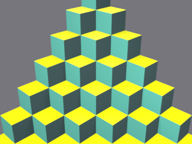<figcaption>L1 R1</figcaption></figure>
<figure>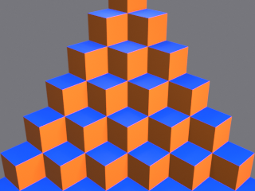<figcaption>L1 R2</figcaption></figure>
<figure>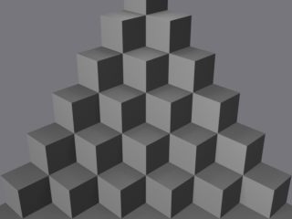<figcaption>L1 R3</figcaption></figure>
<figure>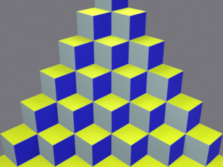<figcaption>L1 R4</figcaption></figure>
<figure>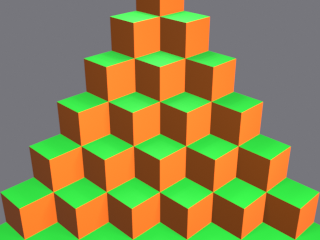<figcaption>L2 R1</figcaption></figure>
<figure><figcaption>L2 R2</figcaption></figure>
<figure><figcaption>L2 R3</figcaption></figure>
<figure>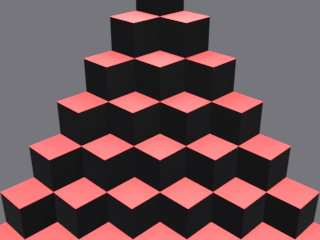<figcaption>L2 R4</figcaption></figure>
<figure>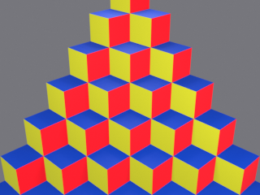<figcaption>L3 R1</figcaption></figure>
<figure>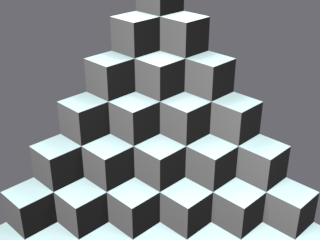<figcaption>L3 R2</figcaption></figure>
<figure>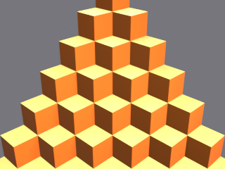<figcaption>L3 R3</figcaption></figure>
<figure>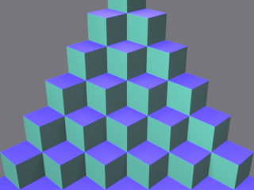<figcaption>L3 R4</figcaption></figure>
<figure>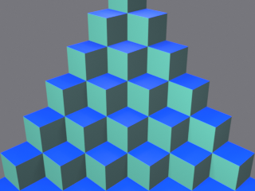<figcaption>L4 R1</figcaption></figure>
<figure>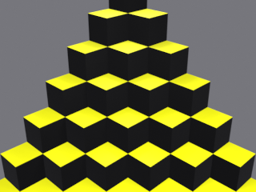<figcaption>L4 R2</figcaption></figure>
<figure><figcaption>L4 R3</figcaption></figure>
<figure><figcaption>L4 R4</figcaption></figure>
</div>

---

## 3. Enemies & player

Ten characters live on the pyramid. Each card shows the Blender render of its mesh, the points it earns (or denies), a representative excerpt of its Forth tick script, and behavioural notes. Spawn schedule is per‑round and driven by the shared timer (mb 597); see [`docs/qbert/plans/2026-05-16-qbert-spawn-sequencer.md`](plans/2026-05-16-qbert-spawn-sequencer.md) for the per‑round sequences.

<div class="card-grid">

<div class="card">
<h3>Q✱bert (player)</h3>
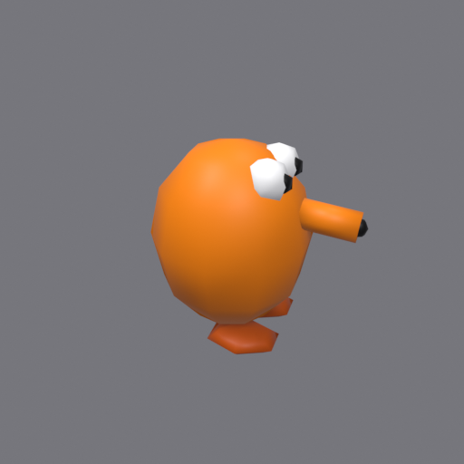
<p class="card-meta"><b>Points:</b> none directly — score is earned by transitioning cubes (+25 per state change), catching green balls (+100), surviving Slick/Sam (+300 if captured), luring Coily off a disc (+500), and round‑completion bonuses (+1000).</p>
<p class="card-meta"><b>Mesh:</b> <code>player.iff</code> &nbsp;|&nbsp; <b>Script:</b> <a href="../../wflevels/qbert_practice/blender_create_qbert.py">blender_create_qbert.py:532</a> (<code>\ wf qbert player</code>, ~150 lines)</p>
<p class="card-meta"><b>Notes:</b> Hop arc, on‑edge fall trigger, restart on game‑over, apex respawn on round clear, doom‑stick yaw lerp (mb 433 ↔ 3014). Owns cube collision detection at landing tick.</p>
```forth
\ wf qbert player
: stick INDEXOF_HARDWARE_JOYSTICK1_RAW read-mailbox ;
: cd 402 read-mailbox ;
: tick-cd cd dup 0 > if 1 - 402 write-mailbox else drop then ;
: do-hop
  over over
  dup 0 = if drop 0 < if 0.125 else 0.625 then
           else swap drop 0 > if 0.875 else 0.375 then then
  433 write-mailbox             ( target yaw in rev )
  INDEXOF_X_POS read-mailbox 435 write-mailbox   ( HOP_START_X )
  INDEXOF_Y_POS read-mailbox 436 write-mailbox
  INDEXOF_Z_POS read-mailbox 437 write-mailbox
  401 read-mailbox + swap 400 read-mailbox +
  dup 400 write-mailbox over 401 write-mailbox
  6 swap - 2 * 1 + 2 + 438 write-mailbox          ( HOP_END_Z )
  drop 13 402 write-mailbox                       ( arm cooldown )
  ...
;
```
</div>

<div class="card">
<h3>Red Ball</h3>
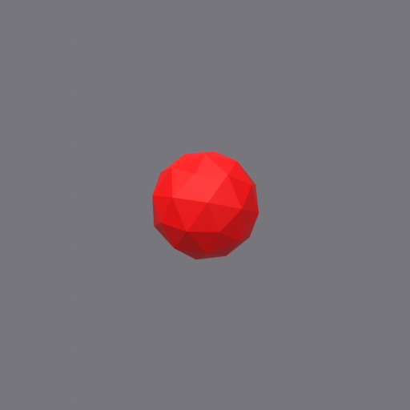
<p class="card-meta"><b>Points:</b> 0 — kills Q✱bert on contact.</p>
<p class="card-meta"><b>Mesh:</b> <code>redball.iff</code> (icosphere subdiv 1: 42 verts / 80 faces) &nbsp;|&nbsp; <b>Script:</b> <a href="../../wflevels/qbert_practice/blender_create_qbert.py">blender_create_qbert.py:1359</a> (<code>\ wf redball 0/1/2</code>, 3 instances)</p>
<p class="card-meta"><b>Notes:</b> Descends from apex via LFSR random direction (left/right child each hop). Smoothstep position lerp, parabolic Z arc, mild stretch‑and‑squash. Retires off pyramid (row &gt; 6).</p>
```forth
\ wf redball 0
( freeze gate, idle gate )
GB_FREEZE read-mailbox 0 > if exit then
phase read-mailbox 0 = if exit then
( decrement cooldown, compute t' )
cd read-mailbox 1 - dup cd write-mailbox
HOP_TICKS swap - DENOM /
dup dup dup * swap 2.0 * 3.0 swap - *   ( smoothstep keeps t_raw )
( row_now, col_now, x/y/z lerp )
dup row read-mailbox from_row read-mailbox - * from_row read-mailbox +
over col read-mailbox from_col read-mailbox - * from_col read-mailbox +
over 6.0 swap - Y_MUL * 3010 write-mailbox
swap 0.5 * - X_MUL * 3009 write-mailbox
end_z read-mailbox start_z read-mailbox - * start_z read-mailbox +
swap dup 1.0 swap - * 8.0 * +    ( parabolic arc bonus )
3011 write-mailbox
( contact check vs player row/col -> kill )
( landing tick -> LFSR pick next direction, re-arm cooldown )
```
</div>

<div class="card">
<h3>Green Ball</h3>
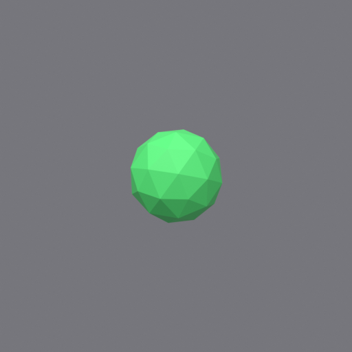
<p class="card-meta"><b>Points:</b> +100 on touch.</p>
<p class="card-meta"><b>Mesh:</b> <code>greenball.iff</code> (icosphere, green material) &nbsp;|&nbsp; <b>Script:</b> shares the redball template at <a href="../../wflevels/qbert_practice/blender_create_qbert.py">blender_create_qbert.py:1359</a>, variant <code>green</code></p>
<p class="card-meta"><b>Notes:</b> Same descent pattern as a red ball, but contact <i>helps</i> the player — sets <code>GB_FREEZE_TIMER</code> non‑zero so every other enemy script's early <code>exit</code> guard fires, halting them for the freeze duration. Spawns the +100 popup.</p>
```forth
\ wf greenball 0
( same descent template as redball,
  with contact_action = freeze + popup_100 instead of kill )

GB_FREEZE read-mailbox 0 > if exit then
phase read-mailbox 0 = if exit then
( ... lerp/arc identical to redball ... )
( contact check )
row read-mailbox 400 read-mailbox = if
  col read-mailbox 401 read-mailbox = if
    GB_FREEZE_TICKS GB_FREEZE write-mailbox
    100 POPUP_VALUE write-mailbox
    1 POPUP_TRIGGER write-mailbox
  then then
```
</div>

<div class="card">
<h3>Coily — egg</h3>
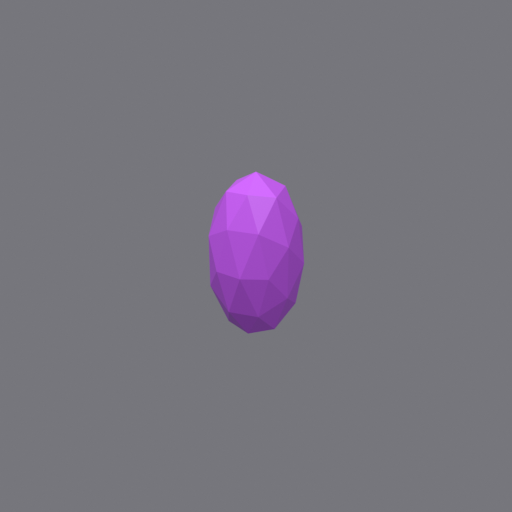
<p class="card-meta"><b>Points:</b> 0 — uncatchable while in egg form; becomes snake at bottom row.</p>
<p class="card-meta"><b>Mesh:</b> <code>coily_egg_mesh.iff</code> (elongated icosphere, 0.72 × 0.72 × 1.30) &nbsp;|&nbsp; <b>Script:</b> <a href="../../wflevels/qbert_practice/blender_create_qbert.py">blender_create_qbert.py:1911</a> (<code>\ wf coily egg (Phase A)</code>)</p>
<p class="card-meta"><b>Notes:</b> Bounces randomly down pyramid like a red ball. Alternates purple/red flash every <code>COILY_EGG_FLASH_HALF</code> ticks (arcade tell). On row &gt; 6 transitions to PHASE_GLOBAL=2, parking egg and waking the snake at the egg's last on‑pyramid cube.</p>
```forth
\ wf coily egg (Phase A)
GB_FREEZE read-mailbox 0 > if exit then
phase read-mailbox 0 = if exit then
( flash purple/red )
FLASH_TICK read-mailbox 1 + FLASH_PERIOD % FLASH_TICK write-mailbox
FLASH_TICK read-mailbox FLASH_HALF < if
  0x5646EF 3037 write-mailbox  ( purple )
else
  0xEF1021 3037 write-mailbox  ( red )
then
( ... hop arc identical to redball ... )
( landing off-pyramid: transform into snake )
row read-mailbox 6 > if
  0 phase write-mailbox
  2 COILY_PHASE_GLOBAL write-mailbox
  0 COILY_EGG_ACTIVE write-mailbox
  1 COILY_SNAKE_ACTIVE write-mailbox
  PARK_Z 3011 write-mailbox
  exit
then
```
</div>

<div class="card">
<h3>Coily — egg #2 (L4)</h3>

<p class="card-meta"><b>Points:</b> 0 — second egg only spawns on L4 rounds.</p>
<p class="card-meta"><b>Mesh:</b> <code>coily_egg_2_mesh.iff</code> (identical to egg #1) &nbsp;|&nbsp; <b>Script:</b> <a href="../../wflevels/qbert_practice/blender_create_qbert.py">blender_create_qbert.py:2007</a> (<code>\ wf coily egg 2 (L4)</code>)</p>
<p class="card-meta"><b>Notes:</b> Same script as egg #1 with its own mailbox set (575–582). Off‑pyramid handler is the cooperative one: if the snake isn't already active, copies its FROM coords into egg #1's slots so the existing director Phase‑B handler places the snake correctly.</p>
```forth
\ wf coily egg 2 (L4)
( same bounce + flash logic as egg 1 )
( off-pyramid handoff: if snake not yet active, donate position )
row read-mailbox 6 > if
  0 phase write-mailbox
  COILY_PHASE_GLOBAL read-mailbox 2 <> if
    from_row read-mailbox CE_FROM_ROW write-mailbox
    from_col read-mailbox CE_FROM_COL write-mailbox
    2 COILY_PHASE_GLOBAL write-mailbox
    0 COILY_EGG2_ACTIVE write-mailbox
    1 COILY_SNAKE_ACTIVE write-mailbox
  else
    0 COILY_EGG2_ACTIVE write-mailbox
  then
  PARK_Z 3011 write-mailbox
  exit
then
```
</div>

<div class="card">
<h3>Coily — snake</h3>
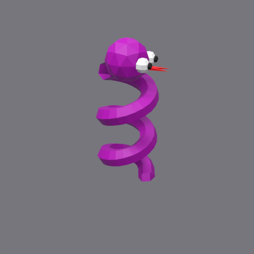
<p class="card-meta"><b>Points:</b> +500 when lured off a disc; 0 otherwise (kills Q✱bert on contact).</p>
<p class="card-meta"><b>Mesh:</b> <code>coily_snake_mesh.iff</code> (bezier spiral, head, eyes, pupils, forked tongue) &nbsp;|&nbsp; <b>Script:</b> <a href="../../wflevels/qbert_practice/blender_create_qbert.py">blender_create_qbert.py:2334</a> (<code>\ wf coily snake (Phase C — chase)</code>)</p>
<p class="card-meta"><b>Notes:</b> Greedy chase: each landing tick picks dRow toward player; dCol from player.col vs snake.col. Asymmetric stretch‑and‑squash (3× apex Z over player). Disc fast‑path allows landing on (1,−1) or (1,2) to retire with +500.</p>
```forth
\ wf coily snake (Phase C -- chase)
GB_FREEZE read-mailbox 0 > if exit then
phase read-mailbox 0 = if exit then
( cooldown, smoothstep, arc -- same as redball )
...
( landing tick: disc-lure retirement -> +500 )
cd read-mailbox 0 <= if
  row read-mailbox 1 = if
    col read-mailbox -1 = if      ( left disc )
      0 COILY_PHASE_GLOBAL write-mailbox
      ( ...park snake, queue +500 popup at player XYZ... )
      500 POPUP_VALUE write-mailbox
      500 70 read-mailbox + 70 write-mailbox
      exit then
    col read-mailbox 2 = if       ( right disc )
      ( same as left, +500 )
      exit then
  then
  ( greedy chase: pick dr,dc toward player )
  qb_row cy_row - 0 < if -1 else 1 then          ( dr_sign )
  dup 0 > if qb_col cy_col - 0 > if 1 else 0 then
        else qb_col cy_col - 0 < if -1 else 0 then then
  ( commit if on-pyramid OR on disc coords; otherwise stay put )
then
```
</div>

<div class="card">
<h3>Slick</h3>
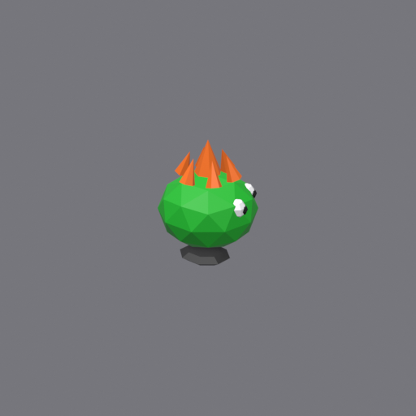
<p class="card-meta"><b>Points:</b> +300 if caught (touched by Q✱bert).</p>
<p class="card-meta"><b>Mesh:</b> <code>slick_mesh.iff</code> (purple‑pink slider with antennae) &nbsp;|&nbsp; <b>Script:</b> <a href="../../wflevels/qbert_practice/blender_create_qbert.py">blender_create_qbert.py:1359</a>, variant <code>slick</code></p>
<p class="card-meta"><b>Notes:</b> Descends like a red ball, but on each landing reverts that cube's state by one (undoes Q✱bert's progress). First appears at R2 (L1R3). Contact transfers control: caught with bonus, not killed.</p>
```forth
\ wf slickball 0
( same descent template as redball )
( landing tick: revert cube state before picking next hop )
cd read-mailbox 0 <= if
  ...
  ( cube_revert_block: cube_state[row*7+col] -= 1, min 0 )
  row read-mailbox 7 * col read-mailbox + 200 + dup
  read-mailbox 1 - dup 0 < if drop 0 then swap write-mailbox
  ...
then
```
</div>

<div class="card">
<h3>Sam</h3>
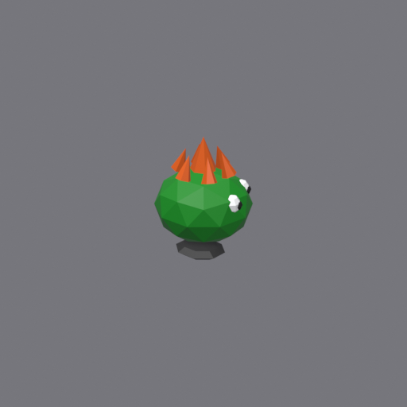
<p class="card-meta"><b>Points:</b> +300 if caught (touched by Q✱bert).</p>
<p class="card-meta"><b>Mesh:</b> <code>sam_mesh.iff</code> (yellow slider) &nbsp;|&nbsp; <b>Script:</b> <a href="../../wflevels/qbert_practice/blender_create_qbert.py">blender_create_qbert.py:1359</a>, variant <code>sam</code></p>
<p class="card-meta"><b>Notes:</b> Identical behaviour to Slick — descends, reverts cubes, can be caught for +300. Distinguished only by colour. Spawn weight differs per round in the sequencer table.</p>
```forth
\ wf samball 0
( identical descent + cube_revert_block as slick;
  only colour and mailbox indices differ )
```
</div>

<div class="card">
<h3>Ugg</h3>
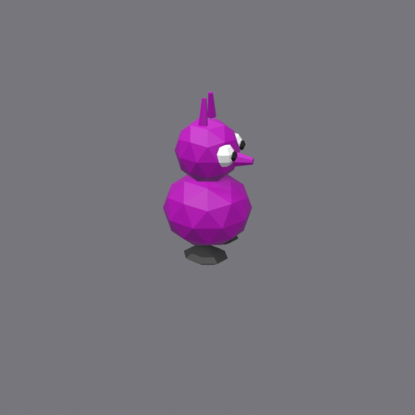
<p class="card-meta"><b>Points:</b> 0 — kills Q✱bert on contact.</p>
<p class="card-meta"><b>Mesh:</b> <code>ugg_mesh.iff</code> (orange climber) &nbsp;|&nbsp; <b>Script:</b> <a href="../../wflevels/qbert_practice/blender_create_qbert.py">blender_create_qbert.py:1359</a>, variant <code>ugg</code></p>
<p class="card-meta"><b>Notes:</b> Climbs <i>up</i> from a bottom edge — variant‑specific <code>direction_block</code> decrements ROW each hop. Retires when ROW &lt; 0. First spawns L2R1.</p>
```forth
\ wf uggball 0
( same lerp/arc as redball; direction_block differs )
( landing tick )
cd read-mailbox 0 <= if
  ( retire_check: ROW < 0 )
  row read-mailbox 0 < if
    0 phase write-mailbox 0 active write-mailbox
    PARK_Z 3011 write-mailbox exit
  then
  ( LFSR pick + climb: row -= 1 )
  row read-mailbox dup from_row write-mailbox 1 - row write-mailbox
  col read-mailbox dup from_col write-mailbox
  swap if 1 + then col write-mailbox
  HOP_TICKS cd write-mailbox
then
```
</div>

<div class="card">
<h3>Wrongway</h3>

<p class="card-meta"><b>Points:</b> 0 — kills Q✱bert on contact.</p>
<p class="card-meta"><b>Mesh:</b> <code>wrongway_mesh.iff</code> (purple climber with twin antennae) &nbsp;|&nbsp; <b>Script:</b> <a href="../../wflevels/qbert_practice/blender_create_qbert.py">blender_create_qbert.py:1359</a>, variant <code>wrongway</code></p>
<p class="card-meta"><b>Notes:</b> Climbs up the left edge in a strict pattern — <code>direction_block</code> stashes FROM, decrements ROW, holds COL = 0. No LFSR randomness (paired with Ugg, who can wander).</p>
```forth
\ wf wrongwayball 0
( same lerp/arc as redball; direction_block is deterministic )
cd read-mailbox 0 <= if
  ( retire_check: ROW < 0 )
  row read-mailbox 0 < if ... exit then
  ( deterministic ascent: row -= 1, col stays 0 )
  row read-mailbox dup from_row write-mailbox 1 - row write-mailbox
  col read-mailbox from_col write-mailbox
  HOP_TICKS cd write-mailbox
then
```
</div>

</div>

---

## 4. Other scripted objects

Objects with non‑trivial behaviour but no "card" treatment. Director script body is too long to inline (~40 KB compiled Forth); follow the source link.

| Name | Script | Additional notes |
|------|--------|------------------|
| **Director** (`Actboxor01`) | [`blender_create_qbert.py:2967`](../../wflevels/qbert_practice/blender_create_qbert.py) — `\ wf qbert director MVP` | Master sequencer. Owns: palette setup (mb 256–303, writes ROUND_TOP_COLORS and side colours into per‑cube material mailboxes); spawn timer (mb 597) using per‑round reload table (200/160/136/176 ticks for L1; see [`docs/qbert/plans/2026-05-16-qbert-spawn-sequencer.md`](plans/2026-05-16-qbert-spawn-sequencer.md)); round progression (mb 425); collision dispatch; popup spawn (mb 593/594); +1000 round‑clear bonus (`70 read-mailbox 1000 + 70 write-mailbox`); level transitions and round‑0 reset. |
| **Disc — left**  (`disc_left`)  | [`blender_create_qbert.py:2599`](../../wflevels/qbert_practice/blender_create_qbert.py) — `\ wf disc` | Sits at (row=1, col=−1). Spins via `DISC_SPIN_RATE 3034 write-mailbox` (yaw delta per tick). If player's (row,col) match disc's: clear FALL_PHASE, set mb 426 = 1 (apex respawn), self‑consume (PHASE = 0, park at Z = −30). Arms flash ring countdown (`FLASH_DURATION → mb 536`). |
| **Disc — right** (`disc_right`) | same script, parameterised at right disc coords | Same as left but at (row=1, col=2) with mb 535 / mb 537. |
| **Disc flash ring L/R** | *(no script)* | Yellow washer mesh; visibility driven by flash countdown mailbox (mb 536 / 537). Pulses for ~8 frames after disc consumed. |
| **Curse bubble** (`curse_bubble`) | *(no script)* | Speech‑bubble oval with rendered "@!#?@!" texture. Player script writes the bubble's XYZ each tick of `FALL_PHASE` (1–29); parks at Z = −100 on respawn. Texture generated by [`_generate_curse_bubble_texture`](../../wflevels/qbert_practice/blender_create_qbert.py) at build time. |
| **Popup 25 / 50 / 100 / 300 / 500** | *(no script)* | Floating score numbers. Director writes value to `POPUP_VALUE_MB` (593) and visibility to per‑actor mb on trigger; the actor itself is render‑only. Sources: [`docs/qbert/plans/2026-05-15-qbert-bonus-popups.md`](plans/2026-05-15-qbert-bonus-popups.md). |

---

## Reproducing this catalogue

```sh
# 1. (Re-)render PNGs from the .blend
blender --background wflevels/qbert_practice/qbert_practice.blend \
        --python docs/qbert/catalogue/render_cards.py

# 2. Build a self-contained HTML (with images base64-embedded)
task md -- docs/qbert/catalogue.md
# → opens ~/tmp/catalogue.html in the browser; Print → "Save as PDF"
```

Palette tables come from [`gen_cube.py`](../../wflevels/qbert_practice/gen_cube.py) (`ROUND_TOP_COLORS`, `LEVEL_SIDE_COLORS`, `ROUND_SIDE_OVERRIDES`). To refresh after palette edits: re‑run step 1. Actor renders use the meshes embedded in [`qbert_practice.blend`](../../wflevels/qbert_practice/qbert_practice.blend); to refresh after mesh edits: re‑export the .blend via [`blender_create_qbert.py`](../../wflevels/qbert_practice/blender_create_qbert.py), then re‑run step 1.
