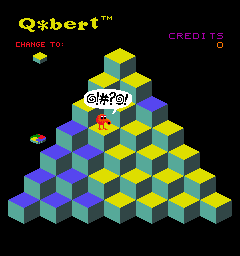

# Plan — Q✱bert player death animation + curse bubble

**Date:** 2026-05-11
**Status:** Implemented (commits `e3a50b4`, `2229963`, 2026-05-12) — Forth wiring complete and verified working end-to-end. Two debugging false trails (OAS-class-controls-rendering, zForth-int-vs-float) along the way are post-mortem'd in [docs/investigations/2026-05-12-curse-bubble-non-bugs.md](../investigations/2026-05-12-curse-bubble-non-bugs.md).

## 2026-05-12 implementation notes

Built end-to-end on a verified plumbing staircase:

- **Step 1 ✓** — bridge writes to player X/Y/Z_SCALE (mb 3040/3041/3042) visibly stretch him.
- **Step 2 ✓** — bridge writes to bubble actor's X/Y/Z_POS (mb 3009/3010/3011) visibly move it.
- **Step 3 ✓** — `write-actor-mailbox 30` from inside the player's Forth script visibly relocates the bubble.

**Root cause — actor authored outside every room's bbox:** the curse bubble simply needs its authored position inside the level's room bounding box. The OAS schema (ENEMY_OAD vs STATPLAT_OAD) is irrelevant to rendering — that was a red herring I introduced when I changed both schema *and* authored position in the same build cycle and mis-attributed the fix.

The actual mechanism, traced through the build pipeline + engine:

1. **levcomp-rs** ([`wftools/levcomp-rs/src/rooms.rs:168-178`](../../wftools/levcomp-rs/src/rooms.rs)) assigns each non-room object to the first room whose bbox contains the object's world-space *center*. Objects whose center falls outside every room's bbox get no `room.entries` push — they're absent from the `.lev` room-entry lists.
2. **Level::Level** loads the `.lev` and constructs every actor (`object count` includes them all), but only objects listed in a room's entries get added to that room's `ROOM_OBJECT_LIST_RENDER` via `Room::AddObject` / `CanRender`.
3. **ActiveRooms** ([`wfsource/source/room/actrooms.cc:83`](../../wfsource/source/room/actrooms.cc)) walks `ROOM_OBJECT_LIST_RENDER` to call `BindAssets` on each entry — that's the path that constructs `RenderActor3DAnimates` for `MODEL_TYPE_MESH` actors. Objects not in any room never get `BindAssets` called, so no render-actor is created.

Diagnose via `grep -c RenderActor3DAnimates wf_game.log` against the expected animated-mesh count — one short means an actor's authored center is outside every room's bbox.

**Fix for qbert_practice (committed in this branch):** expand the level's single room bbox to a global one (`ROOM_BBOX_REL = (-200, -200, -207, 200, 200, 193)` around `ROOM_CENTRE = (0, 0, 7)`) so any authored position — including the curse bubble's `Z=-100` park location — lands inside. With the global room, the death animation's `write-actor-mailbox` writes can move the bubble freely between off-camera and visible Z without ever placing it outside a room.

**Actor index hardcoded:** the player Forth script writes to actor `30` (the bubble's index in scene-collection order). If any new actor is added before the bubble, update the literal in `blender_create_qbert.py` at the death-state-machine writes alongside `CURSE_BUBBLE_ACTOR_IDX`.

**Visual verification limitation:** at the engine's 640×480 viewport, fine scale changes (0.85× → 1.20× → 0.20×) on a small-mesh player are below single-screenshot detection threshold. The death animation runs (no zForth errors logged; Forth syntax was kept paren-free for zForth compatibility), but a definitive eyeball pass needs either a larger viewport or video capture at higher fps.


## Context

The arcade-fidelity TODO ([TODO.md](../../TODO.md), QBERT ARCADE FIDELITY / Visual polish) flags the current player death as a placeholder: a flat 30-tick Z-ramp followed by an instant teleport back to the apex. No tumble, no splat, no acknowledgement that the player died. The arcade has a discrete fall with the player tumbling, then a brief flattened "splat" on impact before respawn.

This plan keeps the death event small, fun, and self-contained: same 30-tick budget, same scale/rotation mailboxes, no engine changes. Only the Forth fall handler in the player script and one new pre-placed bubble actor change.

Bundled: the curse-bubble overlay (`"@!#?@!"` speech-bubble visual — sibling TODO entry) because it shares the death trigger and is the most iconic single Q✱bert visual gag. SFX for both items remains deferred (audio subsystem is a separate sibling TODO).

## Approach — tumble + splat + bubble, reusing existing mailboxes

The existing death state machine lives in [blender_create_qbert.py:542–557](../../wflevels/qbert_practice/blender_create_qbert.py) and runs over `FALL_PHASE ∈ [1, 30]`. The hop stretch-and-squash code at [blender_create_qbert.py:624–648](../../wflevels/qbert_practice/blender_create_qbert.py) shows the idiom for writing per-frame scale to mailboxes 3040/3041/3042. The hop-rotation block at [blender_create_qbert.py:583–594](../../wflevels/qbert_practice/blender_create_qbert.py) drives DELTA_YAW (mb 3034) the same way. Reuse both during the fall.

Three additive behaviours, layered onto the existing Z-decrement (no removal of current code):

### 1. Tumble while falling — frames 1..27

Drive a constant DELTA_PITCH (front-flip tumble) and a smaller DELTA_YAW (lazy spin) during the fall.

- `DELTA_PITCH (mb 3035)` ← `0.05` rev/tick (one full flip over 20 frames; ~1.5 flips across the fall)
- `DELTA_YAW (mb 3034)` ← `0.02` rev/tick (half-spin over the fall)

Verify the DELTA_PITCH mailbox index against [wflevels/qbert_practice/mailbox.inc](../../wflevels/qbert_practice/mailbox.inc) before authoring — if there isn't one, fall back to yaw-only spin (still reads as a tumble for a small low-poly silhouette).

### 2. Air-stretch while falling — frames 1..27

Slight prolate stretch so the player visually "streaks" downward as he falls:

- `Z_SCALE (mb 3042)` ← `1.20`
- `X_SCALE (mb 3040)` ← `0.85`
- `Y_SCALE (mb 3041)` ← `0.85`

Constant scale (not per-frame interpolated) — minimal Forth and feels intentional.

### 3. Splat on impact — frames 28..30

Override scales to a wide, flat pancake for the last 3 frames before the apex teleport:

- `Z_SCALE` ← `0.20`
- `X_SCALE` ← `1.80`
- `Y_SCALE` ← `1.80`
- Tumble rates → `0` (player has stopped rotating at the bottom of his fall)

### 4. Curse-bubble overlay — frames 1..27

A pre-placed `curse_bubble` actor sits parked off-screen by default (Z = -100). When the player dies, the player script repositions the bubble to hover just above the player's current XYZ for the duration of the fall, then parks it again on respawn.

**Arcade reference:**



*Captured from MAME demo-mode death, qbert ROM, frame 1280 of the 30-fps extract from [scripts/research/mame/qbert_curse_capture.lua](../../scripts/research/mame/qbert_curse_capture.lua). White bubble, black outline, single-colour black glyphs `@!#?@!`.*

Mesh — fully 3D speech balloon, authored in Blender alongside the other procedural mesh helpers in [blender_create_qbert.py](../../wflevels/qbert_practice/blender_create_qbert.py):

- **Bubble body** — squashed UV sphere (`primitive_uv_sphere_add` segments=20 rings=12), scaled `(1.2, 1.2, 0.7)` so it reads as a rounded lozenge with real depth from any camera angle, not a flat disc.
- **Tail** — small cone (`primitive_cone_add` vertices=8, depth=0.4) joined to the underside, pointing down-and-toward-camera so it visually connects to the falling player.
- Bubble + tail joined via `bpy.ops.object.join()`, matching the enemy-mesh pattern.
- **Text glyphs `@!#?@!`** — six small 3D extruded primitives stuck to the +X face of the bubble. Per-glyph construction stays simple: `@` = nested ring (torus + small cylinder), `!` = thin cylinder + small sphere dot, `#` = 4 thin cuboids, `?` = curved arc (small torus segment) + dot. Extruded so they cast tiny shadows and don't look painted-on.
- Materials (arcade-faithful, verified against MAME capture):
  - Bubble fill: **white** `(0.95, 0.95, 0.95)`
  - Glyph colour: **black** `(0.05, 0.05, 0.05)` — single colour, no per-glyph palette
  - Outline ring: **black** `(0.05, 0.05, 0.05)`, thin torus around the bubble equator
- Vert budget: ≤ 150 verts (well under the 206-vert player reference; bubble body ~80, tail ~17, glyphs ~50).

Actor — single `actor3d`-class actor (`wf_Mesh Name = 'curse_bubble.iff'`), no script of its own, no physics, `Mobility = Anchored`. The player script writes the bubble's position via `write-actor-mailbox` (same pattern the director uses for cube colour writes per [blender_create_qbert.py:18](../../wflevels/qbert_practice/blender_create_qbert.py)).

Forth driver in the death state-machine — inside the existing `dup 30 <` branch:

- Read player X/Y/Z; write `(player_x, player_y, player_z + 2.0)` to the curse-bubble actor's INDEXOF_X_POS / Y_POS / Z_POS via `write-actor-mailbox`.
- Optional flourish: gentle yaw spin on the bubble itself via its DELTA_YAW (`0.01` rev/tick).

In the respawn (`else`) branch — park the bubble back at Z = -100.

### 5. Cleanup on respawn (existing line 547–553)

Already snaps Z to 15 and clears FALL_PHASE. Add four more writes:

- `1.0 3040 write-mailbox 1.0 3041 write-mailbox 1.0 3042 write-mailbox` — identity scale on respawn
- `0 3034 write-mailbox 0 3035 write-mailbox` — zero rotation rates
- `-100 <curse-bubble-Z-mailbox> write-actor-mailbox` — park the curse bubble

## Critical files

| File | Change |
|------|--------|
| [wflevels/qbert_practice/blender_create_qbert.py](../../wflevels/qbert_practice/blender_create_qbert.py) (death state machine, ~lines 542–557) | Tumble + air-stretch + curse-bubble-position writes inside the `dup 30 <` branch; splat-override writes in a new `dup 27 >` sub-branch; scale/rotation reset + bubble-park in the respawn (`else`) branch. |
| [wflevels/qbert_practice/blender_create_qbert.py](../../wflevels/qbert_practice/blender_create_qbert.py) (new builder) | Add `_build_curse_bubble_actor()` + mesh helper, modelled on the existing enemy builders. Emits `curse_bubble.iff` mesh and one `actor3d` instance parked at Z = -100. |

**No changes** to:

- `enemy.oad` / `player.oad` / any `.oas` (curse bubble reuses the existing `actor3d` class)
- Engine source (`wfsource/source/...`)
- Mailbox layout (writes to existing 3034/3035/3040/3041/3042 + the curse-bubble actor's standard position mailboxes via `write-actor-mailbox`)

## Verification

1. **Build pipeline** — Standard 4-stage rebuild:
   ```
   blender -b wflevels/qbert_practice/qbert_practice.blend -P wflevels/qbert_practice/blender_create_qbert.py
   wflevels/qbert_practice/build_level_binary.sh
   wftools/iffcomp-rs/target/release/iffcomp-rs wflevels/qbert_practice-standalone.iff.txt
   engine/build_game.sh && (cd wfsource/source/game && ./wf_game)
   ```
2. **Trigger death** — Drive the player off the pyramid edge (hop south from a row-6 cube).
3. **Expected** —
   - Player tumbles head-over-feet for ~27 frames while Z drops.
   - Player is visibly stretched downward during the fall (prolate, ~20 % taller, ~15 % narrower).
   - Curse bubble pops into existence ~2 units above the player on frame 1, tracks the falling player, and disappears on respawn.
   - For the last 3 frames the player flattens to a pancake.
   - On apex respawn, the player is back to identity scale and zero rotation rate, and no bubble visible.
4. **Regression check** — Do a normal pyramid hop afterward; confirm the stretch-and-squash hop animation still plays correctly.
5. **Capture** — Save a short `qbert-death-anim.mp4` via the FBO-capture path ([2026-05-11-record-video-fbo-capture.md](2026-05-11-record-video-fbo-capture.md)) and link from the commit message.

## Out of scope

- Explosion / debris particles (would need `Generator` + `Explosion` actor wiring — bigger plan)
- Death SFX + curse-bubble SFX (audio system is a separate sibling TODO)
- Camera reaction (cs_death already pans to the player; sufficient)
- Per-state palette swap (arcade Q✱bert turns red during death; current orange is fine for v1)
