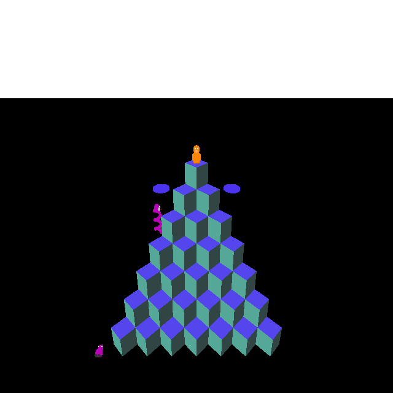
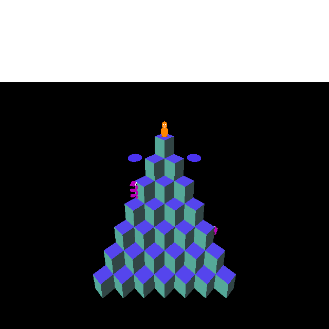

# Plan — Q✱bert enemy coexistence rules

**Date:** 2026-05-15
**Status:** Complete — both rules implemented at blender_create_qbert.py:2757-2758

## Problem

The WF implementation uses independent per-enemy spawn timers that run in parallel. Once the per-level gate arms them (L2/L3), every enabled enemy type can spawn at any moment regardless of what else is on screen. The arcade uses a **sequencer** (ROM table at `$AAD2+`) that fires enemies one at a time from a fixed schedule, so coexistence is implicitly controlled by timing rather than hard gates. The sequencer approach is a significant rewrite; this plan adds the two clearest observable rules as spawn guards.

## Arcade evidence (from [qbert-8088-disassembly.asm](../investigations/qbert-8088-disassembly.asm))

Stage configs encode enemy type bits. Comments extracted from the disassembly:

| Stage | Enemy mix |
|-------|-----------|
| 0 | E2 (CoilyEgg) only |
| 1 | E0 (RedBall) + E2 |
| 2 | E5 (Slick) + E7 (Sam) heavy |
| 3 | E2 + E0 |
| 4 | E5 + E7 + SND3 + E2 |
| 5 | mixed all types |
| 6 | Coily-heavy |
| 7 | mixed; 2 simultaneous Coily eggs |

Ugg (E3) and Wrong-Way (E4) appear in the sequencer only after the "mixed all types" stages — i.e., L3+. Critically, their sequence entries are always separated from Coily entries by several other events; they are never queued back-to-back in the same sequence. The sequencer also never enqueues both Ugg and Wrong-Way from the same sequence run (they share a "side-climber" slot). These two patterns become the guards below.

## Rules to implement

### Rule 1 — No Ugg or Wrong-Way while Coily is active

Gate the Ugg and Wrong-Way spawn triggers on `COILY_MB_PHASE_GLOBAL == 0`. While the egg is hopping (phase 1) or the snake is chasing (phase 2), neither climber spawns.

**Why:** In every arcade stage, Coily and the climbers occupy separate sequence "eras." The climbers never appear concurrently with Coily in practice because their sequence entries don't overlap.

### Rule 2 — Ugg and Wrong-Way never coexist

Gate Ugg spawn on `WW_MB_ACTIVE == 0`, and Wrong-Way spawn on `UGG_MB_ACTIVE == 0`. Only one side-climber on the board at a time.

**Why:** The arcade sequencer only queues one side-climber type per sequence run. Two climbers on screen simultaneously never occurs in the original.

## Implementation

Both rules are pure spawn-gate additions — no new mailboxes needed.

### `wflevels/qbert_practice/blender_create_qbert.py`

In the Ugg spawn block (currently guarded by `418 read-mailbox`, `GB_MB_FREEZE_TIMER`, `UGG_MB_ACTIVE`, spawn timer), add two new guards after the existing `ACTIVE == 0` check:

```forth
\ existing guards:
418 read-mailbox 1 = if          \ INTRO_DONE
GB_MB_FREEZE_TIMER read-mailbox 0 = if
UGG_MB_ACTIVE read-mailbox 0 = if
\ NEW guards:
WW_MB_ACTIVE read-mailbox 0 = if     \ no simultaneous climbers
COILY_MB_PHASE_GLOBAL read-mailbox 0 = if  \ no Ugg while Coily active
<spawn + timer re-arm>
then then then then then
```

Same pattern for Wrong-Way, swapping `WW_MB_ACTIVE` ↔ `UGG_MB_ACTIVE`.

**Stack management:** Each new `if ... then` wraps the inner block; no extra values are pushed, so no `else drop` needed (these are pure gate checks with no stack output).

**`then` count:** The existing block ends `then then then` (3 closes for timer/active/freeze/intro). Two new guards add 2 more → `then then then then then` (5 total).

## Files changed

- `wflevels/qbert_practice/blender_create_qbert.py` — two spawn blocks

## Build steps

```bash
blender -b wflevels/qbert_practice/qbert_practice.blend \
        -P wflevels/qbert_practice/blender_create_qbert.py
wftools/wf_blender/build_level_binary.sh qbert_practice
LD_LIBRARY_PATH=engine/libs DISPLAY=:0 engine/wf_game \
    -Lwflevels/qbert_practice-standalone.iff
```

## Verification

Verified via debug bridge (`set_mailbox` + `watch` on mb569/mb571).

1. **Coily gate (Rule 1):** Set `COILY_MB_PHASE_GLOBAL=1`, `UGG_MB_SPAWN_TIMER=1` — mb569 stayed 0 (gate held). Coily snake visible on left; no Ugg.

   

2. **Side-climber mutual exclusion (Rule 2):** Set `WW_MB_ACTIVE=1`, `UGG_MB_SPAWN_TIMER=1` — mb569 stayed 0 (gate held). Wrong-Way climbing; no Ugg.

   

3. **Positive:** Both guards clear — mb569 went to 1 (Ugg spawned). Ugg visible at bottom-right while WW clears frame.

   

4. **Regression**: Slick, Sam, Green Ball unaffected — they have no new guards.
