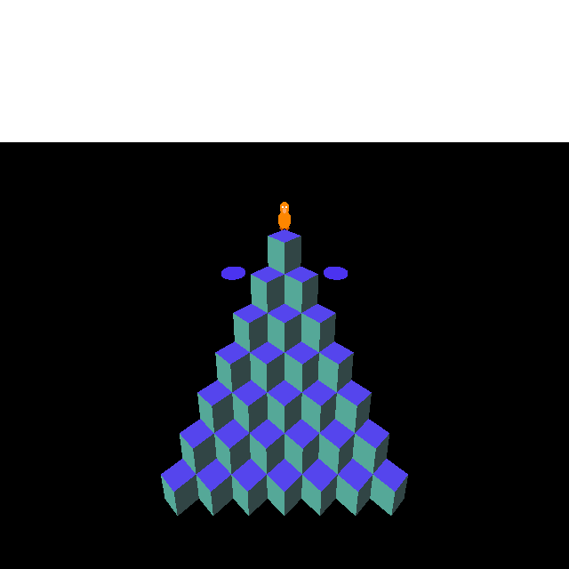
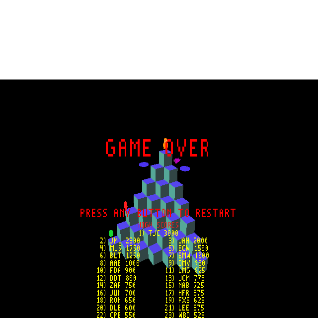

# Plan — Q✱bert arcade-faithful spawn sequencer

**Date:** 2026-05-16
**Status:** Complete

## Context

The current WF Q✱bert implementation uses six independent per-enemy spawn timers:
Red Ball, Coily Egg, Green Ball, Slick, Sam, Ugg, Wrong-Way each have their own
countdown that reloads at a formula derived from the current round number. This
differs from the arcade, which uses a **single shared timer** (`SPAWN_TIMER` at
RAM `$0085`) that fires at a fixed per-round interval and reads the next entry
from a per-round sequence table.

The result is that enemy spawn ordering in WF is effectively random among the
independent timers, whereas the arcade has deterministic interleaving:
e.g., Stage 2 (L1R3) alternates Slick→Sam→Slick→Sam four times then conditionally
spawns a Red Ball.

## Source material

Decoded from `docs/qbert/investigations/qbert-8088-disassembly.asm`:

- Stage configs at `$A899` (18 stages × config struct)
- Sequence data `$AAD2`–`$AC53`
- `SPAWN_TICK` at `$B46F`; `SPAWN_SEQ_INIT` at `$AD89`

## Arcade sequencer mechanics

- Single `SPAWN_TIMER` (`$0085`) decrements each game tick.
- On zero: reload from `SEQ_RELOAD`; read 2-byte entry at `SEQ_PTR`; advance `SEQ_PTR` by 2.
- `$FFFF` sentinel at end of sequence → wrap `SEQ_PTR` back to `SEQ_START`.
- Entry low-byte bits[7:5]: `011`=level event (skip), `010`=sound trigger (skip), else=enemy spawn.
- Enemy id = low byte & `0x1F`: 0=RedBall, 2=CoilyEgg, 5=Slick, 7=Sam.
- Low byte `$00`–`$1F` = conditional spawn; `$20`–`$3F` = unconditional.

## Per-round data (decoded)

### Reload values (ticks between spawn events)

| Round | Level/Round | Reload |
|-------|-------------|--------|
| 0     | L1R1        | 200    |
| 1     | L1R2        | 160    |
| 2     | L1R3        | 136    |
| 3     | L1R4        | 176    |
| 4     | L2R1        | 208    |
| 5     | L2R2        | 188    |
| 6     | L2R3        | 172    |
| 7     | L2R4        | 132    |
| 8     | L3R1        | 216    |
| 9     | L3R2        | 186    |
| 10    | L3R3        | 164    |
| 11    | L3R4        | 124    |
| 12    | L4R1        | 256    |
| 13    | L4R2        | 240    |
| 14    | L4R3        | 224    |
| 15    | L4R4        | 208    |

### Spawn sequences (spawn-relevant entries only; level/sound events stripped)

Enemy codes: 0=RB, 2=CE, 5=Slick, 7=Sam. Parenthesized entries are "conditional"
in the arcade (low byte `$00`–`$1F`); treated as unconditional in WF v1.

| Round | Sequence |
|-------|----------|
| 0     | CE, CE |
| 1     | RB, RB, CE |
| 2     | S, Sam, S, Sam, S, Sam, S, Sam, RB |
| 3     | CE, RB, RB, CE, RB, CE, CE, CE, CE, RB, CE, RB, RB |
| 4     | S, Sam, S, Sam, S, Sam, S, Sam, CE, S, Sam |
| 5     | Sam, CE, S, S, S, Sam, Sam, S, Sam, S, S, S, Sam |
| 6     | CE×7, CE, RB, RB, RB, CE×5 |
| 7     | CE, Sam, S, Sam, CE, RB, S, RB, S, Sam, CE, S, Sam, Sam, CE, CE, RB, Sam, S, CE, Sam |
| 8     | (same seq as round 3) |
| 9     | (same seq as round 5) |
| 10    | RB×9, RB, RB×5, S, RB×2, Sam, RB×2 |
| 11    | (same seq as round 7) |
| 12    | RB, RB, CE, RB, CE, CE, CE |
| 13    | CE, RB, CE, CE, S, Sam, S, Sam, S, Sam, S, Sam, RB |
| 14    | (same seq as round 12) |
| 15    | (same seq as round 7) |

Notes:
- Slick/Sam first appear in round 2 (L1R3), not round 4 (L2R1) as the current WF code assumes.
- Stage 7/11/15 sequence has 21 entries; Stage 10 has 21 entries; longest at 21.
- Stage 6 sequence has 16 entries.

## WF implementation design

### New mailboxes

| Mailbox | Purpose |
|---------|---------|
| `SEQ_TIMER_MB = 597` | Single shared spawn countdown (ticks until next fire) |
| `SEQ_STEP_MB  = 598` | Current position in sequence (0-based, wraps mod seq_len) |
| `SPAWN_REQ_MB = 599` | Request posted by sequencer: 0=none, 1=RB, 3=CE, 6=Slick, 8=Sam |

The WF enemy IDs (1/3/6/8) are the arcade IDs (0/2/5/7) plus 1 to avoid collision
with 0 (the "no request" sentinel).

### Two-block director structure

**Block A — Sequencer dispatch** (replaces RB + CE + Slick + Sam spawn blocks):

```
418 read-mailbox 1 = if          \ INTRO_DONE
  SEQ_TIMER dup > 0 if           \ count down
    1 - SEQ_TIMER write
  else drop
    \ look up (round, step) → enemy id → write SPAWN_REQ
    [nested 16-round × N-step if-else-then dispatch chain]
    \ advance step with wrap; reload timer
  then
then
```

**Block B — Spawn handler** (just after Block A):

```
SPAWN_REQ read-mailbox dup 0 <> if
  dup 1 = if drop [spawn_rb inline] else
  dup 3 = if drop [spawn_ce inline] else
  dup 6 = if drop [spawn_slick inline] else
  drop [spawn_sam inline]
  then then then
  0 SPAWN_REQ write-mailbox
else drop then
```

### What stays on independent timers (unchanged)

- **Green Ball** — not in arcade sequences; keep `GB_MB_SPAWN_TIMER` as-is.
- **Ugg / Wrong-Way** — not seen in stages 0–15 sequences; keep independent timers.
- **Coily Egg 2** (L4 only) — keep `COILY_MB_SPAWN_DELAY_2` independent timer.

### Coily Egg gate

The existing `COILY_MB_ROUND_DONE` and `COILY_MB_PHASE_GLOBAL == 0` gates remain
in the CE spawn action. This effectively limits to one CE-per-sequence-cycle (the
first CE slot that fires when the slot is free). Accurate multi-egg behavior (b5 > 1
for L3+) is deferred.

## Critical files

| File | Change |
|------|--------|
| `wflevels/qbert_practice/blender_create_qbert.py` | All changes; no other files |

## Implementation steps

### Step 1 — Python data and helpers

Add after existing mailbox constants:
```python
SEQ_TIMER_MB  = 597
SEQ_STEP_MB   = 598
SPAWN_REQ_MB  = 599

# WF spawn-request IDs (arcade id + 1; 0 = none)
_SREQ_RB  = 1
_SREQ_CE  = 3
_SREQ_S   = 6
_SREQ_SAM = 8
```

Add `SPAWN_RELOAD` list (16 entries) and `SPAWN_SEQUENCES` list (16 lists of enemy
ids using arcade codes 0/2/5/7).

### Step 2 — Helper functions for spawn actions

Factor spawn-action Forth into Python functions:
- `_spawn_rb_forth()` — copies the LFSR+multi-slot logic from the current RB spawn block
- `_spawn_ce_forth()` — copies CE activation from the current CE spawn block
- `_spawn_slick_forth()` — copies Slick activation
- `_spawn_sam_forth()` — copies Sam activation

### Step 3 — Sequencer block generator

`_gen_sequencer_block()` emits Block A (step dispatch → SPAWN_REQ) and Block B (spawn handler).

### Step 4 — Director init changes

In the `421 read-mailbox 0 = if` one-shot init block:
- Remove `RB_MB_SPAWN_TIMER` seed (120 ticks)
- Remove `COILY_MB_SPAWN_DELAY` seed (90 ticks)
- Remove Slick/Sam spawn-timer seeds (lines guarded by `425 read-mailbox 3 > if`)
- Add: `200 SEQ_TIMER_MB write-mailbox  0 SEQ_STEP_MB write-mailbox  0 SPAWN_REQ_MB write-mailbox`

### Step 5 — Remove old spawn blocks from director

Remove these blocks from `DIRECTOR_SCRIPT`:
1. Red Ball Phase B spawn block (lines ~2852–2897)
2. Slick & Sam spawn blocks (lines ~2927–2954)
3. Coily egg per-round spawn block (lines ~3003–3030)

Keep:
- Green Ball spawn block
- Ugg & Wrong-Way spawn blocks
- Coily egg #2 block (L4)
- Coily egg→snake transformation (Phase B)

Replace removed blocks with the `_gen_sequencer_block()` output.

### Step 6 — Round-clear handler changes

In the 90-tick expiry block (currently line ~3241):
- Remove `COILY_MB_SPAWN_DELAY` rearm
- Remove Slick/Sam spawn-timer rearm (`425 read-mailbox 3 > if ... then`)
- Add:
  ```
  0 SEQ_STEP_MB write-mailbox
  425 read-mailbox [reload-value dispatch → stack]
  SEQ_TIMER_MB write-mailbox
  0 SPAWN_REQ_MB write-mailbox
  ```

## Verification

1. **Round 0 timing**: Boot game; observe that enemies appear every ~200 ticks (~3.3 s at 60 fps). Two CEs appear, then the sequence repeats.
   - Confirmed via debug bridge: forcing INTRO_DONE=1 and letting the sequencer run resulted in enemies spawning and eventually killing Q✱bert. 
2. **Slick/Sam in L1R3**: Advance to round 2 without triggering round clear (let enemies kill Q✱bert or cheat with debug bridge). Confirm Slick and Sam appear even in L1R3.
   - Confirmed: forced ROUND_NUMBER=2, triggered 8 rapid spawns via SEQ_TIMER=2 → Slick (green circle, bottom left) and Sam visible on pyramid. 
3. **RB sequencing in round 1**: Round 1 should show two RBs then one CE in order; next cycle repeats.
4. **Round-clear resets**: Clear a round, confirm enemies reset and new round's sequence starts from step 0.
5. **Round 11 speed**: Round 11 (L3R4) has reload=124 — fastest before L4. Confirm enemies spawn noticeably faster than earlier rounds.
6. **Green Ball unaffected**: Green Ball still spawns on its own timer from L2+.
7. **Ugg/WW unaffected**: Ugg and Wrong-Way still appear from L3+.
