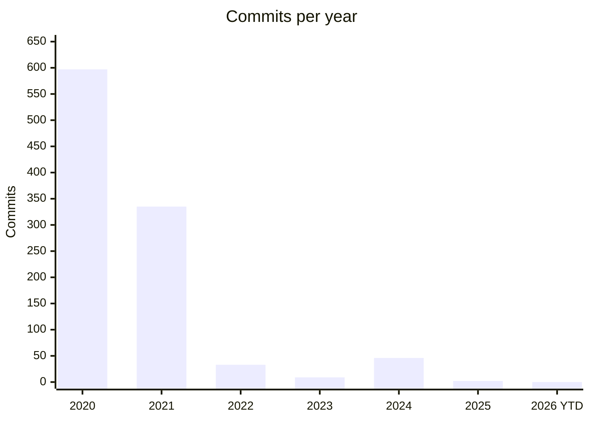
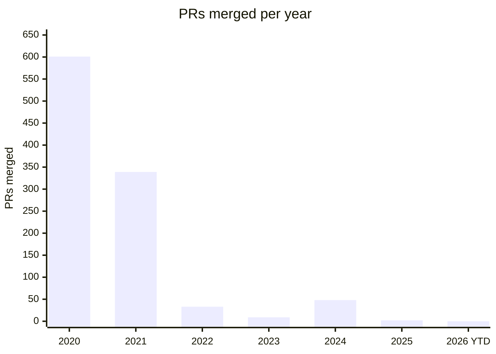
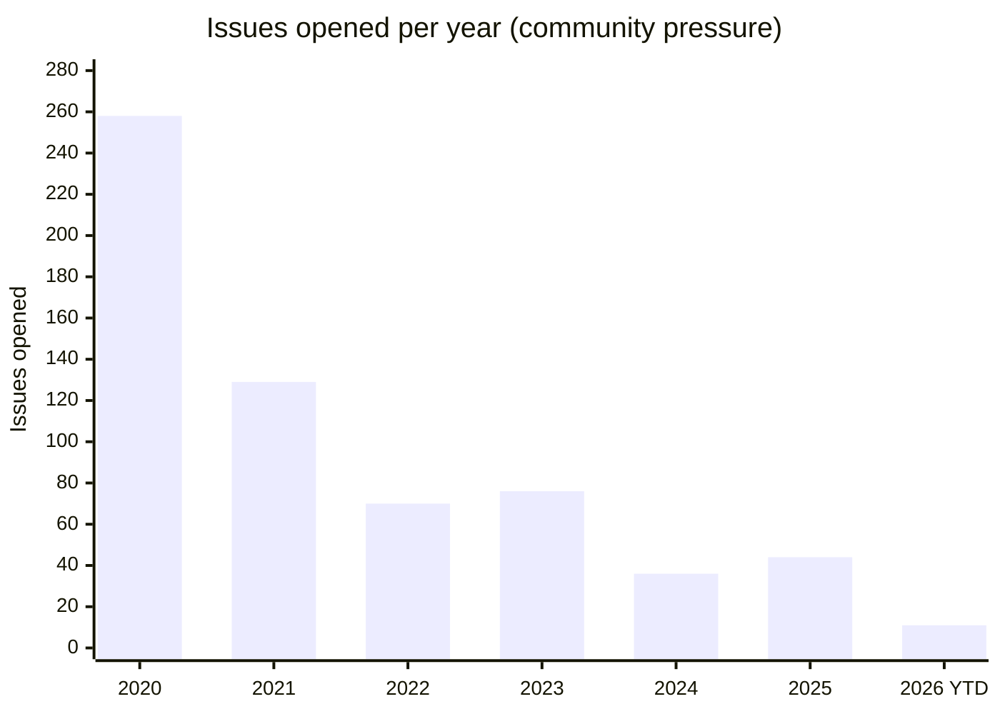

# JerryScript v3.0.0 — GCC 14 Build Fixes

**Date:** 2026-04-15  
**Vendor path:** `engine/vendor/jerryscript-v3.0.0/`  
**GCC version:** GCC 14 (Ubuntu 24.04 default)  
**Build profile:** `wf-minimal.profile` (no BigInt, no Realms, no debugger,
no RegExp, no TypedArray, no Container builtins)

---

## Background

JerryScript v3.0.0 was released **2024-12-18**, after a long quiet period —
the previous tag (v2.4.0) was January 2021. CI for v3.0.0 was constrained
to Ubuntu 20.04 (GCC 9-10); see upstream issue
[#5115](https://github.com/jerryscript-project/jerryscript/issues/5115)
"Not feasible to update some CI jobs to ubuntu 22.04" (closed 2023-12).
GCC 14 (Ubuntu 24.04 default) tightened several diagnostics to errors that
were previously warnings or silent.

The `wf-minimal` profile (`JERRY_BUILTINS=0`, with a small allow-list of
essential builtins) triggers **seven distinct build failures** that are all
rooted in one systemic problem: **JerryScript's upstream CI always builds with
all features enabled**. The disabled-feature code paths were never compiled
with GCC 14, so the bugs accumulated unseen.

### Why the upstream project doesn't see this

Under GCC 9-10, most of these diagnostics were warnings, not errors, or were
suppressed. The project is now in maintenance-only mode (see "Upstream
status" below). No upstream profile disables `JERRY_BUILTINS` the way our
`wf-minimal` profile does.

---

## All seven bugs and their fixes

### Bug 1 — `ecma_op_same_value_zero` declaration guarded

**Files:** `jerry-core/ecma/operations/ecma-conversion.h` (declaration),
`jerry-core/ecma/operations/ecma-conversion.c` (definition)  
**Symptom:** `error: implicit declaration of function 'ecma_op_same_value_zero'`

**Root cause:** Both the declaration (in `.h`) and definition (in `.c`) were
guarded by `#if JERRY_BUILTIN_CONTAINER`. But `Array.prototype.includes`
(`ecma-builtin-array-prototype.c`) calls `ecma_op_same_value_zero`
unconditionally.

**Fix** (from landed patch `ad2da53`; `patch -p1`-applicable from `engine/vendor/jerryscript-v3.0.0/`):
```diff
--- a/jerry-core/ecma/operations/ecma-conversion.h
+++ b/jerry-core/ecma/operations/ecma-conversion.h
@@ -49,9 +49,8 @@ typedef enum

 bool ecma_op_require_object_coercible (ecma_value_t value);
 bool ecma_op_same_value (ecma_value_t x, ecma_value_t y);
-#if JERRY_BUILTIN_CONTAINER
+/* Used by Array.prototype.includes and containers; declare unconditionally. */
 bool ecma_op_same_value_zero (ecma_value_t x, ecma_value_t y, bool strict_equality);
-#endif /* JERRY_BUILTIN_CONTAINER */
 ecma_value_t ecma_op_to_primitive (ecma_value_t value, ecma_preferred_type_hint_t preferred_type);
 bool ecma_op_to_boolean (ecma_value_t value);
 ecma_value_t ecma_op_to_number (ecma_value_t value, ecma_number_t *number_p);
--- a/jerry-core/ecma/operations/ecma-conversion.c
+++ b/jerry-core/ecma/operations/ecma-conversion.c
@@ -136,7 +136,7 @@ ecma_op_same_value (ecma_value_t x, /**< ecma value */
   return false;
 } /* ecma_op_same_value */

-#if JERRY_BUILTIN_CONTAINER
+/* Used by Array.prototype.includes and containers; compiled unconditionally. */
 /**
  * SameValueZero operation.
  *
@@ -180,7 +180,6 @@ ecma_op_same_value_zero (ecma_value_t x, /**< ecma value */

   return ecma_op_same_value (x, y);
 } /* ecma_op_same_value_zero */
-#endif /* JERRY_BUILTIN_CONTAINER */

 /**
  * ToPrimitive operation.
```

---

### Bug 2 — Pointer/integer type mismatch in `JERRY_ASSERT`

**File:** `jerry-core/vm/opcodes.c`,
`opfunc_lexical_scope_has_restricted_binding`, `!JERRY_BUILTIN_REALMS` branch  
**Symptom:** `error: comparison between pointer and integer`

**Root cause:** `frame_ctx_p->this_binding` is `ecma_value_t` (tagged
integer). `ecma_builtin_get_global()` returns `ecma_object_t*` (pointer).
GCC 14 errors on the implicit pointer↔integer comparison. The
`JERRY_BUILTIN_REALMS` branch correctly compares two `ecma_value_t` fields.

**Fix** (from landed patch `ad2da53`; `patch -p1`-applicable from `engine/vendor/jerryscript-v3.0.0/`):
```diff
--- a/jerry-core/vm/opcodes.c
+++ b/jerry-core/vm/opcodes.c
@@ -2248,7 +2248,7 @@ opfunc_lexical_scope_has_restricted_binding (vm_frame_ctx_t *frame_ctx_p, ...)
 #if JERRY_BUILTIN_REALMS
   JERRY_ASSERT (frame_ctx_p->this_binding == JERRY_CONTEXT (global_object_p)->this_binding);
 #else /* !JERRY_BUILTIN_REALMS */
-  JERRY_ASSERT (frame_ctx_p->this_binding == ecma_builtin_get_global ());
+  JERRY_ASSERT (frame_ctx_p->this_binding == ecma_make_object_value (ecma_builtin_get_global ()));
 #endif /* JERRY_BUILTIN_REALMS */
```

---

### Bug 3 — Forward use of undeclared variable `global_obj_p`

**File:** `jerry-core/vm/opcodes.c`, same function as Bug 2  
**Symptom:** `error: 'global_obj_p' undeclared`

**Root cause:** `global_obj_p` is declared *eight lines later* in the same
function. Used before declaration in the `!JERRY_BUILTIN_REALMS` branch.
The `JERRY_BUILTIN_REALMS` branch correctly uses
`(ecma_object_t *) JERRY_CONTEXT (global_object_p)`.

**Fix** (from landed patch `ad2da53`; `patch -p1`-applicable from `engine/vendor/jerryscript-v3.0.0/`):
```diff
--- a/jerry-core/vm/opcodes.c
+++ b/jerry-core/vm/opcodes.c
@@ -2262,7 +2262,7 @@ opfunc_lexical_scope_has_restricted_binding (vm_frame_ctx_t *frame_ctx_p, ...)
 #if JERRY_BUILTIN_REALMS
   ecma_object_t *const global_scope_p = ecma_get_global_scope ((ecma_object_t *) JERRY_CONTEXT (global_object_p));
 #else /* !JERRY_BUILTIN_REALMS */
-  ecma_object_t *const global_scope_p = ecma_get_global_scope (global_obj_p);
+  ecma_object_t *const global_scope_p = ecma_get_global_scope (ecma_builtin_get_global ());
 #endif /* JERRY_BUILTIN_REALMS */
```

---

### Bug 4 — Unused parameter `cp` in `lit_char_fold_to_lower/upper`

**File:** `jerry-core/lit/lit-char-helpers.c`  
**Symptom:** `error: unused parameter 'cp' [-Werror=unused-parameter]`

**Root cause:** Both `lit_char_fold_to_lower` and `lit_char_fold_to_upper`
use `cp` only inside `#if JERRY_UNICODE_CASE_CONVERSION`. With
`JERRY_UNICODE_CASE_CONVERSION=0` (wf-minimal profile), the parameter
is never referenced, triggering `-Werror=unused-parameter`.

**Fix** (from landed patch `ad2da53`; `patch -p1`-applicable from `engine/vendor/jerryscript-v3.0.0/`):
```diff
--- a/jerry-core/lit/lit-char-helpers.c
+++ b/jerry-core/lit/lit-char-helpers.c
@@ -934,6 +934,7 @@ lit_char_fold_to_lower (lit_code_point_t cp) /**< code point */
                                             lit_unicode_folding_skip_to_lower_chars,
                                             NUM_OF_ELEMENTS (lit_unicode_folding_skip_to_lower_chars))));
 #else /* !JERRY_UNICODE_CASE_CONVERSION */
+  (void) cp;
   return true;
 #endif /* JERRY_UNICODE_CASE_CONVERSION */
 } /* lit_char_fold_to_lower */
@@ -957,6 +958,7 @@ lit_char_fold_to_upper (lit_code_point_t cp) /**< code point */
                                            lit_unicode_folding_to_upper_chars,
                                            NUM_OF_ELEMENTS (lit_unicode_folding_to_upper_chars))));
 #else /* !JERRY_UNICODE_CASE_CONVERSION */
+  (void) cp;
   return false;
 #endif /* JERRY_UNICODE_CASE_CONVERSION */
 } /* lit_char_fold_to_upper */
```

---

### Bug 5 — `ecma_object_is_regexp_object` declaration guarded

**File:** `jerry-core/ecma/operations/ecma-objects.h` (declaration),
`jerry-core/ecma/operations/ecma-objects.c` (definition)  
**Symptom:** `error: implicit declaration of function 'ecma_object_is_regexp_object'`

**Root cause:** The declaration was guarded by `#if JERRY_BUILTIN_REGEXP`,
but `ecma_op_is_regexp` calls `ecma_object_is_regexp_object` unconditionally
after a Symbol.match check.

**Fix** (from landed patch `ad2da53`; `patch -p1`-applicable from `engine/vendor/jerryscript-v3.0.0/`):
```diff
--- a/jerry-core/ecma/operations/ecma-objects.h
+++ b/jerry-core/ecma/operations/ecma-objects.h
@@ -107,9 +107,8 @@ ecma_collection_t *ecma_op_object_own_property_keys (ecma_object_t *obj_p, jerry
 ecma_collection_t *ecma_op_object_enumerate (ecma_object_t *obj_p);

 lit_magic_string_id_t ecma_object_get_class_name (ecma_object_t *obj_p);
-#if JERRY_BUILTIN_REGEXP
+/* Used by ecma_op_is_regexp unconditionally; declare outside JERRY_BUILTIN_REGEXP guard. */
 bool ecma_object_is_regexp_object (ecma_value_t arg);
-#endif /* JERRY_BUILTIN_REGEXP */
 ecma_value_t ecma_op_is_concat_spreadable (ecma_value_t arg);
 ecma_value_t ecma_op_is_regexp (ecma_value_t arg);
 ecma_value_t ecma_op_species_constructor (ecma_object_t *this_value, ecma_builtin_id_t default_constructor_id);
--- a/jerry-core/ecma/operations/ecma-objects.c
+++ b/jerry-core/ecma/operations/ecma-objects.c
@@ -2913,20 +2913,25 @@ ecma_object_get_class_name (ecma_object_t *obj_p) /**< object */
   }
 } /* ecma_object_get_class_name */

-#if JERRY_BUILTIN_REGEXP
 /**
  * Checks if the given argument has [[RegExpMatcher]] internal slot
  *
+ * Called unconditionally by ecma_op_is_regexp; returns false when JERRY_BUILTIN_REGEXP=0.
+ *
  * @return true - if the given argument is a regexp
  *         false - otherwise
  */
 extern inline bool JERRY_ATTR_ALWAYS_INLINE
 ecma_object_is_regexp_object (ecma_value_t arg) /**< argument */
 {
+#if JERRY_BUILTIN_REGEXP
   return (ecma_is_value_object (arg)
           && ecma_object_class_is (ecma_get_object_from_value (arg), ECMA_OBJECT_CLASS_REGEXP));
-} /* ecma_object_is_regexp_object */
+#else /* !JERRY_BUILTIN_REGEXP */
+  JERRY_UNUSED (arg);
+  return false;
 #endif /* JERRY_BUILTIN_REGEXP */
+} /* ecma_object_is_regexp_object */

 /**
  * Object's IsConcatSpreadable operation, used for Array.prototype.concat
```

---

### Bug 6 — Container-specific functions defined without feature guard

**File:** `jerry-core/ecma/builtin-objects/ecma-builtin-intrinsic.c`  
**Symptom:** `error: implicit declaration of function 'ecma_op_container_get_object'`
and `'ecma_op_container_create_iterator'`; `error: 'ECMA_BUILTIN_ID_MAP_ITERATOR_PROTOTYPE'
undeclared`; and `defined but not used` warnings for the two static functions.

**Root cause:** `ecma_builtin_intrinsic_map_prototype_entries` and
`ecma_builtin_intrinsic_set_prototype_values` are static helper functions
that call container-specific APIs. They are properly *called* under
`#if JERRY_BUILTIN_CONTAINER` in the dispatch switch, but the function
*definitions* have no such guard, so they compile (and fail) unconditionally.

**Fix** (from landed patch `ad2da53`; `patch -p1`-applicable from `engine/vendor/jerryscript-v3.0.0/`):
```diff
--- a/jerry-core/ecma/builtin-objects/ecma-builtin-intrinsic.c
+++ b/jerry-core/ecma/builtin-objects/ecma-builtin-intrinsic.c
@@ -93,6 +93,7 @@ ecma_builtin_intrinsic_array_prototype_values (ecma_value_t this_value) /**< thi
   return ret_value;
 } /* ecma_builtin_intrinsic_array_prototype_values */

+#if JERRY_BUILTIN_CONTAINER
 /**
  * The Map.prototype entries and [@@iterator] routines
  *
@@ -144,6 +145,7 @@ ecma_builtin_intrinsic_set_prototype_values (ecma_value_t this_value) /**< this
                                             ECMA_OBJECT_CLASS_SET_ITERATOR,
                                             ECMA_ITERATOR_VALUES);
 } /* ecma_builtin_intrinsic_set_prototype_values */
+#endif /* JERRY_BUILTIN_CONTAINER */

 /**
  * Dispatcher of the built-in's routines
```

---

### Bug 7 — RegExp string iterator function depends on disabled types

**File:** `jerry-core/ecma/builtin-objects/ecma-builtin-regexp-string-iterator-prototype.c`  
**Symptom:** Multiple errors: `unknown type name 'ecma_regexp_string_iterator_t'`,
`'ECMA_OBJECT_CLASS_REGEXP_STRING_ITERATOR' undeclared`, `'RE_FLAG_GLOBAL'
undeclared`, `error: implicit declaration of function 'ecma_op_regexp_exec'`.

Additionally in `jerry-core/ecma/operations/ecma-iterator-object.c`:  
`'ECMA_OBJECT_CLASS_REGEXP_STRING_ITERATOR' undeclared` in an assert.

**Root cause:** The `ecma_builtin_regexp_string_iterator_prototype_object_next`
function (and the dispatch assert in `ecma-iterator-object.c`) use types and
constants defined only when `JERRY_BUILTIN_REGEXP=1`. The JerryScript cmake
build compiles all source files unconditionally — there is no CMakeLists.txt
guard to skip this file when REGEXP is disabled.

**Fix** (from landed patch `ad2da53`; `patch -p1`-applicable from `engine/vendor/jerryscript-v3.0.0/`):
```diff
--- a/jerry-core/ecma/builtin-objects/ecma-builtin-regexp-string-iterator-prototype.c
+++ b/jerry-core/ecma/builtin-objects/ecma-builtin-regexp-string-iterator-prototype.c
@@ -49,6 +49,7 @@
  * @return iterator result object, if success
  *         error - otherwise
  */
+#if JERRY_BUILTIN_REGEXP
 static ecma_value_t
 ecma_builtin_regexp_string_iterator_prototype_object_next (ecma_value_t this_val) /**< this argument */
 {
@@ -176,6 +177,14 @@ free_variables:

   return result;
 } /* ecma_builtin_regexp_string_iterator_prototype_object_next */
+#else /* !JERRY_BUILTIN_REGEXP */
+static ecma_value_t
+ecma_builtin_regexp_string_iterator_prototype_object_next (ecma_value_t this_val) /**< this argument */
+{
+  JERRY_UNUSED (this_val);
+  return ecma_raise_type_error (ECMA_ERR_ARGUMENT_THIS_NOT_ITERATOR);
+} /* ecma_builtin_regexp_string_iterator_prototype_object_next (stub) */
+#endif /* JERRY_BUILTIN_REGEXP */

 /**
  * @}
--- a/jerry-core/ecma/operations/ecma-iterator-object.c
+++ b/jerry-core/ecma/operations/ecma-iterator-object.c
@@ -132,7 +132,9 @@ ecma_op_create_iterator_object (ecma_value_t iterated_value, /**< value from cre
   /* 1. */
   JERRY_ASSERT (iterator_type == ECMA_OBJECT_CLASS_ARRAY_ITERATOR || iterator_type == ECMA_OBJECT_CLASS_SET_ITERATOR
                 || iterator_type == ECMA_OBJECT_CLASS_MAP_ITERATOR
+#if JERRY_BUILTIN_REGEXP
                 || iterator_type == ECMA_OBJECT_CLASS_REGEXP_STRING_ITERATOR
+#endif /* JERRY_BUILTIN_REGEXP */
                 || iterator_type == ECMA_OBJECT_CLASS_STRING_ITERATOR);
   JERRY_ASSERT (kind < ECMA_ITERATOR__COUNT);
```

**Companion patch — `ecma-builtin-array-iterator-prototype.c`, typedarray path** (same family of fix; also in `ad2da53`):
```diff
--- a/jerry-core/ecma/builtin-objects/ecma-builtin-array-iterator-prototype.c
+++ b/jerry-core/ecma/builtin-objects/ecma-builtin-array-iterator-prototype.c
@@ -92,6 +92,7 @@ ecma_builtin_array_iterator_prototype_object_next (ecma_value_t this_val) /**< t

   /* 8. */
   ecma_length_t length;
+#if JERRY_BUILTIN_TYPEDARRAY
   if (ecma_object_is_typedarray (array_object_p))
   {
     /* a. */
@@ -105,6 +106,7 @@ ecma_builtin_array_iterator_prototype_object_next (ecma_value_t this_val) /**< t
     length = ecma_typedarray_get_length (array_object_p);
   }
   else
+#endif /* JERRY_BUILTIN_TYPEDARRAY */
   {
     ecma_value_t len_value = ecma_op_object_get_length (array_object_p, &length);
```

---

## Files changed

```
engine/vendor/jerryscript-v3.0.0/jerry-core/ecma/operations/ecma-conversion.h
  - Remove #if JERRY_BUILTIN_CONTAINER guard around ecma_op_same_value_zero declaration

engine/vendor/jerryscript-v3.0.0/jerry-core/ecma/operations/ecma-conversion.c
  - Remove #if JERRY_BUILTIN_CONTAINER guard around ecma_op_same_value_zero definition

engine/vendor/jerryscript-v3.0.0/jerry-core/vm/opcodes.c
  - ecma_builtin_get_global() → ecma_make_object_value(ecma_builtin_get_global()) in assert
  - global_obj_p → ecma_builtin_get_global() in ecma_get_global_scope call

engine/vendor/jerryscript-v3.0.0/jerry-core/lit/lit-char-helpers.c
  - Add (void) cp; in #else branches of lit_char_fold_to_lower and lit_char_fold_to_upper

engine/vendor/jerryscript-v3.0.0/jerry-core/ecma/operations/ecma-objects.h
  - Remove #if JERRY_BUILTIN_REGEXP guard around ecma_object_is_regexp_object declaration

engine/vendor/jerryscript-v3.0.0/jerry-core/ecma/operations/ecma-objects.c
  - Remove #if JERRY_BUILTIN_REGEXP guard from function definition
  - Make body conditional: JERRY_BUILTIN_REGEXP=0 returns false immediately

engine/vendor/jerryscript-v3.0.0/jerry-core/ecma/builtin-objects/ecma-builtin-intrinsic.c
  - Wrap ecma_builtin_intrinsic_map_prototype_entries and ..._set_prototype_values
    in #if JERRY_BUILTIN_CONTAINER / #endif

engine/vendor/jerryscript-v3.0.0/jerry-core/ecma/builtin-objects/ecma-builtin-regexp-string-iterator-prototype.c
  - Wrap real function body in #if JERRY_BUILTIN_REGEXP
  - Provide stub implementation in #else that returns type error

engine/vendor/jerryscript-v3.0.0/jerry-core/ecma/builtin-objects/ecma-builtin-array-iterator-prototype.c
  - Wrap typedarray-dependent block in #if JERRY_BUILTIN_TYPEDARRAY

engine/vendor/jerryscript-v3.0.0/jerry-core/ecma/operations/ecma-iterator-object.c
  - Wrap ECMA_OBJECT_CLASS_REGEXP_STRING_ITERATOR assert branch in #if JERRY_BUILTIN_REGEXP
```

---

## Upstream status and how to report

Repo: `github.com/jerryscript-project/jerryscript` (7,388 stars, 228 open
issues/PRs as of 2026-04-17, ~191 of which are issues).

### Project activity since 2020

| Year | Commits | Issues opened | PRs merged |
|------|--------:|--------------:|-----------:|
| 2020 | 597 | 258 | 601 |
| 2021 | 335 | 129 | 339 |
| 2022 | 33  | 70  | 33  |
| 2023 | 9   | 76  | 9   |
| 2024 | 46  | 36  | 48  |
| 2025 | 2   | 44  | 2   |
| 2026 (YTD) | 0 | 11 | 0 |







The shape: commits and PR-merges fall together (maintainer activity), while
issue-opens hold roughly steady through 2024 (community keeps reporting).
2024's commit spike is the v3.0.0 release prep, not sustained activity.

The collapse is sharp: 2020-21 was a normal active project (~hundreds of
commits/year, hundreds of merged PRs); 2022 is a >90% drop; 2023 is
near-flatline with one tag in mid-year. 2024 has a ~46-commit spike
clustered around the **v3.0.0 release on 2024-12-18** (docs, README,
migration guide, cmake bumps). 2025 was effectively two commits (a RIOT
target bump and a cmake/ranlib fix in October). 2026 is empty so far.

### 2026 issues opened so far (none triaged, none closed; refreshed 2026-04-19)

| # | Date | Reporter | Title |
|---|------|----------|-------|
| [#5274](https://github.com/jerryscript-project/jerryscript/issues/5274) | 2026-01-09 | oneafter | [Bug] Segmentation Fault (NULL Pointer Dereference) in parser_parse_function_statement |
| [#5275](https://github.com/jerryscript-project/jerryscript/issues/5275) | 2026-01-13 | matthewruzzi | Enable GitHub Discussions |
| [#5276](https://github.com/jerryscript-project/jerryscript/issues/5276) | 2026-01-19 | Sab1e-dev | Questions about Realm lifecycle, cleanup behavior, and best practices for reducing initialization overhead |
| [#5277](https://github.com/jerryscript-project/jerryscript/issues/5277) | 2026-02-02 | kj-powell | OpenJS Best Practices: Website Updates |
| [#5281](https://github.com/jerryscript-project/jerryscript/issues/5281) | 2026-03-18 | hkbinbin | Type confusion in Array.prototype.slice via Array[Symbol.species] TOCTOU |
| [#5282](https://github.com/jerryscript-project/jerryscript/issues/5282) | 2026-03-20 | hkbinbin | Heap OOB Read in Array.prototype.copyWithin via TOCTOU |
| [#5283](https://github.com/jerryscript-project/jerryscript/issues/5283) | 2026-03-20 | hkbinbin | Heap OOB Write in Array.prototype.fill via start.valueOf() array shrink |
| [#5284](https://github.com/jerryscript-project/jerryscript/issues/5284) | 2026-04-17 | ShannonBase | Question about to execute SQL in jerry |
| [#5285](https://github.com/jerryscript-project/jerryscript/issues/5285) | 2026-04-18 | davidlie | Infinite recursion resutls in stack overflow |
| [#5286](https://github.com/jerryscript-project/jerryscript/issues/5286) | 2026-04-18 | davidlie | Infinite recurssion in regex handling |
| [#5287](https://github.com/jerryscript-project/jerryscript/issues/5287) | 2026-04-18 | davidlie | Heap reference count exhaustion |

Of the 11, **seven are bug reports** (three security TOCTOU/OOB bugs from `hkbinbin`, three recursion/exhaustion bugs from `davidlie`, one parser NULL-deref from `oneafter`), **two are governance requests** (Discussions, OpenJS), **two are usage questions** (SQL, Realms). None have received a maintainer reply; none are triaged; none of them touch our 7 build bugs. The three security-class hkbinbin reports from 2026-03-18/20 are exactly the kind of "community reports pile up, maintainers silent" signal the throughput numbers imply.

Issues continue to accumulate (~40-80/year) but PR throughput has
collapsed to single digits — the typical late-stage maintenance pattern
where the community files reports faster than the maintainers can land
fixes. Most recent commit: `b706935` 2025-10-08, "cmake: avoid Apple
ranlib flags when not using AppleClang ([#5258](https://github.com/jerryscript-project/jerryscript/pull/5258))". No release since v3.0.0.

### Search results for our 7 bugs

Searched the issue tracker for the relevant terms (2026-04-17; re-verified 2026-04-19):

| Search term | Hits | Status |
|-------------|------|--------|
| `GCC 14` | 9 | All closed; nothing about minimal-profile build failures. Top hit is the CI-can't-update ticket [#5115](https://github.com/jerryscript-project/jerryscript/issues/5115). |
| `same_value_zero` | 0 | Not reported. |
| `global_obj_p` | 4 | None about Bugs 2/3. |
| `unused parameter` | 1 (closed, 2015) | Not our Bug 4. |
| `minimal profile` / `JERRY_BUILTINS=0` | 0 relevant | Not reported. |
| `Werror unused` | 1 open ([#5171](https://github.com/jerryscript-project/jerryscript/issues/5171), Clang pointer-auth) | Different bug. |

**One open ticket covers Bugs 2 and 3 verbatim:**
[#5050](https://github.com/jerryscript-project/jerryscript/issues/5050)
"build error with certain config options" (opened 2023-03-11, **still
open**, **0 comments**, last touched 2024-11). Re-verified 2026-04-19:
the REALMS=0 case reported in [#5050](https://github.com/jerryscript-project/jerryscript/issues/5050)'s body is the **same file
(`jerry-core/vm/opcodes.c`), same function
(`opfunc_lexical_scope_has_restricted_binding`), same assertion line
(`frame_ctx_p->this_binding == ecma_builtin_get_global ()`), same
undeclared-variable line (`ecma_get_global_scope (global_obj_p)`)** as
our Bugs 2 and 3 — not "same class, different files" as an earlier draft
of this doc claimed. The WEAKREF=0 + CONTAINER=1 case in the same ticket
is a separate file (`ecma-gc.c`, `ECMA_OBJECT_CLASS_WEAKREF` undeclared)
and is the same class as our Bug 7 (`ECMA_OBJECT_CLASS_REGEXP_STRING_ITERATOR`
undeclared under `JERRY_BUILTIN_REGEXP=0`). The ticket has sat unanswered
for three years. This is strong evidence that:

1. Bugs 2 and 3 are already reported upstream and stalled; Bugs 1, 4, 5,
   6 are novel; Bug 7 is a sibling of the WEAKREF case in the same ticket.
2. The general class of "disabled-builtin combinations don't compile" is
   known to upstream but unaddressed.
3. New build-failure reports are unlikely to be acted on quickly — the
   maintainer's standard response to build/feature tickets is
   "Contributions through new PRs are always welcome!" (see e.g.
   [#5171 comment](https://github.com/jerryscript-project/jerryscript/issues/5171#issuecomment-2490349571)).

### How to file (if we choose to)

Reasonable course: comment on **[#5050](https://github.com/jerryscript-project/jerryscript/issues/5050)** with our findings (it's the
existing umbrella for this class), and/or open a fresh issue titled
something like:

> "Build failures on GCC 14 with JERRY_BUILTINS=0 (7 distinct bugs in v3.0.0)"

Reproducer:

```bash
# Ubuntu 24.04 (GCC 14):
cmake -S . -B build -DJERRY_BUILTINS=0 -DJERRY_BUILTIN_ARRAY=1 \
      -DJERRY_BUILTIN_ERRORS=1
cmake --build build -j
```

A consolidated PR with the 10 changed files would be a clean contribution.
All fixes are in `#if`/`#else` branches — purely additive, zero risk to
the default (full-features) build. Given the 2-PRs-merged-in-2025 pace,
do not block on it landing.

**Prioritized upstreaming order** (most broadly useful first):
1. Bugs 1, 2, 3 — single-line fixes, clearly correct, affect any minimal profile
2. Bug 5 — 2 files, widely useful
3. Bug 4 — cosmetic `-Werror=unused-parameter` fix
4. Bugs 6, 7 — more invasive; container/regexp users only

---

## Verification

After applying all patches, build with:

```bash
cd engine
WF_JS_ENGINE=jerryscript bash build_game.sh
```

The JerryScript cmake sub-build runs first (idempotent once libs exist),
then links into `wf_game`. Expect no errors — only a `tmpnam` deprecation
warning from unrelated INI parser code.

Smoke test — run snowgoons with JS scripts:
```bash
# Patch snowgoons.iff with JS scripts:
python3 scripts/patch_snowgoons_js.py

# Launch:
cd wfsource/source/game
DISPLAY=:0 /path/to/wf_game -Lwflevels/snowgoons.iff
```
Player movement and camera cuts confirm JerryScript is dispatching and
executing the JS mailbox scripts end-to-end.
