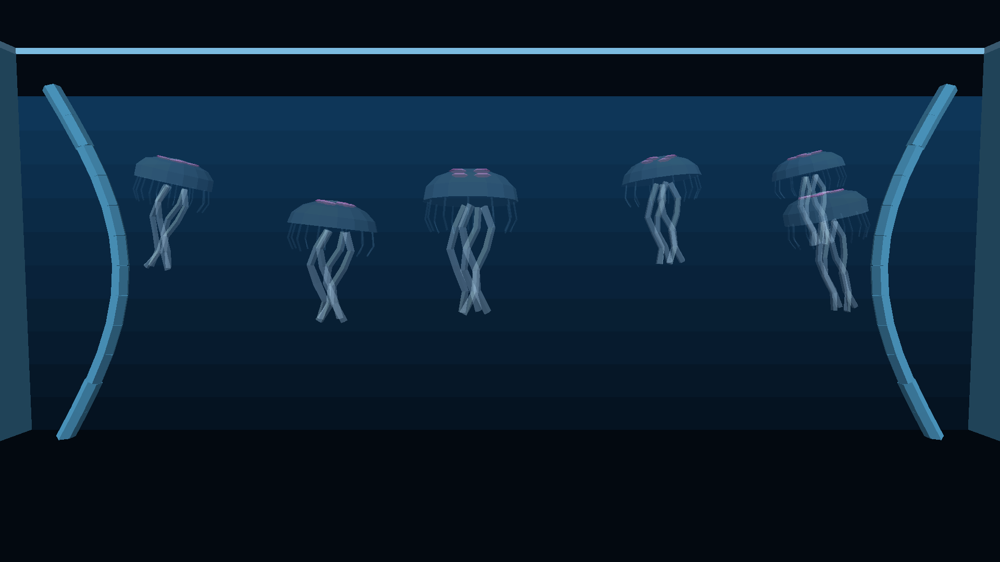
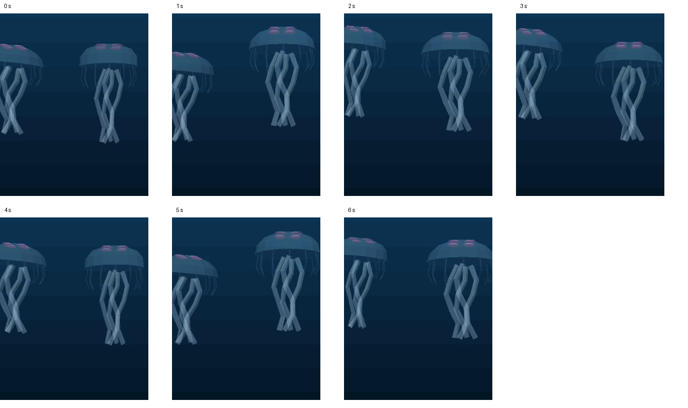

# Translucent jellyfish — Chromecast HD verification

Date: 2026-10-03. Source: [25973305](https://github.com/wbniv/WorldFoundry/commit/2597330516d76c148a950c084e1ec427537f07cf).

- [x] Build `:app:assembleAquariumRelease` in the isolated checkout atop the pushed translucency/FPS commits.
- [x] Verify APK assets exactly match the menu bundle, containing the regenerated jellyfish standalone once; verify both ARM libraries.
- [x] Install successfully on Chromecast HD (Android 14, 32-bit runtime; 1920 × 1080 output).
- [x] Open selector entry 3 (Jellyfish) and inspect all six animals.
- [x] Capture presented-frame timestamps after 15 s warmup, using a 12 s idle trace and 0.75 s SurfaceFlinger polls.
- [x] Record a separate pulse video (6.67 s usable footage from an 8 s recording request) and inspect sampled frames for deformation, trailing arms and transparency.

| Presented-frame result | Value |
|---|---:|
| Frame intervals | 383 |
| Mean FPS | 29.97 |
| Median interval | 33.367 ms |
| p95 interval | 33.367 ms |
| Worst interval | 33.368 ms |
| Display refresh interval | 16.683 ms |

The trace holds approximately 30 FPS on the 60 Hz output. Every measured interval spans two refreshes; the script's “missed refresh” metric therefore reads 100%, which does not mean frames stopped presenting. This is one short idle trace, without an opaque baseline or a control/thermal soak comparison. Video recording occurs after the performance trace and is excluded from that measurement.

Visual inspection shows the background through the bells and translucent overlapping appendages; bells contract and recover while central oral arms trail and sway. The same six-jelly model and motion remain; material opacities are bell 22%, margin/arms 32%, fringe 12%, motifs 72%. No refraction is implemented. The captured process log has no fatal crash or translucency-queue overflow; existing startup alignment/asset-stream messages and missing unused Q*bert sound files are retained in the raw log rather than treated as clean output.

The memory report retains its values with trailing whitespace removed.

[Frame summary](summary.json) · [build hashes](build-receipt.json) · [APK/device receipt](receipt.json) · [raw samples](run-1/samples.json) · [pulse video](pulse.mp4) · [sampled pulse frames](pulse-contact-sheet.png).

