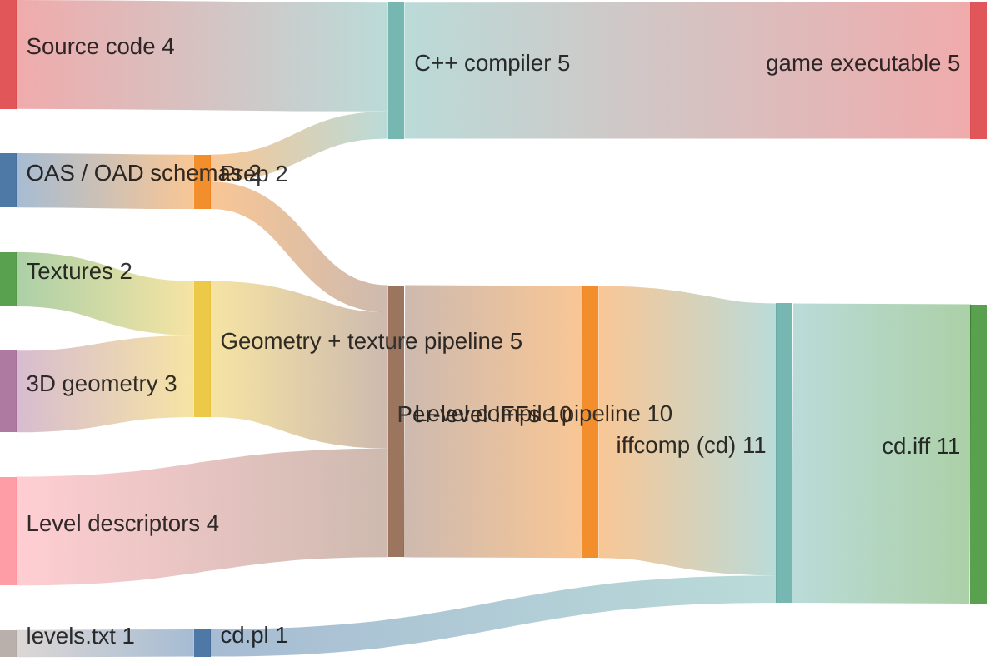
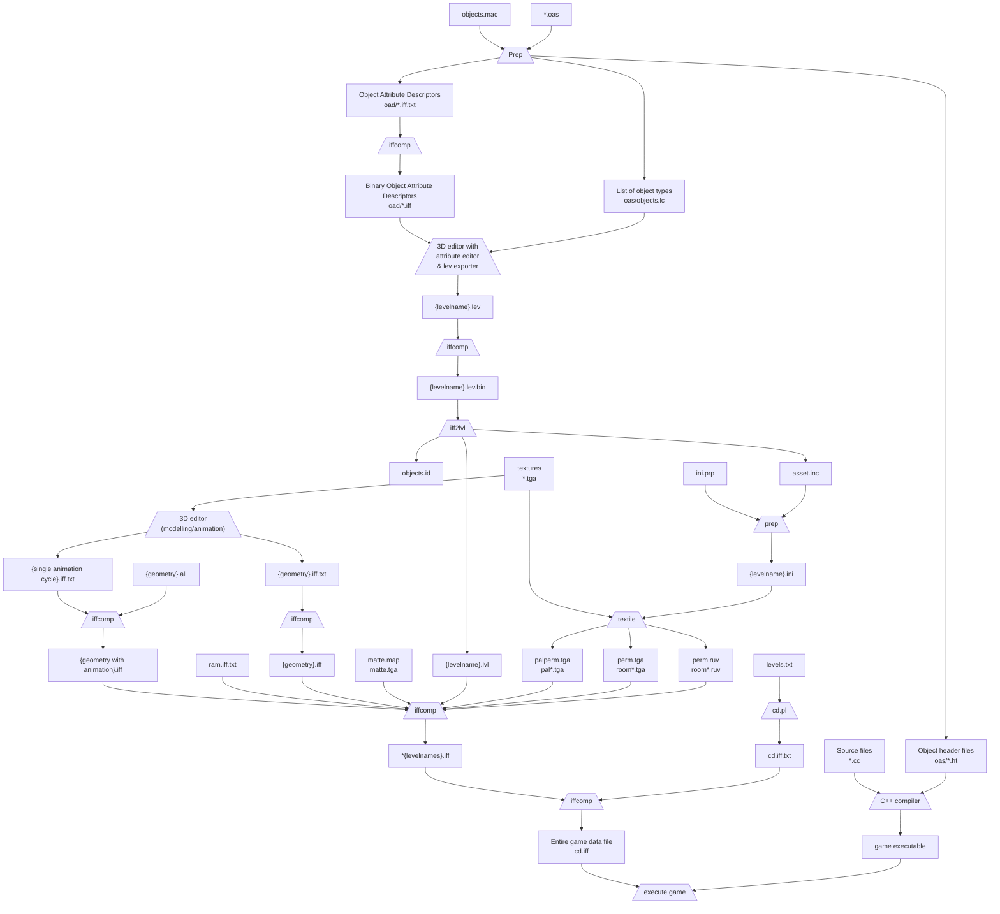

# Production Pathway

Converted from `docs/Production Pathway.dia` (v0.4).  
Original note: *"Some details could be missing or incorrect. Note that the makefiles which execute these conversions are not shown. Due to limited space not all paths are shown."*

---

## High-level asset funnel

Six asset categories enter the pipeline and converge into two outputs. The Sankey
widths are proportional to the number of distinct data streams — not byte sizes.

The detailed step-by-step flow follows below.

---

---

> ⚠️ `{geometry}.ali` → animated geometry conversion is noted in the original as **not currently automated**.
