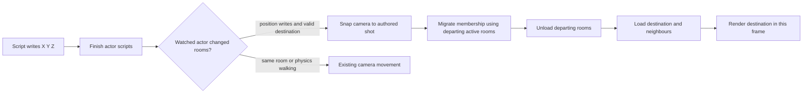

# Cross-room teleport audit

Status: three reproduced problems fixed in engine commit [`c92ca353`](https://github.com/wbniv/WorldFoundry/commit/c92ca353) on `teleport-audit`, based on `2b893d484a11cb7398d8ce482ad830cd31b82e22`. Desktop and Chromecast verification passed. Main checkout edits are preserved.

Will chose immediate camera jumps on cross-room teleports. Script position-mailbox writes and `wfmut::SetActorPos` identify this path; ordinary physics movement does not request a camera jump. All writes in one actor script are evaluated before deciding whether the final pose is in another room. Within-room writes retain camera smoothing.

## Confirmed findings and fixes

| Finding | Code evidence | Reproduction | Change |
| --- | --- | --- | --- |
| Departing-room unbind uses a destination pointer, which can be null when the arriving set has fewer neighbours | [`ChangeActiveRoom`](../wfsource/source/room/actrooms.cc), old line 191; baseline blame traces this statement to imported 2010 source | [Baseline engine log](diagnostics/t4-teleport-audit/baseline-transition/engine.log): UBSan reports a member call on null `Room` during A-to-D | Unbind `_fromActiveRooms` before clearing its entry |
| Scale writes to unloaded actors print a nil-pointer diagnostic even though null rendering state is expected | [`Actor` scale mailbox cases](../wfsource/source/game/actor.cc); `BindAssets` forwards cached scale | [Independent scale-only baseline](diagnostics/t4-teleport-audit/baseline-scale/engine.log), with zero teleports; cache reads back 0.25 | Check for null before invoking diagnostic `ValidPtr`. Preserve the cache and validation of live pointers |
| Following camera crosses a gap, loses room membership and stops updating | [`BungeeCameraHandler::predictPosition`](../wfsource/source/game/movecam.cc), [`Room::UpdateRoomContents`](../wfsource/source/room/room.cc), [`AddObjectToRoom`](../wfsource/source/room/rooms.cc), [`SetPendingRemove`](../wfsource/source/game/level.cc) | [Correctly authored relative-camera baseline](diagnostics/t4-teleport-audit/baseline-camera/engine.log): Player X=100; camera reaches X≈23.7242, falls outside every room; engine refuses camera deletion after removing its room-list entry | Record watched-player position writes. Snap to the authored current camera shot, migrate membership while source rooms are active, then load the destination set |

The scale warning itself is harmless in this reproduced path: the setter retains the scale and does not dereference null. This conclusion does not apply to arbitrary nil-pointer warnings. Its implementation dates to May 2026, so it does not qualify for the dormant-bug catalogue in `BUGS.md`.

The camera fault also reproduces through [`wfmut::SetActorPos`](../engine/mutation/wfmut.cpp), reached by the bridge's `scene:set_transform`. [That baseline](diagnostics/t4-teleport-audit/baseline-mutation/engine.log) strands camera X≈23.5563 after Player X=100. The transform API now records the same position-write notification. A separate permanent CTest exercises this entry point. Direct path-following calls to `Actor::setCurrentPos` remain ordinary movement and do not request a snap.

## Transition and frame ordering

Teleport completion runs before the usual start-of-frame selection for external mailbox writes, after physics/actor updates for actor scripts, and after the director for director scripts. Membership migration precedes unloading, so both Player and camera remain scheduled in the destination. The camera retains the authored shot's offset, orientation and clipping data; its smoothing velocity is cleared. Player velocity is preserved.

## Audit matrix and existing boundaries

| Area | Finding and evidence | Verification or limit |
| --- | --- | --- |
| Destination search | `ActiveRooms::UpdateRoom` scans all rooms, not only neighbours, when outside current room | Regression includes disconnected D and returns |
| From/to tables and reuse | `ChangeActiveRoom` computes departures/arrivals by room identity and completes unloading before loading | Three-room A set to lone D, retained A during B/C transitions, repeated reuse |
| Permanent assets | Prior `2b893d48` binds MBR actors to permanent slot once and leaves them bound during unload | Repeated visits exercise the fixed Player asset lifetime |
| Slot map | `InitRoomSlotMap` requires distinct transient slots for co-active rooms; disconnected rooms can reuse slot 0 | Regression graph is legal. No new arbitrary-topology guarantee |
| Membership | `Room::UpdateRoomContents` removes and re-adds movers; null-hole iteration does not skip the next live entry (`Int16ListIter`) | Watched Player and following camera remain live across repeated returns |
| Multiple writes | Pose setters update current and predicted coordinates separately; room resolution occurs after actor scripts | Command 5 writes X=300,100,200 in one script; final room C is selected |
| Scale/render assets | Setter caches scale; `BindAssets` reapplies it on renderer construction | Unloaded writes alternate 0.25/0.5; cache survives load/unload. No pixel measurement of scale |
| Physics | Position mailboxes synchronise Jolt characters; body sync also occurs at physical update. Mailbox writes retain velocity | Standalone Player is anchored. General dynamic-body and stale-contact behavior is not certified by that fixture |
| Camera/audio | Camera jump updates pose, matrix, handler state and `cameraPos`; sound listener consumes `cameraPos` | Camera arrival is tested; audio continuity is a source-based inference, not an audible test |
| Inactive actors | Membership updates visit active rooms only; moving an actor out of an unloaded room is not generally handled by this patch | Source finding, not reproduced here; no claim that arbitrary unloaded actors can teleport |
| Non-MBR actors | Room-owned mesh assets keep compiler room identity; cross-room relocation is unsupported by this contract | Do not remove the MBR authoring requirement |
| Archive | Compiler can omit rooms without non-permanent assets; loader accesses TOC by room index | Every regression room has a room-owned mesh. No empty-room/archive format change |

## Decisions reserved for Will

Camera policy is resolved: jump immediately on teleport.

`ESCALATE: Teleports outside all rooms and ambiguous overlapping destinations need an explicit gameplay policy before changing their behavior.` `UpdateRoom` retains the old active set when no destination matches; `AddObjectToRoom` instead requests removal. The current room wins when it still contains the actor; otherwise the first matching room wins. These are code findings, not new runtime reproductions.

`ESCALATE: Supporting arbitrary actors moved from unloaded rooms, non-MBR relocation, empty-room archives or arbitrary room graphs requires a broader architecture decision.` Active-only membership iteration, compiler asset ownership, positional room TOC lookup and static slot-map assertions provide the evidence. Those paths remain outside the supported contract of these targeted fixes.

Player velocity/contact resets remain unchanged. Destination collision is not rerun after scripts in the same frame; normal collision detection resumes next frame. An immediate same-frame physics guarantee would require a separate decision and reproduction.

## Regression and review evidence

The checked-in [generator](../tests/generate_teleport_level.py), [test](../tests/verify_cross_room_teleports.py) and [standalone level](../wflevels/teleport_regression-standalone.iff) use existing engine assets and Forth. They do not require Blender, an APK or a chapter checkout. See [reproduction instructions](teleport-regression.md).

- [x] Assertions + transition UBSan: original mechanical-fix suite passed 22/22.
- [x] Assertions: corrected permanent regression passed 35 teleports before the camera fix.
- [x] Assertions off + transition UBSan: camera fix passed 140 teleports and a paused single-frame camera-arrival check.
- [x] Final assertions-on full suite: 22/22; permanent teleport test includes exact camera arrival, one-frame arrival and same-room smoothing guard.
- [x] Final assertions-off build: script teleport regression passed; after adding the transform notification, both teleport regressions and both available `wfmut` tests passed (4/4).
- [x] Parmenides scene9 level-owned tour integration: 15 Truth/God/Being transitions, including repeated return tours; dynamic player and following camera stay in the expected realms.
- [x] Android Release on both 32-bit Chromecasts: 151/146 autonomous teleports, zero logged camera X error, scale preserved; repeated chapter cycles pass. [Device verification and evidence](diagnostics/t4-teleport-audit/android-review.md).

The chapter probe accelerates only the existing review timer mailbox, not Player coordinates; the level's `fy-review-setup`/`fy-teleport` performs each jump. [Probe source](diagnostics/t4-teleport-audit/chapter-probe.py), [chapter receipt](diagnostics/t4-teleport-audit/chapter-integration/receipt.json) and [chapter log](diagnostics/t4-teleport-audit/chapter-integration/engine.log) retain exact inputs and results. Observed dynamic Z positions settle near the authored floors; this is a smoke test, not a systematic collision/contact test.

Raw logs and receipts live in [the evidence directory](diagnostics/t4-teleport-audit/). Earlier camera probes with incorrect enum strings or an incorrectly authored follow target are excluded; the cited baseline uses both correct enum labels and a fixed origin helper.

Baselines are incremental: the null-room and scale reproductions precede their fixes; the camera reproduction includes those mechanical fixes; the transform reproduction includes the script-camera fix but precedes the transform notification. [Metadata](diagnostics/t4-teleport-audit/metadata.md) records configuration and final hashes; [scoped patch](diagnostics/t4-teleport-audit/review.patch) captures source, test and documentation changes. The binary fixture is included separately in `wflevels`.

The original task paste contains a literal “45 lines hidden”; omitted acceptance requirements remain unavailable. This report records the visible audit scope and limits rather than certifying unspecified requirements.
