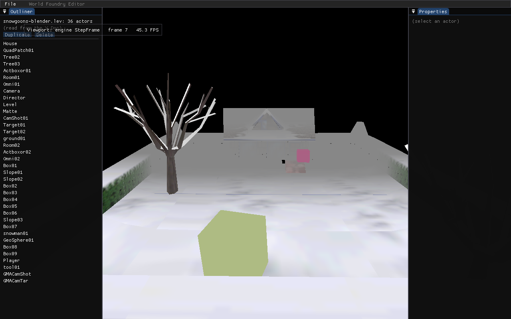
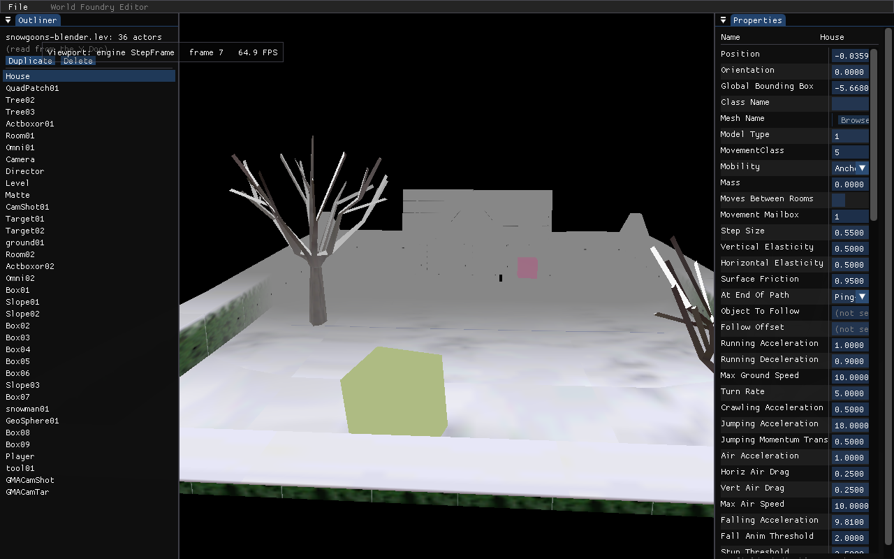
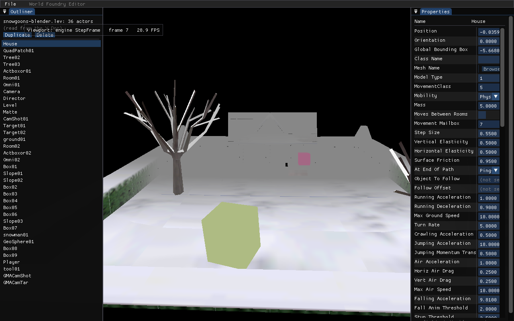
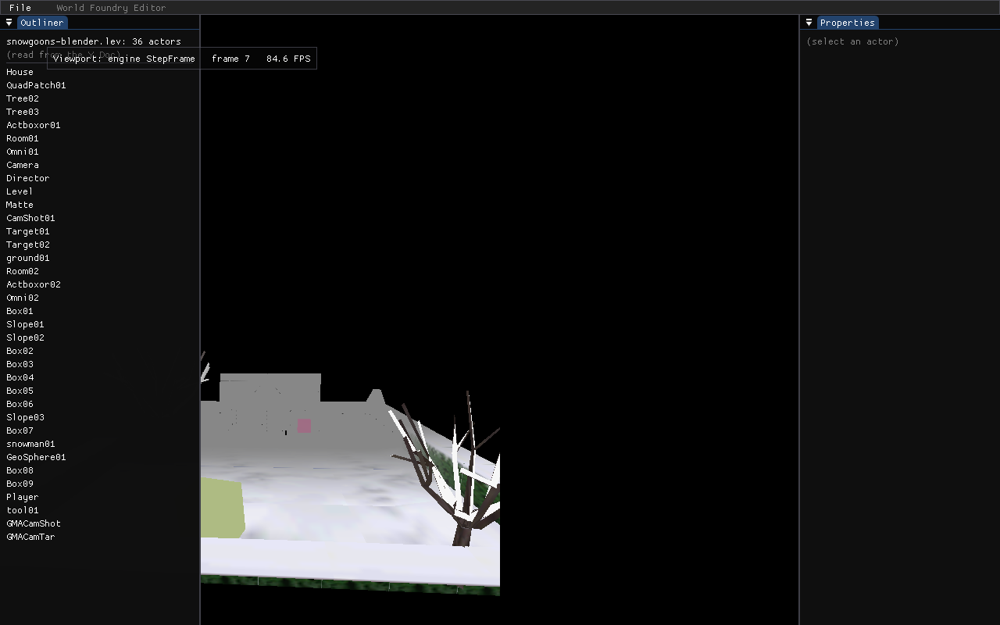
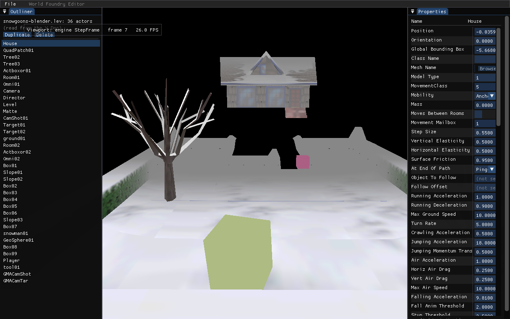
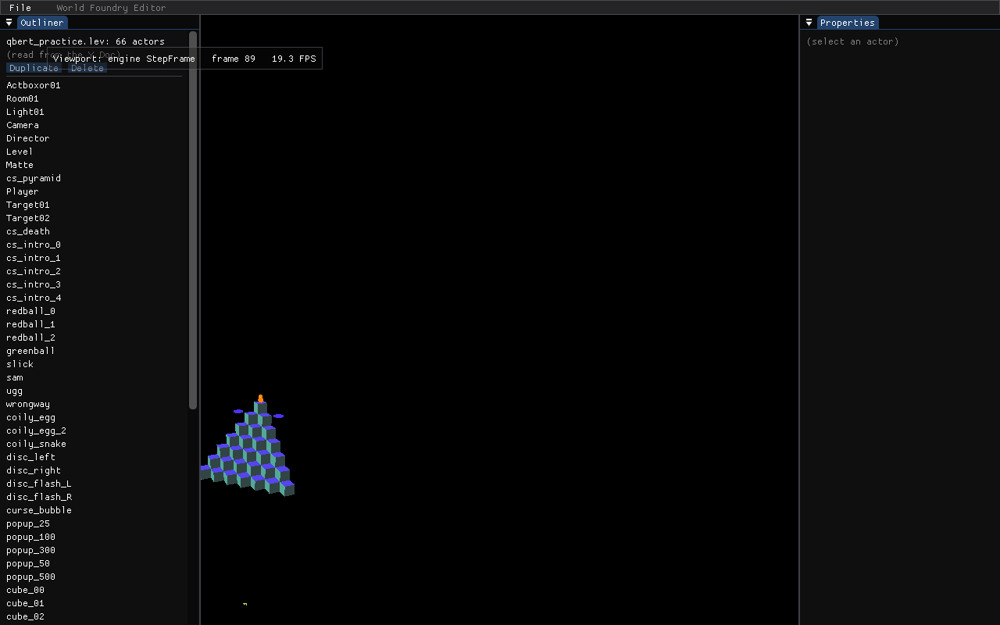
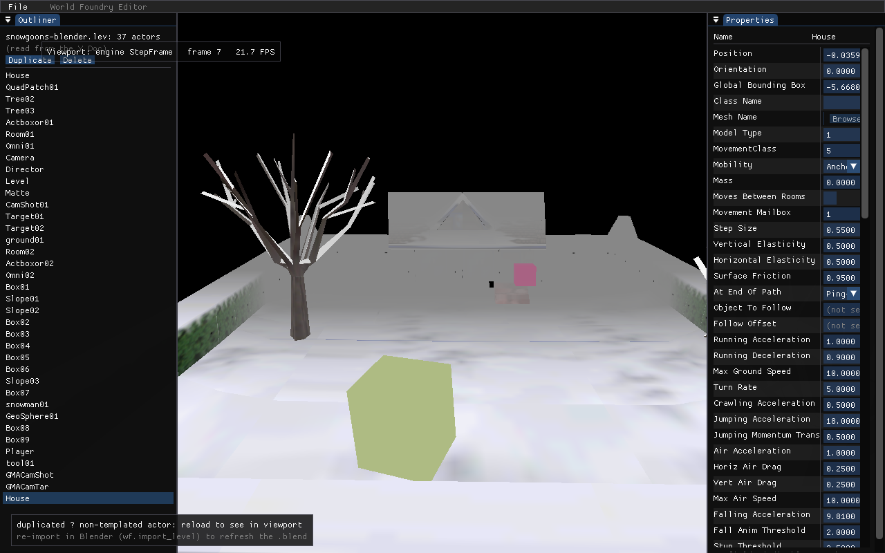
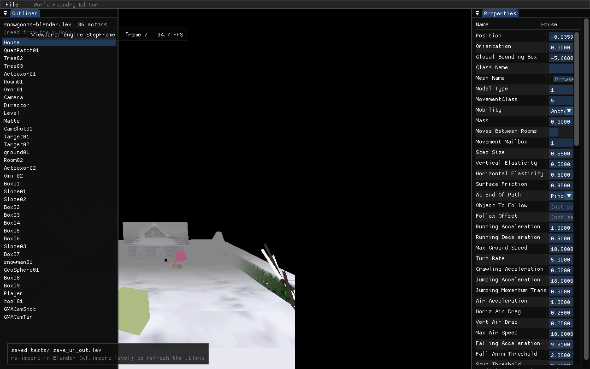
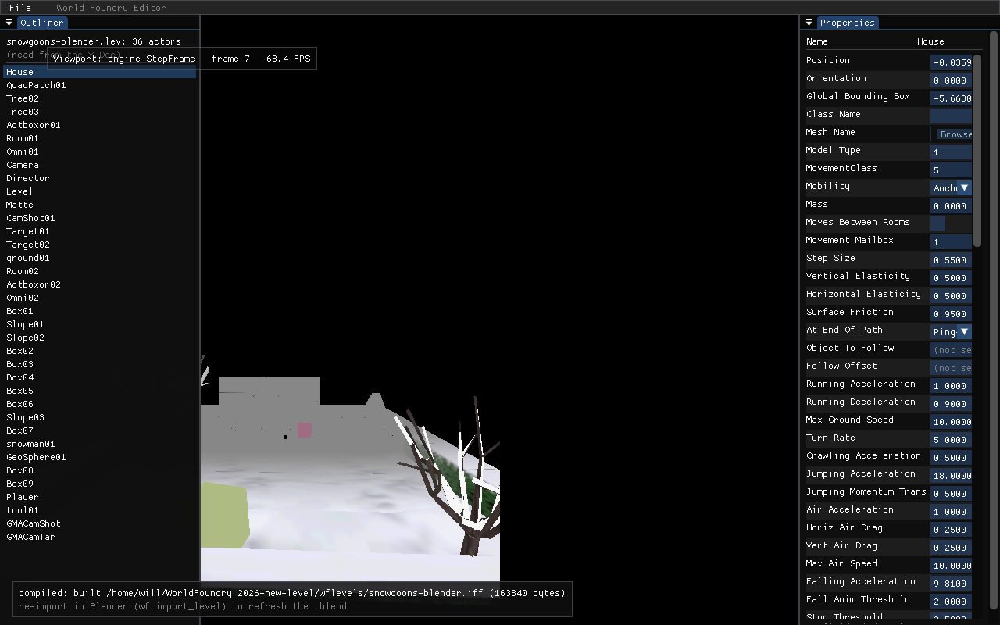
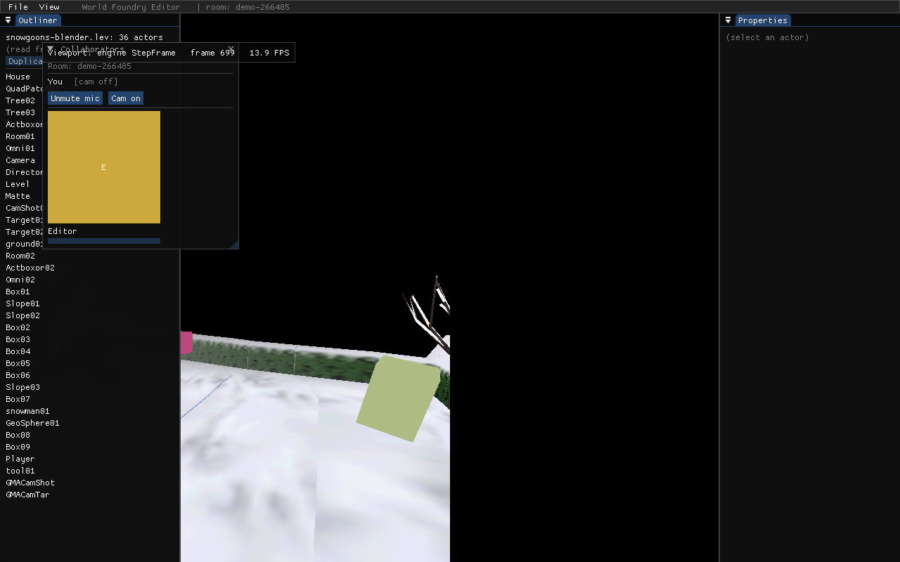

# `wf-edit` — World Foundry collaborative level editor: user manual

**Applies to:** `wf-edit` v1 (Linux/X11 native **and** WASM/WebGL2 browser build), as of 2026-06-13.
**Audience:** level designers and engine developers running the editor.

`wf-edit` is a standalone desktop application that **embeds the World Foundry game
engine** so you can edit a level and *see the change immediately* in a live 3D
viewport — no `.blend` → `.lev` → `.iff` → reload round-trip per tweak. It is built
on [Dear ImGui](https://github.com/ocornut/imgui) + [GLFW](https://www.glfw.org/),
and it represents the level as a [Yrs](https://github.com/y-crdt/y-crdt) CRDT document
(`wfcrdt::Doc`) so multiple designers can eventually edit the same level concurrently.
It also has Zoom/Skype-style **voice + video calling** built in, so collaborators can
see and hear each other without leaving the tool.

> The full design rationale lives in the
> [collaborative level editor design doc](investigations/2026-05-18-collaborative-level-editor-design.md).
> This manual is the *how-to-use-it*; that doc is the *why*.

---

## What works today (v1 scope)

| Capability | State |
|---|---|
| Open a level and render it live in an embedded viewport | ✅ |
| Open a text `.lev`, a compiled binary `.iff`/`.lvl`, or a level from a `cd.iff` archive | ✅ (binary decompiled on load; see [limitations](#known-limitations)) |
| Pick a level from a `cd.iff` at startup with an in-editor picker | ✅ (launch on a bare `cd.iff` → modal level list; viewport tracks the pick) |
| Outliner: list every actor (read from the CRDT `Doc`) | ✅ |
| Properties: every field of the selected actor, with the right widget per type | ✅ |
| Edit a field → it commits to the `Doc` | ✅ |
| Edit Position / Orientation / a movement field → the **viewport updates live** | ✅ (subset — see [Live viewport preview](#live-viewport-preview)) |
| Duplicate / delete actors | ✅ (live for templated actors; otherwise on reload) |
| Save back to `.lev`; compile `.lev` → `.iff` | ✅ |
| Voice + video calling between editor instances in the same room | ✅ (LAN, Linux) |
| Real-time multi-user co-editing over a network (presence, relay, chat, disk persistence) | ✅ (WebSocket relay; only at-rest **BYOK** snapshot encryption is deferred — see [Known limitations](#known-limitations)) |
| Run the **whole editor in a web browser** (WASM/WebGL2) — same C++ ImGui app, co-edit + presence + chat over the relay | ✅ (Linux build cross-compiled to Emscripten; **voice + video too**, via the browser's WebRTC — see [Running in the browser](#running-in-the-browser-wasmwebgl2)) |

**Platform:** the native editor is **Linux/X11 only** in v1 (it adopts an existing GLX
context; Wayland and native mobile hosts are v2+). The **same editor also runs in a web
browser** as a WASM/WebGL2 build (`wf_edit_web`) — see
[Running in the browser](#running-in-the-browser-wasmwebgl2). Either way `wf-edit` builds
**only** when the engine is configured with `WF_ENABLE_EDITOR=ON` (the web target sets it
implicitly via `WF_ENABLE_WEB_EDITOR=ON`); a shipped game build carries none of the editor stack.

---

## Building `wf-edit`

The editor is gated behind `WF_ENABLE_EDITOR` and built as a **Debug** CMake build in
`build-editor/` (GCC). Debug is the typical choice for editor work.

```bash
# from the repo root
cmake -S . -B build-editor -DWF_ENABLE_EDITOR=ON -DCMAKE_BUILD_TYPE=Debug
cmake --build build-editor --target wf-edit -j
```

This produces `build-editor/wf-edit`. Debug host builds default to
ASan+UBSan; pass `-DWF_ASAN=OFF` if you need a faster (un-instrumented) editor.

`WF_ENABLE_EDITOR=ON` also implies `WF_ENABLE_CRDT=ON` (the editor owns the `Doc`).
The `task build-editor` Taskfile target builds the CRDT smoke tests and runs them; the
editor binary itself comes from the `cmake … -B build-editor` invocation above.

### Voice + video prerequisites

Voice and video are **required** on the Linux editor build — CMake configure fails
if either system library is missing:

```bash
sudo apt install libopus-dev libvpx-dev   # Opus (voice) + libvpx VP8 (video)
```

Camera capture uses Linux [V4L2](https://www.kernel.org/doc/html/latest/userspace-api/media/v4l/v4l2.html)
(`/dev/video0`, no extra library); microphone capture uses
[miniaudio](https://miniaud.io/) (already vendored in the engine).

---

## Running `wf-edit`

```bash
./build-editor/wf-edit                          # default level (snowgoons-blender)
./build-editor/wf-edit --level=smb_w1_1          # open a specific level
./build-editor/wf-edit --level=qbert_practice --room=studio-1   # + join a call
```

### Command-line options

| Option | Form | Meaning |
|---|---|---|
| `--level=<name>` | `=` | Level the **engine** loads into the viewport (default `snowgoons-blender`). If omitted, the viewport **auto-tracks** a binary `--leveltree` (a bare `.iff` directly; a `cd.iff:tag` sliced to a temp `.iff`), so the 3D view matches the Outliner. Pass it explicitly to override. |
| `--leveltree=<name>` | `=` | Level the **Outliner/Properties** `Doc` is built from (defaults to match `--level`). Accepts a text `.lev`, a compiled binary `.iff`/`.lvl` (sniffed by content, decompiled on load), or a `cd.iff` archive with a level selector — `<file.iff>:<TAG\|index>` (e.g. `wflevels/cd.iff:L4` or `:1`). Pass a **bare** `cd.iff` (no `:TAG`) and the editor shows a startup level picker. |
| `--pick-level=<TAG\|index>` | `=` | Headless aid: auto-confirm the startup cd.iff picker on the chosen level (equivalent to clicking that row + Open), for screenshots/CI. |
| `--open` | flag | Open the File→Open browser at startup (instead of loading straight into a level). |
| `--open-pick=<path>` | `=` | Headless aid: skip the browser and **re-exec** into `<path>` (a `.iff`/`.lev`/`.lvl`, or `cd.iff:TAG`) on the first frame — the scripted equivalent of picking that file in File→Open. |
| `--room=<id>` | `=` or space | Join a voice + video call room. Omit to run solo (no call started). |
| `--frames <N>` | space | Headless: exit after *N* frames. **Note the space** — `--frames=N` is ignored. |
| `--screenshot <path.ppm>` | space | Headless: dump the composited frame (engine + UI) to a PPM. **Note the space.** |
| `--select=<N>` | `=` | Headless aid: preselect actor *N* in the Outliner. |

> The `--frames` / `--screenshot` space-vs-`=` quirk is a real gotcha: an `=`-joined value
> is silently ignored and the editor runs forever. See
> [the screenshot-capture notes](../.claude/projects/-home-will-WorldFoundry/memory/project_wfedit_screenshot_capture.md)
> for the headless-capture recipe.

---

## Running in the browser (WASM/WebGL2)

The **same C++ ImGui editor** compiles to WebAssembly and runs in any WebGL2 browser — no
JS rewrite, binary-compatible on the wire with native clients in the same relay room. The
engine viewport, Outliner, Properties panel, OAD reader, gizmo, and CRDT bridge are all the
native code paths; only three platform seams change (GLFW-Emscripten owns the WebGL2 canvas
and the engine adopts it; `emscripten/websocket.h` replaces POSIX sockets; the blocking
`RunEditor` loop becomes `RunEditorWeb`/`WebTickEditor` via `emscripten_set_main_loop`).
Co-edit + presence + text chat are fully present. **Voice + video also work** — not via the
native libdatachannel/Opus/libvpx/V4L2 stack (which doesn't port to WASM) but via the browser's
own **WebRTC** (`RTCPeerConnection`, `getUserMedia`, Opus/VP8, DTLS-SRTP, ICE/STUN/TURN): the web
`WebrtcSession`/`VoiceChat`/`VideoChat` are thin shims over a per-peer JS `RTCPeerConnection`
(`engine/wf_edit/webrtc_web.cc`), reusing the **same** relay `CH_SIGNAL` path and offerer rule as
native, so a browser peer and a native `wf-edit` peer share a call in one room. Remote/self video
render as HTML `<video>` overlays positioned over the Collaborators-panel thumbnails. Use the
panel's **Unmute mic** / **Cam on** buttons to grant the camera/mic permission and start sending.

The full bring-up is recorded in the
[wf-edit-in-the-browser plan](plans/2026-06-12-wf-edit-in-the-browser.md); the A/V work in the
[web A/V plan](plans/2026-06-13-web-editor-audio-video.md).

### One-time toolchain setup

The CRDT layer (`wfcrdt`→`libyrs.a`) is Rust cross-compiled to `wasm32-unknown-emscripten`,
which needs an isolated rustup toolchain (the distro Rust can't target it) plus a vendored
`yrs` patch:

```bash
task dev-setup-web-edit      # isolated rustup 1.85.1 + wasm32-unknown-emscripten + yrs patch
```

### Build + serve

```bash
task build-web-edit          # emcmake … -DWF_ENABLE_WEB_EDITOR=ON -DRust_CARGO_TARGET=wasm32-unknown-emscripten
task serve-web-edit          # http://localhost:8081/wf-edit.html
```

`build-web-edit` produces `build-web-edit/wf-edit.{html,js,wasm,data}`. At configure time it
pre-parses the level tree to `<lev>.json` (the browser can't `popen` a native levtree pass)
and `--preload-file`s the level into MEMFS.

### Query-string options

The [`web/shell-edit.html`](../web/shell-edit.html) shell turns query params into the
editor's `Module.arguments` / Emscripten `ENV`:

| Param | Meaning | Default |
|---|---|---|
| `?leveltree=<path>` | Level the Outliner/Properties `Doc` is built from (a preloaded `/level/*.lev`) | `/level/snowgoons-blender.lev` |
| `?level=<path>` | Level the engine renders in the viewport (a preloaded `/*.iff`) | `/snowgoons-standalone.iff` |
| `?room=<id>` | Join a relay co-edit room (omit → local-only) | — |
| `?relay=<url>` | Relay WebSocket URL, e.g. `wss://wf.worldfoundry.org` or `ws://localhost:9900` | — |
| `?wfenv=KEY=VAL` | Set an Emscripten `ENV` var (repeatable) — drives the headless `WF_EDIT_*` hooks below from a URL | — |

```
http://localhost:8081/wf-edit.html?room=studio-1&relay=wss://wf.worldfoundry.org
```

### Co-edit on the web: join-and-receive

A relay room has **one** authoritative `Doc`. When you open a URL with `?room=`, the web
editor **defers** loading the level locally and instead:

- **first peer in** → seeds the room: after a short window with an empty `Doc` it loads the
  level, and (because `observeUpdates` is already wired) every commit auto-pushes to the relay;
- **later peers** → **adopt** the room's `Doc` from the relay and never load locally — so two
  peers can't end up with independent CRDT ids and duplicated actors.

If two peers open a **brand-new** room at the same instant, a **deterministic host election**
picks the seeder (the lowest `peer_id` among present peers); higher-id peers wait and adopt
its seed, so there's no duplication even under a simultaneous race. Solo and staggered joins
behave as you'd expect (the first peer seeds, later peers adopt).

Presence (peer cursors / camera frustums / selection rings) and text chat then flow over the
same relay exactly as on native. Each browser tab mints its **own** random `peer_id` (there's
no persisted `identity.json` in the browser), so tabs appear as distinct collaborators.

Join-and-receive works **across implementations**: a native `wf-edit` host seeds a room and
a browser peer adopts its Doc (and vice-versa) — native now defers its startup Doc load when
joining a relay room and pushes the seed via the same mechanism as web. (Verified native-host
→ web-joiner, 36 actors adopted.) The one residual is the *native-native* simultaneous-join
race into a brand-new room, which doesn't yet use the presence-based host election the web
side has; staggered/real-world native joins are fine.

### Saving on the web

There is **no local filesystem or shell** in the browser, so **Save** and **Save + Compile**
are hidden — `Save + Compile` shells out to the build pipeline, and a plain `.lev` *save*
can't write to a path you can reach. The durable copy of your work is the **relay's room
snapshot** (co-editors converge on it).

To get your work *out*, use **File → "Export .lev…"** (or <kbd>Ctrl</kbd>+<kbd>S</kbd>): it
downloads a real **canonical `.lev`**, printed entirely **in-browser**. The `levtree` printer
(`levtree print`'s logic) is cross-compiled to WebAssembly and linked into the editor
(`liblevtree.a`), so there's no subprocess — the same chunk tree the native **Save** feeds to
`levtree print` is converted in-process. Re-import the downloaded `.lev` into the golden
`.blend` via the Blender add-on (`wf.import_level`) to refresh it.

> Verified end-to-end: a headless browser export produces a `.lev` **byte-identical** to the
> native `levtree print` (36 actors, 257 426 bytes). If the in-wasm print ever fails, Export
> falls back to downloading the levtree JSON (convertible with a native `levtree print
> <file>.lev.json`).

Optional cross-session **IDBFS** persistence (so MEMFS state survives a reload) remains a
tracked follow-up — see [Save semantics on web](plans/2026-06-12-wf-edit-in-the-browser.md).

### Verifying it headlessly

The browser build accepts the same `WF_EDIT_*` hooks as native (via `?wfenv=`). Because two
independently fast-forwarding `--virtual-time-budget` tabs barely co-exist in wall-clock (20 s
of virtual time burns in ~1.4 s real), live cross-peer presence is best verified with a
**real-time** driver — a dependency-free Node-22 CDP script that opens two tabs with
`Target.createTarget` and reads each tab's console, keeping both live for the exchange. This is
how presence + chat were verified browser↔browser
([`108b775a`](https://github.com/wbniv/WorldFoundry/commit/108b775a)).

---

## The editor window



The window is an ImGui **dockspace** with a menu bar and three docked panels. Panels are
dockable/resizable — drag a tab to rearrange.

- **Menu bar** (top) — `File` (**Open Level…** / Save / Save + Compile), and `View` (toggle
  the Collaborators panel) when a call is active. The room ID is shown to the right when joined.
- **Outliner** (left) — every actor in the level, read from the CRDT `Doc`. The header
  shows the level name and actor count (e.g. *snowgoons-blender.lev: 36 actors*). Click a
  row to select it.
- **Viewport** (center) — the live engine render. The overlay shows the current frame
  number and FPS. This is the real engine stepping each frame, not a static preview.
- **Properties** (right) — the selected actor's fields. Empty (*"(select an actor)"*) until
  you click a row in the Outliner.

---

## Selecting and inspecting actors

Click an actor in the Outliner to populate the Properties panel with its full field list.
The panel resolves each actor to its class schema (`.oad`) and renders **the right widget
per field type** — numeric spinners, enum dropdowns, checkboxes, colour swatches, file
pickers, object references, and so on.



Field names, values, enum labels, and the actor's class all come straight from the
self-describing `.lev`; the `.oad` schema supplies the widget type, enum option lists, and
min/max ranges. Fields the schema doesn't name (the per-instance
`Position`/`Orientation`/`Global Bounding Box`/`Class Name` header) fall back to a
chunk-type widget, and anything still unrecognised degrades to raw monospace text rather
than failing.

---

## Editing properties

Every widget is editable. An edit commits to the actor's leaf in the CRDT `Doc`; re-reading
the `Doc` reflects it. Numeric edits preserve the level's fixed-point `(1.15.16)` / `l`
long suffix so they survive the save round-trip, and ints/floats clamp to the schema's
min/max.



Widget behaviour by field type:

| Field type | Widget | Notes |
|---|---|---|
| Int / Float | Spinner | Clamped to the schema's Min/Max. |
| `VEC3` / `BOX3` | 3 (or 6) float fields | e.g. Position, Bounding Box. |
| `EULR` (orientation) | 3 angle fields | **In revolutions** (0 ≤ rev < 1), not degrees/radians. |
| Enum | Dropdown | Full option list from the `.oad`; writes the label (+ index when present). |
| Boolean | Checkbox | |
| Colour | Swatch / picker | `showAs=COLOR` fields, e.g. background colours. |
| Mesh / file | Text + **Browse** | |
| Object reference | Actor name | Shows ⚠ if the referenced actor is missing. |
| Mailbox | Spinner (today) | Named-constant autocomplete from `mailbox.inc` is planned. |
| String | Inline / multi-line | |

> **Conventions that bite if you forget them:** orientation is in *revolutions*; the
> integer-vs-float distinction matters for the fixed-point suffix; and zForth's `/` is
> float division. These are documented in
> [docs/level-design-troubleshooting.md](level-design-troubleshooting.md).

---

## Live viewport preview

This is the headline feature: an edit in the Properties panel can change what you see in
the viewport *on the next frame*. Editing the snowgoons House's `Position` Z lifts it off
the snow:

| Before (`Position.Z = −0.125`) | After (`Position.Z = 6.0`) |
|---|---|
|  |  |

**What propagates live (v1):** `Position`, `Orientation`, and ~15 movement/physics
fields — `Mass`, `Mobility`, `Step Size`, `Max Ground Speed`, and the rest of that set.
Editing these moves/rotates the actor or changes its physics behaviour across stepped
frames.

**What does *not* update the viewport yet:** every other field still edits the `Doc`
(and saves correctly), but the bridge logs *"no engine mapping yet"* and the on-screen
actor is unchanged. Most of these (elasticities, bounding box, script, notes) produce no
visible change even when applied.

> The ~15-field limit is in the **editor's bridge**, not the engine: the engine's mutation
> API (`wfmut`) now accepts 77 fields (auto-generated from the schema), but the editor's
> `engine_bridge` keeps its own ~15-entry name→path table for routing panel edits. Widening
> the editor's live-preview coverage to match is a planned follow-up.

Sync is **one-way**, `Doc` → engine: the viewport reflects your edit because the engine
re-renders the mutated actor; physics moving an actor does **not** write back into the
`Doc`. The `Doc` stays the source of truth.

---

## Adding and deleting actors

With an actor selected, the Outliner shows **Duplicate** and **Delete** buttons (and the
<kbd>Delete</kbd> key deletes the selection when you're not typing in a field):



- **Delete** removes the actor from the `Doc`. Surviving actors keep propagating live; the
  saved `.lev` has the actor gone.
- **Duplicate** clones the selected actor's full chunk subtree and appends it.
  - For a **template-spawnable** actor (e.g. a generator/enemy), the clone appears **live**
    in the viewport.
  - For a **non-templated** actor (e.g. a House), the clone exists in the `Doc` and saves
    correctly, but you won't see it in the viewport until you reload the saved level — a
    toast explains this.

After a structural edit the actor count updates immediately (here, a duplicated House
brings snowgoons to 37 actors):



> There is **no undo** for add/delete in v1. Save deliberately (it overwrites the `.lev`),
> and keep your `.blend` as the golden source.

---

## Saving and compiling

The `File` menu has these actions:

- **Open Level…** (<kbd>Ctrl</kbd>+<kbd>O</kbd>) — opens a file browser rooted at `wflevels/`
  (subdirs + `.iff`/`.lev`/`.lvl`). Opening a level **re-execs** the editor into the pick
  (preserving `--room`/`--relay`); a bare `cd.iff` re-shows the startup level picker. A fresh
  process sidesteps any in-place engine/bridge reset. With unsaved changes, a "discard
  changes?" confirm fires first.
- **Save Level** (<kbd>Ctrl</kbd>+<kbd>S</kbd>) — writes the `Doc` back to the level's
  `.lev` source. A toast confirms the path. When the session was loaded from a **read-only
  binary** source (a `.iff`/`.lvl` or a level out of a `cd.iff`), this item reads
  **"Save As .lev"** instead — the save target is a fresh `.lev`, not a round-trip to the binary.
- **Save + Compile (.iff)** — saves, then runs the 5-stage `build_level_binary.sh`
  pipeline to produce the engine-loadable `.iff`. This blocks the frame for the few
  seconds the build takes; the live engine is **not** auto-reloaded — the fresh `.iff` is
  there for the next play/load.



A successful compile reports the built artifact and its size in the toast:



**Golden-source note:** the saved `.lev` is *comment-free canonical* output (the
enum/axis `//` hints in a hand-authored `.lev` are schema-derived and regenerated, not
preserved). Because `.lev` → `.blend` re-import already exists
([`wf.import_level`](../wftools/wf_blender/export_level.py) in the Blender add-on), an
editor-saved `.lev` round-trips back into the golden `.blend` — the toast reminds you to
re-import there. Keep the `.blend` authoritative for shipped levels.

---

## Collaboration: voice + video

When you pass `--room=<id>`, the editor joins a call room. Editors started with the **same
room ID** on the same LAN discover each other automatically and can see + hear one another.

```bash
# two terminals, same room — they find each other:
./build-editor/wf-edit --level=qbert_practice --room=studio-1
./build-editor/wf-edit --level=qbert_practice --room=studio-1
```

The **Collaborators** panel (toggle via the `View` menu) shows your self-preview, per-peer
video thumbnails (or a coloured initials avatar when a peer has no camera), an audio level
meter per peer, and **Mute mic** / **Cam off** buttons:

```
┌─ Collaborators ─────────────────────────────┐
│ Room: studio-1                              │
│                                             │
│ You      (live)                             │
│  [ Mute mic ]   [ Cam off ]                 │
│ ─────────────────────────────────────────  │
│  ┌──────────┐  ┌──────────┐                │
│  │ [video]  │  │   (B)    │   ← initials    │
│  │ Alice    │  │  Bob     │     avatar      │
│  │ ████░░░░ │  │ ░░░░░░░░ │   ← level meter │
│  └──────────┘  └──────────┘                │
│                                             │
│  No peers? Share the room ID to invite.     │
└─────────────────────────────────────────────┘
```

Two editor instances in the same room (`--room=demo-266485`), each seeing the other. The
peer has no camera, so it shows as a coloured initials avatar (**E** for "Editor", the
fixed v1 display name); the self row reads *[cam off]* with *Unmute mic* / *Cam on* toggles:



**How it works (LAN v1):** peer discovery is a heartbeat beacon broadcast every 2 s on
multicast group `239.255.42.99:9877`, filtered by room ID. Voice is
[Opus](https://opus-codec.org/) (48 kHz mono, 20 ms frames) over UDP; video is
[VP8](https://www.webmproject.org/vp8/) (libvpx) from a V4L2 camera over UDP, fragmented to
fit the MTU. Each editor binds **ephemeral** UDP ports (OS-assigned), so several instances
can run on one machine. Your display name is currently fixed to *"Editor"*.

**Limitations:** audio is a flat stereo mix (no spatialisation). Text chat rides the separate
WebSocket co-editing relay, not this voice/video path. If `/dev/video0` is absent you appear
with an initials avatar (audio-only).

> **Note:** the "How it works (LAN v1)" description above predates the WebRTC transport. Media
> now flows over **WebRTC (DTLS-SRTP, ICE + STUN)** rather than raw multicast UDP, so calls
> reach peers across the internet — see [Calls over the internet](#calls-over-the-internet-stun--turn).

### Host a call (quick tunnel) — zero-config "share a link"

The easiest way to call a collaborator across the internet: **Collaborate → Host a call (quick
tunnel)**. The editor re-launches into the call, spins up a local signalling relay (`wf-relay`)
and a [Cloudflare quick tunnel](https://developers.cloudflare.com/cloudflare-one/connections/connect-networks/do-more-with-tunnels/trycloudflare/)
(`cloudflared`), and shows a copyable invite link:

```
wfedit+s://<random>.trycloudflare.com/r/<room>
```

Send that link to a collaborator; they paste it (or run `wf-edit … <link>`) and join. No
self-hosted relay, no router config. Signalling is `wss://` (TLS); media stays DTLS-SRTP
peer-to-peer (or via TURN), never through the tunnel.

- **First run:** `task fetch-cloudflared` (also pulled in by `task dev-setup-editor`) downloads
  the pinned, SHA256-verified `cloudflared` to `build-editor/tools/`. It is not committed.
- **From the shell:** `task quick-tunnel` does the same and prints the link, without the editor.
- **Works behind a VPN:** the tunnel is forced onto `--protocol http2` (TCP), so it survives
  VPNs that block QUIC/UDP (e.g. WireGuard). It can take ~10–20 s to come up — the loading panel
  shows *Establishing → Registering → Resolving*; if it can't (outbound port 7844 blocked, or
  Cloudflare rate-limited the account-less tunnel), it reports the reason instead of hanging.
- **Ephemeral:** the link lives only for that session, and account-less quick tunnels are
  rate-limited. For durable/team hosting, run a named tunnel or a fixed relay (planned).

#### Two computers

The minimum for a real cross-network call between two people:

```bash
# computer 1 — host
# quick tunnel (zero-config, ephemeral URL):
task quick-tunnel
# named tunnel (stable hostname, needs one-time CF setup — see below):
task named-tunnel ROOM=studio-1
# → copy the printed   wfedit+s://<host>/r/<room>   link

# computer 2 — joiner (needs only wf-edit built; no cloudflared)
task join ROOM=<room>
```

Each machine has its own `~/.config/wf-edit/identity.json` (auto-generated on
first run), so the two appear as distinct collaborators (different `peer_id` +
colour) in the Collaborators panel. Edits you make on one — drag the move/rotate
gizmo, change a field — sync live to the other through the same `wss://` relay;
voice/video go peer-to-peer (DTLS-SRTP) or via a configured TURN (see below).

> **Verifying voice/video actually flows (not just connects):** run both sides
> with `WF_COLLAB_VOICE_DEBUG=1` for per-second `voice-dbg: send/recv` Opus stats
> on stderr. Full step-by-step (incl. forcing the TURN path from a VPN) in the
> [two-machine voice/video run sheet](wf-edit-two-machine-voice-test.md).
>
> **Verifying the *editing* path end-to-end** (connect over a named tunnel, live
> edit sync, mid-session reconnect, fail-fast/closeable connect): the
> [two-machine internet run sheet](wf-edit-two-machine-internet-test.md).

#### Named tunnel — durable, rate-limit-free, stable hostname

Account-less quick tunnels are throttled by Cloudflare per source IP, and the
`*.trycloudflare.com` host changes every session. If you have a Cloudflare
account and a domain, you can host through an **authenticated named tunnel**
instead — no rate limit, and a hostname you pick stays the same forever. The
zero-config quick tunnel remains the default; this is purely opt-in.

**No secret to keep.** Setup uses `cloudflared`'s own login, which stores a
credential (mode `0600`) under `~/.cloudflared/` that `cloudflared` owns — you
never paste or save a token anywhere, and wf-edit never stores one.

**One-time setup on the host machine** — ✅ done (`wf-host` → `wf.worldfoundry.org`).
Credential in `~/.cloudflared/` on Will's laptop. To host from a machine that doesn't
have `~/.cloudflared/` yet, copy `cert.pem` + `<UUID>.json` there (joiner role needs nothing).

For reference ([`cloudflared` docs](https://developers.cloudflare.com/cloudflare-one/connections/connect-networks/get-started/create-local-tunnel/)):

```bash
cloudflared tunnel login                       # browser auth → ~/.cloudflared/cert.pem (0600)
cloudflared tunnel create wf-host              # → tunnel UUID + ~/.cloudflared/<UUID>.json
cloudflared tunnel route dns wf-host wf.worldfoundry.org   # CNAME → the tunnel
```

Tell `wf-edit` the tunnel **name + hostname** (no secret) in
`~/.config/wf-edit/identity.json`:

```json
{
  "tunnel_name":     "wf-host",
  "tunnel_hostname": "wf.worldfoundry.org"
}
```

(Or set `WF_COLLAB_TUNNEL_NAME` / `WF_COLLAB_TUNNEL_HOSTNAME` in the env for a
one-off run — env wins per-field.)

Then host with:

```bash
task named-tunnel ROOM=studio-1
```

Defaults to `wf-host` → `wf.worldfoundry.org`. Override with env if you have a different tunnel.

The editor runs `cloudflared tunnel run wf-host`: the loading panel skips the
*Establishing* phase (the hostname is fixed), the share link looks like
`wfedit+s://wf.worldfoundry.org/r/studio-1`, and there's no rate limit.

The joiner side needs nothing extra:

```bash
task join ROOM=studio-1
```

Empty / missing config → automatic fall-back to the quick tunnel; if the named
tunnel fails to start (not logged in, wrong name, wrong ingress), it fails loudly
with the cloudflared log instead of silently downgrading.

> **Legacy token model.** A dashboard-created tunnel hands you a connector
> *token* instead; wf-edit still accepts it (`tunnel_token` in `identity.json` /
> `WF_COLLAB_TUNNEL_TOKEN`), but the login model above is preferred precisely
> because it leaves no long-lived secret for you to safeguard.

#### Trying it on one machine (testing)

For two editors **on the same machine** you must give them distinct config dirs,
otherwise they share an `identity.json` and look like one peer:

```bash
XDG_CONFIG_HOME=/tmp/wfedit-A  task named-tunnel ROOM=test1 CLI_ARGS=wflevels/cd.iff       # host
XDG_CONFIG_HOME=/tmp/wfedit-B  task join URL='wfedit+s://...' CLI_ARGS=wflevels/cd.iff     # joiner
```

### Calls over the internet (STUN + TURN)

Media uses **WebRTC**: ICE picks the best path between peers, **STUN** (a public Google server
by default) discovers each peer's public address for hole-punching, and **DTLS-SRTP** encrypts
all audio/video end-to-end — a relay only ever sees ciphertext. This connects ~75–85 % of peer
pairs directly (peer-to-peer, no media server).

The remaining pairs (symmetric NAT / CGNAT) need a **TURN relay** to forward the encrypted
media. Point the editor at one with these settings — environment variables override the
persisted values in `~/.config/wf-edit/identity.json` per-field, so a single run can target a
test server without editing the file:

| Setting | `identity.json` key | Environment variable | Default |
|---------|--------------------|----------------------|---------|
| STUN server URL | `stun_url`† | `WF_COLLAB_STUN` | `stun:stun.l.google.com:19302` |
| TURN host (`host` or `host:port`) | `turn_host` / `turn_port` | `WF_COLLAB_TURN` | *(none → STUN-only)* |
| TURN username | `turn_user` | `WF_COLLAB_TURN_USER` | — |
| TURN password | `turn_pass` | `WF_COLLAB_TURN_PASS` | — |
| TURN-over-TLS (TURNS) | `turn_tls` | `WF_COLLAB_TURN_TLS` | off |
| Force relay-only path | *(env only)* | `WF_COLLAB_FORCE_RELAY` | off |
| Receive-only (no camera) | *(env only)* | `WF_COLLAB_NO_CAM` | off |

> † `stun_url` is set via env; only the TURN fields persist to `identity.json` in this version.

`WF_COLLAB_NO_CAM=1` joins a call **receive-only** — it skips opening the webcam entirely
(you still hear/see others; the mic stays governed by Mute). Handy for joining as a
viewer/listener, and for headless tests on a shared machine where you don't want the camera LED
coming on. (Native build; the browser build never opens a device until you click **Cam on**.)

```bash
# Point a session at a TURN server for this run only:
WF_COLLAB_TURN=turn.example.com:3478 \
WF_COLLAB_TURN_USER=demo WF_COLLAB_TURN_PASS=secret \
  ./build-editor/wf-edit --level=qbert_practice --room=studio-1
```

`WF_COLLAB_FORCE_RELAY=1` makes ICE use **only** the relay path — useful for confirming a TURN
server works (on a LAN, ICE would otherwise pick a direct path and never touch the relay).
Force-relay does **not** weaken encryption: the relay still only forwards DTLS-SRTP ciphertext.

**Deferred:** running a *production* TURN server (a public host carrying media bandwidth) and the
choice between self-hosting [coturn](https://github.com/coturn/coturn) and a managed service like
[Cloudflare Calls](https://developers.cloudflare.com/calls/) — along with ephemeral, time-limited
TURN credentials (long-term shared secrets shipped in a client are unsafe). The client code is
identical for either host, so this decision stays open. See
[the hosting investigation](investigations/2026-05-26-internet-voice-video-nat-traversal.md) and
[Phase 3 plan](plans/2026-05-27-webrtc-phase3-turn-generic-client.md).

---

## Keyboard shortcuts

| Key | Action |
|---|---|
| <kbd>Ctrl</kbd>+<kbd>O</kbd> | Open Level… (file browser; re-execs into the pick) |
| <kbd>Ctrl</kbd>+<kbd>S</kbd> | Save Level / Save As .lev (when not typing in a field) |
| <kbd>Delete</kbd> | Delete the selected actor (when not typing in a field) |

---

## Headless / automation hooks

For CI, screenshots, and scripted verification, the editor exposes environment-variable
hooks that drive one action and (mostly) exit. These are **not** part of the interactive
workflow — they exist so the editor can be proven headlessly.

| Env var | Effect |
|---|---|
| `WF_EDIT_SAVE=<path>` | Save the `Doc` to `<path>.lev` (CPU-only, before GL), then exit. |
| `WF_EDIT_SAVE_UI=<path>` | Drive File→Save once *inside* the frame loop (so the toast renders for a screenshot). |
| `WF_EDIT_COMPILE=1` | Drive Save + Compile once. |
| `WF_EDIT_TEST_SET="Field\|DATA\|new text"` | With `--select=N`: write one leaf on actor *N* (headless edit proof). |
| `WF_EDIT_STRUCT_TEST=…` | Headless structural edit (duplicate/delete) proof. |
| `WF_EDIT_STRUCT_UI=dup\|del` | Drive a structural edit once through the Outliner UI path. |
| `WF_EDIT_BRIDGE_DEBUG=1` | Dump the `Doc`↔engine actor-index map + field translations on the first frame. |
| `WF_EDIT_BRIDGE_TEST="Field Name\|new DATA"` | Edit a leaf as the panel would, propagate through the bridge, log before/after engine position. |
| `WF_EDIT_REMOTE_TEST="<docB>\|<x y z>"` | With `--select=A` (A≠B): apply a **remote**-origin Position edit to actor *B* and confirm the deep observer alone moves it in the engine. |
| `WF_EDIT_DRAGLOCK_TEST=1` | With `--select=N`: prove the active-drag transform lock — a remote edit to a simulated-dragged actor (non-transform *and* Position) leaves it put, and propagation resumes on release. |
| `WF_EDIT_SPAWN_CONFIRM_TEST=1` | Verify the `SpawnActor` runtime path (run with `--frames 5`). |
| `WF_EDIT_AUTO_SELECT=N` | Preselect actor *N* at startup so the editor broadcasts a selection ring without a click (presence/shared-cursor screenshots). |
| `WF_EDIT_CHAT_SEND="<text>"` | Once a peer is present in the room, broadcast one `CH_CHAT` frame with `<text>` (then never again) — proves chat delivery headlessly without driving the ImGui input. Gating on a present peer guarantees the receiver is connected. |
| `WF_EDIT_EXPORT=1` | **Web build only.** Drive File → Export once (triggers the levtree-JSON Blob download), so a CDP run with `Browser.setDownloadBehavior` can capture + validate the file. |

---

## Known limitations

- **Networked co-editing shipped** (presence/awareness cursors, a WebSocket `wf-relay`
  server, conflict-free remote merges, text chat, and debounced disk persistence of each
  room). The one deferred piece is **BYOK** at-rest snapshot encryption: the relay's
  snapshot writer takes a `wrap: bytes → bytes` hook that is identity today, leaving room
  to drop in customer-key encryption later without re-encoding existing snapshots.
- **Voice/video is LAN-only** (multicast discovery; no STUN/relay/remote peers). Text chat
  is available separately over the WebSocket co-editing relay.
- **Live viewport preview** covers Position/Orientation + all 77 common/movebloc/mesh OAD
  fields (the full generated field map) — they propagate live through the CRDT→engine
  bridge. The one exception is **mesh geometry** (Model Type / Tiles / Map): the value
  reaches the engine's mesh block, but the actor's render mesh is built once at spawn and
  isn't rebuilt live, so those three need a reload to be *seen*.
- **Undo/redo** is native (Ctrl+Z / Ctrl+Y) for field, gizmo, and structural edits via the
  Yrs `UndoManager`; remote peers' edits stay out of your local undo history.
- **While you drag an actor with the gizmo,** a concurrent edit to that actor from a remote peer
  (or your own undo) won't snap it back mid-gesture — the drag owns its transform until you release
  the mouse, then last-writer-wins resolves the transform. Other fields still propagate live.
- **Loads compiled binary levels; saving always produces a new standalone file.** The editor opens a
  text `.lev`/`.iff.txt`, a compiled bare `.iff`/`.lvl`, **and** a level selected out of a `cd.iff`
  archive (`--leveltree=wflevels/cd.iff:L4`) — a binary input is decompiled on load via
  `levcomp decompile`
  ([`wftools/levcomp-rs/src/decompile.rs`](../wftools/levcomp-rs/src/decompile.rs)). A binary-loaded
  level is fully editable; Save writes *out* to a new `.lev`, and **Save + Compile (.iff)** recompiles
  that to a bare `.iff` through the normal pipeline. Saving back **into** a multi-level `cd.iff`
  (rebuilding the archive in place) is by design **not** a feature — a `cd.iff` is read-only input,
  and you always save out as a new file. Also note: binary levels carry no authored object names
  (cross-references are stored by actor index; the decompiler synthesizes `{Class}_{index}` names),
  so a `.lev` saved from a binary load is a fresh derivative, not a round-trip to the original
  Blender/`.lev` source. See the [load-binary-iff plan](plans/2026-05-25-wf-edit-load-binary-iff.md).
- **Native build is Linux/X11 only.** Wayland and native mobile hosts are v2+. The editor
  also runs as a **WASM/WebGL2 browser build** ([Running in the browser](#running-in-the-browser-wasmwebgl2)),
  which is cross-platform via the browser but drops voice/video and Save+Compile (native+web
  seed interop is a tracked follow-up — see that section).

---

## Where to learn more

- [Collaborative level editor — design exploration](investigations/2026-05-18-collaborative-level-editor-design.md) — concept, mockups, widget taxonomy, roadmap.
- Implementation plans (each with screenshots):
  [app shell](plans/2026-05-20-editor-app-shell.md) ·
  [property panel](plans/2026-05-20-editor-property-panel.md) ·
  [CRDT→engine bridge](plans/2026-05-20-crdt-engine-bridge.md) ·
  [save round-trip](plans/2026-05-21-editor-save-roundtrip.md) ·
  [outliner add/delete](plans/2026-05-21-outliner-add-delete.md) ·
  [live structural sync](plans/2026-05-21-live-structural-sync.md) ·
  [voice + video](plans/2026-05-21-voice-video-collab.md) ·
  [wf-edit in the browser (WASM/WebGL2)](plans/2026-06-12-wf-edit-in-the-browser.md).
- [docs/level-building.md](level-building.md) and
  [docs/level-design-troubleshooting.md](level-design-troubleshooting.md) — the level
  designer's reference and gotcha log.
